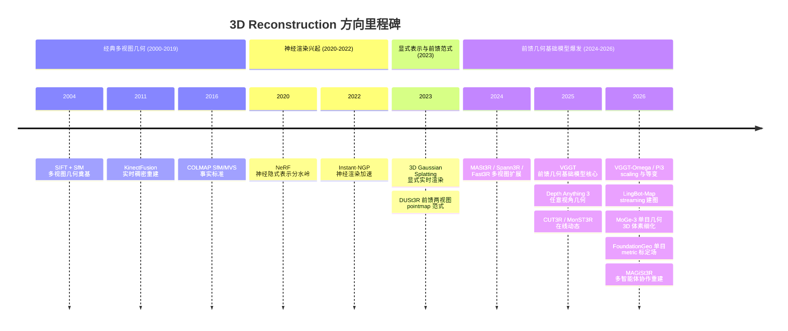

# 3D Reconstruction 方向发展全景（2000 → 2026）

> 目的：给这个方向一张从经典多视图几何到前馈式几何基础模型的发展脉络图，标出仓库**已分析**与**待补充**的论文，作为逐篇深挖的路线图。
> 约定：2021 年之前只标里程碑式工作；2021 年之后逐渐细化。✅ = 已有独立分析文件；🟡 = 仅在对比报告中提及、无独立分析；⬜ = 尚未纳入。

## 结论先行

- 仓库现有分析**高度集中在 2024–2026 的前馈式视觉几何基础模型**（VGGT 系、DA3、Pi3、streaming 类），这是当前最前沿的一段。
- 但这条线的**直接源头 DUSt3R（2023）与核心奠基 VGGT 本体（2025）尚未独立分析**——目前分析的 VGGT-Ω / Pi3 / DA3 都建立在它们之上。
- 2021 年之前的经典基石（COLMAP、NeRF、3DGS）完全空白，缺少历史锚点。
- 补全优先级：DUSt3R → VGGT → 3DGS → NeRF → COLMAP，然后再填 2024–2025 的 MapAnything / MASt3R / CUT3R 等。

## 1. 发展时间轴（Mermaid，GitHub 原生渲染）

> 说明：Mermaid `timeline` 在 GitHub 网页会渲染成时间轴图；在 Obsidian 中需启用 Mermaid（内置，默认开）。节点内不能放链接，具体论文链接见下方状态清单。

## 2. 分析状态清单（含链接与缺口）

### 经典多视图几何期（2000–2020，只标里程碑）

| 状态 | 年份 | 工作 | 为什么是里程碑 | 分析文件 |
|---|---:|---|---|---|
| ✅ | 2004 | SIFT | 尺度不变特征，特征匹配 + 对极几何/SfM 的理论与工程基石 | [2004-sift](../../papers/3d-reconstruction/2004-sift.md) |
| ✅ | 2011 | KinectFusion | 实时稠密 TSDF 重建 + ICP 跟踪，深度相机重建代表 | [2011-kinectfusion](../../papers/3d-reconstruction/2011-kinectfusion.md) |
| ✅ | 2016 | COLMAP | SfM/MVS 事实标准，至今是重建/位姿 benchmark 基线 | [2016-colmap](../../papers/3d-reconstruction/2016-colmap.md) |
| ✅ | 2020 | NeRF | 神经隐式场景表示，重建/新视图合成分水岭 | [2020-nerf](../../papers/3d-reconstruction/2020-nerf.md) |

### 神经渲染 & 显式表示期（2021–2023）

| 状态 | 年份 | 工作 | 定位 | 分析文件 |
|---|---:|---|---|---|
| ✅ | 2022 | Instant-NGP | 多分辨率哈希编码，把 NeRF 训练/推理加速数量级 | [2022-instant-ngp](../../papers/3d-reconstruction/2022-instant-ngp.md) |
| ✅ | 2023 | 3D Gaussian Splatting | 显式实时可微渲染，当前主流场景表示 | [2023-3dgs](../../papers/3d-reconstruction/2023-3dgs.md) |
| ✅ | 2023 | DUSt3R | 前馈两视图 pointmap，开启"无位姿前馈重建"范式 | [2023-dust3r](../../papers/3d-reconstruction/2023-dust3r.md) |

### 前馈几何基础模型爆发期（2024–2026）

| 状态 | 年份 | 工作 | 定位 | 分析文件 |
|---|---:|---|---|---|
| ✅ | 2024 | MASt3R / MASt3R-SfM | DUSt3R + 局部特征匹配 | [2024-mast3r](../../papers/3d-reconstruction/2024-mast3r.md) |
| ✅ | 2024 | Spann3R | DUSt3R + 空间记忆，在线增量重建、去全局对齐 | [2024-spann3r](../../papers/3d-reconstruction/2024-spann3r.md) |
| ✅ | 2025 | Fast3R | 一次前向重建 1000+ 图，多视图并行 | [2025-fast3r](../../papers/3d-reconstruction/2025-fast3r.md) |
| ✅ | 2024 | MV-DUSt3R+ | 稀疏多视图单阶段重建（2 秒级） | [2024-mv-dust3r](../../papers/3d-reconstruction/2024-mv-dust3r.md) |
| ✅ | 2025 | VGGT | 前馈视觉几何基础模型核心（CVPR 2025 Best Paper） | [2025-vggt](../../papers/3d-reconstruction/2025-vggt.md) |
| ✅ | 2025 | Depth Anything 3 | 任意视角 depth-ray 几何统一输出 | [2025-depth-anything-3](../../papers/3d-reconstruction/2025-depth-anything-3.md) |
| ✅ | 2025 | MapAnything | metric promptable 几何，自动驾驶主候选 | [2025-mapanything](../../papers/3d-reconstruction/2025-mapanything.md) |
| ✅ | 2025 | OmniVGGT | VGGT 几何先验 adapter，注入 any-prior | [2025-omnivggt](../../papers/3d-reconstruction/2025-omnivggt.md) |
| ✅ | 2025 | HunyuanWorld-Mirror | any-prior 世界重建 / 3DGS / NVS | [2025-hunyuanworld-mirror](../../papers/3d-reconstruction/2025-hunyuanworld-mirror.md) |
| ✅ | 2025 | CUT3R | 持续状态在线 / 流式重建 | [2025-cut3r](../../papers/3d-reconstruction/2025-cut3r.md) |
| ✅ | 2025 | MonST3R | 动态场景逐帧 pointmap | [2025-monst3r](../../papers/3d-reconstruction/2025-monst3r.md) |
| ✅ | 2025 | MegaSaM | 随手拍动态视频的快速鲁棒 SfM + 一致深度 | [2025-megasam](../../papers/3d-reconstruction/2025-megasam.md) |
| ✅ | 2026 | VGGT-Ω | VGGT scaling + register attention + 动态 | [2026-vggt-omega](../../papers/3d-reconstruction/2026-vggt-omega.md) |
| ✅ | 2026 | Pi3 | permutation-equivariant reference-free 几何 | [2026-pi3](../../papers/3d-reconstruction/2026-pi3.md) |
| ✅ | 2026 | LingBot-Map | streaming pose/depth/point cloud 建图 | [2026-lingbot-map](../../papers/3d-reconstruction/2026-lingbot-map.md) |
| ✅ | 2025 | Stream3R | causal transformer 流式重建 | [2025-stream3r](../../papers/3d-reconstruction/2025-stream3r.md) |
| ✅ | 2025 | Wint3R | windowed streaming 重建 | [2025-wint3r](../../papers/3d-reconstruction/2025-wint3r.md) |
| ✅ | 2025 | TTT3R | test-time training 流式重建 | [2025-ttt3r](../../papers/3d-reconstruction/2025-ttt3r.md) |
| ✅ | 2026 | MoGe-3 | 单目几何 2D→3D 稀疏体素细化，恢复细结构 | [2026-moge3](../../papers/3d-reconstruction/2026-moge3.md) |
| ✅ | 2026 | FoundationGeo | 单目 metric 几何，逐像素标定场桥接 relative→metric | [2026-foundationgeo](../../papers/3d-reconstruction/2026-foundationgeo.md) |
| ✅ | 2026 | MAGiSt3R | 多智能体协作前馈重建 + PGO 抑漂移 | [2026-magist3r](../../papers/3d-reconstruction/2026-magist3r.md) |

### 跨方向关联（已分析，direction 含 3d-reconstruction）

这些论文主目录在别处，但也标注了 3d-reconstruction，重建 pipeline 会用到：

- [RoMa](../../papers/image-matching/2024-roma.md) / [RoMa v2](../../papers/image-matching/2025-romav2.md) / [LightGlue](../../papers/image-matching/2023-lightglue.md) / [GIM](../../papers/image-matching/2024-gim.md) / [LoMa](../../papers/image-matching/2026-loma.md) — 匹配前端，服务 SfM / 重建。
- [Xiaomi Auto World Model / JointWM](../../papers/world-models/2026-xiaomi-auto-world-model.md) — 重建-生成联合，含前馈 3DGS。

## 3. 已分析 vs 待补充 小结

- **已独立分析（3d-recon 主目录，28 篇）：** 历史里程碑 SIFT(2004)、KinectFusion(2011)、COLMAP(2016)、NeRF(2020)、Instant-NGP(2022)、3DGS(2023) 已补齐；前馈谱系 DUSt3R(2023)→MASt3R(2024)→{Spann3R、Fast3R、MV-DUSt3R}→VGGT(2025)→{Depth Anything 3、MapAnything、CUT3R、OmniVGGT、HunyuanWorld-Mirror}→{VGGT-Ω、Pi3、LingBot-Map}(2026) 全部入库；动态/流式分支 MonST3R、MegaSaM、Stream3R、Wint3R、TTT3R 亦已补齐；2026-07 新增单目几何 MoGe-3（2D→3D 体素细化）、FoundationGeo（单目 metric 标定场）与多智能体 MAGiSt3R。
- **本方向 survey 已全部落地为独立分析文件**，🟡/⬜ 清零。后续新论文按 paper-read SOP 增量补入并同步本表。

## 4. 补全路线（优先级）

已完成（2026-07-01）：DUSt3R、VGGT、3D Gaussian Splatting、NeRF、COLMAP 五个关键节点，以及 MASt3R、MapAnything、CUT3R 已入库；前馈范式链 DUSt3R→MASt3R→VGGT→MapAnything/CUT3R 已成形，时间轴 2016→2026 拉通。

下一批建议：

1. **MonST3R / MegaSaM (2025)** — 动态场景重建分支。
2. **Spann3R / Fast3R / MV-DUSt3R (2024)** — 多视图 / 加速扩展。
3. **OmniVGGT / HunyuanWorld-Mirror (2025)** — 已在对比报告，可补独立分析。
4. 视需要补经典节点（KinectFusion）与 3DGS 加速线（Instant-NGP）。

> 补充新论文后：填好 frontmatter（2021 年前的标 `landmark: true`），运行 `python3 scripts/build_indices.py` 重建索引，本页 🟡/⬜ 状态同步更新。
