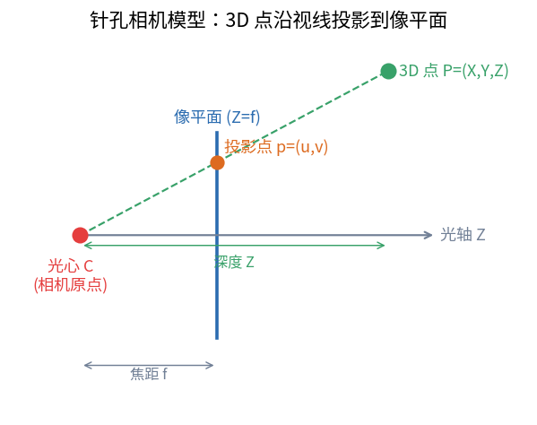
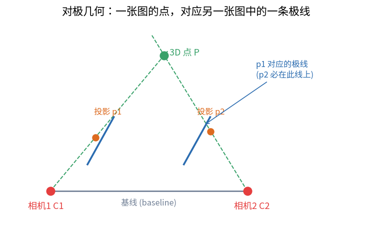
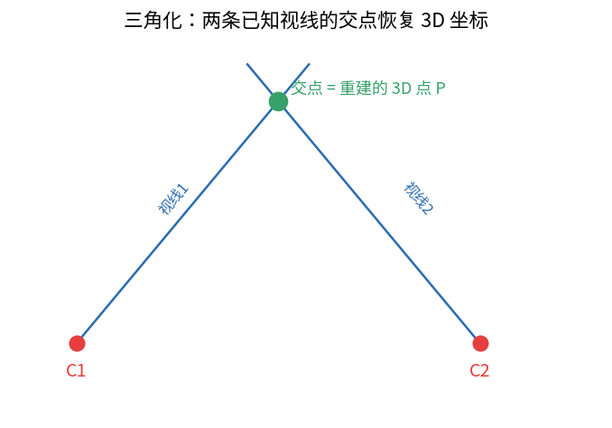
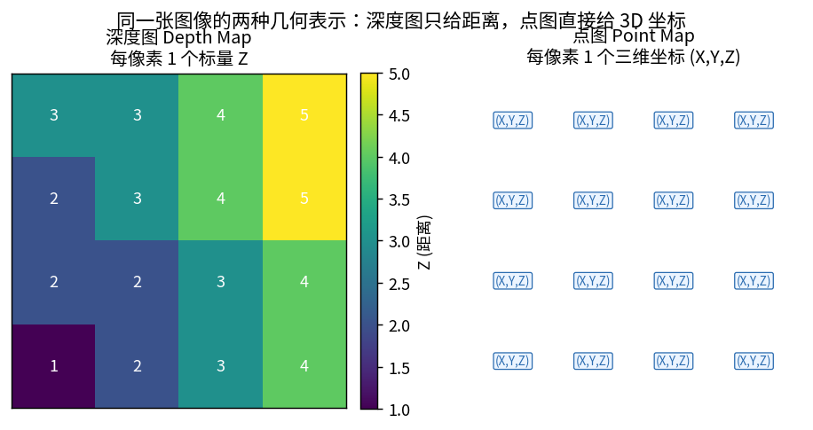
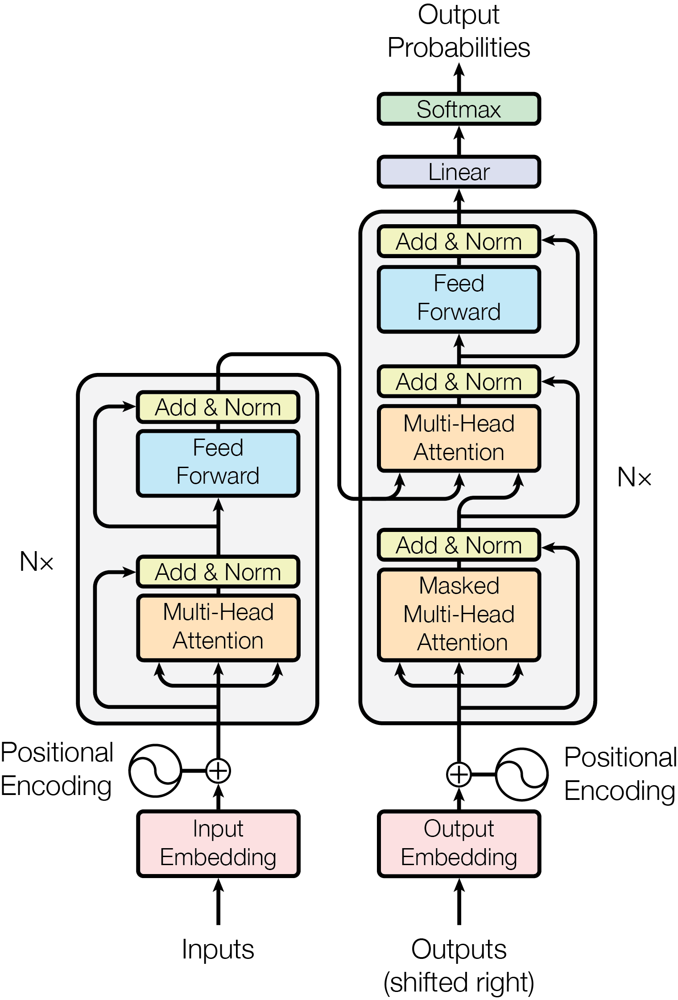
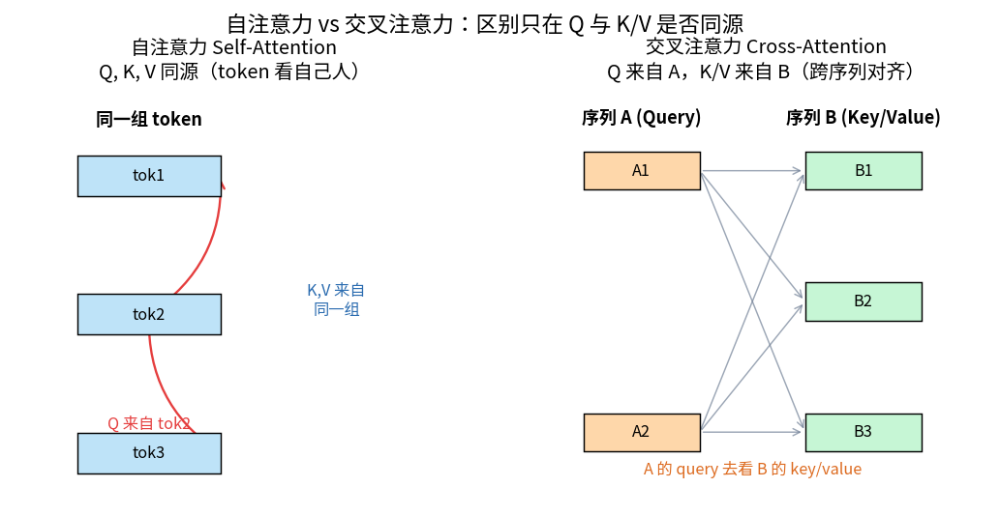

# 前馈三维重建 · 前置知识地图（Beginner 版）

> 这份文档是 [三维重建学习路线](./3d-reconstruction.md) 的「第 0 步」。目标读者：想读懂 DUSt3R / VGGT 这类前馈重建论文，但缺几何 / 深度学习底子的初学者。
>
> 每个小节按仓库的 **deep 分析格式** 组织：**直觉 → 公式逐符号 → 配图 → 「读前馈重建论文时该抓什么」**。不必线性读完全部，遇到卡壳再回查即可——最短上手路径见文末。

## 0. 为什么需要这些前置知识

结论先行：

- 前馈三维重建的本质是 **「用一次 Transformer 前向，替代传统 SfM/MVS 的整条几何优化管线」**。所以你要同时懂两头：被替代的**几何管线**（相机模型、对极几何、三角化、BA），和用来替代它的**架构**（Transformer、ViT）。
- 论文的公式几乎全部建立在**相机投影**和 **point map** 这两个概念上。搞不清「深度图 vs 点图」，就读不懂 DUSt3R 的损失函数。
- backbone 一律是 **自监督 ViT（DINO 系）**。不懂「自监督为什么能学出几何特征」，就无法理解这些模型的特征从哪来。

下面这张读序图贯穿全文（箭头 = 建议先读）：

```
第-2层 几何数学:  相机模型 ──> 对极几何 ──> 三角化 ──> 深度图/点图
                      │
第-1层 架构:      Transformer ──> ViT
                      │
第 0层 训练范式:  监督/自监督/对比学习
                      │
第 0.5层 特征基座: DINO ──> DINOv2 ──> DINOv3   (仓库已有深度分析)
                      │
第 1层 传统范式:  SfM/COLMAP ──> MVS ──> Bundle Adjustment ──> NeRF ──> 3DGS
                      │
第 2层 前馈谱系:  DUSt3R ──> MASt3R / CUT3R ──> VGGT ──> Pi3 / VGGT-Ω
```

---

## 第 -2 层：三维几何数学

这一层不是论文，是**概念**。它们是所有几何重建论文的「通用语言」，最容易卡初学者。

### 1. 相机模型：3D 世界如何变成 2D 像素

**直觉**：相机就是个针孔。三维世界里的点 P，沿着「P 到光心」的直线穿过针孔，打在成像平面上形成像素 p。整个成像就是一次**投影**——丢掉了一个维度（深度），这正是重建要反解的东西。



*图：针孔相机。3D 点 P 沿视线投影到像平面得到像素 p；深度 Z 是投影时被压掉的信息，重建就是要把它恢复出来。（自绘）*

**关键公式（针孔投影）**：一个相机坐标系下的 3D 点 $P_c=(X,Y,Z)$ 投影到像素 $(u,v)$：

$$
Z \begin{bmatrix} u \\ v \\ 1 \end{bmatrix}
= K \, P_c
= \begin{bmatrix} f_x & 0 & c_x \\ 0 & f_y & c_y \\ 0 & 0 & 1 \end{bmatrix}
\begin{bmatrix} X \\ Y \\ Z \end{bmatrix}
$$

逐符号：

- $(u,v)$：像素坐标（图像上第几列、第几行）。
- $Z$：该点的**深度**（到相机的距离）。注意等式左边乘了 $Z$ ——这说明投影**不可逆**：给定像素 $(u,v)$，不知道 $Z$ 就定不出 3D 点。这是重建困难的根源。
- $K$：**相机内参矩阵**（intrinsics）。 $f\_x,f\_y$ 是焦距（像素单位）， $(c\_x,c\_y)$ 是主点（光轴与像平面的交点，约等于图像中心）。
- $P_c$：相机坐标系下的 3D 点。

**世界坐标 → 相机坐标**由**外参**（extrinsics） $[R\,|\,t]$ 完成：

$$
P_c = R\,P_w + t
$$

- $R$： $3\times3$ 旋转矩阵（相机朝向）。
- $t$： $3\times1$ 平移向量（相机位置）。
- $[R\,|\,t]$ 合起来就是**相机位姿（pose）**——前馈重建里网络要估计的核心量之一。

**读前馈论文时该抓什么**：

- 传统方法需要**先标定 $K$**（或用 SfM 估计），前馈方法（如 DUSt3R）宣称「uncalibrated」，就是说它**不要你事先给 $K$**——这是卖点。
- 论文里 "camera pose" 指的就是 $[R\,|\,t]$；"intrinsics" 指 $K$。VGGT 一次前向同时吐出 $K$ 和 $[R\,|\,t]$。
- 「投影丢了深度 Z」这一点，解释了为什么单张图重建是病态问题，需要多视图或学习先验。

### 2. 对极几何：两张图之间的硬约束

**直觉**：同一个 3D 点 P 在两台相机里各成一个像。给定左图里的点 $p\_1$，右图里对应的 $p\_2$ **不可能乱跑**——它一定落在一条特定的直线（**极线**）上。这把「在整张右图里找匹配」降维成「在一条线上找」，是传统匹配的地基。



*图：对极几何。左图点 $p_1$ 在右图中的对应点，必落在由基线与视线决定的极线上。（自绘）*

**关键公式（对极约束）**：

$$
p_2^{\top} \, F \, p_1 = 0
$$

逐符号：

- $p_1,p_2$：两张图里对应点的**齐次像素坐标** $(u,v,1)^{\top}$。
- $F$：**基础矩阵**（Fundamental matrix）， $3\times3$、秩 2。它编码了两相机的相对几何 + 内参。
- 这个等式的含义： $F p\_1$ 是右图里的一条**极线**，而 $p\_2$ 必须在这条线上（点在直线上 ⟺ 点·线 $=0$ ）。
- 已知内参时，用**本质矩阵** $E = K_2^{\top} F K_1$ 表达同一约束，且 $E$ 可分解出两相机的相对旋转 $R$ 和平移方向 $t$。

**读前馈论文时该抓什么**：

- DUSt3R 的核心宣传语是 **「无需显式估计 $F$/$E$、无需特征匹配」**。你得先知道 $F$/$E$ 是传统两视图几何的必经步骤，才懂「绕过它」有多激进。
- image-matching 方向（RoMa、LightGlue）本质就是在**找满足对极约束的对应点**，与三维重建互为上下游。
- 「极线约束把 2D 搜索降成 1D」是理解传统 stereo/MVS 效率的关键。

### 3. 三角化：两条视线交出一个 3D 点

**直觉**：知道了两台相机的位姿，且知道点 P 在两张图里的像 $p_1,p_2$，就能从每个光心沿对应视线画一条射线——**两条射线的交点就是 P 的 3D 坐标**。这是从 2D 对应恢复 3D 的最基本操作。



*图：三角化。两条已知视线的交点恢复出 3D 点坐标。（自绘）*

**关键公式（线性三角化）**：每个视图给出投影方程 $\lambda\_i\, p\_i = K\_i [R\_i\,|\,t\_i]\, \tilde{P}$，其中 $\tilde{P}=(X,Y,Z,1)^{\top}$。用叉积消掉尺度 $\lambda\_i$，每张图贡献两个线性方程，堆成：

$$
A\,\tilde{P} = 0
$$

- $A$：由两张（或多张）图的投影矩阵行拼成的矩阵。
- 解法：对 $A$ 做 SVD，取最小奇异值对应的右奇异向量即为 $\tilde{P}$ （齐次坐标，再除以第 4 维归一）。
- 现实中两条射线因噪声**不会精确相交**，所以求的是「到两射线距离最小」的最优点——这也是为什么后面需要 BA 去联合优化。

**读前馈论文时该抓什么**：

- 传统 MVS 对**每个像素**做三角化得到稠密点云；前馈方法（DUSt3R/VGGT）**用网络直接回归**每像素的 3D 坐标（point map），跳过显式三角化。
- 「三角化需要先知道相机位姿」揭示了传统管线的**先后依赖**（先 pose 再 3D 点），而前馈方法把两者一起端到端出——这是范式差异的核心。

### 4. 深度图 vs 点图（point map）：前馈重建的输出语言

**直觉**：这是读 DUSt3R/VGGT **必须分清**的两个表征，也是最常被初学者搞混的地方。

- **深度图（Depth Map）**：每个像素存**一个标量** $Z$ ——「这个像素对应的表面离相机多远」。它是 2.5D，还需要配合相机内参 $K$ 才能反算出 3D 坐标。
- **点图（Point Map）**：每个像素直接存**一个三维坐标** $(X,Y,Z)$ ——一张 $H\times W\times 3$ 的图。它已经是 3D，不需要额外内参就能摆进空间。



*图：同一张图像的两种几何表示。左：深度图每像素 1 个标量；右：点图每像素 1 个 3D 坐标。（自绘）*

**关系公式**：点图可由深度图 + 内参反投影得到：

$$
X_{ij} = D_{ij}\, K^{-1} \begin{bmatrix} u_j \\ v_i \\ 1 \end{bmatrix}
$$

- $D_{ij}$：像素 $(i,j)$ 的深度标量。
- $K^{-1}$：内参的逆，把像素方向变成相机系下的单位视线方向。
- $X_{ij}$：该像素的 3D 坐标（点图的一个元素）。
- **反过来**：点图取第三维（或到相机距离）即得深度图。DUSt3R 选择直接回归点图，把「内参 + 深度 + 位姿」三件事**隐式打包**进一张点图里。

**读前馈论文时该抓什么**：

- DUSt3R 的开创性正在于**输出 point map 而非 depth map**——一张点图同时隐含了深度、内参、以及（当两张图的点图在同一坐标系时）相对位姿。这是「一个网络出全部几何」的表征基础。
- 论文里的损失函数（下一层会遇到）通常是**点图上的回归损失**，还带一个尺度因子——因为单目/前馈重建普遍有**尺度不确定性**（scale ambiguity）：整个场景放大 2 倍，投影完全一样，网络无从分辨。这正是学习路线里「别以为前馈自带 metric 尺度」那条误区的来源。

---

## 第 -1 层：架构基座（Transformer 与 ViT）

前馈重建 = Transformer 在几何上的应用。不懂 attention，读不动 VGGT 的「global / frame attention 交替」架构。

### 5. Transformer 与自注意力（Attention Is All You Need, 2017）

**直觉**：给一组 token（可以是词、也可以是图像 patch），**自注意力**让每个 token 去「看」所有其他 token，按相关性加权地吸收它们的信息。没有卷积的局部窗口限制——任意两个 token 一步之内就能交互。这正是前馈重建需要的：让不同视图、不同像素的信息**全局互通**。



*图：Transformer 编码器-解码器结构，核心是堆叠的多头自注意力 + 前馈层。（来源：arXiv 1706.03762）*

#### 5.1 Q、K、V 到底是什么——一个「查字典」的类比

先别看公式。想象你在图书馆检索：

- 你心里有个**问题**（"我想找关于恐龙的书"）——这就是 **Query（查询，Q）**：「我这个 token 想要什么信息」。
- 每本书的书脊上有**标签/关键词**（"恐龙""化石""侏罗纪"）——这就是 **Key（键，K）**：「我这个 token 能提供什么、可以被谁匹配到」。
- 书里真正的**内容**——这就是 **Value（值，V）**：「如果你匹配上我，你实际拿走的信息」。

检索过程 = 拿你的 Query 去和每本书的 Key 比对相似度，越像的书给越高权重，然后按权重把这些书的 Value（内容）加权汇总成答案。**自注意力就是让每个 token 都做一次这样的检索**。

关键点:Q、K、V **不是三种不同的东西,而是同一个 token 用三个不同的线性层 $W\_Q,W\_K,W\_V$ 投影出来的三个「身份」**。同一个 token $x$：

$$
q = x W_Q, \qquad k = x W_K, \qquad v = x W_V
$$

- $q$：它作为「提问者」的样子。
- $k$：它作为「被检索的候选」的样子。
- $v$：它被选中后交出的实际内容。

为什么要拆成三个而不是直接用 $x$ 本身两两点积？因为「一个 token 该关注谁」和「它被关注时该交出什么」是两回事——拆成可学习的 $W\_Q,W\_K,W\_V$，模型才能分别学「怎么提问」「怎么被检索」「交出什么」。

#### 5.2 缩放点积注意力（公式逐符号）

把上面「查字典」写成矩阵形式（ $n$ 个 token 一起算）：

$$
\mathrm{Attention}(Q,K,V) = \mathrm{softmax}\!\left( \frac{Q K^{\top}}{\sqrt{d_k}} \right) V
$$

逐符号：

- $Q, K, V$：把 $n$ 个 token 的 $q/k/v$ 各自堆成矩阵，形状分别是 $n\times d\_k$ 、 $n\times d\_k$ 、 $n\times d\_v$ 。
- $Q K^{\top}$：**每个 query 和每个 key 做点积**，得到 $n\times n$ 的**相关性得分矩阵**。第 $i$ 行第 $j$ 列 = 「token $i$ 的问题」和「token $j$ 的标签」有多匹配。点积越大越相关——这就是「谁该关注谁」。
- $\sqrt{d\_k}$：缩放因子（ $d\_k$ 是 key 的维度）。维度越高点积数值越容易变得很大，会把 softmax 推到「几乎 one-hot」的饱和区、梯度接近 0；除以 $\sqrt{d\_k}$ 把方差拉回来，训练才稳。
- $\mathrm{softmax}(\cdot)$：对得分矩阵**逐行**归一化，让每个 token 分配给所有 token 的权重加起来 = 1（这就是「注意力权重」）。
- 右乘 $V$：用这组权重去**加权求和所有 token 的 value**。token $i$ 的输出 = 它最关注的那些 token 的内容的加权平均。

一句话:**注意力 = 用「问题-标签」的匹配度当权重,对「内容」做加权平均**。

#### 5.3 自注意力 vs 交叉注意力——区别只在 Q 和 K/V 从哪来

公式一模一样，唯一区别是 **Q、K、V 的来源**：



*图：左=自注意力，Q/K/V 都来自同一组 token（token 之间互相看）；右=交叉注意力，Q 来自序列 A，K/V 来自序列 B（A 去 B 里检索信息）。（自绘）*

- **自注意力（Self-Attention）**： $Q,K,V$ **都从同一组 token 算出来**。序列里的 token 互相看、互相吸收信息。ViT 里同一张图的所有 patch 互相看，就是自注意力。
- **交叉注意力（Cross-Attention）**： $Q$ 来自**序列 A**， $K,V$ 来自**另一组序列 B**。即「A 的每个 token 拿自己的 query 去 B 里检索、把 B 的内容取回来」。用于**两组信息之间的对齐/融合**。

这个区别是读前馈重建论文的关键：**DUSt3R 两个分支之间就是交叉注意力**——分支 1（图 A 的 token）的 query 去看分支 2（图 B 的 token）的 key/value，两张图的信息就在 attention 里隐式对齐了，**不需要显式做特征匹配**。这正是「无需匹配也能对齐两张图」的机制根源。

#### 5.4 多头注意力——为什么要拆成多个头

单个注意力只能学**一种**「什么算相关」。但 token 之间的关系是多样的：几何上「空间相邻」是一种相关，语义上「同属一个物体」是另一种相关。用一个 softmax 权重矩阵，这些关系会被迫挤在一起、互相平均掉。

**多头注意力（Multi-Head Attention）** 的做法：把 $d$ 维的 Q/K/V **切成 $h$ 份**（每份 $d/h$ 维），每一份是一个「头」，**各自独立做一次上面的注意力**，最后把 $h$ 个头的输出**拼接**起来再过一个线性层：

$$
\mathrm{MultiHead}(Q,K,V) = \mathrm{Concat}(\mathrm{head}_1,\dots,\mathrm{head}_h)\,W_O,
\quad \mathrm{head}_i = \mathrm{Attention}(Q W_i^Q,\, K W_i^K,\, V W_i^V)
$$

- $h$：头的个数（如 8、16）。
- $W\_i^Q,W\_i^K,W\_i^V$：第 $i$ 个头**独立的**投影矩阵——每个头看的是 Q/K/V 的不同子空间，因此能学到**不同类型的相关性**。
- $W\_O$：把拼接后的结果投回原维度。
- 直觉:**每个头是一个独立的「关注视角」**。一个头可能专门学「相邻 patch」,另一个学「对称结构」,还有的学「同一物体的不同部分」——多头让模型同时抓多种关系,再综合。


*图：左为单个缩放点积注意力（ $QK^{\top}$ → 缩放 → softmax → 乘 $V$ ）；右为多头注意力（ $h$ 组独立投影并行做注意力，再拼接过 $W\_O$ ）。（来源：arXiv 1706.03762）*

**读前馈论文时该抓什么**：

- VGGT 的「**global attention**（跨所有视图的所有 token）与 **frame attention**（只在单帧内）交替」，就是把上面这个 attention 分别作用在「全部 token」和「单图 token」上。看懂 attention 才看得懂这个设计为何能聚合多视图信息。
- DUSt3R 两分支之间的 **cross-attention**：一个分支的 query 去看另一个分支的 key/value——这就是「无需显式匹配也能对齐两张图」的机制根源（信息在 attention 里隐式对齐）。
- 「任意两 token 一步交互」+「 $O(n^2)$ 复杂度」解释了为什么长序列 / 多视图前馈重建**贵**，以及为什么会出现各种「线性 attention / 流式」的效率变体（对应 efficient-training-inference 方向）。

### 6. Vision Transformer / ViT（An Image is Worth 16×16 Words, 2020）

**直觉**：Transformer 本来吃词序列，ViT 让它吃图像——把图像切成固定大小的小块（patch，如 16×16），每块拉平后做线性投影当成一个「视觉词」，再加上位置编码告诉模型每块在图像哪里，然后照常喂进 Transformer。**几乎所有前馈重建的 backbone 都是 ViT。**


*图：ViT。图像切 patch → 线性投影 + 位置编码 → 标准 Transformer 编码器。（来源：arXiv 2010.11929）*

**关键步骤（patch embedding）**：一张 $H\times W\times C$ 的图，用 $P\times P$ 的 patch 切成 $N=\frac{HW}{P^2}$ 块，每块展平投影成 $D$ 维 token：

$$
z_0 = [\,x_{\text{cls}};\; x^1_p E;\; x^2_p E;\; \dots;\; x^N_p E\,] + E_{\text{pos}}
$$

逐符号：

- $x^i_p$：第 $i$ 个 patch 展平成的向量（长度 $P^2 C$ ）。
- $E$：patch 投影矩阵（把每块投到 $D$ 维）。
- $x_{\text{cls}}$：可学习的分类 token（分类任务用；稠密几何任务里更关心每个 patch token 的输出）。
- $E_{\text{pos}}$：**位置编码**。至关重要——它告诉模型「这个 patch 在图像的哪个位置」，几何任务里位置信息直接关系到像素坐标 $(u,v)$。
- $z_0$：喂进 Transformer 的初始 token 序列。

**读前馈论文时该抓什么**：

- 前馈重建输出的 **point map 是逐 patch/逐像素**的——每个 patch token 经解码头回归出对应区域的 3D 坐标。理解「patch token ↔ 图像空间位置」的对应，才懂输出怎么和像素对齐。
- 「patch 是几何的最小单元」解释了这些模型的**分辨率-精度权衡**：patch 越小越精细但越慢。
- ViT 是下一层 DINO 的**训练对象**——DINO 就是「用自监督方法训练一个 ViT」，所以必须先懂 ViT。

---

## 第 0 层：训练范式（监督 / 自监督 / 对比学习）

**直觉**：为什么 DINO 不用标签也能学出有用特征？因为它用**自监督**——不靠人工标注，而是让模型从数据本身构造的任务里学。DINO 用的是**自蒸馏**：同一张图的两个不同增强视角，要求学生网络的输出去匹配教师网络的输出，逼模型学到「与视角/裁剪无关的语义与几何结构」。

- **监督学习**：有标签 $(x,y)$，最小化预测与标签的差距。三维重建里的合成数据（有 GT 深度/位姿）就是监督信号。
- **自监督**：无标签，用数据自身构造 pretext 任务（如 DINO 的多视角一致性、MAE 的掩码重建）。
- **对比学习**：让「正样本对」（同图不同增强）在特征空间靠近，「负样本对」推远。DINO 是它的一个「无显式负样本」变体。

**关键机制（DINO 自蒸馏损失，简化）**：

$$
\mathcal{L} = -\sum_{x} P_t(x)\,\log P_s(x)
$$

- $P_t,P_s$：教师、学生对同一图不同视角输出的概率分布（over 一组 prototype）。
- 教师参数是学生的 **EMA（指数滑动平均）**，不接收梯度——避免「师生输出同时坍缩成常数」。
- 配合 **centering + sharpening** 稳定训练，防坍缩。

**读前馈论文时该抓什么**：

- 这解释了 DINOv2 特征为何**空间稠密、几何一致**——正是前馈重建想要的性质（比 CLIP 的图文对齐特征更贴几何）。
- 「frozen DINO features」在 DUSt3R/VGGT 里几乎是标配：backbone 冻住，只训解码头。懂了自监督预训练，才懂为什么可以冻。
- 仓库已有三篇深度分析可直接接着读：[DINO](../papers/vision-foundation-models/2021-dino.md) → [DINOv2](../papers/vision-foundation-models/2023-dinov2.md) → [DINOv3](../papers/vision-foundation-models/2025-dinov3.md)。

---

## 第 1 层：传统与表征范式（被替代 / 被继承的那些）

前馈重建要么替代它们（SfM/MVS/BA），要么以它们为输出目标（NeRF/3DGS）。仓库已有深度分析，这里只点「为什么必读」。

### 7. SfM / COLMAP：被前馈替代的整条管线

- **一句话**：从一堆无序图片里，同时估计所有相机位姿 + 稀疏 3D 点云。流程 = 特征检测(SIFT) → 匹配 → 几何验证(对极) → 增量式 BA。
- **为什么必读**：前馈重建的全部卖点都是相对 SfM 说的——「快」（一次前向 vs 迭代小时级）、「鲁棒」（低纹理不崩）、「免标定」。不懂 SfM 慢在哪、崩在哪，就 get 不到前馈的价值。
- 深度分析：[COLMAP](../papers/3d-reconstruction/2016-colmap.md)。

### 8. Bundle Adjustment（BA）：传统管线最后的联合优化

- **一句话**：联合微调所有相机位姿和 3D 点，最小化**重投影误差**——把每个 3D 点用当前位姿投回图像，与实际观测像素的距离。

$$
\min_{\{R_i,t_i\},\{P_j\}} \sum_{i,j} \rho\Big( \big\lVert \pi(R_i,t_i,K_i,P_j) - p_{ij} \big\rVert^2 \Big)
$$

- $\pi(\cdot)$：投影函数（就是第 1 节的针孔投影）。
- $p_{ij}$：第 $j$ 个点在第 $i$ 张图的观测像素。
- $\rho$：鲁棒核（如 Huber），抑制外点。
- **为什么必读**：VGGT/DUSt3R 论文常说「无需 BA」或「用轻量 BA 精修」。BA 是个大型非线性最小二乘，很贵——懂这点才懂前馈「免 BA」省了什么，以及为什么有些方法仍保留一步 BA 精修。

### 9. NeRF 与 3DGS：表征范式的两极

- **NeRF**（隐式）：用一个 MLP 表示场景 $ (x,y,z,\theta,\phi) \mapsto (\text{color},\sigma)$，靠**体渲染**积分出像素颜色。per-scene 优化，慢但连续。深度分析：[NeRF](../papers/3d-reconstruction/2020-nerf.md)。
- **3DGS**（显式）：用一堆 3D 高斯球表示场景，光栅化渲染，快。是当下很多前馈方法的**输出目标**。深度分析：[3DGS](../papers/3d-reconstruction/2023-3dgs.md)。
- **为什么必读**：理解「per-scene 优化（NeRF/3DGS 原版）」vs「一次前馈（DUSt3R/VGGT）」的根本对立——前者每个场景重训，后者训一次到处推。体渲染公式（沿光线积分 $C=\int T(t)\sigma(t)c(t)dt$ ）是理解连续表征的关键。
- 全景对比：[场景表征范式对比](../comparisons/3d-reconstruction/scene-representation-paradigms.md)。

---

## 第 2 层：前馈谱系（正式入口）

到这里前置知识齐了，可以正式进主线。严格按谱系顺序读：

```
DUSt3R ──> MASt3R ──> MapAnything
  │
  ├──> CUT3R (流式/在线)
  └──> VGGT ──> Pi3 / VGGT-Ω
             └──> Depth-Anything-3
```

- **DUSt3R**（范式奠基，必读第一篇）：两图直接回归 point map，取消显式匹配与标定。深度分析：[DUSt3R](../papers/3d-reconstruction/2023-dust3r.md)。
- **MASt3R**：加匹配头，精度/定位大幅提升。[MASt3R](../papers/3d-reconstruction/2024-mast3r.md)。
- **CUT3R**：状态化/流式，支持在线增量。[CUT3R](../papers/3d-reconstruction/2025-cut3r.md)。
- **VGGT**（当前大一统标杆，必读）：单次前向出相机/深度/点图/轨迹。[VGGT](../papers/3d-reconstruction/2025-vggt.md)。
- **Pi3 / VGGT-Ω**：VGGT 的置换等变 / 空间预训练强化。[Pi3](../papers/3d-reconstruction/2026-pi3.md)、[VGGT-Ω](../papers/3d-reconstruction/2026-vggt-omega.md)。
- 全景谱系：[任意视角视觉几何基础模型对比](../comparisons/3d-reconstruction/visual-geometry-foundation-models.md)。

---

## 最短上手路径（别想着读完全部再开始）

作为 beginner，最容易犯的错是「想把 A-B-C 全啃完才动手」，结果卡在《MVG》第一章劝退。推荐这条 5 步最小路径，其余**遇到卡壳再回查本文对应小节**：

1. **相机模型 + 三角化**（本文第 1、3 节，约 1 天）——搞懂 $K$、 $[R\,|\,t]$、point map 是什么。
2. **Transformer + ViT**（第 5、6 节，约 2 天）——attention 公式 + patch token。
3. **COLMAP**（[深度分析](../papers/3d-reconstruction/2016-colmap.md)）——建立「传统全流程」对照。
4. **DINOv2**（[深度分析](../papers/vision-foundation-models/2023-dinov2.md)）——搞清「特征从哪来、为什么能冻」。
5. **DUSt3R → VGGT**（[DUSt3R](../papers/3d-reconstruction/2023-dust3r.md) → [VGGT](../papers/3d-reconstruction/2025-vggt.md)）——正式进入前馈范式。

对极几何、BA、NeRF/3DGS、对比学习细节等，都可以在读到相关论文、被某个术语卡住时再回来查。

## 常见误区（前置知识层面）

- **误区**：以为 point map 就是 depth map。→ 点图是逐像素 3D 坐标，深度图是逐像素标量，差一个内参反投影（第 4 节）。读 DUSt3R 损失函数必须分清。
- **误区**：以为懂 CNN 就够了。→ 前馈重建 backbone 是 ViT + attention，CNN 直觉（局部感受野）会误导你理解「全局 token 交互」。
- **误区**：以为前馈输出自带 metric 尺度。→ 单目/前馈普遍有尺度不确定性（第 4 节），多数方法输出的是 up-to-scale 几何，需对齐或外部先验。
- **误区**：跳过传统几何直接读前馈。→ 论文的卖点（免标定、免 BA、免匹配）全是相对传统说的，不懂传统就 get 不到创新点在哪。
