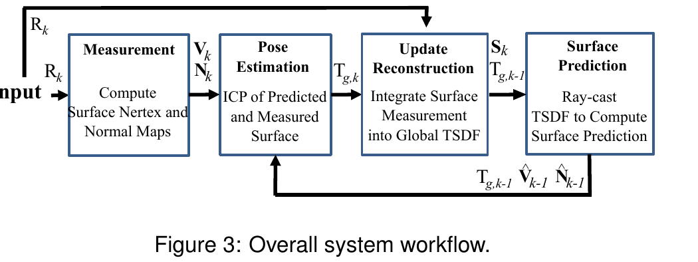
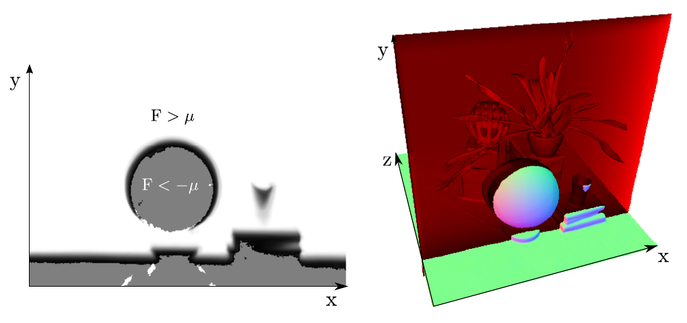

# KinectFusion：实时稠密表面建图与跟踪

> 说明：本文分析基于原始 ISMAR 2011 论文 PDF 全文逐节核对（含公式 1–26 与实验节）。KinectFusion 为经典论文，无 arXiv 版本；引用以 IEEE ISMAR 2011 收录（DOI: 10.1109/ISMAR.2011.6092378，已经 DBLP + doi.org 解析核对）为准。论文本身未开源代码，微软将该算法以闭源形式并入 Kinect for Windows SDK；社区广泛使用的开源复现是 PCL 的 KinFu / KinFu Large Scale（BSD）。公式已按 GitHub MathJax 规范转写并自查。

## 结论先行

- **一句话定位**：KinectFusion 是第一套证明「用一台手持廉价深度相机 + 商用 GPU，就能在 30Hz 实时把整个房间稠密重建成一致三维模型」的系统。它不是提出全新数学工具，而是把 TSDF 体素融合（Curless & Levoy 1996）与投影式 point-to-plane ICP（Chen & Medioni / Blais & Levine）在 GPU 上重做到实时，并做出一个关键架构决策：**跟踪永远对齐到「已融合的全局模型的光线投射预测」，而不是上一帧**。
- **为什么是里程碑（判断）**：它定义了「深度相机实时稠密 SLAM / 重建」这一整条研究线的范式模板——TSDF 体积表示 + 投影 ICP + raycast 预测 + 全 GPU 并行。后续 Kintinuous、ElasticFusion、BundleFusion、Voxel Hashing、DynamicFusion 乃至今天很多 RGB-D / 神经隐式重建，都是在补它明确列出的短板（内存、大场景、漂移、动态、回环）。这是它 landmark 的真正理由：不是单点算法新，而是**开创了一个可扩展、可复现的实时稠密重建工程范式**。
- **核心技术贡献（证据）**：(1) 增量式 **TSDF 加权移动平均融合**（公式 11–13），把每秒 900 万+ 深度点实时去噪融合进单一隐式表面；(2) **frame-to-model 跟踪**——对 raycast 出的全局模型预测做投影式 ICP（公式 16–26），显著抑制 frame-to-frame 的漂移累积；(3) **全流程 GPU 并行**，TSDF 更新达 65 gigavoxels/s（ $512^3$ 体积约 2ms/帧）。
- **实验证据（原文）**：转台实验（ $256^3$ 体素、560 帧、约 19s）中，frame-to-model 跟踪在无任何显式全局优化 / 回环的情况下实现「近乎无漂移」的闭环，而 frame-to-frame 快速累积误差、轨迹明显偏离圆形；重复喂入同一回环 4 次后闭合帧配准进一步收紧（收敛特性）。系统在 $\le 7\text{m}^3$ 房间尺度工作良好； $64^3$ 低分辨率下仍能优雅降级。
- **工程判断（推断）**：想要「桌面 / 房间尺度、深度相机、实时、稠密」重建的落地基线，KinectFusion 范式至今仍是起点；但它固定分辨率的稠密体素**内存随场景立方增长**、大场景必然漂移（无回环）、静态假设、以及大平面正对时 ICP 欠约束会跟丢——这些正是它自己在结论里点名、后续工作逐一攻克的痛点。

## 1. 这篇论文解决什么问题？

- **问题定义**：给定一台手持、快速运动的廉价深度相机（Kinect，640×480 深度图 @30Hz，含大量空洞与噪声）的实时深度流，**同时**（a）估计相机每帧的 6DOF 位姿，（b）把所有深度数据增量融合成一个一致、平滑、稠密的三维表面模型——全部在实时、无额外基础设施（无标记、无外部定位）下完成。
- **输入 / 输出**：输入为单路原始深度图流 $R\_k$ （仅深度，不用 RGB）；输出为逐帧相机位姿 $T\_{g,k} \in SE\_3$ 与一个存于 GPU 显存的全局 TSDF 体积（可 raycast 渲染 / marching cubes 提取网格）。
- **目标场景**：可变光照（含全黑）的复杂室内场景，房间尺度（ $\le 7\text{m}^3$ ），支持敏捷（快速）手持运动；面向增强现实 / 人机交互 / 机器人。
- **与现有方法的差异**：相比 MonoSLAM / PTAM 这类**单目稀疏特征** SLAM（只给稀疏点云、不足以做稠密交互），KinectFusion 用**全部深度像素**做稠密跟踪与稠密重建；相比 Rusinkiewicz 等早期 frame-to-frame ICP + splat 渲染（约 10Hz、非移动传感器、离线才做 SDF 融合），它把**在线 TSDF 融合**与**对全局模型跟踪**在 GPU 上一并实现，并用于抑制漂移。

## 2. 方法概览

- **核心想法**：维护一个**始终最新的全局隐式表面**（TSDF），每来一帧就（1）对该模型的光线投射预测做稠密 ICP 求位姿，（2）用求得的位姿把新深度增量融合回 TSDF。跟踪与建图互为闭环：更好的模型 → 更稳的跟踪 → 更干净的融合。
- **一句话 pipeline**：`原始深度 Rk → 双边滤波 + 反投影得顶点/法向金字塔（测量）→ 对上一帧 raycast 预测做多尺度投影 ICP 得位姿 Tg,k（跟踪）→ 按位姿把 Rk 融合进全局 TSDF（建图）→ 从 TSDF 光线投射出 V̂k, N̂k 供下一帧跟踪（预测）`。
- **无学习成分**：全程为几何优化与体素运算，无神经网络、无训练；「推理」= 跑 GPU 管线。

### 2.1 架构解析

**整体结构（四大模块，对应上图从左到右的闭环）**：

1. **Surface Measurement（表面测量，预处理）**：对原始深度图 $R\_k$ 做双边滤波降噪得 $D\_k$，反投影得顶点图 $V\_k$、叉积得法向图 $N\_k$，并构建 $L=3$ 层多尺度金字塔。输出送入跟踪。
2. **Sensor Pose Estimation（位姿估计 / 跟踪）**：把当前测量 $(V\_k, N\_k)$ 与**上一帧从全局模型 raycast 出的预测** $(\hat V\_{k-1}, \hat N\_{k-1})$ 做多尺度投影式 point-to-plane ICP，解出 $T\_{g,k}$。
3. **Surface Reconstruction Update（建图 / 融合）**：用 $T\_{g,k}$ 把新一帧深度以投影式 TSDF 形式加权平均融合进全局体积 $S\_k$。
4. **Surface Prediction（预测）**：对更新后的 TSDF 在当前位姿下 raycast，得到零交叉面的稠密 $\hat V\_k, \hat N\_k$，闭环回送给下一帧的跟踪。

**关键数据流**：注意上图中 $R\_k$ （原始深度）有一条**直接旁路**到融合模块——因为融合用的是**未滤波**的原始深度（保留高频细节），而跟踪用的是**双边滤波后**的深度（更干净的法向、更稳的数据关联）。这是一个刻意的分工设计。

**关键设计选择及理由**：
- **frame-to-model 而非 frame-to-frame**：跟踪目标是「已融合全局模型的预测」，模型本身已对多帧去噪，从而打断误差逐帧累积的链条（论文实验直接对比二者）。
- **全部落在 GPU**：TSDF 存于显存、每个体素 / 每条光线 / 每个 ICP 对应点并行处理，是达到 30Hz 的前提。
- **投影式数据关联**：利用高帧率下帧间运动小的假设，用透视投影直接找对应点，避免昂贵的最近邻搜索。

### 2.2 核心原理

- **为什么 TSDF 融合 work**：在高斯深度噪声、且假设「每个表面点对所有视点可见」的前提下，最优表面重建等价于把各帧的加权带符号距离场做**加权平均**（Curless & Levoy 已证）。平均本身就是对多帧噪声测量的去噪；而截断（truncation）到 $\pm\mu$ 既省内存又避免不同表面的 SDF 相互干扰。表面 = TSDF 的零交叉，天然可提取（对比占据栅格要找概率分布的众数）。
- **为什么 frame-to-model 抑制漂移**：frame-to-frame ICP 每帧的估计误差直接叠加到下一帧参考系上，漂移线性累积；而对齐到「融合了大量历史帧、已去噪」的全局模型，相当于每帧都和一个稳定基准比对，局部回环能在无显式优化下自然收敛（论文转台实验的核心证据）。
- **与前作的本质区别**：前作要么稀疏（PTAM，只跟踪不稠密建图）、要么 frame-to-frame + 离线融合（Rusinkiewicz）、要么慢（Henry 等 RGB-D 1–2Hz + 位姿图）。KinectFusion 把「在线稠密融合」与「对该融合模型实时稠密跟踪」在 GPU 上**同时**做到帧率。

### 2.3 关键公式解析

> 用 LaTeX 逐符号解释。核心是三组：TSDF 投影距离、TSDF 加权融合、投影式 point-to-plane ICP。

**(A) 投影式截断带符号距离（TSDF 测量）**

对一帧深度图 $R\_k$ 与已知位姿 $T\_{g,k}$ ，全局点 $p$ 处的投影 TSDF 为：

$$ F_{R_k}(p) = \Psi\!\left( \lambda^{-1}\,\lVert t_{g,k} - p \rVert_2 - R_k(x) \right) $$

$$ \lambda = \lVert K^{-1}\dot{x} \rVert_2, \qquad x = \left\lfloor \pi\!\left( K\, T_{g,k}^{-1}\, p \right) \right\rfloor $$

$$ \Psi(\eta) = \begin{cases} \min\!\left(1,\ \dfrac{\eta}{\mu}\right)\operatorname{sgn}(\eta) & \text{if } \eta \ge -\mu \\[4pt] \text{null} & \text{otherwise} \end{cases} $$

- 符号： $p$ 为全局坐标系下待评估的三维体素点； $t\_{g,k}$ 为相机中心（位姿平移部分）； $\lVert t\_{g,k}-p\rVert\_2$ 是相机中心到 $p$ 的射线距离； $x$ 是把 $p$ 投影回图像、取最近邻整数像素（ $\lfloor\cdot\rfloor$ 表最近邻、非插值，避免深度不连续处涂抹）； $R\_k(x)$ 是该像素测得深度； $\lambda$ 把「沿光线的距离」换算成「沿光轴的深度」； $\mu$ 为截断半径； $\operatorname{sgn}$ 取符号。
- 作用： $\eta = \lambda^{-1}\lVert t\_{g,k}-p\rVert\_2 - R\_k(x)$ 即「 $p$ 的深度」减「测量深度」，为负表示 $p$ 在表面前的自由空间、为正表示在表面后。 $\Psi$ 把它截断归一化到 $[-1,1]$ ，且对「表面后超过 $\mu$ 的不可测区域」返回 null（不更新）。这正是图 4 里白色 / 灰色区域的定义。

**(B) 加权移动平均融合（增量建图）**

把逐帧 TSDF 融进全局，等价于最小化 $\min\_{F}\sum\_k \lVert W\_{R\_k}(F\_{R\_k}-F)\rVert^2$ ，其闭式解可用**加权running average**增量得到：

$$ F_k(p) = \frac{W_{k-1}(p)\,F_{k-1}(p) + W_{R_k}(p)\,F_{R_k}(p)}{W_{k-1}(p) + W_{R_k}(p)} $$

$$ W_k(p) = \min\!\left( W_{k-1}(p) + W_{R_k}(p),\ W_\eta \right) $$

- 符号： $F\_k(p)$ / $W\_k(p)$ 为体素 $p$ 在第 $k$ 帧后的融合距离值与累计权重； $W\_{R\_k}(p) \propto \cos(\theta)/R\_k(x)$ （ $\theta$ 为光线与表面法向夹角，正对表面、近距离权重高）； $W\_\eta$ 为权重上限。
- 作用：第一式就是对同一体素的多帧 SDF 观测做**去噪平均**（凸 L2 问题的全局最优可增量求）；第二式给权重封顶，使其变为**滑动平均**，从而能容忍场景中的动态物体（旧观测逐渐被冲淡）。论文指出实践中即使简单取 $W\_{R\_k}=1$ （等权平均）也效果良好。

**(C) 投影式 point-to-plane ICP（跟踪）**

跟踪求位姿最小化点到面能量：

$$ E(T_{g,k}) = \sum_{\substack{u\in U \\ \Omega_k(u)\neq \text{null}}} \left\lVert \left( T_{g,k}\,\dot V_k(u) - \hat V_{k-1}^{g}(\hat u) \right)^{\top} \hat N_{k-1}^{g}(\hat u) \right\rVert_2 $$

- 符号： $u$ 为图像像素； $\dot V\_k(u)$ 为当前帧测得顶点（齐次）； $\hat V\_{k-1}^{g},\hat N\_{k-1}^{g}$ 为上一帧从全局模型 raycast 出、变换到全局系的预测顶点与法向； $\Omega\_k(u)$ 是投影数据关联给出的对应（null 表示被距离阈值 $\varepsilon\_d$ 或法向阈值 $\varepsilon\_\theta$ 剔除，见公式 17）。
- 作用：把「当前点到模型对应点所在切平面的距离」平方和作为误差——point-to-plane 比 point-to-point 收敛更快，尤其在有法向时。对应点 $\hat u = \pi(K\,\tilde T\_{k-1,k}\,\dot V\_k(u))$ 由透视投影直接给出（投影式关联，省去最近邻搜索）。

在小角度假设下对增量位姿 $\tilde T\_{inc}$ 线性化，参数向量 $x = (\beta,\gamma,\alpha,t\_x,t\_y,t\_z)^{\top}\in \mathbb{R}^6$ ，得到每个对应点贡献的 $6\times6$ 正规方程：

$$ \left( \sum_{\Omega_k(u)\neq \text{null}} A^{\top} A \right) x = \sum A^{\top} b, \qquad A^{\top} = G^{\top}(u)\,\hat N_{k-1}^{g}(\hat u) $$

- 符号： $\alpha,\beta,\gamma$ 为三个小旋转角， $t\_x,t\_y,t\_z$ 为平移； $G(u)=\big[\,[\tilde V\_k^{g}(u)]\_\times \;\; I\_{3\times3}\,\big]$ 由顶点的反对称（skew-symmetric）矩阵构成； $b$ 为点到面残差。
- 作用：每个对应点在 GPU 上并行算出 $A^{\top}A$ 与 $A^{\top}b$，用**并行树规约**求和得对称线性系统，再在 CPU 上 Cholesky 分解求 $x$，组合回 $SE\_3$ 更新位姿。整个 ICP 嵌在**由粗到细**（金字塔 level [3,2,1]，最大迭代 [4,5,10] 次）框架里。

### 2.4 训练与推理细节

- **训练目标 / 损失**：无。纯几何优化，无可学习参数、无训练数据、无损失函数（`training_open_source: n/a`）。
- **关键超参 / 取值（原文）**：多尺度金字塔 $L=3$；ICP 每层最大迭代 $z\_{\max}=[4,5,10]$ （level [3,2,1]）；重建分辨率典型 $256^3$ （实验），可到 $512^3$；TSDF 每体素 16 bit 存 $F$ 与 $W$ （实验证明 6 bit 已够存 SDF 值）；Kinect 有效量程约 $[0.4, 8]$ 米；房间尺度 $\le 7\text{m}^3$。
- **推理 / 运行流程**：每帧 = 双边滤波 + 金字塔 → 由粗到细投影 ICP 求位姿 → 稳定性 / 有效性检查（检查正规方程零空间是否欠约束、增量参数量级是否过大，否则进入重定位）→ TSDF 加权融合 → raycast 预测（用 ray-skipping 空间跳跃加速，约 6× 提速；用公式 15 线性插值精化零交叉位置）。
- **性能数字（原文）**：TSDF 融合 > 65 gigavoxels/s（ $512^3$ 全体积更新约 2ms/帧）；全系统在 GPU 上达 Kinect 的 30Hz 帧率、且对给定分辨率为**常数时间**。

## 3. 关键贡献

1. **首个手持深度相机的实时（30Hz）稠密房间级重建 + 跟踪系统**：证明仅用廉价深度相机 + 商用 GPU、无外部基础设施、甚至全黑环境下即可稠密重建并实时跟踪 6DOF 位姿。
2. **frame-to-model 跟踪范式**：跟踪始终对齐到「全局融合模型的 raycast 预测」而非上一帧，用实验证明其相比 frame-to-frame 显著抑制漂移、局部回环无需显式全局优化即近乎无漂移收敛。
3. **全 GPU 并行的实时 TSDF 融合**：投影式 TSDF + 加权移动平均，每体素 / 每光线 / 每 ICP 对应点并行，达 65 gigavoxels/s，且随显存 / 算力优雅伸缩（ $64^3$ 到 $512^3$ ）。
4. **完整实时稠密 SLAM 管线的工程模板**：测量 → 投影 ICP → TSDF 融合 → raycast 预测的闭环，成为后续大量深度相机稠密重建 / SLAM 工作的范式起点。

## 4. 实验与证据

| 维度 | 内容 |
|---|---|
| 数据集 | 自采 Kinect 室内序列：转台桌面场景（ $N=560$ 帧、约 19s、模拟精确圆周轨迹）、手持自由运动序列（ $MN$ 帧）、房间尺度场景 |
| Baseline | 自身的 frame-to-frame ICP（对照 frame-to-model）；keyframe/anchor-scan 抽帧策略作对照 |
| 指标 | 定性：轨迹一致性、闭环帧配准误差、重建法向/表面质量；定量/系统：跟踪漂移、帧率(30Hz)、体素分辨率($64^3$ – $512^3$)、gigavoxels/s、逐组件常数时间计时 |
| 主要结果 | frame-to-model 在无显式全局优化下实现近乎无漂移闭环；frame-to-frame 快速累积误差、轨迹偏离。TSDF 融合 65 GV/s（ $512^3$ ≈2ms/帧），全系统 30Hz 常数时间 |
| 消融 | (1) frame-to-frame vs frame-to-model（漂移对比，Fig 8/11）；(2) 抽帧(每8帧)+keyframe 仍不及 frame-to-model；(3) 重复喂入同一回环 M=1→4 次，闭合帧配准逐步收紧（收敛性，Fig 10）；(4) 分辨率 $64^3$ （1/64 显存）+每6帧仍优雅降级(Fig 12)；(5) 双边滤波对 ICP 外点剔除的影响(Fig 7) |
| 失败案例 | 大平面正对相机填满视场时，3 个 DOF 在正规方程零空间欠约束 → 跟踪漂移/失败；大场景累积漂移；无自动重定位（当前为交互式重定位） |

### 4.1 效果与性能解析

- **主要结果解读**：论文的核心证据是**转台圆周实验**——把场景放转台旋转一周等价于相机绕静止桌面走精确圆轨迹，因此有天然「真值」可评。frame-to-frame 跟踪轨迹迅速偏离圆形、重建糊掉；frame-to-model 则轨迹保持圆形、闭环帧（首帧与末帧真值同位）几乎重合。这直接量化了「对全局模型跟踪」相对「对上一帧跟踪」在**漂移抑制**上的价值——而且是在**完全没有显式回环检测 / 位姿图优化**的情况下达成的，说明持续对去噪模型对齐本身就有隐式的全局一致化作用。
- **收敛性证据**：把同一回环数据重复喂 4 次，闭合帧配准从「较好」逐步收紧到「极紧」（Fig 10），佐证系统的迭代收敛特性。
- **性能与效率**：全流程常数时间、30Hz；TSDF 更新是**内存带宽受限**而非计算受限（核函数极简）， $512^3$ 全体积更新约 2ms。这解释了它为何能实时——瓶颈被设计成显存吞吐，恰好是 GPU 强项。
- **可扩展性**： $64^3$ （相比 $512^3$ 少 64× 显存）+ 每 6 帧抽样仍能优雅重建，说明范式对算力/显存线性伸缩——但也暴露了**固定稠密体素**的根本局限：分辨率与场景大小以立方代价换取。
- **协议一致性说明**：本文实验以**定性 + 自身消融**为主，缺少与外部方法在公共 benchmark 上的定量对比（2011 年该方向尚无标准 benchmark）。因此其「SOTA」地位是由范式开创性与后续影响力确立的，而非某个统一指标上的分数（这点需注意，见存疑点）。

## 5. 局限与风险

- **论文明确承认**：(1) 仅适合中等房间（ $\le 7\text{m}^3$ ）；大场景稠密体素**内存需求过大**且**必然漂移**（无回环闭合机制）；(2) 大平面正对时 ICP 欠约束会跟丢；(3) 重定位是**交互式**的（需用户手动对齐），无自动重定位；(4) 静态场景假设（滑动平均仅部分容忍动态）。
- **我推断的风险**：投影式数据关联依赖「帧间小运动」假设，极快运动或长时间遮挡后易失配；固定体素分辨率对薄结构 / 细节有天花板；纯深度、无 RGB，对无几何纹理的大平面 / 走廊天然欠约束。
- **工程落地风险**：原论文**无官方开源代码**，落地需依赖第三方复现（PCL KinFu 等），行为与论文不完全一致；对 GPU 显存敏感，扩展到大场景需换用 voxel hashing / octree / 子图等后续技术。
- **许可证 / 数据风险**：微软将算法以**闭源**并入 Kinect for Windows SDK（受 SDK 许可约束，且依赖已停产的 Kinect 硬件）；开源路线走 PCL KinFu（BSD，可商用）。无公开数据集发布，实验为自采序列，复现需自备深度相机。

## 方法谱系

> KinectFusion 是深度相机实时稠密重建的开创性工作，本仓库现有 3d-reconstruction 论文多为其后的 SfM / 神经隐式 / feed-forward 路线，与它无直接「取代 / 基于」的谱系边（属不同技术代际），故不强行连边。它在思想上是 [COLMAP](2016-colmap.md) 之外「实时在线稠密」这条并行支线的源头，可与之对照阅读。

## 6. 与相似方法对比

> 详见 [3D 重建发展脉络综述](../../comparisons/3d-reconstruction/development-survey.md)，KinectFusion 在其中作为「深度相机实时稠密重建」代际的开山节点。

| Method | 相同点 | 不同点 | 何时选它 |
|---|---|---|---|
| COLMAP (2016) | 都做三维重建、都需相机位姿 | KinectFusion：实时在线、深度输入、稠密体素、无回环；COLMAP：离线、RGB 图像、稀疏 SfM+MVS、鲁棒全局优化 | 要实时、有深度相机、房间尺度稠密模型 → KinectFusion；要离线高精度、无序照片、需真值位姿 → COLMAP |
| NeRF/3DGS (2020/2023) | 都产出稠密场景表示 | 神经辐射场/高斯：优化照片级新视角合成、离线训练、RGB；KinectFusion：几何 TSDF、实时、深度、无外观建模 | 要实时几何 + 跟踪 → KinectFusion；要照片级渲染 → NeRF/3DGS |
| DUSt3R 等 feed-forward (2023+) | 都做稠密几何 | feed-forward：学习式、RGB、前馈一次出点云、无需深度传感器；KinectFusion：几何迭代、需深度、增量融合 | 无深度相机、要泛化前馈 → DUSt3R；有深度、要实时增量 SLAM → KinectFusion |

## 7. 复现判断

- **Git 地址**：原论文无官方仓库；社区复现 PCL KinFu / KinFu Large Scale（https://github.com/PointCloudLibrary/pcl ），另有 kfusion 等独立实现。
- **是否开源**：论文方法本身**否**（微软以闭源并入 Kinect for Windows SDK）；第三方复现开源（PCL 为 BSD）。
- **是否开源训练**：n/a（无学习成分）。
- **代码可用性**：中——需依赖第三方实现，行为可能与原论文有出入；PCL KinFu 标注为 experimental。
- **权重可用性**：n/a（无模型权重）。
- **数据可获得性**：低——原实验为自采 Kinect 序列，未公开发布；复现需自备深度相机（Kinect / RealSense 等）或用公开 RGB-D 数据集（如 TUM RGB-D、ICL-NUIM）替代。
- **预计环境成本**：低-中——一台 NVIDIA GPU + 一台深度相机即可；纯几何、无训练，无需大算力。
- **最小复现路径**：用 PCL KinFu 或 open-source kinfu，接 RealSense / Kinect，或喂 ICL-NUIM 合成 RGB-D 序列（有位姿真值可评漂移），验证 TSDF 融合 + frame-to-model 跟踪的实时性与漂移抑制。
- **是否值得复现**：作为教学 / 理解范式，**值得**（经典、概念清晰）；作为科研基线，直接用成熟开源实现即可，无需从零复现。

## 8. 后续动作

- [ ] 更新 `indices/papers.md`（新增 2011-kinectfusion，landmark ★）
- [ ] 更新 `indices/directions.md`（3d-reconstruction 方向补入深度相机实时稠密重建代际）
- [ ] 更新 `comparisons/3d-reconstruction/development-survey.md`，把 KinectFusion 作为「深度相机实时稠密重建」开山节点纳入脉络
- [ ] 若计划复现，创建 `reproductions/3d-reconstruction/kinectfusion/README.md`（基于 PCL KinFu + ICL-NUIM）
