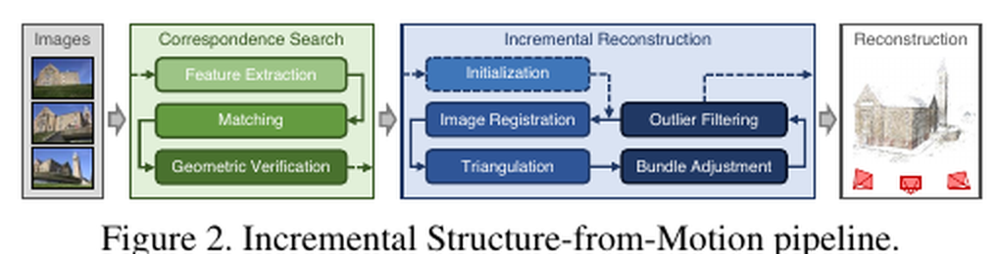
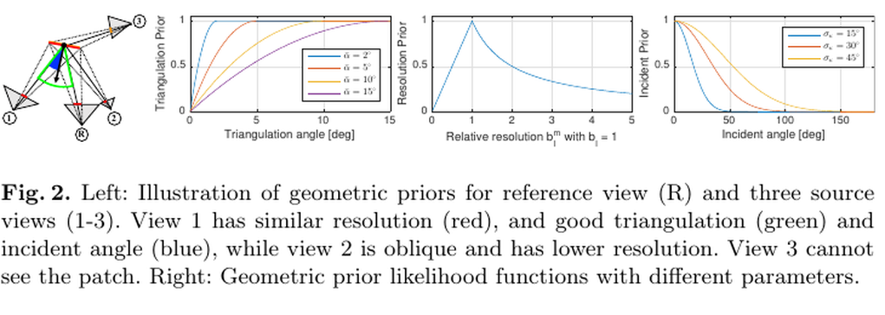
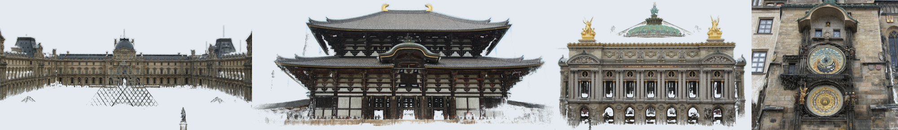
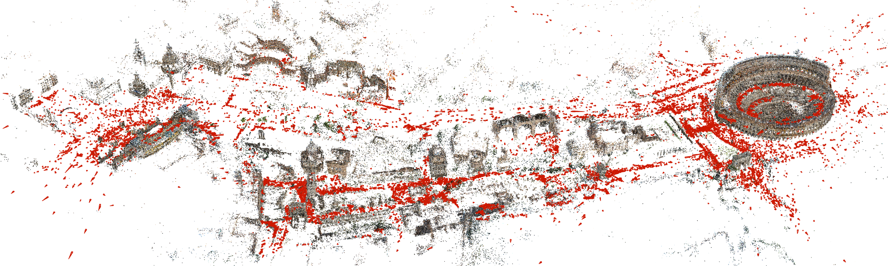

# COLMAP：重新审视 Structure-from-Motion 与非结构化多视图立体的逐像素视图选择

> 说明：COLMAP 由两篇姊妹论文组成——CVPR 2016 的 *Structure-from-Motion Revisited*（Schönberger & Frahm，稀疏重建 / 位姿）与 ECCV 2016 的 *Pixelwise View Selection for Unstructured Multi-View Stereo*（Schönberger, Zheng, Pollefeys, Frahm，稠密重建）。两者共同构成开源管线 COLMAP。本文分析同时覆盖两篇。公式与关键取值已对照两篇原文 PDF 核验（见文末存疑点标注剩余未逐字核对项）。

## 结论先行
- **一句话定位**：COLMAP 不是提出全新范式的论文，而是把「增量式 SfM」与「PatchMatch MVS」的每一个工程环节——场景图几何验证、图像注册顺序（next-best-view）、鲁棒三角化、bundle adjustment 触发策略、逐像素视图 / 深度选择、几何一致性过滤——系统性重做到「在真实无序互联网照片上稳定跑通」的水平，从而成为学术界至今默认的重建工具与真值生成器。
- **为什么是里程碑（推断）**：2016 年后几乎所有需要相机位姿或稠密点云的工作——NeRF、3D Gaussian Splatting，以及 DUSt3R / VGGT 等 learning-based 方法的评测——都把 COLMAP 的输出当作输入或 ground-truth 参照。它定义了这个方向的「基线」与「事实标准」，这也是它 landmark 的真正原因（不是单点算法，而是整条管线的可复现鲁棒性）。
- **稀疏侧核心贡献（证据）**：几何验证增强的**场景图（scene graph）**、基于「已注册可见点空间分布」的 **next-best-view** 选择（多分辨率金字塔打分）、**鲁棒多视图三角化**（RANSAC 式采样），以及**迭代式 BA + re-triangulation** 策略，显著提升增量 SfM 在噪声 / 重复结构 / 弱重叠下的完整度与鲁棒性。原文明确对标开源 Bundler 与闭源 VisualSFM。
- **稠密侧核心贡献（证据）**：把**光度一致性**与**几何一致性**在一个概率框架内联合建模，用**逐像素的视图选择**（把「哪些源视图可信」当作隐变量做边缘化，而非固定邻域），在 PatchMatch 框架里同时估计每像素的**深度 + 法向**，再做多视图几何一致性过滤与融合，明显减少弱纹理与遮挡区的错误深度。
- **工程判断（推断）**：做重建评测、取相机位姿真值、或为 NVS（NeRF/3DGS）准备输入时，COLMAP 至今仍是首选默认工具；但它 CPU/GPU 密集、非实时、纯几何依赖强，在极端弱纹理、大量重复结构、稀疏视图下会失败——这正是后续 feed-forward 方法（DUSt3R / VGGT / Pi3）试图取代的痛点。

## 1. 这篇论文解决什么问题？
- **问题定义**：给定一组无序、无标定、来源混杂（不同相机、光照、时间、分辨率）的图像，恢复相机内外参与场景三维结构（稀疏点云 → 稠密点云 / 网格）。
- **输入 / 输出**：输入为图像集合；SfM 阶段输出相机内外参 + 稀疏 3D 点（含 track / 可见性）；MVS 阶段输出逐像素深度 / 法向图并融合为稠密点云（可进一步网格化）。
- **目标场景**：互联网照片集、无人机 / 手持采集、文化遗产与大规模城市重建等**非结构化数据**（原文以 Rome、Dubrovnik、Quad 等大规模互联网集合验证，Rome 场景 75K 图注册出 21K）。
- **与现有方法的差异（证据）**：相比 Bundler、VisualSFM（SfM）与 PMVS/CMVS、Gipuma（MVS）等前辈，COLMAP 不追求单点算法创新，而是**重做整条管线中的鲁棒性关键点**，使其在「脏数据」上更少崩溃、重建更完整、可复现性更好。

## 2. 方法概览
- **核心想法**：稀疏（SfM）与稠密（MVS）两段式经典几何管线，价值不在某个模块的新颖，而在**每一步的鲁棒化与相互配合**——让整体在真实噪声数据上不失效。
- **一句话 pipeline**：`图像 → 特征提取 → 匹配 → 几何验证得场景图 → 增量式重建（初始化 / 注册 / 三角化 / BA / 外点过滤循环）得稀疏模型 → 去畸变 → PatchMatch 逐像素视图选择估深度法向 → 几何一致性过滤与融合 → 稠密点云`。
- **无学习成分**：全程为几何优化与组合搜索，无神经网络、无训练；「推理」即「跑管线」。

### 2.1 架构解析

**整体结构（模块分解）**：管线分成两大块——**Correspondence Search（对应搜索）**与 **Incremental Reconstruction（增量重建）**，MVS 则接在稀疏模型之后。

1. **Correspondence Search**
   - **Feature Extraction 特征提取**：对每张图提 SIFT 特征（位置 + 描述子）。
   - **Matching 匹配**：图像对之间做描述子最近邻匹配，得到候选对应。
   - **Geometric Verification 几何验证**：对每个候选图像对用 RANSAC 估计 F/E/H（基础 / 本质 / 单应矩阵），只保留能被某个几何模型解释的 inlier 匹配；原文还借鉴 GRIC 式模型选择区分移动相机 / 纯旋转（全景）/ 平面等退化情形。通过验证的图像对成为**场景图**的边。这一步是整条管线鲁棒性的第一道闸门。

2. **Incremental Reconstruction**（图中蓝色循环）
   - **Initialization 初始化**：从场景图中挑选一对重叠好、基线足够的图像做两视图重建作为种子（原文强调初始对选择关键，坏初始化可能不可恢复）。
   - **Image Registration 图像注册**：按 **next-best-view** 打分选下一张待注册图像，用其与已有 3D 点的 2D-3D 对应做 PnP + RANSAC 求位姿。
   - **Triangulation 三角化**：用新注册相机为已有 track 增补观测、并三角化新的 3D 点（鲁棒多视图三角化）。
   - **Bundle Adjustment 光束法平差**：联合优化相机参数与 3D 点，最小化重投影误差；采用 **局部 BA**（每次注册后只优化最相关的一小组相机）+ **全局 BA**（模型扩张到一定比例后触发一次，类比 VisualSFM）的分层策略控制成本与漂移，摊销后近似线性开销。
   - **Outlier Filtering 外点过滤**：剔除重投影误差过大 / 三角化角过小的观测与点；全局 BA 后还检测退化相机（全景 / 人为增强图）。
   - 上述四步循环，直到没有可注册的图像。此外还有 **re-triangulation** 与 iterative refinement 提升完整度。

3. **MVS（稠密）**：对稀疏模型去畸变后，逐像素做 PatchMatch 深度 / 法向估计（含逐像素视图选择）→ 几何一致性过滤 → 融合成稠密点云。

**关键设计选择及理由**：
- **场景图先验过滤**：把「哪些图像对可信」这件事在进入增量重建前就用几何验证解决，避免坏匹配污染后续 BA。
- **注册顺序不是随意的**：next-best-view 让「信息最丰富、约束最强」的图像先进来，减少早期漂移与失败。
- **BA 分层触发**：全局 BA 昂贵，只在模型增长一定比例后做；局部 BA 保证增量稳定，是「能跑大规模」的关键工程选择。

### 2.2 核心原理

**为什么 next-best-view 这样设计 work（证据）**：增量 SfM 的成败高度依赖注册顺序——先注册约束弱、可见点少或空间分布集中的图像，容易引入退化位姿和累积漂移。COLMAP 用一个**同时奖励「可见点数量」与「可见点空间分布均匀度」**的打分函数选下一张图（见 2.3 公式 1）。多分辨率网格的设计让「均匀铺满全图的点」得分高于「都挤在一角的点」，因为分布均匀的对应对相机位姿的约束更好、更抗噪。

**为什么逐像素视图选择 work（证据）**：传统 MVS 对参考图固定一组邻域源视图，但在无序互联网照片里，不同像素被不同子集的图像看到（遮挡、视场、分辨率差异各不同）。COLMAP 把「像素 l 在源图 m 中是否可信（未被遮挡）」建模为二值**隐变量 $Z_l^m$**，在估计深度 / 法向的同时对该隐变量做概率推断并边缘化——等价于**每个像素自适应地选自己的支持视图**。这让弱纹理、部分遮挡区不再被错误的源视图带偏。

**关键机制 / 归纳偏置**：MVS 侧的核心归纳偏置是**「几何上更可信的源视图应获得更高采样权重」**，具体拆成三个可解释的几何先验（上图右三条似然曲线），它们通过视图采样分布 $P_l(m)$ （公式 5/7）调制源视图的选择概率：
- **三角化角先验**：纯光度选择会偏爱小基线（外观最像）的源视图，但零基线视图对深度无信息。该先验**惩罚三角化角低于阈值 $\bar\alpha$ 的源视图，一旦超过阈值就不再额外偏好**——因此其似然是**单调上升并在高角度饱和到 1** 的曲线（对应上图左一，非峰形），而不是在某个中间角取峰。
- **分辨率先验**：源视图与参考视图对该 patch 的采样面积比 $\beta$ 越接近 1 越好（避免尺度 / 形状失配），似然 $P(\beta)=\min(\beta,\beta^{-1})$ 在 $\beta{=}1$ 处取峰（对应上图中间，峰形）。
- **入射角先验**：视线相对表面法向越正（入射角 $\kappa$ 越小）patch 越可靠，似然随 $\kappa$ 以高斯形式衰减（对应上图右一）。

**与前作在原理上的本质区别**：
- 对 Bundler/VisualSFM：区别不在「用不用增量 SfM」，而在**把每个鲁棒性环节（场景图验证、注册排序、鲁棒三角化、re-triangulation、BA 触发）都重做并耦合**，使失效率大幅下降。
- 对 PMVS/CMVS 与 Zheng et al. 的 PatchMatch 视图选择：区别在**把固定 / 纯光度的视图选择扩展为「光度隐变量 + 三条几何先验」的逐像素在线概率选择**，并引入多视图**几何一致性**联合进推断（而非仅作后处理左右一致性检查）。

### 2.3 关键公式解析

> 注：以下公式已对照 CVPR/ECCV 2016 原文 PDF 核验形式与符号。少数超参默认值（如 L 层数、RANSAC 阈值）原文未全部给定固定数字或为可配置项，标为「待核验/可配置」，见文末存疑点。

**公式 (1) — Next-best-view 选择打分（SfM）**

把候选图像的可见 3D 点投影到一个多分辨率网格金字塔上，按「首次被填充的格子」加权计分：

$$ S \;=\; \sum_{l=1}^{L} w_l \cdot \bigl|\{\text{level-}l\text{ cells occupied by} \ge 1 \text{ visible point}\}\bigr| $$

- 符号（已核验）：level $l$ 把图像每个维度划分为 $K_l = 2^l$ 个 bin（即 $2^l\times 2^l$ 个格子）；权重 $w_l = K_l^2 = 4^l$ （越细的层权重越大）；「被占用格子数」统计的是**可见点的空间覆盖**而非点数本身，每个格子只在首次被填充时计一次。
- 作用：得分同时反映「看到的已重建点**多不多**」与「这些点**铺得均不均匀**」。选 $S$ 最大的图像作为下一张注册对象，抑制退化注册与漂移；该数据结构可在线增量更新。

**公式 (2) — Bundle Adjustment 目标（SfM，原文 Eq. 1）**

联合优化相机参数 $\{P_c\}$ 与 3D 点 $\{X_k\}$，最小化带鲁棒核的重投影误差：

$$ E \;=\; \sum_{j} \; \rho_j\!\left( \big\lVert \pi(P_{c},\, X_{k}) - x_j \big\rVert^2 \right) $$

- 符号： $j$ 遍历所有观测（2D 特征）； $x_j$ 为观测像素坐标； $\pi(\cdot)$ 为把 3D 点 $X_k$ 用相机 $P_c$ 投影到像平面的投影函数； $\rho_j(\cdot)$ 为鲁棒损失——原文**明确采用 Cauchy 函数**降低外点影响。求解用 Ceres Solver（小规模稀疏直接解，大规模用 PCG），LM 为优化方法。
- 作用：这是几何一致性的总能量。Cauchy 核是「脏数据」下不被少量错误匹配拖垮的关键；配合局部 / 全局 BA 分层触发控制计算量。

**公式 (3) — MVS 的光度似然与联合概率（MVS，原文 Eq. 1/2）**

对参考图每个像素 $l$，二值遮挡隐变量 $Z_l^m\in\{0,1\}$ （ $m$ 为源视图索引）与深度 $\theta_l$ 决定**光度似然**：

$$ P(X_l^m \mid Z_l^m, \theta_l) \;=\; \begin{cases} \dfrac{1}{N A}\,\exp\!\Big(-\dfrac{(1-\rho_l^m(\theta_l))^2}{2\sigma_\rho^2}\Big) & Z_l^m = 1 \\[2mm] \dfrac{1}{N}\cdot\dfrac{1}{U} & Z_l^m = 0 \end{cases} $$

隐变量在像素间用**行方向的状态转移矩阵**建模平滑性（ $P(Z_l^m\mid Z_{l-1}^m)$ 对角为 $\gamma$、非对角为 $1-\gamma$ ），整幅参考图的联合概率为：

$$ P(X, Z, \theta) \;=\; \prod_{l=1}^{L}\prod_{m=1}^{M} \big[\, P(Z_l^m \mid Z_{l-1}^m)\; P(X_l^m \mid Z_l^m, \theta_l)\,\big] $$

- 符号： $\rho_l^m$ 为参考 patch 与按 $(\theta_l,\mathbf n_l)$ 单应变换到源图的 patch 之间的**归一化互相关 (NCC)**（COLMAP 用**双边加权 NCC** 改善遮挡边界）； $Z_l^m{=}0$ （遮挡）时两 patch 颜色不相关、服从 $[-1,1]$ 上的均匀分布； $\sigma_\rho$ 是「可见」的软阈值。
- **重要更正**：三条几何先验（三角化角 / 分辨率 / 入射角）**并不直接出现在上式联合概率里**，而是作为调制因子进入**蒙特卡洛视图采样分布**（原文 Eq. 7）：
$$ P_l(m) \;\propto\; q(Z_l^m{=}1)\, q(\alpha_l^m)\, q(\beta_l^m)\, q(\kappa_l^m) $$
- 作用： $Z_l^m$ 把「该源视图对该像素是否可信」显式建模并**边缘化**掉；论文用**变分推断 + 广义 EM（GEM）**，其中隐变量 $Z$ 的推断（E 步）在这条像素链上用**前向-后向（forward-backward）算法**（即隐 Markov 链），深度 $\theta$ 用 **PatchMatch 采样**（M 步）交替求解——「行方向图模型 / 类 HMM」的描述已核验为原文原意。

**公式 (4) — 几何一致性约束（MVS，光度收敛后加入）**

用前向-后向重投影误差度量参考深度与源视图深度是否自洽：

$$ \psi_l^m \;=\; \big\lVert \, x_l - H_l^m H_l\, x_l \, \big\rVert, \qquad \xi_l^m \;=\; \big(1-\rho_l^m\big) \;+\; \eta\,\min\!\big(\psi_l^m,\; \psi_{\max}\big) $$

- 符号（已核验取值）： $H_l$ 把参考像素 $x_l$ 按其深度前向投到源图， $H_l^m$ 用源图估计 $(\theta_l^m,\mathbf n_l^m)$ 反投回参考图；两次投影的像素位移即前向-后向重投影误差 $\psi_l^m$。 $\rho_l^m$ 为光度项， $\eta=0.5$ 为常数正则权重， $\psi_{\max}=3\,\text{px}$ 为截断阈值（避免遮挡区惩罚爆炸）。最终深度 / 法向由 $\hat\theta_l^{opt},\hat{\mathbf n}_l^{opt}=\arg\min\frac{1}{|S|}\sum_{m\in S}\xi_l^m$ 选出。
- 作用：光度一致但几何矛盾的深度（常见于重复纹理 / 反射）会被这一项压制。与多数方法把左右一致性放到后处理不同，COLMAP 把它**直接整合进推断**，同时提升完整度与准确度。

### 2.4 训练与推理细节
- **训练目标 / 损失函数**：无训练。SfM 的「损失」即公式 (2) 的 Cauchy 鲁棒重投影能量；MVS 的「目标」即公式 (3)(4) 的联合后验最大化（变分推断 + GEM）。全部通过几何优化（PnP、三角化、BA 用 Ceres）与 PatchMatch 迭代求解。
- **数据规模**：无训练数据；SfM 论文在大规模互联网照片集合（Rome 75K→21K、Dubrovnik 2.9M feature tracks / 47M 验证匹配、Quad 含相机位置 GT）上验证可扩展性；MVS 论文在 South Building（128 图）、Middlebury（Dino 等）、Strecha（Fountain 等高分辨率带 GT）及 Internet 数据上验证。
- **超参要点（部分已核验）**：已核验 next-best-view 权重 $w_l=K_l^2$、BA 用 Cauchy 核、MVS 中 $\eta=0.5$ / $\psi_{\max}=3\text{px}$。其余如金字塔层数 $L$、几何验证 RANSAC 内点阈值、三角化最小角度、全局 BA 触发的模型增长比例、re-triangulation 触发条件、NCC 窗口大小与融合最少一致视图数——原文未全部给定固定数字或为可配置旋钮，精确默认值请回原文 Sec. 4/5 或官方文档核对。
- **推理（即跑管线）流程**：
  1. `feature_extractor`（SIFT）→ 2. `*_matcher`（穷举 / 词表 / 顺序匹配）→ 3. 几何验证得场景图 → 4. `mapper`（增量重建：初始化 → 注册 → 三角化 → BA → 过滤循环）得稀疏模型 → 5. `image_undistorter` → 6. `patch_match_stereo`（逐像素深度 / 法向 + 视图选择）→ 7. `stereo_fusion`（几何一致性融合）→ 稠密点云 →（可选）`poisson_mesher` / `delaunay_mesher` 网格化。

## 3. 关键贡献
1. **鲁棒增量式 SfM 流程（证据）**：场景图几何验证、next-best-view 注册排序（多分辨率金字塔打分）、鲁棒多视图三角化、迭代局部/全局 BA（Cauchy 核）+ re-triangulation，使 SfM 在真实无序图像上更少崩溃、注册更多图像、重建更完整；原文报告在完整度与鲁棒性上明显超过 Bundler / VisualSFM。
2. **非结构化 MVS 的逐像素视图选择（证据）**：把逐视图遮挡作为隐变量与深度/法向联合概率推断，融合双边 NCC 光度项与三条几何先验（经采样分布调制），并把多视图**几何一致性**整合进推断而非仅后处理，提升弱纹理 / 遮挡区深度质量。
3. **以 new BSD 开源的完整 SfM+MVS 工具（证据）**：GUI + CLI、可复现、易集成，直接奠定其成为社区事实标准与真值生成器——这是它「landmark」的现实基础。

## 4. 实验与证据
| 维度 | 内容 |
|---|---|
| 数据集 | SfM：大规模互联网照片集合（Rome、Dubrovnik、Quad 等，Quad 带相机位置 GT）；MVS：South Building、Middlebury（Dino 等）、Strecha（Fountain 等高分辨率带 GT）及 Internet 数据。（注：DTU/ETH3D 为社区后续常用评测，非原两篇论文所用——ETH3D 由 Schöps 等 2017 CVPR 提出，Schönberger 为共同作者之一） |
| Baseline | Bundler、VisualSFM，以及全局式 DISCO / Theia（SfM）；PMVS/CMVS、Gipuma、Zheng et al. 等 PatchMatch MVS（MVS） |
| 指标 | 成功注册图像数、重投影误差、重建完整度 / 准确度（completeness / accuracy）；MVS 在 Strecha 上用误差 < 2cm / 10cm 像素比例 |
| 主要结果 | SfM 在难度大的无序数据上比前代**注册更多图像、重建更完整、鲁棒性更强**（Rome 75K 中注册 21K）；MVS 在 Middlebury / Strecha 上达 SOTA。逐项精确对比数值本仓库未逐字誊录（**详见存疑点**） |
| 消融 | SfM 侧分析 next-best-view、re-triangulation、BA 触发策略的作用；MVS 侧以 South Building 逐项消融（去法向 \N、去几何先验 \P、去时间平滑 \S、去几何一致性 \G、去双边 NCC \B），验证各组件增益 |
| 失败案例 | 弱 / 无纹理表面、大量重复结构、镜面 / 透明物体、视图重叠极稀疏时匹配与三角化失败 |

### 4.1 效果与性能解析

- **主要结果解读（不只搬数字）**：COLMAP 的强不来自单个精度指标，而来自**「在别的管线直接失败的脏数据上仍能收敛出完整、干净的模型」**。上图这类大规模无序互联网照片（成千上万张不同相机 / 光照 / 时间）能重建出结构清晰、外点少的模型，正是场景图验证 + next-best-view + 鲁棒三角化 + re-triangulation 组合的直接体现——它把「注册失败 / 漂移 / 断裂」这些前代方法的常见崩溃模式压下去了。MVS 侧的干净稠密点云则来自逐像素视图选择 + 几何一致性过滤（弱纹理与遮挡区少了大量飞点）。
- **性能与效率（推断为主）**：CPU/GPU 密集、非实时。SIFT 提取与匹配在大图像集上是主要瓶颈之一（可用 GPU 加速 / 词表匹配缓解）；BA 用 Ceres，全局 BA 昂贵故按模型增长比例分层触发（摊销近似线性）；MVS PatchMatch 走 CUDA。整体可扩展到数万~数十万图像级别，但代价是**小时~天级**的时间与大内存。相较后续 feed-forward 方法（DUSt3R/VGGT 秒级），COLMAP 属「慢但精度 / 规模上限高」。
- **消融揭示的关键因素（证据）**：SfM 侧，re-triangulation 与合理的注册排序对「最终注册图像数 / 完整度」贡献显著——即鲁棒性主要由这些组合环节而非单一算法带来。MVS 侧，几何先验、几何一致性、双边 NCC、法向估计各组件在 South Building 消融中均被验证为质量增益来源，叠加效果最好。
- **与 SOTA / baseline 的可比性**：作为**评测基准与真值来源**，COLMAP 定义了后续方法的对照协议——很多 learning-based 位姿 / 深度方法直接以 COLMAP 输出为 GT 或 baseline。需注意：把 COLMAP 当「真值」本身有偏差（它也会错），严格评测应在有独立 GT（如 Strecha 的激光扫描、后来的 ETH3D）的数据集上比较。

## 5. 局限与风险
- **论文承认**：依赖足够的纹理与视图重叠；重复结构会造成错误匹配与重建歧义；MVS 光度一致性在弱纹理 / 大深度变化下代价曲面平坦、易出粗差（故引入几何一致性）。
- **推断风险**：纯几何、无语义 / 学习先验，稀疏视图 / 弱纹理下无优雅退化（要么成功要么崩溃）；大规模场景计算与内存开销高、非实时。
- **工程落地风险**：管线参数众多，调参与失败排查成本不低；GPU 加速依赖 CUDA 环境；把 COLMAP 输出当 GT 时需警惕其自身误差。
- **许可证 / 数据风险**：COLMAP 本体为 new BSD（3-clause），商用友好；但历史上 SIFT 相关实现曾有专利 / 许可争议，实际集成需核对第三方依赖许可（如所用特征实现）。

## 方法谱系

> 与 frontmatter 的 supersedes / builds_on 保持一致（COLMAP 为奠基工具，无前作取代关系；后续大量方法 builds_on 它）。

- 被后续方法用作输入 / 真值：[NeRF](../3d-reconstruction/2020-nerf.md)、[3D Gaussian Splatting](../3d-reconstruction/2023-3dgs.md) 依赖 COLMAP 提供相机位姿。
- 被后续方法对标 / 试图取代：[DUSt3R](../3d-reconstruction/2023-dust3r.md)、[VGGT](../3d-reconstruction/2025-vggt.md)、[Pi3](../3d-reconstruction/2026-pi3.md) 等 feed-forward 方法以「摆脱 COLMAP 的慢 / 需重叠 / 易失败」为动机。

## 6. 与相似方法对比

> 横向对比见：[场景表示范式对比](../../comparisons/3d-reconstruction/scene-representation-paradigms.md)（COLMAP/NeRF/3DGS 三范式）、[3D 重建发展全景](../../comparisons/3d-reconstruction/development-survey.md)。

| Method | 相同点 | 不同点 | 何时选它 |
|---|---|---|---|
| Bundler / VisualSFM | 同为增量式 SfM | COLMAP 在场景图验证、注册排序、鲁棒三角化、BA 触发上全面重做，鲁棒性 / 完整度 / 工程质量更高且仍在维护 | 需要现代、可靠、可集成的 SfM 时选 COLMAP |
| PMVS/CMVS / Gipuma / Zheng et al. | 同为经典 / PatchMatch MVS | COLMAP 用**逐像素**概率视图选择（光度隐变量 + 三条几何先验）+ 光度 / 几何联合一致性，而非离线聚类的固定邻域或纯光度选择 | 无序图像稠密重建默认选 COLMAP |
| DUSt3R / VGGT / Pi3 | 目标同为位姿 + 几何 | 它们是 feed-forward、可处理稀疏视图、秒级；COLMAP 精度 / 规模上限高但慢、需足够重叠、易在弱纹理崩溃 | 稀疏视图 / 实时 / 无标定弱纹理选 learning 方法；要高精度真值 / 大规模重建选 COLMAP |

## 7. 复现判断
- **Git 地址**：https://github.com/colmap/colmap
- **是否开源**：是，new BSD（3-clause；版权归 ETH Zurich & UNC Chapel Hill），已对照仓库核验。
- **是否开源训练**：不适用——COLMAP 为经典几何管线，无神经网络、无训练代码 / 数据。
- **代码 / 权重 / 数据可用性**：代码完整开源、持续维护；无模型权重概念；官网 / 仓库提供 sample datasets 与预编译 / Docker，便于上手。
- **预计环境成本**：中等。安装（或用官方预编译 / Docker）后即可跑；大规模场景需较强 CPU/GPU 与大内存 / 长时间。
- **最小复现路径**：安装 COLMAP → 准备一组重叠良好的图像 → 运行 automatic reconstruction（`feature_extractor` → `*_matcher` → `mapper` 得稀疏模型 → `image_undistorter` → `patch_match_stereo` → `stereo_fusion` 得稠密点云）。
- **是否值得复现**：作为**工具直接使用**而非「复现算法」；建议纳入评测 / 真值生成基线，与 feed-forward 方法对照。

## 8. 后续动作
- [ ] 更新 `indices/papers.md`
- [ ] 更新 `indices/directions.md`
- [ ] 维护 `comparisons/3d-reconstruction/scene-representation-paradigms.md` 与 `development-survey.md` 中 COLMAP 条目
