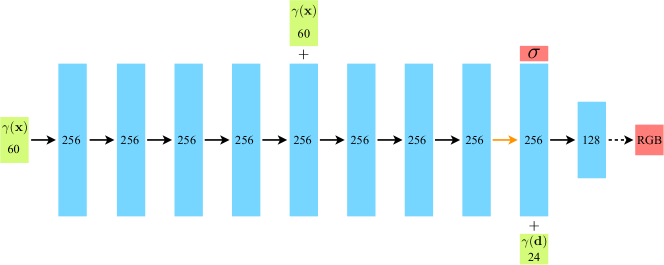
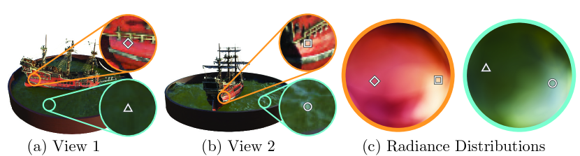

# NeRF：用神经辐射场表示场景以实现新视角合成

## 结论先行
- **一句话定位**：NeRF 把一个静态场景压缩进一个小型全连接网络（坐标 MLP），输入 5D 坐标（空间位置 $(x,y,z)$ + 视角方向 $(\theta,\phi)$ ），输出该点的体密度 $\sigma$ 和视角相关颜色 $\mathbf{c}$；再沿相机光线做可微体渲染得到像素。这是神经隐式表示用于视图合成的分水岭工作，把"3D 重建/视图合成"从显式几何（体素、mesh、MPI）重新定义为"优化一个连续函数"。
- **两个关键工程技巧决定成败**（证据）：位置编码（positional encoding，把低维坐标映射到高频傅里叶基）解决 MLP 天生偏好低频、渲染发糊的问题；分层采样（coarse-to-fine，coarse + fine 两个网络）把采样点集中到有物质的区域，大幅提升效率与质量。论文消融显示去掉任一都会明显掉点（Table 2）。
- **量化领先明确**（证据，Table 1）：在 Realistic Synthetic 360 (Blender) 上 PSNR 31.01 / SSIM 0.947 / LPIPS 0.081，全面优于 LLFF、NV、SRN；在真实前向场景 LLFF 上 PSNR 26.50 / SSIM 0.811，PSNR/SSIM 领先，仅 LPIPS 0.250 略逊于 LLFF 的 0.212（论文自己承认）。
- **代价是「每个场景单独训练」**（推断+证据）：NeRF 不是前馈重建，而是对单场景做 1–2 天的优化（单 V100），且渲染需沿每条光线密集查询 MLP（coarse 64 + fine 128 个点），速度慢到无法实时。这一根本约束催生了后续大量加速与泛化工作（Instant-NGP、Plenoxels、3D Gaussian Splatting 等）。
- **复现友好**（证据）：官方 TensorFlow 实现开源、MIT 许可、含完整训练脚本与示例数据，是本领域最经典可复现的 baseline 之一。

## 1. 这篇论文解决什么问题？
- **问题定义**：给定一组已知相机位姿的多视角照片，合成任意新视角下的逼真图像（novel view synthesis）。
- **输入 / 输出**：输入是稀疏的多视角 RGB 图像 + 对应相机内外参（论文用 COLMAP 等估计位姿）；输出是一个编码整个场景的连续函数 $F_\Theta:(\mathbf{x},\mathbf{d})\to(\mathbf{c},\sigma)$，可渲染任意视角图像。
- **目标场景**：静态场景，既覆盖合成物体（Blender 360）也覆盖真实前向拍摄场景（LLFF）。
- **与现有方法差异**：此前方法多用离散体素网格、mesh、多平面图像（MPI，如 LLFF）或离散化的体表示（NV），受分辨率与内存限制——分辨率翻倍内存立方级增长。NeRF 用连续的隐式函数 + 体渲染，用极小的网络参数（约 5MB 权重）表示高分辨率几何与视角相关外观，把"分辨率"从存储问题变成查询问题。

## 2. 方法概览
- **核心想法**：把场景表示为一个连续 5D 神经辐射场。空间位置决定"有没有东西、多不透明"（密度 $\sigma$，只依赖位置以保证多视角一致），加上视角方向决定"看起来什么颜色"（颜色 $\mathbf{c}$，依赖方向以建模镜面高光等）。
- **一句话 pipeline**：对每条相机光线采样一批 3D 点 → 用位置编码升维后送入 MLP 查询 $(\sigma,\mathbf{c})$ → 沿光线做可微体渲染积分累积成一个像素颜色 → 与真值像素求 L2，梯度反传优化 MLP 权重。

### 2.1 架构解析
- **整体结构（模块分解）**：NeRF 本体就是一个 MLP $F_\Theta$，但外围包着两个"非神经"的关键模块——位置编码（输入端）和体渲染（输出端）。数据流为：`光线采样点 → 位置编码 γ → MLP → (σ, c) → 体渲染积分 → 像素 → L2 损失`。整个链路端到端可微。
- **MLP 内部数据流**（见下图 Figure 7）：
  1. 位置 $\mathbf{x}$ 经位置编码得 $\gamma(\mathbf{x})$ （60 维），送入 8 层、每层 256 通道的 ReLU 全连接网络；
  2. 第 5 层处有一个 **skip connection**，把 $\gamma(\mathbf{x})$ 再次拼接进来（缓解深层网络对输入坐标的信息衰减）；
  3. 第 8 层输出 **体密度 $\sigma$**（经 ReLU 保证非负）以及一个 256 维特征向量；
  4. 该特征向量与视角方向的编码 $\gamma(\mathbf{d})$ （24 维）拼接，再经一层 128 通道网络输出 **RGB 颜色**（经 Sigmoid 归一到 [0,1]）。
- **关键设计选择及理由**：
  - **密度只看位置、颜色才看方向**：这是刻意的归纳偏置。密度是几何属性，必须多视角一致（同一点从哪看都该"有东西"），若让 $\sigma$ 依赖方向会破坏几何一致性；颜色则需要依赖方向来建模镜面反射、高光等视角相关效果。网络结构上把 $\gamma(\mathbf{d})$ 推迟到最后一层注入，正是为了强制这一约束。
  - **网络很浅很窄**：8 层 256 通道，总参数约百万级（约 5MB 权重），却能表示高分辨率场景——因为"分辨率"由采样密度和位置编码频率决定，而非参数量。

### 2.2 核心原理
- **为什么 work：可微体渲染把 2D 监督反传到 3D 场**。NeRF 没有任何 3D 真值（没有点云、没有 mesh、没有深度）。它唯一的监督信号是 2D 像素颜色。体渲染的巧妙之处在于：像素颜色是沿光线所有点 $(\sigma,\mathbf{c})$ 的**可微加权积分**，因此像素误差能反传到光线上每个采样点的密度和颜色，进而通过多条光线在 3D 空间的交汇，隐式地"三角化"出一致的几何。多视角约束在这里起到几何监督的作用——只有当密度场在真实表面处集中，不同视角的渲染才能同时对上。
- **关键机制 1：位置编码打破 MLP 的低频偏置（谱偏差）**。标准 MLP 有强烈的"谱偏差"（spectral bias），天生倾向拟合低频函数，直接用 $(x,y,z)$ 做输入会导致纹理、边缘等高频细节严重模糊。位置编码把每个坐标用一组指数增长频率的 $\sin/\cos$ 展开，等价于把输入映射到一个高频傅里叶特征空间，使 MLP 能表达高频变化。这不是可有可无的 trick——消融显示去掉后 PSNR 明显下降（高频细节全糊）。
- **关键机制 2：分层采样让采样预算物尽其用**。均匀采样在空场景中浪费大量算力。NeRF 用 coarse 网络的密度输出构造一个概率分布，再用逆变换采样（inverse transform sampling）在高密度区（真实表面附近）加密采样点喂给 fine 网络，等价于一种重要性采样。
- **与前作的本质区别**：SRN 也用坐标网络隐式表示，但没有位置编码、用可学习的光线步进，细节弱；NV/体素法受离散分辨率与内存立方增长限制。NeRF 的本质突破是"**连续函数 + 傅里叶特征 + 经典体渲染**"三者组合，第一次让隐式表示的视图合成质量超过显式方法。

### 2.3 关键公式解析

**公式 (1)：位置编码（Positional Encoding）**

$$\gamma(p) = \big(\sin(2^{0}\pi p),\ \cos(2^{0}\pi p),\ \dots,\ \sin(2^{L-1}\pi p),\ \cos(2^{L-1}\pi p)\big)$$

- 符号： $p$ 是归一化后的单个标量坐标分量（对位置的 3 个分量和方向的 3 个分量分别独立施加）； $L$ 是频率级数，位置用 $L=10$、方向用 $L=4$。频率按 $2^k$ 指数增长。
- 维度：位置 $\gamma(\mathbf{x})$ = 3 分量 × 2（sin/cos）× 10 = **60 维**；方向 $\gamma(\mathbf{d})$ = 3 × 2 × 4 = **24 维**（与 Figure 7 标注一致）。
- 作用：把低维平滑坐标升到高频空间，克服 MLP 谱偏差，是渲染高频细节（纹理、锐利边缘）的前提。频率上限 $2^{L-1}$ 决定了能表达的最高空间频率。

**公式 (2)：连续体渲染积分（Volume Rendering）**

$$C(\mathbf{r}) = \int_{t_n}^{t_f} T(t)\,\sigma(\mathbf{r}(t))\,\mathbf{c}(\mathbf{r}(t),\mathbf{d})\,dt,\qquad T(t)=\exp\!\Big(-\int_{t_n}^{t}\sigma(\mathbf{r}(s))\,ds\Big)$$

- 符号： $\mathbf{r}(t)=\mathbf{o}+t\mathbf{d}$ 是从相机原点 $\mathbf{o}$ 沿方向 $\mathbf{d}$ 的光线； $[t\_n,t\_f]$ 是近/远采样边界； $\sigma$ 是体密度（单位长度上光线被吸收/散射的微分概率）； $\mathbf{c}$ 是该点视角相关颜色； $T(t)$ 是**累积透射率**——光线从 $t\_n$ 走到 $t$ 未被遮挡的概率。
- 作用：这是经典体渲染方程（源自经典体积渲染理论）。它把一条光线上所有点的颜色，按"该点密度 × 走到该点还没被挡住的概率"加权积分，得到像素期望颜色。 $T(t)$ 项自动实现了遮挡关系——前面有实心表面，后面的点权重会被指数压低。整条积分对 $\sigma,\mathbf{c}$ 可微，是梯度能反传到 3D 场的数学基础。

**公式 (3)：离散数值求积（Quadrature，实际实现）**

$$\hat{C}(\mathbf{r}) = \sum_{i=1}^{N} T_i\,\big(1-e^{-\sigma_i\delta_i}\big)\,\mathbf{c}_i,\qquad T_i=\exp\!\Big(-\sum_{j=1}^{i-1}\sigma_j\delta_j\Big),\qquad \alpha_i = 1-e^{-\sigma_i\delta_i}$$

- 符号： $N$ 是光线上采样点数； $\delta\_i=t\_{i+1}-t\_i$ 是相邻采样点间距； $\alpha\_i$ 是第 $i$ 段的不透明度（alpha）； $T\_i$ 是离散累积透射率。
- 作用：把连续积分 (2) 用分层随机采样（stratified sampling）离散化为可计算的求和。形式上等价于经典的 **alpha compositing / over 合成**——这与图形学的传统混合公式完全一致，也是它能和 3DGS 等后续显式方法在"合成算子"层面对齐的原因。 $\alpha_i=1-e^{-\sigma_i\delta_i}$ 把密度 $\sigma$ 转成 [0,1] 的不透明度；分层随机采样保证连续位置都能被训练到，避免固定网格导致的量化。

### 2.4 训练与推理细节
- **损失函数**：像素级 L2 重建损失，**同时监督 coarse 与 fine 两个网络**：
  $$\mathcal{L} = \sum_{\mathbf{r}\in\mathcal{R}}\Big[\big\|\hat{C}_c(\mathbf{r})-C(\mathbf{r})\big\|_2^2 + \big\|\hat{C}_f(\mathbf{r})-C(\mathbf{r})\big\|_2^2\Big]$$
  其中 $\hat{C}\_c$、 $\hat{C}\_f$ 分别是 coarse、fine 网络的渲染结果， $C$ 是真值像素颜色。coarse 也被监督，才能给出可靠的密度分布用于 fine 的重要性采样。
- **采样**：coarse 网络均匀分层采样 $N\_c=64$ 个点；fine 网络在 coarse 密度导出的分布上再采 $N\_f=128$ 个点，与前 64 个合并（共 192 个点）参与 fine 渲染。
- **训练数据与规模**：每个场景独立优化，输入约几十到 100 多张标定图像。每步随机采样一个 **batch = 4096 条光线**。
- **超参要点**：Adam 优化器，学习率 $5\times10^{-4}$ 指数衰减到 $5\times10^{-5}$；单场景约 100k–300k 次迭代，单张 NVIDIA V100 需 **1–2 天**。
- **推理流程**：给定新相机位姿，对每个像素发射一条光线 → 分层采样 → 位置编码 → 查询 coarse+fine MLP → 体渲染累积成颜色。逐场景优化，**无跨场景泛化**，渲染一张图需百万级 MLP 前向查询，无法实时。

## 3. 关键贡献
1. 提出用连续 5D 神经辐射场 + 可微体渲染表示复杂场景几何与视角相关外观，用一个小型 MLP 达到当时最优的新视角合成质量，重定义了视图合成的表示范式。
2. 引入位置编码（傅里叶特征）解决坐标 MLP 的低频偏置（谱偏差），是渲染高频细节的核心技巧，后被大量隐式表示工作沿用。
3. 引入 coarse-to-fine 分层采样策略（等价于沿光线的重要性采样），将有限采样预算集中到有物质的区域，兼顾质量与效率。

## 4. 实验与证据
| 维度 | 内容 |
|---|---|
| 数据集 | Diffuse Synthetic 360、Realistic Synthetic 360 (Blender)、Real Forward-Facing (LLFF)、DeepVoxels |
| Baseline | SRN（Scene Representation Networks）、NV（Neural Volumes）、LLFF（多平面图像） |
| 指标 | PSNR↑ / SSIM↑ / LPIPS↓ |
| 主要结果（Table 1） | Realistic Synthetic 360: 31.01 / 0.947 / 0.081（优于 LLFF 24.88/0.911/0.114、SRN 22.26/0.846/0.170）；Real Forward-Facing: 26.50 / 0.811 / 0.250（PSNR/SSIM 领先 LLFF 24.13/0.798/0.212，LPIPS 略逊；SRN 22.84/0.668/0.378）；Diffuse Synthetic 360: 40.15 / 0.991 / 0.023（优于 LLFF 34.38/0.985/0.048、NV 29.62/0.929/0.099） |
| 消融 | 去掉位置编码、视角依赖或分层采样均显著掉点；位置编码对高频细节尤其关键 |
| 失败案例 | 真实前向场景 LPIPS（0.250）略逊于 LLFF（0.212），论文承认但主张多视角一致性与更少伪影更好 |

### 4.1 效果与性能解析
- **主要结果解读（为什么强）**：NeRF 在三个数据集上的 PSNR/SSIM 几乎全面碾压 baseline，且在合成数据上优势最大（Realistic Synthetic 360 领先第二名 LLFF 达 6+ dB PSNR）。原因在于连续表示 + 位置编码能表达任意高频细节，而 baseline 受离散化限制：LLFF 的 MPI 在大视差下出现重影，NV 的体素在物体边缘量化明显。NeRF 用一个约 5MB 网络击败需要几十上百 MB 存储的显式方法，说明"参数量 ≠ 表达能力"，采样密度和频率编码才是关键。
- **为什么真实场景 LPIPS 略弱**：LLFF 在真实前向场景 LPIPS（0.212）优于 NeRF（0.250）。推断原因是 LLFF 直接混合真实图像块，保留了逼真的高频纹理统计（LPIPS 对感知纹理敏感），而 NeRF 的连续场倾向于产生略平滑但几何一致的结果。论文主张 NeRF 的多视角一致性和更少伪影在实际观看中更优。
- **性能与效率（核心短板）**：训练——每场景 1–2 天（单 V100）；渲染——一张图需对每像素发射光线、每条光线查询 192 个点、每点一次 MLP 前向，百万像素级别下是数亿次前向，**远达不到实时**。存储虽小（~5MB/场景）但计算密集。这正是后续 Instant-NGP（哈希编码，训练降到秒/分钟级）、Plenoxels（去掉神经网络用显式体素）、3D Gaussian Splatting（显式高斯 + 光栅化，实时渲染）要解决的核心问题。
- **消融揭示的关键因素**（Table 2）：位置编码、分层采样、视角依赖三者去掉都掉点，其中去掉位置编码掉得最多（高频细节全糊）；视角依赖对镜面高光场景影响明显。这条消融基本确立了 NeRF 三大组件缺一不可。
- **可比性与协议一致性**：所有方法在相同数据集、相同 train/test split、相同三指标下比较，协议一致，PSNR/SSIM/LPIPS 三个互补指标（保真度 + 结构 + 感知）覆盖较全，结论可信。

## 5. 局限与风险
- **论文承认**：真实场景 LPIPS 感知指标不及 LLFF；方法针对静态场景，不建模动态、光照变化或大范围无界场景；训练/渲染慢。
- **推断风险**：每个场景需单独优化（1–2 天，单 GPU），渲染需密集光线采样，速度慢，不适合实时或前馈重建需求；对无界/大规模场景（如街景）需额外的空间参数化（后续 NeRF++ / Mip-NeRF 360 才解决）。
- **工程落地风险**：依赖较准确的相机位姿（通常来自 COLMAP），位姿误差会直接损害重建；原始实现渲染慢，落地需依赖后续加速工作。
- **许可证 / 数据风险**：官方仓库 MIT，风险低，可商用；示例数据经 Google Drive/第三方托管，商用前需核对数据来源许可。

## 方法谱系
- 基于（思想源头）：经典体渲染理论（Kajiya-Von Herzen 体积渲染）+ 傅里叶特征回归；无直接取代的前作，属开创性工作。
- 被后续改进：Instant-NGP（哈希编码加速）、Mip-NeRF（抗锯齿）、[3D Gaussian Splatting](../3d-reconstruction/2023-3dgs.md)（显式高斯，实时渲染）等大量工作在其框架上迭代。

## 6. 与相似方法对比

> 横向对比见：[场景表示范式对比](../../comparisons/3d-reconstruction/scene-representation-paradigms.md)（COLMAP/NeRF/3DGS 三范式）、[3D 重建发展全景](../../comparisons/3d-reconstruction/development-survey.md)。

| Method | 相同点 | 不同点 | 何时选它 |
|---|---|---|---|
| LLFF (MPI) | 都做多视角新视角合成 | LLFF 用离散多平面图像、可前馈、受视差范围限制；NeRF 连续隐式、逐场景优化、质量更高 | 需要快速推理、场景视差小 |
| Neural Volumes (NV) | 都用体渲染 | NV 用离散体素网格、受分辨率/内存立方增长限制、只能重建有界体内物体 | 需显式体素可编辑 |
| SRN | 都用坐标网络隐式表示 | SRN 用可学习光线步进、无位置编码、细节弱 | 研究隐式表面几何 |
| 3D Gaussian Splatting（后续） | 同样解逐场景新视角合成 | 3DGS 用显式高斯点、光栅化、实时渲染且训练更快 | 需要实时渲染与快速训练 |

## 7. 复现判断
- **Git 地址**：https://github.com/bmild/nerf （官方 TensorFlow 实现）。
- **是否开源**：是，MIT 许可。
- **是否开源训练**：是，`run_nerf.py`（配合 `run_nerf_helpers.py`）提供完整训练/优化脚本与示例配置（如 `config_fern.txt`、`config_lego.txt`、`config_deepvoxels_greek.txt`），并含 `paper_configs/` 用于复现论文结果。
- **代码 / 权重 / 数据可用性**：代码完整；NeRF 为逐场景优化、无通用预训练权重概念，仓库提供训练脚本而非发布权重；Blender 合成、LLFF 前向数据经官方 Google Drive 提供（`download_example_data.sh` 抓取 Lego/Fern 示例），DeepVoxels 数据由 Vincent Sitzmann 单独托管。
- **预计成本**：低分辨率示例（如 Fern/Lego）约 200k 迭代、单 GPU 约 15 小时（README 数据）；论文正式结果为更高分辨率、单 V100 约 1–2 天；两者规模不同（示例分辨率低于论文正式结果）。
- **最小复现路径**：clone → 下载示例数据（如 Fern / Lego）→ `python run_nerf.py --config config_fern.txt` → 训练后渲染视频。
- **是否值得复现**：值得，作为神经隐式表示与体渲染的教学/基线标杆，成本可控、生态成熟；建议同时对照后续加速工作理解其瓶颈。

## 8. 后续动作
- [ ] 更新索引（papers.md / landmarks.md / timeline.md / methods.md）
