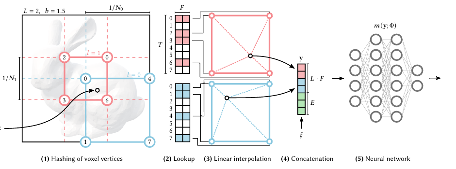
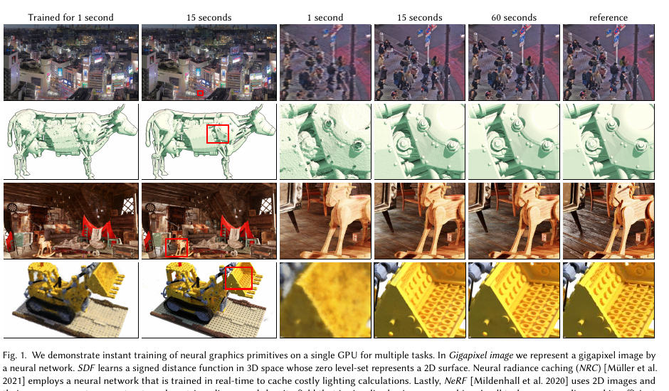

# Instant-NGP：多分辨率哈希编码驱动的即时神经图元

## 结论先行

- **一句话定位**：Instant-NGP 不改 NeRF 的体渲染框架，而是把「输入编码」从 NeRF 的固定傅里叶位置编码换成 **多分辨率哈希表 + 可训练特征向量**，再用**全融合 CUDA 内核**把整条链路塞进 GPU。结果是把逐场景 NeRF 训练从数小时压缩到 **5～15 秒达到可比质量、约 1～5 分钟达到最优**，是 NeRF 加速方向的分水岭工作。（证据：论文 Table 2）
- **核心机制是「哈希碰撞交给梯度和 MLP 去消解」**（证据+推断）：细分辨率层用空间哈希函数把体素顶点映射到固定大小 $T$ 的特征数组，**不做显式碰撞处理**。作者的赌注是——真正重要的表面是稀疏的，梯度优化会自动让重要样本主导被碰撞的哈希槽，后接的小 MLP 负责最终消歧。这一「不处理碰撞」的设计正是它比八叉树/稀疏体素等结构简单、且天然适配 GPU 并行的原因。
- **任务无关，一套编码打四类应用**（证据，Fig 1）：同一套哈希编码与超参，只调哈希表大小 $T$ ，就同时用于 NeRF（新视角合成）、SDF（符号距离场）、Gigapixel（十亿像素图像拟合）、NRC（神经辐射缓存）。说明它是一个通用的「坐标→特征」输入编码，而非 NeRF 专用 trick。
- **量化领先明确**（证据，Table 2）：NeRF-Synthetic 8 场景，Instant-NGP 训练 **15 秒平均 PSNR 31.4**、**1 分钟 32.6**、**5 分钟 33.2**，与需要数小时的 mip-NeRF（33.1）、NSVF（31.7）、原始 NeRF（31.0）持平或更优；作者把哈希编码相对同实现的频率编码归因为 **20～60× 的加速**。渲染可在 1920×1080 达数十毫秒级。
- **复现友好但有商用红线**（证据）：官方 CUDA 实现（含 tiny-cuda-nn）完整开源、含训练代码与交互式 GUI，是本领域工程化最成熟的开源项目之一；但许可证是 **Nvidia Source Code License-NC（非商用）**，商用需谨慎。

## 1. 这篇论文解决什么问题？

- **问题定义**：NeRF 类「神经图元」（用坐标 MLP 表示的连续场）质量好但**训练与推理都太慢**——原始 NeRF 单场景优化需 1～2 天、渲染远达不到实时。本文要在**不牺牲质量**的前提下，把这类图元的训练/推理成本降低数个数量级。
- **输入 / 输出**：输入是低维坐标 $\mathbf{x}\in\mathbb{R}^d$ （NeRF 是 3D 位置，SDF 是 3D 点，Gigapixel 是 2D 像素坐标）；输出是该任务对应的量（NeRF 的密度+颜色、SDF 的距离、图像的 RGB）。方法本体是一个通用的「坐标→高维特征」编码 $\mathrm{enc}(\mathbf{x};\theta)$ ，接一个小 MLP。
- **目标场景**：单场景/单图元的快速拟合（仍是逐场景优化，不是前馈泛化）。
- **与现有方法差异**：此前的加速思路大多依赖**显式数据结构**——稀疏体素、八叉树（NGLOD）、树状特征网格（NSVF），这些结构需要在训练中动态更新、维护复杂，且 GPU 并行不友好。Instant-NGP 用一个**固定大小、结构极简的哈希表**替代它们，把「自适应」交给哈希 + 梯度，从而既省内存又易并行。

## 2. 方法概览

- **核心想法**：用一组从粗到细的网格（几何级数分辨率）；每层网格顶点的特征向量存在一个**固定大小的哈希表**里；查询坐标时在每层做 $d$-线性插值取特征，把 $L$ 层特征拼接成高维向量喂给小 MLP。整个编码的参数（特征向量）与 MLP 权重**一起用 SGD 训练**。
- **一句话 pipeline**：坐标 $\mathbf{x}$ →（每层）算所在体素顶点整数坐标 → 哈希索引查特征 → $d$-线性插值 → 拼接 $L$ 层特征（+ 辅助输入如视角方向）→ 小 MLP → 任务输出 → 损失反传到 MLP 权重**和**哈希表特征。

### 2.1 架构解析

- **整体结构（模块分解，对应图中 5 步）**：
  1. **(1) 顶点哈希**：对输入坐标 $\mathbf{x}$ ，在 $L$ 个分辨率层各自找到它所在的体素，对该体素 $2^d$ 个整数顶点做哈希，得到各顶点在哈希表中的索引。
  2. **(2) 查表**：用索引从每层的哈希表 $\theta\_l$ 取出对应的 $F$ 维特征向量。
  3. **(3) 线性插值**：按 $\mathbf{x}$ 在体素内的相对位置，对该层顶点特征做 $d$-线性插值，得到该层的插值特征。**插值使编码对 $\mathbf{x}$ 连续可微**，梯度才能传到特征表。
  4. **(4) 拼接**：把 $L$ 层的插值特征 + 辅助输入 $\xi$ （如编码后的视角方向）拼接成 $y\in\mathbb{R}^{LF+E}$ 。
  5. **(5) 小 MLP**：把 $y$ 送入全连接网络 $m(y;\Phi)$ 输出结果。
- **各模块数据流与并行性**：整条链路（哈希 → 查表 → 插值 → 拼接 → MLP）被实现成**全融合的 CUDA 内核**，减少访存和带宽浪费；因每个坐标独立、每层独立，天然适配 GPU 大规模并行。这是「工程」侧贡献，和「编码」侧贡献共同带来加速。
- **关键设计选择及理由**：
  - **粗层 1:1、细层哈希**：当某层网格顶点数 $(N\_l+1)^d \le T$ 时，映射是一一对应（无碰撞）；只有细层顶点数超过 $T$ 时才启用哈希（有碰撞）。这样粗结构精确、细结构用哈希近似，兼顾质量与内存上限。
  - **不做碰撞处理**：省去探测/链表等机制，换来结构极简和并行友好；碰撞的负面影响靠梯度优化 + MLP 消解。
  - **拼接而非求和**： $L$ 层特征拼接（而非像 NGLOD 那样求和）保留了各分辨率的独立信息，让 MLP 能自己决定如何组合。

### 2.2 核心原理

- **为什么 work：把「表达能力」从 MLP 权重转移到可训练特征表**。NeRF 靠一个较大的 MLP + 固定傅里叶编码来记住整个场景的高频细节，MLP 前向次数多、拟合高频慢。Instant-NGP 把细节直接存进哈希表的特征向量里（局部、可查表），MLP 只需很小（因而每次前向极快），高频细节由「查表 + 插值」承担。查表是 $O(1)$、访存友好，这是速度提升的根本来源。
- **关键机制 1：多分辨率带来自适应细节层级**。 $L$ 层从粗（ $N\_\min=16$ ）到细（ $N\_\max$ 匹配训练数据最细结构）几何级数排布，粗层给全局平滑结构、细层补高频，等价于一个可学习的多尺度特征金字塔。
- **关键机制 2：哈希碰撞的「自动重要性加权」**。多个空间点可能落到同一哈希槽（碰撞）。作者论证：真正含表面的点稀疏，其梯度幅度大，会在共享槽的优化中占主导；空区域点梯度小，被自然忽略。于是**不需要显式的空间自适应结构**，哈希表就近似实现了「把容量分配给重要区域」。
- **与前作的本质区别**：相较 NeRF 的固定频率编码（表达力全压在 MLP 上、无可训练编码参数），Instant-NGP 引入**大量可训练编码参数** $\theta$ ；相较 NSVF/NGLOD 的显式稀疏结构（需动态维护、并行差），它用**固定大小哈希表 + 无碰撞处理**换取极简与高吞吐。

### 2.3 关键公式解析

**公式 (1)：多分辨率层的分辨率（几何级数）**

$$N_l := \big\lfloor N_{\min}\cdot b^{\,l} \big\rfloor,\qquad b := \exp\!\Big(\tfrac{\ln N_{\max}-\ln N_{\min}}{L-1}\Big)$$

- 符号： $l\in\{0,\dots,L-1\}$ 是层索引； $N\_l$ 是第 $l$ 层网格每维分辨率； $N\_\min$ / $N\_\max$ 是最粗/最细分辨率； $b$ 是相邻层的增长因子。
- 作用：把 $L$ 层分辨率在 $[N\_\min,N\_\max]$ 之间按几何级数铺开。因层数 $L$ 大， $b$ 通常很小（论文用例 $b\in[1.26,2]$ ），保证相邻分辨率平滑过渡。 $N\_\max$ 选来匹配训练数据的最细细节。

**公式 (2)：空间哈希函数**

$$h(\mathbf{x}) = \Big(\bigoplus_{i=1}^{d} x_i\,\pi_i\Big) \bmod T$$

- 符号： $\mathbf{x}=(x\_1,\dots,x\_d)$ 是**体素顶点的整数坐标**（不是原始连续坐标）； $\bigoplus$ 是逐位异或（XOR）； $\pi\_i$ 是互异的大质数（论文取 $\pi\_1:=1$ 以利缓存局部性， $\pi\_2=2\,654\,435\,761$ ， $\pi\_3=805\,459\,861$ ）； $T$ 是哈希表容量； $\bmod\,T$ 把结果落到 $[0,T)$ 的表索引。
- 作用：把 $d$ 维整数顶点映射到一维表索引。异或各维「线性同余伪随机置换」的结果，使各维对哈希值的影响去相关、分布均匀。为伪独立只需置换 $d-1$ 维，故 $\pi\_1:=1$ 保留一维不打乱以提升缓存命中。**只有当该层顶点数超过 $T$ 时才用它**，粗层是 1:1 直接索引。

**公式 (3)：编码输出（拼接）**

$$\mathrm{enc}(\mathbf{x};\theta) = \big[\,\mathrm{interp}_0,\ \mathrm{interp}_1,\ \dots,\ \mathrm{interp}_{L-1},\ \xi\,\big]\ \in\ \mathbb{R}^{LF+E}$$

- 符号： $\mathrm{interp}\_l$ 是第 $l$ 层对体素 $2^d$ 顶点特征做 $d$-线性插值（插值权重 $\mathbf{w}\_l:=\mathbf{x}\_l-\lfloor\mathbf{x}\_l\rfloor$ ）得到的 $F$ 维特征； $\xi\in\mathbb{R}^E$ 是辅助输入（如编码后的视角方向）； $\theta$ 是所有层哈希表里的可训练特征向量。
- 作用：把 $L$ 层各自的 $F$ 维插值特征与辅助输入拼成 MLP 输入。编码参数量 $\theta$ 为 $O(T)$ ，上界 $T\cdot L\cdot F$ （论文默认 $T\cdot 16\cdot 2$ ）。 $d$-线性插值保证 $\mathrm{enc}$ 对 $\mathbf{x}$ 连续可微，梯度可回传到被查中的特征向量。

> 说明：本文核心是「输入编码」，NeRF 应用侧的体渲染积分沿用原始 NeRF 公式（见 [NeRF 分析](2020-nerf.md) 的公式 (2)(3)），此处不重复。

**默认超参（Table 1）**

| 参数 | 符号 | 取值 |
|---|---|---|
| 层数 | $L$ | 16 |
| 每层最大条目数（哈希表大小） | $T$ | $2^{14}\sim 2^{24}$ |
| 每条目特征维度 | $F$ | 2 |
| 最粗分辨率 | $N\_\min$ | 16 |
| 最细分辨率 | $N\_\max$ | $512\sim 524288$ |

### 2.4 训练与推理细节

- **训练目标 / 损失**：与任务对应——NeRF 与 Gigapixel 用 $L\_2$ 损失，SDF 用相应距离监督。梯度同时反传到 MLP 权重 $\Phi$ 与哈希表特征 $\theta$ （经 MLP → 拼接 → 插值 → 查表逐级回传，累积到被查的特征向量）。
- **训练规模与超参要点**：默认 $F=2, L=16$ ；为控制参数量SDF/NeRF 取 $F\cdot T\cdot L = 2^{24}$ ，Gigapixel 取 $2^{28}$ 。NeRF 与 Gigapixel 训练 **31 000 步**结束，SDF **11 000 步**。半精度存储（每条目 2 字节）。全部实验在单张 **RTX 3090** 上完成。
- **推理流程**：NeRF 侧仍是沿光线采样点 → 每点做哈希编码 → 小 MLP 出密度/颜色 → 体渲染合成；配合占用网格（occupancy grid）跳过空区加速。得益于小 MLP + 查表 + 全融合 CUDA 内核，可在 1920×1080 达数十毫秒级渲染。仍是**逐场景优化、无跨场景泛化**。

## 3. 关键贡献

1. 提出**多分辨率哈希编码**：用固定大小哈希表存可训练特征向量、不做显式碰撞处理、靠梯度+MLP 消歧，作为一种通用「坐标→特征」输入编码替代固定位置编码与显式稀疏结构。
2. 给出一套**任务无关**的实现：同一编码与超参适配 NeRF、SDF、Gigapixel、NRC 四类神经图元，只需调哈希表大小 $T$ 权衡质量/性能/内存。
3. **全融合 CUDA 内核**的系统实现（含 tiny-cuda-nn），把训练从数小时降到数秒、渲染到数十毫秒，并开源含交互式 GUI 的完整代码。

## 4. 实验与证据

| 维度 | 内容 |
|---|---|
| 数据集 | NeRF-Synthetic（Blender 8 场景）、Tokyo 十亿像素图、多个 3D mesh（SDF）、NRC 场景 |
| Baseline | NeRF、mip-NeRF、NSVF（NeRF 侧，均需数小时）；NGLOD、频率编码（SDF 侧）；同实现的频率编码版（消融隔离哈希贡献） |
| 指标 | PSNR↑（NeRF/Gigapixel）、IoU↑（SDF）、训练时间↓、FPS↑ |
| 主要结果（Table 2, NeRF-Synthetic 平均 PSNR） | Ours-Hash：1s=21.20 / 5s=29.26 / 15s=31.41 / 1min=32.64 / 5min=33.18；mip-NeRF（数小时）=33.09、NSVF=31.74、NeRF=31.01 |
| Gigapixel（Tokyo） | 相近参数量下 2.5 分钟即达对手 36.9 小时的 PSNR，4 分钟峰值 41.9 dB |
| SDF | IoU 与 NGLOD 相当，且可在场景任意处求值（NGLOD 仅在贴合八叉树胞元内）；但有轻微表面粗糙（哈希碰撞所致） |
| 消融 | 用同实现的频率编码替换哈希编码：频率版训 5 分钟才接近 NeRF 质量，而哈希版 5～15 秒即超过它 → 20～60× 加速归因于编码本身 |
| 失败案例 | SDF 表面出现随机分布的碰撞导致的微结构/粗糙；直接预测颜色的图元对哈希微结构更敏感 |

### 4.1 效果与性能解析

- **主要结果解读（为什么强）**：核心证据是 Table 2 的时间-质量曲线。Instant-NGP 训练 **15 秒**的平均 PSNR（31.4）就已追平原始 NeRF 训练**数小时**的水平（31.0），1～5 分钟即达到/超过 mip-NeRF（33.1）。强的根源是「表达力转移」：细节存进可查表的特征表、MLP 缩小到前向极快，再叠加全融合 CUDA 内核的高吞吐。
- **加速的来源被干净地拆分**：作者特意做了「同实现 + 频率编码」的对照版，隔离出「优化实现」与「哈希编码」各自的贡献——频率版训 5 分钟才接近 NeRF，哈希版 5～15 秒就超过它，故 **20～60× 的额外加速可明确归因于哈希编码**，而非仅仅是 CUDA 工程。这一对照是本文最有说服力的证据设计。
- **性能与效率**：单张 RTX 3090；半精度、每条目 2 字节； $F=2$ 是甜点（ $F=1$ 因半精度原子累加对标量低效而更慢）。NeRF/Gigapixel 仅 31k 步收敛，SDF 11k 步。哈希表大小 $T$ 是质量-内存-速度的主旋钮： $T$ 越大质量越高但更慢更占内存。
- **消融揭示的关键因素**：拼接优于求和；哈希函数选择影响查表的一致性与均匀性； $F=2$ 是并行效率与质量的平衡点。这些消融支撑了「为什么是这套默认超参」。
- **可比性**：NeRF 侧基线数值取自各自原论文（数小时训练），Instant-NGP 在相同 8 场景、相同 PSNR 指标下按训练时长分档汇报，协议基本一致；「数小时 vs 秒级」的时间轴对比直观且诚实（明确标注对手训练时长）。

## 5. 局限与风险

- **论文承认**：SDF 上因哈希碰撞出现随机分布的表面微结构/粗糙；直接预测颜色的图元对这种微结构更敏感；哈希碰撞无显式处理，质量依赖梯度优化能否自动消解。
- **推断风险**：仍是**逐场景优化、无前馈泛化**（这点与 NeRF 一致，不是前馈重建）； $N\_\max$、 $T$ 需按数据最细结构与显存调，调参不当会掉质量或爆显存；对相机位姿仍敏感（NeRF 应用侧依赖已知位姿）。
- **工程落地风险**：强依赖定制 CUDA/tiny-cuda-nn 与较新 NVIDIA GPU，非 CUDA 平台迁移成本高；全融合内核对硬件（缓存/半精度原子）有假设。
- **许可证 / 数据风险**：官方仓库为 **Nvidia Source Code License-NC（非商用）**，商用产品不可直接使用官方实现（需自研或走其他授权路径）；这是与 MIT 许可的 NeRF 的重要差异。

## 方法谱系

- 基于（不取代）：[NeRF](2020-nerf.md)——Instant-NGP 沿用其体渲染框架，仅替换输入编码并做系统级加速。
- 思想来源：空间哈希（Teschner et al. 2003，最初用于碰撞检测）、稀疏体素/八叉树特征（NSVF、NGLOD）——本文用固定哈希表简化之。
- 被后续影响：作为 NeRF 加速与实时神经渲染的关键节点，与显式高斯路线的 [3D Gaussian Splatting](2023-3dgs.md) 并列为「快」的两条代表性技术路径。

## 6. 与相似方法对比

> 横向对比见：[场景表示范式对比](../../comparisons/3d-reconstruction/scene-representation-paradigms.md)（经典几何 / 神经渲染 / 显式高斯三范式）、[3D 重建发展全景](../../comparisons/3d-reconstruction/development-survey.md)。

| Method | 相同点 | 不同点 | 何时选它 |
|---|---|---|---|
| [NeRF](2020-nerf.md) | 同为坐标 MLP + 体渲染、逐场景优化 | NeRF 用固定傅里叶编码 + 大 MLP，训练数小时；Instant-NGP 用可训练哈希编码 + 小 MLP + CUDA，训练数秒 | 追教学基线/MIT 商用许可选 NeRF；要快选 Instant-NGP |
| NSVF / NGLOD（显式稀疏结构） | 同样想加速、加自适应细节 | 它们用需动态维护、并行不友好的稀疏体素/八叉树；Instant-NGP 用固定哈希表、无碰撞处理、GPU 友好 | 需要精确空间结构/可编辑体素时 |
| [3D Gaussian Splatting](2023-3dgs.md) | 同为「快」的实时神经渲染路线 | 3DGS 用显式高斯点 + 光栅化，编辑与实时渲染更直接；Instant-NGP 仍是隐式场 + 光线步进 | 要实时渲染/显式可编辑选 3DGS |

## 7. 复现判断

- **Git 地址**：https://github.com/NVlabs/instant-ngp （官方 CUDA 实现，含 tiny-cuda-nn 子框架）。
- **是否开源**：是，但许可证为 **Nvidia Source Code License-NC（非商用）**。
- **是否开源训练**：是——仓库提供完整训练/优化代码、交互式 GUI 及 Python 绑定，可跑 NeRF/SDF/Gigapixel/NRC。
- **代码可用性**：高，工程成熟、文档齐全、社区活跃；但对 CUDA 工具链与 NVIDIA GPU 有强依赖。
- **权重可用性**：逐场景优化，无「通用预训练权重」概念；仓库提供示例场景配置而非发布权重。
- **数据可获得性**：NeRF-Synthetic（Blender）为公开标准数据；示例场景随仓库/文档提供获取方式。
- **预计环境成本**：低到中——单张较新 NVIDIA GPU（如 RTX 30 系）即可，单场景秒级到分钟级训练；主要成本是搭好 CUDA / tiny-cuda-nn 编译环境。
- **最小复现路径**：装 CUDA 工具链 → 编译 instant-ngp（含 tiny-cuda-nn）→ 用自带 GUI 载入 NeRF-Synthetic（如 Lego）→ 观察数秒内收敛。
- **是否值得复现**：值得——是理解「可训练输入编码 + GPU 融合内核」如何数量级加速神经图元的最佳工程范本；但若目标是商用，注意 NC 许可限制。

## 8. 后续动作

- [ ] 更新 `indices/papers.md`
- [ ] 更新 `indices/directions.md`（3d-reconstruction / novel-view-synthesis）
- [ ] 更新 landmark 索引（landmarks / timeline，标 ★）
- [ ] 在 `comparisons/3d-reconstruction/scene-representation-paradigms.md` 中补充 Instant-NGP 作为 NeRF 加速代表
