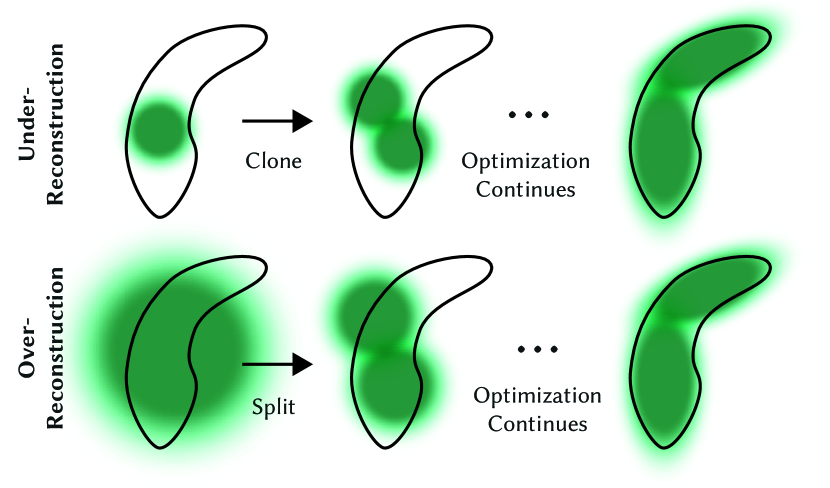
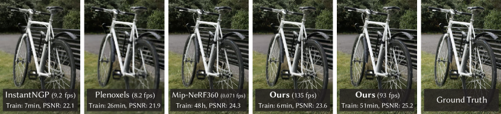

# 3D 高斯泼溅：面向实时辐射场渲染

## 结论先行
- 3DGS 用**显式的各向异性 3D 高斯集合**替代 NeRF 的隐式 MLP，把辐射场从「查询式神经网络」变成「可微分点云基元」，从而在保持接近 SOTA 质量的同时实现真正的实时渲染（论文摘要目标 1080p、>=30 FPS；实测在 Mip-NeRF360 上 134 FPS、其他数据集可达约 200 FPS）。这是当前 3D 重建 / 新视角合成事实上的主流场景表示。
- 它与 NeRF 是**并列的两条技术路线**（隐式体渲染 vs 显式泼溅光栅化），不是继承关系。3DGS 的核心突破在渲染效率与训练速度，而非表达能力上的降维打击。
- 三个工程支柱缺一不可：(1) 从 SfM 稀疏点初始化的各向异性高斯；(2) 交替优化 + 自适应密度控制（克隆/分裂/剪枝）；(3) 可微分的 tile-based 可见性感知光栅化器。第三点是能跑实时、且能把梯度稠密回传给「所有覆盖该像素的高斯」的关键。
- **训练代码、评估代码、预训练权重、COLMAP 数据全部开源**，复现门槛低；但 license 为非商业研究许可，**商业落地有明确许可证风险**。
- 输入依赖 COLMAP 相机位姿与稀疏点云——3DGS 本身不做位姿估计，属于「重建管线的渲染/表示末端」，上游仍需 SfM（如 COLMAP）或 feed-forward 位姿方法。

## 1. 这篇论文解决什么问题？
- **问题定义**：从一组带标定相机位姿的多视角照片中，学习一个可任意视角渲染的场景表示（novel-view synthesis），并要求**训练快、渲染实时、质量高**三者兼得。此前没有方法能同时拿到这三点：NeRF 系质量高但离线；Instant-NGP/Plenoxels 快但在无界场景质量有取舍。
- **输入 / 输出**：输入是多视角图像 + COLMAP 给出的相机内外参和稀疏点云；输出是一组 3D 高斯（位置、协方差=缩放+旋转、不透明度 α、球谐系数颜色），可实时光栅化为任意视角图像。
- **目标场景**：无界、完整的真实场景（unbounded scenes），而非孤立物体；同时在合成 Blender 数据集上验证。
- **与现有方法差异**：NeRF 及其变体质量高但渲染慢（体积采样 + MLP 查询）；Instant-NGP / Plenoxels 用哈希网格 / 体素加速但在无界场景质量或速度上仍有取舍。3DGS 用显式基元 + 光栅化绕开逐射线密集采样，兼顾质量与速度。

## 2. 方法概览
- **核心想法**：场景 = N 个各向异性 3D 高斯。每个高斯是空间中一个「带朝向的椭球雾团」，有 3D 中心、协方差矩阵（缩放向量 + 四元数旋转构成）、不透明度 α 和球谐（SH）视角相关颜色。渲染时把高斯投影（splat）到图像平面，按深度排序后做 alpha 合成。整个表示可微，梯度可直接回传到每个高斯的所有属性。
- **一句话 pipeline**：SfM 稀疏点 → 初始化各向异性高斯 → 对某视角投影 + tile 光栅化出图 → 与真值算 L1+D-SSIM 损失 → 梯度反传更新高斯参数 & 自适应密度控制（克隆/分裂/剪枝）→ 循环至 30K 迭代。

### 2.1 架构解析

- **整体结构（无神经网络）**：这是本方法与 NeRF 系最大的结构差异——没有 MLP 主干，「模型」就是高斯集合本身，每个高斯的属性即可训练参数。图中的循环是训练回路，不是网络前向层。
- **模块分解与数据流**（对照上图，黑箭头=前向，蓝箭头=梯度）：
  1. **Initialization**：用 SfM 稀疏点云的 3D 位置初始化高斯中心，颜色初始化为 SH 零阶，协方差初始化为「到最近邻点平均距离」的各向同性球，不透明度设一个小值。用真实几何点做种子，避免在空气里浪费高斯。
  2. **3D Gaussians**：当前的高斯集合（本回路要优化的对象）。
  3. **Projection**：给定 Camera 位姿，把 3D 高斯的均值和协方差投影到屏幕空间（EWA splatting 的仿射近似），得到 2D 高斯（footprint）。
  4. **Differentiable Tile Rasterizer**：把屏幕分成 16×16 的 tile，对每个 tile 内的高斯按深度排序后做前向 alpha 合成生成图像；反向时沿同一排序列表回传梯度。
  5. **Adaptive Density Control**：周期性地根据「位置梯度」增删高斯（克隆/分裂/剪枝），把高斯数量与分布调到既覆盖几何又紧凑。
- **关键设计选择及理由**：
  - **用缩放+旋转参数化协方差**（而非直接优化 3×3 矩阵）——保证协方差始终半正定、物理有效（见 2.3 公式 2）。这是能稳定优化各向异性高斯的前提。
  - **tile-based 而非逐像素/逐射线**——把排序开销摊到 tile 级，配合 GPU radix sort 一次排序全图可见高斯，是达成实时的工程核心。
  - **可见性感知的正确排序**——不做近似可见性剔除，保证 alpha 合成顺序正确，避免爆裂伪影。

### 2.2 核心原理
- **为什么这样设计 work**：
  - **显式基元 + 光栅化 = 绕过密集采样**。NeRF 每条射线要在 MLP 上采样几十上百个点做数值积分，是渲染慢的根源。3DGS 把「体密度场」换成有限个有解析投影的高斯，渲染退化为「投影 + 排序 + alpha 混合」这套光栅化流水线，天然对 GPU 友好。
  - **各向异性是紧凑性的来源**。一个能拉长、压扁、任意朝向的椭球，可以用一个基元贴合一段墙面、一根树枝（见 Figure 3 可视化），而各向同性球需要很多个才能拼出同样几何。各向异性让「用较少高斯表达复杂几何」成为可能。
  - **稠密梯度回流**。因为光栅化器把「一个像素由哪些高斯以什么权重合成」完整记录，梯度可以同时流向所有贡献高斯，而不是像点云 splatting 常见的稀疏/近似梯度——这让连续优化真正收敛到高质量。
- **关键机制/归纳偏置**：
  - **从 SfM 几何初始化**是强先验：高斯从真实结构点长出来，密度控制再补空洞，比随机初始化质量显著更好（Figure 7 消融证实）。
  - **自适应密度控制**用「位置梯度大」作为「这里几何没表达好」的信号：欠重建区域克隆高斯、过重建区域分裂高斯（见 2.4）。
- **与前作在原理上的本质区别**：NeRF 是「连续隐式场 + 学习到的体渲染」，一切信息压在网络权重里，查询才知道；3DGS 是「离散显式基元 + 解析泼溅」，几何和外观直接以可读参数摆在空间里，可编辑、可裁剪、可实时。二者共享「可微渲染 + 多视角监督」的训练范式，但表示与渲染管线完全不同。

### 2.3 关键公式解析

**公式 (1)：3D 高斯基元**
$$ G(x) = \exp\left(-\tfrac{1}{2}\, x^\top \Sigma^{-1} x\right) $$
- 符号： $x$ 是相对高斯中心 $\mu$ 的偏移向量（世界坐标）， $\Sigma$ 是 3×3 协方差矩阵，决定椭球的大小、拉伸方向与朝向。
- 作用：这是场景的「原子」。整场景就是把大量这样的 $G(x)$ 摆在空间不同 $\mu$ 上、各带不透明度和颜色。它有解析形式，投影后仍是高斯，这正是能高效光栅化的数学基础。

**公式 (2)：协方差的可优化参数化**
$$ \Sigma = R\,S\,S^\top R^\top $$
- 符号： $S=\mathrm{diag}(s_x,s_y,s_z)$ 是由缩放向量构成的对角矩阵； $R$ 是由四元数 $q$ 转成的旋转矩阵。
- 作用：直接优化 $\Sigma$ 的 6 个自由度会跑出「非半正定」的非法矩阵。改为优化 $(s, q)$ 后， $SS^\top$ 天然半正定， $R$ 只旋转不改正定性，于是任意梯度步都得到物理合法的椭球。这是各向异性高斯能被梯度下降稳定训练的关键技巧。

**公式 (3)：投影到屏幕空间的 2D 协方差**
$$ \Sigma' = J\,W\,\Sigma\,W^\top J^\top $$
- 符号： $W$ 是世界到相机的视图变换（旋转平移）， $J$ 是投影变换的仿射近似的雅可比矩阵（EWA splatting 的核心近似）， $\Sigma'$ 取其左上 2×2 块即得图像平面上的 2D 高斯 footprint。
- 作用：把 3D 椭球「压」成屏幕上的 2D 椭圆斑点，供光栅化器按 footprint 累加。用雅可比做仿射近似让投影可闭式、可微，避免逐点重投影。

**公式 (4)：可见性感知的 alpha 合成（point-based α-blending）**
$$ C = \sum_{i \in \mathcal{N}} c_i\, \alpha_i \prod_{j=1}^{i-1}(1-\alpha_j) $$
- 符号： $\mathcal N$ 是该像素上按深度从前到后排序的高斯， $c_i$ 是第 $i$ 个高斯的（SH 解出的）颜色， $\alpha_i$ 是它在该像素的有效不透明度（= 学习的不透明度 × 2D 高斯在该像素处的核值）， $\prod(1-\alpha_j)$ 是被前面高斯遮挡后的透射率。
- 作用：这是渲染方程，形式上与 NeRF 的离散体渲染求和**同构**——差别是 NeRF 沿射线采样连续场，3DGS 直接对有限个已排序高斯求和。它可微，梯度沿此式回传到 $c_i,\alpha_i$ 及几何参数。

**公式 (5)：训练损失**
$$ \mathcal{L} = (1-\lambda)\,\mathcal{L}_1 + \lambda\,\mathcal{L}_{\text{D-SSIM}},\qquad \lambda = 0.2 $$
- 符号： $\mathcal L_1$ 是渲染图与真值的逐像素 L1 误差； $\mathcal L_{\text{D-SSIM}}$ 是 (1−SSIM) 结构相似度损失； $\lambda=0.2$ 全实验固定。
- 作用：L1 保像素级色彩保真，D-SSIM 保结构/纹理观感。二者组合是 3DGS 唯一的监督信号——没有任何几何/深度正则，几何完全由「多视角光度一致性 + 密度控制」自发涌现。

> 公式 (1)–(5) 与训练损失 λ=0.2 已逐条核对 arXiv 2308.04079 原文（ar5iv 版），符号与形式一致。

### 2.4 训练与推理细节
- **损失函数**：仅上面的 L1 + D-SSIM（λ=0.2），无深度/法线/几何正则。
- **优化器与调度**：Adam；各属性独立学习率，位置学习率随迭代**指数衰减**（先大后小，早期允许高斯大幅迁移，后期精修）。**SH 渐进引入**：先只优化零阶（漫反射色），此后每 1000 次迭代加一个 SH band，直到 4 阶全开——避免早期高频颜色过拟合。（推断：各属性具体学习率数值属实现细节，见存疑点。）
- **自适应密度控制**（每 100 次迭代、warm-up 后执行）：
  - 触发信号：视图空间**位置梯度均值** $\nabla_p \mathcal L > \tau_{pos}=0.0002$，表示该区域几何没表达好。（原文核实：τ_pos=0.0002。）
  - **克隆（clone）**：欠重建（高斯偏小 $\lVert S\rVert \le \tau_S$ ）时复制一个同样的高斯并沿位置梯度方向挪动 → 增加覆盖。
  - **分裂（split）**：过重建（高斯偏大 $\lVert S\rVert > \tau_S$ ）时把一个高斯分成两个、尺度除以 $\phi=1.6$，并用原高斯做 PDF 采样新位置 → 增加分辨率。（ $\tau_S$ 在官方实现里 = percent_dense × 场景尺度，默认 0.01；论文正文只给定性判据，见存疑点。）
  - **剪枝（prune）**：不透明度 $\alpha < \epsilon_\alpha = 1/255$ 的高斯删除；同时定期删除屏幕空间过大的高斯。
  - **不透明度重置**：每 N=3000 次迭代把所有 α 拉回接近 0，强制优化重新「争取」不透明度，抑制近相机处的漂浮物累积。（原文核实：N=3000。）
- **分辨率 warm-up**：从 1/4 分辨率起训，在第 250、500 次迭代上采样，稳定早期优化。
- **迭代数**：7K（约 5–10 分钟，质量已不错）；30K（约 35–45 分钟，SOTA 质量）。Blender 合成集从 10 万随机点初始化（无 SfM）。
- **推理流程**：给定新视角 → 投影全部高斯得 2D footprint 与深度 → GPU radix sort 按 (tile ID, 深度) 排序 → 每个 16×16 tile 内前向 alpha 合成 → 1080p 实时出图（实测 130–200 FPS）。推理即纯光栅化，无优化循环。

## 3. 关键贡献
1. 提出用**各向异性 3D 高斯**作为显式、可微、非结构化的辐射场基元，从 SfM 稀疏点初始化，避免在空白空间浪费计算；用缩放+旋转参数化协方差保证优化合法性。
2. **交替优化 + 自适应密度控制**：以位置梯度为信号做克隆/分裂/剪枝 + 周期性不透明度重置，让高斯数量与分布在训练中自适应稠密化/稀疏化，兼顾几何覆盖与紧凑性。
3. **快速、可微、可见性感知的 tile-based 光栅化器**：支持各向异性泼溅、正确深度排序与稠密梯度回传，是达成实时渲染与快速训练的工程核心。

## 4. 实验与证据
| 维度 | 内容 |
|---|---|
| 数据集 | Mip-NeRF360 全部场景、Tanks&Temples（2 场景）、Deep Blending（2 场景），共 13 个真实场景 + 合成 Blender（NeRF-Synthetic）数据集（arXiv/项目页核实） |
| Baseline | Mip-NeRF360、Instant-NGP、Plenoxels（arXiv/项目页核实） |
| 指标 | PSNR / SSIM / LPIPS（质量）、FPS（渲染）、训练时长、模型大小 |
| 主要结果（Table 1 核实，30K 迭代，A6000） | Mip-NeRF360：PSNR **27.21**、SSIM 0.815、LPIPS 0.214、训练 **41m33s**、**134 FPS**、734MB；Tanks&Temples：PSNR 23.14、SSIM 0.841、LPIPS 0.183、训练 26m54s、154 FPS、411MB；Deep Blending：PSNR 29.41、SSIM 0.903、LPIPS 0.243、训练 36m02s、137 FPS、676MB。7K 快速版质量略低、训练 4-7 分钟、160-197 FPS。摘要声称质量与 Mip-NeRF360 SOTA「持平甚至略优」，而后者训练约 48 小时 vs 本文约 35-45 分钟 |
| 消融（Table 3/Fig.7-9） | SfM vs 随机初始化（Fig.7，SfM 明显更好）、克隆 vs 分裂密度策略（Fig.8）、限制接收梯度的高斯数（Fig.9，限 10 个时质量骤降）、各向异性 vs 各向同性协方差、SH 阶数——逐项验证各组件贡献（推断：Table 3 具体 PSNR 未逐行抄录） |
| 失败案例 | 观测视角稀疏 / 训练视角未覆盖区域出现漂浮物（floaters）与拉伸伪影；细长/半透明结构、强反射与视角外插仍困难 |

### 4.1 效果与性能解析

- **主要结果解读（不只搬数字）**：3DGS 的贡献不是「刷高 PSNR」，而是**把 Mip-NeRF360 级别的质量从 48 小时训练/离线渲染，压到约 40 分钟训练 + 实时渲染**——这是数量级的效率跃迁，同时质量还持平甚至略优。相对 Instant-NGP/Plenoxels 这类同样快的方法，3DGS 在无界真实场景上质量明显更高（Fig.5 对比中细节、远景更干净）。它的强在「质量×速度×训练时间」三维同时占优，而不是任一单点极值。
- **性能与效率**：1080p 下 Mip-NeRF360 达 134 FPS，其他集可达 ~200 FPS，远超摘要设定的 >=30 FPS 目标（注意：论文摘要目标是 30 FPS 而非 100 FPS）。代价在**存储/显存**：30K 模型 400–750MB，源于百万量级高斯 × 每个 ~59 个 float 参数（含 48 维 SH），大场景更高。这是它相对隐式 MLP（几 MB 权重）的主要劣势，也是后续压缩工作（如 SH 量化、Scaffold-GS）的动因。
- **消融揭示的关键因素**：三大支柱都被证实必要——(1) SfM 初始化显著优于随机（Fig.7）；(2) 关闭密度控制或限制接收梯度的高斯数会大幅掉质量（Fig.9）；(3) 各向异性协方差相对各向同性带来明显增益。说明「显式基元」这一想法本身还不够，配套的初始化+密度控制+各向异性缺一不可。
- **可比性与协议一致性**：所有对比在同一批 benchmark、held-out 测试视角上评测；表中带 † 的数字直接取自原论文，其余为作者复跑，协议基本一致。FPS 在同一 A6000 上测，横向可比。

## 5. 局限与风险
- **论文明确承认**：需要良好的 SfM 初始化；高斯数量大时显存/存储占用高（30K 模型 400-750MB 量级，大场景更高）；稀疏视角下易产生伪影（floaters、拉伸）。
- **我推断的风险**：不做几何约束时高斯是「渲染导向」表示，直接抽取高质量 mesh / 表面并不天然（后续 SuGaR、2DGS 等专门解决）；对动态场景需扩展（4DGS 等）；无深度正则使几何在弱纹理/反射区可能物理不真实。
- **工程落地风险**：依赖 COLMAP 位姿，管线上游失败会直接影响质量；自定义 CUDA 光栅化器对环境（CUDA 版本、GPU 架构）较敏感，编译子模块是常见踩坑点。
- **许可证 / 数据风险**：官方仓库为 **Gaussian-Splatting License（Inria 与 MPII 持有），仅限非商业研究/评估**，商业用途须联系 Inria（stip-sophia.transfert@inria.fr）获授权——这是商业化的实质门槛（LICENSE.md 核实；注：utils/loss_utils.py 单独采用 MIT 许可）。

## 方法谱系

> 3DGS 与 NeRF 是并列的两条路线，非继承关系，故 supersedes/builds_on 留空。它开创了一整个 Gaussian-Splatting 家族。

- 并列范式：[NeRF](../3d-reconstruction/2020-nerf.md)（隐式体渲染，另一条主线）
- 衍生方向（后续，非本文）：SuGaR / 2DGS（表面抽取）、4DGS（动态）、gsplat / Scaffold-GS（工程与压缩）

## 6. 与相似方法对比

> 横向对比见：[场景表示范式对比](../../comparisons/3d-reconstruction/scene-representation-paradigms.md)（COLMAP/NeRF/3DGS 三范式）、[3D 重建发展全景](../../comparisons/3d-reconstruction/development-survey.md)。

| Method | 相同点 | 不同点 | 何时选它 |
|---|---|---|---|
| NeRF (2020) | 都做多视角新视角合成、都需已知相机位姿、都用可微渲染 + 光度监督 | NeRF 隐式 MLP + 体渲染，渲染慢训练慢、模型仅几 MB；3DGS 显式高斯 + 光栅化，实时且训练快、模型数百 MB | 需要实时渲染 / 交互 / 可编辑显式表示时选 3DGS；追求极小模型、体密度语义或研究隐式表达时看 NeRF 系 |
| Instant-NGP | 都追求加速辐射场、都能分钟级训练 | INGP 用哈希编码网格 + 小 MLP，渲染快但仍非纯显式光栅化，无界场景质量略逊；3DGS 完全显式无网络 | 需要显式可编辑基元、成熟工具链、无界场景高质量、稳定高帧率时选 3DGS |
| Mip-NeRF360 | 同为无界真实场景、同一批 benchmark | Mip-NeRF360 质量强但训练约 48 小时、渲染离线；3DGS 质量相当且训练约 40 分钟、实时渲染 | 只看离线最优质量可比 Mip-NeRF360，实际部署选 3DGS |
| Plenoxels | 都是显式表示、都想去掉/减少神经网络 | Plenoxels 用稀疏体素网格 + 球谐，各向同性、无自适应各向异性密度控制，无界场景质量弱；3DGS 各向异性 + 密度控制 | 追求无界真实场景高质量与紧凑各向异性表达时选 3DGS |

## 7. 复现判断
- **Git 地址**：https://github.com/graphdeco-inria/gaussian-splatting （核实）
- **是否开源**：是，代码 + 权重 + 数据齐全（核实）。
- **是否开源训练**：是，含 train.py 完整 PyTorch 优化器与 render.py / metrics.py / full_eval.py（核实）。
- **代码 / 权重 / 数据可用性**：预训练模型 14GB、T&T+DB COLMAP 650MB、评估图像 7GB、Windows 查看器 60MB 均可下载；两个 Mip-NeRF360 场景（flowers、treehill）需向作者索取（README 核实）。
- **预计成本**：论文在单张 A6000（48GB）上完成全部实验；消费级 24GB 显存 GPU（如 RTX 3090）通常也可跑常规场景。单场景 30K 训练约 27-42 分钟（Table 1 核实）；full_eval 全流程官方参考机约 7 小时；环境需匹配 CUDA 与自定义光栅化子模块编译。
- **最小复现路径**：装好 CUDA + 子模块 → 下载一个 Mip-NeRF360 场景的 COLMAP 数据 → `python train.py -s <scene>` → `render.py` + `metrics.py` 出图与指标。
- **是否值得复现**：值得。它是当前 3D 重建/渲染的基础表示，复现门槛低、生态成熟（后续 SuGaR、2DGS、4DGS、gsplat 等均以此为基座）。商业用途须留意许可证。

## 8. 后续动作
- [ ] 更新索引
- [x] 已核实 Mip-NeRF360/T&T/DB 的精确 PSNR/SSIM/LPIPS、训练时长与逐场景 FPS（Table 1，30K/7K 两档）
- [x] 已补全核心公式（高斯/协方差参数化/投影/α合成/损失）、pipeline 架构图、密度控制超参与消融
- [x] 本轮重新核对：公式 (1)–(5)、密度控制阈值 τ_pos=0.0002、不透明度重置 N=3000、A6000、许可证与联系邮箱、arXiv 号——均与原文一致
