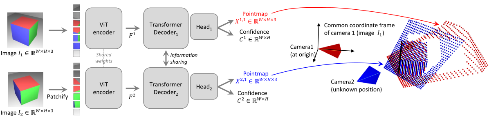
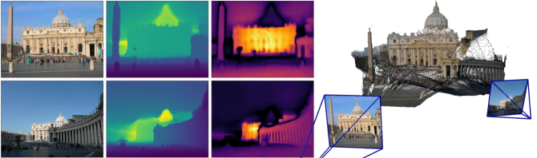

# DUSt3R：让几何三维视觉变简单

## 结论先行
- **范式起点结论**：DUSt3R 把「无位姿、无标定的两视图三维重建」重铸为一个回归任务——直接预测两张图各自像素在**同一坐标系**下的三维点（pointmap）。这一步绕开了传统 SfM/MVS 里「先估相机、再三角化」的级联，是 MASt3R / VGGT / Pi3 等一整条前馈重建谱系的共同源头。（证据：论文摘要与方法节，已核验）
- **一个网络吃下多任务**：从 pointmap 可后处理出单目/多视深度、稠密匹配、相对与绝对相机参数，无需任务专用头。这是它「made easy」的核心卖点。（证据：摘要，已核验）
- **零样本即达 SoTA**：在未用目标域 GT 相机的前提下，CO3Dv2 相对位姿 mAA(30)=76.7（全局对齐）、RealEstate10K mAA(30)=67.7，均超过当时 SoTA PoseDiffusion（对应 66.5 / 48.0）；多视深度在 ETH3D 等基准零样本领先。（证据：Tab.2–4，已逐项核验）
- **精度不是全场最强，但泛化性极强**：DTU 上 overall 1.74mm，仍逊于域内训练的专用 MVS——它换来的是「拿两张任意图就能重建」的通用性。（证据 + 推断：这是 pointmap 范式的固有取舍）
- **落地要注意 License**：代码与权重为 CC BY-NC-SA 4.0，**非商用**；权重还叠加训练数据集与 CroCo v2 基座的许可约束。商用需另寻授权或自训。（证据：README，已核验）

## 1. 这篇论文解决什么问题？
- **问题定义**：给定**若干张无标定、无位姿**的图像（最少两张），直接输出稠密三维几何。传统流程需要 SfM 估相机 + MVS 稠密化，环节多、对纹理/基线敏感、失败会级联。
- **输入 / 输出**：输入 RGB 图像对（或多图）；输出每张图每个像素在**参考图坐标系**下的三维点坐标（pointmap）+ 置信度图。对多于两图，用全局对齐把两两 pointmap 拼进统一坐标系。
- **目标场景**：任意野外图像、稀疏视图、甚至无重叠先验的情形下的深度、位姿、点云恢复。
- **与现有方法差异**：不显式建投影相机模型、不要求已知/共享内参，把几何约束「软化」进网络回归里；单目与双目被统一处理（单目视作两张相同图）。

## 2. 方法概览

- **核心想法**：pointmap 回归。定义 pointmap $X \in \mathbb{R}^{W\times H\times 3}$ 为图像每个像素到三维点的稠密映射。DUSt3R 让网络对图像对 $(I^1, I^2)$ 直接回归两张 pointmap $X^{1,1}$ 与 $X^{2,1}$，**二者都表达在图 1（第一张图）的相机坐标系下**。坐标系统一是全部魔法所在——「相对位姿」不再被显式求解，而是被隐式编码进两张点图的空间对齐关系里。
- **一句话 pipeline**：两图 → 共享 ViT 编码 → 双分支交叉注意力解码 → 两张同坐标系 pointmap + 置信度 → 轻量后处理（PnP / 全局对齐）得到深度、匹配、内参、相对/绝对位姿。

### 2.1 架构解析

- **整体结构（模块分解）**：一个 Siamese（孪生）Transformer 网络 $\mathcal{F}$，三段式：
  1. **共享权重 ViT 编码器**：两张图各自 patchify 后送入**权重共享**的 ViT-Large，得到 token 表示 $F^1, F^2$。共享权重保证两视图被同一特征空间描述，是后续跨视图对齐的前提。
  2. **双分支 Transformer 解码器（信息共享）**：两条解码分支各处理一个视图，但**每个 block 内通过交叉注意力互看对方的 token**（图中 "Information sharing"）。这一步让网络在解码阶段就完成两视图的空间推理——分支 1 知道分支 2 看到了什么，才能把 $X^{2,1}$ 也摆进图 1 坐标系。
  3. **回归头**：两个独立的 Head 分别输出 pointmap $X^{1,1}, X^{2,1}\in\mathbb{R}^{W\times H\times 3}$ 与置信度 $C^1, C^2\in\mathbb{R}^{W\times H}$。头有两种实现：轻量 **linear** 头与 **DPT**（密集预测 Transformer）头，后者精度更高、开销更大。
- **数据流**：$I^1,I^2 \xrightarrow{\text{patchify}} \xrightarrow{\text{shared ViT enc}} F^1,F^2 \xrightarrow{\text{cross-attn dec}} G^1,G^2 \xrightarrow{\text{head}} (X^{1,1},C^1),(X^{2,1},C^2)$。注意两张 pointmap 的坐标系都是「图 1 相机系」，故 $X^{1,1}$ 天然是图 1 的深度/几何，$X^{2,1}$ 则同时编码了图 2 相对图 1 的位姿。
- **关键设计选择及理由**：
  - **CroCo v2 初始化**：编码器/解码器权重来自 CroCo v2（Cross-view Completion 的跨视图自监督预训练）。消融显示这是性能命门（见 4.1），因为跨视图补全任务已让网络学会「两视图间的空间对应」，正是 pointmap 回归所需的归纳偏置。
  - **回归而非分类/相机参数化**：不预测内外参、不做投影几何的可微渲染，直接回归三维坐标——把病态的几何求解转成数据驱动的稠密回归，规避低纹理、宽基线下几何法的失败模式。
  - **网络规模**：编码器 ViT-L（embed 1024, depth 24, heads 16），解码器 ViT-B（embed 768, depth 12, heads 12）。（结构参数已核验）

### 2.2 核心原理
- **为什么这样设计 work**：三维重建的本质难点是「不同视图坐标系如何统一」。传统法用相机模型显式求解，病态且级联。DUSt3R 把这个统一问题**外包给一个见过海量场景的网络**——只要训练数据覆盖足够多的相机配置与场景几何，网络就能从图像内容直接「回忆」出合理的三维摆位。pointmap 表示的高明处在于：它同时承载了**深度**（点到相机的距离）、**相机内参**（点图与像素网格的关系可反解焦距）与**相对位姿**（$X^{2,1}$ 相对图 1 系的刚体变换），一个输出统一了三类几何量。
- **关键机制/归纳偏置**：(1) **共享坐标系**——把「对齐」从后处理提前到网络输出，是范式核心；(2) **解码器交叉注意力**——两视图信息在解码阶段深度交互，而非各自独立预测再拼接；(3) **CroCo 跨视图预训练**——注入「两视图对应关系」的先验，让小规模微调即可泛化。
- **与前作在原理上的本质区别**：SfM/MVS 是「几何优先、数据其次」（先解方程，纹理特征只是观测）；DUSt3R 是「数据优先、几何其次」（网络回归三维点，几何约束只在下游后处理里软性恢复）。相比同期的相机位姿回归/扩散方法（PoseDiffusion），DUSt3R 不预测参数化位姿而预测稠密点，位姿是点图的「副产品」，因而对无重叠、宽基线更鲁棒。

### 2.3 关键公式解析

> 说明：以下四式的符号与形式均已对照 arXiv v3（ar5iv）逐项核对。

- **公式 (1)｜置信度加权回归损失的基础项（尺度归一 pointmap 回归）**：
$$\ell_{\text{regr}}(v,i) = \left\lVert \frac{1}{z}X^{v,1}_i - \frac{1}{\bar z}\bar X^{v,1}_i \right\rVert$$
  - 符号：$v\in\{1,2\}$ 指两个视图，$i$ 是有效像素索引；$X^{v,1}_i$ 是网络预测的、表达在图 1 系下的第 $v$ 视图第 $i$ 点；$\bar X^{v,1}_i$ 是对应 GT；$z,\bar z$ 分别是预测与 GT 的**尺度归一因子**。
  - 作用：单目/多视三维本质存在**全局尺度歧义**，直接回归绝对坐标会被尺度支配。除以各自尺度 $z,\bar z$ 后，损失只惩罚**尺度不变的几何形状**，让网络专注学结构而非绝对大小。

- **公式 (2)｜尺度归一因子**：
$$\text{norm}(X^1,X^2) = \frac{1}{|\mathcal{D}^1|+|\mathcal{D}^2|}\sum_{v\in\{1,2\}}\sum_{i\in\mathcal{D}^v}\lVert X^v_i\rVert$$
  - 符号：$\mathcal{D}^v$ 是视图 $v$ 的有效点集合，$|\mathcal{D}^v|$ 是其点数；$\lVert X^v_i\rVert$ 是点到原点（图 1 相机中心）的距离。
  - 作用：把 $z$（预测尺度）与 $\bar z$（GT 尺度）都定义为**所有有效点到原点的平均距离**。这样公式 (1) 的归一是数据自适应的，且预测与 GT 用同一形式，保证可比。

- **公式 (3)｜置信度感知损失（真正被优化的目标）**：
$$\mathcal{L}_{\text{conf}} = \sum_{v\in\{1,2\}}\sum_{i\in\mathcal{D}^v}\Big[C^{v,1}_i\,\ell_{\text{regr}}(v,i) - \alpha\log C^{v,1}_i\Big]$$
  - 符号：$C^{v,1}_i > 1$ 是像素 $i$ 的预测置信度，实现为 $C^{v,1}_i = 1+\exp(\tilde C^{v,1}_i)$ 保证恒正且下界为 1；$\alpha$ 是正则权重（原文未在本次抓取中给出具体数值，属待核验超参）。
  - 作用：这是一种**自加权**（learned aleatoric weighting）。网络对天空、反射、遮挡等本质难回归的像素给低置信度以降低其损失权重（第一项 $C\cdot\ell$ 变小），但 $-\alpha\log C$ 项惩罚「无脑降低置信度」，防止全场偷懒。结果是网络学会「哪里信得过」，置信度图也直接用于下游全局对齐的加权。

- **公式 (4)｜全局对齐目标（多视图融合）**：
$$\chi^{*} = \arg\min_{\chi,P,\sigma}\sum_{e\in\mathcal{E}}\sum_{v\in e}\sum_{i=1}^{HW} C^{v,e}_i\left\lVert \chi^{v}_i - \sigma_e P_e X^{v,e}_i\right\rVert,\quad \text{s.t. }\prod_e \sigma_e = 1$$
  - 符号：$\mathcal{E}$ 是所有图像对（边）构成的连通图；$X^{v,e}_i$ 是边 $e$ 上预测的 pointmap；$P_e\in SE(3)$ 是把该边局部坐标搬到全局系的刚体变换，$\sigma_e>0$ 是该边的尺度；$\chi^v_i$ 是待求的**全局统一点云**；$C^{v,e}_i$ 是置信度权重；约束 $\prod_e\sigma_e=1$ 防止所有尺度塌缩到 0。
  - 作用：把两两独立预测的 pointmap 通过**联合优化刚体变换 + 尺度 + 全局点**融合进单一坐标系，得到多视图一致重建。这一步不再是传统 BA（不优化重投影误差、不需相机参数），而是直接在三维点空间做加权对齐，简单且可微，通常几百步梯度下降即收敛。

### 2.4 训练与推理细节
- **训练目标 / 损失函数**：即公式 (3) 的置信度感知回归损失，在图像对上端到端训练；无相机参数监督、无重投影损失。
- **训练数据与规模**：8 个数据集混合，覆盖室内/室外、真实/合成、物体/场景。各集图像对数（已核验）：Habitat 1.0M、CO3Dv2 0.94M、ScanNet++ 0.22M、ARKitScenes 2.04M、Static Scenes 3D 0.34M、MegaDepth 1.76M、BlendedMVS 1.06M、Waymo 1.1M，**总计约 8.5M 图像对**。（来源：arXiv v3，已核验）
- **超参与训练策略**：**低分辨率先行**——先在 224×224 训练，再在最长边 512（多种长宽比，如 512×384、512×336、512×288、512×256、512×160）微调；三个发布权重为 224_linear、512_linear、512_dpt，其中 512 从 224 微调、DPT 头从 512_linear 微调。编码器 ViT-L / 解码器 ViT-B，均从 CroCo v2 初始化。
- **推理流程**：
  1. **两图前馈**得 $X^{1,1}, X^{2,1}$ 与置信度；
  2. **单/双目深度**直接读 $X^{1,1}$ 的 $z$ 分量；
  3. **内参**由 pointmap 与像素网格的关系闭式反解焦距；
  4. **相对位姿**由 $X^{1,1}\!\leftrightarrow\!X^{2,1}$ 的 Procrustes/PnP + RANSAC 求解；
  5. **稠密匹配**由两张点图的最近邻互查得到；
  6. **多图重建**：构造图像对图 $\mathcal{E}$，跑公式 (4) 全局对齐得统一点云与所有相机。

## 3. 关键贡献
1. 提出 **pointmap** 表示，将无标定两视图重建统一为一个可端到端回归的任务，摆脱投影相机模型硬约束。
2. 一个前馈网络 + 轻量后处理，**同时**产出深度、匹配、相对/绝对位姿，多任务零样本 SoTA。
3. 提出**全局对齐**策略（公式 4），把两两 pointmap 融合进单一坐标系，支持多视图重建，且不依赖传统 BA。
4. 完整开源代码（含训练）与权重，成为后续前馈重建研究的事实基座。

## 4. 实验与证据
| 维度 | 内容 |
|---|---|
| 数据集 | 训练：CO3Dv2、ARKitScenes、ScanNet++、BlendedMVS、MegaDepth、Habitat-Sim、Waymo、StaticThings3D、WildRGB-D。评测：DTU、ETH3D、KITTI、ScanNet、Tanks&Temples、CO3Dv2、RealEstate10K |
| Baseline | PoseDiffusion、RelPose 等位姿方法；域内训练的 MVS；多视深度专用方法（如 DeepV2D） |
| 指标 | Chamfer（acc/comp/overall, mm）、RRA@15、RTA@15、mAA(30)、abs-rel、inlier ratio τ |
| 主要结果（已核验） | DTU 零样本（512）acc 2.677mm / comp 0.805mm / overall 1.741mm（论文正文摘作 2.7 / 0.8 / 1.7）；CO3Dv2（512+全局对齐）RRA@15=96.2, RTA@15=86.8, mAA(30)=76.7（PnP 变体 mAA(30)=77.2）；RealEstate10K mAA(30)=67.7，均超 PoseDiffusion（CO3Dv2 mAA=66.5 / RE10K mAA=48.0）；多视深度（无位姿/无深度范围+对齐）ETH3D rel 2.91 / inlier 76.91，五基准（KITTI/ScanNet/ETH3D/DTU/T&T）平均 4.73/64.52 |
| 消融 | 编码器/解码器结构、CroCo 初始化（224-NoCroCo 显著更差：ETH3D 9.51/40.07 vs 224 的 4.71/61.74，已核验）、置信度损失、分辨率（224 vs 512）、linear vs DPT 头的影响（详见论文消融节） |
| 失败案例 | 精度绝对值逊于域内训练专用 MVS；极大基线/极小重叠、非刚性场景仍受限（推断） |

> 数值说明：以上主要结果均已对照 arXiv v3（ar5iv）表格逐项核对；ScanNet 多视深度因训练集与 Habitat 数据存在重叠，论文以括号标注、非完全零样本。

### 4.1 效果与性能解析

- **主要结果解读（为什么强/弱）**：
  - **位姿零样本反超专用方法**——CO3Dv2 mAA(30) 76.7 vs PoseDiffusion 66.5、RealEstate10K 67.7 vs 48.0。DUSt3R 从未用目标域 GT 相机训练，却在位姿上胜过专门做位姿的方法，说明「稠密 pointmap 回归」比「直接回归/扩散位姿参数」提供了更丰富、更鲁棒的几何约束——位姿从整张点图对齐里求得，误差被稠密观测平均掉，而非从少数关键点硬解。
  - **深度/几何全面领先无先验设定**——多视深度在无位姿、无深度范围假设下，ETH3D rel 2.91、五基准平均 rel 4.73，优于需要更多先验的 baseline，凸显泛化性。
  - **精度天花板受限**——DTU overall 1.74mm 虽零样本可观，但仍逊于域内训练的专用 MVS。这是范式取舍：通用性 vs 极致精度。DUSt3R 卖的是「任意两张图开箱即用」，专用 MVS 卖的是「有标定+充足视图下的毫米级」。
- **性能与效率**：
  - 推理是**单次前馈 + 轻量后处理**，两图重建远快于 COLMAP 式迭代管线；但 512 分辨率 + DPT 头显存/时延显著高于 224/linear，需按场景权衡。
  - **可扩展性瓶颈在全局对齐**：$N$ 图需 $O(N^2)$ 量级图像对，对齐优化随图数增长而变慢变重——这正是后继 VGGT/Pi3 用「单次前馈直接多视、去掉全局对齐」要解决的痛点。
- **消融揭示的关键因素**：**CroCo v2 初始化是命门**。224-NoCroCo 在 ETH3D 掉到 9.51/40.07，而 224+CroCo 为 4.71/61.74——跨视图自监督预训练提供的空间对应先验，是小规模微调即能泛化的根本；其次 512>224、DPT>linear 均带来稳定增益，置信度损失对困难像素的鲁棒性也有贡献。
- **可比性与协议一致性**：位姿评测用统一的 RRA/RTA/mAA 协议与公开 baseline 对齐；多视深度明确区分「有无位姿/深度范围」设定，并对 ScanNet 这类与训练数据重叠的基准用括号标注，协议交代较为诚实。

## 5. 局限与风险
- **论文承认**：作为通用零样本方法，绝对几何精度不及针对性训练的专用管线；依赖大规模多样数据训练。
- **推断风险**：全局对齐是后处理最优化，多图规模大时有 $O(N^2)$ 成本与鲁棒性问题；对动态/非刚性场景、超大基线不友好（后续 MASt3R、VGGT 正是在改进这些）。
- **工程落地风险**：512 模型推理与全局对齐的显存/时间开销需评估。
- **许可证风险**：CC BY-NC-SA 4.0 **非商用**，权重叠加训练集与基座许可，商用为硬门槛。

## 方法谱系
- 无仓库内已存在的前驱（本文即前馈 pointmap 范式的源头，故 builds_on 留空）；原理上依赖 CroCo v2 的跨视图自监督预训练作为初始化基座。
- 后继（本批将新增/或已在仓库）：VGGT、MASt3R、Pi3 等在此基础上演进；如相应分析入库，建议在各自文件中回链本页。

## 6. 与相似方法对比

> 横向对比见：[前馈几何模型对比](../../comparisons/3d-reconstruction/visual-geometry-foundation-models.md)（本方法为该谱系源头）、[3D 重建发展全景](../../comparisons/3d-reconstruction/development-survey.md)。

| Method | 相同点 | 不同点 | 何时选它 |
|---|---|---|---|
| 传统 SfM+MVS (COLMAP) | 目标都是从图像恢复三维 | DUSt3R 前馈、无标定、抗低纹理；COLMAP 精度高但级联易失败、需足够视图/纹理 | 需要高精度、有充足重叠视图、可离线优化时用 COLMAP |
| MASt3R（后继） | 同 pointmap 前馈基座 | MASt3R 加强度量匹配头、显著提升匹配与定位精度 | 需要更强匹配/视觉定位时选 MASt3R |
| VGGT / Pi3（后继） | 同前馈重建思路 | 转向大规模统一 Transformer、一次前馈直接多视，弱化/去掉全局对齐 | 追求端到端多视、更快推理时选后继 |

## 7. 复现判断
- **Git 地址**：https://github.com/naver/dust3r
- **是否开源**：是（代码 + 权重）。
- **是否开源训练**：是——含 `train.py`（三段渐进训练：224 linear → 512 linear → 512 DPT）、数据预处理脚本、CO3Dv2 训练 demo、224/512 × linear/dpt 全套超参。（已核验）
- **代码/权重/数据可用性**：三个 checkpoint（224_linear、512_linear、512_dpt，ViT-L+ViT-B，CroCo v2 初始化；512 从 224 微调、DPT 从 512_linear 微调），HuggingFace Hub 自动下载；训练数据均为公开集（Habitat/CO3Dv2/ScanNet++/ARKitScenes/Static Scenes 3D/MegaDepth/BlendedMVS/Waymo）。README 亦提示公开 pair list 与原始训练用的并不严格一致。
- **预计成本**：推理级复现（跑 demo + 评测）低成本、单卡可行；全量训练成本高（多数据集、大模型、约 8.5M 对），需多卡多日。
- **最小复现路径**：clone → 下 512_dpt 权重 → 跑官方 demo/inference，在两张图上验证 pointmap 与位姿输出；再按需接 DTU/CO3Dv2 评测脚本对齐数值。
- **是否值得复现**：值得作为前馈重建谱系的**基线与教学锚点**推理级复现；训练级复现仅在需要定制数据/商用替代权重时进行。注意 **CC BY-NC-SA 4.0 非商用**限制。

## 8. 后续动作
- [ ] 更新索引
- [ ] 待 VGGT / MASt3R / Pi3 分析入库后，补齐彼此的方法谱系回链
