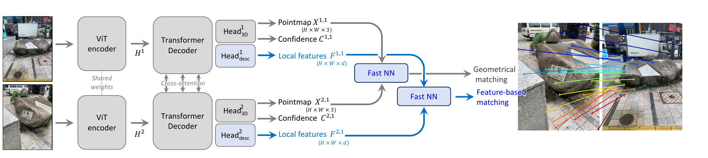
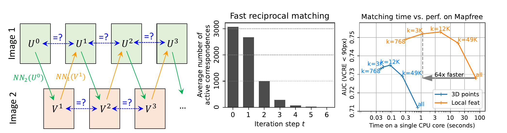

# 用 MASt3R 把图像匹配锚定在 3D 中

## 结论先行
- **核心主张**：图像匹配本质是 3D 问题（对应关系由相机位姿与场景几何唯一决定），却长期被当作纯 2D 任务来做。MASt3R 在 DUSt3R 的 pointmap 前馈网络上并联一个**稠密局部特征头（Head_desc）+ infoNCE 匹配损失**，让匹配「站在 3D 几何之上」，从而同时得到**度量尺度**的三维点与高精度像素对应。（证据：论文摘要与方法节，已核验）
- **它是前馈重建谱系里的关键中间环**：DUSt3R 打开了 pointmap 范式，MASt3R 把它从「能重建」推进到「能精确匹配 / 能做视觉定位」，是后续 MASt3R-SfM、以及各类度量前馈方法的直接前驱。（推断 + 证据）
- **视觉定位提升显著**：在极具挑战的 Map-free localization 上，VCRE AUC 取得约 **30% 的绝对提升**，超过当时已发表方法；Aachen-Day-Night 夜间 split（top-1，0.25m/2° 档）从 55.5% 提升到 70.2%（coarse → coarse-to-fine）。（证据：论文与 ar5iv Table 3，已核验）
- **匹配驱动的重建精度大幅改善**：DTU 上 Chamfer overall 从 DUSt3R 的 1.741 降到 MASt3R coarse-to-fine 的 **0.374**（约减半再减半），说明精确匹配对下游几何的杠杆作用。（证据：ar5iv Table 3，已核验）
- **FRM 是让稠密匹配落地的关键工程**：把「 $O(HW)$ 的稠密互易最近邻」近似为几次迭代的稀疏子采样，论文以「 $k \approx 3000$ 时约 6 次迭代后活跃样本降为 0」定性说明其显著加速；具体墙钟加速倍数论文正文未给出确切数字（**待核验**）。（证据：论文与消融图，部分待核验）
- **落地门槛同 DUSt3R**：代码与权重为 **CC BY-NC-SA 4.0 非商用**，权重还叠加训练数据集许可（Map-free 数据集尤为严格）。商用需自训或另行授权。（证据：README，已核验）

## 1. 这篇论文解决什么问题？
- **问题定义**：给定两张图像，输出**可靠且尽量稠密**的像素级对应（matches），并让这些对应在 3D 几何上自洽，服务于相对位姿、视觉定位与重建。
- **输入 / 输出**：输入 RGB 图像对；输出每图在**第一张图坐标系**下的 pointmap（继承 DUSt3R）+ 逐像素置信度 + **稠密局部特征图**，据此产出 2D-2D 匹配、度量尺度三维点、相机位姿。
- **目标场景**：大视角/光照变化（昼夜）、宽基线、弱纹理等传统 2D 匹配（如 SuperGlue/LoFTR 系）易失效的困难情形；尤其是 Map-free 这类无先验地图的重定位。
- **与现有方法差异**：传统匹配在 2D 图像平面上找对应，几何一致性靠后处理（RANSAC + 几何模型）来补；MASt3R 直接在**已经回归出 3D 几何**的表征上学匹配，把 3D 约束前置进网络，匹配天然带尺度与几何意义。

## 2. 方法概览
- **核心想法**：DUSt3R 已经把「两图 → 共享坐标系 pointmap」变成一次前馈回归；MASt3R 观察到这个 pointmap 网络的中间特征其实已经隐含了跨图对应关系，于是**再挂一个轻量描述子头**把这种对应显式化为可匹配的局部特征，并用匹配损失把它训得足够判别，同时把 pointmap 头训成**度量尺度**。
- **一句话 pipeline**：两图 → 共享 ViT 编码器 → 交叉注意力解码器 → 并联的 `Head_3D`（pointmap + 置信度）和 `Head_desc`（ $d$ 维局部特征） → 用 **Fast Reciprocal Matching (FRM)** 从稠密特征抽互易最近邻 → （定位时）coarse-to-fine 精化 → 对应 + 度量三维点 + 位姿。

### 2.1 架构解析

- **整体结构（模块分解）**：完全承自 DUSt3R / CroCo v2 血统的非对称孪生结构：
  1. **共享权重 ViT 编码器**（ViT-Large）：两图 $I^1, I^2$ 分别过同一编码器，得 token 特征 $H^1, H^2$ 。
  2. **交叉注意力 Transformer 解码器**（ViT-Base）：两支解码器交替做 self-attention 与 **cross-attention**，让每张图「看见」另一张图，把两图信息融进共享的第一图坐标系。
  3. **Head_3D**：对每张图回归第一图坐标系下的 pointmap $X^{1,1}, X^{2,1} \in \mathbb{R}^{H \times W \times 3}$ 与逐像素置信度 $C^{1,1}, C^{2,1}$ （上标 $v,1$ 表示「第 $v$ 张图、表达在第 1 张图坐标系」）。
  4. **Head_desc（本文新增）**：一个逐像素 MLP，输出稠密局部特征图 $F^{1,1}, F^{2,1} \in \mathbb{R}^{H \times W \times d}$ ， $d = 24$ ，再做 $\ell_2$ 归一化。它与 pointmap 头**共享解码器特征、并行分叉**，几乎不增加计算。
- **各模块职责与数据流**：编码器抽通用视觉特征 → 解码器做跨图信息交换与几何推理 → `Head_3D` 负责「几何 / 尺度」， `Head_desc` 负责「可匹配的判别性外观」→ 两者在同一坐标系下对齐， `Fast NN` 既可对 pointmap 做几何匹配、也可对局部特征做特征匹配。
- **关键设计选择及理由**：
  - **特征头与几何头并联而非串联**：匹配特征不从 pointmap 反推，而是独立回归，避免几何误差污染描述子判别性；两头共享上游，几何监督又反过来给特征头注入 3D 归纳偏置。
  - **低维描述子（ $d = 24$ ）**：稠密特征图的显存/带宽随 $d$ 线性增长，24 维在判别力与稠密可算之间取平衡（对比 SuperPoint/128、SIFT/128，这里刻意压缩）。
  - **度量（metric）pointmap**：公开权重 `MASt3R_ViTLarge_BaseDecoder_512_catmlpdpt_metric.pth` 在有度量真值的数据上关闭尺度归一化训练，使输出直接带真实尺度，这是 Map-free 这类无地图重定位的前提。

### 2.2 核心原理
- **为什么这样设计 work**：匹配的「难」在于外观歧义（重复纹理、光照变化）与几何歧义。DUSt3R 的解码器为了回归几何一致的 pointmap，已经在内部学到了跨图的几何对应；MASt3R 只是把这份「隐式对应」用一个判别损失显式蒸出来。因此描述子天生带 3D 一致性——同一 3D 点在两图的特征被几何约束推向一致，而不是只靠外观相似。
- **关键机制/归纳偏置**：
  - **3D-grounded 匹配**：匹配不再是 2D 平面上的最近邻，而是「共享 3D 坐标系里同一点」的最近邻，几何约束被前置进表征而非后处理。
  - **互易性（reciprocity）作为可靠性准则**：只保留双向最近邻（ $i \to j$ 且 $j \to i$ ），天然过滤单向歧义匹配。
  - **度量尺度**：解决了 DUSt3R「尺度未知、需外部标定」的痛点，让单目/两视图直接产出米制三维点。
- **与前作在原理上的本质区别**：DUSt3R 把匹配当作 pointmap 的**副产品**（在 3D 里找最近点），几何噪声直接变成匹配噪声；MASt3R 把匹配升级为**受监督的一等目标**，用专门的判别特征 + infoNCE 训练，匹配精度不再被 pointmap 的回归误差上限锁死——这正是 DTU Chamfer 从 1.741 掉到 0.374 的机理来源。

### 2.3 关键公式解析

- **公式 (1)：置信度加权 3D 回归损失（承自 DUSt3R）**
  $$ \mathcal{L}_{conf} = \sum_{v \in \{1,2\}} \sum_{i \in \mathcal{P}^v} \Big( C^{v,1}_i\, \ell_{regr}(v,i) - \alpha \log C^{v,1}_i \Big) $$
  其中归一化回归项
  $$ \ell_{regr}(v,i) = \left\lVert \tfrac{1}{z} X^{v,1}_i - \tfrac{1}{\hat z} \hat X^{v,1}_i \right\rVert $$
  - 符号： $X^{v,1}\_i$ 是预测 pointmap 第 $i$ 个像素、 $\hat X^{v,1}\_i$ 是真值； $z, \hat z$ 是预测/真值的尺度归一化因子（度量版本在有米制真值时令 $z = \hat z = 1$ ，即不归一化）； $C^{v,1}\_i \ge 1$ 是预测置信度； $\alpha$ 是置信度正则权重（ $\alpha = 0.2$ ）。
  - 作用：让网络对难像素降权（小 $C$ ），对可靠像素加权，同时 $-\alpha \log C$ 惩罚一味降权；这是 pointmap 头的几何监督。

- **公式 (2)：局部特征相似度**
  $$ s_\tau(i,j) = \exp\big(-\tau\, F^{1,1}_i{}^{\top} F^{2,1}_j\big) $$
  - 符号： $F^{1,1}\_i, F^{2,1}\_j$ 是两图第 $i, j$ 像素的 $\ell\_2$ 归一化局部特征； $\tau$ 是温度（ $\tau = 0.07$ ）；内积越大表示越相似。
  - 作用：把稠密特征点积转成 softmax 打分的核，供匹配损失使用。

- **公式 (3)：infoNCE 匹配损失（本文核心新增）**
  $$ \mathcal{L}_{match} = -\!\!\sum_{(i,j) \in \hat{\mathcal{M}}} \left[ \log\frac{s_\tau(i,j)}{\sum_{k \in \mathcal{P}^1} s_\tau(k,j)} + \log\frac{s_\tau(i,j)}{\sum_{k \in \mathcal{P}^2} s_\tau(i,k)} \right] $$
  - 符号： $\hat{\mathcal{M}}$ 是真值对应集合（由真值 pointmap / 深度反投影得到）； $\mathcal{P}^1, \mathcal{P}^2$ 分别是两图的像素集；两个对数项是**双向**交叉熵（把 $j$ 在图 1 中认成 $i$ 、把 $i$ 在图 2 中认成 $j$ ）。
  - 作用：强制真值对应处的特征在两个方向上都互为最近邻（对比学习），这正是把「3D 里同一点」蒸馏成「可匹配描述子」的监督信号。

- **公式 (4)：总损失**
  $$ \mathcal{L} = \mathcal{L}_{conf} + \beta\, \mathcal{L}_{match}, \qquad \beta = 1 $$
  - 符号： $\beta$ 平衡几何回归与匹配； $\beta = 1$ 说明两者近乎等权。
  - 作用：单阶段联合训练，几何与匹配互相正则。

- **公式 (5)：快速互易匹配（FRM）的迭代**
  $$ U^{t} \xrightarrow{\ NN_2\ } V^{t+1} = \big[NN_2(F^{1,1}_u)\big]_{u \in U^t} \xrightarrow{\ NN_1\ } U^{t+1} = \big[NN_1(F^{2,1}_v)\big]_{v \in V^{t+1}} $$
  - 符号： $U^t \subset \mathcal{P}^1$ 是第 $t$ 轮图 1 的候选像素集（初始 $U^0$ 为规则网格采样的 $k$ 个点）； $NN\_2(\cdot)$ 是在图 2 特征里取最近邻、 $NN\_1(\cdot)$ 反向； $U^t = U^{t+1}$ 的不动点即为互易匹配。
  - 作用：把稠密互易匹配的 $O(HW)$ 近似成对 $k$ 个种子点做几次映射-回映射；论文报告活跃集快速收缩，实测 $k \approx 3000$ 时**约 6 次迭代后活跃样本降为 0**。

### 2.4 训练与推理细节
- **训练目标 / 损失函数**：公式 (4)，即 DUSt3R 置信度回归损失 + infoNCE 匹配损失，联合单阶段训练。
- **训练数据与规模**：14 个公开数据集混合，涵盖室内外、真实与合成——Habitat-Sim、BlendedMVS、MegaDepth、ARKitScenes、CO3Dv2、ScanNet++、TartanAir 等，真值对应由带尺度的深度/pointmap 反投影得到。
- **关键超参（ar5iv Table 4，已核验）**：Adam（ $\beta = (0.9, 0.95)$ ，weight decay 0.05，cosine 衰减），base lr $= 1\text{e-}4$ ，batch size $= 64$ ，35 epochs（7 epoch warmup）；局部特征维度 $d = 24$ ；infoNCE 温度 $\tau = 0.07$ ；置信度权重 $\alpha = 0.2$ ；匹配损失权重 $\beta = 1$ ；输入为 512 系列多分辨率（长边 512，如 512×384 / 512×336 / 512×288 / 512×256 / 512×160）。初始化承自 DUSt3R / CroCo v2 预训练权重。
- **推理流程**：
  1. 两图前馈得 pointmap + 置信度 + 稠密特征。
  2. **FRM** 从特征图抽互易最近邻（默认 $k \approx 3000$ 种子），得稀疏但高可靠的对应。
  3. 视觉定位/高精度场景用 **coarse-to-fine**：先在 512 粗分辨率匹配定位大致对应区域，再在**全分辨率的重叠窗口网格**内逐窗匹配并聚合，弥补网络固定训练分辨率带来的细节损失。
  4. 下游按需接 RANSAC + PnP/本质矩阵求位姿，或三角化得稠密点云。

## 3. 关键贡献
1. 提出「**把图像匹配 grounding 在 3D**」的框架：在 pointmap 回归网络上并联稠密局部特征头 + infoNCE 匹配损失，让匹配继承 3D 几何与度量尺度。
2. 提出 **Fast Reciprocal Matching (FRM)**：以迭代子采样近似稠密互易最近邻匹配，带收敛性保证并显著加速（活跃样本约 6 次迭代归零），解决稠密匹配的算力瓶颈。
3. 提出 **coarse-to-fine 匹配 / 定位**流程，在超出训练分辨率时仍取得更精确的对应与位姿。
4. 在多项匹配、相对位姿、视觉定位基准上刷新或逼近 SoTA（Map-free VCRE AUC 约 +30% 绝对），并完整开源代码（含训练）与度量权重。

## 4. 实验与证据
| 维度 | 内容 |
|---|---|
| 数据集 | 训练：Habitat-Sim、BlendedMVS、MegaDepth、ARKitScenes、CO3Dv2、ScanNet++、TartanAir 等 14 个公开混合集。评测：Map-free localization、Aachen-Day-Night、InLoc、Cambridge Landmarks、7-Scenes、DTU 等 |
| Baseline | DUSt3R；2D 匹配方法（SuperGlue、LoFTR、RoMa 等系）；各视觉定位管线 |
| 指标 | VCRE AUC（Map-free）、定位召回（多阈值，如 0.25m/2°、0.5m/5°、5m/10°）、Chamfer（DTU：Accuracy / Completeness / Overall）、匹配/位姿精度 |
| 主要结果（已核验） | Map-free：VCRE AUC 约 **+30% 绝对提升**，超已发表方法；Aachen-Day-Night 夜间 top-1（0.25m/2° / 0.5m/5° / 5m/10° 档）55.5/82.2/95.8 → **70.2**/88.0/97.4（coarse → coarse-to-fine），白天 top-1 74.9/90.3/98.5 → 79.6/93.5/98.7；DTU Chamfer overall：DUSt3R 1.741 → MASt3R coarse-only 0.622 → coarse-to-fine **0.374**（Acc 0.403 / Comp 0.344） |
| 消融 | FRM 迭代收敛（ $k = 3000$ ，约 6 次迭代活跃样本归零）；FRM vs 稠密互易匹配显著提速且几乎不掉 AUC；局部特征匹配 vs 直接用 3D 点匹配（特征更优）；coarse-to-fine vs coarse-only 的增益；子采样策略对下游 RANSAC 的影响 |
| 失败案例 | 极端无纹理/重复纹理、超大视角变化仍受限；度量尺度依赖训练数据分布（推断） |

### 4.1 效果与性能解析

- **主要结果解读（不只搬数字）**：
  - **DTU Chamfer 1.741 → 0.374** 的量级跃迁不是靠更大模型（主干与 DUSt3R 同源），而是靠**匹配质量**：DUSt3R 直接在 3D 点云里找最近邻，回归误差直接进入几何；MASt3R 用判别特征拿到亚像素级可靠对应再三角化，误差来源被解耦。这佐证了「匹配是 3D 问题、值得单独监督」的核心论点。
  - **Aachen 夜间 55.5 → 70.2** 的提升集中在最严档（0.25m/2°），说明增益来自**高精度对应**而非召回堆量——正是 coarse-to-fine 在全分辨率窗口里挤出的细节精度。
  - **Map-free +30% VCRE AUC** 尤其有说服力：该基准无先验地图、要求度量尺度，直接受益于 metric pointmap + 高精匹配的组合。
- **性能与效率**：
  - 主干沿用 ViT-L 编码器 + ViT-B 解码器，参数量与 DUSt3R 同量级； `Head_desc` 仅一个逐像素 MLP（ $d = 24$ ），额外开销可忽略。
  - **FRM 是效率关键**：论文显示在同一 AUC 水平上，局部特征互易匹配相比全稠密互易匹配显著提速（活跃样本约 6 次迭代归零），具体墙钟加速倍数论文正文未给确切数值（待核验）； $k$ 越大越精但越慢， $k \approx 3000$ 是甜点。
  - 推理分辨率 512 + coarse-to-fine 的窗口聚合会显著增加时延/显存，实际部署需权衡（推断）。
- **消融揭示的关键因素**：(1) 用**学习到的局部特征**匹配优于直接用回归 3D 点匹配——验证特征头的必要性；(2) FRM 的迭代子采样在几乎不掉精度下大幅提速；(3) coarse-to-fine 对高分辨率定位增益明显。
- **可比性与协议一致性**：与 DUSt3R 共享主干与训练框架，DTU/Aachen 沿用各自标准协议，DUSt3R 作为同源 baseline 直接对照，增量可归因于「匹配头 + FRM + metric + coarse-to-fine」而非架构规模，可比性强。

## 5. 局限与风险
- **论文明确承认**：稠密匹配算力大，需 FRM 近似加速；困难场景（极端视角/纹理）仍有失败；网络固定训练分辨率，需 coarse-to-fine 才能上高分辨率。
- **我推断的风险**：度量尺度与几何精度依赖大规模训练数据分布，跨域（新传感器/新场景尺度）可能退化；以两视图为主，多视图全局一致重建仍需后续 MASt3R-SfM 等扩展。
- **工程落地风险**：512 + coarse-to-fine 的显存/时延需评估；FRM 超参（初始样本数 $k$ ）直接决定精度-速度权衡，需按场景调。
- **许可证 / 数据风险**：**CC BY-NC-SA 4.0 非商用**，权重叠加训练集许可（Map-free 数据集限制尤严），商用为硬门槛。

## 方法谱系
- 基于：[DUSt3R](../3d-reconstruction/2023-dust3r.md)（在其 pointmap 前馈基座上新增度量匹配头、infoNCE 匹配损失与 FRM，把「能重建」升级为「能精确匹配 / 能度量定位」）

## 6. 与相似方法对比

> 横向对比见：[前馈几何模型对比](../../comparisons/3d-reconstruction/visual-geometry-foundation-models.md)（3.6 谱系源头）、[3D 重建发展全景](../../comparisons/3d-reconstruction/development-survey.md)。

| Method | 相同点 | 不同点 | 何时选它 |
|---|---|---|---|
| DUSt3R（前驱） | 同 pointmap 前馈基座、同一血统主干 | MASt3R 新增局部特征头 + 匹配损失 + FRM，匹配与定位精度大幅提升、输出度量尺度 | 只需通用两视图重建/深度、不追求最强匹配时用 DUSt3R |
| 2D 匹配（SuperGlue/LoFTR/RoMa） | 目标都是稠密/半稠密像素对应 | 2D 方法在图像平面找对应、几何一致靠后处理；MASt3R 把 3D 几何前置进网络，天然带尺度与互易可靠性 | 已有标定/位姿、只要 2D 对应且要极致轻量时用专用 2D 匹配器 |
| VGGT / Pi3（后继） | 同前馈重建思路 | 转向大规模统一 Transformer、一次前馈直接多视，弱化显式两视匹配头 | 追求端到端多视、更快推理时选后继 |

## 7. 复现判断
- **Git 地址**：https://github.com/naver/mast3r
- **是否开源**：是（代码 + 度量权重）。
- **是否开源训练**：是——仓库含 `train.py`、数据集配置与超参（承自 DUSt3R 训练框架）。（已核验）
- **代码/权重/数据可用性**：公开度量权重 `MASt3R_ViTLarge_BaseDecoder_512_catmlpdpt_metric.pth`（HuggingFace Hub 自动下载或官方服务器直下），另提供检索模型（retrieval training-free / codebook）与 DUNE+MASt3R 变体（`dunemast3r_cvpr25_vitbase/vitsmall`）；训练数据多为公开集，Map-free 等数据集许可较严；提供小规模 CO3D 子集 demo。
- **预计成本**：推理级复现（跑 demo + 匹配/定位评测）低成本、单卡可行；全量训练成本高（14 数据集混合、ViT-L 主干），需多卡多日。
- **最小复现路径**：clone → 下 512 metric 权重 → 跑官方匹配 demo，在两张宽基线/昼夜图上验证稠密匹配与位姿；再按需接 Aachen/InLoc 定位或 DTU 评测对齐数值。
- **是否值得复现**：值得作为前馈匹配-定位谱系的**推理级基线**复现；训练级复现仅在定制数据/商用替代权重时进行。注意 **CC BY-NC-SA 4.0 非商用**限制。

## 8. 后续动作
- [ ] 更新索引
- [ ] 待 MASt3R-SfM / MapAnything / CUT3R 等分析入库后，补齐彼此方法谱系回链
