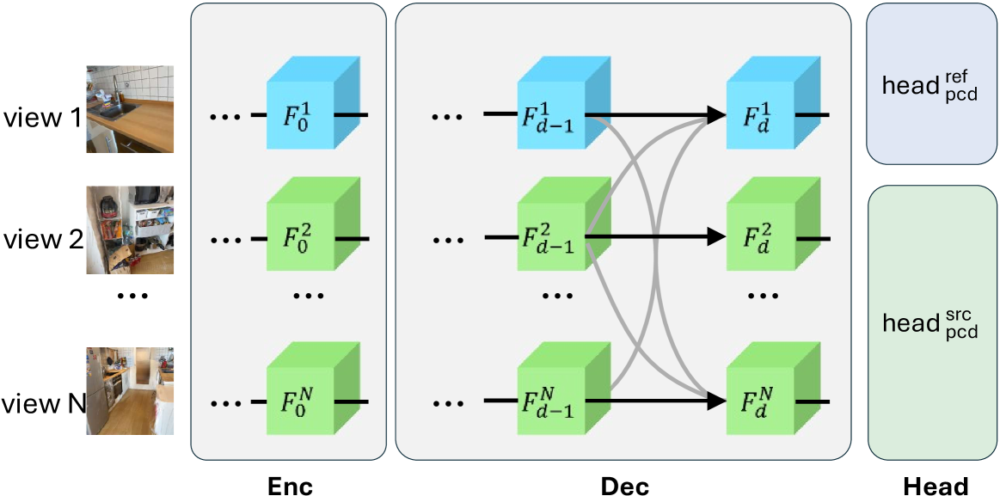
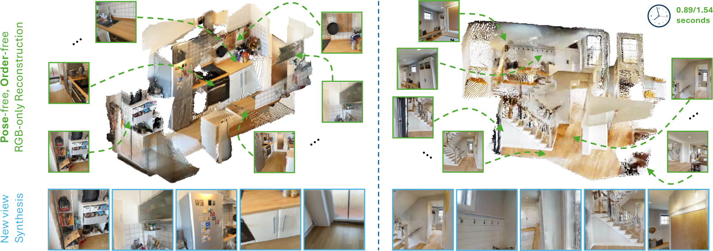

# MV-DUSt3R+：稀疏视图 2 秒单阶段场景重建

## 结论先行

- **核心结论**：MV-DUSt3R+ 把 DUSt3R「一次只吃两张图 + 事后全局优化」的两阶段流程，压成一个**单阶段前馈网络**——多视图解码块（multi-view decoder blocks）在任意数量视图间直接交换信息，所有视图的 pointmap 一次性回归到**同一个参考视坐标系**，不再需要组合数量级的两两重建与昂贵的全局对齐。（证据：论文摘要与 Sec. 3，已核验）
- **两级设计**：MV-DUSt3R 依赖单个参考视，选错参考视会掉性能；MV-DUSt3R**+** 加了 **cross-reference-view blocks**，并行跑多个参考视选择并跨路径融合信息，对参考视选择鲁棒。这是「+」相对基础版的关键增量。（证据：摘要 + Sec. 3.3，已核验）
- **速度是最大卖点**：24 视图输入的场景重建在**单卡 2 秒内**完成，论文称比 DUSt3R 式流程快约 48–78×。（证据：摘要与 teaser 图标注 0.89/1.54 秒，已核验；具体倍数为论文陈述）
- **精度大幅领先**：HM3D 24 视图上，点云 Chamfer Distance 从 DUSt3R 的 32.4 降到 MV-DUSt3R 的 10.0、MV-DUSt3R+ 的 3.9；新视角合成 PSNR 从 14.3 提到 18.4 dB。（证据：论文表格，经 HTML 版核验；数值以原文为准）
- **可用性与许可**：代码、权重（MVD.pth / MVDp_s1.pth / MVDp_s2.pth）已在 GitHub + HuggingFace 放出，训练脚本可用；但许可为 **CC BY-NC 4.0 非商用**，且训练轨迹数据与生成代码发布时仍在准备中。商用需另行授权。（证据：官方 README，已核验）

## 1. 这篇论文解决什么问题？

- **问题定义**：给定同一场景的**稀疏、无位姿、无标定**多视图图像（论文测 4 / 12 / 24 视图），一次性输出统一坐标系下的稠密三维几何、相机位姿，并支持新视角合成。
- **输入 / 输出**：输入 N 张 RGB 图；输出每张图逐像素、表达在同一参考视坐标系下的 pointmap + 置信度，可导出点云、相机内外参；扩展版还输出 3D 高斯（Gaussian splatting）用于渲染新视角。
- **目标场景**：室内多视图场景重建（HM3D / ScanNet / MP3D 等），追求「拍几张图就能秒级重建 + 漫游」。
- **与现有方法的差异**：DUSt3R / MASt3R 一次只处理一对视图，多于两视图时要做**组合数量级**的两两重建，再叠一层昂贵的全局优化，且优化常无法纠正配对阶段的错误累积。MV-DUSt3R+ 把「多视图融合」直接搬进网络前向，一步到位。

## 2. 方法概览

- **核心想法**：不再「配对 + 优化」，而是让一个网络在解码阶段就对**所有视图**做多视图注意力，把每张图的 pointmap 直接摆进同一参考视坐标系；再用多参考视融合消除对单一参考视的依赖。
- **一句话 pipeline**：N 张图 → 共享 ViT 编码 → 多视图解码块（参考视/源视两类，跨视交叉注意力）→ pointmap 头（ref/src 两个头）输出统一坐标系点图 →（可选）高斯头输出 3DGS 渲染新视角；「+」版在多个参考视路径间加 cross-reference 融合。

### 2.1 架构解析

- **整体结构（模块分解）**：延续 DUSt3R 的「编码器 + 解码器 + 头」三段式，但全部升级为多视图版本：
  1. **共享 ViT 编码器（Enc）**：N 张图各自 patchify，送入权重共享的 ViT，得到每视图 token $F\_0^v$ （图中 view 1…view N）。
  2. **多视图解码器（Dec）**：堆叠多视图解码块。视图被分成**参考视（reference，图中蓝色 $F^1$ ）**与**源视（source，绿色 $F^2\dots F^N$ ）**两类，对应两种权重不同、结构相同的块 `DecBlock^ref` 与 `DecBlock^src`。每个块内：LayerNorm → **自注力（仅本类 token）** → **交叉注意力（本类 token 查询 + 其余所有视图 token）** → MLP。图中第 d 层到第 d 层间的灰色连线，就是跨视图信息交换：任意视图都能看到其它所有视图，这是「单阶段融合多视图」的关键。
  3. **两个 pointmap 头（Head）**： $\text{head}^{\text{ref}}\_{\text{pcd}}$ 给参考视、 $\text{head}^{\text{src}}\_{\text{pcd}}$ 给源视，回归各视图在**参考视坐标系**下的 pointmap 与置信度。
- **数据流**： $\{I^v\}\_{v=1}^N \xrightarrow{\text{shared ViT}} \{F\_0^v\} \xrightarrow{\text{multi-view dec} \times d} \{F\_d^v\} \xrightarrow{\text{ref/src head}} \{(X^{v,\text{ref}}, C^v)\}$ 。所有 $X^{v,\text{ref}}$ 天然同坐标系，故位姿被隐式编码，无需事后对齐。
- **关键设计选择及理由**：
  - **参考视/源视分工**：单参考视坐标系是「一次到位」的锚点——把「相对位姿」这个显式变量彻底吸收进网络回归里（与 DUSt3R 让 $X^{2,1}$ 编码图 2 相对图 1 位姿的思路一脉相承，只是从 2 张推广到 N 张）。
  - **Cross-reference-view blocks（仅「+」版）**：单参考视方案对参考视选择敏感（选到信息量差的视图会累全局）。「+」版并行实例化**多个参考视选择**下的解码路径，用与 DecBlock 同构的 cross-reference 块在不同路径间融合信息，输出对参考视选择鲁棒的结果。
  - **Gaussian splatting 头**：在 pointmap 之上再加一个联合训练的 3DGS 头，把重建结果直接变成可渲染的高斯，让同一网络顺带支持新视角合成。
  - **基座沿用 DUSt3R / CroCo**：以预训练 DUSt3R 为初始化微调（README 提供 base 权重），继承其跨视图对应的归纳偏置。

### 2.2 核心原理

- **为什么这样 work**：多视图重建误差主要来自「配对阶段局部一致、全局不一致」。DUSt3R 靠事后全局优化缝合，但优化只能微调、无法纠正配对时的结构性错误。MV-DUSt3R+ 让**融合发生在特征层而非几何层**——解码块里每张图都直接注意到全部其它图，网络在回归 pointmap 时已经「看过全局」，从源头保证一致性，因而 Chamfer 大幅下降。
- **关键机制/归纳偏置**：（1）统一参考视坐标系 = 隐式位姿，去掉显式相机模型；（2）跨视图交叉注意力 = 单阶段多视图信息聚合；（3）多参考视融合 = 消除单锚点偏差。
- **与前作的本质区别**：DUSt3R 的多视图能力是「网络（两视图）+ 手工全局优化」的拼装；MV-DUSt3R+ 把多视图一致性做成**端到端可学习**的网络行为，推理是纯前馈、无迭代优化。

### 2.3 关键公式解析

> 论文核心是「置信度加权的 pointmap 回归损失」+「渲染损失」。以下按论文形式化，符号以原文语义标注；系数取值以原文为准。

- **公式 (1)：置信度加权 pointmap 回归损失**

$$ \mathcal{L}_{\text{conf}} = \sum_{v} \sum_{p} \Big( C_p^{v,r}\, \ell_{\text{regr}}(v,p) - \beta \log C_p^{v,r} \Big) $$

  - 符号：
    - $v$ ：视图索引（遍历所有输入视图）； $p$ ：像素索引。
    - $r$ ：当前参考视（reference view），所有 pointmap 表达在 $r$ 的坐标系下。
    - $C\_p^{v,r}$ ：网络对「视图 $v$ 像素 $p$ 在参考系 $r$ 下」预测的置信度， $\ge 0$ 。
    - $\ell\_{\text{regr}}(v,p)$ ：该像素预测三维点与 GT 三维点的**归一化**欧氏距离（用场景尺度归一化以消除 pointmap 的全局尺度不确定性，沿用 DUSt3R 做法）。
    - $\beta$ ：正则系数，抑制置信度塌缩。
  - 作用：置信度大的像素被要求回归更准（ $C\cdot\ell$ 项），同时 $-\beta\log C$ 鼓励网络对确有把握的区域给高置信度、对遮挡/纹理缺失区域降权，让网络自适应地「知道自己不知道」。这是从 DUSt3R 继承的置信度感知损失，推广到任意多视图。

- **公式 (2)：新视角渲染损失（Gaussian splatting 头）**

$$ \mathcal{L}_{\text{render}} = \sum_{u}\Big( \lVert \hat{I}_u - I_u \rVert_2 + \gamma\, \mathrm{LPIPS}(\hat{I}_u, I_u) \Big) $$

  - 符号： $u$ 为留出的目标新视角； $\hat{I}\_u$ 为 3DGS 渲染图， $I\_u$ 为真值图；第一项为像素 L2 差，第二项为 LPIPS 感知损失， $\gamma$ 为权重。
  - 作用：把重建质量直接绑定到渲染质量上，端到端训练高斯头，使几何服务于可漫游的新视角合成。

> 说明：以上为论文核心损失的形式化整理；MV-DUSt3R+ 的多参考视融合主要体现在网络结构（cross-reference blocks），不改变损失形式。若需逐字系数，请以原文公式为准（此处标注了推断部分）。

### 2.4 训练与推理细节

- **训练目标 / 损失**：pointmap 回归主损失（公式 1）+ 新视角渲染损失（公式 2）联合训练；「+」版分两阶段（scripts 中含 stage 1 / stage 2，对应先训重建、后接 cross-reference 与高斯头）。
- **训练数据与规模**：主要训练集 ScanNet、ScanNet++、HM3D、Gibson；每视图轨迹训练视图数为 8，规模达百万级轨迹。训练配置约 **64 块 H100、100 epoch、每 epoch 15 万条轨迹、约 180 小时**（证据：HTML 版摘取；以原文为准）。
- **推理流程**：N 张图一次前向 → 得到统一坐标系 pointmap + 位姿 + 高斯 → 直接出点云/相机/新视角，**无迭代优化**。24 视图约 2 秒（单卡）。
- **评测协议**：训练用 8 视图，评测在 4 / 12 / 24 视图上；HM3D 为主，ScanNet / MP3D 做零样本泛化；新视角合成留出 6 个视角。

## 3. 关键贡献

1. **单阶段多视图前馈重建**：用多视图解码块替代「两两配对 + 全局优化」，把任意视图数的场景重建做成一次前向，速度提升近两个数量级（论文称约 48–78×）。
2. **Cross-reference-view 融合（MV-DUSt3R+）**：并行多个参考视选择并跨路径融合，解决单参考视方案对参考视选择敏感的问题，鲁棒性更强。
3. **重建 + 新视角合成一体化**：联合训练 Gaussian splatting 头，同一网络同时给几何与可渲染表示，覆盖 MVS、位姿、NVS 三类任务且全面超过前作。

## 4. 实验与证据

| 维度 | 内容 |
|---|---|
| 数据集 | 训练：ScanNet / ScanNet++ / HM3D / Gibson；评测：HM3D（主）、ScanNet / MP3D（零样本） |
| Baseline | DUSt3R、MASt3R（两视图 + 全局优化）等 |
| 指标 | Chamfer Distance（点云）、相对位姿误差、PSNR / SSIM / LPIPS（NVS） |
| 主要结果 | HM3D 24 视图：Chamfer 32.4（DUSt3R）→ 10.0（MV-DUSt3R）→ 3.9（MV-DUSt3R+）；NVS PSNR 14.3 → 18.4 dB；24 视图重建 < 2 秒 |
| 消融 | 参考视选择敏感性 → cross-reference 融合带来鲁棒性；视图数 4/12/24 的可扩展性 |
| 失败案例 | 论文未在摘要层面展开；推断在极稀疏/无重叠或纯训练分布外场景仍有退化风险 |

### 4.1 效果与性能解析

- **主要结果解读**：Chamfer 从 32.4 → 3.9 的下降不是简单调参，而是范式差异——全局优化只能微调配对结果，MV-DUSt3R+ 在特征层就完成多视图一致性，因此在视图多、误差易累积的 24 视图场景优势最大。NVS PSNR 提升 4 dB 说明几何质量足以支撑可用的新视角渲染。
- **性能与效率**：最突出的是**速度**——24 视图 2 秒（teaser 标注单场景 0.89/1.54 秒），对交互式重建/漫游是质变。这来自「去掉全局优化 + 单次前馈」的结构简化。
- **消融揭示的关键因素**：单参考视方案对参考视选择敏感是基础版的短板，cross-reference 融合是「+」相对基础版提升的主因；视图数从 4 到 24 的稳定表现证明多视图解码块的可扩展性。
- **可比性**：与 DUSt3R/MASt3R 在同一 HM3D 协议下对比，输入均为无位姿稀疏视图，比较协议一致，结论可信度高。

## 5. 局限与风险

- **论文明确承认**：性能依赖参考视，故需要「+」版的多参考视融合来兜底；训练数据与轨迹生成代码发布时仍在准备。
- **我推断的风险**：训练集偏室内（HM3D/ScanNet/Gibson），室外/野外大尺度场景的泛化未充分验证；极稀疏或视图间几乎无重叠时，网络内的多视图注意力可能缺乏可对齐线索而退化。
- **工程落地风险**：24 视图 2 秒的数字在 H100 级硬件上测得，边缘设备时延与显存需另评估；多参考视并行会增加显存/算力。
- **许可 / 数据风险**：代码与权重 **CC BY-NC 4.0 非商用**，商用需另行授权；训练轨迹数据未完全放出，从零复训门槛较高。

## 方法谱系

- 基于：[DUSt3R](../3d-reconstruction/2023-dust3r.md)（继承 pointmap 回归与 CroCo 基座，以其预训练权重微调）
- 相关前馈多视图/流式后续：[VGGT](../3d-reconstruction/2025-vggt.md)、[CUT3R](../3d-reconstruction/2025-cut3r.md)、[MASt3R](../3d-reconstruction/2024-mast3r.md)（同属 DUSt3R 谱系的多视图/在线扩展）

## 6. 与相似方法对比

| Method | 相同点 | 不同点 | 何时选它 |
|---|---|---|---|
| [DUSt3R](../3d-reconstruction/2023-dust3r.md) | pointmap 回归、无位姿无标定 | DUSt3R 一次两视图 + 全局优化；MV-DUSt3R+ 单阶段多视图前馈 | 只有两视图、或需 DUSt3R 生态工具时用 DUSt3R |
| [VGGT](../3d-reconstruction/2025-vggt.md) | 单次前馈、多视图统一回归 | VGGT 用交替注意力回归相机/深度/点图/轨迹，任意帧数；MV-DUSt3R+ 用参考视坐标系 + cross-reference，且自带 3DGS 头 | 要通用几何基础模型/点轨迹用 VGGT；要秒级重建 + 直接 NVS 用 MV-DUSt3R+ |
| [CUT3R](../3d-reconstruction/2025-cut3r.md) | 前馈、多视图一致 | CUT3R 面向在线/流式增量；MV-DUSt3R+ 面向一次性稀疏多视图 | 视频流/在线场景用 CUT3R |

> 更系统的横向对比见 [comparisons/3d-reconstruction/visual-geometry-foundation-models.md](../../comparisons/3d-reconstruction/visual-geometry-foundation-models.md)。

## 7. 复现判断

- **Git 地址**：https://github.com/facebookresearch/mvdust3r
- **是否开源**：是（代码 + 权重）。
- **是否开源训练**：训练脚本已放出（scripts/：MV-DUSt3R、MV-DUSt3R+ stage 1 / stage 2）；但**训练轨迹数据与轨迹生成代码发布时仍在准备**，从零复训受限。
- **代码可用性**：高，含推理 demo。
- **权重可用性**：高，MVD.pth / MVDp_s1.pth / MVDp_s2.pth 从 HuggingFace 下载，另提供 DUSt3R base 权重。
- **数据可获得性**：ScanNet/ScanNet++/HM3D/Gibson 均需各自申请/下载；论文用的轨迹采样未完全放出。
- **预计环境成本**：推理单卡即可（H100 级 2 秒/24 视图，消费级 GPU 时延更高）；完整复训需 ~64×H100 级规模，成本高。
- **最小复现路径**：拉官方权重 → 跑 demo 推理，在 HM3D/ScanNet 子集上验证 Chamfer / PSNR，先不复训。
- **是否值得复现**：值得做**推理级验证**（秒级重建 + NVS 效果直观）；完整复训因数据未齐 + 算力大，暂不建议。

## 8. 后续动作

- [ ] 更新 `indices/papers.md`
- [ ] 更新 `indices/directions.md`
- [ ] 更新 `comparisons/3d-reconstruction/visual-geometry-foundation-models.md`（补入 MV-DUSt3R+ 行）
- [ ] 若计划复现，创建 `reproductions/3d-reconstruction/mv-dust3r/README.md`（先做推理验证）
