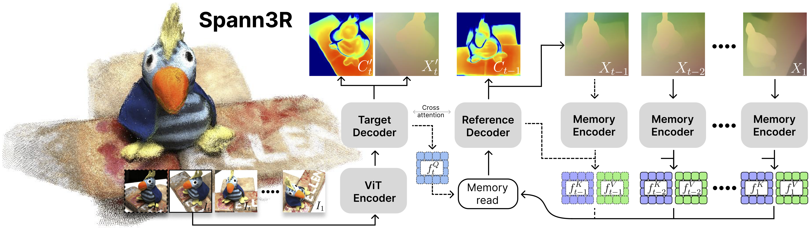
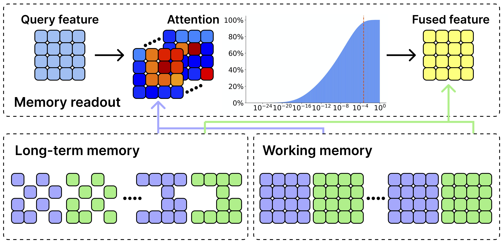

# 带空间记忆的 3D 重建（Spann3R）

## 结论先行

- Spann3R 的核心贡献是给 DUSt3R 式「前馈点图回归」加上一份**外部空间记忆（spatial memory）**：逐帧把当前图像特征作为 query 去检索记忆中已观测的 3D 信息，直接把点图预测到**统一全局坐标系**，从而**彻底去掉 DUSt3R 依赖的离线全局对齐（global alignment）优化**（证据：Abstract "eliminating the need for optimization-based global alignment"）。
- 它是最早给 DUSt3R 补上「记忆 + 流式」能力的工作之一，把成对、离线、需后处理的重建推进到**在线增量（incremental / online）**：有序图像流可实时处理，论文报告约 **65.49 FPS**（证据：Sec. 实验，Table 1 附带速度）。与后来的 CUT3R（用单份隐状态做循环）思路对照——Spann3R 用的是**显式、可检索、带遗忘机制的记忆库**，而非压缩进单个 latent。
- 方法在权重上直接继承 DUSt3R 预训练，仅在若干数据子集上微调即可获得跨数据集的泛化：在 7-Scenes（Acc 0.0342 / Comp 0.0241）、NRGBD（Acc 0.0691 / Comp 0.0291）、DTU（Acc 4.785 / Comp 2.743）上给出有竞争力的重建质量（证据：Table 1–2；DTU 单位为 mm，越小越好）。
- 记忆分「稠密工作记忆（working memory，最近 5 帧）+ 稀疏长期记忆（long-term memory，按累计注意力权重稀疏化）」两级，借鉴人类记忆的巩固/遗忘策略，使长序列推理时显存与算力可控（证据：方法节记忆管理描述）。
- 推断（非论文明证）：因为逐帧只与记忆做局部检索、无全局 BA，误差会沿轨迹累积（漂移），且对无序/大回环序列不如显式全局优化稳健；这是它与需全局对齐方法之间的本质权衡。

## 1. 这篇论文解决什么问题？

- 问题定义：从一组图像（有序视频流或图片集）做**稠密 3D 重建**，输出统一坐标系下的点云 / 点图。
- 输入 / 输出：输入为无标定的 RGB 图像序列（无需相机内外参、无需先验场景知识）；输出为每帧在**全局坐标系**下的稠密点图（pointmap）与置信度，可直接拼成点云。
- 目标场景：在线 / 增量式重建，尤其是流式视频；也可用于离线图片集。
- 与现有方法的差异：DUSt3R 只能对**图像对**在局部坐标系预测点图，多帧时必须做**优化式全局对齐**才能拼到一起（离线、慢、随帧数增长成本上升）。Spann3R 用空间记忆让网络在**前向一次**中就把点图放到全局系，去掉了这一步优化。

## 2. 方法概览

- 核心想法：维护一份「外部空间记忆」记录已见过的 3D 信息；预测下一帧几何时，用当前帧特征作为 query 去记忆里检索相关的历史几何，从而把新帧的点图直接对齐到已有全局坐标。
- 一句话 pipeline：`图像 → ViT 编码 → 与空间记忆做交叉注意力检索 → 双解码器输出全局系点图 → 把该帧几何写回记忆（工作记忆 + 长期记忆）→ 下一帧`。

### 2.1 架构解析

> 图片来源：Spann3R 论文 pipeline 图（arXiv:2408.16061，Wang & Agapito, 3DV 2025）。

- 整体结构（模块分解）：
  - **ViT 编码器**：ViT-Large，将每帧图像编码为 patch 特征（沿用 DUSt3R/CroCo 骨干）。
  - **双解码器（two intertwined decoders）**：ViT-Base，两支解码器通过交叉注意力联合处理——一支处理「当前帧特征 vs 记忆」，实现几何检索与坐标对齐。
  - **空间记忆（spatial memory）**：外部 key–value 记忆库，存储历史帧的几何/特征表示，供 query 检索。
  - **记忆编码器（memory encoder）**：一个轻量 transformer（6 个自注意力块，embedding 维度 1024），把「已完成的点图预测」编码成写入记忆的 value 表示。
- 各模块职责与数据流：新帧经编码器得到特征 → 作为 query 与记忆的 key 做交叉注意力 → 检索到的历史几何引导解码器把当前点图输出到全局系 → 记忆编码器把这帧的预测结果编码后写回记忆，更新 working / long-term memory。
- 关键设计选择及理由：把「跨帧对齐」这一原本靠优化解决的问题，转化为「向记忆检索」的可学习注意力操作，使其可端到端训练且一次前向完成，天然适配流式输入。

### 2.2 核心原理

> 图片来源：Spann3R 记忆机制图（arXiv:2408.16061）。

- 为什么这样设计 work：DUSt3R 已学到「从图像对回归几何一致点图」的强先验；Spann3R 复用其权重，只需学会「把当前帧 query 到记忆里的历史几何、并输出到共享坐标系」这一增量能力，因此微调代价小、泛化好。
- 关键机制 / 归纳偏置：
  - **query–memory 交叉注意力**：用注意力做隐式的跨帧几何关联，替代显式特征匹配 + 全局 BA。
  - **两级记忆 + 遗忘**：working memory 只保留最近 5 帧的稠密特征（保证局部精度）；long-term memory 依据累计注意力权重把老信息**稀疏化**保留（控制长序列成本、避免记忆无限膨胀）。这一「巩固 + 遗忘」策略借鉴人类记忆模型（论文注明参考 XMem 的记忆巩固）。
- 与前作在原理上的本质区别：DUSt3R 是「成对 + 全局优化」的两阶段离线方案；Spann3R 是「单帧 + 记忆检索」的单阶段在线方案。相比后续 CUT3R 用**单份持久隐状态**压缩全部历史，Spann3R 用的是**显式、可增删、可稀疏化的记忆库**，历史几何可被逐条检索。

### 2.3 关键公式解析

> 论文以文字与图为主，未给出编号严格的核心公式；以下按方法描述做形式化，符号为本文整理（非论文原式）。

- 记忆检索（形式化）：对第 $t$ 帧的 query 特征 $Q\_t$ 与记忆中的键 $K$ 、值 $V$ ，检索输出

  $$ \hat{H}\_t = \mathrm{softmax}\!\left( \frac{Q\_t K^{\top}}{\sqrt{d}} \right) V $$

  - 符号： $Q\_t$ 为当前帧经编码得到的查询特征； $K, V$ 为空间记忆中已写入的历史键 / 值（分别编码历史几何的可匹配表示与几何内容）； $d$ 为注意力维度； $\hat{H}\_t$ 为检索到的、用于把当前点图对齐到全局系的历史几何上下文。
  - 作用：把「当前帧应放在全局坐标系何处」这一对齐问题，表达为对记忆的软检索，可微、可端到端学习。

- 训练损失（形式化）：置信度加权回归损失 + 尺度约束

  $$ \mathcal{L} = \sum\_{i} c\_i \, \lVert \hat{X}\_i - X\_i \rVert - \alpha \log c\_i + \lambda \, \mathcal{L}\_{\text{scale}} $$

  - 符号： $\hat{X}\_i$ / $X\_i$ 为第 $i$ 个像素的预测 / 真值 3D 点； $c\_i$ 为网络输出的置信度（confidence）； $-\alpha \log c\_i$ 为置信度正则（鼓励对可靠区域给高置信）； $\mathcal{L}\_{\text{scale}}$ 为尺度损失，倾向让预测点云平均距离略小于真值，避免网络输出「无穷大尺度」的平凡解； $\alpha, \lambda$ 为权重。
  - 作用：置信度加权回归沿用 DUSt3R 思路以聚焦可靠几何；尺度损失专为「全局系点图 + 流式累积」下防止尺度退化 / 漂移（论文正文记为 $\mathcal{L}\_{\text{conf}} + \mathcal{L}\_{\text{scale}}$ ）。

### 2.4 训练与推理细节

- 训练目标 / 损失：如上，置信度加权 3D 回归 + 尺度损失。
- 训练数据与规模：初版在 ScanNet、ScanNet++、Habitat、ArkitScenes、Co3D、BlendedMVS 等数据子集上微调（继承 DUSt3R 预训练权重）。官方仓库 **v1.01**（2025-02 发布）进一步扩到 **15 个数据集**混合训练：ScanNet、ScanNet++、WildRGBD、Co3D、Aria、ArkitScenes、BlendedMVS、Waymo、TartanAir、OmniObject3D、MegaDepth、VKITTI2、Unreal、Spring、PointOdyssey。
- 推理流程与关键步骤：逐帧读入 → 编码 → 检索记忆 → 输出全局系点图 → 写回记忆（更新 working / long-term memory）。有序流可实时（约 65.49 FPS，单张 RTX 4090 / 224×224 分辨率，见实验）。仓库 demo 支持关键帧下采样（`--kf_every`）并可对接 Nerfstudio 做 3DGS。

## 3. 关键贡献

1. 提出**空间记忆**机制，让前馈点图回归在**单次前向**内把多帧几何对齐到统一全局坐标系，去除 DUSt3R 的离线全局对齐优化。
2. 设计**两级记忆（稠密工作记忆 + 稀疏长期记忆）+ 遗忘/巩固**策略，使长序列在线重建的显存与算力可控。
3. 实现**实时增量重建**（约 65.49 FPS），并在多个未见数据集上展示了竞争力与泛化性；开源了训练与推理代码、权重。

## 4. 实验与证据

| 维度 | 内容 |
|---|---|
| 数据集 | 7-Scenes、NRGBD、Replica、DTU（评测）；ScanNet/ScanNet++/Co3D/BlendedMVS 等（训练） |
| Baseline | DUSt3R（主要对照）及其它多视图重建方法 |
| 指标 | Accuracy、Completion、Normal Consistency、Chamfer Distance、FPS |
| 主要结果 | 7-Scenes：Acc 0.0342 / Comp 0.0241 / NC 0.6635；NRGBD：Acc 0.0691 / Comp 0.0291 / NC 0.7775；DTU：Acc 4.785 / Comp 2.743 / NC 0.721（mm）；速度约 65.49 FPS |
| 消融 | 记忆结构（working / long-term memory）、遗忘策略、微调数据组合 |
| 失败案例 | 长序列 / 大场景下的累积漂移；无序或弱重叠序列检索不稳 |

### 4.1 效果与性能解析

- 主要结果解读：Spann3R 在 7-Scenes / NRGBD 等室内数据集上以**单次前向 + 无全局优化**达到与需后处理方法相当的精度，说明「记忆检索」确实学到了跨帧对齐能力；这不是靠更强的每帧几何，而是靠把对齐负担从优化器转移到可学习注意力上。
- 性能与效率：约 65.49 FPS 的实时吞吐是核心卖点——DUSt3R 多帧需 $O(N^2)$ 级成对 + 全局对齐，而 Spann3R 逐帧只与有限记忆交互，成本近似线性，适配流式。
- 消融揭示的关键因素：两级记忆与遗忘策略是长序列可扩展性的关键；去掉长期记忆稀疏化会导致显存 / 算力随帧数膨胀。
- 与 SOTA / baseline 的可比性：评测协议对齐 DUSt3R（同类点图指标），DTU 用 mm 级 Acc/Comp，可与经典 MVS 协议参照；但精度指标需注意各方法尺度对齐方式差异。

## 5. 局限与风险

- 论文明确承认：作为在线增量方法，缺乏全局优化，长序列存在**累积漂移**；记忆容量受限需遗忘，可能丢弃有用的老信息。
- 我推断的风险（非论文明证）：对**无序图片集 / 大回环**不如显式全局对齐稳健（无闭环校正）；query–memory 检索在弱纹理、大视角跳变时可能检索失配。
- 工程落地风险：实时性依赖较强 GPU；关键帧采样（`kf_every`）等超参对质量 / 速度权衡敏感。
- 许可证 / 数据风险：代码与权重采用 **CC BY-NC-SA 4.0**（署名 + 非商用 + 相同方式共享），**明确禁止商用**，衍生作品需同样开源许可；训练数据含多来源数据集，各自许可需单独核对。

## 方法谱系

- 基于：[DUSt3R](../3d-reconstruction/2023-dust3r.md)（复用其预训练权重与点图回归范式，补上记忆 + 流式能力）

## 6. 与相似方法对比

| Method | 相同点 | 不同点 | 何时选它 |
|---|---|---|---|
| DUSt3R | 前馈点图回归、同骨干 | DUSt3R 成对 + 离线全局对齐；Spann3R 单帧 + 记忆检索、无优化、实时 | 需在线 / 实时增量重建时选 Spann3R |
| CUT3R | 同为「DUSt3R + 流式」在线重建 | CUT3R 用单份持久隐状态循环压缩历史；Spann3R 用显式可检索、可稀疏化的记忆库 | 需可增删 / 可解释的显式历史几何时选 Spann3R |

- 详见流式重建横向对比：[streaming-3d-reconstruction](../../comparisons/3d-reconstruction/streaming-3d-reconstruction.md)
- 详见视觉几何基础模型对比：[visual-geometry-foundation-models](../../comparisons/3d-reconstruction/visual-geometry-foundation-models.md)

## 7. 复现判断

- 可复现性：高。官方开源训练代码（`torchrun ... train.py`）+ 推理 demo + 权重（Google Drive，含 v1.01），并说明了 15 数据集混合训练配方。
- 主要成本：多数据集准备与 8 卡级训练资源；评测协议需与论文一致（点图尺度对齐方式）。
- 风险点：训练数据获取 / 许可分散；复现速度指标依赖硬件。

## 8. 后续动作

- 若做流式重建选型，与 CUT3R / MonST3R / Stream3R 等做统一协议横评（漂移、速度、显存 vs 帧数）。
- 复现时先跑 demo + v1.01 权重验证质量，再决定是否重训。
- 关注其 CC BY-NC-SA 4.0 许可的**非商用**约束，商用集成需另行获授权。

---

> 存疑点：（1）本文中的两条公式为依据方法文字所做的形式化，非论文编号原式，符号为本文整理（论文正文记为 $\mathcal{L}\_{\text{conf}} + \mathcal{L}\_{\text{scale}}$ ）；（2）DTU 指标单位按经典 MVS 协议记为 mm，Acc/Comp 越小越好，Normal Consistency 越大越好；（3）65.49 FPS 为论文报告值（单张 RTX 4090 / 224×224，已核对 arXiv HTML）；（4）初版微调数据子集与仓库 v1.01 的 15 数据集配方不同，frontmatter datasets 字段做了合并，训练细节以对应版本为准。
