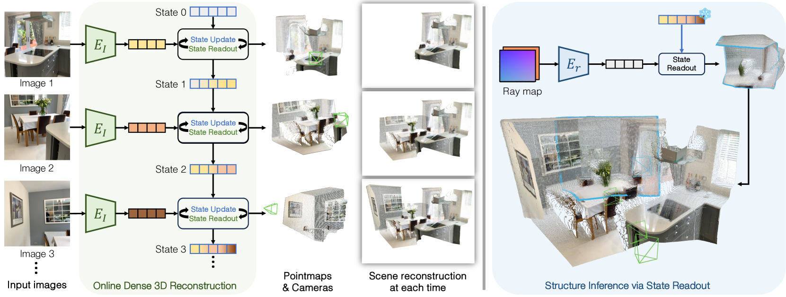
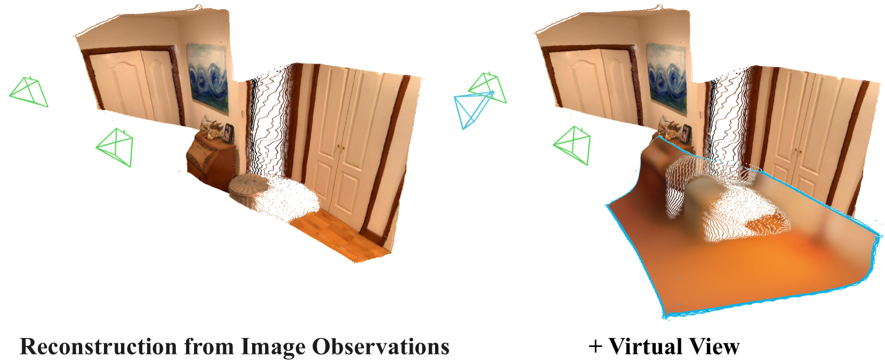

# 持久状态的连续 3D 感知模型（CUT3R）

## 结论先行
- CUT3R 把 DUSt3R 式「前馈点图回归」从**离线、成对、需全局对齐**推进到**在线、流式、单次读出**：一个循环网络维护一份持久状态（persistent state），每读入一帧就更新状态并直接输出该帧的度量尺度点图与相机位姿，无需事后全局优化（证据：论文 Abstract 与方法节，"stateful recurrent model that continuously updates its state"）。
- 关键机制是「读—写并行」的双 ViT 解码器：状态 token 与新帧特征做双向注意力交互，一路**读出**当前帧几何（点图/位姿），一路把新信息**写回**状态，用可学习的隐状态替代了显式成对匹配 + 全局 BA（证据：Fig 3 与式 (2)，Decoders 同时输出 $\mathbf{F}'_t$ 和更新后的 $\mathbf{s}_t$ ）。
- 它统一了多类 3D/4D 任务于同一模型：单目/视频深度、相机位姿估计、稠密重建，且能处理任意长度输入（有序视频或无序图片集）（证据：Table 1–4 覆盖 Sintel/Bonn/KITTI/NYU-v2/ScanNet/TUM/7-Scenes/NRGBD）。
- 在**在线方法**里它是当前最强档位：相机位姿 TUM-dynamics ATE 0.046（优于 CasualSAM 0.071）、视频深度 KITTI Abs Rel 0.118 且 δ<1.25 88.1%（优于离线 MonST3R-GA 0.168），并保持 ~16.6 FPS 的在线吞吐（证据：Table 2/3）。
- 速度是核心卖点：KITTI 上 ~16.58 FPS，比依赖全局对齐的离线方法（DUSt3R-GA 0.76 FPS、MonST3R-GA 0.35 FPS）快约一到两个数量级（证据：Table 2）。
- 独特能力：状态可被「虚拟视角 raymap」只读探测，据此推断**未观测区域**的度量尺度结构——把 MAE 式的 patch 级补全提升到图像级的场景补全（证据：Fig 2/6 与式 (4)）。
- 工程可用性中等偏好：代码 + 训练代码 + 两个权重均已开源，但**许可为 CC BY-NC-SA 4.0（禁止商用）**，商用落地受限（证据：仓库 LICENSE 文件已核实为 "Creative Commons Attribution-NonCommercial-ShareAlike 4.0"）。

## 1. 这篇论文解决什么问题？
- 问题定义：给定连续到达的图像流（视频帧或陆续加入的照片），**在线地**推断每帧的度量尺度点图、深度与相机位姿，并把它们累积成一致的稠密场景。
- 输入输出：输入为任意长度的 RGB 图像序列（逐帧到达）；输出为逐帧度量尺度点图（metric-scale pointmap）、相机位姿，可累积为稠密重建；还能通过「探测虚拟视角」推断未观测区域。
- 目标场景：流式/实时重建、SLAM 式增量建图、动态视频 4D 感知、机器人/AR 中边采集边重建。
- 与现有方法差异：DUSt3R/MASt3R 是成对处理再做全局对齐（离线、慢、随帧数扩展差）；MonST3R 等虽扩展到动态但仍走优化式全局对齐（GA）。CUT3R 用**持久状态循环**免去了全局对齐，做到单次前馈、在线读出。
- 为什么现在才做得成：前馈几何范式（DUSt3R 系）已经把「点图是可回归的统一几何表征」这件事跑通，剩下的瓶颈是**跨帧一致性靠离线全局对齐来补**，扩展性差。CUT3R 的赌注是——只要把「历史帧的信息」压进一个持久隐状态，一致性就能在**训练时**被学进循环权重，推理时不再需要优化。

## 2. 方法概览
- 核心想法：把「多视图几何重建」建模为一个**有状态的循环过程**——用一份持续更新的内部状态表示当前对场景的信念（belief），每来一帧就用它与新观测双向交互，读出该帧几何并把新信息写回状态。
- 一句话 pipeline：图像 → 图像编码器提特征 → 与持久状态 token 在双 ViT 解码器里双向交互 → 三个读出头输出（自坐标系点图 / 世界坐标系点图 / 位姿）+ 状态就地更新 → 逐帧循环，可选用 raymap 只读探测未见区域。

### 2.1 架构解析

*上图左：在线稠密重建主循环——每帧图像经编码器 $E_I$ 得到特征，与状态 token 做「State Update / State Readout」并行交互，逐帧读出点图与相机、累积成场景；右：仅凭一张虚拟 raymap 与冻结状态交互，即可读出未观测区域的结构（Structure Inference via State Readout）。*

整体结构（模块分解）：
- **图像编码器 $E_I$**：ViT-Large（用 DUSt3R 权重初始化），patch 16×16，把每帧 $\mathbf{I}_t$ 编成 token 特征 $\mathbf{F}_t$ 。
- **持久状态 $\mathbf{s}$**：一组可学习状态 token（768 个 token、每个 768 维，已核实原文 "The state consists of 768 tokens, each with a dimensionality of 768"），初始化为 State 0，跨帧携带「到目前为止对场景的全部信念」。它取代了 DUSt3R 里显式的成对连接与全局 BA。
- **双向解码器（两个互联 ViT-Base decoder）**：把 pose token $\mathbf{z}$ 、图像特征 $\mathbf{F}_t$ 与上一步状态 $\mathbf{s}_{t-1}$ 一起送入，交叉注意力让「状态↔观测」互相读写，同时输出更新后的特征 $\mathbf{F}'_t$ 、pose token $\mathbf{z}'_t$ 与新状态 $\mathbf{s}_t$ 。这是「读—写并行」的核心。
- **三个读出头**： $\text{Head}_{\text{self}}$ 输出当前相机坐标系下的点图与置信度； $\text{Head}_{\text{world}}$ 结合 pose token 输出世界坐标系点图； $\text{Head}_{\text{pose}}$ 输出 6-DoF 相机位姿。
- **轻量 raymap 编码器 $E_r$**：仅 2 个 block（已核实原文 "a lightweight encoder with 2 blocks"），把虚拟相机编码为 6 通道 raymap（每像素射线原点 + 方向），只读地探测状态、读出该虚拟视角的点图与 RGB，用来推断未见区域。

数据流（每帧）： $\mathbf{I}_t \to E_I \to \mathbf{F}_t \to$ 与 $\mathbf{s}_{t-1}$ 在双解码器交互 $\to (\mathbf{F}'_t, \mathbf{z}'_t, \mathbf{s}_t) \to$ 三个读出头 $\to$ 点图/位姿；同时 $\mathbf{s}_t$ 写回作为下一帧输入。

关键设计选择及理由：
- **持久状态而非成对图**：把「跨帧信息聚合」内化为一个可学习隐状态，从而免去全局对齐这一 $O(N^2)$ /优化式的瓶颈，换来在线性与恒定的单帧成本。
- **同时读世界系与自坐标系点图**：自坐标系点图提供稳定的单帧几何、世界系点图提供可累积的全局坐标，二者共享特征但由不同头解耦，缓解「一切都压给世界系」的病态。
- **pose token 单独承载 ego-motion**：位姿不从稠密特征平均得到，而是由一个专用可学习 token $\mathbf{z}$ 在交互后读出，使「相机运动」与「场景结构」在表征上分离，位姿头因此可与点图头独立优化。
- **raymap 只读探测（state not updated）**：把「补全未见区域」变成对已学状态的查询非重训，复用了场景全局上下文。

未观测区域推断（本方法最独特的能力）：

*上图：给定已观测帧建立的状态，再喂入一张**从未真正拍到**的虚拟相机 raymap，模型只读地从状态里「想象」该视角的点图与 RGB。这把补全从 MAE 的 patch 级提到了图像/场景级——本质是对已学场景先验的查询，而非真实观测（可靠性有限，见 §5）。*

### 2.2 核心原理
- **为什么 work**：DUSt3R 证明了「点图是可回归的统一几何表征」；CUT3R 的洞见是——如果几何可以从一对图像前馈回归，那么把「历史所有帧的信息」压进一个持久隐状态后，就能对**单帧 + 状态**前馈回归出同样的几何，从而把成对处理换成循环处理。状态承担了原本靠全局 BA 才能得到的「跨帧一致性」。
- **状态更新的直觉**：可以把双向解码器的一次交互理解成一次「隐式的贝叶斯更新」——状态 $\mathbf{s}_{t-1}$ 是对场景的先验信念，新帧特征 $\mathbf{F}_t$ 是似然观测，交互后的 $\mathbf{s}_t$ 是后验。读出 $\mathbf{F}'_t$ 相当于「在当前信念下这一帧几何应该长什么样」，这解释了为什么**重访已见图像**时（Fig 5）预测会因携带了全局上下文而变好：后验比逐帧独立的先验更准。
- **关键归纳偏置**：(1) 循环/序列建模的马尔可夫式偏置——当前状态是历史的充分统计量；(2) 度量尺度输出的偏置——直接回归真实尺度（配合尺度对齐损失），避免每帧只有相对尺度、再靠对齐拼接；(3) 读—写解耦——读出与状态更新在同一次注意力里并行，保证「用于预测的表征」和「用于记忆的表征」相互约束。
- **与前作在原理上的本质区别**：DUSt3R/MASt3R 的一致性来自**测试时优化**（成对预测 + 全局对齐），CUT3R 的一致性来自**训练时习得的状态动力学**（把对齐能力蒸馏进循环权重）。因此推理时它是纯前馈、恒定单帧成本、随帧数线性扩展；代价是长序列下状态可能漂移（见 §5）。相比 Spann3R 依赖外部显式记忆库（存历史帧特征 + 最近邻检索），CUT3R 的状态是端到端学习的**固定容量内部 token**，信息压缩更紧、跨帧上下文更全局，精度也更高（7-Scenes Acc 0.126 vs 0.298）。

### 2.3 关键公式解析

> 说明：以下公式编号为本文自加，用于讲解；公式结构取自论文方法节，个别下标/归一化写法未与 PDF 原式逐字比对。

**公式 (1) 图像编码：**

$$ \mathbf{F}_t = \text{Encoder}_i(\mathbf{I}_t) $$

- 符号： $\mathbf{I}_t$ 为第 $t$ 帧 RGB 图像； $\text{Encoder}_i$ 为 ViT-L 图像编码器； $\mathbf{F}_t$ 为该帧 patch token 特征。
- 作用：把像素观测抬升到与状态 token 同构的特征空间，供后续交互。

**公式 (2) 状态—观测双向交互（循环核心）：**

$$ [\mathbf{z}'_t, \mathbf{F}'_t],\ \mathbf{s}_t = \text{Decoders}([\mathbf{z}, \mathbf{F}_t],\ \mathbf{s}_{t-1}) $$

- 符号： $\mathbf{s}_{t-1}$ / $\mathbf{s}_t$ 为交互前/后的持久状态 token； $\mathbf{z}$ 为可学习 pose 查询 token、 $\mathbf{z}'_t$ 为其输出； $\mathbf{F}'_t$ 为交互后的图像特征； $\text{Decoders}$ 为两个互联 ViT 解码器。
- 作用：**一行式同时完成读与写**——右式吃进「当前状态 + 当前帧」，左式既吐出用于读出几何的 $\mathbf{F}'_t, \mathbf{z}'_t$ ，又吐出写回的新状态 $\mathbf{s}_t$ 。这是把全局对齐替换为循环更新的关键一步。

**公式 (3) 三个读出头：**

$$ \hat{\mathbf{X}}_t^{\text{self}}, \mathbf{C}_t^{\text{self}} = \text{Head}_{\text{self}}(\mathbf{F}'_t) $$

$$ \hat{\mathbf{X}}_t^{\text{world}}, \mathbf{C}_t^{\text{world}} = \text{Head}_{\text{world}}(\mathbf{F}'_t, \mathbf{z}'_t),\qquad \hat{\mathbf{P}}_t = \text{Head}_{\text{pose}}(\mathbf{z}'_t) $$

- 符号： $\hat{\mathbf{X}}^{\text{self}}$ / $\hat{\mathbf{X}}^{\text{world}}$ 为相机系/世界系点图， $\mathbf{C}$ 为逐像素置信度， $\hat{\mathbf{P}}_t$ 为 6-DoF 位姿。
- 作用：把交互后特征解码为可累积的几何输出；位姿仅从 pose token 读出，与点图解耦。

**公式 (4) 置信度加权 3D 回归损失：**

$$ \mathcal{L}_{\text{conf}} = \sum_{(\hat{\mathbf{x}},c) \in (\hat{\mathcal{X}}, \mathcal{C})} \left( c \cdot \left\lVert \frac{\hat{\mathbf{x}}}{\hat{s}} - \frac{\mathbf{x}}{s} \right\rVert_2 - \alpha \log c \right) $$

- 符号： $\hat{\mathbf{x}}$ / $\mathbf{x}$ 为预测/真值点； $\hat{s}$ / $s$ 为预测/真值尺度归一化因子（对齐度量尺度）； $c$ 为该点置信度； $\alpha$ 为置信度正则权重。
- 作用：沿用 DUSt3R 的置信度加权思想——尺度归一后回归点坐标， $-\alpha \log c$ 鼓励模型对可靠区域给高置信、对难区域自适应降权，兼顾度量尺度监督。注意：对有度量真值的数据， $\hat{s} = s$ （不做归一）以强监督绝对尺度；对仅有相对尺度的数据才用预测尺度对齐——这是它能产出「度量尺度」点图的关键。

**公式 (5) 位姿损失与 raymap RGB 损失：**

$$ \mathcal{L}_{\text{pose}} = \sum_{t=1}^{N} \left( \lVert \hat{\mathbf{q}}_t - \mathbf{q}_t \rVert_2 + \left\lVert \frac{\hat{\boldsymbol{\tau}}_t}{\hat{s}} - \frac{\boldsymbol{\tau}_t}{s} \right\rVert_2 \right),\qquad \mathcal{L}_{\text{rgb}} = \lVert \hat{\mathbf{I}}_r - \mathbf{I}_r \rVert_2^2 $$

- 符号： $\mathbf{q}$ 为旋转四元数、 $\boldsymbol{\tau}$ 为平移（尺度归一）； $\hat{\mathbf{I}}_r$ 为虚拟视角预测 RGB、 $\mathbf{I}_r$ 为其真值。
- 作用： $\mathcal{L}_{\text{pose}}$ 直接监督相机轨迹； $\mathcal{L}_{\text{rgb}}$ 让 raymap 只读探测学到合理的未见区域颜色/结构，支撑 §2.1 的虚拟视角推断。

### 2.4 训练与推理细节
- **训练目标**：多任务联合—— $\mathcal{L}_{\text{conf}}$ （点图/深度，度量尺度）+ $\mathcal{L}_{\text{pose}}$ （相机位姿）+ $\mathcal{L}_{\text{rgb}}$ （raymap 虚拟视角）。不同数据集按标注类型（度量 3D / 仅相机 / 单视深度）灵活选取可用监督——这套「按标注可用性开关损失项」的设计，是它能把 32 个异质数据集混训的前提。
- **数据规模**：32 个数据集混合（已核实，见原文 Table 6），覆盖室内外、静态/动态、真实/合成，含 ARKitScenes、ScanNet(++)、TartanAir、Waymo、Map-free、CO3Dv2、MegaDepth、DL3DV、RealEstate10K、Synscapes、BlendedMVS、HyperSim 等。
- **架构超参**：图像编码器 ViT-L（DUSt3R 预训练初始化）、解码器 ViT-B、patch 16×16、状态 768 token × 768 维、raymap 轻量编码器（2 blocks）；优化器 AdamW，初始学习率 1e-4，linear warmup + cosine decay；8×A100（80GB）。
- **课程式四阶段训练**（逐步教会状态承载长程一致性）：
  1. 224² 分辨率、静态数据集的 4-view 序列——先学「静态多视图几何 + 状态读写」的基本功；
  2. 加入动态场景与部分可见（仍 224²）——让状态学会处理运动物体与不完整观测；
  3. 提到 512 分辨率、变长宽比——适配真实相机的高分辨率与不同画幅；
  4. **冻结图像编码器**，只训解码器/读出头，序列长度拉到 4–64 帧——集中学「长序列下状态不漂移」。
- **推理流程**：逐帧在线推进——for each frame：编码 → 与状态双向交互 → 读出该帧自/世界系点图 + 位姿 → 状态就地更新；无需等待全部帧或事后全局优化。可选：构造虚拟相机 raymap，冻结状态、只读探测未观测区域的点图/RGB。对无序图片集同样适用（无时序假设，状态按到达顺序聚合）。

## 3. 关键贡献
1. 提出带**持久状态的循环 3D 感知模型**，将前馈 pointmap 重建从离线成对处理推进到在线流式累积，免全局对齐，单帧成本恒定、随帧数线性扩展。
2. 设计「读—写并行」的双 ViT 解码器 + 自/世界系双点图头，用可学习状态取代显式匹配与全局 BA。
3. 用单一模型统一单目/视频深度、相机位姿、稠密重建等多任务，并支持任意长度、有序或无序的输入。
4. 状态可被「虚拟视角 raymap」只读探测，从而**推断未观测场景区域**，把补全从 patch 级提升到图像/场景级。
5. 在多个在线基准上取得 SOTA/有竞争力的精度，同时以 ~16.6 FPS 的实时吞吐远超优化式离线方法。

## 4. 实验与证据
| 维度 | 内容 |
|---|---|
| 数据集 | 相机位姿：Sintel、TUM-dynamics、ScanNet；视频/单目深度：Sintel、Bonn、KITTI、NYU-v2；稠密重建：7-Scenes、NRGBD |
| Baseline | DUSt3R-GA、MASt3R-GA、MonST3R-GA（离线全局对齐）、CasualSAM、Spann3R（在线） |
| 指标 | 深度 Abs Rel / δ<1.25；位姿 ATE / RPE(trans,rot)；重建 Accuracy / Completion / Normal Consistency；FPS |
| 主要结果 | 位姿 TUM-dynamics ATE 0.046（< CasualSAM 0.071）、ScanNet ATE 0.099（< CasualSAM 0.158）、Sintel ATE 0.213（CasualSAM 0.141 更低）。视频深度 KITTI Abs Rel 0.118 / δ 88.1%（优于 MonST3R-GA 0.168 / 74.4%）、Sintel Abs Rel 0.421 / δ 47.9%（MonST3R-GA 0.378 更好）、Bonn Abs Rel 0.078 / δ 93.7%（MonST3R-GA 0.067 更好）。单目深度 Bonn Abs Rel 0.063 / δ 96.2%、NYU-v2 0.086 / 90.9%、KITTI 0.092 / 91.3%、Sintel 0.428 / 55.4%。重建 7-Scenes Acc 0.126 / Comp 0.154 / NC 0.727（< Spann3R 0.298）、NRGBD Acc 0.099 / Comp 0.076 / NC 0.837（< Spann3R 0.416）。速度 KITTI ~16.58 FPS（Spann3R 13.55；DUSt3R-GA 0.76；MonST3R-GA 0.35） |
| 消融 | 论文围绕状态设计与度量尺度输出做分析（Fig 5 展示「重访已见图像时状态带来全局上下文的增益」）；本次仅核实主表数值与该定性分析，未逐条核实每个消融项的量化表（待核验具体消融数值） |
| 失败案例 | 论文承认（推断）：强动态/大遮挡与超长序列下状态可能漂移；虚拟视角推断的未见区域为「猜测」，可靠性有限 |

*上图：三类输入（室内视频、动态街景、室内序列）下 CUT3R 的逐帧累积重建与相机轨迹，展示在线流式设定下的稠密点图质量。*

### 4.1 效果与性能解析
- **主要结果解读**：CUT3R 的强项在「在线」这一档——在 TUM-dynamics / ScanNet 位姿、KITTI 视频深度上明显优于同为在线的 CasualSAM/Spann3R，甚至超过部分离线 GA 方法（KITTI 深度优于 MonST3R-GA）。原因是持久状态把跨帧一致性内化，避免了逐帧独立预测再拼接的误差累积；而在 Sintel（强动态合成、大位移）位姿/深度上仍略逊 CasualSAM/MonST3R-GA，说明纯前馈状态在极端动态下不及测试时优化精细。
- **单目 vs 视频深度的对照很说明问题**：同一模型在单目（逐帧独立）设定下 Bonn 就已达 Abs Rel 0.063 / δ 96.2%，而视频（累积状态）设定 Bonn 是 0.078 / 93.7%——两档都强，说明状态既没有拖累单帧质量，又在多数动态视频任务上带来一致性收益；KITTI 视频档 0.118 明显优于离线 MonST3R-GA 0.168，是「在线优于离线」的最有力单点证据。
- **性能与效率**：核心卖点是速度——KITTI ~16.58 FPS（512×144 分辨率下测得），单帧恒定成本、无 $O(N^2)$ 成对匹配、无全局 BA，比 DUSt3R-GA（0.76）、MonST3R-GA（0.35）快一到两个数量级（论文另述重建任务上约 25–50× 加速），也略快于 Spann3R（13.55）。参数量级由 ViT-L 编码器 + ViT-B 解码器 + 768 状态 token 决定，单卡可推理；训练需 8×A100。
- **消融揭示的关键因素**：Fig 5 表明「重访图像时，携带完整场景上下文的状态显著改善预测」，直接印证状态作为跨帧记忆的价值；度量尺度输出（配合尺度归一损失、对有度量真值的数据不归一）是能直接产出可累积世界系点图、免对齐的前提。
- **可比性与协议一致性**：对比中的「最优」多指**在线方法档位**；离线 GA 方法在个别指标上更低（Sintel 位姿 CasualSAM、Bonn/Sintel 深度 MonST3R-GA）。需注意 GA 方法用了测试时全局优化、协议与在线单次前馈不完全对等，速度差异（数十倍）应一并纳入权衡。视频深度用 per-sequence scale 对齐后评估，属该任务惯例。

## 5. 局限与风险
- 论文承认（推断自方法设定）：循环状态在超长序列或强动态场景可能累积漂移；虚拟视角对未观测区域的推断本质是先验补全，非真实观测。
- 推断风险：在线单次读出免去了全局对齐，精度在部分指标上仍略逊于离线 GA 方法（如 Sintel 位姿、Bonn/Sintel 视频深度的个别指标 MonST3R-GA/CasualSAM 更优），高精度离线场景未必优于优化式管线。
- 工程落地风险：度量尺度依赖训练数据分布，跨域（新相机/新尺度）泛化需验证；FPS 数据在特定分辨率下测得（512×144），高分辨率吞吐需重新评估；**固定容量的 768 状态 token 对超大/超长场景是否成为信息瓶颈**是本架构最需实测的开放问题——第 4 阶段仅训到 64 帧，更长序列的漂移行为无表可证。
- 许可证风险：代码与权重均为 **CC BY-NC-SA 4.0，禁止商用**，且要求相同方式共享（ShareAlike），商用与闭源集成受限——落地前需评估替代权重或获授权。

## 方法谱系
- 基于：[DUSt3R](../3d-reconstruction/2023-dust3r.md)（延续前馈 pointmap 回归、置信度加权损失、去 SfM 优化的范式，并用持久状态循环把它从离线成对扩展到在线流式重建；图像编码器亦用 DUSt3R 权重初始化）

## 6. 与相似方法对比

> 横向对比见：[前馈几何模型对比](../../comparisons/3d-reconstruction/visual-geometry-foundation-models.md)（streaming 分支，可对照 LingBot-Map）、[3D 重建发展全景](../../comparisons/3d-reconstruction/development-survey.md)。

| Method | 相同点 | 不同点 | 何时选它 |
|---|---|---|---|
| DUSt3R | 前馈回归点图、去传统 SfM 优化 | DUSt3R 离线、成对 + 全局对齐，随帧数扩展差；CUT3R 在线、有状态、单次读出、支持流式 | 离线一次性成对/多视图重建、无需实时时选 DUSt3R |
| MonST3R | 面向动态视频的点图重建 | MonST3R 仍走全局对齐（GA），离线且慢（~0.35 FPS）；CUT3R 在线 ~16.6 FPS | 追求动态视频最高精度且可离线时可比较 MonST3R |
| Spann3R | 同为在线增量式点图重建 | Spann3R 依赖外部记忆机制（存历史特征 + 检索），精度较低（7-Scenes Acc 0.298）；CUT3R 端到端学习的内部固定容量持久状态精度更高（0.126） | 需要极简在线基线做对照时看 Spann3R，实用优先 CUT3R |
| VGGT | 前馈几何基础模型、免几何后优化 | VGGT 一次性吃多帧做全局回归（离线批处理）；CUT3R 逐帧在线累积状态 | 帧集已知、要一次性全局最优几何时选 VGGT；边采集边重建选 CUT3R |

## 7. 复现判断
- Git 地址：https://github.com/CUT3R/CUT3R
- 是否开源：是（代码 + 权重）。
- 是否开源训练：是，仓库含 `train.md` 训练与微调文档及训练代码。
- 代码/权重/数据可用性：两个权重经 Google Drive 提供（`cut3r_224_linear_4.pth` 中间 ckpt、`cut3r_512_dpt_4_64.pth` 最终 ckpt），用 `gdown` 下载；训练数据为 32 个公开数据集组合，完整复现需自备。
- 预计成本：推理级复现单卡可跑（在线流式、~16.6 FPS 级）；从头训练成本较高（8×A100、四阶段课程、多数据集联合），一般直接用官方权重。
- 最小复现路径：clone 仓库 → 安装依赖 → `gdown` 下载权重 → 在自有视频/图片流上跑在线 demo → 观察逐帧点图/位姿累积效果。
- 是否值得复现：值得做推理级复现（在线流式重建的强基线，谱系上承接 DUSt3R、可与 VGGT/Spann3R 对照）；但注意 **CC BY-NC-SA 4.0 禁止商用**，仅限研究评测使用。

## 8. 后续动作
- [ ] 更新索引
