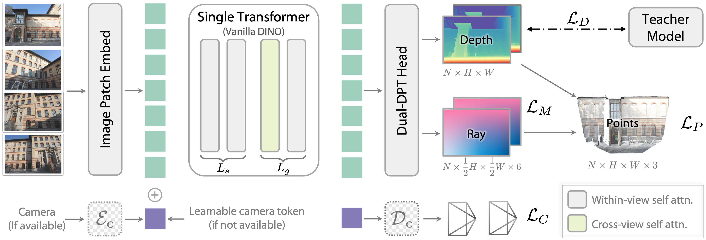
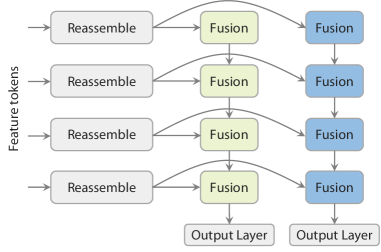
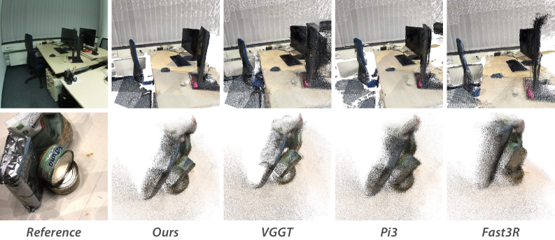
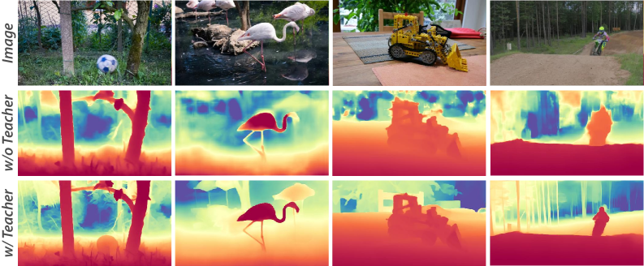

# Depth Anything 3：Recovering the Visual Space from Any Views

## 结论先行

- **一句话定位**：Depth Anything 3（DA3）把 Depth Anything 系列从单目深度扩展成任意视角视觉几何基础模型；输入可以是一张图、多张图或视频帧，并可选输入相机位姿，输出一致的 depth、ray/camera、点云和 3DGS/NVS 相关结果。
- **核心方法**：论文的关键是“少做任务头，做好几何表示”：用单个 DINOv2 风格 plain transformer + input-adaptive cross-view attention + dual-DPT head，同时预测 depth 与 per-pixel ray map；ray map 隐式表达 camera pose，避免显式旋转矩阵约束和多任务冗余。两张 map 逐像素组合即得世界坐标点云。
- **实验结论**：论文报告 DA3-Giant 在 5 个 visual geometry benchmark 上多数 pose / reconstruction 指标超过 VGGT、Pi3、MapAnything、Fast3R、DUSt3R；DA3-Large 仅约 0.36B 参数，也能在多项指标超过 1.19B 的 VGGT。关于相对 VGGT 的平均提升，摘要存在两个版本：arXiv 摘要页（/abs）写 pose 平均提升 44.3%、geometric 25.1%，而 HTML/PDF 摘要写 35.7% / 23.6%；正文（Table 3 附近）明确写 reconstruction 平均相对 VGGT 提升 25.1%、相对 Pi3 提升 21.5%。本笔记以正文可核对的 25.1% 作为 reconstruction 主数字，pose 平均提升因两版本不一致标为“待核验”。
- **开源状态**：GitHub 仓库公开，代码 Apache-2.0，提供 Python package、CLI/API、Gradio、benchmark evaluator、DA3-Streaming 推理管线和 HuggingFace 权重；但仓库未发现训练脚本 / 训练 recipe，因此按本仓库约定 `training_open_source` 记为 `\`。
- **复现优先级**：值得先做 inference + benchmark sanity check，尤其是 DA3-LARGE/BASE 与 VGGT/MapAnything 在本地多视图 / 行车片段上的 pose/depth/point-cloud 质量；不建议把“完整训练复现”作为近期目标，因为训练 DA3-Giant 需 128 H100 约 10 天，且训练代码未公开。
- **工程风险**：大模型权重许可证并不都宽松，Giant/Large/Nested 系列权重为 CC BY-NC 4.0；只有 Base/Small/Metric/Mono 权重在 README model card 中标为 Apache 2.0。商业或闭源使用不能只看代码许可证。

## 1. 这篇论文解决什么问题？

### 已确认的论文事实

- **问题定义**：从任意数量视觉输入中恢复一致的 3D visual space，覆盖单图、多视图集合、视频输入，并支持已知或未知相机位姿。
- **输入 / 输出**：输入为 $N$ 张 RGB 图像，可选相机内参 / 外参；输出为每张图的 dense depth map、dense ray map，并可从 ray map 推出 camera pose，进一步融合为 point cloud 或用于 feed-forward 3D Gaussian / novel view synthesis。
- **目标场景**：通用 3D perception、robotics、mixed reality、visual geometry estimation、monocular / multi-view depth、pose estimation、feed-forward NVS。
- **与现有方法差异**：VGGT / DUSt3R 系方法常用 point map、显式 camera head 或多阶段 / 冗余任务组合；DA3 主张用 depth + ray 作为最小充分目标，并尽量复用完整预训练 plain transformer。

### 我的理解

DA3 的价值不在于“发明了一个复杂 3D 模块”，而是把多视图几何问题压回到两个 dense prediction target：

- depth 决定每个像素沿相机射线走多远；
- ray map 决定每个像素在世界坐标系里的射线原点和方向；
- 两者逐像素组合即可得到世界坐标点。

这样做的好处是任务接口统一：单目、多视图、posed / unposed、点云融合、3DGS 都可以从同一套几何输出延展，避免了 VGGT 那种“depth head + point head + camera head 各自训练、彼此冗余”的结构负担。

## 2. 方法概览

- **核心想法**：不堆专用几何模块，而是把“任意视角几何恢复”重新表述成两张逐像素 dense map（depth + ray）的联合回归，用一个完整预训练的 plain ViT 作为骨干，让预训练视觉先验直接迁移到几何任务。
- **一句话 pipeline**： $N$ 张图 → patch embed → 单 plain transformer（层间交替 within-view / cross-view self-attention）→ dual-DPT head → per-view depth map + 半分辨率 ray map → 逐像素 unproject 成统一世界坐标点云 / camera pose / 3DGS。

### 2.1 架构解析

**模块分解与数据流**（自左向右）：

| 模块 | 作用 | 论文中的关键信息 |
|---|---|---|
| Image Patch Embed | 把 $N$ 张 RGB 切成 patch token | 所有视角共享同一 embed；不同视角 token 拼在同一序列里 |
| Plain ViT backbone（Vanilla DINO） | 复用预训练视觉特征做几何推理 | 单个 DINOv2 风格 ViT；避免 VGGT 式多 transformer 堆叠 |
| Input-adaptive cross-view attention | 任意视角数量的信息交换 | 前 $L_s$ 层做 within-view attention，后续 $L_g$ 层交替 cross-view / within-view，默认比例 $L_s : L_g = 2 : 1$ ，靠 token rearrangement 实现，无需新增参数 |
| Camera condition token | 兼容 posed / unposed 输入 | 有相机参数时由编码器 $\mathcal{E}_c$ （MLP）编码成 camera token 加到序列；无参数时用 learnable token |
| Dual-DPT head | 联合输出 depth 和 ray | 共享 reassembly modules，depth / ray 分支用不同 fusion layers；depth 出 $N \times H \times W$ ，ray 出半分辨率 $N \times \tfrac{1}{2}H \times \tfrac{1}{2}W \times 6$ |
| Optional camera head $\mathcal{D}_c$ | 快速输出 camera params | 从 camera token 解码 FOV、quaternion、translation（图中右下角相机 frustum）；论文称额外计算约为主 backbone 的 0.1% |

**模型规模谱（论文给出的参数量）**：DA3 提供四档，从边缘部署到 SOTA 逐级放大，全部共享同一 depth-ray + plain-transformer 设计，只换 backbone 尺寸：

| 档位 | 参数量 | 定位 |
|---|---|---|
| DA3-Small | 约 0.03B | 极轻量 / 边缘推理 |
| DA3-Base | 约 0.11B | 工程默认起点（Apache-2.0 权重） |
| DA3-Large | 约 0.36B | 性价比首选，多项指标已超 1.19B 的 VGGT |
| DA3-Giant | 约 1.10B | 最强档，全面刷 benchmark |

作为对照，VGGT 约 1.19B、Pi3 约 0.96B、MapAnything 约 0.56B。DA3-Large 用不到 VGGT 三分之一的参数就在 10 个 reconstruction setting 里有 5 个反超，是“参数效率”这一卖点的核心论据。论文正文把 backbone 抽象成“一个有 $L$ 个 block 的 ViT，在大规模单目图像上预训练（如 DINOv2）”，但未逐档给出对应的 ViT-S/B/L/g 映射，此处仅按参数量对齐直觉。

**关键设计选择及理由**：

- **单 plain transformer 而非多分支**：DA3 把 cross-view 交互塞进 backbone 内部的 attention（靠 token 重排），而不是像 VGGT 那样外挂 alternating-attention 模块。这样 backbone 可以整段加载 DINOv2 预训练权重，几何能力“长”在预训练视觉表示上。具体地，把前 $L_s$ 层设为纯 within-view self-attention（每张图内部聚合），后 $L_g$ 层交替 cross-view / within-view，默认 $L_s : L_g = 2 : 1$ ；cross-view 那一步不新增任何参数，只是把 $N$ 张图的 token 从「按图分组」重排成「跨图共处一个序列」再做标准 self-attention，做完再排回去——这就是「input-adaptive」的含义：序列长度随输入视角数自适应，1 张图时 cross-view 自然退化为 within-view。
- **depth + ray 双输出而非 point map**：point map 把“相机几何”和“场景深度”耦合进一个 3D 向量里，梯度互相干扰；depth + ray 把两者解耦——ray 只负责相机侧（原点 + 方向），depth 只负责沿射线的距离，几何含义清晰且可分别监督。
- **ray map 半分辨率**：相机几何在空间上是低频信号（同一相机的射线场平滑），半分辨率足够表达且省算力，而 depth 保留全分辨率以保住细节。

关于 dual-DPT head 的一个易忽略细节（Fig. 3）：depth 分支与 ray 分支**共享 reassembly modules**，只在 fusion 阶段分叉。消融（Table 6 附近）显示，若把两分支做成完全独立的 DPT head，指标反而下降。直觉是 depth 和 ray 必须在同一组多尺度特征上“看同一个世界”，共享 reassembly 保证二者的几何基底一致，公式 (3) 的逐像素组合才不会因两分支各自漂移而失配。

### 2.2 核心原理

- **为什么这样设计 work**：论文实验（Table 7）显示，用同参数量的 VGGT-style 多阶段架构替换 DA3 的单 plain transformer，性能掉到约 79.8%。这说明在 any-view geometry 上，**预训练完整性比架构复杂度更重要**——一个能整段继承 DINOv2 权重的朴素 ViT，比把预训练破坏掉再堆更多未初始化 block 更强。
- **关键机制 / 归纳偏置**：
  - *Input-adaptive attention* 让同一套权重自然处理 1 到 N 张图：单图时 cross-view 退化为 within-view，多图时通过 token 重排实现视角间信息流，无需为不同视角数训练不同模型。
  - *depth-ray 分解* 是核心归纳偏置：它假设“世界点 = 相机射线 + 沿射线深度”，把 9-DoF 全局相机位姿分摊成每像素对齐的 dense ray，位姿估计因此变成一个良态的 dense regression，而非病态的全局参数拟合。
- **与前作的本质区别**：DUSt3R / VGGT 输出 point map 并显式回归 camera；DA3 不直接回归全局位姿，而是回归 ray map，再由 ray map 通过闭式几何（求相机中心、homography、RQ 分解）反推 intrinsics/rotation。位姿从“网络硬记的参数”变成“从 dense 几何解出来的量”，泛化更稳。

### 2.3 关键公式解析

理解 DA3 只需抓住一条主线：**世界点 = 相机射线原点 + 沿射线方向走深度**。下面 5 个公式（均按 HTML 正文逐句核对）把这条主线从“经典做法”一步步推进到 DA3 的“逐像素 dense 表示”，再反推相机参数与训练损失。

**公式 (1)：经典逐像素 unproject（相机系 → 世界系），即 DA3 想绕开的写法**

$$P = R_i \left( D_i(u,v) \cdot K_i^{-1} p \right) + t_i$$

- 符号： $p = (u, v, 1)^\top$ 为像素齐次坐标； $K_i^{-1}$ 把像素反投影到归一化相机射线； $D_i(u,v)$ 为该像素深度； $R_i, t_i$ 为第 $i$ 张图的旋转与平移。
- 作用：传统 multi-view 几何要先显式拿到 $K_i, R_i, t_i$ 才能算世界点 $P$ ，位姿是需要网络硬回归或后端优化求解的**全局参数**。DUSt3R/VGGT 的 camera head 走的就是这条路。DA3 的目标是把这些全局量“摊”到每个像素上，消掉显式位姿变量。

**公式 (2)：per-pixel 相机射线定义（ray map 的物理含义）**

$$r = (t, d) \in \mathbb{R}^6, \qquad d = R K^{-1} p$$

- 符号：每个像素 $p$ 对应一条相机射线 $r$ ，由原点 $t \in \mathbb{R}^3$ （相机中心）与方向 $d \in \mathbb{R}^3$ 组成，共 6 个通道；方向 $d$ 是把像素反投影到相机系再用 $R$ 旋到世界系得到的。
- 作用：这 6 个通道逐像素堆起来就是 ray map $M \in \mathbb{R}^{H \times W \times 6}$ 。注意 $d = R K^{-1} p$ 已经把公式 (1) 里的 $R_i$ 和 $K_i^{-1} p$ **打包进方向向量**——相机的旋转与内参不再是需要单独输出的量，而是隐含在 dense 的方向场里。

**公式 (3)：depth-ray 世界点（DA3 的核心简化）**

$$P = t + D(u,v) \cdot d$$

- 符号： $t, d$ 即 ray map 的 6 通道， $D(u,v)$ 仍是标量深度。
- 作用：对比公式 (1)，全局 $R_i, t_i, K_i$ 全部被吸收进 per-pixel 的 $(t, d)$ 。网络只需逐像素回归 $(t, d, D)$ ，世界点就是一次逐元素加乘运算，无需任何全局矩阵求逆或位姿拟合。这就是 DA3 能用**同一套 dense 输出**同时服务单目、多视图、posed/unposed、点云、3DGS 的根源：所有下游任务都从 $(D, M)$ 这两张图派生。

**公式 (4)：从 ray map 闭式反推相机参数（相机中心 + homography DLT）**

$$t_c = \frac{1}{H \times W} \sum_{h,w} M(h, w, 0{:}3), \qquad H^\ast = \arg\min_{\lVert H \rVert = 1} \sum_{h,w} \left\lVert H\, p_{h,w} \times M(h,w,3{:}) \right\rVert$$

- 符号：相机中心 $t_c$ 直接取 ray map 前 3 通道（各像素原点）的均值； $M(h,w,3{:})$ 取方向分量 $d$ ； $p_{h,w}$ 为像素坐标； $H$ 为待求单应，约束 $\lVert H \rVert = 1$ 避免平凡零解； $\times$ 为叉积，度量“预测方向 $d$ 与 $H p$ 所隐含方向”的对齐残差。
- 作用：用 Direct Linear Transform 从整幅 ray map 最小二乘解出 $H = K R$ ，再对 $H$ 做 RQ 分解得到 intrinsics $K$ 与 rotation $R$ 。这说明**位姿是从 dense 几何“解”出来的量，而非网络硬记的参数**——即使不挂 camera head 也能拿到相机参数，camera head 只是把这步 DLT 换成一次前向、加速推理的旁路（额外算力约主 backbone 的 0.1%）。

**公式 (5)：训练总损失（已按正文核对，权重 $\alpha = \beta = 1$ ）**

$$\mathcal{L} = \mathcal{L}_D(\hat{D}, D) + \mathcal{L}_M(\hat{R}, M) + \mathcal{L}_P(\hat{D} \odot d + t,\, P) + \beta\, \mathcal{L}_C(\hat{c}, v) + \alpha\, \mathcal{L}_{\text{grad}}(\hat{D}, D)$$

其中深度项与梯度项分别为：

$$\mathcal{L}_D(\hat{D}, D; D_c) = \frac{1}{Z_\Omega} \sum_{p \in \Omega} m_p \left( D_{c,p} \lvert \hat{D}_p - D_p \rvert - \lambda_c \log D_{c,p} \right)$$

$$\mathcal{L}_{\text{grad}}(\hat{D}, D) = \lVert \nabla_x \hat{D} - \nabla_x D \rVert_1 + \lVert \nabla_y \hat{D} - \nabla_y D \rVert_1$$

- 符号： $\mathcal{L}_D$ 是 confidence 加权的深度 L1—— $D_{c,p}$ 是网络预测的逐像素置信度，越高则该像素 L1 权重越大，同时 $-\lambda_c \log D_{c,p}$ 项惩罚过度自信， $m_p$ 为有效像素 mask， $Z_\Omega$ 为归一化常数； $\mathcal{L}_M$ 是 ray map 回归损失； $\mathcal{L}_P$ 是把 $\hat{D} \odot d + t$ 组合出的 3D 点与真值 $P$ 的一致性损失（正是公式 (3) 的可微版本）； $\mathcal{L}_C$ 为可选的 camera（quaternion + translation）损失； $\mathcal{L}_{\text{grad}}$ 为水平/垂直有限差分梯度正则，保住深度边缘。正文给出 $\alpha = 1$ 、 $\beta = 1$ 。
- 作用： $\mathcal{L}_P$ 是 depth 与 ray“对齐”的关键监督——它强迫 $(\hat{D}, \hat{R})$ 组合出的世界点自洽，而不是让 depth 分支和 ray 分支各自独立收敛。confidence 加权让稀疏/噪声真值下模型能自动降低不可靠像素的权重，与 teacher-student pseudo-label 配合，是 real-world 数据训练稳定的核心。（ $\lambda_c$ 及 $\mathcal{L}_M / \mathcal{L}_P / \mathcal{L}_C$ 内部权重的精确数值正文未逐一给出，标为待核验。）

### 2.4 训练与推理细节

已确认的论文事实：

- **训练目标**：总损失见公式 (5)，由 depth（confidence 加权 L1） + ray 回归 + point 一致性 + 可选 camera + gradient 正则五项组成，梯度项与 camera 项权重 $\alpha = \beta = 1$ 。
- **规模与算力**：DA3-Giant 使用 128 H100 GPU、200k steps（含 8k warmup）、约 10 天；peak lr $2 \times 10^{-4}$ 。
- **多分辨率**：基础分辨率 504，训练混合 504×504、504×378、504×336、504×280、336×504、896×504、756×504、672×504 等长宽比；batch size 动态调整以维持 token 数恒定。
- **视角采样**：504×504 时每图 view 数从 $[2, 18]$ 均匀采样，让模型天然适配任意视角数——这与 input-adaptive attention（ $L_s : L_g = 2 : 1$ ）配合，使同一套权重覆盖 1 到 N 张图。
- **teacher-student**：真实 depth 常稀疏 / 有噪；先训一个只用合成数据（Hypersim、TartanAir、IRS、vKITTI2、BlendedMVS 等，覆盖 indoor/outdoor/object-centric/in-the-wild）的单目 relative-depth teacher，teacher 用 exponential depth（而非 disparity）以增强近处判别，并带 distance-weighted surface-normal loss、sky/object mask、global-local ROE 对齐；再用 RANSAC scale-shift 把 teacher 伪深度对齐到真实稀疏 / 噪声测量。
- **尺度对齐公式**：设 teacher 相对深度 $\tilde{D}$ 、可用稀疏深度 $D$ ，用 RANSAC 最小二乘估计 scale $s$ 与 shift $t$ ： $(\hat{s}, \hat{t}) = \arg\min_{s>0, t} \sum_{p \in \Omega} m_p (s \tilde{D}_p + t - D_p)^2$ ，对齐后的伪标签 $D^{(T \to M)} = \hat{s}\, \tilde{D} + \hat{t}$ 提供 scale-consistent 且 pose–depth 一致的监督。
- **监督切换**：训练前 120k steps 用 ground-truth depth 监督，之后切换到 teacher 伪标签；pose conditioning 以 0.2 概率随机启用，使模型既能 posed 也能 unposed 推理。
- **数据来源**：700k+ 场景，混合 synthetic、LiDAR、3D reconstruction、COLMAP 多来源（含 Objaverse ~505k、Trellis ~557k、AriaSyntheticENV ~99k 等）。

**推理流程**：图像 patch embed → plain transformer（交替 attention）→ dual-DPT 出 depth + ray → 若需位姿，走 camera head 或从 ray map 闭式解 → 逐像素 unproject 融合成点云；接 GS-DPT head 可 feed-forward 出 3D Gaussian 做 NVS。

我的判断：

- 这套 recipe 的关键不是“数据全公开就容易复现”，而是 pseudo-label 生成与数据清洗很关键。论文附录披露了部分合成数据清洗规则，但公开仓库没有训练脚本，无法确认完整训练 pipeline。
- teacher-student 解决的是 real-world depth quality 问题：用 synthetic teacher 保留细节，再用真实 sparse/noisy depth 对齐尺度和几何。

## 3. 关键贡献

1. **depth + ray 最小几何目标**：相比 depth + point cloud + camera 或 depth + camera，depth + ray 在多数据集 pose/reconstruction ablation 中更强，且概念更统一。
2. **plain transformer 作为 any-view geometry backbone**：证明不一定需要 VGGT 那样的多阶段专用架构；完整预训练的单 transformer 比同参数量的 VGGT-style 堆叠更有效（Table 7 掉到 79.8%）。
3. **统一覆盖单目、多视图、posed/unposed、3DGS/NVS**：主模型支持多种视觉几何任务，额外 GS-DPT head 可用于 feed-forward 3DGS。
4. **Visual Geometry Benchmark**：提出覆盖 pose、reconstruction、visual rendering 的 benchmark；仓库已发布 evaluator 和 DA3-BENCH 预处理数据。
5. **完整工程接口**：公开 repo 提供 package、CLI、API、Gradio、benchmark evaluator、多格式导出和 DA3-Streaming 推理管线，适合做 inference-level 复现。

## 4. 实验与证据

| 维度 | 内容 |
|---|---|
| Pose / geometry benchmark | HiRoom、ETH3D、DTU、7Scenes、ScanNet++；覆盖 object、indoor、outdoor 场景 |
| NVS benchmark | DL3DV 140 scenes、Tanks and Temples 6 scenes、MegaDepth 19 scenes；每场景约 300 sampled frames，12 context views |
| Baseline | DUSt3R、Fast3R、MapAnything、Pi3、VGGT；NVS 对比 pixelSplat、MVSplat、DepthSplat，以及替换 Fast3R / MV-DUSt3R / VGGT / DA3 backbone 的统一 3DGS 框架 |
| Pose 指标 | AUC@3、AUC@30，基于 relative rotation / translation accuracy |
| Reconstruction 指标 | F1-score；DTU 用 Chamfer Distance / Overall |
| Monocular depth 指标 | delta1、AbsRel、SqRel |
| NVS 指标 | PSNR、SSIM、LPIPS |
| Efficiency | 最大输入图片数、参数量、A100 FPS |

### 4.1 效果与性能解析

**Pose estimation 具体数字（Table 2，AUC@3 / AUC@30，越高越好）**：DA3-Giant 在 5 个数据集上几乎全面领先，且在最严格的 AUC@3（3° 阈值）上优势最大：

| 数据集 | DA3-Giant | VGGT (1.19B) | Pi3 (0.96B) | MapAnything (0.56B) |
|---|---|---|---|---|
| HiRoom | **80.3** / 95.9 | 49.1 / 88.0 | 67.0 / 94.8 | 17.9 / 82.8 |
| ETH3D | **48.4** / 91.2 | 26.3 / 80.8 | 35.2 / 87.3 | 19.2 / 77.4 |
| DTU | **94.1** / 99.4 | 79.2 / 99.8 | 62.5 / 94.9 | 6.5 / 72.7 |
| 7Scenes | **28.5** / 86.8 | 23.9 / 85.0 | 25.5 / 86.3 | 12.6 / 79.7 |
| ScanNet++ | **85.0** / 98.1 | 62.6 / 95.1 | 50.7 / 92.1 | 20.2 / 84.1 |

（数值经 WebFetch 从 HTML 表格抽取，正式引用建议比对 PDF。）读法：AUC@3 是「累计到 3° 的位姿误差曲线下面积」，对小误差高度敏感；DA3 在 HiRoom（49.1→80.3）、ScanNet++（62.6→85.0）这类复杂室内场景相对 VGGT 有约 30+ 个百分点绝对增益，这正是「ray map 把病态全局位姿拟合改成良态 dense 回归」在难场景上的兑现。AUC@30 大家都逼近饱和（85–99），区分度主要落在 AUC@3。

**Reconstruction 具体数字（Table 3，F1 越高越好 / DTU Chamfer 越低越好，pose-free 设置）**：

| 数据集 | DA3-Giant F1（pose-free / posed） | VGGT F1（pose-free） |
|---|---|---|
| HiRoom | 85.1 / 95.6 | 56.7 |
| ETH3D | 79.0 / 87.1 | 57.2 |
| 7Scenes | 53.5 / 56.5 | — |
| ScanNet++ | 77.0 / 79.3 | 66.4 |
| DTU（Chamfer mm↓） | 1.85 | — |

正文据此给出 reconstruction 平均相对 VGGT 提升 25.1%、相对 Pi3 提升 21.5%。有了 GT pose（posed 列）后 F1 进一步跳升（HiRoom 85.1→95.6），说明 pose conditioning 是实打实的额外信息而非摆设。Fig. 5 目视上 DA3 点云更规整、飘点更少，与 F1 数字一致。

| 结果 | 论文证据 | 解读 |
|---|---|---|
| DA3-Giant pose 几乎全面领先 | Table 2 中 DA3-Giant 在 HiRoom/ETH3D/DTU/7Scenes/ScanNet++ 的 AUC3/AUC30 多数第一；正文称 AUC3 相对所有对手至少 8% 相对提升，ScanNet++ 相对次优约 33% 相对增益 | pose-free camera estimation 是 DA3 强项，尤其复杂室内 ScanNet++ |
| reconstruction 全面强于 VGGT/Pi3 | Table 3 中 DA3-Giant 在 5 个 pose-free 设置全领先；正文称平均相对 VGGT 提升 25.1%、相对 Pi3 提升 21.5% | depth+ray 输出能直接转成更干净点云（Fig. 5 目视也更完整少飘点） |
| DA3-Large 性价比高 | 约 0.36B 参数，论文称在 10 个 reconstruction settings 中 5 个超过 1.19B VGGT | 工程上优先试 DA3-LARGE/BASE，而非直接上 Giant |
| 单目深度超过 DA2/VGGT | Table 4 中 DA3 rank 2.20、DA2 2.60、VGGT 3.75；teacher rank 1.00（KITTI/NYU/SINTEL/ETH3D/DIODE 平均排名） | 多视图能力没有牺牲单目 depth，仍继承 Depth Anything 系优势 |
| NVS backbone 最强 | Table 5 中 DAv3 作 3DGS backbone 在 DL3DV（PSNR 21.33 vs VGGT 20.96、SSIM 0.711 vs 0.697、LPIPS 0.241 vs 0.253）/T&T/MegaDepth 均优于 VGGT backbone | 几何 backbone 质量直接转化为 feed-forward rendering 质量 |
| depth + ray ablation 强 | Table 6 中 depth+ray（HiRoom AUC3 48.7 / F1 60.3）明显强于 depth + pcd + cam（HiRoom AUC3 仅 9.1 / F1 12.8）；正文称 AUC3 相对 depth + cam 接近翻倍 | depth-ray 是核心方法，不是装饰性 head |
| 单 plain transformer > VGGT-style | Table 7 中 VGGT-style 同参数掉到约 79.8% | 预训练完整性比堆更多未预训练 block 更重要 |

**速度 / 显存 / 参数量**（Table 8，A100）：DA3-Giant 单卡最多约 900–1000 张图、37.6 FPS；DA3-Large 约 1500–1600 张图、78.37 FPS；VGGT reference 约 400–500 张图、34.1 FPS。DA3 在“最大可处理视角数”和吞吐上都优于 VGGT，说明单 plain transformer + 半分辨率 ray 不仅精度好，显存和长序列扩展性也更友好。（表内具体数值来自 WebFetch 抽取，若做正式引用建议复跑或比对 PDF 表格。）

**消融揭示的关键因素**：

- **Depth-ray representation**：depth + ray 是最小充分组合；额外加显式 cam head 主要是推理便利，精度不一定继续提升。
- **Dual-DPT head**：两个完全独立 DPT head 会降指标；共享 reassembly 再分支融合更好，印证 depth 与 ray 需要“相互对齐”而非各管各的。
- **Teacher labels**：对 HiRoom、7Scenes、ScanNet++ 等细节 / 真实场景有明显收益；DTU 上去掉 teacher 有时略好，说明 teacher supervision 并非对所有数据集单调改善。
- **Pose conditioning**：有 GT pose 时，pose condition 明显提升 posed reconstruction。
- **Data / teacher design**：V3 datasets + 多分辨率策略、depth target、完整 teacher loss 均优于替代设置。

**可比性与协议一致性**：DA3 自建 Visual Geometry Benchmark 并统一了各 baseline 的评测协议（同一批 sampled frames / context views、同一 evaluator），横向数字可比性较好；但 NVS 部分是把不同 backbone 接进同一 3DGS 框架比较，衡量的是“几何 backbone 对 rendering 的贡献”而非各方法原生 NVS 能力，解读时需注意这一口径差异。

## 5. 局限与风险

### 论文明确承认或可见的限制

- 未来工作包括 dynamic scenes、language / interaction cues、更大规模预训练；说明当前模型主要还是静态 / 准静态视觉几何。
- Feed-forward NVS 仍需额外 GS-DPT head fine-tune；不是通用 4D 动态世界模型。
- 完整 DA3-Giant 训练成本很高：128 H100 约 10 天。

### 已确认的代码 / 仓库事实

- GitHub repo 公开，代码 Apache-2.0，默认分支 `main`。
- 仓库包含 `src/depth_anything_3/model/`、`api.py`、CLI、Gradio app、benchmark evaluator、docs、configs、DA3-Streaming。
- 仓库含 `src/depth_anything_3/bench/evaluator.py` 与 `docs/BENCHMARK.md`，可下载 `depth-anything/DA3-BENCH` 跑 pose/reconstruction evaluation。
- 仓库未发现 `train.py`、training scripts、optimizer/scheduler recipe 或 dataset preprocessing pipeline；公开内容主要是 inference、API/CLI、benchmark evaluation、model definitions 和 streaming inference。

### 我推断的风险

- **训练不可复刻风险高**：即使 raw datasets 全是公开 academic datasets，缺训练脚本、teacher pseudo-label 生成代码和完整清洗流程，论文主结果无法端到端复现。
- **许可证风险**：代码 Apache-2.0 不等于所有权重可商用；Giant/Large/Nested 权重为 CC BY-NC 4.0，商业闭环应优先看 DA3-BASE/SMALL/METRIC/MONO 或重新训练。
- **动态场景风险**：自动驾驶 / 机器人场景里移动物体、遮挡、rolling shutter、曝光变化会影响点云和 pose；需要 mask、dynamic filtering 或后端优化。
- **metric scale 风险**：DA3Nested/Metric 提供 metric 路径，但 image-only 任意视角几何仍不应直接替代带 LiDAR/IMU/pose 的 metric pipeline。
- **benchmark 依赖重**：DA3-BENCH 数据约 40GB 量级，full evaluation 需多 GPU / 较大显存才合理。

### Unknowns / to verify

- 摘要 pose 平均提升数字在两个官方来源不一致：arXiv 摘要页（/abs）显示 44.3%（geometric 25.1%），HTML/PDF 摘要显示 35.7%（geometric 23.6%）；正文可核对的 reconstruction 平均提升为 25.1%。pose 的“平均”口径待官方勘误或复跑确认，本笔记暂以正文数字为准。
- 损失函数 (5) 已按 HTML 正文核对：五项（depth 带 confidence、ray、point、camera、grad）与总式形态确认，梯度/相机项权重 $\alpha = \beta = 1$ 亦确认；仍待核验的是 depth confidence 项内的 $\lambda_c$ 以及 $\mathcal{L}_M / \mathcal{L}_P / \mathcal{L}_C$ 各自内部的标定权重，正文未逐一列出。
- 公式 (1)–(5) 的写法已核对 HTML 正文与图注（ray 定义 $r=(t,d)$ 、 $d = R K^{-1} p$ 、world point $P = t + D(u,v) \cdot d$ 、camera-center 均值、homography DLT、总损失），但未逐字节比对 PDF LaTeX 源，个别下标 / 通道切片记法（如 $M(h,w,0{:}3)$ 与 $M(h,w,3{:})$ 的索引约定）可能与原文排版略有出入。
- DA3-Streaming 是仓库后续发布的长视频推理管线，基于 VGGT-Long 思路；不是论文主训练方法的一部分，需单独做工程验证。
- HuggingFace 上部分模型卡带 `-1.1` 后缀，README 称修复 training bug 后应优先使用；这些权重对应的论文表格数值是否完全一致，需官方说明或复跑确认。
- 方法谱系 slug 已校验本仓库实际文件名：VGGT=`2025-vggt`、DUSt3R=`2023-dust3r`、DINOv2 在 `vision-foundation-models/2023-dinov2.md`；Depth Anything 2 仓库暂无独立分析（仅文字提及）。

## 方法谱系

- 基于（backbone / 表示先验）：[DINOv2](../vision-foundation-models/2023-dinov2.md)（plain ViT 预训练权重直接迁移）、Depth Anything 2（单目 depth 泛化与 teacher 思路；仓库暂无独立分析）。
- 对标 / 改进（同代 any-view geometry）：[VGGT](../3d-reconstruction/2025-vggt.md)（DA3 用单 plain transformer + depth-ray 取代其多阶段架构与 point map）、[DUSt3R](../3d-reconstruction/2023-dust3r.md)（DA3 用 ray map 替代 point map 的显式位姿回归）。

> 谱系链接为方向内相对路径，若目标文件 slug 与此处不一致以 `indices/methods.md` 为准。

## 6. 与相似方法对比

| Method | 相同点 | 不同点 | 何时选它 |
|---|---|---|---|
| VGGT | 都是任意视角视觉几何 foundation model，输出 pose/depth/3D geometry | DA3 用单 plain transformer + depth-ray；VGGT 架构更复杂、输出 point map，DA3 在多项 pose/reconstruction 指标超过它 | 需要成熟 baseline 或复现 VGGT 生态选 VGGT；追求更强 any-view geometry 和更简接口优先 DA3 |
| Pi3 | 都做 feed-forward visual geometry，支持无序 / 多视图几何 | Pi3 更强调 permutation-equivariant、affine/scale-invariant camera；DA3 更强调 depth-ray 和预训练 DINO backbone | 研究 unordered/scale-invariant formulation 选 Pi3；要工程可用模型和 benchmark pipeline 选 DA3 |
| MapAnything | 都是 feed-forward 多视图几何模型，可利用相机 /pose/depth 类信息 | MapAnything 更强调 metric reconstruction 和任意几何 constraints/prompt；DA3 更强调最小 depth-ray target 和 Depth Anything 系 depth 泛化 | 自动驾驶已有标定 /pose/LiDAR depth prompt 时 MapAnything 更像主 metric backbone；纯视觉 any-view geometry / 3DGS/NVS backbone 优先 DA3 |
| LingBot-Map | 都输出 pose/depth/point cloud，服务机器人 / 自动驾驶视觉建图 | LingBot-Map 是 causal streaming 架构；DA3 本体是任意视角全局 feed-forward，repo 另有 DA3-Streaming 推理管线 | 在线长视频 VO / 建图优先 LingBot-Map 或 DA3-Streaming；离线多视图 / posed-unposed 统一推理优先 DA3 |
| Depth Anything 2 | 都来自 Depth Anything 系列，单目 depth 泛化强 | DA2 主要是单目相对 / metric depth；DA3 扩到多视图、pose、ray、3DGS | 只做单图 depth 且需轻量生态用 DA2；需要多视图一致性和相机 / 点云输出选 DA3 |

更详细的同类横向对比见：[`../../comparisons/3d-reconstruction/visual-geometry-foundation-models.md`](../../comparisons/3d-reconstruction/visual-geometry-foundation-models.md)。

## 7. 复现判断

- Git 地址：<https://github.com/ByteDance-Seed/Depth-Anything-3>
- 是否开源：是。代码仓库公开，GitHub 页面与 `pyproject.toml` 均显示 Apache-2.0。
- 是否开源训练：`\`。公开仓库主要提供 inference/API/CLI/app/benchmark/model code，未发现训练代码。
- 权重可用性：HuggingFace model zoo 提供 DA3NESTED-GIANT-LARGE、DA3-GIANT、DA3-LARGE、DA3-BASE、DA3-SMALL、DA3METRIC-LARGE、DA3MONO-LARGE 等；README 建议优先用 `-1.1` refreshed checkpoints（对 Giant/Large/Nested）。
- 权重许可证：Giant/Large/Nested 为 CC BY-NC 4.0；Base/Small/Metric/Mono 为 Apache 2.0。
- 数据可获得性：论文称训练使用公开 academic datasets；仓库发布 processed benchmark `depth-anything/DA3-BENCH`，但训练数据清洗 / teacher label 生成 pipeline 未开源。
- 预计环境成本：基础推理需 Python 3.9–3.13、PyTorch >=2、xformers、Open3D、pycolmap 等；3DGS 需 `gsplat`；benchmark 数据约 40GB，full eval 建议多 GPU。
- 最小复现路径：
  1. 安装 `pip install -e .`，先用 `DA3-BASE` 或 `DA3-LARGE-1.1` 跑 `assets/examples/SOH`。
  2. 导出 `glb` / `npz` / depth images，检查 pose、intrinsics、depth、confidence shape 和点云质量。
  3. 下载 `depth-anything/DA3-BENCH` 中的 HiRoom 或 7Scenes 子集，跑 `python -m depth_anything_3.bench.evaluator model.path=... eval.datasets=[hiroom] eval.modes=[pose]`。
  4. 与 VGGT/MapAnything 在同一小场景上做 qualitative + AUC/F1 sanity check。
- 是否值得复现：值得做 inference-level 和 benchmark-level 复现；完整训练暂不现实。

## 8. 后续动作

- [x] 更新 `indices/papers.md`
- [x] 更新 `indices/directions.md`
- [x] 更新 `indices/methods.md`
- [x] 创建 `comparisons/3d-reconstruction/visual-geometry-foundation-models.md`
- [ ] 若后续做复现，创建 `reproductions/3d-reconstruction/depth-anything-3/README.md`

## Sources

- Paper: <https://arxiv.org/abs/2511.10647>
- HTML: <https://arxiv.org/html/2511.10647>
- PDF: <https://arxiv.org/pdf/2511.10647>
- Hugging Face paper metadata: <https://huggingface.co/papers/2511.10647>
- GitHub: <https://github.com/ByteDance-Seed/Depth-Anything-3>
- Project page: <https://depth-anything-3.github.io/>
- Benchmark dataset: <https://huggingface.co/datasets/depth-anything/DA3-BENCH>
