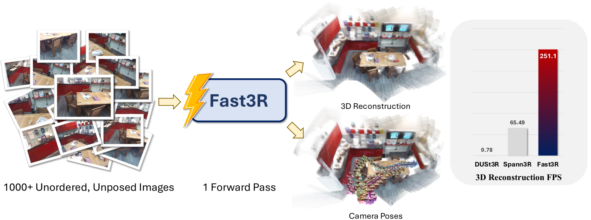
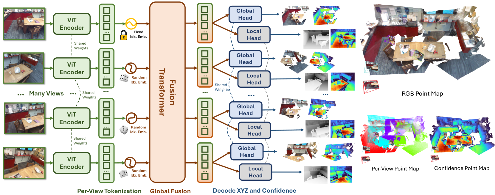

# Fast3R：一次前向重建 1000+ 张图像

## 结论先行

- Fast3R 把 DUSt3R「成对处理 + 全局对齐优化」的两段式范式，压成「N 张图并行进一个融合 Transformer，一次前向直接吐出全局对齐点图」的单段式范式，从而突破了 DUSt3R 帧数扩展的根本瓶颈（证据：论文标题与 §3 架构，已联网核实）。
- 可扩展性是核心卖点：单张 A100 上 Fast3R 能一次前向处理到 1500 张图，而 DUSt3R 超过 32 张就 OOM；1000 张耗时约 137.6s、显存约 63.0 GiB（证据：论文 Table 效率表，1000 views 137.62s / 63.01 GiB，DUSt3R 在 48 views 即 OOM，已核实）。
- 精度不靠优化也很强：CO3Dv2 相机位姿 RRA@15 达 99.7%（DUSt3R 96.2%、MASt3R 94.6%），mAA(30) 82.5%（DUSt3R 76.7%）；官方称位姿误差相对带全局对齐的 DUSt3R 减少约 14 倍（证据：论文 Table + 项目页，已核实）。
- 速度是数量级差异：CO3Dv2 位姿评测下 Fast3R 约 251.1 FPS，而 DUSt3R 约 0.78 FPS、MASt3R 约 0.23 FPS（证据：论文 CO3Dv2 表，已核实）；点图精度上 Fast3R 略逊于 DUSt3R（7-Scenes Accuracy 1.58 vs 1.23，DTU 1.706 vs 1.159），用少量精度换了几个数量级的吞吐（证据：论文重建表，已核实）。
- 定位是「DUSt3R → 多视图并行」的关键加速节点，是后来 VGGT 那套「一个大 Transformer 直接回归全部几何量」多图能力的前身之一；工程可用性高：代码 + ViT-Large/512 权重均已开源（HuggingFace `jedyang97/Fast3R_ViT_Large_512`），但许可为 FAIR Noncommercial Research License 非商用（证据：GitHub / HF，已核实；商用限制为落地关键风险）。

## 1. 这篇论文解决什么问题？

> 图片来源：Fast3R 论文 Teaser（arXiv:2501.13928，Yang et al., CVPR 2025）。展示一次前向处理大规模无序图像、直接输出全局对齐点图。

- 问题定义：给定一组**无序、无位姿**的多视图图像（可到 1000+ 张），一次性重建出全局一致的稠密 3D 场景（点图）并恢复相机位姿。
- 输入 / 输出：输入 N 张 RGB 图（512 分辨率）；输出每帧的**局部点图**（自身相机系）与**全局点图**（第一帧参考系）及其置信度图，相机位姿再由全局点图经 RANSAC-PnP 恢复。
- 目标场景：大规模多视图重建、SfM 替代、把 DUSt3R 类方法扩展到远超成对/小批量的图像数。
- 与现有方法的差异：DUSt3R/MASt3R 只回归**成对**点图，N 张图要跑 O(N²) 对再做全局对齐优化，帧数一多计算/显存爆炸且误差累积；Fast3R 让所有视图共享一个融合 Transformer 做 all-to-all 注意力，**一次前向**直接输出已经全局对齐的点图，去掉了成对枚举与后处理优化。

## 2. 方法概览

- 核心想法：用 Transformer 的全局注意力替代 DUSt3R 的成对+对齐——把所有图像的 patch token 拼在一起做 all-to-all 自注意力，让每张图都能看到其余所有图，从而在一次前向里得到全局一致的几何。
- 一句话 pipeline：N 张图各自过共享图像编码器 → 拼接所有 patch token（加图像索引位置编码）→ 融合 Transformer 做全局注意力 → 两个 DPT 头分别回归局部点图与全局点图 → RANSAC-PnP 从全局点图恢复位姿。

### 2.1 架构解析

> 图片来源：Fast3R 论文 Figure 2（arXiv:2501.13928，Yang et al., CVPR 2025）。展示所有视图 patch token 拼接后进入融合 Transformer 做双向（all-to-all）信息流。

- 整体结构（模块分解）：
  1. **图像编码器（Image Encoder）**：CroCo ViT-Large（16×16 patch、24 层、16 头、1024 维、MLP ratio 4.0），用 DUSt3R 预训练权重初始化；每张图独立编码成 patch 特征。
  2. **融合 Transformer（Fusion Transformer）**：从零初始化的 ViT-Large，对**所有视图拼接后的全部 patch token**做 all-to-all 自注意力，实现跨帧双向信息流。
  3. **两个 DPT 输出头**：分别回归**局部点图**（每帧自身相机系）与**全局点图**（第一帧参考系）及置信度。
- 各模块职责与数据流：编码器负责单图特征提取（可并行、可复用 DUSt3R 权重）；融合 Transformer 负责跨图信息交换与全局对齐（这是替代「全局对齐优化」的关键）；DPT 头把融合后的 token 解码回稠密 3D。
- 关键设计选择及理由：
  - **两种位置编码**——(a) 图像内 patch 位置编码（标准 ViT，编码图内空间位置）；(b) **图像索引位置编码（image index PE）**，用球谐编码给每张图一个「视图序号」，让模型区分 patch 属于哪张图、并确立第一帧为参考系。
  - **索引泛化技巧**：训练时从一个远大于 N 的池 $N' \gg N$ 中随机采样索引（如训练 20 视图、索引池上千），使模型能在推理时泛化到远多于训练的视图数（1000+）。
  - **局部 + 全局双头**：全局头给出全局对齐坐标，局部头因具备帧内不变性，细节点图精度更高；两者互补。

### 2.2 核心原理

- 为什么这样 work：DUSt3R 的瓶颈在于「成对」——N 张图要枚举 O(N²) 对，再靠一个耗时的全局对齐（global alignment）优化把成对结果拼成全局一致，帧数一多既慢又累积误差。Fast3R 把「全局一致」这件事交给融合 Transformer 的全局注意力**在前向中一次性完成**，用一次 O(全体 token) 的注意力取代 O(N²) 成对 + 迭代优化。
- 关键机制/归纳偏置：
  - all-to-all 注意力让每张图直接获得其余所有图的上下文，天然产出全局对齐输出，无需事后拼接。
  - 图像索引 PE + 索引池随机采样，把「视图数」从固定超参变成可外推的量——这是能从「训练 20 图」外推到「推理 1000+ 图」的关键。
- 与前作在原理上的本质区别：DUSt3R = 成对点图回归 + 后处理全局对齐；Fast3R = 多视图并行 + 前向内隐式全局对齐。位姿不再是网络显式输出，而是从全局点图用 RANSAC-PnP 反解，这也是它位姿精度反超 DUSt3R 的原因之一（点图全局一致→PnP 解稳定）。

### 2.3 关键公式解析

> 论文核心损失沿用 DUSt3R 的置信度加权、尺度归一化点图回归。以下为形式化整理（原文以 DUSt3R 损失为基准描述，此处按其表述形式化，符号为通用记号）。

- 公式 (1) 归一化点图回归损失（单个有效像素 $i$ ）：

$$ \ell_{\text{reg}}(i) = \left\lVert \frac{1}{z}\, X_i - \frac{1}{\bar z}\, \hat X_i \right\rVert_2 $$

  - 符号： $X\_i$ 为像素 $i$ 的预测 3D 点， $\hat X\_i$ 为对应的 GT 3D 点； $z$ 与 $\bar z$ 分别是预测点图与 GT 点图对「所有有效点到原点平均欧氏距离」的尺度归一化因子。
  - 作用：先各自除以平均尺度再比对，使损失对场景整体尺度不敏感（只学相对结构），这正是 DUSt3R 式尺度归一化的做法。

- 公式 (2) 置信度加权总损失：

$$ \mathcal{L} = \sum_{i} \Big( C_i \cdot \ell_{\text{reg}}(i) - \alpha \, \log C_i \Big) $$

  - 符号： $C_i > 0$ 为网络预测的像素置信度； $\alpha$ 为正则权重；求和遍历局部头与全局头的所有有效像素。
  - 作用： $C\_i$ 大表示网络对该点更自信、其回归误差被放大惩罚； $-\alpha\log C\_i$ 防止网络把所有置信度压到 0 逃避惩罚。这让模型自适应地在难区域（无纹理/遮挡）降权，是 DUSt3R 置信度机制的继承。

- 位姿恢复（非可微，推理期算法）：对全局点图取置信度前 15% 的点，枚举若干焦距猜测，做 PnP + RANSAC，用外点数打分选最优焦距与位姿；多线程并行可在数秒内处理上百视图。
  - 作用：把「位姿估计」从网络输出解耦成对已对齐点图的经典几何求解，稳定且可扩展。

### 2.4 训练与推理细节

- 训练目标 / 损失函数：局部头 + 全局头的置信度加权归一化点图回归损失（见 §2.3），沿用 DUSt3R 方法论。
- 训练数据与规模：混合 CO3Dv2、ScanNet++、ARKitScenes、Habitat、BlendedMVS、MegaDepth（DUSt3R 所用 9 个数据集中的 6 个）；512 分辨率，batch size 128、每样本 N=20 视图，128 张 A100 上训练约 174K 步，AdamW + cosine annealing。
- 推理流程：N 张图 → 共享编码器 → 拼接 token（含随机采样的图像索引 PE）→ 融合 Transformer 一次前向 → 双头输出点图 → RANSAC-PnP 恢复位姿。全过程无迭代优化。

## 3. 关键贡献

1. 提出「多视图并行融合 Transformer + 一次前向输出全局对齐点图」的架构，把 DUSt3R 从成对/小批量扩展到 1000+ 视图。
2. 图像索引位置编码 + 索引池随机采样，实现「训练少视图、推理多视图」的视图数外推（如 20→1000+）。
3. 在保持甚至提升位姿精度（CO3Dv2 RRA@15 99.7%、mAA(30) 82.5%）的同时，把吞吐从 <1 FPS 推到 ~251 FPS，去掉了昂贵的全局对齐后处理。

## 4. 实验与证据

| 维度 | 内容 |
|---|---|
| 数据集 | CO3Dv2（位姿）、7-Scenes / NRGBD（场景级重建）、DTU（物体级重建）、RealEstate10K；训练用 CO3Dv2/ScanNet++/ARKitScenes/Habitat/BlendedMVS/MegaDepth |
| Baseline | DUSt3R、MASt3R、Spann3R |
| 指标 | RRA@15、RTA@15、mAA(30)、Accuracy↓、Completeness↓、FPS、时延/显存 |
| 主要结果 | CO3Dv2：RRA@15 99.7 / RTA@15 87.1 / mAA(30) 82.5，251.1 FPS（DUSt3R 96.2/86.8/76.7，0.78 FPS）；7-Scenes：Acc 1.58 / Comp 0.93；DTU：Acc 1.706 / Comp 0.857 |
| 消融 | 局部头 vs 全局头（局部头细节点图更准）；图像索引 PE 的外推能力；视图数扩展曲线 |
| 失败案例 | 点图绝对精度略逊 DUSt3R（用精度换吞吐）；极端外推视图数下精度衰减 |

### 4.1 效果与性能解析

> 图片来源：Fast3R 论文 Figure 3（arXiv:2501.13928）。展示大规模无序图像的重建质量。

- 主要结果解读：位姿指标全面强于 DUSt3R（RRA@15 99.7 vs 96.2、mAA(30) 82.5 vs 76.7），原因是全局点图在前向内已一致，PnP 反解稳定，避免了成对对齐的误差累积；官方称位姿误差相对 DUSt3R 减少约 14 倍。但**点图绝对精度**上 Fast3R 略逊（7-Scenes Acc 1.58 vs DUSt3R 1.23，DTU 1.706 vs 1.159）——它牺牲一点稠密精度换来数量级吞吐。
- 性能与效率：CO3Dv2 下约 251.1 FPS，DUSt3R 约 0.78 FPS、MASt3R 约 0.23 FPS，快两个数量级以上。扩展性上单 A100：2 视图 0.065s / 3.84 GiB，48 视图 0.84s / 20.8 GiB，320 视图 15.9s / 41.9 GiB，1000 视图 137.6s / 63.0 GiB，最多 1500 视图；而 DUSt3R 在 48 视图即 OOM（32 视图为其上限）。
- 消融揭示的关键因素：图像索引 PE 的随机采样是视图数外推的关键；局部头与全局头互补（全局给对齐、局部给细节）。
- 与 SOTA / baseline 的可比性：位姿评测协议与 DUSt3R/MASt3R 一致（CO3Dv2 RRA/RTA/mAA），重建按 7-Scenes/DTU 标准 Acc/Comp；对比公平。注意 DUSt3R† 表示重训/对齐设定，读数以论文表为准。

## 5. 局限与风险

- 论文明确承认：点图绝对精度略低于 DUSt3R（以吞吐换精度）；依赖 RANSAC-PnP 后处理恢复位姿（非端到端位姿输出）。
- 我推断的风险：视图数远超训练分布时（如 1000+）精度可能进一步衰减；单次前向显存随视图数线性上涨，1500 视图约 78.6 GiB，超大规模仍受单卡显存限制。
- 工程落地风险：融合 Transformer 全局注意力对超大 token 数的显存/时延仍是硬约束；点图精度不足场景（高精测量）需叠加优化或换 MASt3R 类方法。
- 许可证 / 数据风险：代码与权重为 **FAIR Noncommercial Research License 非商用**，商用受限；训练数据含 Habitat 合成等，域偏移需注意。

## 方法谱系

- 基于：[DUSt3R](2023-dust3r.md)（复用其 CroCo ViT 权重初始化、点图回归 + 置信度损失范式；Fast3R 将其成对处理扩展为多视图并行）

## 6. 与相似方法对比

- 详见 [视觉几何基础模型对比](../../comparisons/3d-reconstruction/visual-geometry-foundation-models.md)（Fast3R 作为 DUSt3R→多视图并行、VGGT 前身之一）。
- 亦见 [3D 重建发展综述](../../comparisons/3d-reconstruction/development-survey.md) 中「多视图 / 加速扩展」条目。

| Method | 相同点 | 不同点 | 何时选它 |
|---|---|---|---|
| [DUSt3R](2023-dust3r.md) | 点图回归 + 置信度损失、CroCo backbone | DUSt3R 成对 + 全局对齐优化，帧多即 OOM；Fast3R 多视图并行、一次前向 | 少量图、追求点图绝对精度选 DUSt3R；大规模多图、追吞吐选 Fast3R |
| [MASt3R](2024-mast3r.md) | DUSt3R 谱系、多视图重建 | MASt3R 加匹配头强化对应精度，仍偏成对；Fast3R 强在并行扩展与速度 | 需高精匹配/定位选 MASt3R；需大规模快速重建选 Fast3R |
| [VGGT](2025-vggt.md) | 单次前向、大 Transformer 直接出几何 | VGGT 用交替注意力直接回归相机/深度/点图/轨迹、精度更高；Fast3R 用全局融合注意力 + PnP 反解位姿 | 追求全几何量与最高精度选 VGGT；Fast3R 是其多图能力的前身、可作对照 |

## 7. 复现判断

- Git 地址：https://github.com/facebookresearch/fast3r
- 是否开源：是（代码 + 权重）
- 是否开源训练：是（提供训练代码与配置）
- 代码可用性：官方 PyTorch 实现，含 demo / 训练 / 评测
- 权重可用性：HuggingFace `jedyang97/Fast3R_ViT_Large_512` 可下载（ViT-Large / 512）
- 数据可获得性：训练集为公开数据（CO3Dv2、ScanNet++、ARKitScenes、Habitat、BlendedMVS、MegaDepth），需各自申请/下载
- 预计环境成本：推理单卡可跑（视图数越多显存越高，1000 视图约 63 GiB，需 A100 80G 级）；从零训练成本高（128×A100、174K 步）
- 最小复现路径：拉官方 repo → 下 HF 权重 → 跑 demo/inference 对少量图做重建 → 复现 CO3Dv2 位姿评测
- 是否值得复现：值得作为「多视图并行前馈重建」的对照基线；但许可为非商用，商用场景需注意。

## 8. 后续动作

- [ ] 更新 `indices/papers.md`
- [ ] 更新 `indices/directions.md`
- [ ] 更新 `comparisons/3d-reconstruction/visual-geometry-foundation-models.md`（把 Fast3R 从「仅提及」升级为已分析）
- [ ] 更新 `comparisons/3d-reconstruction/development-survey.md`（多视图加速扩展条目补分析链接）
