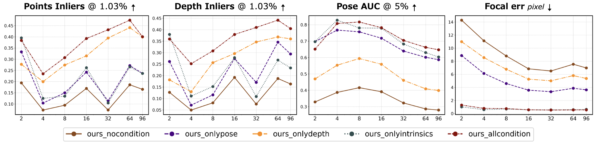

# HunyuanWorld-Mirror：任意先验提示的通用 3D 世界重建

## 结论先行

- HunyuanWorld-Mirror（论文名 WorldMirror）是腾讯混元的**前馈式通用 3D 重建模型**：一次前馈同时产出点云、多视深度、相机位姿/内参、表面法向和 3D Gaussians 五种几何表示，属于 VGGT 一系「视觉几何基础模型」的多任务、可提示扩展。
- 核心卖点是 **Any-Prior Prompting（任意先验提示）**：把标定内参、相机位姿、深度等**可选**先验各自编码成 token 注入网络，缺哪个用哪个。有先验时精度显著提升（7-Scenes 点云重建 vs 无先验基线均值提升约 58%），没先验时退化为纯 RGB 前馈重建。这是与 VGGT/π³ 纯 RGB 路线最本质的区别。
- 数值上在多个 benchmark 领先同代 RGB-only 模型：DTU 点云 Acc 0.735 / Comp 0.935（π³ 1.198/1.849、VGGT 1.338/1.896），RealEstate10K 位姿 AUC@30 86.28（π³ 85.90、VGGT 77.62），稀疏 2 视 NVS PSNR 22.30（AnySplat 17.62）。**注意最强点云数字是「带全部先验」下取得，与纯 RGB baseline 非同协议**，横向比较需看清条件列。
- 工程侧比多数同类友好：**训练代码、两阶段配置、HF 权重均已开源**，数据准备沿用 CUT3R。但许可证是腾讯社区许可（月活破百万需授权），非标准 Apache/MIT；训练栈重、含 Gaussian 头微调所需高质量合成数据。
- 推断：它更像「多先验 + 多任务 + 3DGS/NVS 生态」定位的强候选，而非追求纯 metric 主干；行车/动态长序列稳定性、真实尺度一致性论文未充分覆盖，落地前需自行验证（依据：Sintel 动态深度 Abs Rel 0.289 明显弱于静态场景）。

## 1. 这篇论文解决什么问题？

- 问题定义：现有前馈 3D 重建模型（DUSt3R/VGGT/CUT3R/π³ 等）大多**只吃 RGB**、且每种几何量（深度、位姿、点云、法向、3DGS）往往由不同专用模型分头解决。当用户手里已经有部分先验（相机标定、SLAM 位姿、传感器深度）时，这些模型无法利用；同时缺少一个「一模型全输出」的统一接口。
- 输入 / 输出：
  - 输入：任意数量多视图 RGB + **可选**先验子集 {相机内参 3×3、相机位姿 4×4（OpenCV 约定）、深度图（相机系 Z-depth）}。每个先验独立可选，用条件 flag 控制。
  - 输出：稠密点云（带置信度）、逐视深度图（带置信度）、相机位姿与内参、表面法向（相机系，带置信度）、3D Gaussians（means/opacity/scale/quaternion/球谐）。
- 目标场景：通用世界重建 —— 多视稀疏/稠密重建、无标定/有标定 SfM、单目/视频深度、法向估计，以及直接产出可渲染的 3DGS 做新视合成（NVS），面向后续世界资产生成。
- 与现有方法的差异：VGGT/π³ 是纯 RGB、固定输出；MapAnything 也支持多先验但主打 metric 因子化表示且不原生输出 3DGS。WorldMirror 的差异化在于**「任意先验提示 + 五任务同时输出 + 内置 3DGS/NVS」三者合一**。

## 2. 方法概览

- 核心想法：用一个统一 Transformer 主干 + 多个预测头覆盖所有几何任务；把「先验」当成可选提示 token 注入，训练时随机开关先验，推理时任意组合。
- 一句话 pipeline：多视图 RGB（+可选内参/位姿/深度 token）→ 交替注意力 Transformer 主干 → 多个 DPT/Transformer 头 → 点云 / 深度 / 相机 / 法向 / 3D Gaussians。

### 2.1 架构解析

> 图片来源：WorldMirror 官方仓库 `assets/arch.png`（arXiv:2510.10726, Liu et al. 2025）。

- 整体结构（模块分解）：
  1. **图像编码器**：每张视图 patch 化后编码为图像 token（沿用 VGGT 系的 DINO/ViT 式 backbone 与预训练权重）。
  2. **多模态先验提示（Multi-Modal Prior Prompting）**：内参、位姿、深度各用轻量编码层转成结构化先验 token，与图像 token 一起送入主干。这是本文的核心增量模块。
  3. **通用几何主干**：Transformer，使用**交替注意力（alternating attention）**在「帧内自注意力」与「跨帧全局注意力」之间轮换，聚合多视图信息（与 VGGT 一致的设计）。
  4. **多任务预测头（Universal Geometric Prediction）**：DPT 式稠密头输出点云/深度/法向（各带置信度），Transformer 式相机头输出紧凑的位姿+内参，Gaussian 头输出 3DGS 参数。
- 各模块职责与数据流：图像 token 与先验 token 拼接 → 主干做多视聚合 → 各头从共享表示解码出对应几何量；单次前馈，无迭代优化、无 bundle adjustment。
- 关键设计选择及理由：
  - 先验以 token 形式注入而非硬约束，保证「缺任意先验」时网络仍可运行 —— 这是「Any-Prior」的工程前提。
  - 复用 VGGT 预训练权重与交替注意力，降低从零训练成本、继承其多视泛化。
  - 多头共享主干，让先验对某一任务的增益能**跨任务传导**（论文强调加单一先验同时提升对应任务与其他任务）。

### 2.2 核心原理

- 为什么这样设计 work：
  - 几何任务高度相关（深度、点云、位姿、法向本质是同一场景几何的不同投影），共享主干 + 多头能让它们互相正则、共享表示。
  - 先验 token 提供**去歧义信号**：单目/多视重建的根本病态在尺度与相机歧义，注入内参/位姿/深度直接压缩解空间，因此精度提升可跨任务扩散。
- 关键机制/归纳偏置：
  - **交替注意力**：帧内 + 跨帧交替，兼顾单视细节与多视一致性。
  - **训练期随机先验丢弃（0.5 概率）**：强制网络学会「有先验用先验、无先验靠图像」，得到对先验组合鲁棒的单一模型。
- 与前作在原理上的本质区别：VGGT/π³ 把重建当成纯 RGB → 几何的确定映射；WorldMirror 把它建模为**「图像 + 可选先验」的条件重建**，用提示机制统一了「无标定重建」与「有先验精修」两种模式。

### 2.3 关键公式解析

> 论文未在摘要/HTML 公开处给出严格核心公式，以下为对方法的形式化描述并注明来源为「据方法描述形式化」。

- 形式化 (1)：条件式多任务前馈（据方法描述形式化）

$$ \{ P, D, C, N, G \} = f_\theta\big( \{ I_v \}_{v=1}^{V},\ \{ m_k \cdot \mathrm{enc}_k(c_k) \}_{k \in \mathcal{K}} \big) $$

  - 符号： $I\_v$ 为第 $v$ 张视图图像， $V$ 为视图数； $c\_k$ 为第 $k$ 种先验（ $k \in \mathcal{K} = \{\text{intrinsics}, \text{pose}, \text{depth}\}$ ）， $\mathrm{enc}\_k$ 为对应轻量编码层， $m\_k \in \{0,1\}$ 为该先验的开关 flag； $f\_\theta$ 为 Transformer 主干+多头；输出 $P$ 点云、 $D$ 深度、 $C$ 相机、 $N$ 法向、 $G$ 高斯。
  - 作用：显式表达「任意先验子集」—— $m\_k=0$ 时该先验 token 不注入，模型退化为纯 RGB； $m\_k=1$ 时提供条件约束。一次 $f\_\theta$ 同时产出全部几何量。

- 形式化 (2)：训练期随机先验丢弃（据方法描述形式化）

$$ m_k \sim \mathrm{Bernoulli}(0.5), \quad \forall k \in \mathcal{K} $$

  - 符号： $m_k$ 为训练时对第 $k$ 种先验的随机开关，服从概率 0.5 的伯努利分布。
  - 作用：让单一权重覆盖所有先验组合（ $2^{|\mathcal{K}|}$ 种），推理时任意子集都可用，无需为每种输入配置单独训练模型。

- 形式化 (3)：多任务加权损失（据方法描述形式化，具体项以论文为准）

$$ \mathcal{L} = \lambda_P \mathcal{L}_{P} + \lambda_D \mathcal{L}_{D} + \lambda_C \mathcal{L}_{C} + \lambda_N \mathcal{L}_{N} + \lambda_G \mathcal{L}_{G} $$

  - 符号：各 $\mathcal{L}\_{\bullet}$ 分别为点云、深度、相机、法向、高斯（渲染）监督项， $\lambda\_\bullet$ 为权重；点云/深度/法向头通常配置置信度加权项。
  - 作用：统一多任务训练目标；Gaussian 项一般以渲染重建损失（如 photometric + LPIPS）监督，在第二阶段单独微调。

### 2.4 训练与推理细节

- 训练目标 / 损失函数：多任务联合监督（点云/深度/相机/法向 + 3DGS 渲染损失），稠密头带置信度加权；先验按 0.5 概率随机注入。
- 训练数据与规模、超参要点（两阶段）：
  - **阶段一（约 100 epoch）**：多模态先验提示 + 法向头训练，初始化自 VGGT 预训练权重；数据准备沿用 CUT3R 流程，仓库附 Hypersim 示例。
  - **阶段二（约 50 epoch）**：单独微调 Gaussian 头，使用高质量合成数据的标注。
- 推理流程与关键步骤：多视图（+可选先验 token）→ 单次前馈 → 直接读取各头输出；需要 NVS 时用 Gaussian 头输出的 3DGS 直接渲染新视角，无需 per-scene 优化。

## 3. 关键贡献

1. **Any-Prior Prompting**：把内参/位姿/深度等异构几何先验统一编码为可选 token 注入前馈网络，训练期随机丢弃，实现「任意先验子集」的单模型条件重建 —— 缺先验能跑、有先验更准且增益跨任务传导。
2. **通用多任务几何预测**：单一前馈同时输出点云、深度、相机、法向、3D Gaussians 五种表示，覆盖 SfM/MVS/深度/法向/NVS 全谱系，避免多模型拼接。
3. **强 benchmark 结果 + 完整开源**：在点云/位姿/法向/深度/NVS 多个基准上超过同代 RGB-only 方法，并开源训练代码、两阶段配置与 HF 权重（腾讯社区许可）。

## 4. 实验与证据

| 维度 | 内容 |
|---|---|
| 数据集 | 点云：DTU / 7-Scenes / NRGBD；位姿：RealEstate10K / Sintel / TUM-dynamics；法向：ScanNet / NYUv2 / iBims-1；深度：NYUv2 / KITTI / Sintel；NVS：RealEstate10K / DL3DV |
| Baseline | VGGT、π³、CUT3R、Fast3R、MapAnything（同代 VGM）；NVS 对比 AnySplat；法向对比 StableNormal / GeoWizard |
| 指标 | 点云 Acc/Comp；位姿 RRA/RTA/AUC、ATE/RPE；深度 Abs Rel / δ<1.25；法向角度误差；NVS PSNR/SSIM/LPIPS |
| 主要结果 | DTU 点云 0.735/0.935（全先验）；RealEstate10K 位姿 AUC@30 86.28；稀疏 2 视 NVS PSNR 22.30（AnySplat 17.62）；NYUv2 单目深度 Abs Rel 0.052 |
| 消融 | 先验数量递增 → 精度递增；全先验 vs 无先验基线：7-Scenes 均值 +58.1%、NRGBD +53.1%（Table 6 / Fig 6） |
| 失败案例 | 动态/长序列偏弱：Sintel 视频深度 Abs Rel 0.289、δ<1.25 仅 66.8%，明显差于静态室内场景 |

### 4.1 效果与性能解析

> 图片来源：WorldMirror 官方仓库 `assets/num-prior.png`（arXiv:2510.10726）。展示先验从无到全时各任务精度的单调提升。

- 主要结果解读（不只搬数字）：
  - **点云重建的大幅领先要看条件**：DTU Acc 0.735 是「带全部先验」下的结果（无先验 base 为 1.017/1.780），而 π³/VGGT 是纯 RGB。这说明 WorldMirror 的强项在「能吃先验」，而非纯 RGB 上碾压 —— 公平比较应看无先验列（论文亦提供）。
  - **位姿估计静态场景已接近饱和**：RealEstate10K RRA@30 99.99% 与 π³ 持平，AUC@30 略优；真正拉开差距的是动态/长序列（Sintel、TUM），但绝对精度仍不完美。
  - **NVS 对 AnySplat 优势明显且随视图数增加而扩大**：2 视 22.30 → 32 视 25.77，说明多视聚合有效，前馈 3DGS 生态可用。
- 性能与效率：单次前馈、无 per-scene 优化，NVS 不需迭代训练；参数量/显存论文未在公开处给全量数字（存疑）。相对 VGGT 增加了先验编码层与 Gaussian 头，推理开销略高。
- 消融揭示的关键因素：**先验越多越准，且单先验能跨任务提升** —— 印证多任务共享主干让条件信号在任务间传导，是 Any-Prior 设计的核心证据。
- 与 SOTA/baseline 的可比性与协议一致性：**最大注意点**。带先验数字与纯 RGB baseline 非同协议，横向排名（尤其对比报告里的主干选型）必须按「相同输入条件」对齐，否则会高估其纯 RGB 上限。

## 5. 局限与风险

- 论文明确承认：动态场景与长视频深度较弱（Sintel Abs Rel 0.289）；Gaussian 头依赖高质量合成数据做第二阶段微调。
- 我推断的风险：
  - **真实尺度（metric）一致性未作主线论证**，与 MapAnything 那种显式度量因子化路线不同，行车/机器人 metric 需求需自测（推断，依据其未突出 metric 协议）。
  - 「全先验最优」意味着最强效果依赖用户已有高质量位姿/深度，先验本身噪声对结果的敏感性论文覆盖有限。
- 工程落地风险：两阶段训练 + Gaussian 微调栈重；多头多任务显存/吞吐成本高于纯深度或纯位姿模型。
- 许可证/数据风险：**Tencent HunyuanWorld-Mirror Community License**，允许商用但月活 > 100 万需向腾讯申请书面授权，且含使用限制，非标准 Apache/MIT —— 商用前须法务评估。

## 方法谱系

- 基于：[VGGT](../3d-reconstruction/2025-vggt.md)（交替注意力主干与预训练权重）、[CUT3R](../3d-reconstruction/2025-cut3r.md)（训练数据准备流程）
- 同代对照：[MapAnything](../3d-reconstruction/2025-mapanything.md)（同为多先验前馈重建，但主打 metric 因子化表示）、[π³](../3d-reconstruction/2026-pi3.md)、[VGGT-Ω](../3d-reconstruction/2026-vggt-omega.md)

## 6. 与相似方法对比

| Method | 相同点 | 不同点 | 何时选它 |
|---|---|---|---|
| VGGT | 前馈、交替注意力多视聚合、多几何量输出 | VGGT 纯 RGB、无先验提示、无原生 3DGS | 只有 RGB、要成熟稳定 backbone 时选 VGGT |
| MapAnything | 支持多先验（内参/位姿/深度）的前馈重建 | MapAnything 主打真尺度因子化表示、Apache 权重可商用、不原生输出 3DGS | 追求 metric 尺度 + 可商用训练开源选 MapAnything |
| π³ | 前馈、多视几何、位姿+点云 | π³ reference-free、permutation-equivariant、纯 RGB、非 metric 主线 | 关注输入顺序鲁棒/无参考帧 baseline 选 π³ |
| AnySplat（NVS 对手） | 前馈 3DGS / NVS | WorldMirror 多任务 + 可注入先验，NVS 数值更高 | 需要「重建+NVS+多先验」一体化选 WorldMirror |

> 更完整横向定位见对比报告：[`reports/feedforward_3d_reconstruction_compare.md`](../../reports/feedforward_3d_reconstruction_compare.md)（MapAnything / Pi3 / HunyuanWorld-Mirror / OmniVGGT 选型），以及 [`comparisons/3d-reconstruction/visual-geometry-foundation-models.md`](../../comparisons/3d-reconstruction/visual-geometry-foundation-models.md)。

## 7. 复现判断

- Git 地址：https://github.com/Tencent-Hunyuan/HunyuanWorld-Mirror
- 是否开源：是（代码 + 权重）
- 是否开源训练：**是** —— 仓库含两阶段训练脚本与配置，数据准备沿用 CUT3R，附 Hypersim 示例数据。
- 代码可用性：推理 + Gradio demo + 训练路径齐全（README 标注 2025-11 释出训练代码）。
- 权重可用性：Hugging Face `tencent/HunyuanWorld-Mirror`。
- 数据可获得性：主训练数据未一次性打包公开，需按 CUT3R 流程自备多数据集；第二阶段 Gaussian 微调依赖高质量合成数据（获取门槛较高）。
- 预计环境成本：多视 Transformer + 多头 + 3DGS 渲染，训练需多卡 GPU；仅推理/NVS 单卡可试。
- 最小复现路径：先跑官方权重做推理与 NVS demo → 复现某一 benchmark（如 7-Scenes 点云或 RealEstate10K NVS），核对「同输入条件」下数字 → 再考虑训练。
- 是否值得复现：作为「多先验 + 多任务 + 3DGS」候选**值得跑推理评测**；全量训练复现成本高、许可证需评估，建议先验证推理指标再决定。

## 8. 后续动作

- [ ] 更新 `indices/papers.md`
- [ ] 更新 `indices/directions.md`（3d-reconstruction 下加入本篇）
- [ ] 更新对比：`reports/feedforward_3d_reconstruction_compare.md` 已含本方法，可补「同协议 vs 全先验」数字澄清
- [ ] 若计划复现，创建 `reproductions/3d-reconstruction/hunyuanworld-mirror/README.md`
- [x] 核实 ICML 2026 录用状态：官方 README 2026-05-20 公告已被 ICML 2026 接收
