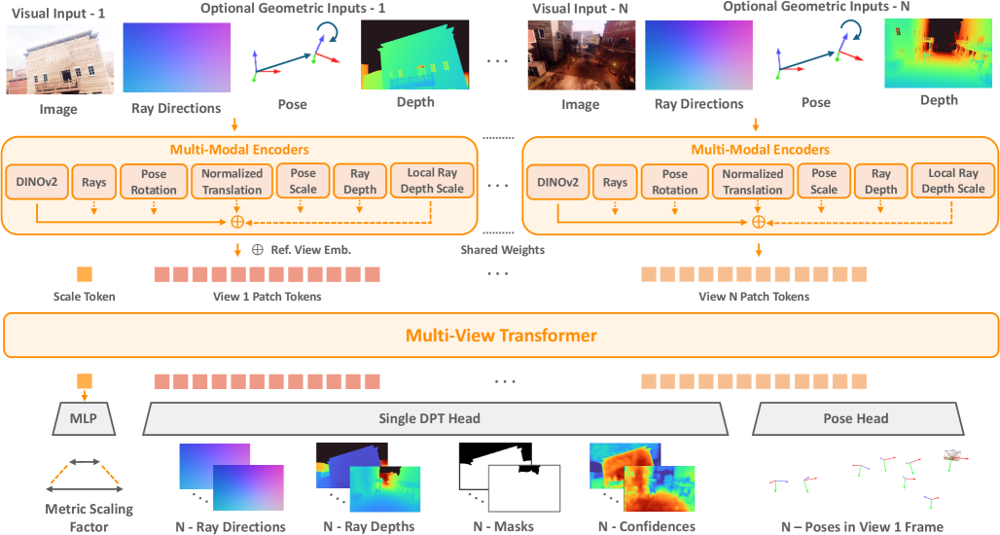
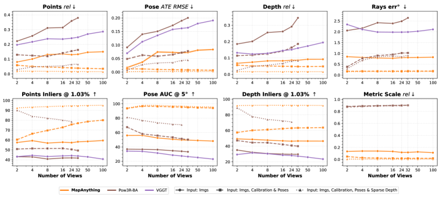
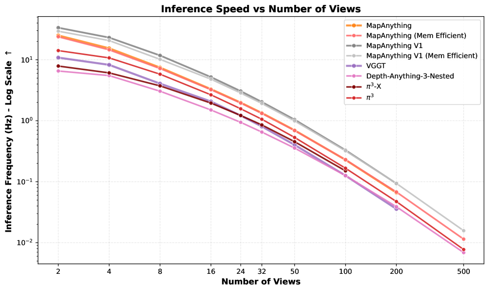

# MapAnything：通用前馈度量 3D 重建

## 结论先行
- MapAnything 把多种 3D 视觉任务（无标定 SfM、标定 MVS、单目深度、相机定位、深度补全）统一进「一个可 prompt 的前馈模型、一次前馈」框架：输入是 1~N 张图像 + 任意可选先验（内参/位姿/深度/部分重建），输出直接是度量尺度的全局一致 3D 几何与相机（证据：arXiv 2509.13414 摘要）。
- 关键在「因子化表示」——把场景拆成逐视图射线方向 $R\_i$ + up-to-scale 深度 $\tilde{D}\_i$ + 相机位姿 $\tilde{P}\_i$ + 单一全局度量尺度因子 $m$ ，先在各视图局部构造点图、再刚性拼装到全局坐标系、最后乘 $m$ 得度量结果；这套解耦让同一模型既能吃图像、又能吃几何先验，先验越多精度单调越高（证据：2-view 无先验 inlier 57.5%，注入内参+位姿+深度后 abs-rel 降到 0.01、inlier 升到 82.0%，arXiv v3 HTML Table 2）。
- 它在多项基准上追平或超过专用前馈模型：2-view images-only inlier ratio 57.5% 高于 DUSt3R 43.9% / MASt3R 30.2% / VGGT 43.2%；单视图标定平均角误差 1.06° 优于 VGGT 4.00°、MoGe-2 1.95°、AnyCalib 2.01°（证据：arXiv v3 HTML 对比表）。作者定位为「追平或超过 specialist 模型，同时联合训练更高效」。
- 工程可用性高且明确面向落地：代码 Apache 2.0；权重双许可（CC-BY-NC 研究版含论文全部 13 数据集 / Apache 2.0 商用版仅用可商用数据集子集训练），训练代码、13 数据集处理管线均开源，权重上 HuggingFace。商用可直接用 Apache 版权重（这是它相较 VGGT 权重需申请的落地优势）。
- 对自动驾驶友好点在于「metric + promptable」：可注入车载已知内参/位姿/稀疏深度做深度补全与度量重建，且 memory-efficient 模式下宣称单卡 140GB 可处理约 2000 视图（证据：README；推断：车队多相机/长序列场景契合）。

## 1. 这篇论文解决什么问题？
- 问题定义：把分散在多个专用模型里的 3D 视觉任务（SfM、MVS、单目深度、定位、深度补全）统一成一个前馈模型，并支持度量尺度（metric）输出与可选几何先验注入。
- 输入 / 输出：输入 1~N 张 RGB 图像 + 可选先验（相机内参/射线、相机位姿、深度图、部分重建）；输出各帧度量深度、逐视图射线方向、相机位姿与统一到全局度量坐标系的 3D 几何。
- 目标场景：通用多视图/单视图重建，尤其是能拿到部分标定信息的场景（机器人、自动驾驶多相机、已知内参的采集），可按可用先验灵活退化或增强。
- 与现有方法的差异：DUSt3R/VGGT 等前馈模型多为「只吃图像、输出非度量或需对齐」的固定接口；MapAnything 以因子化表示统一接口，可 prompt 先验、直接给度量结果，一个模型覆盖多任务而非每任务一模型。

## 2. 方法概览
- 核心想法：用统一 Transformer + 因子化场景表示，把「图像 + 任意几何先验」映射到「度量 3D 几何 + 相机」，通过输入增强（训练时随机丢弃/提供不同先验）训练出可 prompt 的单模型。
- 一句话 pipeline：每视图图像与可选先验各自过多模态编码器 → 拼成 patch token（外加一个全局 Scale Token）→ 16 层交替注意力 Multi-View Transformer 融合 → DPT 头出逐视图射线/深度/mask/置信度、Pose 头出位姿、MLP 出度量尺度因子 → 按因子化公式组装成全局度量点云，单次前馈无后处理。

### 2.1 架构解析

整体结构（模块分解，自底向上）：

1. **多模态编码器（Multi-Modal Encoders，逐视图、权重共享）**：
   - 图像分支：DINOv2 ViT-G，取 patch 特征作为视觉主干。
   - 几何先验分支：把可选输入分别编码——`Rays`（射线方向/内参）、`Pose Rotation`、`Normalized Translation`、`Pose Scale`、`Ray Depth`、`Local Ray Depth Scale`。每类先验独立编码后与图像 token 相加（图中的 $\oplus$ ）。缺失的先验分支直接置零/跳过，天然支持「任意先验组合」。
   - 一个额外的全局 **Scale Token**，专门承载「整场景该放大多少倍到米制」这一自由度；再叠一个 Reference View Embedding 标记参考帧（第 1 帧定义世界系）。
2. **Multi-View Transformer**：交替注意力（alternating attention，逐帧内自注意 ↔ 跨帧全局注意交替）跨视图融合，是「全局一致性」的来源。
3. **三个输出头**：
   - 单一 **DPT Head**（dense 预测头）对每视图回归：射线方向 $R\_i$、up-to-scale 射线深度 $\tilde{D}\_i$、有效区域 mask $M\_i$、逐像素置信度 $C\_i$。
   - **Pose Head**（平均池化 + 卷积）回归各帧在第 1 帧坐标系下的位姿（四元数旋转 + 平移）。
   - **MLP** 从 Scale Token 回归单个全局度量尺度因子 $m$ 。

数据流：先验与图像在编码器融合 → Transformer 跨视图对齐 → 三头解耦输出 → 「几何组装」（见 2.3）把射线×深度→局部点图，位姿变换到世界系，乘 $m$ 得度量点云。

关键设计选择及理由：
- **DINOv2 ViT-G 主干 + 极低学习率微调**（DINOv2 用 $5\times10^{-6}$ ，其余层 $10^{-4}$ ）：复用大规模自监督语义先验，稳住训练。
- **单 DPT 头同时出射线/深度/mask/置信**：把「相机标定」和「深度」从一个共享表示解耦出来，是可 prompt 与度量解耦的基础。
- **独立的 Scale Token + MLP 预测 $m$** ：把「度量尺度」从「几何形状」中彻底剥离，使得 up-to-scale 几何在训练域外更稳，度量只由一个标量承担。

### 2.2 核心原理
- 为什么这样设计 work：多视图几何的自由度被显式因子化为「每视图内参（射线）× 每视图深度 × 每视图外参（位姿）× 一个全局尺度」。这四类量在数学上正是从像素到度量世界点的完整链条（见 2.3 公式），任何一个若已知（先验），模型就少估一个自由度、误差自然下降——这解释了「先验越多、精度单调提升」的现象不是玄学，而是自由度被外部约束锁死的直接结果。
- 关键机制/归纳偏置：
  - **输入级 dropout 增强**是训练精髓——以约 0.9 的概率注入几何先验，每种模态（射线/深度/位姿）各 0.5，且 5% 的时间连度量尺度也不给。这迫使同一套权重学会「有先验就用、没先验就自己估」，从而单模型泛化到 12+ 种任务配置。
  - **交替注意力**提供跨视图归纳偏置，让局部点图在 Transformer 内就趋于全局一致，省掉 DUSt3R 式的显式全局对齐优化。
- 与前作在原理上的本质区别：DUSt3R 把两视图点图直接回归到「第 1 帧坐标系」但非度量、且成对后需全局对齐；VGGT 多帧但只吃图像、度量性弱、接口不可 prompt。MapAnything 的本质突破是**把表示因子化到可注入先验的粒度**——每个几何自由度都有对应的输入端口和输出头，于是「输入什么先验」与「输出什么任务」被统一成同一接口的不同投影。

### 2.3 关键公式解析

因子化表示的组装链条（逐视图 → 世界系 → 度量）：

$$ \tilde{L}_i = R_i \cdot \tilde{D}_i \in \mathbb{R}^{3 \times H \times W} $$

- 符号： $R\_i$ 逐像素单位射线方向（局部相机标定）， $\tilde{D}\_i$ 逐像素 up-to-scale 射线深度， $\tilde{L}\_i$ 第 $i$ 视图相机系下的 up-to-scale 局部点图。
- 作用：把「标定」与「深度」两个解耦输出相乘还原局部 3D 点。因内参被表示成射线，无需显式焦距/主点即可反投影。

$$ \tilde{X}_i = O_i \cdot \tilde{L}_i + \tilde{T}_i $$

- 符号： $O\_i$ 由预测四元数 $Q\_i$ 转成的旋转矩阵， $\tilde{T}\_i$ up-to-scale 平移（均在第 1 帧世界系下）， $\tilde{X}\_i$ 世界系下 up-to-scale 点图。
- 作用：用 Pose Head 的外参把各视图局部点图刚性搬到统一世界系，实现「全局一致」。

$$ X_i^{\text{metric}} = m \cdot \tilde{X}_i $$

- 符号： $m$ 单个全局度量尺度因子（由 Scale Token 经 MLP 预测）。
- 作用：一次标量缩放把整场景从 up-to-scale 拉到米制。度量性只由 $m$ 承担，形状不受污染——这是训练域外仍能保 up-to-scale 结构的关键。

对数空间损失变换（用于压缩远处大深度的动态范围）：

$$ f_{\log}: \mathbf{x} \mapsto \frac{\mathbf{x}}{\lVert \mathbf{x} \rVert} \cdot \log(1 + \lVert \mathbf{x} \rVert) $$

- 符号： $\mathbf{x}$ 3D 点或深度向量， $\lVert \mathbf{x} \rVert$ 其模长；变换保方向、对模长取 $\log(1+\cdot)$ 。
- 作用：近处点几乎线性、远处点被压缩，使损失不被大深度主导，缓解室外大尺度场景的梯度失衡。

带置信度的点图损失（confidence-aware）：

$$ L_{\text{pointmap}} = \sum_i \left( C_i \, \big\lVert f_{\log}(\hat{X}_i / \hat{z}) - f_{\log}(\tilde{X}_i / \tilde{z}) \big\rVert - \alpha \log C_i \right) $$

- 符号： $C\_i$ 逐像素预测置信度， $\hat{X}\_i$ 为 GT、 $\tilde{X}\_i$ 为预测点图， $\hat{z}$ / $\tilde{z}$ 是用有效掩码 $V\_i$ 统计的归一化尺度（GT/预测各自的平均模长）， $\alpha$ 置信正则权重。
- 作用：先按 $\hat{z}$ / $\tilde{z}$ 归一去掉度量歧义，再让模型对不确定像素（遮挡/天空）主动降权， $-\alpha\log C_i$ 阻止置信塌缩到零。

### 2.4 训练与推理细节
- 训练目标 / 损失函数：多项加权和（论文式 2）——
  $$ L = 10\,L_{\text{pointmap}} + L_{\text{rays}} + L_{\text{rot}} + L_{\text{translation}} + L_{\text{depth}} + L_{\text{lpm}} + L_{\text{scale}} + L_{\text{normal}} + L_{\text{GM}} + 0.1\,L_{\text{mask}} $$
  其中点图项权重最高（ $\times 10$ ）为主监督，另含射线、旋转、平移、深度、局部点图、尺度、法向、梯度匹配（GM）与 mask 项；深度/点图项均在 $f_{\log}$ 空间计算。
- 训练数据与规模：13 个数据集（Apache 商用版仅用其中可商用子集：BlendedMVS、Mapillary Planet-Scale Depth、ScanNet++ v2、Spring、TartanAirV2、UnrealStereo4K 等；CC-BY-NC 版用全 13 个）。精确的商用子集清单以 HF model card 为准。
- 超参要点：AdamW（ $\beta_1=0.9,\ \beta_2=0.95$ ，weight decay 0.05），LR DINOv2 $5\times10^{-6}$ / 其余 $10^{-4}$ ，10% 线性 warmup + 半周期 cosine 衰减，梯度裁剪阈值 1.0，输入最长边 518px、随机长宽比 3:1~1:2。共约 420K steps，两阶段课程：Stage 1（约 6 天、64×H200、batch 768→1536、views 4→2），Stage 2（约 4 天、64×H200、views 24→2、LR 降 10 倍）。
- 输入增强概率：整体 0.9 概率给几何先验；每模态（射线/深度/位姿）各 0.5；稠密/稀疏深度等概率；逐视图 0.95 概率带先验；5% 时间不给度量尺度（强制模型自估 $m$ ）。
- 推理流程：单次前馈，N 张图 + 可选先验 → 直接出度量点云与相机，无需后优化；支持异构输入（部分视图带先验、部分不带）；视图数 2~100+ 已测；memory-efficient 模式据 README 单卡 140GB 约 2000 视图。

## 3. 关键贡献
1. 提出统一的可 prompt 前馈度量 3D 重建模型，一个模型 + 一次前馈覆盖无标定 SfM、标定 MVS、单目深度、定位、深度补全等 12+ 任务配置。
2. 因子化场景表示（射线方向 + up-to-scale 深度 + 相机位姿 + 单一度量尺度因子 $m$ ），既统一多任务输出、又天然支持注入任意几何先验并解耦输出度量尺度。
3. 跨 13 数据集的标准化监督 + 输入级 dropout 增强训练范式，使单模型的联合训练比训练一堆专用模型更高效，且先验越多精度单调提升。
4. 全面开源（Apache 2.0 代码 + 训练代码 + 13 数据集处理管线 + 双许可权重），提供商用可用（Apache）权重。

## 4. 实验与证据
| 维度 | 内容 |
|---|---|
| 数据集 | 训练 13 个数据集（Apache 权重版用其中可商用子集）；评测含 ETH3D、ScanNet++ v2、TartanAirV2-WB、KITTI、ScanNet、Robust-MVD |
| Baseline | DUSt3R、MASt3R、Pow3R、VGGT、MV-DUSt3R+、Fast3R、π³、MoGe-2、AnyCalib、MUSt3R 等 |
| 指标 | abs-rel（绝对相对误差）、inlier ratio（1.03% 相对阈值）、单视图标定角误差、Robust-MVD 的 rel/τ |
| 主要结果 | 2-view images-only：inlier 57.5%（DUSt3R 43.9%，MASt3R 30.2%，VGGT 43.2%）；2-view + 内参+位姿+深度：MapAnything abs-rel 0.01 / inlier 82.0%，同设定 Pow3R abs-rel 0.03 / inlier 90.1%（即 MapAnything 领先 abs-rel、Pow3R 领先 inlier）。多视图（50 views，跨 ETH3D/ScanNet++v2/TartanAirV2-WB 平均，v1 读数待 v3 核）images-only abs-rel 0.16 / inlier 40.7%，+内参+度量位姿后 0.05 / 57.8%。单视图标定平均角误差 1.06°（VGGT 4.00°，MoGe-2 1.95°，AnyCalib 2.01°）。 |
| 消融 | 先验消融即核心卖点：随注入先验增多，MapAnything 自身 abs-rel/inlier 单调改善（2-view inlier 57.5%→82.0%，abs-rel 降至 0.01）；训练数据从 6→13 集提升泛化 |
| 失败案例 | 论文未在摘要给出显式失败案例（推断：强动态/非刚性、无任何先验的大尺度户外、极端外推视角仍受前馈范式与训练分布限制） |

（注：以上数值来自 arXiv 2509.13414 **v3** HTML 对比表，已联网核实并较原 v1 稿更新——2-view images-only inlier 由 v1 的 53.6% 更新为 v3 的 57.5%，2-view 全先验 inlier 由 92.1% 更新为 82.0%，单视图标定由 1.18° 更新为 1.06°。特别地，2-view 全先验设定下 Pow3R 的 inlier（90.1%）高于 MapAnything（82.0%），而 MapAnything 的 abs-rel（0.01）优于 Pow3R（0.03），两指标各有胜负。50-view 多视图数值仍为 v1 读数、待 v3 二次核对。不同表格的视图数/先验组合不同，引用时需连同设定一起看，部分方法在其原设定下评测。）

### 4.1 效果与性能解析

- 主要结果解读（不只搬数字）：最有说服力的不是某个单点 SOTA，而是**先验-精度的单调曲线**——2-view 从 images-only inlier 57.5% 一路涨到全先验 82.0%、abs-rel 压到 0.01。这直接验证了 2.2 的原理：每锁一个自由度误差就掉一截，说明因子化不是花架子而是真在承载几何约束。单视图标定 1.06° 大幅优于 VGGT 4.00°，说明「射线表示 + 专门监督」把内参估计做得比通用几何 backbone 精。需注意，在 2-view 全先验这个特定设定下 Pow3R 的 inlier 反而更高，因此「追平或超过」的定位是诚实的、并非全指标碾压。
- 性能与效率：Figure 5 在 H200 上对比并发模型的时延与显存；README 称 memory-efficient 模式单卡 140GB 约 2000 视图。参数量以 DINOv2 ViT-G（约 1B 级）为主 + 交替注意力 Transformer，属大模型量级；推理单卡可跑小视图数，大规模视图需大显存或分块。训练成本高（64×H200、约 10 天两阶段、约 420K steps），佐证「联合训练一次胜过训一堆专用模型」的效率论点更多是**摊销**意义上的高效。
- 消融揭示的关键因素：(1) 先验注入是精度主杠杆；(2) 训练数据规模（6→13 集）影响域外泛化；(3) $f_{\log}$ 损失对户外大深度稳定训练有实质作用（否则远处点主导梯度）。
- 与 SOTA/baseline 的可比性：需高度警惕协议差异——不同表的视图数（2 vs 50）、先验组合（images-only vs 全先验）、评测集各异，且部分 baseline 在各自原设定评测。inlier 阈值 1.03% 是相对阈值，跨方法对齐时须确认同一协议。作者的「追平或超过」定位是诚实的：多数场景领先，个别单任务/单指标专用模型仍可能占优。

## 5. 局限与风险
- 论文明确承认：定位为「追平或超过」专用模型而非全面碾压，个别单任务/单指标上专用模型仍可能领先（如 2-view 全先验的 inlier 上 Pow3R 领先）；度量精度强依赖可用先验，纯 images-only 下误差明显高于带先验设定（如 2-view 无先验 inlier 57.5% vs 带全先验 82.0%）。
- 我推断的风险：训练覆盖 13 数据集但仍是特定分布，强动态/非刚性场景、无任何先验的开放世界外推一致性存疑；单一全局 $m$ 假设整场景同一尺度，混合近远景或多传感器拼接时该假设可能失真。
- 工程落地风险：大规模视图（~2000）需 140GB 级显存，普通单卡需用 memory-efficient 模式或降视图数；先验质量差（错误内参/位姿）时是否稳健需评估——注入错误先验可能比不注入更糟。
- 许可证 / 数据风险：完整 13-数据集权重为 CC-BY-NC 4.0（不可商用），商用须用仅可商用数据集子集训练的 Apache 版权重，二者精度可能有差（需自测）；这是相较「代码开源即可商用」的关键陷阱。

## 方法谱系
- 基于：[VGGT](../3d-reconstruction/2025-vggt.md)（延续纯前馈、多帧、多几何量单次回归的范式，扩展为可 prompt 先验 + 度量输出，并沿用交替注意力式跨视图融合）
- 基于：[DUSt3R](../3d-reconstruction/2023-dust3r.md)（继承前馈 pointmap 回归、去几何优化管线的思路，并统一到多任务度量框架；把成对全局对齐替换为 Transformer 内隐式对齐 + 因子化组装）

## 6. 与相似方法对比

> 横向对比见：[前馈几何模型对比](../../comparisons/3d-reconstruction/visual-geometry-foundation-models.md)、[3D 重建发展全景](../../comparisons/3d-reconstruction/development-survey.md)。

| Method | 相同点 | 不同点 | 何时选它 |
|---|---|---|---|
| VGGT | 单次前馈、多帧、多几何量回归、交替注意力 backbone | VGGT 只吃图像、非可 prompt、度量性弱；MapAnything 可注入内参/位姿/深度并直接输出度量，单视图标定 1.06° vs VGGT 4.00° | 只有图像、要几何基础 backbone/点跟踪时选 VGGT；能拿到先验、要度量结果时选 MapAnything |
| DUSt3R | 前馈点图回归、去 SfM 优化 | DUSt3R 成对 + 需全局对齐、非度量；MapAnything 原生多视图 + 度量 + promptable，2-view images-only inlier 57.5% vs DUSt3R 43.9% | 轻量成对/作谱系参照时选 DUSt3R |
| Pow3R | 同样支持注入相机/深度先验 | Pow3R 沿 DUSt3R 成对范式；MapAnything 统一多任务 + 度量因子化表示，覆盖更广；2-view 全先验 MapAnything abs-rel 0.01 优于 Pow3R 0.03，但该设定 inlier 上 Pow3R（90.1%）反超 MapAnything（82.0%） | 只需 2-view 可 prompt 重建、看重 inlier 时可比较 Pow3R |
| π³ / MV-DUSt3R+ | 前馈多视图重建 | 多为特定任务专用；MapAnything 单模型联合训练、接口统一 | 单一任务追极致精度时可比对应专用模型 |

## 7. 复现判断
- Git 地址：https://github.com/facebookresearch/map-anything
- 是否开源：是（Apache 2.0 代码）。
- 是否开源训练：是，仓库含完整训练指令、脚本、配置及 13 数据集的数据处理管线。
- 代码可用性：完整（推理 + 训练）。
- 权重可用性：HuggingFace 双版本——`facebook/map-anything`（CC-BY-NC 4.0，论文全 13 数据集，研究用）与 `facebook/map-anything-apache`（Apache 2.0，可商用数据集子集，商用）。
- 数据可获得性：训练数据为公开数据集组合，完整复现需自行下载并按官方管线处理。
- 预计环境成本：推理单卡可跑（大视图数需大显存或 memory-efficient 模式）；从头训练成本高（约 64×H200、约 10 天、约 420K steps），一般直接用官方权重。
- 最小复现路径：clone 仓库 → 装依赖 → 加载 HF 权重（商用选 apache 版）→ 在自有图像上前馈推理，逐步注入内参/位姿/深度先验验证精度单调提升。
- 是否值得复现：推理级复现值得（可 prompt + 度量，适合有先验的机器人/自驾场景）；从头训练非必要，除非做数据/架构实验。商用务必用 Apache 版权重。

## 8. 后续动作
- [x] 更新 `indices/papers.md`
- [x] 更新 `indices/directions.md`
- [x] 更新 `reports/feedforward_3d_reconstruction_compare.md` 中的 MapAnything 条目
- [ ] 若计划复现，创建 `reproductions/3d-reconstruction/mapanything/README.md`
