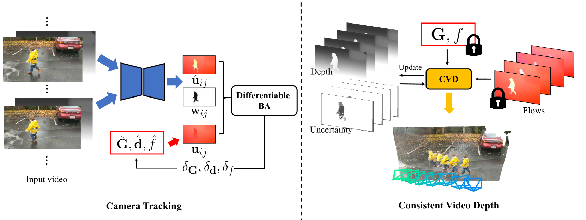
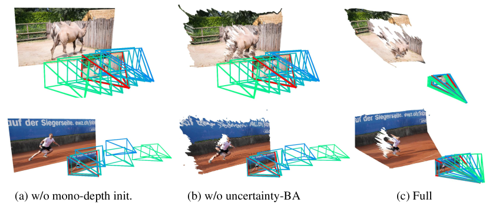
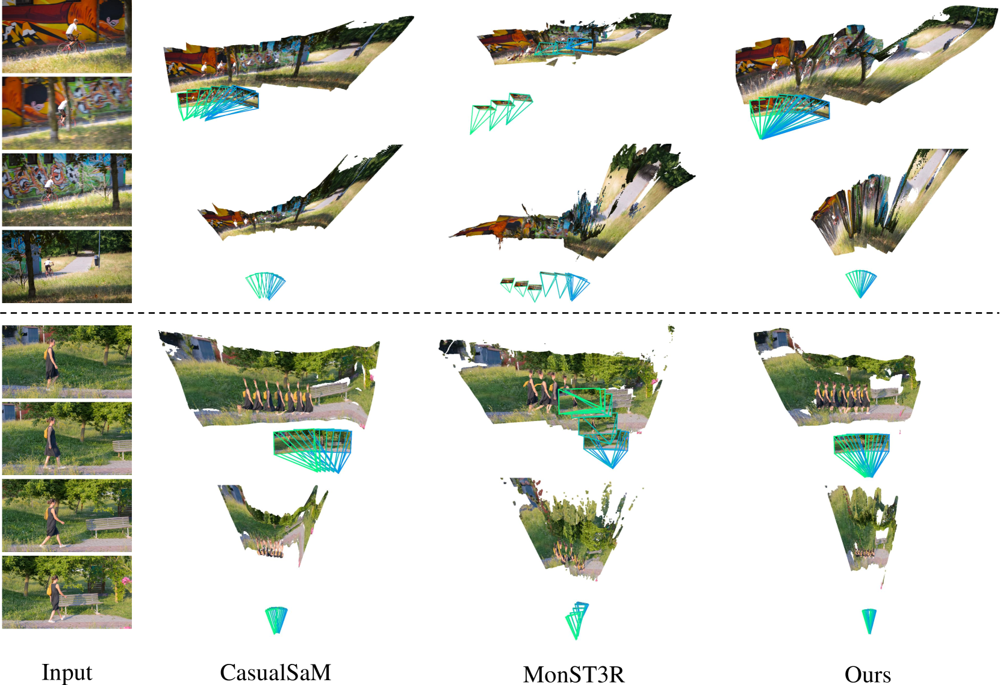

# MegaSaM：随手拍动态视频的准确、快速、鲁棒的运动与结构估计

## 结论先行

- MegaSaM 的核心主张是：不必重造轮子，而是把已有的深度视觉 SLAM 框架（DROID-SLAM 谱系）通过一组**训练与推理侧的关键改造**，改成能在「随手拍的动态视频」上稳定工作的 SfM + 视频深度系统，同时保持快速（证据：Abstract 与 Sec. 3，"careful modifications to training and inference"；论文标题即 Accurate/Fast/Robust）。
- 三个改造是成败关键：(1) 用单目深度先验（DepthAnything/UniDepth）给可微 BA 提供**深度初始化与正则**，解决低视差场景退化；(2) **不确定性感知的可微 BA**，用 Hessian 对角线衡量视差可观测性，动态调节深度先验权重；(3) 学习一张**运动概率图** $\mathbf{w}\_{ij}$ 抑制动态物体对相机估计的干扰（证据：Fig. 3 消融图 (a)(b)(c) 分别去掉 mono-depth init 与 uncertainty-BA 后轨迹明显崩坏）。
- 数值上它在动态场景相机位姿上大幅领先：Sintel 上 ATE 0.018（校准）/0.023（未校准），对比 CasualSAM 0.036/0.067、MonST3R 0.078；DyCheck 上 ATE 0.020，对比 CasualSAM 0.185、MonST3R 0.690（证据：论文位姿表）。
- 速度是它相对优化式方法的最大卖点：Sintel 上约 1.0s、DyCheck 上约 0.8s（每序列级别），对比 CasualSAM 的 1.6m / 2.8m（分钟级），快约两个数量级；项目页给出整体吞吐约 0.7 FPS 级别（证据：论文 runtime 表与项目页）。
- 工程可用性判断（推断）：代码开源、Apache-2.0，但**只放推理/优化/评测代码**，依赖外部预训练权重（DepthAnything、RAFT、UniDepth），**训练代码未开源**；因此复现「用它的权重跑自己的视频」门槛低，复现「重训一套」门槛高。

## 1. 这篇论文解决什么问题？

- 问题定义：从**单目、随手拍摄的动态视频**里，联合估计相机内外参（含焦距）与稠密、时序一致的视频深度，即在有运动物体的场景里做 SfM + 一致视频深度。
- 输入 / 输出：输入是一段普通 RGB 视频（不需已知焦距、不需标定）；输出是逐帧相机位姿 $\mathbf{G}$ 、焦距 $f$ 、以及稠密且时序一致的深度 / 点云。
- 目标场景：随手拍的日常视频，尤其是三类经典 SfM 失败情形——相机视差很小（几乎原地转动）、相机运动剧烈、场景动态复杂（大量运动物体）。
- 与现有方法的差异：
  - 相对经典 SfM（COLMAP/ParticleSfM）：不依赖静态场景假设与充分视差，动态与低视差下不崩。
  - 相对优化式方法（CasualSAM、Robust-CVD）：不做逐视频的慢速全局优化，快约两个数量级。
  - 相对前馈点图法（MonST3R/DUSt3R 谱系）：在长视频相机轨迹精度上显著更稳（DyCheck 上 ATE 差距达数十倍）。

## 2. 方法概览

- 核心想法：以 DROID-SLAM 的「可微 Bundle Adjustment + 循环光流更新」为骨架，注入单目深度先验、不确定性建模与运动概率，让它对动态、低视差视频鲁棒；再接一个一致视频深度（CVD）优化把深度补齐、对齐、平滑。
- 一句话 pipeline：单目深度先验初始化 → 循环光流 + 不确定性感知可微 BA 联合优化位姿/深度/焦距（同时预测运动概率图降权动态区域）→ 冻结相机后做一致视频深度优化输出稠密时序一致深度。

### 2.1 架构解析

> 图片来源：MegaSaM, arXiv:2412.04463, Fig.（系统总览，Camera Tracking + Consistent Video Depth）。

整体分两阶段：

- 阶段一「Camera Tracking」（图左）：一个循环网络对帧对 $(i,j)$ 预测校正光流 $\hat{\mathbf{u}}\_{ij}$ 和逐像素权重（运动概率） $\mathbf{w}\_{ij}$ ；同时由当前相机位姿 $\hat{\mathbf{G}}$ 、逆深度 $\hat{\mathbf{d}}$ 、焦距 $\hat{f}$ 诱导出刚体运动流 $\mathbf{u}\_{ij}$ ；两者送入 Differentiable BA，反解出位姿/深度/焦距的增量 $\delta\_{\mathbf{G}},\delta\_{\mathbf{d}},\delta\_f$ 迭代更新。
- 阶段二「Consistent Video Depth（CVD）」（图右）：冻结阶段一得到的相机 $\mathbf{G},f$ 与光流（图中加锁标记表示这些量在此阶段固定），把稀疏/带洞的深度优化成稠密、时序一致的视频深度，输出深度、不确定性与最终点云。

关键设计选择及理由（部分为论文明述、部分为合理推断）：

- 复用 DROID-SLAM 的可微 BA 而非纯前馈回归：保留几何约束与全局一致性，长视频轨迹更稳（推断：与 MonST3R 谱系在 DyCheck 上的巨大 ATE 差距一致）。
- 引入运动概率 $\mathbf{w}\_{ij}$ ：动态像素不满足静态多视图几何，降权后 BA 只信任静态背景（论文明述，Fig. 2 展示运动概率图）。
- 单目深度先验参与初始化与正则：在低视差时几何本身欠定，先验提供尺度与形状锚点（论文明述，Fig. 3(a) 去掉后崩坏）。

### 2.2 核心原理

- 为什么这样 work：动态/低视差视频对纯几何 SfM 是欠定或被污染的问题。MegaSaM 用三种「信息补充」把问题重新良置——先验（单目深度）补形状与尺度、概率（运动图）剔除坏观测、不确定性（Hessian）决定何时该信几何、何时该信先验。
- 关键机制/归纳偏置：
  - 可微 BA 提供强几何归纳偏置（多视图重投影一致性），保证长程一致。
  - 不确定性感知加权是自适应的：视差充分时相信重投影残差，视差不足时相信单目深度先验，避免「一刀切」。
  - 运动概率是学习得到的软 mask，比硬性语义分割更贴合「哪些像素破坏刚体假设」。
- 与前作的本质区别：DROID-SLAM 假设静态场景且常需已知内参、对低视差脆弱；MegaSaM 在同一可微 BA 框架内显式建模动态（运动概率）、欠定（先验 + 不确定性）与未知焦距（把 $f$ 一起优化）。

### 2.3 关键公式解析

> 说明：以下公式转写自论文正文（式编号沿用论文），符号以论文为准；这里逐项解释含义与作用。

- 公式（BA 目标，论文 Eq. 2）：
$$ \mathcal{C}(\hat{\mathbf{G}}, \hat{\mathbf{d}}, \hat{f}) = \sum_{(i,j)\in\mathcal{P}} \big\lVert \hat{\mathbf{u}}\_{ij} - \mathbf{u}\_{ij} \big\rVert^2_{\Sigma\_{ij}} $$
  - 符号： $\hat{\mathbf{u}}\_{ij}$ 是网络预测的帧对 $(i,j)$ 校正光流； $\mathbf{u}\_{ij}$ 是由当前位姿 $\hat{\mathbf{G}}$ 、逆深度 $\hat{\mathbf{d}}$ 、焦距 $\hat{f}$ 诱导的刚体运动流； $\mathcal{P}$ 是共视帧对集合； $\Sigma\_{ij}$ 是逐像素协方差（由运动概率 $\mathbf{w}\_{ij}$ 决定）。
  - 作用：最小化「预测光流」与「几何诱导光流」的加权重投影误差，从而联合反解相机位姿、逆深度与焦距； $\Sigma\_{ij}$ 使动态/不可靠像素自动降权。

- 公式（不确定性感知深度正则，论文 Eq. 9）：
$$ \mathcal{C} = \sum_{(i,j)} \big\lVert \hat{\mathbf{u}}\_{ij} - \mathbf{u}\_{ij} \big\rVert^2_{\Sigma\_{ij}} + w\_d \sum_i \big\lVert \hat{\mathbf{d}}\_i - \mathbf{D}^{\text{align}}\_i \big\rVert^2 $$
  - 符号：第一项同上；第二项是深度先验约束， $\hat{\mathbf{d}}\_i$ 是优化中的逆深度， $\mathbf{D}^{\text{align}}\_i$ 是与当前尺度对齐后的单目深度先验； $w\_d$ 是自适应权重，依据 BA 的 Hessian 对角线（视差可观测性）动态设置。
  - 作用：当几何可观测性弱（低视差）时增大 $w\_d$ ，让单目深度先验主导，避免深度漂移或退化；几何充分时减小 $w\_d$ ，相信多视图约束。

- 公式（一致视频深度目标，论文 Eq. 11）：
$$ \mathcal{C}\_{\text{cvd}} = w\_{\text{flow}}\,\mathcal{C}\_{\text{flow}} + w\_{\text{temp}}\,\mathcal{C}\_{\text{temp}} + w\_{\text{prior}}\,\mathcal{C}\_{\text{prior}} $$
  - 符号： $\mathcal{C}\_{\text{flow}}$ 是光流重投影一致项（用阶段一冻结的相机与光流）； $\mathcal{C}\_{\text{temp}}$ 是时序平滑一致项； $\mathcal{C}\_{\text{prior}}$ 是单目深度先验项； $w\_{\ast}$ 为各项权重。
  - 作用：在相机固定的前提下，把稀疏/带洞深度补成稠密、时序一致的视频深度，兼顾几何一致（flow）、时间稳定（temp）与形状合理（prior）。

### 2.4 训练与推理细节

- 训练目标 / 损失函数：沿用 DROID-SLAM 式的可微 BA 监督（光流/位姿/深度一致），并训练运动概率预测；论文强调是对训练与推理流程的"careful modifications"（论文明述其为对已有框架的改造，而非全新架构）。运动概率的特征提取用一个小型 ResNet 编码器（Conv7x7 → 多个 ResBlock，通道 64→256，见论文附图）。
- 训练数据与规模：论文使用合成/带真值几何的数据训练光流与运动模块（细节以论文为准；此处不臆测具体数据配比）。
- 推理流程：① 用单目深度模型（DepthAnything / UniDepth）估初始深度先验 → ② 循环光流 + 不确定性感知可微 BA 联合优化位姿/深度/焦距，并预测运动概率降权动态区 → ③ 冻结相机做一致视频深度（CVD）优化 → ④ 输出位姿、焦距、稠密时序一致深度与点云。
- 推理成本：序列级约 0.8–1.0s（相机跟踪阶段），整体吞吐项目页称约 0.7 FPS 级别（含 CVD）。依赖 CUDA 11.8 / PyTorch 2.0.1、需自定义扩展编译（`base` 子模块）与 xformers（UniDepth 用）。

## 3. 关键贡献

1. 把深度视觉 SLAM 框架改造成对随手拍动态视频鲁棒的 SfM + 视频深度系统，覆盖低视差、剧烈运动、复杂动态三类 SfM 失败场景。
2. 提出不确定性感知的可微 BA：用 Hessian 对角线量化视差可观测性，自适应地在多视图几何与单目深度先验之间分配信任，解决欠定问题。
3. 学习运动概率图并注入 BA 加权，无需显式语义分割即可剔除动态观测；同时联合优化未知焦距，适配无标定的随手拍视频。
4. 在准确性上大幅领先动态场景 SfM/深度基线（位姿、深度多项指标），同时相对优化式方法快约两个数量级。

## 4. 实验与证据

| 维度 | 内容 |
|---|---|
| 数据集 | Sintel、DyCheck(iPhone)、In-the-Wild、DAVIS（定性）|
| Baseline | DROID-SLAM、CasualSAM、ParticleSfM、LEAP-VO、RoDynRF、MonST3R、ACE-Zero；深度侧对比 DepthAnything-V2、DepthCrafter、UniDepth |
| 指标 | 相机位姿 ATE；视频深度 Abs-Rel / Log-RMSE / δ<1.25；runtime |
| 主要结果 | 位姿 ATE：Sintel 0.018(校准)/0.023(未校准)、DyCheck 0.020、In-the-Wild 0.004；深度 δ<1.25：Sintel 73.1、DyCheck 94.1，均为对比方法中最优 |
| 消融 | 去掉 mono-depth 初始化或去掉 uncertainty-aware BA，轨迹显著崩坏（Fig. 3 a/b vs c）|
| 失败案例 | 运动物体主导画面、或物体运动与相机运动共线（colinear）时退化（Fig. 8）|

关键数值（引自论文表格）：

| 指标 | 数据集 | CasualSAM | MonST3R | MegaSaM |
|---|---|---:|---:|---:|
| ATE（未校准）↓ | Sintel | 0.067 | 0.078 | **0.023** |
| ATE ↓ | DyCheck | 0.185 | 0.690 | **0.020** |
| ATE ↓ | In-the-Wild | 0.035 | 0.073 | **0.004** |
| δ<1.25 ↑ | Sintel | 64.2 | 62.5 | **73.1** |
| δ<1.25 ↑ | DyCheck | 78.4 | 66.5 | **94.1** |
| 运行时间 ↓ | Sintel | 1.6m | — | **1.0s** |
| 运行时间 ↓ | DyCheck | 2.8m | — | **0.8s** |

> 图片来源：MegaSaM, arXiv:2412.04463, Fig.（消融，相机轨迹对比）。

### 4.1 效果与性能解析

- 主要结果解读：位姿指标上对动态场景基线是压倒性的（DyCheck 上比 MonST3R 好约 30 倍、比 CasualSAM 好约 9 倍），说明「可微 BA 的几何约束 + 运动概率降权动态区」这条路线在长视频轨迹上远比前馈点图稳定；深度上 δ<1.25 从 60–80 区间提升到 73–94，说明先验 + 一致优化确实把稠密深度质量拉到新档位。
- 性能与效率：相对 CasualSAM 这类逐视频优化方法（分钟级），MegaSaM 是秒级，这是它相对「同样准」的优化式方法的核心竞争力；相对前馈方法虽不是最快，但用可接受的时间换来了远更稳的轨迹。
- 消融揭示的关键因素：mono-depth 初始化与 uncertainty-aware BA 都是「必需件」而非「锦上添花」——任一缺失轨迹即崩（Fig. 3），说明鲁棒性来自这几个改造的组合，而非单点。

> 图片来源：MegaSaM, arXiv:2412.04463, Fig.（in-the-wild 定性对比）。

## 5. 局限与风险

- 论文明确承认：当运动物体占据画面主体、或物体运动与相机运动共线时会退化（Fig. 8 失败案例）——此时静态背景观测不足以约束几何。
- 我推断的风险：强依赖单目深度先验（DepthAnything/UniDepth）与光流（RAFT），先验在极端域外场景失效会传导到最终结果；运动概率是学习量，训练分布外的动态模式可能失准。
- 工程落地风险：推理是「跟踪 + BA + CVD 优化」的组合，整体吞吐约 0.7 FPS 级别，非实时；依赖多个外部权重与自定义 CUDA 扩展，环境搭建有一定成本。
- 许可证 / 数据风险：代码 Apache-2.0（部分素材 CC-BY），可商用友好；但**训练代码未开源**，且依赖的 DepthAnything / UniDepth 各自有其许可证，二次分发需分别核对。

## 方法谱系

> MegaSaM 的直接骨架是 DROID-SLAM（本仓库暂无该 slug，故不加链接）；与前馈点图重建谱系有强对照关系。

- 基于（思想/对照）：[DUSt3R](../3d-reconstruction/2023-dust3r.md)（前馈点图重建谱系的代表，MegaSaM 在动态长视频轨迹上与其后续 MonST3R 做直接对比）
- 相关流式/在线重建对照：[CUT3R](../3d-reconstruction/2025-cut3r.md)、[VGGT](../3d-reconstruction/2025-vggt.md)

## 6. 与相似方法对比

| Method | 相同点 | 不同点 | 何时选它 |
|---|---|---|---|
| CasualSAM | 都做动态视频的相机 + 一致深度 | CasualSAM 是逐视频慢速优化（分钟级）；MegaSaM 秒级且更准 | 需要极致质量且不在意时间、或作为质量上界参考时用 CasualSAM，否则选 MegaSaM |
| MonST3R / DUSt3R 谱系 | 都从动态视频出几何 | 前馈点图回归，长视频轨迹漂移大（DyCheck ATE 差数十倍）| 需要极快、无 BA、单次前馈时选前馈法；要长程轨迹精度选 MegaSaM |
| DROID-SLAM | 共享可微 BA + 循环光流骨架 | DROID 假设静态、常需已知内参、低视差脆弱；MegaSaM 加了运动概率/先验/不确定性/焦距优化 | 静态、已标定、实时 SLAM 场景用 DROID；随手拍动态视频用 MegaSaM |

> 更系统的横向对比见 [`comparisons/3d-reconstruction/streaming-3d-reconstruction.md`](../../comparisons/3d-reconstruction/streaming-3d-reconstruction.md)（流式/在线重建方法对比，MegaSaM 可作为「可微 BA + 优化」这条非纯前馈路线的对照项加入）。

## 7. 复现判断

- Git 地址：<https://github.com/mega-sam/mega-sam>
- 是否开源：是（Apache-2.0，部分素材 CC-BY-4.0）。
- 是否开源训练：否（`\\`）——仓库主要是推理/优化/评测代码，未提供训练脚本。
- 代码可用性：可用；需编译自定义扩展（`base` 子模块）、conda 装 `environment.yml`。
- 权重可用性：依赖外部权重——DepthAnything（HuggingFace）、RAFT（Google Drive）、UniDepth；需分别下载。
- 数据可获得性：评测集 Sintel / DyCheck 公开可得；in-the-wild 为作者收集的日常视频。
- 预计环境成本：中等。Python 3.10 / CUDA 11.8 / PyTorch 2.0.1，需 GPU 与扩展编译；跑推理门槛不高，重训门槛高（无训练码）。
- 最小复现路径：装环境 → 下载 DepthAnything + RAFT 权重 → 跑一段自有视频出位姿 + 深度 → 用 Sintel/DyCheck 复现位姿 ATE 与深度 δ<1.25。
- 是否值得复现：值得（作为「随手拍动态视频 SfM+深度」的强 baseline 与质量参考）；但若目标是训练改进，需注意训练代码缺失。

## 8. 后续动作

- [x] 更新 `indices/papers.md`
- [x] 更新 `indices/directions.md`
- [ ] 在 `comparisons/3d-reconstruction/streaming-3d-reconstruction.md` 增补 MegaSaM 作为「可微 BA + 优化」路线对照
- [ ] 若计划复现，创建 `reproductions/3d-reconstruction/megasam/README.md`
