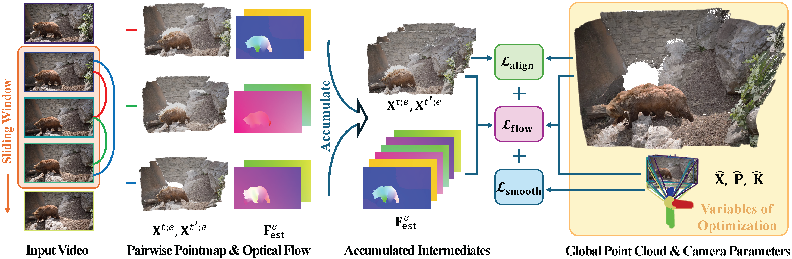

# MonST3R：运动场景下估计几何的一个简单方法

## 结论先行

- MonST3R 的核心主张是「**动态场景不需要显式运动模型**」：只要把 DUSt3R 的点图（pointmap）表示解释成 per-timestep 几何——即每一帧各自拥有一张在该时刻相机坐标系下的点图，运动物体自然会「在不同帧出现在不同位置」，无需为运动单独设计模块（证据：论文 Abstract 与 Sec 3，"a point cloud where dynamic objects appear at different locations, according to how they move"）。
- 方法极简且省数据：**冻结 DUSt3R 编码器，只微调解码器与预测头**，用四个以合成动态场景为主的小数据集（PointOdyssey / TartanAir / Spring / Waymo）就把静态几何模型「唤醒」到动态场景，验证了 DUSt3R 的几何先验本身已足够强，缺的只是动态标注（证据：Sec 4 训练细节 + Fig 3/4 数据与消融）。
- 下游用**全局对齐优化**把成对点图组装成 4D 场景，同时读出每帧相机位姿与视频深度；相机位姿用 PnP+RANSAC 于逐像素 2D-3D 对应（绕开被运动破坏的对极约束），并额外加**平滑损失**与**静态区域光流损失**两项时序正则（证据：Sec 3.3 与式的三项损失）。
- 视频深度上具竞争力：Bonn Abs Rel 0.063、KITTI 0.104，优于专用视频深度方法 DepthCrafter（0.075 / 0.110）与 CasualSAM；但在纹理稀薄的 Sintel 上 Abs Rel 0.335 落后 DepthCrafter 0.292（证据：论文 video depth 表，见 §4）。
- 相机位姿上属第一梯队：Sintel ATE 0.108（优于 CasualSAM 0.141），但在 TUM-dynamics 上 ATE 0.074 略逊于 CasualSAM 0.045——说明它在真实室内强动态序列上并非全面领先（证据：论文 camera pose 表）。
- 定位判断：MonST3R 是把「前馈点图重建」范式**扩展到动态/4D**的关键早期工作（DUSt3R 的动态版），但它仍属**离线 + 全局优化**路线；真正把动态处理做成在线流式的是稍后的 CUT3R 等。因此它是重要的承上启下节点，我判断**非 landmark**但影响力显著。
- 工程可用性：代码 + 训练代码 + 权重（Google Drive / HuggingFace）均已开源，**但许可为 CC BY-NC-SA 4.0，禁止商用**（证据：仓库 LICENSE 已核实为 "Creative Commons Attribution-NonCommercial-ShareAlike 4.0"）。

## 1. 这篇论文解决什么问题？

- 问题定义：从**动态视频**（含移动物体的单目视频）中估计逐时刻的稠密几何、相机位姿与视频深度，即 4D 重建。
- 输入 / 输出：输入是一段有序视频帧（或图像对）；输出是每帧在世界坐标系下的动态点云、逐帧相机内外参、逐帧深度图，以及动态/静态区域分割。
- 目标场景：真实世界带运动物体的视频（自动驾驶、手持拍摄、DAVIS 式野外片段）。
- 与现有方法的差异：传统动态重建走**多阶段管线**（先跑深度、光流、运动分割，再联合优化），组件多、误差累积重。DUSt3R 等前馈点图方法优雅但**假设场景静态**，运动物体会破坏成对几何一致性。MonST3R 的差异在于：不加运动模型，直接让点图表示「per-timestep 化」，用最小改动把静态前馈范式迁移到动态。

## 2. 方法概览

- 核心想法：DUSt3R 把两张图回归到同一坐标系下的两张点图；MonST3R 指出，只要允许「同一物体在不同帧的点图落在不同 3D 位置」，这套表示对动态场景**天然成立**——运动被隐式编码进坐标差异里，不需要显式运动场。
- 一句话 pipeline：`视频抽成重叠图像对 → 微调后的 DUSt3R 网络前馈出每对的 per-timestep 点图 → 全局对齐（对齐+平滑+光流三项损失）联合求解相机位姿与统一 4D 点云 → 读出视频深度 / 位姿 / 动静分割`。

### 2.1 架构解析

图：MonST3R 系统总览（动态全局点云 + 相机位姿估计）。图片来源：MonST3R 项目页 fig5_system.png（Zhang et al., MonST3R, arXiv:2410.03825, ICLR 2025）。

- 整体结构（模块分解）：
  - **共享 ViT 编码器**（来自 DUSt3R，训练时冻结）：把每张输入图编码成 patch token。
  - **两支交叉注意力解码器 + 点图预测头**（微调对象）：对一对帧 $(t, t')$ 输出两张对齐到帧 $t$ 坐标系的点图 $X^{t;t}$、 $X^{t';t}$ 及置信度。
  - **全局对齐后处理**（非网络，优化求解）：把所有成对点图拼接进统一世界坐标，反解逐帧相机位姿与深度。
- 各模块职责与数据流：网络部分与 DUSt3R 完全同构，改动只在「训练数据 + 微调哪些层」；真正为动态服务的新逻辑在下游优化里（平滑 + 光流约束）。
- 关键设计选择及理由：**只微调解码器/预测头、冻结编码器**——因为 DUSt3R 编码器已在海量静态数据上学到强几何特征，动态数据稀缺，全量微调易过拟合并遗忘几何先验；只调解码器足以让输出适配动态几何。

### 2.2 核心原理

- 为什么这样设计 work：DUSt3R 在静态场景失败于动态，并非几何能力不足，而是**训练分布里没有运动物体的一致标注**。MonST3R 用少量动态合成数据补上这块分布，模型即可把已有几何能力迁移过去（Fig 4 的数据消融支持这一点：加合成动态数据后动态区域几何显著改善）。
- 关键机制/归纳偏置：把「运动」交给**表示本身**去吸收——点图允许同一像素在不同帧映射到不同 3D 点，运动即坐标差；不引入光流网络、不做刚体分割，避免多阶段误差累积。
- 与前作在原理上的本质区别：DUSt3R 假设两图看的是同一静态场景，成对点图必须几何一致；MonST3R 放松这一假设，只要求**每帧内部**点图自洽，跨帧一致性由下游全局对齐（配光流/平滑正则）软性约束。

### 2.3 关键公式解析

> 论文核心公式在下游全局对齐目标（Sec 3.3）。以下按论文形式化，符号以论文记号为准。

- 全局对齐总目标（形式化）：
  $$ \min_{X, \sigma, P} \; \mathcal{L}_{\text{align}} + w_{\text{smooth}}\,\mathcal{L}_{\text{smooth}} + w_{\text{flow}}\,\mathcal{L}_{\text{flow}} $$
  - 符号： $X$ 为待求的全局点图集合， $P = \{P\_t\}$ 为逐帧相机位姿（含内参与外参）， $\sigma$ 为各成对预测的对齐尺度/权重； $w\_{\text{smooth}}$、 $w\_{\text{flow}}$ 为两项正则权重。
  - 作用：把网络前馈出的所有成对点图，联合优化成一套全局一致的 4D 点云 + 相机轨迹。

- 对齐损失 $\mathcal{L}_{\text{align}}$ （沿用 DUSt3R 全局对齐）：
  $$ \mathcal{L}_{\text{align}} = \sum_{e=(t,t')} \sum_{i} C^{t;e}_i \left\lVert \chi^{t}_i - \sigma_e\, P_t\, X^{t;e}_i \right\rVert $$
  - 符号： $e$ 遍历图像对（边）， $i$ 遍历像素； $X^{t;e}\_i$ 是在边 $e$ 上预测的帧 $t$ 点图， $\chi^{t}\_i$ 是待求的全局点图， $P\_t$ 把局部点图变换到世界系， $\sigma\_e$ 是该边尺度因子， $C^{t;e}\_i$ 是预测置信度。
  - 作用：让所有成对预测在置信度加权下对齐到同一世界坐标，是重建的主项。

- 相机平滑损失 $\mathcal{L}_{\text{smooth}}$：
  $$ \mathcal{L}_{\text{smooth}} = \sum_{t} \left( \lVert R_t^{\top} R_{t+1} - I \rVert_F + \lVert R_t^{\top}(\mathbf{t}_{t+1} - \mathbf{t}_t) \rVert \right) $$
  - 符号： $R\_t$、 $\mathbf{t}\_t$ 为第 $t$ 帧相机旋转与平移； $I$ 为单位阵； $\lVert\cdot\rVert\_F$ 为 Frobenius 范数。
  - 作用：惩罚相邻帧相机旋转/平移的突变，利用视频时序连续性稳住轨迹（对付动态场景下位姿抖动）。

- 静态区域光流损失 $\mathcal{L}_{\text{flow}}$：
  $$ \mathcal{L}_{\text{flow}} = \sum_{t} \sum_{i \in \mathcal{S}_t} \left\lVert f^{\text{cam}}_{t \to t+1}(i) - f^{\text{est}}_{t \to t+1}(i) \right\rVert $$
  - 符号： $\mathcal{S}_t$ 为第 $t$ 帧被判为**置信静态**的像素集合； $f^{\text{cam}}$ 是由当前几何/位姿反推出的相机运动诱导光流； $f^{\text{est}}$ 是现成光流网络估计的光流。
  - 作用：在静态区域强制「几何反推的光流」与「实测光流」一致，为位姿求解注入几何约束；动态像素被排除以免污染。静态掩码 $\mathcal{S}_t$ 由比较相机诱导光流与估计光流并阈值化得到。

### 2.4 训练与推理细节

- 训练目标 / 损失函数：网络训练沿用 DUSt3R 的置信度加权点图回归损失（confidence-aware regression），只在动态数据上微调解码器与头。
- 训练数据与规模：四个数据集混合——PointOdyssey（合成，约 200k 帧，含铰接/关节运动物体）、TartanAir（合成，约 1000k 帧）、Spring（合成，约 6k 帧）、Waymo（真实，约 160k 帧）；采用**非对称采样**偏向 PointOdyssey，并做视场（FoV）增强（不同尺度中心裁剪）以缓解合成/真实域差异。
- 推理流程与关键步骤：
  1. 视频抽帧、构造重叠图像对；
  2. 前馈得到每对 per-timestep 点图与置信度；
  3. 全局对齐优化（对齐 + 平滑 + 光流三项）联合求解位姿与全局点云；
  4. 相机位姿用逐像素 2D-3D 对应做 PnP+RANSAC（避开对极几何在动态场景失效）；
  5. 视频深度直接从点图 z 分量读出；动/静分割由光流残差阈值给出。

## 3. 关键贡献

1. 提出「动态场景无需显式运动模型」的观点，并证明 DUSt3R 的点图表示可直接解释为 per-timestep 几何以吸收运动。
2. 给出一个**数据高效**的微调配方（冻结编码器 + 少量以合成为主的动态数据），把静态前馈几何模型迁移到动态场景。
3. 设计含**相机平滑**与**静态区域光流一致性**的全局对齐，用统一框架同时输出视频深度、相机位姿与 4D 点云，避免多阶段管线。

## 4. 实验与证据

| 维度 | 内容 |
|---|---|
| 数据集 | 训练：PointOdyssey / TartanAir / Spring / Waymo；评测：Sintel、Bonn、KITTI（视频深度），Sintel、TUM-dynamics、ScanNet（相机位姿），DAVIS（定性 4D 重建） |
| Baseline | DepthCrafter、CasualSAM、Robust-CVD、DUSt3R、以及各任务专用方法 |
| 指标 | 视频深度 Abs Rel / δ<1.25；相机位姿 ATE / RPE-trans / RPE-rot |
| 主要结果 | 视频深度：Bonn 0.063、KITTI 0.104（优于 DepthCrafter 0.075 / 0.110）；Sintel 0.335（逊于 DepthCrafter 0.292）。相机位姿：Sintel ATE 0.108（优于 CasualSAM 0.141）；TUM-dynamics ATE 0.074（逊于 CasualSAM 0.045） |
| 消融 | 微调数据组合消融（Fig 4）：加入合成动态数据显著改善动态区域几何；FoV 增强与非对称采样对真实域泛化有帮助 |
| 失败案例 | 纹理稀薄/大范围运动的 Sintel 场景深度偏弱；真实强动态室内（TUM）位姿不及专用方法 |

### 4.1 效果与性能解析

- 主要结果解读：MonST3R 强在「用极简改动拿到跨任务竞争力」——单一前馈模型 + 一次全局优化，就在视频深度与位姿两个任务上逼近甚至超过各自的专用方法。它在 Bonn/KITTI 这类相机运动主导、动态占比中等的序列上最占优；而 Sintel（合成、纹理弱、大位移）和 TUM（真实室内强动态）暴露短板，说明其几何仍依赖 DUSt3R 先验覆盖的分布。
- 性能与效率：属**离线**方法，需对每对帧前馈再做全局优化，速度受全局对齐迭代拖累（后续 CUT3R 报告 MonST3R-GA 量级约 0.35 FPS，远慢于在线方法）；这是其范式代价。
- 消融揭示的关键因素：数据消融是全文最有信息量的部分——它把「DUSt3R 在动态上失败」明确归因于**训练分布缺动态标注**而非架构，支撑了「简单方法即可」的核心叙事。
- 与 SOTA / baseline 的可比性：评测协议对齐各任务标准 benchmark（Sintel/Bonn/KITTI/TUM），与 DepthCrafter、CasualSAM 同表可比；跨任务共用一模型是其相对专用方法的公平性亮点。

## 5. 局限与风险

- 论文明确承认：依赖现成光流网络提供静态区域约束，光流失败会传导；对大范围/快速运动与纹理稀薄场景鲁棒性有限。
- 我推断的风险：全局对齐是离线迭代优化，长视频扩展性与实时性差；成对处理 + 事后对齐的误差在长序列可能累积漂移。
- 工程落地风险：需要抽帧配对 + 光流 + 全局优化的组合流程，落地复杂度高于纯前馈单次读出模型（如 VGGT/CUT3R）。
- 许可证 / 数据风险：代码与权重许可为 **CC BY-NC-SA 4.0（禁止商用）**；训练混用 Waymo 等数据集，各自许可需单独遵守。

## 方法谱系

- 基于：[DUSt3R](../3d-reconstruction/2023-dust3r.md)（直接复用其点图表示、编码器与全局对齐框架，冻结编码器只微调解码器）

## 6. 与相似方法对比

- 详见流式/在线动态重建对比：[streaming-3d-reconstruction](../../comparisons/3d-reconstruction/streaming-3d-reconstruction.md)（MonST3R 代表「离线 + 全局对齐」的动态点图路线，与 CUT3R 等在线流式方法形成对照）。

| Method | 相同点 | 不同点 | 何时选它 |
|---|---|---|---|
| [DUSt3R](../3d-reconstruction/2023-dust3r.md) | 点图表示、共享编码器、全局对齐 | DUSt3R 假设静态场景，MonST3R 微调 + 时序正则支持动态 | 场景静态、只要成对/多视重建时选 DUSt3R |
| [CUT3R](../3d-reconstruction/2025-cut3r.md) | 同样处理动态/4D、同源于 DUSt3R 家族 | CUT3R 在线流式、持久状态、单次读出、免全局优化；MonST3R 离线 + 全局对齐 | 需在线/实时、长视频流式累积选 CUT3R |
| [VGGT](../3d-reconstruction/2025-vggt.md) | 前馈几何基础模型 | VGGT 单次前馈多视联合、更快更通用；MonST3R 专注动态 + 依赖后优化 | 多视静态大场景、追求吞吐选 VGGT |

## 7. 复现判断

- Git 地址：https://github.com/Junyi42/monst3r
- 是否开源：是（代码 + 训练代码）。
- 是否开源训练：是（README 含训练命令与 `prepare_training.md` 数据准备说明）。
- 代码可用性：高，基于 DUSt3R 代码库，生态成熟。
- 权重可用性：有，Google Drive 与 HuggingFace（`Junyi42/MonST3R_PO-TA-S-W_ViTLarge_BaseDecoder_512_dpt`）均可下载。
- 数据可获得性：训练数据（PointOdyssey/TartanAir/Spring/Waymo）均为公开数据集，但各有许可与体量成本；评测集为标准 benchmark。
- 预计环境成本：单卡即可推理；微调基于冻结编码器、数据量不大，成本远低于从头训练几何基础模型。
- 最小复现路径：装环境 → 下预训练权重 → 跑 demo 视频出 4D 点云/深度 → 按 `evaluation_script.md` 复现 Bonn/KITTI 视频深度与 Sintel 位姿数值。
- 是否值得复现：中等偏值得——作为「DUSt3R→动态」范式桥梁，复现成本低、学习价值高；但商用受 CC BY-NC-SA 4.0 限制。

## 8. 后续动作

- [ ] 更新 `indices/papers.md`
- [ ] 更新 `indices/directions.md`
- [ ] 更新 `comparisons/3d-reconstruction/streaming-3d-reconstruction.md`（补 MonST3R 作为离线动态基线）
- [ ] 若计划复现，创建 `reproductions/3d-reconstruction/monst3r/README.md`
