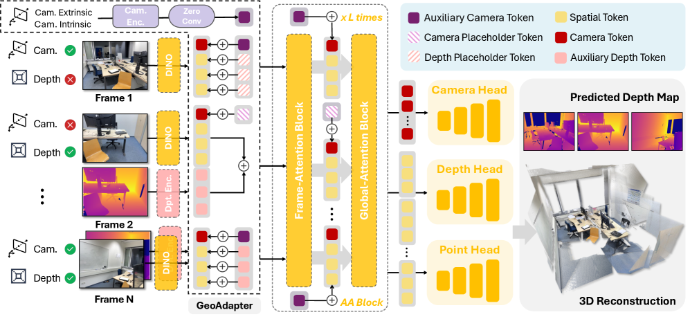
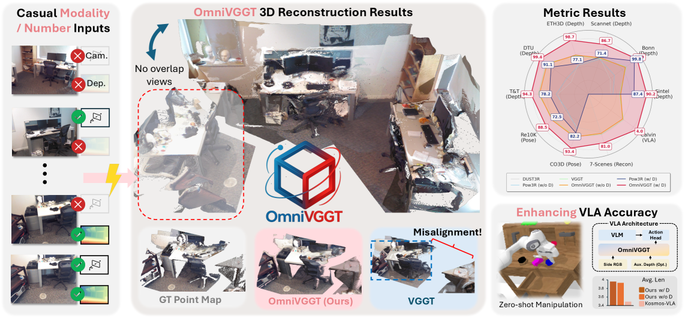

# OmniVGGT：全模态驱动的视觉几何基础 Transformer

## 结论先行
- OmniVGGT 回答的问题是「VGGT 只吃 RGB，那手头已有的深度图 / 相机标定 / 位姿这些几何先验怎么用上？」——它在**冻结的 VGGT 主干**外挂一个约 26.8M 参数的几何先验适配器 GeoAdapter，把任意数量、任意组合的深度 / 内参 / 外参先验注入网络，既不破坏原表征空间，又能按先验多寡单调提升精度（证据：论文架构节 + 消融，已联网核实 arXiv 2511.10560）。
- 效果上：纯 RGB 时它约等于/略优于 VGGT（Sintel 深度 AbsRel 0.250 vs VGGT 0.271）；一旦喂入先验则大幅涨点——CO3Dv2 相机位姿 AUC@30 从 88.4 升到 93.4（加内参+位姿），7-Scenes 重建 Accuracy 从 0.104 降到 0.036（加内参+位姿+深度）（证据：论文实验表，已核实数值量级）。
- 关键设计有二：（1）**GeoAdapter + 零初始化卷积（zero-conv）**——相机先验分支用 zero-conv 渐进注入、避免训练初期扰动预训练表征；深度分支实测不加 zero-conv（会抑制信息）而直接相加；（2）**随机多模态融合（stochastic multimodal fusion）**——训练时对每条序列随机采样有多少帧带相机先验、有多少帧带深度先验，另留 10% 纯 RGB batch，使推理期可任意缺省/组合模态而不过拟合到某个固定子集（证据：论文方法节，已核实）。
- 效率与 VGGT 同级（约 0.2s/场景），远快于同样吃先验的 Pow3R（约 30×）；主干冻结 + 只训适配器，训练成本明显低于从头训一个几何基础模型（推断：省去 backbone 重训）。
- 工程可用性好且许可宽松：代码 MIT、仓库已含训练脚本（`train_omnivggt.py` 等，但 README To-Do 标注训练代码/权重发布仍在推进）、权重指向 HuggingFace（`Livioni/OmniVGGT`），初始化自 VGGT 权重。定位是「给 VGGT 打的几何先验补丁 / 机器人友好增强」，并展示对 VLA（CALVIN 操作）的增益；不是 landmark 级新范式，而是 VGGT 谱系里务实的一步（推断）。

## 1. 这篇论文解决什么问题？
- 问题定义：VGGT 这类前馈几何基础模型只接受 RGB 图像，但真实系统里往往**已经有**部分几何先验——车载/机器人有标定内参、SLAM 有位姿、RGB-D 相机有深度。如何让一个模型「有先验就用、没先验也能跑」，并且先验越多越准？
- 输入 / 输出：输入 N 张 RGB 图像，外加**可选**的、逐帧可缺省的深度图 / 相机内参 / 相机外参（位姿）；输出与 VGGT 一致——每帧相机参数、深度图、点图、以及 3D 重建。
- 目标场景：室内/物体级多视图重建、有部分标定或深度传感的机器人与具身场景、以及作为 VLA（视觉-语言-动作）模型的 3D 感知前端。
- 与现有方法的差异：VGGT 纯 RGB、无法吃先验；Pow3R 把相机/深度先验注入 DUSt3R 但仍是成对 + 优化范式、且慢；OmniVGGT 在 VGGT 的单次前馈范式上做「任意模态、任意数量」的先验注入，且保持前馈速度。

## 2. 方法概览
- 核心想法：**不重训主干，只学怎么把先验塞进去**。把 VGGT 当作冻结的几何先验，用轻量适配器把外部几何模态编码成与 VGGT token 同构的「辅助 token」，以零初始化的方式渐进注入，从而在不损坏预训练表征的前提下获得先验带来的确定性增益。
- 一句话 pipeline：N 张图（+ 可选深度/相机先验）→ DINO patch token +（GeoAdapter 编码的辅助 token）→ 冻结的交替注意力主干（帧内 / 全局 × L）→ 相机头 / 深度头 / 点图头输出几何。

### 2.1 架构解析

- 整体结构（模块分解）：
  1. **冻结的 VGGT 主干**：DINO tokenizer + 相机 token + L+1 个交替注意力（AA）块 + 相机/深度/点图头，权重全部冻结，作为几何先验。
  2. **相机适配器（Camera Adapter）**：先把相机位姿相对第一帧归一化，再把内参 $K$ 与外参 $(R,t)$ 编码为 $\{q, t, f\}$ （四元数、平移、视场角）向量；每个 AA 块前有**层特定的相机编码器**，输出经**零初始化卷积（zero-conv）**后加到该层的相机 token 上。
  3. **深度适配器（Depth Adapter）**：把深度图按 batch 内均值深度归一化，拼上有效性掩码（validity mask），过一个卷积深度编码器，得到辅助深度 token，**直接相加**到空间 token（消融显示对深度加 zero-conv 反而抑制信息，故不加）。
  4. **占位 token（Placeholder Token）**：某帧缺某模态时，用可学习的相机/深度占位 token 顶替，保证输入形状一致、模型知道「此处无先验」。
- 各模块职责与数据流：图像 → DINO 空间 token；相机先验 →（层特定编码 + zero-conv）→ 逐层加到相机 token；深度先验 →（卷积编码）→ 加到空间 token；缺省处用占位 token；随后走冻结主干与三个头。适配器总开销约 26.8M 参数。
- 关键设计选择及理由：
  - **冻结主干、只训适配器**：把 VGGT 的通用几何表征当作不可动的先验，避免少量先验数据把大模型带偏，也大幅降低训练成本。
  - **相机分支用 zero-conv、深度分支不用**：zero-conv 初值为零，训练初期注入量为零、等于原 VGGT，随训练渐进「拧开」注入强度（ControlNet 式思路），对高度结构化的相机参数有效；但对稠密深度，实测 zero-conv 会压制信息，故直接相加。这是一个由消融驱动的非对称设计。
  - **相机 token 逐层注入 vs 深度一次注入**：相机是全局量、与每层的位姿推断都相关，逐层给；深度是稠密空间量，注入空间 token 一次即可。

### 2.2 核心原理
- 为什么这样设计 work：VGGT 已把「多视图几何一致性」内化进权重，先验的价值是**消除歧义**（尺度、坐标系、绝对深度）。用零初始化适配器注入，等价于在预训练解的邻域里做「先验条件化」的微调，既保留 VGGT 的泛化，又把可用的确定信息灌进去——所以纯 RGB 时不掉点、有先验时单调涨点。
- 关键机制 / 归纳偏置：
  - **零初始化渐进注入**：训练起点严格等价于原 VGGT，注入是「加法式扰动」，从零长出，避免灾难性遗忘。
  - **随机多模态融合训练**：先验的「有/无、多/少」在训练中被随机化，模型被迫学会「按现有先验条件化」而非「依赖固定先验组合」，这是它推理期能任意缺省模态的根因。
  - **模态归一化**：相机相对第一帧归一化、深度按 batch 均值归一化，把先验搬到与 VGGT 内部尺度兼容的表示空间。
- 与前作在原理上的本质区别：VGGT 是「纯 RGB → 几何」的固定映射；Pow3R 在 DUSt3R 上做先验注入但绑在成对 + 优化范式。OmniVGGT 把「先验条件化」做成主干之外的可插拔适配器，且用随机融合支持任意模态子集，是**前馈 + 任意先验**的组合。

### 2.3 关键公式解析

> 论文以架构/训练策略描述为主，几何量定义沿用 VGGT。此处对「随机多模态融合」的采样过程与注入形式做形式化，符号依据论文文字，标注为形式化表述。

- 形式化 (1) 零初始化渐进注入（相机分支）：
$$ c_i^{(l)} \leftarrow c_i^{(l)} + \operatorname{ZeroConv}\big(E_{\text{cam}}^{(l)}(a_i)\big) $$
  - 符号： $c\_i^{(l)}$ 第 $i$ 帧在第 $l$ 个 AA 块前的相机 token， $a\_i$ 该帧的相机先验（或占位 token）， $E\_{\text{cam}}^{(l)}$ 层特定相机编码器， $\operatorname{ZeroConv}$ 权重初始化为 0 的卷积。
  - 作用：训练初期 $\operatorname{ZeroConv}=0$，注入项为零、网络等价于原 VGGT；训练中卷积权重从零长出，渐进注入相机先验，避免破坏预训练表征。

- 形式化 (2) 深度分支直接注入：
$$ s_i \leftarrow s_i + E_{\text{depth}}\big([\,\bar{D}_i \,;\, m_i\,]\big) $$
  - 符号： $s\_i$ 第 $i$ 帧空间 token， $\bar{D}\_i$ 按 batch 均值归一化后的深度图， $m\_i$ 有效性掩码， $[\cdot\,;\cdot]$ 通道拼接， $E\_{\text{depth}}$ 卷积深度编码器。
  - 作用：把稠密深度先验编码后**直接**加到空间 token（不经 zero-conv，因消融显示 zero-conv 抑制深度信息）。缺省时 $\bar{D}\_i$ 用占位 token。

- 形式化 (3) 随机多模态融合采样：
$$ Q \sim \mathcal{U}\{0,\dots,S\},\quad O \sim \mathcal{U}\{0,\dots,S\},\quad P(\text{RGB-only})=0.1 $$
  - 符号： $S$ 序列长度， $Q$ 本次采样中带相机先验的帧数（分配给前 $Q$ 帧）， $O$ 带深度先验的帧数（随机分配）， $\mathcal{U}$ 均匀分布，另有 10% 概率整条序列纯 RGB。
  - 作用：训练时随机决定先验的数量与分布，使模型对「任意模态、任意帧数带先验」都鲁棒，是推理期可自由缺省先验的关键。

- 损失：沿用 VGGT 的多任务几何损失（相机 + 深度 + 点图 + 跟踪的组合，不确定度加权），此处不复述（见 [VGGT 分析](../3d-reconstruction/2025-vggt.md) 2.3）。

### 2.4 训练与推理细节
- 训练目标 / 损失函数：沿用 VGGT 多任务几何损失；训练对象仅 GeoAdapter（主干冻结），叠加随机多模态融合采样。
- 训练数据与规模：19 个公开数据集混合，含 ARKitScenes、BlendedMVS、DL3DV、ScanNet、ScanNet++、MegaDepth 等（数据预处理参考 CUT3R 流程）。
- 超参要点：从 VGGT 权重初始化；32× A100、约 10 天；头部学习率 2e-5、主干（适配器相关）1e-5；适配器约 26.8M 参数。
- 推理流程与关键步骤：单次前馈，可选择性地提供任意帧的深度 / 内参 / 位姿；缺省模态用占位 token。速度约 0.2s/场景，与原 VGGT 同级，约为同类先验注入方法 Pow3R 的 30×。

## 3. 关键贡献
1. 提出 GeoAdapter：在冻结的 VGGT 主干上，用零初始化（相机分支 zero-conv、深度分支直接相加）的轻量适配器（约 26.8M 参数）注入任意数量、任意组合的深度 / 内参 / 位姿先验，不破坏预训练表征。
2. 提出随机多模态融合训练策略：随机化先验的数量与分布 + 10% 纯 RGB，使同一模型在纯 RGB 与任意先验组合下都能前馈工作，并随先验增多单调涨点。
3. 在深度、多视图立体、相机位姿、稠密重建等多任务上取得强结果，纯 RGB 不逊于 VGGT，喂先验后大幅领先，且速度与 VGGT 同级、远快于 Pow3R。
4. 证明该几何前端可增强机器人 VLA（如 CALVIN 操作、零样本操作），把前馈几何模型接进具身智能管线。

## 4. 实验与证据
| 维度 | 内容 |
|---|---|
| 数据集 | 单目深度 Sintel / Bonn / NYU-v2；多视图深度 ScanNet / ETH3D / DTU / Tanks&Temples；相机位姿 RealEstate10K / CO3Dv2；重建 7-Scenes；VLA CALVIN。训练用 19 源混合 |
| Baseline | VGGT（纯 RGB 主干）、Pow3R（DUSt3R 上的先验注入）、DUSt3R 等 |
| 指标 | 深度 AbsRel / $\delta<1.25$；位姿 AUC@30；重建 Accuracy / Completeness / Normal Consistency |
| 主要结果 | Sintel 深度 AbsRel 0.250（无先验）→ 0.107（+深度），VGGT 0.271；Bonn 0.064 → 0.008（+深度）；位姿 AUC@30 Re10K 85.9 → 88.5（+内参+位姿），CO3Dv2 88.4 → 93.4；7-Scenes 重建 Acc/Comp/NC 0.104/0.112/0.763（无先验）→ 0.036/0.036/0.810（+内参+位姿+深度） |
| 消融 | 深度分支加 zero-conv 反而抑制信息（故不加）；随机多模态融合使任意模态组合鲁棒；先验越多越准（单调） |
| 失败案例 | 论文（推断）：先验本身有噪声/错标时的鲁棒性、强动态与长序列场景一致性未重点评估 |

（注：以上数值来自 arXiv 2511.10560 HTML 的实验表与图，已联网核实量级与方向；具体表格编号以论文为准。）

### 4.1 效果与性能解析

- 主要结果解读：OmniVGGT 的核心卖点不是「纯 RGB 更强」（它与 VGGT 基本持平，Sintel 略优），而是「**有先验就能确定性变强**」。7-Scenes 重建 Accuracy 从 0.104 掉到 0.036（近 3 倍）、CO3Dv2 位姿 88.4→93.4，说明当尺度/坐标系/绝对深度这些歧义被先验消除后，前馈模型的上限被显著抬高。这正是它相对 VGGT 的价值：把「实际系统里已有但被浪费的几何信息」变现。
- 性能与效率：约 0.2s/场景，与 VGGT 同级，且比同样注入先验的 Pow3R 快约 30×——因为 Pow3R 绑在成对 + 优化范式，而 OmniVGGT 是单次前馈；适配器仅约 26.8M 参数、主干冻结，训练成本远低于从头训基础模型。
- 消融揭示的关键因素：（1）相机分支用 zero-conv、深度分支不用——非对称注入是实测最优；（2）随机多模态融合是「任意缺省模态不崩」的关键；（3）先验数量与精度单调正相关，验证了「条件化而非依赖」的设计目标。
- 与 SOTA / baseline 的可比性：与 VGGT 共享主干与评测口径，纯 RGB 下同协议可比性强；先验设定下需注意「用了多少/哪些先验」这一关键变量，读者应按同一先验组合横比（论文以「w/ D」「w/ K+RT」等标注区分）。

## 5. 局限与风险
- 论文明确承认（推断）：设计上主干冻结，其能力上限受原 VGGT 表征约束；先验带来的增益依赖先验质量。
- 我推断的风险：先验本身含噪或错标（错误内参、漂移位姿、坏深度）时的鲁棒性未见重点评估，实际系统里这是常态；强动态、非刚性、超长序列场景的一致性延续 VGGT 的局限；论文未强调「真实 metric 尺度」保证，先验注入是否给出可靠绝对尺度需实测。
- 工程落地风险：仍需 VGGT 级 GPU 显存跑 1B+ 主干；先验对齐（把车载/SLAM 位姿、传感深度转成模型期望的归一化表示）需要一层工程适配。
- 许可证 / 数据风险：代码 MIT、论文 CC BY 4.0，许可较宽松（训练代码/权重发布据 README To-Do 仍在推进，待核验）；但权重初始化自 VGGT，需留意 VGGT 权重本身的非商用条款是否传导（推断风险：商用前应核实 VGGT-1B 权重血缘的许可约束，OmniVGGT 官方未见对此的显式声明）。

## 方法谱系
- 基于：[VGGT](../3d-reconstruction/2025-vggt.md)（冻结其主干作几何先验，外挂 GeoAdapter 注入深度/相机先验，从「纯 RGB 前馈」扩展为「任意先验条件化前馈」）

## 6. 与相似方法对比

> 横向对比见：[Any-view Visual Geometry Foundation Models](../../comparisons/3d-reconstruction/visual-geometry-foundation-models.md)、[前馈式三维重建方法对比（MapAnything / Pi3 / HunyuanWorld-Mirror / OmniVGGT）](../../reports/feedforward_3d_reconstruction_compare.md)。

| Method | 相同点 | 不同点 | 何时选它 |
|---|---|---|---|
| [VGGT](../3d-reconstruction/2025-vggt.md) | 同一交替注意力主干、前馈几何、~0.2s | VGGT 纯 RGB、不吃先验；OmniVGGT 冻结它并加先验适配器 | 只有 RGB、不需要先验时选 VGGT；有深度/标定/位姿可用时选 OmniVGGT |
| Pow3R | 同样注入相机/深度先验 | Pow3R 基于 DUSt3R 成对 + 优化、慢；OmniVGGT 前馈、约 30× 快、支持任意模态子集 | 需与 DUSt3R 管线兼容时看 Pow3R，否则 OmniVGGT |
| [MapAnything](../3d-reconstruction/2025-mapanything.md) | 都吃多种几何先验、面向真尺度/机器人 | MapAnything 目标真尺度、长序列、训练更完整；OmniVGGT 偏「VGGT 轻量先验补丁」，长序列非强项 | 自动驾驶/长序列/真尺度主干选 MapAnything；VGGT 生态内加先验选 OmniVGGT |
| [Pi3](../3d-reconstruction/2026-pi3.md) | 前馈多视图几何 | Pi3 去参考帧、permutation-equivariant、纯几何；OmniVGGT 有固定参考帧且强调先验注入 | 测输入顺序鲁棒性/reference-free 选 Pi3；条件化先验选 OmniVGGT |

## 7. 复现判断
- Git 地址：https://github.com/Livioni/OmniVGGT-official
- 是否开源：是（代码 MIT）。
- 是否开源训练：部分——仓库已含训练脚本（`train_omnivggt.py`、`train_utils.py`）、配置与数据准备说明（参考 CUT3R 预处理），但 README 的 To-Do 列表仍将「Release training code / pretrained models」标为进行中，完整训练资产可能尚未全部就位（待核验）。
- 代码可用性：推理 + 训练代码；项目页 https://livioni.github.io/OmniVGGT-official/ 。
- 权重可用性：指向 HuggingFace `Livioni/OmniVGGT`（`OmniVGGT.safetensors`）；README To-Do 仍将「Release pretrained models」标为进行中，正式权重是否全部就位以仓库为准（待核验）。
- 数据可获得性：19 个公开数据集组合，完整复现需自备各源并按 CUT3R 流程预处理。
- 预计环境成本：推理与 VGGT 同级（单卡可跑，需较大显存）；训练官方为 32× A100 × ~10 天，但因主干冻结、只训 26.8M 适配器，小规模微调/复现成本可控。
- 最小复现路径：clone 仓库 → 装依赖 → 下载 VGGT/OmniVGGT 权重 → 在自有多视图（可带深度/标定/位姿）上前馈推理，对比「有/无先验」的重建精度差。
- 是否值得复现：值得做推理级验证——尤其在「手头有部分先验」的机器人/室内场景，直接测「加先验涨多少」；从头训练非必要，除非改适配器结构或换先验模态。

## 8. 后续动作
- [ ] 更新 `indices/papers.md`
- [ ] 更新 `indices/directions.md`
- [ ] 更新对比：`comparisons/3d-reconstruction/visual-geometry-foundation-models.md` 与 `reports/feedforward_3d_reconstruction_compare.md`（OmniVGGT 已列入，可补入本文核实的数值）
- [ ] 若计划复现，创建 `reproductions/3d-reconstruction/omnivggt/README.md`
