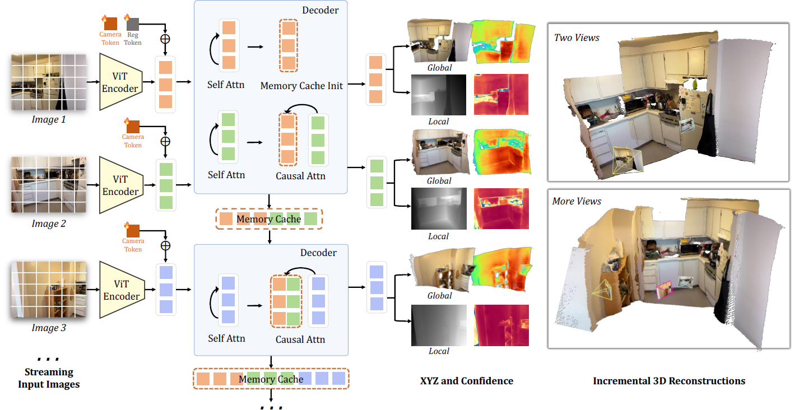
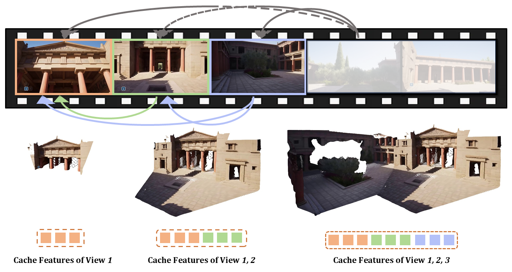

# STream3R: Scalable Sequential 3D Reconstruction with Causal Transformer

## 结论先行

- STream3R 把 DUSt3R 式的 pointmap 回归从「成对/全局对齐」重构成 **decoder-only 因果 Transformer**：每帧只对自身做 self-attention、对历史帧做 causal cross-attention，从而在视频帧顺序到达时**边流入边重建**，不需要昂贵的全局 BA，也不需要 recurrent 记忆压缩。
- 它的定位是 **streaming 3D reconstruction 的强 baseline**：在本仓库的 [streaming-3d-reconstruction 对比](../../comparisons/3d-reconstruction/streaming-3d-reconstruction.md)里，STream3R 是 Tanks & Temples 上最强的 baseline 之一（ATE 0.76），7-Scenes ATE（0.10）接近 LingBot-Map，是 LingBot-Map 论文选定的重点对照对象。
- 论文提供**两个初始化版本**：STream3Rα（从 DUSt3R 初始化，快，~23 FPS）与 STream3Rβ（从 VGGT 初始化，精度更高，~13 FPS）。这说明架构本身是「backbone-agnostic 的因果重排」，谁的几何先验强就吸收谁。
- 证据充分：**代码、训练代码、权重（HuggingFace `yslan/STream3R`）全部开源**，License 为 NTU S-Lab License 1.0（研究友好但**非标准商用许可**，落地需注意）。这是它比多数 streaming baseline 更值得复现的关键。
- 主要短板（推断 + 论文/对比数据）：**长序列绝对误差偏高**——在 Oxford Spires dense 上 Stream3R-w 的 ATE 33.73，虽退化小（ΔATE +0.70）但绝对精度明显落后 LingBot-Map（7.11）；因果单向注意力没有回看修正，长程漂移靠精度而非重定位来兜底。

## 1. 这篇论文解决什么问题？

- **问题定义**：给定一段**顺序到达**的 RGB 图像/视频帧，实时地、因果地预测每帧的稠密 pointmap（进而得到 depth、camera pose、点云），且要求在帧数增长时保持可控的计算与显存开销。
- **输入 / 输出**：输入是有序图像序列 $\{I\_1, \dots, I\_t\}$ ；输出是每帧在统一（首帧）坐标系下的 pointmap $X\_t \in \mathbb{R}^{H\times W\times 3}$ 及置信度，可导出 depth、相机内外参、全局点云。
- **目标场景**：在线视觉建图、视频深度/位姿估计、动态场景重建，以及需要「随来随算」而非「攒齐再全局优化」的机器人/AR 场景。
- **与现有方法的差异**：
  - 相比 **DUSt3R/MASt3R**（成对预测 + 全局对齐）：去掉了昂贵的全局优化，改成顺序因果推理，天然支持流式。
  - 相比 **VGGT**（一次性全局 attention 处理所有帧）：VGGT 是离线、双向、随帧数平方增长；STream3R 改成因果单向，支持增量、可用 KV cache、可滑窗，天然 streaming。
  - 相比 **CUT3R/Spann3R**（recurrent state / memory token）：不压缩历史成固定状态，而是像 LLM 一样对历史帧做 causal attention，规避了状态遗忘，并直接复用 LLM 训练/推理基建。

## 2. 方法概览

- **核心想法**：把「多视图 3D 重建」类比成「语言建模」——帧是 token，pointmap 预测是 next-token-style 的因果生成，用 decoder-only Transformer 的 causal attention 顺序处理。
- **一句话 pipeline**：每帧图像 → CroCo ViT 编码 → 单一 decoder 中做「帧内 self-attention + 对历史帧的 causal cross-attention」→ DPT 头回归 local/global pointmap → 首帧注入 register token 定义 canonical 坐标系。

### 2.1 架构解析

> 图片来源：STream3R, arXiv:2508.10893（项目页 pipeline 图）。

> 图片来源：STream3R, arXiv:2508.10893（项目页 teaser）。

- **整体结构（模块分解）**：
  1. **图像编码器**：24 层 CroCo ViT（沿用 DUSt3R 谱系的预训练几何先验）。
  2. **因果解码器**：12 层单解码器网络。每帧内部做 self-attention；跨帧只允许「看历史、不看未来」的 causal cross-attention。
  3. **预测头**：DPT-L 头，输出 local pointmap（帧自身坐标）与 global pointmap（首帧 canonical 坐标）及置信度。
  4. **Register token**：只加在**首帧**上，用于锚定全局 canonical 坐标空间，让后续帧的 global pointmap 有一致参考系。
- **各模块职责与数据流**：帧 $I\_t$ 编码为 token → 进入解码器与自身 token 做 self-attention → 与缓存的历史帧 key/value 做 causal cross-attention（这一步引入多视图几何约束）→ DPT 头解码出 $X\_t$ 。历史帧的 K/V 可缓存复用（KV cache），因此第 $t$ 帧只需算「当前帧 vs. 历史」而不必重算整段。
- **关键设计选择及理由**：
  - **因果单向注意力**：保证严格 online、可增量、可 KV cache——这是「流式」的根本。代价是无法用未来帧回修早期帧。
  - **两种初始化（α/β）**：α 从 DUSt3R 初始化偏速度，β 从 VGGT 初始化偏精度，验证方法与 backbone 解耦。
  - **滑动窗口注意力（sliding window）**：论文/仓库提供 causal full-attention 与 sliding-window 两种模式，后者把显存从随帧数增长（~45 GB@长序列）压到近似常数（~6.5 GB），换取长程上下文。

### 2.2 核心原理

- **为什么这样 work**：多视图重建的本质是「用已见视图约束当前视图的几何」。DUSt3R 用成对 + 全局对齐来做，VGGT 用全局双向 attention 一次性做。STream3R 观察到：如果坐标系锚定在首帧（register token），那么「当前帧对历史帧的 attention」就足以传播全局一致的几何，而无需看未来——这使问题天然可因果分解。
- **关键机制/归纳偏置**：
  - **canonical 首帧锚点**：把全局坐标一致性问题转化为「所有帧对齐到首帧」，避免每帧独立漂移。
  - **causal cross-attention 传播几何**：历史帧作为「上下文」为当前帧提供多视图约束，等价于隐式的增量对齐。
  - **LLM 式训练基建复用**：因果 decoder 结构可直接套用大模型的并行训练/KV-cache 推理，利于 scale。
- **与前作的本质区别**：DUSt3R 的一致性来自**显式全局优化**；VGGT 来自**离线双向 attention**；STream3R 来自**因果上下文 + 首帧锚点**——把「全局一致」摊销进顺序推理里。

### 2.3 关键公式解析

> 论文核心是架构重构而非新的闭式公式；下面把注意力掩码与训练目标形式化，并注明属于「形式化表述」。

- **因果注意力掩码（形式化）**：第 $t$ 帧的 token 只能 attend 到帧序号 $\le t$ 的 key：

$$
\mathrm{Attn}(Q_t, K_{1:t}, V_{1:t}) = \mathrm{softmax}\!\left(\frac{Q_t K_{1:t}^{\top}}{\sqrt{d}} + M\right) V_{1:t}
$$

  - 符号： $Q\_t$ 是第 $t$ 帧 query； $K\_{1:t}, V\_{1:t}$ 是第 1 到 $t$ 帧的 key/value（历史 + 当前）； $d$ 是注意力维度； $M$ 是因果掩码，未来位置 $M\_{ij}=-\infty$ 、其余为 $0$ 。
  - 作用：强制「只看历史」，保证流式 + 可 KV cache；这是把 VGGT 的全局双向 attention 改成 online 的关键一步。

- **训练目标（confidence-aware pointmap 回归，沿用 DUSt3R 形式）**：

$$
\mathcal{L} = \sum_{t}\sum_{i} \left( C_t^{i}\,\big\| \hat{X}_t^{i} - X_t^{i} \big\| - \alpha \log C_t^{i} \right)
$$

  - 符号： $\hat{X}\_t^{i}$ 是第 $t$ 帧像素 $i$ 的预测 3D 点（首帧坐标系下，通常带尺度归一化）； $X\_t^{i}$ 是 GT； $C\_t^{i}$ 是网络预测的置信度； $\alpha$ 是正则权重， $-\log C$ 项防止置信度塌成 0。
  - 作用：让模型对纹理弱/遮挡/动态区域自动降权，是 DUSt3R 系稳定训练的标准配方。

> 说明：以上为对方法的形式化表述，具体 loss 权重、尺度归一化细节以原文/代码为准。

### 2.4 训练与推理细节

- **训练目标 / 损失函数**：confidence-aware pointmap 回归（local + global），沿 DUSt3R 谱系。
- **训练数据与规模**：**29 个数据集**混合，含 Co3Dv2、ScanNet++、ScanNet、HyperSim、Dynamic Replica、DL3DV 等（静态 + 动态兼顾）。batch size 64，**400K 迭代，8×A100 训练约 7 天**。
- **推理流程**：帧顺序进入，编码 → 因果解码（复用历史 KV cache）→ DPT 头出 pointmap；可选 causal full-attention（精度高、显存随帧数增长）或 sliding-window（显存近似常数）。
- **速度**（A100）：STream3Rα ~23.48 FPS，STream3Rβ ~12.95 FPS；7-Scenes 重建 ~20.12 FPS。显存（H200）：causal 5.49–45.41 GB（随帧数），sliding window ~6.53 GB（近似恒定）。

## 3. 关键贡献

1. **范式重构**：首次把多视图 pointmap 预测明确表述为 decoder-only 因果 Transformer 问题，让 3D 重建直接复用 LLM 式训练/推理基建（KV cache、并行训练、可 scale）。
2. **流式 + 可控显存**：因果注意力 + 滑动窗口，使显存可从随帧数增长压到近似常数，兼顾在线延迟与长序列。
3. **backbone 解耦的强 baseline**：α（DUSt3R init）/β（VGGT init）两版本证明方法可吸收不同几何先验，并在静态与动态 benchmark 上一致超过多个前作。
4. **完整开源**：代码、训练代码、权重齐备，成为 streaming 3D reconstruction 领域可复现、可对照的坚实 baseline。

## 4. 实验与证据

| 维度 | 内容 |
|---|---|
| 数据集 | Sintel、Bonn、KITTI（视频深度）；Sintel、TUM-dynamics、ScanNet（位姿）；7-Scenes、NRGBD（多视图重建） |
| Baseline | DUSt3R、MASt3R、VGGT、CUT3R、Spann3R 等 |
| 指标 | Abs Rel、δ<1.25、ATE / RPE_trans / RPE_rot、Accuracy/Completion/Normal-Consistency、FPS |
| 主要结果 | Bonn 深度 Abs Rel 0.069（β）；KITTI 0.080（β）；ScanNet 位姿 ATE 0.052（β）；NRGBD 多视图 Acc 0.057 / Comp 0.028 / NC 0.910 |
| 消融 | α vs β 初始化对比；causal full vs sliding-window（显存/精度权衡） |
| 失败案例 | 长序列绝对精度落后于专门的 streaming SOTA（见 Oxford Spires dense） |

> 数值说明：STream3R 原文自报数值（Bonn/KITTI/Sintel depth、ScanNet/TUM pose、NRGBD/7-Scenes recon）来自 arXiv HTML(2508.10893) 抓取；GitHub README 公开表格仅覆盖 NRGBD 重建项（已交叉核对），其余深度/位姿/速度数未在 README 二次核实，个别小数可能随版本微调。

### 4.1 效果与性能解析

- **视频深度**：STream3Rβ 在 Bonn（0.069 Abs Rel / 95.2% δ<1.25）、KITTI（0.080 / 94.7%）都很强；Sintel（动态、含大位移）Abs Rel 0.264 明显高于室内 benchmark，反映动态/大运动仍是难点，但相对 α（0.478）大幅改善——VGGT 先验对动态更有利。
- **相机位姿**：online 设定下 TUM-dynamics ATE 0.026、ScanNet ATE 0.052，在**不做全局 BA 的因果模型**里属于第一梯队；这说明首帧锚点 + causal 上下文足以维持中短序列一致性。
- **多视图重建**：NRGBD Acc 0.057 / Comp 0.028 / NC 0.910，达到该 benchmark 的 SOTA 级别。
- **性能与效率**：α ~23 FPS、β ~13 FPS，满足准实时；sliding-window 把显存压到 ~6.5 GB 近似恒定，是它敢做长序列的工程底气。
- **消融关键因素**：初始化 backbone（DUSt3R vs VGGT）是精度/速度的主开关；注意力模式（causal vs sliding）是显存/长程一致性的主开关。
- **与 SOTA / baseline 的可比性**：在本仓库对比中，STream3R 于 Tanks & Temples（ATE 0.76）是最强 baseline 之一、7-Scenes（0.10）接近 LingBot-Map；但 **Oxford Spires dense** 长序列上 Stream3R-w ATE 33.73（LingBot-Map 7.11），绝对精度差距明显——退化小（ΔATE +0.70）但起点误差高。协议一致性：这些数值来自 LingBot-Map 论文的统一表，尚未独立复跑（见 §7 与不确定性）。

## 方法谱系

- 基于：[DUSt3R](../3d-reconstruction/2023-dust3r.md)（pointmap 回归 + confidence loss 的谱系源头，α 版本从其初始化）
- 基于：[VGGT](../3d-reconstruction/2025-vggt.md)（全局 attention 多视图 backbone，β 版本从其初始化；STream3R 把其双向 attention 改造为因果流式）

## 6. 与相似方法对比

- 横向对比见：[`comparisons/3d-reconstruction/streaming-3d-reconstruction.md`](../../comparisons/3d-reconstruction/streaming-3d-reconstruction.md)（STream3R 在其中作为 Tanks & Temples 最强 baseline 之一、LingBot-Map 的重点对照）。
- 相关基础模型对比：[`comparisons/3d-reconstruction/visual-geometry-foundation-models.md`](../../comparisons/3d-reconstruction/visual-geometry-foundation-models.md)。

| Method | 相同点 | 不同点 | 何时选它 |
|---|---|---|---|
| DUSt3R | pointmap + confidence 回归 | DUSt3R 成对 + 全局对齐、离线；STream3R 因果流式、无全局 BA | 只需两图/离线高质量对齐时选 DUSt3R |
| VGGT | 多视图 Transformer 直出几何 | VGGT 全局双向、离线、随帧数平方增长；STream3R 因果单向、可增量/KV cache | 离线一次性重建选 VGGT；在线流式选 STream3R |
| CUT3R | 顺序处理视频 | CUT3R 用 recurrent state（会遗忘）；STream3R 用 causal attention（保留历史 K/V） | 显存极紧、可容忍遗忘选 CUT3R；要历史一致性选 STream3R |
| LingBot-Map | streaming pose + depth + 点云 | LingBot-Map 有 GCA（anchor+window+trajectory memory），长序列绝对精度更高 | 超长视频/机器人实时建图选 LingBot-Map；需要可复现 causal baseline 选 STream3R |

## 7. 复现判断

- **Git 地址**：<https://github.com/NIRVANALAN/STream3R>
- **是否开源**：是。
- **是否开源训练**：是——README 含完整 Training 章节（数据准备、配置、启动命令 `python stream3r/train.py experiment=stream3r/stream3r`）。
- **代码可用性**：高，推理/训练/评测脚本齐全。
- **权重可用性**：高，HuggingFace `yslan/STream3R` 自动下载（含 α/β）。
- **数据可获得性**：中——推理即用；完整复训需拉取 29 个数据集，工程量大。
- **预计环境成本**：推理单卡（A100/H200，sliding-window ~6.5 GB，long causal 需更大显存）；完整复训 8×A100 约 7 天。
- **最小复现路径**：装环境 → 下载 `yslan/STream3R` 权重 → 跑官方 demo/推理脚本 → 在 7-Scenes 或自有短视频上验证 depth/pose/点云，记录 FPS 与显存。
- **是否值得复现**：**值得**。它是 streaming 3D reconstruction 里少见的「全开源 + 强 baseline + 兼容 LLM 基建」组合，适合作为本仓库 streaming 方向的可控对照与二次开发底座。注意 License 为 NTU S-Lab 1.0（研究友好、商用需谨慎核对条款）。

## 8. 后续动作

- [x] 更新 `indices/papers.md`
- [x] 更新 `indices/directions.md`
- [x] 已在 `comparisons/3d-reconstruction/streaming-3d-reconstruction.md` 中作为 baseline 引用（可回填 Git/License/训练开源状态）
- [ ] 若计划复现，创建 `reproductions/3d-reconstruction/stream3r/README.md`

## Sources

- 论文：<https://arxiv.org/abs/2508.10893>（STream3R: Scalable Sequential 3D Reconstruction with Causal Transformer，2025-08-14 首发，cs.CV）
- arXiv HTML：<https://arxiv.org/html/2508.10893>
- OpenReview（ICLR 2026）：<https://openreview.net/forum?id=RTTYGeC2Io>
- 项目页：<https://nirvanalan.github.io/projects/stream3r/>
- 代码：<https://github.com/NIRVANALAN/STream3R>（License: NTU S-Lab License 1.0，含训练代码）
- 权重：HuggingFace `yslan/STream3R`
- 关联对比：[`comparisons/3d-reconstruction/streaming-3d-reconstruction.md`](../../comparisons/3d-reconstruction/streaming-3d-reconstruction.md)
