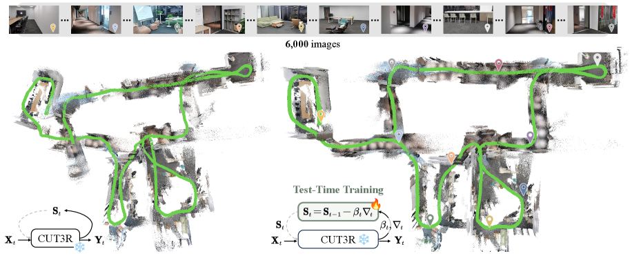
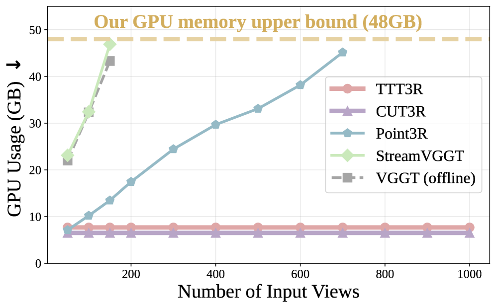

# TTT3R：把 3D 重建看作测试时训练

## 结论先行

- TTT3R 不是一个新网络，而是对 CUT3R 这类**循环状态式流式重建模型**的一个**免训练（training-free）推理期干预**：把「每来一帧就更新内部状态」重新读成一步在线梯度下降，用**对齐置信度**决定这一步该更新多少。
- 核心机制是**逐 token 自适应学习率 $\beta_t$** ：由状态查询与当前帧键之间的注意力对齐分数经 sigmoid 得到，高置信匹配放大更新、低质量观测被软门控抑制，从而缓解长序列的**状态遗忘 / 长度泛化失败**。
- 效果上，作者报告在长序列全局位姿估计上相对基线约 **2× 提升**，同时保持流式模型的招牌优势：**约 20 FPS、约 6 GB 显存处理数千帧、显存恒定**。
- 代价与定位：它继承 CUT3R 的能力上界，不改变短序列精度天花板；本仓库横评（见 [`streaming-3d-reconstruction.md`](../../comparisons/3d-reconstruction/streaming-3d-reconstruction.md)）显示 TTT3R 在 Oxford Spires dense 上 **FPS 高（28.97）但长程轨迹落后 LingBot-Map**（ATE dense 25.05 vs 7.11）。
- 复现友好度高：基于 CUT3R 权重 + 一段状态更新规则，无需重训；许可证为非商用（继承 CUT3R 的 CC BY-NC-SA）。

> 证据边界：本文标题/年份/venue/arXiv id/代码/许可证/核心公式与 20 FPS·6 GB·2× 等口径来自官方项目页、GitHub、arXiv HTML（已核实）。逐数据集 ATE 具体数值论文正文表格未完整取到，本文只在有把握处给数，其余标注为推断或引用横评表。

## 1. 这篇论文解决什么问题？

- **问题定义**：以 CUT3R 为代表的循环式 3D 基座模型用一个固定大小的隐状态在线累积几何信息，理论上支持任意长的图像流。但它们训练时只见过较短上下文（如几十帧），在**远超训练长度**的序列上会出现**状态遗忘 / 漂移**——长度泛化（length generalization）失败，全局位姿显著退化。
- **输入 / 输出**：输入是 RGB 图像流（视频或有序图像集）；输出是逐帧相机位姿、视频深度、度量尺度点图 / 点云。与 CUT3R 完全一致，TTT3R 不改变 I/O 契约。
- **目标场景**：长视频、机器人 / 自动驾驶在线视觉建图等需要**因果、恒定显存、长程一致**的流式重建。
- **与现有方法的差异**：不同于「换更强 backbone」或「加窗口 / 缓存」（如 Stream3R、Wint3R），TTT3R **不重训、不加参数**，只把状态更新规则替换成一条由观测置信度调制的在线学习步，属于**即插即用的推理期改造**。

## 2. 方法概览

- **核心想法**：循环模型的「状态更新」本质上是一次在线学习。既然是学习，就该有**学习率**；而好的学习率应当取决于**当前观测和已有记忆有多契合**——契合就多学，噪声 / 无关就少学。
- **一句话 pipeline**：沿用 CUT3R 前向；在每一步状态更新时，用状态-观测的注意力对齐分数算出逐 token 学习率 $\beta_t$ ，以此加权地把新观测写进状态，替换掉原本「无差别写入」的更新。

### 2.1 架构解析

> 图片来源：TTT3R 项目页 / arXiv:2509.26645（Chen et al., ICLR 2026）。

- **整体结构**：TTT3R = CUT3R 基座（ViT 编码器 + 双分支解码器 + 持久隐状态 $\mathbf{S}$ ）+ 一个改写后的**状态更新算子**。网络权重、tokenizer、读出头全部不变。
- **各模块职责与数据流**：
  - 编码器把当前帧 $I\_t$ 编码为观测 token（含 key $\mathbf{K}\_{\mathbf{X}\_t}$ 、value $\mathbf{V}\_{\mathbf{X}\_t}$ ）。
  - 状态 $\mathbf{S}\_{t-1}$ 生成查询 $\mathbf{Q}\_{\mathbf{S}\_{t-1}}$ ，与观测做**对齐**得到置信度，进而算出逐 token 学习率 $\beta\_t$ 。
  - 用 $\beta\_t$ 门控地把观测写入，得到 $\mathbf{S}\_t$ ；再由 CUT3R 的读出头输出该帧的位姿 / 深度 / 点图。
- **关键设计选择及理由**：把更新解释为「梯度下降 + 学习率」而非「固定权重的交叉注意力写入」，让模型在**长序列**里能自动区分「该记住的可靠观测」与「该忽略的低质量观测」，这正是遗忘的根源所在。

> 图片来源：TTT3R 项目页 / arXiv:2509.26645。示意长序列下均匀写入导致的记忆退化与自适应门控的对比。

### 2.2 核心原理

- **为什么这样设计 work**：CUT3R 原始更新对每个观测 token 用同一套 softmax 权重写入状态，序列一长，海量中等质量观测会持续稀释早期的可靠几何，等价于「学习率恒定且偏大」的在线学习——必然遗忘。TTT3R 用**对齐置信度**当学习率：状态里已经解释得很好的内容对应高对齐（可看作低残差），少更新；真正带来新信息或高置信匹配的观测多更新。这在**不改变表达能力**的前提下改善了记忆的稳定—可塑性权衡。
- **关键机制 / 归纳偏置**：把「注意力对齐分数」直接当作「更新可信度」，是本文最强的归纳偏置——它假设 attention 分数能作为观测质量的代理。这与关联记忆 / 线性注意力 / Titans 一类「把 forward 视作在线优化」的近期思路一脉相承。
- **与前作在原理上的本质区别**：CUT3R 是「学到的固定更新规则」；TTT3R 是「显式的、数据自适应的在线学习步」。前者的更新强度写死在权重里，后者在推理时按当前观测动态调节。

### 2.3 关键公式解析

> 以下公式据 arXiv HTML 概括，符号沿用论文（ $\mathbf{S}$ 状态、 $\mathbf{X}_t$ 第 $t$ 帧观测、 $\mathbf{Q/K/V}$ 查询 / 键 / 值）。逐数值细节以原文为准。

- 公式（TTT 视角，更新即梯度下降）：
$$ \mathbf{S}_t = \mathbf{S}_{t-1} - \beta_t \, \nabla \ell(\mathbf{S}_{t-1}, \mathbf{X}_t) $$
  - 符号： $\mathbf{S}\_t$ 为第 $t$ 步隐状态； $\beta\_t$ 为该步学习率； $\nabla \ell$ 为「记忆重构损失」对状态的梯度。
  - 作用：把循环状态更新统一到在线学习框架，学习率 $\beta_t$ 成为可调旋钮。

- 公式（线性 TTT 的梯度形式）：
$$ \nabla \ell(\mathbf{S}_{t-1}, \mathbf{X}_t) = (\mathbf{S}_{t-1}\mathbf{K}_{\mathbf{X}_t} - \mathbf{V}_{\mathbf{X}_t})\,\mathbf{K}_{\mathbf{X}_t}^{\top} $$
  - 符号： $\mathbf{K}\_{\mathbf{X}\_t}, \mathbf{V}\_{\mathbf{X}\_t}$ 为当前帧观测的键 / 值； $\mathbf{S}\_{t-1}\mathbf{K}\_{\mathbf{X}\_t}$ 是用旧状态去「预测」观测值。
  - 作用：残差 $(\mathbf{S}_{t-1}\mathbf{K}_{\mathbf{X}_t} - \mathbf{V}_{\mathbf{X}_t})$ 越大说明旧状态越解释不了新观测，梯度就越大——这把「重构误差」变成了更新的驱动力。

- 公式（自适应逐 token 学习率）：
$$ \beta_t = \sigma\!\Big( \textstyle\sum_{m} \mathbf{Q}_{\mathbf{S}_{t-1}} \mathbf{K}_{\mathbf{X}_t}^{\top} \Big), \quad \mathbf{Q}_{\mathbf{S}_{t-1}} \mathbf{K}_{\mathbf{X}_t}^{\top} \in \mathbb{R}^{n \times (h \times w)},\ \ \beta_t \in \mathbb{R}^{n \times 1} $$
  - 符号： $\mathbf{Q}\_{\mathbf{S}\_{t-1}}$ 为状态查询（ $n$ 个状态 token）， $\mathbf{K}\_{\mathbf{X}\_t}$ 为观测键（ $h\times w$ 个图像 token）；两者内积得到对齐矩阵，沿观测维求和（ $\sum\_m$ ）得到每个状态 token 的总对齐度，再过 sigmoid $\sigma(\cdot)$ 归一到 $(0,1)$ 。
  - 作用：把「状态与观测的对齐置信度」映射为**逐状态 token 的更新强度**。高对齐 → $\beta\_t$ 大 → 多写入；低对齐（噪声 / 无关帧）→ $\beta\_t$ 小 → 软门控抑制。这是全文最核心的一步。

- 公式（最终 TTT3R 更新）：把上式 $\beta_t$ 代回第一式，得到置信度门控的状态写入，替换 CUT3R 原始的均匀交叉注意力更新。整个过程**不引入可训练参数**，仅重用已有 $\mathbf{Q/K/V}$ 投影。

### 2.4 训练与推理细节

- **训练目标 / 损失函数**：TTT3R 本身**不训练**。它复用 CUT3R 预训练权重（checkpoint `cut3r_512_dpt_4_64.pth`，在 4–64 视图上训练），只在推理期改更新规则。
- **训练数据与规模、超参要点**：无重训；关键推理超参是 `reset_interval`（状态重置间隔，仓库示例用 50 / 100）与 `frame_interval`，用于控制长序列下的状态刷新节奏。
- **推理流程与关键步骤**：逐帧前向 → 算对齐矩阵 → 求 $\beta_t$ → 门控写入状态 → 读出该帧几何；显存恒定，作者报告约 20 FPS、约 6 GB 显存可处理数千帧。

## 3. 关键贡献

1. **视角贡献**：首次把 CUT3R 式循环 3D 重建的状态更新明确形式化为**测试时训练 / 在线学习**，为「流式重建的遗忘问题」提供了一个优化视角的解释。
2. **方法贡献**：提出由**对齐置信度**驱动的**逐 token 自适应学习率** $\beta_t$ ，作为免训练、零新增参数的即插即用干预。
3. **实用贡献**：在保持流式模型 20 FPS / 6 GB / 恒定显存优势的同时，长序列全局位姿约 2× 提升，且直接复用现成权重，落地成本极低。

## 4. 实验与证据

| 维度 | 内容 |
|---|---|
| 数据集 | 7-Scenes、NRGBD、TUM-dynamics、Sintel（据 arXiv HTML 与附录 C） |
| Baseline | CUT3R（主要对照）、StreamVGGT 等流式模型 |
| 指标 | 相机位姿 ATE / RPE、视频深度 Abs-Rel、重建 Accuracy/Completion、FPS、显存 |
| 主要结果 | 长序列全局位姿相对基线约 2× 提升；约 20 FPS、约 6 GB 处理数千帧、显存恒定 |
| 消融 | 自适应 $\beta_t$ vs 固定学习率 / 原始 CUT3R 更新（论文正文，未取到全部数值） |
| 失败案例 | 短序列精度受 CUT3R 上界限制；极长 / 复杂序列仍落后于带显式记忆结构的 LingBot-Map（见横评） |

### 4.1 效果与性能解析

- **主要结果解读**：2× 提升集中在**长序列全局位姿**，符合方法动机——干预点正是长度泛化 / 遗忘。短序列上 TTT3R 与 CUT3R 接近，因为遗忘问题不显著、 $\beta_t$ 的调节空间小。这说明 TTT3R 的价值是「把已有模型的长程稳定性补齐」，而非提升单帧几何天花板。
- **性能与效率**：核心卖点是**恒定显存**下的高吞吐（约 20 FPS / 6 GB），相对 StreamVGGT 这类显存随长度线性增长的方法有结构性优势； $\beta_t$ 只是一次额外的注意力约减，几乎不增开销。
- **消融揭示的关键因素**：自适应学习率相对固定学习率的增益，是「置信度作为更新门控」这一假设成立与否的直接证据；论文以此支撑核心主张（具体数字待原文核实）。
- **与 SOTA / baseline 的可比性**：本仓库横评 [`streaming-3d-reconstruction.md`](../../comparisons/3d-reconstruction/streaming-3d-reconstruction.md) 引 LingBot-Map 统一 benchmark：Oxford Spires dense 上 TTT3R ATE sparse/dense = 19.35 / 25.05、FPS 28.97；多数据集 pose ATE：ETH3D 1.22、7-Scenes 0.10、Tanks&Temples 0.66；点云 F1：ETH3D 68.48、7-Scenes 77.25、NRGBD 53.55。定位为「FPS 高但长程轨迹落后」的强 baseline，而非新 SOTA。（该横评数值来自第三方统一表，协议可能与原文不同，标注为引用。）

## 5. 局限与风险

- **论文明确承认**：TTT3R 受 CUT3R 能力上界约束，不改变短序列精度天花板；是缓解遗忘而非彻底消除。
- **我推断的风险**：把 attention 对齐分数当观测质量代理，在纹理退化 / 强动态 / 大视角跳变时可能失真，导致 $\beta_t$ 误判；`reset_interval` 是需要按场景调的敏感超参。
- **工程落地风险**：长程一致性仍不及带显式 anchor/trajectory memory 的方法（LingBot-Map），闭环 / 回环场景无显式约束。
- **许可证 / 数据风险**：新增代码 MIT，但基座继承 CUT3R 的 **CC BY-NC-SA 4.0（非商用）**，商用受限；权重经 Google Drive 分发。

## 方法谱系

- 基于：[CUT3R](2025-cut3r.md)（复用其权重与循环状态架构，TTT3R 是其推理期状态更新的改造）
- 相关流式脉络（同问题不同解法）：[VGGT](2025-vggt.md)、[$\pi^3$](2026-pi3.md)、[LingBot-Map](2026-lingbot-map.md)

## 6. 与相似方法对比

| Method | 相同点 | 不同点 | 何时选它 |
|---|---|---|---|
| CUT3R | 同一循环状态架构与权重 | TTT3R 加自适应学习率门控更新，长序列更稳 | 长视频且已用 CUT3R，想免训练补长程稳定性 |
| LingBot-Map | 均为流式在线重建 | LingBot-Map 用显式 anchor+trajectory memory，长程 ATE 明显更好但训练未开源 | 追求长序列轨迹精度且可接受较重系统 |
| Wint3R / Stream3R | 均为 streaming baseline | 二者靠窗口 / 因果 attention，TTT3R 靠在线学习率 | 需要窗口 / 因果对照实验时 |

> 详见横向对比：[`comparisons/3d-reconstruction/streaming-3d-reconstruction.md`](../../comparisons/3d-reconstruction/streaming-3d-reconstruction.md)。

## 7. 复现判断

- **Git 地址**：<https://github.com/Inception3D/TTT3R>
- **是否开源**：是（推理 + 评测代码）。
- **是否开源训练**：`\\`——核心为免训练干预，无需训练代码；基座权重来自 CUT3R。
- **代码可用性**：高，README 给出 conda 环境、`--model_update_type ttt3r`、`reset_interval` 等运行参数。
- **权重可用性**：`cut3r_512_dpt_4_64.pth`，经 gdown / Google Drive 下载。
- **数据可获得性**：7-Scenes / NRGBD / TUM / Sintel 均为公开数据集。
- **预计环境成本**：低；单卡约 6 GB 显存即可流式推理，无需训练资源。
- **最小复现路径**：装环境 → 下 CUT3R 权重 → 用 `--model_update_type ttt3r --reset_interval 100` 跑一段长视频 → 对比开 / 关 TTT3R 的位姿漂移与 FPS。
- **是否值得复现**：值得，作为「免训练缓解流式遗忘」的低成本 sanity check 与 CUT3R 长程增强开关。

## 8. 后续动作

- [x] 更新 `indices/papers.md`
- [x] 更新 `indices/directions.md`
- [x] 已在 `comparisons/3d-reconstruction/streaming-3d-reconstruction.md` 中列为对比方法
- [ ] 若计划复现，创建 `reproductions/3d-reconstruction/ttt3r/README.md`
- [ ] 核实论文正文逐数据集 ATE/RPE 具体数值，回填第 4 节
