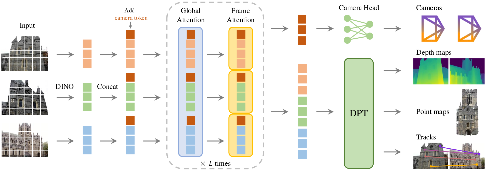
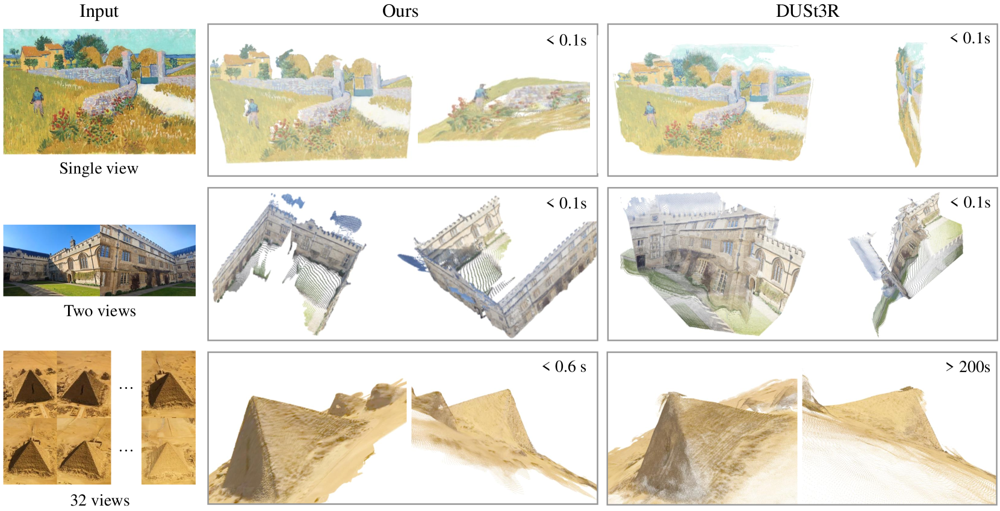
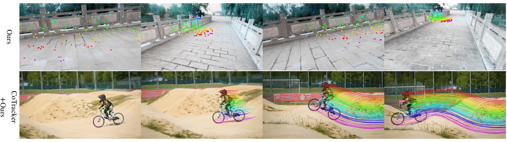

# VGGT：视觉几何基础 Transformer

## 结论先行
- VGGT 把多视图几何从「成对匹配 + 全局优化」范式，推进到「单次前馈大模型直接回归全部几何量」的范式：一个约 12 亿参数的 Transformer 同时输出相机内外参、深度图、点图和 3D 点轨迹，前馈推理约 0.2s（证据：论文 Table 1，前馈版 ~0.2s vs DUSt3R ~7s，运行时间在单张 H100 上测得，已联网核实）。
- 精度上它在无已知相机的设定下超过依赖优化的 DUSt3R/MASt3R：相机位姿 CO3Dv2 AUC@30 达 88.2（DUSt3R 76.7），ETH3D 点图 Overall（Chamfer）从 DUSt3R 的 1.005 降到 0.677（证据：Table 1/3，已联网核实）。
- 关键设计有二：（1）**交替注意力（alternating attention）**——逐帧自注意力与全局跨帧注意力交替堆叠 24 层，既跨图融合信息又保留帧内置换对称性、支持任意帧数；（2）**训练时把几何量归一化「学进」网络**——用第一帧相机作参考系、以点图平均欧氏距离为尺度归一化 GT，但不给网络归一化后的输入，强迫它自己学出该归一化，避免了 DUSt3R 式的后处理对齐（证据：论文 Sec. 3 归一化描述，已核实 L=24）。
- 工程可用性高：训练代码（2025-07-06 起）与 1B 权重均已开源，权重从 HuggingFace 自动下载；代码许可自 2025-07-29 起改为商用友好（排除军事用途），但原始 VGGT-1B 权重仍非商用，商用需申请 VGGT-1B-Commercial 权重（推断风险：权重许可审批是落地关键考量）。
- 定位为「几何基础模型」：预训练 backbone 可直接迁移到非刚性点跟踪、新视角合成等下游任务，并获 CVPR 2025 Best Paper Award（已联网核实，官方 README 与颁奖记录确认），是仓库内后续工作的本体（landmark）。

## 1. 这篇论文解决什么问题？
- 问题定义：给定 1 到数百张同场景图像，一次性推断完整 3D 场景属性——相机内外参、逐像素深度图、点图（point map）、以及跨帧可查询的 3D 点轨迹。
- 输入 / 输出：输入 N 张 RGB 图像（最大边 518 像素、可变长宽比）；输出每帧的 9D 相机参数（四元数旋转 + 平移 + 视场角）、深度图、点图及其不确定度图，以及可按查询点得到的 3D 点轨迹。
- 目标场景：静态/准静态多视图重建、SfM 替代、稠密重建、以及作为下游几何任务的通用 backbone。
- 与现有方法的差异：DUSt3R/MASt3R 只做成对点图回归 + 全局对齐优化，帧数增多时开销与误差累积上升；传统 SfM（COLMAP 等）依赖迭代 Bundle Adjustment、对纹理与初值敏感。VGGT 用单次前馈直接给出**全局一致**几何，去掉后处理优化环节（可选再叠加 BA 进一步提精度）。

## 2. 方法概览
- 核心想法：把多视图几何当作一个可端到端学习的**回归**问题，用大 Transformer 直接映射「图像集合 → 几何量集合」，而不依赖任何手工优化管线；把「保证多视图几何一致性」这件事交给数据 + 大模型的归纳能力，而非交给几何求解器。
- 一句话 pipeline：N 张图 → DINOv2 patch token → 每帧拼接可学习相机 token → 交替（全局注意力 / 帧内注意力）× L 层 → 相机头出位姿、DPT 稠密头出深度/点图/跟踪特征。

### 2.1 架构解析

- 整体结构（模块分解）：
  1. **Tokenizer（DINOv2）**：每张图 patch 化为 K 个 token，特征维 C=1024。
  2. **相机 token**：为每帧追加可学习的相机 token（外加区分「参考帧 / 其余帧」的两套嵌入），承载该帧位姿信息。
  3. **交替注意力主干（L=24 层）**：在「全局自注意力」（跨所有帧所有 token 联合注意）与「帧内自注意力」（每帧内部单独注意）之间逐层交替。
  4. **相机头（Camera Head）**：取主干输出的相机 token，再过 4 层自注意力 + 线性层，回归 9D 相机参数（4D 旋转四元数 + 3D 平移 + 2D 视场角）。
  5. **稠密头（DPT Head）**：把 image token 经 DPT 解码器还原成 C″×H×W 稠密特征图，再分支出：深度图 $D\_i$、点图 $P\_i$、各自的不确定度图 $\Sigma\_i^D / \Sigma\_i^P$，以及用于跟踪的 C 维跟踪特征 $T\_i$。
  6. **跟踪头（Tracking Head，CoTracker2 风格）**：给定查询点，在其位置采样跟踪特征，与其余帧特征做相关 + 自注意力，预测跨帧 2D 对应。
- 各模块职责与数据流：图像 → DINO token → 拼相机 token → 交替注意力 ×24 → 相机 token 进相机头出位姿 / image token 进 DPT 出稠密几何；跟踪头复用 DPT 产出的跟踪特征。约 12 亿参数。
- 关键设计选择及理由：
  - **用交替注意力而非交叉注意力**：帧内注意力做「每帧归一化 / 局部一致」，全局注意力做「跨帧信息融合」，交替即可获得跨图一致性，省掉昂贵的成对交叉注意力，天然支持 1~数百帧任意输入。
  - **一帧作参考坐标系**：所有几何量表达在第一帧相机坐标系下，打破排列对称性带来的歧义（否则「输出在哪个坐标系」无解）。
  - **点图既可专用头直出，也可由「深度 + 相机反投影」间接得到**：后者精度更高（见 2.4 与 4.1）。

### 2.2 核心原理
- 为什么这样设计 work：多视图几何一致性本质上是一组约束，传统做法用优化器显式求解（BA / 全局对齐）。VGGT 的赌注是——只要训练数据足够多样、模型足够大，Transformer 能把这些约束**隐式内化**为一次前馈映射，从而摆脱迭代优化的速度与鲁棒性瓶颈。实验证明这个赌注成立：前馈结果已超过带优化的前作。
- 关键机制 / 归纳偏置：
  - 交替注意力提供「帧内 vs 跨帧」两种归纳偏置的显式分工，比纯全局注意力更稳、比成对处理更省。
  - **归一化学进网络**：VGGT 在训练时用第一帧参考系 + 点图平均欧氏距离归一化 GT，但**不给网络归一化输入**，逼它自己预测出这个尺度。这消除了 DUSt3R 需要的后处理重归一化，也避免了训练不稳定。
  - 多任务联合监督（相机 + 深度 + 点图 + 跟踪）互为正则，共享 backbone 学到通用几何表征，使其可作为下游 backbone。
- 与前作在原理上的本质区别：DUSt3R 成对回归点图后必须靠全局对齐把多对拼成全局一致坐标系；VGGT 直接在网络内部一次性输出全局一致的多帧几何，优化环节从「必需」降级为「可选增益」。

### 2.3 关键公式解析

> 用 LaTeX；每个公式逐项解释符号含义，说明它在方法里起什么作用。

- 公式 (1) 总损失（已联网核实形式）：
$$ \mathcal{L} = \mathcal{L}_{\text{camera}} + \mathcal{L}_{\text{depth}} + \mathcal{L}_{\text{pmap}} + \lambda\,\mathcal{L}_{\text{track}} $$
  - 符号： $\mathcal{L}\_{\text{camera}}$ 相机参数损失， $\mathcal{L}\_{\text{depth}}$ 深度损失， $\mathcal{L}\_{\text{pmap}}$ 点图损失， $\mathcal{L}\_{\text{track}}$ 跟踪损失，权重 $\lambda=0.05$ （已核实）。
  - 作用：多任务联合训练的总目标；除跟踪外三项等权，跟踪项弱加权（因其尺度/量纲与几何回归不同，避免主导）。

- 公式 (2) 相机损失（Huber 范数）：
$$ \mathcal{L}_{\text{camera}} = \sum_{i=1}^{N} \lVert \hat{g}_i - g_i \rVert_{\varepsilon} $$
  - 符号： $\hat{g}\_i$ 预测的第 $i$ 帧 9D 相机参数， $g\_i$ 其 GT， $\lVert\cdot\rVert\_\varepsilon$ 为 Huber（对离群点鲁棒）。
  - 作用：直接监督相机头输出的旋转 / 平移 / 视场角。

- 公式 (3) 深度损失（aleatoric 不确定度 + 梯度项）：
$$ \mathcal{L}_{\text{depth}} = \sum_{i=1}^{N}\Big( \big\lVert \Sigma_i^D \odot (\hat{D}_i - D_i) \big\rVert + \big\lVert \Sigma_i^D \odot (\nabla\hat{D}_i - \nabla D_i) \big\rVert - \alpha\log \Sigma_i^D \Big) $$
  - 符号： $\hat{D}\_i / D\_i$ 预测 / GT 深度， $\Sigma\_i^D$ 预测的深度不确定度（逐像素）， $\odot$ 逐元素乘， $\nabla$ 空间梯度， $\alpha$ 正则系数。
  - 作用：第一项是不确定度加权的深度误差（不确定处放松惩罚），第二项让**深度梯度**匹配（保边缘/结构），第三项 $-\alpha\log\Sigma$ 防止网络把不确定度学到无穷大来逃避惩罚。这是标准的 aleatoric 不确定度学习范式。

- 公式 (4) 点图损失（结构同深度）：
$$ \mathcal{L}_{\text{pmap}} = \sum_{i=1}^{N}\Big( \big\lVert \Sigma_i^P \odot (\hat{P}_i - P_i) \big\rVert + \big\lVert \Sigma_i^P \odot (\nabla\hat{P}_i - \nabla P_i) \big\rVert - \alpha\log \Sigma_i^P \Big) $$
  - 符号： $\hat{P}\_i / P\_i$ 预测 / GT 点图（每像素的 3D 坐标，表达在参考系下）， $\Sigma\_i^P$ 点图不确定度。
  - 作用：与深度损失同构，直接监督稠密 3D 几何。不确定度让模型对遮挡/天空等不可靠区域自适应降权。

- 公式 (5) 跟踪损失（L2 + 可见性 BCE）：
$$ \mathcal{L}_{\text{track}} = \sum_{j=1}^{M}\sum_{i=1}^{N} \lVert y_{j,i} - \hat{y}_{j,i} \rVert $$
  - 符号： $y\_{j,i}$ 第 $j$ 个查询点在第 $i$ 帧的 GT 2D 位置， $\hat{y}\_{j,i}$ 预测位置， $M$ 查询点数， $N$ 帧数。另加 CoTracker2 式可见性二分类交叉熵（此处未展开）。
  - 作用：监督跟踪头输出的跨帧对应，使 backbone 学到可用于点跟踪的特征。

- 尺度归一化（非损失，但是关键设计）：所有量表达在第一帧相机系下，计算点图 $P$ 中所有 3D 点到原点的平均欧氏距离作为尺度，用它归一化相机平移 $t$、点图 $P$、深度 $D$。网络输入不做归一化，从数据中学出该归一化。

### 2.4 训练与推理细节
- 训练目标 / 损失函数：见 2.3，四项多任务联合， $\lambda_{\text{track}}=0.05$，深度/点图用不确定度加权 + 梯度项。
- 训练数据与规模：18 个来源混合，含 Co3Dv2、BlendedMVS、DL3DV、MegaDepth、Kubric、WildRGB、ScanNet、HyperSim、Mapillary、Habitat、Replica、MVS-Synth、PointOdyssey、Virtual KITTI、Aria Synthetic Environments、Aria Digital Twin 及艺术家合成资产，规模/多样性与 MASt3R 相当。
- 超参要点：64× A100、160K 迭代、约 9 天；参数约 12 亿；峰值学习率 2e-4、8K warmup；每场景采 22–24 帧、每 batch 共 48 帧；输入最大 518 像素、长宽比 0.33–1.0；增强含颜色抖动、高斯模糊、灰度化。Ampere+ 用 bfloat16 autocast。
- 推理流程与关键步骤：单次前馈同时得到相机、深度、点图、跟踪特征。点图有两种取法：（a）DPT 专用点图头直出；（b）由预测深度 + 预测相机反投影得到——后者在 ETH3D 上更优（Overall 0.677 vs 0.709），作者解释为「把复杂任务分解为更简单子问题」（深度 + 相机各自更好学）。可选再叠加 BA 进一步提升位姿精度。

## 3. 关键贡献
1. 提出纯前馈的视觉几何基础 Transformer，单模型同时输出相机、深度、点图、3D 轨迹，1 秒内完成重建，无需几何后优化。
2. 交替注意力架构（帧内 / 全局逐层交替，24 层），支持任意帧数（1~数百）输入并在多任务上取得 SOTA。
3. 提出「归一化学进网络」策略：训练时归一化 GT、但不给网络归一化输入，消除后处理对齐并稳定训练。
4. 证明预训练 VGGT 可作为通用几何特征 backbone，提升非刚性点跟踪与新视角合成等下游任务；在多个基准上以更快速度超过依赖优化的 DUSt3R/MASt3R/VGGSfM，且在无已知相机设定下仍领先。

## 4. 实验与证据
| 维度 | 内容 |
|---|---|
| 数据集 | RealEstate10K、CO3Dv2（位姿）、DTU（多视图深度）、ETH3D（点图）；训练用 18 源混合（TartanAir/ScanNet/Co3Dv2/MegaDepth 等） |
| Baseline | DUSt3R、MASt3R、VGGSfM v2，以及传统 MVS（多为已知 GT 相机的方法） |
| 指标 | 相机位姿 AUC@30；深度/点图 Accuracy、Completeness、Overall（Chamfer） |
| 主要结果 | 位姿 CO3Dv2 AUC@30 88.2（前馈，~0.2s）/91.8（+BA，~1.8s），DUSt3R 76.7 / MASt3R 81.8 / VGGSfM v2 83.4；Re10K 85.3/93.5 vs DUSt3R 67.7 / MASt3R 76.4。ETH3D 点图 Overall 0.677（Depth+Cam）/0.709（点图头）vs DUSt3R 1.005、MASt3R 0.826。DTU Overall 0.382（无 GT 相机）vs DUSt3R 1.741（MASt3R 0.374 但用 GT 相机三角化，非同一设定） |
| 消融 | 「预测深度 + 预测相机反投影」得到的点图优于专用点图头（0.677 vs 0.709）；交替注意力优于纯全局注意力（论文消融） |
| 失败案例 | 论文承认（推断）：对高度动态/非刚性场景、极端外推视角、超长序列的一致性仍受限；需一帧作为参考坐标系 |

（注：以上数值来自 arXiv v1 HTML 的 Table 1/3，已联网核实；运行时间在单张 H100 上测得，各方法均未在 Re10K 上训练。）

### 4.1 效果与性能解析

- 主要结果解读：VGGT 的分量在于「**前馈就赢**」——在 CO3Dv2 上纯前馈 88.2 已超过所有带优化的前作（MASt3R 81.8、VGGSfM v2 83.4），说明大模型确实把几何约束内化成功；叠加 BA 到 91.8 只是锦上添花。ETH3D 点图 0.677 vs DUSt3R 1.005 的大幅领先，主因是 DUSt3R 的成对 + 全局对齐会累积拼接误差，而 VGGT 一次输出全局一致几何。DTU 无 GT 相机下 0.382 远好于 DUSt3R 1.741，但需注意 MASt3R 的 0.374 是用 GT 相机三角化得到的，协议不同、不可直接横比。
- 性能与效率：约 12 亿参数，前馈 ~0.2s（H100），比 DUSt3R ~7s、VGGSfM ~10s 快一到两个数量级；交替注意力使复杂度可控且支持任意帧数。推理需较强 GPU 显存（1B 模型 + 稠密输出），Ampere+ 建议 bfloat16 autocast。
- 消融揭示的关键因素：（1）点图由「深度 + 相机反投影」间接得到优于直出——任务分解降低学习难度；（2）交替注意力对性能关键，纯全局注意力更差；（3）不确定度加权 + 梯度项对稠密质量有帮助。
- 与 SOTA / baseline 的可比性：位姿/点图基准与前作对齐、均未在 Re10K 上训练，可比性较好；DTU 的相机是否 GT 是关键协议差异，论文已注明区分「有/无 GT 相机」两栏，读者需按同栏比较。

## 5. 局限与风险
- 论文明确承认：模型规模大（~1.2B），部署对显存有要求；点图直接头精度略逊于深度+相机反投影组合；需一帧作为参考坐标系（打破排列对称性的代价）。
- 我推断的风险：训练数据以静态/准静态场景为主，强动态与非刚性场景下几何一致性可能退化（跟踪部分靠微调 backbone + CoTracker 缓解）；超长序列的全局一致性依赖全局注意力，帧数极大时的开销与稳定性需评估。
- 工程落地风险：1B 模型推理需较强 GPU；虽单次前馈快，但显存/吞吐是批量落地考量。
- 许可证 / 数据风险：代码许可自 2025-07-29 起为商用友好（排除军事用途）；但原始 VGGT-1B 权重仍非商用，商用需申请 VGGT-1B-Commercial 权重（审批流程类似 LLaMA，官方称其性能与原版相当，CO3D AUC@30 90.37 vs 89.98）。

## 方法谱系
- 基于：[DUSt3R](../3d-reconstruction/2023-dust3r.md)（延续前馈 pointmap 回归、去优化管线的范式，并扩展到多帧多任务，用交替注意力替代成对处理 + 全局对齐）

## 6. 与相似方法对比

> 横向对比见：[前馈几何模型对比](../../comparisons/3d-reconstruction/visual-geometry-foundation-models.md)、[3D 重建发展全景](../../comparisons/3d-reconstruction/development-survey.md)。
| Method | 相同点 | 不同点 | 何时选它 |
|---|---|---|---|
| DUSt3R | 前馈回归点图、去 SfM 优化 | DUSt3R 成对处理 + 全局对齐优化，慢且随帧数扩展差；VGGT 单次多帧、多任务、更快更准 | 需要轻量成对场景或作为谱系参照时选 DUSt3R，否则 VGGT |
| MASt3R | 前馈几何 + 匹配 | MASt3R 强化匹配但仍需优化对齐；VGGT 无需后处理且覆盖更多任务 | 侧重稠密匹配/定位时可比较，通用几何优先 VGGT |
| VGGSfM v2 | 面向 SfM 相机估计 | VGGSfM 仍偏优化式管线，速度慢（~10s）；VGGT 前馈 ~0.2s | 需与传统 SfM 兼容管线时选 VGGSfM |
| COLMAP（传统 SfM） | 输出相机 + 稀疏/稠密几何 | COLMAP 迭代 BA、精度稳但慢且对纹理敏感；VGGT 学习式、快、鲁棒但需 GPU | 离线高精度、算力受限或无训练数据时选 COLMAP |

## 7. 复现判断
- Git 地址：https://github.com/facebookresearch/vggt
- 是否开源：是（代码 + 1B 权重）。
- 是否开源训练：是，2025-07-06 起 `training/` 目录含训练代码及自定义数据集微调示例。
- 代码可用性：完整推理 + demo（Gradio/Viser）+ 训练代码。
- 权重可用性：`facebook/VGGT-1B` 从 HuggingFace 自动下载；另有 `VGGT-1B-Commercial`（需申请，商用）。
- 数据可获得性：训练数据为 18 个公开数据集组合，完整复现需自行准备各源。
- 预计环境成本：推理单卡可跑（1B 模型，需较大显存；Ampere+ 用 bfloat16 autocast）；从头训练成本高（64× A100 × ~9 天），一般直接用官方权重。
- 最小复现路径：clone 仓库 → 安装依赖 → 运行 demo（Gradio/Viser），权重自动下载 → 在自有多视图图像上前馈推理，查看相机/深度/点图输出。
- 是否值得复现：推理级复现值得（几何基础模型、下游可迁移）；从头训练非必要，除非做架构改动或数据实验。商用务必使用 VGGT-1B-Commercial 权重并遵守代码许可。

## 8. 后续动作
- [x] 更新索引
