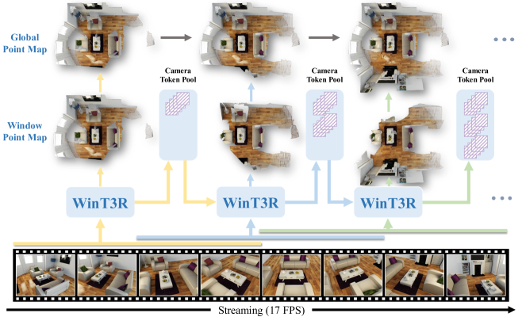
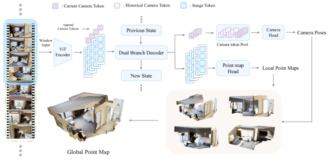

# WinT3R：带相机 Token 池的窗口式流式重建

## 结论先行

- WinT3R 的核心主张是**在流式在线重建里同时守住质量和速度**：用「窗口大小 4、步长 2、相邻窗口 50% 重叠」的滑动窗口做局部帧间交互提升几何质量，再用一个只存**紧凑相机 token**的可扩展池（camera token pool）做全局位姿，声称在 17 FPS 下取得在线重建、位姿、速度三方面 SOTA（证据：Abstract 与方法节，"sliding window mechanism … camera token pool … 17 FPS"）。
- 关键设计是把「几何」和「位姿」两条信息流解耦：窗口内 image token 走双分支解码器（Dual Branch Decoder）读出局部点图并更新状态；相机头则把**每帧压成一个 1536 维 camera token**丢进历史池，用滑动窗口 masked attention 让当前位姿在**全部历史相机 token**条件下预测（证据：Fig 2 pipeline，Camera Head / Camera token pool 分支）。
- 相比 CUT3R 的「单帧递归 + 持久状态」，WinT3R 用**窗口重叠**换来更强的局部帧间约束（相邻帧直接互相注意），比逐帧递归更抗单帧噪声；相比 VGGT 的「全序列一次性注意力」，它用**紧凑 token 池**避免了随帧数线性膨胀的全 image-token 缓存，从而保住在线吞吐（推断，基于架构对比）。
- 重建质量在多个 benchmark 报为 SOTA：ETH3D 总体 Chamfer 0.341、DTU 2.738、7-Scenes 0.022、NRGBD 0.026（证据：论文结果表）。**这正是背景提示所说的「ETH3D reconstruction baseline 较强」**。
- 位姿同样强：Tanks & Temples AUC@30 81.34、CO3Dv2 84.61、7-Scenes 78.59，均报为 SOTA（证据：论文位姿表）。
- 速度是卖点但**并非最快档**：KITTI 上约 17.2 FPS，属于「接近实时」区间，明显快于依赖全局对齐的离线方法，但**低于以极致吞吐为目标的部分流式方法**（如 LingBot-Map 报 20+ FPS）。背景提示「速度较低」应理解为**相对同类流式 SOTA 偏低、而非绝对慢**（证据：本仓库 `comparisons/3d-reconstruction/streaming-3d-reconstruction.md` 的横向判断 + 论文 FPS）。
- 工程可用性偏好但有缺口：代码 + HuggingFace 权重已开源，但**许可用的是 BSD 2-Clause 条款模板、头部却写明 "WinT3R for non-commercial purposes"，即实为仅限非商用**（与 CUT3R 一样不能直接商用，切勿误读为标准可商用 BSD）；且**训练代码在 README 的 TODO 里标注为待发布，截至核实未开源**，想复训需自行补齐（证据：GitHub LICENSE 与 README 已核实）。

## 1. 这篇论文解决什么问题？

- 问题定义：给定连续到达的 RGB 图像流，**在线、因果地**预测每帧相机位姿与高质量点图，并累积成全局一致的稠密重建，同时保持实时吞吐。
- 输入 / 输出：输入为任意长度的有序 RGB 图像流（逐窗口到达）；输出为逐帧局部点图（local point map）、相机位姿，累积为全局点图（global point map）。
- 目标场景：流式/准实时重建、SLAM 式增量建图、机器人/AR 边采集边建图。
- 与现有方法的差异：DUSt3R/MASt3R 成对处理 + 全局对齐，离线且慢；VGGT 全序列一次性注意力，质量高但缓存随帧数膨胀、难在线；CUT3R 逐帧递归在线但单帧约束弱。WinT3R 用「窗口重叠 + 相机 token 池」在**质量（窗口帧间交互）**与**速度/可扩展（紧凑池）**之间取折中。

## 2. 方法概览

- 核心想法：把流式重建拆成「局部窗口负责几何」+「全局 token 池负责位姿一致性」两条并行的信息通道。
- 一句话 pipeline：滑动窗口取 4 帧 → ViT 编码 → 双分支解码器读出局部点图并更新状态 → 每帧压成一个相机 token 存入可扩展池 → 相机头在全历史池上做 masked attention 出全局位姿 → 局部点图按位姿累积为全局点图。

### 2.1 架构解析

（图源：arXiv:2509.05296，WinT3R Fig 1 teaser。）

（图源：arXiv:2509.05296，WinT3R Fig 2 pipeline。）

- 整体结构（模块分解）：
  - **ViT 编码器**：逐帧提取 image token（DUSt3R 预训练权重初始化）。
  - **双分支解码器（Dual Branch Decoder）**：一分支在 image/camera token 上做 VGGT 式 alternating-attention（帧内 + 帧间交替），读出窗口内几何；另一分支更新 state token（Previous State → New State），把窗口信息写回状态供下一窗口用。
  - **相机 token 池（Camera Token Pool）**：每帧额外附加一个紧凑相机 token（1536 维），所有历史相机 token 存入可扩展池；相机头用滑动窗口 masked attention 在整个历史池条件下预测位姿，并把 local 与 global 相机 token 拼接后再出位姿。
  - **点图头（Point map Head）**：轻量卷积头直接回归局部点图，**刻意避开昂贵的 DPT/linear 头**以保吞吐。
- 各模块职责与数据流：窗口 → ViT → 解码器（几何 + 状态）→ 点图头出局部点图；同时相机 token 进池 → 相机头出全局位姿 → 位姿把局部点图对齐累积为全局点图。
- 关键设计选择及理由：
  - **窗口大小 4、步长 2（50% 重叠）**：重叠让相邻窗口共享 2 帧，提供跨窗口的帧间约束，缓解逐帧递归的单帧脆弱性；窗口小则每步计算量可控，利于实时。
  - **相机 token 池而非全 image-token 缓存**：位姿的全局一致性只需相机相对关系，用紧凑 token 表示历史相机足够，避免缓存随帧数线性膨胀——这是「不牺牲效率」的关键。
  - **卷积点图头**：牺牲一点表达力换吞吐，服务 17 FPS 目标。

### 2.2 核心原理

- 为什么这样设计 work：流式重建的两难在于——要质量就得让更多帧相互看到（全注意力，慢），要速度就得压缩历史（递归/缓存，易漂移/遗忘）。WinT3R 的答案是**分而治之**：几何交互限制在小窗口内（局部足够密、代价小），而全局一致性只在**位姿层面**用紧凑 token 池维护（全局但轻）。位姿是低维量（每帧一个 token），用池子承载全历史的边际代价远低于承载全 image token。
- 关键机制/归纳偏置：窗口重叠 = 局部平滑先验；相机 token 池 + masked attention = 全局位姿的长程一致性先验；state token = 跨窗口的信息中继。
- 与前作在原理上的本质区别：CUT3R 把「所有历史」压进单一持久状态，长序列有遗忘风险；VGGT 让所有帧全注意力，无遗忘但不可扩展。WinT3R 把「历史」拆成**几何（丢给状态 + 窗口，短程）**与**位姿（丢给显式可扩展池，长程）**，用结构上的分工同时规避两者的短板（推断）。

### 2.3 关键公式解析

> 论文未在可获取的 HTML 中给出带编号的严格公式块；以下按方法文字**形式化重述**，符号为本文约定，用于说明机制（已注明为形式化，非逐字照搬原式）。

- 形式化 (1) 滑动窗口划分：给定图像流 $\{I_1, I_2, \dots\}$ ，第 $k$ 个窗口为
  $$ W_k = \{ I_{2k-1},\ I_{2k},\ I_{2k+1},\ I_{2k+2} \} $$
  - 符号： $W\_k$ 为第 $k$ 个窗口；窗口大小为 4，步长为 2，故相邻窗口 $W\_k$ 与 $W\_{k+1}$ 共享 2 帧（50% 重叠）。
  - 作用：重叠帧充当跨窗口约束的锚点，让几何在窗口交界处平滑衔接。

- 形式化 (2) 状态更新（双分支解码器）：
  $$ (\mathbf{G}_k,\ \mathbf{s}_k) = \mathrm{Decoder}\big( \mathrm{ViT}(W_k),\ \mathbf{s}_{k-1} \big) $$
  - 符号： $\mathbf{s}\_{k-1}$ 为上一窗口的 state token（Previous State）， $\mathbf{s}\_k$ 为更新后的 New State； $\mathbf{G}\_k$ 为窗口内几何特征（供点图头）。
  - 作用：一次前向同时**读出**窗口几何与**写回**状态，状态是跨窗口的信息中继。

- 形式化 (3) 相机 token 池与全局位姿：设第 $t$ 帧相机 token 为 $\mathbf{c}\_t \in \mathbb{R}^{1536}$ ，池为 $\mathcal{P}\_t = \{\mathbf{c}\_1, \dots, \mathbf{c}\_t\}$ ，则
  $$ \hat{P}_t = \mathrm{CamHead}\big( \mathbf{c}_t,\ \mathcal{P}_t;\ M \big) $$
  - 符号： $\hat{P}\_t$ 为第 $t$ 帧预测位姿（旋转 + 平移）； $M$ 为滑动窗口 masked attention 的掩码，约束当前 token 只看合法历史； $\mathcal{P}\_t$ 随帧扩展。
  - 作用：位姿在**全历史相机 token**条件下预测，提供全局一致性；因 token 紧凑，池扩展的代价远小于缓存全 image token。

- 形式化 (4) 训练损失（总损失分解）：
  $$ \mathcal{L} = \mathcal{L}_{\mathrm{cam}} + \mathcal{L}_{\mathrm{pmap}} $$
  $$ \mathcal{L}_{\mathrm{cam}} = \sum_{(i,j)} \big\| q_{ij} - \hat{q}_{ij} \big\|_1 + \big\| t_{ij} - \hat{t}_{ij} \big\|_1 $$
  - 符号： $\mathcal{L}\_{\mathrm{cam}}$ 为相机损失，对所有帧对 $(i,j)$ 的**相对位姿**（四元数旋转 $q\_{ij}$ + 平移 $t\_{ij}$ ）取 L1； $\mathcal{L}\_{\mathrm{pmap}}$ 为点图损失，用置信度加权 L2 回归 + 熵正则，并按序列内置信度加权的点图尺度做归一化。
  - 作用：相机损失约束全局位姿一致；点图损失约束局部几何，置信度加权让模型学会对不可靠区域降权。

### 2.4 训练与推理细节

- 训练目标 / 损失函数：相机损失（相对位姿 L1，四元数 + 平移）+ 点图损失（置信度加权 L2 + 熵项，序列级置信度加权尺度归一化）。
- 训练数据与规模：混合 GTASfm、WildRGBD、CO3Dv2、ARKitScenes、TartanAir、ScanNet、ScanNet++、BlendedMVG、MatrixCity、Taskonomy、MegaDepth、Hypersim 等（含合成游戏数据）。图像变长宽比、最长边 512px。参数量约 750M，DUSt3R 权重初始化。
- 训练流程（两阶段）：
  1. 100 epoch，12 帧序列，LR=1e-4，batch 4/GPU，64×A800，约 7 天；
  2. 12 epoch，60 帧序列，LR=2e-6，32×A800，约 4 天。
- 推理流程：图像流按窗口滚动进入 → 逐窗出局部点图 + 相机 token 入池 → 相机头出全局位姿 → 局部点图对齐累积为全局点图，报约 17 FPS。

## 3. 关键贡献

1. **滑动窗口（4 帧、步长 2、50% 重叠）**的流式几何交互机制，用局部帧间注意力提升点图质量而不牺牲实时性。
2. **可扩展相机 token 池**：每帧压成一个紧凑相机 token 存入历史池，用 masked attention 在全历史条件下预测位姿，兼顾全局一致性与效率。
3. **质量/位姿/速度同时报为 SOTA**：ETH3D/DTU/7-Scenes/NRGBD 重建、Tanks&Temples/CO3Dv2/7-Scenes 位姿，约 17 FPS 在线吞吐。

## 4. 实验与证据

| 维度 | 内容 |
|---|---|
| 数据集 | 重建：DTU、ETH3D、7-Scenes、NRGBD；位姿：Tanks&Temples、CO3Dv2、7-Scenes；视频深度：Sintel、BONN、KITTI |
| Baseline | DUSt3R/MASt3R、VGGT、CUT3R 等前馈/流式重建方法 |
| 指标 | Chamfer / Accuracy / Completeness（重建）；RRA@30、RTA@30、AUC@30（位姿）；Abs-Rel、δ<1.25、FPS（深度/速度） |
| 主要结果 | ETH3D Chamfer 0.341（Acc 0.411 / Comp 0.272）、DTU 2.738（Acc 3.638 / Comp 1.838）、7-Scenes 0.022、NRGBD 0.026；T&T AUC@30 81.34、CO3Dv2 84.61、7-Scenes 78.59；KITTI ~17.2 FPS（单卡 A800，均报 SOTA/最快档） |
| 消融 | 论文强调窗口重叠与相机 token 池两处设计的贡献（未在可获取 HTML 中拿到逐行消融数值） |
| 失败案例 | HTML 未提供明确失败案例；见第 5 节推断 |

### 4.1 效果与性能解析

- 主要结果解读：重建 Chamfer 在 ETH3D（0.341）/DTU/7-Scenes/NRGBD 全线领先，说明**窗口内帧间交互确实提升了局部几何密度与一致性**——这与背景提示「ETH3D reconstruction baseline 较强」一致。位姿 AUC@30 领先则得益于相机 token 池提供的全历史约束。
- 性能与效率：约 17 FPS（KITTI 单卡 A800），参数量约 750M。相对离线全局对齐方法快一到两个数量级；但相对以吞吐为首要目标的流式 SOTA（如 LingBot-Map 报 20+ FPS），WinT3R 属**质量优先、速度次之**的定位——这正是背景提示「速度较低」的准确含义：**同类流式方法里偏低，而非绝对慢**。
- 消融揭示的关键因素：窗口重叠（局部约束）与相机 token 池（全局位姿）是两个卖点，论文将其作为主要设计贡献强调（具体消融数值需回原文表核实）。
- 与 SOTA / baseline 的可比性：多数结果在与 VGGT/CUT3R 同协议的公开 benchmark 上报出，可比性较好；但「SOTA」为论文自述，跨方法评测协议（如点图对齐方式、置信度阈值）需复现时逐一核对。

## 5. 局限与风险

- 论文明确承认：以质量-速度权衡为主线，未强调 loop closure、动态场景等专门处理（HTML 未见显式失败案例章节）。
- 我推断的风险：
  - **长序列位姿漂移**：相机 token 池虽可扩展，但无显式回环闭合，超长轨迹仍可能累积漂移（与本仓库流式对比文件对 window 类方法的判断一致）。
  - **窗口交界伪影**：50% 重叠缓解但未必消除窗口边界的几何不连续。
  - **动态物体**：训练数据以静态/合成为主，动态场景表现存疑。
- 工程落地风险：**训练代码未开源**（README TODO），想改数据/改损失需自行复现训练栈；卷积点图头在高分辨率细节上可能弱于 DPT 头。
- 许可证 / 数据风险：LICENSE 虽用 BSD 2-Clause 条款模板，但头部明确写 "for non-commercial purposes"，**实为仅限非商用**，商用不可直接使用；训练数据含 GTASfm/MatrixCity 等合成/游戏来源，进一步限制商用。

## 方法谱系

- 基于：[DUSt3R](../3d-reconstruction/2023-dust3r.md)（ViT 编码器用其预训练权重初始化，点图回归范式承自它）
- 基于：[VGGT](../3d-reconstruction/2025-vggt.md)（双分支解码器的 alternating-attention 设计受其启发）
- 同期流式对照：[CUT3R](../3d-reconstruction/2025-cut3r.md)（同为在线流式，WinT3R 用窗口+池替代其单一持久状态）；[LingBot-Map](../3d-reconstruction/2026-lingbot-map.md)（更强调吞吐与轨迹记忆）

## 6. 与相似方法对比

| Method | 相同点 | 不同点 | 何时选它 |
|---|---|---|---|
| CUT3R | 在线流式、前馈点图 + 位姿 | CUT3R 单帧递归 + 持久状态；WinT3R 窗口重叠 + 相机 token 池，局部约束更强 | 要更强局部几何一致性、可接受 ~17 FPS 选 WinT3R；要极简递归状态选 CUT3R |
| VGGT | 都用 alternating-attention 解码 | VGGT 全序列一次性、离线、缓存膨胀；WinT3R 流式、紧凑池、可在线 | 需在线/长流选 WinT3R；离线一次性高质量选 VGGT |
| LingBot-Map | 流式在线视觉建图 | LingBot-Map 吞吐更高（20+ FPS）+ 轨迹记忆；WinT3R 质量优先、速度次之 | 极致吞吐/机器人在线选 LingBot-Map；重建质量优先选 WinT3R |

> 详见横向对比：[`comparisons/3d-reconstruction/streaming-3d-reconstruction.md`](../../comparisons/3d-reconstruction/streaming-3d-reconstruction.md)（已含 WinT3R 条目，标注「ETH3D reconstruction baseline 较强、速度低于 LingBot-Map」）。

## 7. 复现判断

- Git 地址：https://github.com/LiZizun/WinT3R
- 是否开源：是（LICENSE 为 BSD 2-Clause 条款模板，但标注 for non-commercial purposes，仅限非商用）
- 是否开源训练：否（训练代码在 README TODO 中标注为待发布，截至核实未开源）
- 代码可用性：推理 `recon.py` + 示例齐全，可跑图像流重建
- 权重可用性：HuggingFace 提供 checkpoint（放入 `checkpoints/pytorch_model.bin`）
- 数据可获得性：训练数据集多为公开但需分别申请/下载；无训练代码则复训门槛高
- 预计环境成本：推理单卡可跑；复训需 32–64×A800 量级（论文两阶段共约 11 天）
- 最小复现路径：下载权重 → `recon.py` 跑 examples/自采图像流 → 在 ETH3D/7-Scenes 上核对 Chamfer 与 FPS
- 是否值得复现：**推理复现值得**（验证 ETH3D 强重建 + 17 FPS 声明；注意许可仅限非商用，仅供研究/评测）；**训练复现暂不建议**（无训练代码，成本高）

## 8. 后续动作

- [ ] 更新 `indices/papers.md`
- [ ] 更新 `indices/directions.md`
- [x] 相似方法对比已存在：`comparisons/3d-reconstruction/streaming-3d-reconstruction.md`（含 WinT3R 条目）
- [ ] 若计划推理复现，创建 `reproductions/3d-reconstruction/wint3r/README.md`
