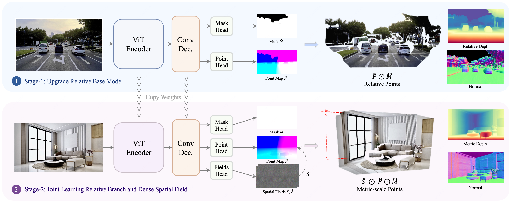

# FoundationGeo：为单目度量几何学习逐像素空间场

> 图片来源：本文所有图取自官方仓库 [mx-liu6/FoundationGeo](https://github.com/mx-liu6/FoundationGeo) assets（对应论文 arXiv 2607.11588 Fig.1/Fig.3/Table）。

## 结论先行

- FoundationGeo 解决的是「单目 metric 几何」的老大难：从一张图直接回归度量尺度的 3D 点图 / 深度 / 法向。它的核心主张是**把 relative（仿射不变）预测与 metric 预测显式解耦成两阶段**，中间用一组**逐像素空间标定场（spatial pixel-wise fields）**去桥接，而不是让一个网络端到端硬扛尺度歧义（证据：arXiv 2607.11588 摘要 + 架构图）。
- 关键机制是两个场：**scale field $\hat{S}\in\mathbb{R}^{H\times W}$**（逐像素乘性尺度校正， $\tilde{P}=\hat{S}\odot\hat{P}$ ）和 **ray-direction correction field $\hat{\Delta}$**（在保持 range 不变的前提下，沿两个正交切向做有界角度扰动，用 tanh 约束修正幅度），二者共同把 Stage-1 的 relative 点图搬到 metric 空间（证据：arXiv HTML 方法节 + 架构图 Stage-2 分支）。
- 它诊断出跨域泛化的一个具体瓶颈——**相机内参（焦距）分布 mismatch**：当测试内参落在训练分布之外时性能急剧下降。作者用 **Blender 数据引擎合成约 23,700 张覆盖欠采样焦距的图像**来补洞（证据：arXiv HTML；这是本文相对纯"堆数据"路线的差异化点）。
- 报告的核心数字：7 个基准上 **metric depth 平均 AbsRel 14.8 / δ₁ 80.8**（平均 rank 2.32），优于 MoGe-2（15.7 / 76.8）、UniDepth V2（21.3 / 75.3）、DepthPro（27.6 / 54.4），并强于需真值内参的 Metric3D V2（18.3 / 73.9）；relative 分支（FoundationGeo-Base）AbsRel 4.87 / δ₁ 96.0。摘要口径「平均超更重 baseline 5.2%」应理解为综合相对提升，非单一指标（证据：arXiv HTML Table 2；**存疑**：5.2% 的确切定义与聚合方式需核对正文）。
- 工程可用性高：代码 **MIT**，Stage-I（313M）与 Stage-II（314M）权重（v1 / v1.1，推荐 v1.1）均上 HuggingFace（mxliu-hku/*），训练 config + accelerate 分布式脚本、评测集（Ruicheng/monocular-geometry-evaluation）齐全，属**可直接复现级别**（证据：官方 README）。

## 1. 这篇论文解决什么问题？

- **问题定义**：单目 metric 几何估计——给一张 RGB 图，输出度量尺度（真实米制）的稠密 3D 点图 / 深度 / 法向，且要求跨域（室内/室外/驾驶/合成）零样本鲁棒。
- **输入 / 输出**：输入单张 RGB（无需内参先验）；输出 metric point map $\tilde{P}$、metric depth、surface normal、可靠性 mask $\hat{M}$。
- **目标场景**：需要真实尺度的下游任务——机器人抓取/导航、AR、驾驶感知，这些场景对「尺度」而非仅「相对结构」敏感。
- **与现有方法的差异**：
  - 相对 MoGe / DUSt3R 系仿射不变或 up-to-scale 输出——它们把尺度留给下游，FoundationGeo 直接给 metric。
  - 相对 Metric3D V2——后者往往依赖**真值内参**做尺度对齐，FoundationGeo 不需要（内参歧义由学习到的空间场吸收）。
  - 相对 UniDepth / DepthPro——同为无内参 metric，但 FoundationGeo 把 metric 化拆成可解释的两个逐像素场，且专门处理焦距分布 mismatch。

## 2. 方法概览

- **核心想法**：不要指望一个网络同时学好「结构」和「尺度」。先用海量数据把**相对结构（affine-invariant）**学到极致，再用轻量、逐像素、可解释的**标定场**把它校正到 metric。尺度不是一个全局标量，而是**空间变化的场**。
- **一句话 pipeline**：`图像 → DINOv3-ViT 编码 → Conv 解码 → (Stage-1: Point Head + Mask Head 出 relative 点图) → (Stage-2: 复制权重 + Fields Head 出 scale 场 Ŝ 与 ray 修正场 Δ̂) → Ŝ ⊙ (Δ̂ 校正后的 P̂) ⊙ M̂ → metric 点图`。

### 2.1 架构解析

- **整体结构**：共享骨架 = **ViT Encoder（DINOv3 初始化，ViT-Large）+ 轻量 Conv Decoder + 多尺度特征融合（各层编码特征逐元素求和）**。两阶段共用这个骨架，Stage-2 通过 "Copy Weights" 继承 Stage-1。
- **Stage-1（Upgrade Relative Base Model）**：Conv Dec 后接两个头——
  - **Mask Head** → 可靠性 mask $\hat{M}$ （剔除天空/无效区）；
  - **Point Head** → 仿射不变点图 $\hat{P}$。
  - 输出 $\hat{P}\odot\hat{M}$ 即 relative points，可导出 relative depth 与 normal。
- **Stage-2（Joint Learning Relative Branch and Dense Spatial Field）**：同一骨架上多加一个 **Fields Head** → 输出**空间场 $\hat{S},\hat{\Delta}$**。 $\hat{\Delta}$ 先对点图做 ray-direction 修正得 $\hat{P}'$，再由 $\hat{S}$ 逐像素乘性缩放，最终 **$\hat{S}\odot\hat{P}\odot\hat{M}$** 得 metric-scale points（架构图右下角标注了 291cm 的真实尺度示例）。
- **关键设计选择及理由**：
  - 用 relative 骨架当"结构先验"，metric 化只需薄薄一层场 → 参数增量极小（313M→314M，+1M），且不破坏已学好的结构。
  - 场是**逐像素**而非全局标量 → 能吸收焦距/主点等内参歧义带来的**空间变化尺度误差**（论文观察：从粗到细 patch 化对齐，误差纠正更有效）。

### 2.2 核心原理

- **为什么这样 work**：单目尺度歧义的根源是内参（尤其焦距）未知——同一 relative 结构，换焦距对应不同 metric 深度。把尺度建成 relative 点图上的**逐像素乘性场 + 方向修正场**，等价于让网络隐式回归「等效内参 + 空间尺度修正」，从而在不显式给内参时也能定尺度。
- **关键归纳偏置**：
  1. **结构/尺度解耦**——relative 分支专注几何形状（大数据可学好），metric 分支专注尺度（数据更稀缺、更依赖内参）。
  2. **range-preserving 的方向修正**—— $\hat{\Delta}$ 只动 ray 方向、不动 range，避免与尺度场耦合冲突（用 tanh 有界，防止爆掉）。
  3. **焦距分布补全**——合成数据针对性填欠采样焦距，直接压 mismatch 这个瓶颈。
- **与前作本质区别**：MoGe/DUSt3R 把点图当单一回归目标；FoundationGeo 把「metric 点图 = relative 点图 ⊗ 可解释空间场」，metric 化是一个显式、可视化（架构图中 Spatial Fields 可看成灰度图）的桥接步骤。

### 2.3 关键公式解析

> 以下公式为据 arXiv HTML 方法节的形式化转写（原文严格记号可能略有差异，**存疑**：符号/系数以正文为准）。

- **公式 (1) ray-direction 分解与修正**：把点分解为 range 与单位方向，沿两正交切向做有界角度扰动：
  $$ \hat{P}' = r \cdot \mathcal{R}(\hat{\Delta})\,\hat{u}, \qquad \hat{\Delta} = \delta_{\max}\cdot\tanh(f_\theta(x)) $$
  - 符号： $r=\lVert\hat{P}\rVert$ 为 range（保持不变）； $\hat{u}=\hat{P}/r$ 单位 ray 方向； $\mathcal{R}(\hat{\Delta})$ 由角度扰动 $\hat{\Delta}$ （两个正交切向分量）构成的旋转； $\delta_{\max}$ 为最大允许角度， $\tanh$ 保证有界。
  - 作用：在**不改变径向距离**的前提下校正方向偏差（等效修正主点/畸变类误差），与尺度校正解耦。
- **公式 (2) 逐像素尺度校正**：
  $$ \tilde{P} = \hat{S}\odot\hat{P}' $$
  - 符号： $\hat{S}\in\mathbb{R}^{H\times W}$ 逐像素尺度场； $\odot$ 逐元素乘（在各像素上广播到其 3D 坐标）； $\tilde{P}$ 为 metric 点图。
  - 作用：把 range 从"相对"抬到"米制"，且允许尺度随空间变化。
- **公式 (3) Stage-2 统一损失**：
  $$ \mathcal{L}_{\text{FoundationGeo}} = \mathcal{L}_{\text{relative}} + \mathcal{L}_{\text{metric}} + \gamma_s\,\mathcal{L}_{\text{scalefield}} + \gamma_r\,\mathcal{L}_{\text{ray}} + \gamma_\Delta\,\mathcal{L}_{\Delta} $$
  - 符号： $\mathcal{L}\_{\text{relative}}$ 继承 Stage-1 的结构正则； $\mathcal{L}\_{\text{metric}}$ 为点坐标 L1； $\mathcal{L}\_{\text{scalefield}}$ 对 $\hat{S}$ 在 log 域的 Huber 损失； $\mathcal{L}\_{\text{ray}}$ 约束预测 ray 与真值 ray 的角度一致性； $\mathcal{L}\_{\Delta}$ 对修正幅度的正则； $\gamma\_s,\gamma\_r,\gamma\_\Delta$ 为权重。
  - 作用：保结构（relative）+ 定尺度（metric/scalefield）+ 控方向（ray/Δ），四者联合避免 metric 化破坏已学结构。

### 2.4 训练与推理细节

- **Stage-1 训练目标**：global alignment loss + 多尺度局部 patch loss + surface-normal 一致性 + edge loss + mask 监督，语料为 **10.2M 多域图像**。骨架 DINOv3 初始化。
- **Stage-2 训练目标**：公式 (3) 的联合损失，复用 Stage-1 权重（Copy Weights）后联合微调 relative 分支与 Fields Head。
- **数据引擎**：Blender 合成约 23,700 张覆盖欠采样焦距的样本，专补内参分布洞。
- **推理**：单张图前馈 → relative 点图 + 空间场 → 一步代数运算（方向修正 + 尺度乘）得 metric 点图，无需内参输入、无需迭代对齐或全局优化。
- **规模**：Stage-I 313M / Stage-II 314M 参数；v1 与 v1.1 两版权重（推荐 v1.1）。

## 3. 关键贡献

1. **两阶段 relative→metric 显式桥接框架**：先仿射不变、后 metric 化，用轻量空间场衔接，参数增量仅 +1M。
2. **逐像素空间标定场**：scale field（乘性尺度）+ ray-direction correction field（有界方向修正），把「单目尺度歧义」建模为可解释、空间变化的场而非全局标量。
3. **焦距分布 mismatch 的诊断与补全**：明确指出内参分布外泛化崩塌，并用 Blender 数据引擎针对性合成补齐。
4. **强跨域 SOTA + 完整开源**：7 基准 metric 平均 rank 2.32，代码 MIT、训练/评测/权重全开。

## 4. 实验与证据

| 维度 | 内容 |
|---|---|
| 数据集 | NYUv2, KITTI, ETH3D, iBims-1, Sintel, DDAD, DIODE, HAMMER（7~8 个零样本基准） |
| Baseline | Depth Anything V1/V2, Metric3D V2, UniDepth V1/V2, DepthPro, MoGe-1/2, ZoeDepth, MASt3R |
| 指标 | AbsRel↓, δ₁↑, 边界 F1 |
| 主要结果 | metric 平均 AbsRel 14.8 / δ₁ 80.8（rank 2.32）；relative-Base AbsRel 4.87 / δ₁ 96.0（rank 2.56）；边界 F1 平均 rank 1.67（iBims-1/HAMMER/Sintel，6000 tokens 设置） |
| 消融 | 焦距覆盖分析：测试内参落在训练分布外时性能急剧下降 → 合成焦距数据缓解 |
| 失败案例 | 论文未在获取到的片段中明确列举（**存疑**：需查正文局限节） |

### 4.1 效果与性能解析

- **主要结果解读**：metric depth 上同时压过「无内参 metric」阵营（UniDepth V2 / DepthPro / MoGe-2）与「需真值内参」的 Metric3D V2——后者一项尤其说明：把内参歧义交给学习的空间场，比强依赖真值内参更鲁棒。relative 分支 δ₁ 96.0 也说明 Stage-1 结构底子够硬，metric 化没牺牲结构精度。
- **性能与效率**：314M 参数、单次前馈、无迭代优化，属"轻量落地档"；相对论文所称「更重 baseline」的平均 5.2% 提升，价值在于**更小模型 + 更好泛化**（证据：摘要；**存疑**：baseline 参数量对比需核正文）。
- **消融揭示的关键因素**：焦距分布覆盖是跨域泛化的主导变量之一——这解释了为何单纯堆真实数据不够，必须合成补洞。
- **可比性**：均在公开零样本评测集（Ruicheng/monocular-geometry-evaluation）上按 AbsRel/δ₁ 标准协议评，协议一致性较好；边界 F1 用了 6000 tokens 设置，跨方法比较时需注意 token 预算一致。

## 5. 局限与风险

- **论文明确承认**：内参分布外泛化仍是瓶颈（虽用合成缓解，但合成与真实 domain gap 仍在）。
- **我推断的风险**：
  - 逐像素尺度场在**大范围无纹理 / 反光 / 天空**区域可能不稳定，degrade 到 mask 剔除；
  - 单目 metric 的绝对尺度上限受训练焦距覆盖约束，极端长焦/鱼眼可能仍失效；
  - 「5.2% 平均提升」的聚合口径若跨异质指标平均，解释力有限。
- **工程落地风险**：metric 精度对相机与训练分布的接近程度敏感，部署新相机建议做小样本校验。
- **许可证 / 数据风险**：代码 MIT 友好；权重许可与部分训练数据（含合成/第三方数据集）需逐项确认商用条款（**存疑**：权重 license 未逐仓核实）。

## 方法谱系

> 仅列仓库中真实存在的 slug。FoundationGeo 属前馈稠密几何一脉，与 pointmap 回归传统同源。

- 基于（点图回归 / 稠密几何思想）：[MASt3R](../3d-reconstruction/2024-mast3r.md)
- 同期可比（前馈 metric 几何）：[MapAnything](../3d-reconstruction/2025-mapanything.md)、[VGGT](../3d-reconstruction/2025-vggt.md)、[Depth Anything 3](../3d-reconstruction/2025-depth-anything-3.md)

## 6. 与相似方法对比

| Method | 相同点 | 不同点 | 何时选它 |
|---|---|---|---|
| [MapAnything](../3d-reconstruction/2025-mapanything.md) | 前馈、metric、可跨任务 | MapAnything 多视图 + 可注入内参/位姿先验、因子化全局表示；FoundationGeo 纯单目、无先验、逐像素场 | 有多视图/先验、要全局一致 → MapAnything；只有单图、要 metric → FoundationGeo |
| [VGGT](../3d-reconstruction/2025-vggt.md) | 前馈稠密几何、DINO 系骨架 | VGGT 多视图大一统几何 Transformer；FoundationGeo 单目 + 显式尺度场 | 多视图重建 → VGGT；单目 metric → FoundationGeo |
| [Depth Anything 3](../3d-reconstruction/2025-depth-anything-3.md) | 大规模数据、单目几何、强泛化 | DA3 面向通用深度/几何大模型；FoundationGeo 专攻 metric 桥接 + 焦距补全 | 要通用相对深度骨架 → DA3；要开箱 metric 点图 → FoundationGeo |

> 更系统的横向对比见 [comparisons/3d-reconstruction/visual-geometry-foundation-models.md](../../comparisons/3d-reconstruction/visual-geometry-foundation-models.md)（建议把 FoundationGeo 补入"单目 metric"一行）。

## 7. 复现判断

- **Git 地址**：https://github.com/mx-liu6/FoundationGeo （HTTP 200，非占位）
- **是否开源**：是，代码 MIT。
- **是否开源训练**：是——提供 Stage-I / Stage-II 训练 config 与 accelerate 分布式启动脚本。
- **代码可用性**：完整（安装、训练、评测、数据准备说明齐全）。
- **权重可用性**：HuggingFace mxliu-hku/FoundationGeo-Base(-1.1)、mxliu-hku/FoundationGeo(-1.1)，推荐 v1.1。
- **数据可获得性**：评测集公开（Ruicheng/monocular-geometry-evaluation）；训练需自备 10.2M 多域 + 合成数据（合成引擎细节需看仓库/正文）。
- **预计环境成本**：推理单卡即可（~314M）；完整训练需多卡（10.2M 样本，分布式）。
- **最小复现路径**：装环境 → 拉 FoundationGeo-1.1 权重 → 跑官方 eval 脚本在公开评测集复现 metric AbsRel/δ₁。
- **是否值得复现**：值得（低成本验证 metric depth；若做机器人/驾驶单目尺度，可直接接入）。

## 8. 后续动作

- [x] 更新 `indices/papers.md`
- [x] 更新 `indices/directions.md`（3d-reconstruction / depth-estimation）
- [x] 纳入 `comparisons/3d-reconstruction/visual-geometry-foundation-models.md`（§3.7 单目 metric 行）与 `development-survey.md`
- [ ] 若计划复现：跑官方 eval 复现 metric AbsRel/δ₁，记录到 `reproductions/3d-reconstruction/foundationgeo/README.md`（已开源，可执行）
- [ ] 核实存疑点：5.2% 聚合口径、权重 license 逐仓、失败案例
