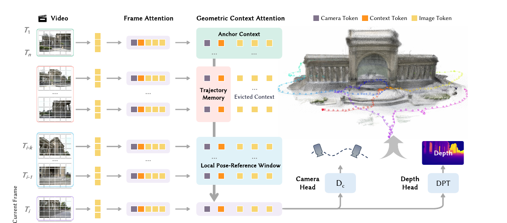
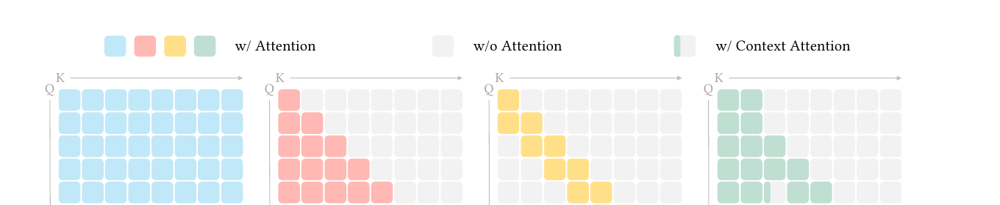
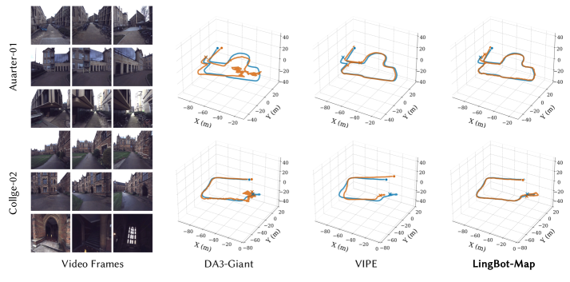
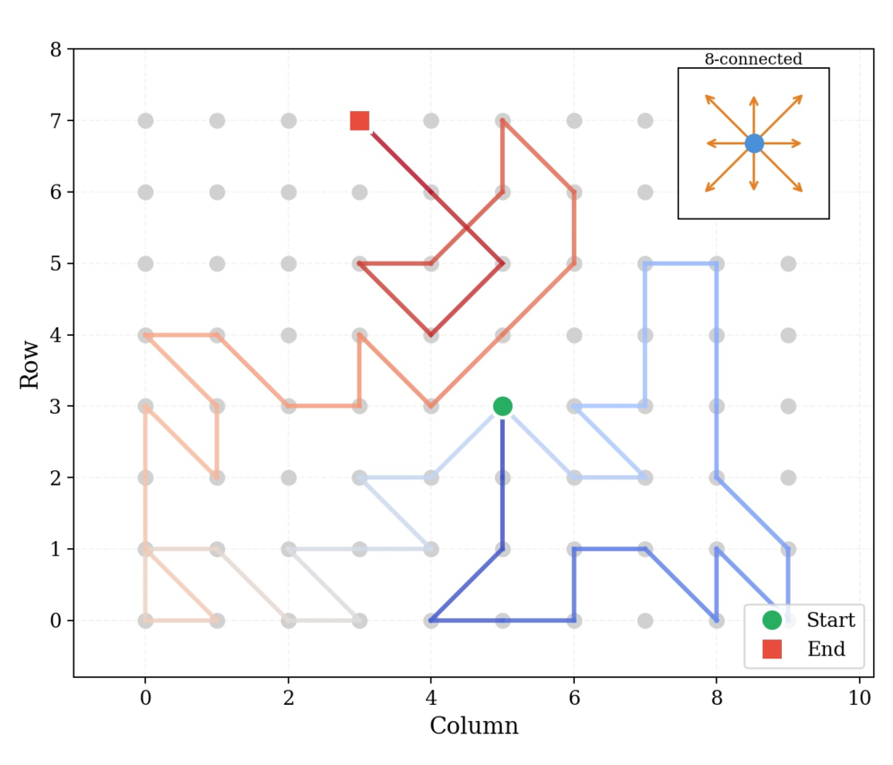

# LingBot-Map：Geometric Context Transformer for Streaming 3D Reconstruction

## 结论先行

- **定位**：LingBot-Map 是面向连续 RGB 视频流的 feed-forward streaming 3D foundation model，因果地输出相机位姿、深度图和点云。它不是离线多视图重建器，而更接近“神经 SLAM / 在线 visual mapping backbone”——把 SLAM 里的关键帧管理、地图维护、位姿图优化用一套可学习的 attention 结构替换掉。
- **核心方法**：Geometric Context Attention（GCA）把流式状态显式拆成三类上下文—— anchor context 负责坐标与尺度锚定、pose-reference window 负责局部稠密几何、trajectory memory 用每帧少量 token 记录长程轨迹以抑制漂移。它介于 full attention（贵但全局）和 causal / sliding-window attention（省但短视）之间，是一种“几何感知的稀疏注意力掩码”。
- **主要收益**：论文报告在 518×378 输入下约 20 FPS（配合 paged KV-cache），可处理超过 10,000 帧的长序列；相比保留全历史 token 的 causal attention，GCA 把每帧新增上下文从 $M+6$ 个 token 降到 6 个 context token，论文报告在 $M \approx 500$ 时每帧增长率约降低 $80\times$ 。
- **实验结论**：在 Oxford Spires、ETH3D、7-Scenes、Tanks and Temples、NRGBD 上，LingBot-Map 对主流 streaming baselines（CUT3R、TTT3R、Wint3R、Stream3R、StreamVGGT 等）有明显优势，尤其是长序列 ATE 和点云 F1；在 Oxford Spires 大尺度轨迹上甚至超过若干 offline / optimization 方法（DA3、VIPE、MegaSAM）。
- **开源状态**：GitHub 仓库 Apache-2.0，提供模型源码、demo、profiling、渲染管线、评测 benchmark 与 HuggingFace / ModelScope 权重；仓库 `benchmark/` 已发布 Oxford Spires / KITTI 等评测 pipeline，但**未见训练代码**，故“是否开源训练”记为 `\`。
- **对本仓库主线价值**：目标是自动驾驶 / 机器人“在线长序列视觉建图”时，LingBot-Map 比 MapAnything 更贴近 streaming / VO 场景；目标是多视图、多先验、metric anchor 或 LiDAR depth prompt 融合时，MapAnything / HunyuanWorld-Mirror 仍更直接。

## 1. 这篇论文解决什么问题？

- **问题定义**：从连续视频流中在线恢复 3D 信息（相机位姿、深度图、点云），同时满足三个常常互相冲突的目标——几何准确性、时间一致性、计算效率。
- **输入 / 输出**：输入为按时间到达的单目 RGB 帧序列 $\{I\_1, I\_2, \dots, I\_t\}$ ；输出为每帧的 camera-to-world pose $P\_t$ 、depth map $D\_t$ ，并可反投影汇聚为全局 point cloud。
- **约束**：推理是严格 causal / streaming 的，处理第 $t$ 帧时不能访问未来帧；长序列下显存与计算不能随帧数线性甚至平方爆炸。
- **目标场景**：室内外长视频、机器人 / 自动驾驶在线建图、AR、embodied AI 的持续空间理解。
- **与离线 feed-forward 3D 的差异**：VGGT、DA3、MapAnything、Pi3 等可在完整图像集合上做全局双向注意力，但这天然不满足严格 streaming——每来一帧都要重算全局注意力，代价随帧数平方增长。LingBot-Map 把核心难点显式定位在**流式上下文选择与状态压缩**：哪些历史信息必须保留完整 token，哪些可以压成少量摘要 token。

## 2. 方法概览

- **核心想法**：SLAM 里维持一个显式状态（当前位姿 + 关键帧 + 地图 + 位姿图），LingBot-Map 把这个状态改写成 attention 的 KV 上下文，并用一套“几何感知的注意力掩码”决定当前帧能看到哪些历史 token。关键洞察是：不是所有历史帧都要保留全部图像 token——只有 anchor 帧（定坐标系）和最近若干帧（做局部配准）需要完整 token，其余历史帧只需保留能定位相机与全局尺度的少量摘要 token。
- **一句话 pipeline**：`视频帧 → DINOv2 ViT patchify → 每帧 frame attention（帧内 + 少量结构 token）→ 多层 Geometric Context Attention（按 anchor / local window / trajectory memory 三级掩码做跨帧注意力）→ camera head 出位姿 + DPT depth head 出深度 → 反投影汇聚点云`。

### 2.1 架构解析

**模块分解与数据流**（对照上图从左到右）：

1. **Patchify + backbone**：ViT backbone 初始化自 DINOv2，patch size 14。每帧 $I_t$ 编码为 $M \approx 500$ 个 image tokens（对应 518×378 输入）。
2. **每帧 token 组装**：每帧 tokens = $M$ 个 image tokens + 1 个 camera token + 4 个 register tokens + 1 个可学习 anchor token（论文明确 4 register + 1 anchor）。camera / anchor / register 这 6 个非图像 token 就是后续 trajectory memory 里被保留的“摘要 token”。
3. **Frame Attention**：帧内注意力，让 image tokens 与结构 token（camera / register / anchor）在单帧内充分交互，聚合出该帧的局部几何描述。
4. **Geometric Context Attention（GCA）**：主干交替堆叠 frame attention 与 GCA。GCA 是跨帧注意力，但用三级掩码约束当前帧 $T_i$ 的 query 能 attend 到哪些历史 K/V—— Anchor Context、Trajectory Memory（evicted context）、Local Pose-Reference Window。
5. **双输出头**：
   - **Camera head**：从 camera token 预测**绝对 camera-to-world pose**（论文特意用 c2w 而非 w2c 参数化，提升长序列稳定性）。
   - **Depth head（DPT）**：DPT 结构从 image tokens 预测稠密 depth map。
6. **点云汇聚**：depth + pose 反投影，随帧流增量拼成全局点云。

**关键设计选择及理由**：
- **c2w 位姿参数化**：论文指出 w2c 参数化下旋转与平移强耦合，平移估计对旋转误差高度敏感，长序列尤甚；c2w 直接预测相机在世界系中的位置，解耦后平移误差更可控。
- **anchor token 学习化**：不用第一帧硬性定坐标系，而用可学习 anchor token + anchor scale 归一化，缓解单目尺度歧义。
- **frame attention 与 GCA 交替**：帧内先充分交互再跨帧稀疏注意，避免直接对全序列所有 token 做全连接。

### 2.2 核心原理

**为什么 GCA work——从注意力掩码演化看**：

上图是理解本文的钥匙。四个 Q×K 掩码矩阵：
- **Full**：每个 query 看全部 key，全局但代价约 $O(T^2 M^2)$ ，不满足 streaming。
- **Causal**：下三角，只看历史。但历史全保留完整 image token，长序列 KV 仍随 $T$ 线性膨胀且含大量冗余远景。
- **Sliding-window**：只看最近 $k$ 帧，省，但彻底丢失全局坐标锚点与长程轨迹，导致漂移。
- **GCA**：**在 sliding-window 基础上，额外补回最左侧几列（anchor 帧的完整 token）与被逐出帧的少量摘要 token**。视觉上就是“对角带 + 最左几列 + 稀疏摘要列”的混合掩码。

这正是三级上下文的由来：

| Context | 作用 | 保存内容 | 解决的问题 |
|---|---|---|---|
| Anchor context | 坐标与尺度锚定 | 初始 anchor 帧的完整 image token + anchor token | 单目尺度歧义、全局坐标漂移 |
| Local pose-reference window | 局部配准与稠密几何 | 最近 $k$ 帧完整 image tokens | 当前帧与近邻视角重叠、相对位姿稳定性 |
| Trajectory memory | 长程漂移控制 | 被移出窗口的历史帧只保留 camera / anchor / register 等 6 个 context token，并加 video temporal positional encoding | 保留全局轨迹线索但不保留冗余图像 token |

**关键归纳偏置**：几何上，“定尺度 / 定坐标系”只需要少数锚点帧；“做稠密配准”只需要时空近邻帧；“防长程漂移”只需要知道历史相机走过哪里（位姿摘要），不需要每帧的稠密纹理。GCA 把这三种几何需求分别映射到三种 token 粒度，本质是**用几何先验设计稀疏注意力的稀疏模式**。

**与前作的本质区别**：CUT3R 用循环状态（recurrent state token）隐式压缩全部历史，状态是一个不可解释的 memory；StreamVGGT / Stream3R 多为固定窗口或全 causal，要么短视要么昂贵。LingBot-Map 的状态是**显式、可解释、几何分工明确**的三级 KV 集合，且逐出策略与 SLAM 关键帧管理同构，这让它既能长又能省。

### 2.3 关键公式解析

**公式 (1)：复合训练损失**

$$ \mathcal{L} = \lambda_{\text{depth}} \, \mathcal{L}_{\text{depth}} + \lambda_{\text{abs}} \, \mathcal{L}_{\text{abs-pose}} + \lambda_{\text{rel}} \, \mathcal{L}_{\text{rel-pose}} $$

- 符号： $\mathcal{L}\_{\text{depth}}$ 为深度回归损失（沿用 VGGT 的置信度加权 + 梯度匹配）； $\mathcal{L}\_{\text{abs-pose}}$ 为绝对位姿损失； $\mathcal{L}\_{\text{rel-pose}}$ 为窗口内相对位姿损失； $\lambda\_\ast$ 为权重（论文未在可见文本给出具体数值，待核验）。
- 作用：三项分别约束稠密几何、全局定位、局部轨迹一致性，缺一不可——只有绝对位姿会累积漂移，只有相对位姿会丢全局尺度。

**公式 (2)：深度损失（confidence + 梯度匹配）**

$$ \mathcal{L}_{\text{depth}} = \sum_{i=1}^{N} \big\lVert \Sigma_i^{D} \odot (\hat{D}_i - D_i) \big\rVert + \big\lVert \Sigma_i^{D} \odot (\nabla \hat{D}_i - \nabla D_i) \big\rVert - \alpha \log \Sigma_i^{D} $$

- 符号： $\hat{D}\_i$ / $D\_i$ 为预测 / 真值深度； $\Sigma\_i^{D}$ 为模型预测的逐像素置信度； $\odot$ 为逐元素乘； $\nabla$ 为空间梯度； $-\alpha \log \Sigma\_i^{D}$ 是置信度正则（防止模型把所有置信度压到 0 逃避惩罚）。
- 作用：置信度加权让模型在难像素上“坦白不确定”，梯度项保边界锐利，与 VGGT 深度头一致。

**公式 (3)：相对位姿损失（窗口内全帧对监督）**

$$ \mathcal{L}_{\text{rel-pose}} = \frac{1}{k(k-1)} \sum_{\substack{i,j \in \{1,\dots,k\} \\ i \neq j}} \Big( \mathcal{L}_{\text{rot}}(i,j) + \lambda_{\text{trans}} \, \mathcal{L}_{\text{trans}}(i,j) \Big) $$

- 符号： $k$ 为 local window 帧数； $(i,j)$ 遍历窗口内所有有序帧对； $\mathcal{L}\_{\text{rot}}$ 为相对旋转的测地误差（geodesic on SO(3)）； $\mathcal{L}\_{\text{trans}}$ 为相对平移的 $\ell\_1$ 误差； $\lambda\_{\text{trans}}$ 平衡两者。
- 作用：只在 local pose-reference window 内监督**所有帧对**的相对运动，直接约束局部轨迹形状，抑制小误差沿时间的逐帧积累——这是长序列 ATE 稳定的关键之一。

**公式 (4)：绝对位姿损失**

$$ \mathcal{L}_{\text{abs-pose}} = \sum_{i=1}^{N} \big\lVert \hat{P}_i - P_i \big\rVert_{\varepsilon} $$

- 符号： $\hat{P}\_i$ / $P\_i$ 为预测 / 真值的 camera-to-world 变换； $\lVert \cdot \rVert\_{\varepsilon}$ 为带 Huber 型鲁棒项的范数。
- 作用：以 c2w 参数化直接监督全局位姿，配合相对位姿损失，兼顾全局定位与局部轨迹形状。

> 补充：论文用 anchor scale 对真值深度与平移做归一化以绕开单目绝对尺度不可观测问题（推理时全序列共享同一 anchor 尺度以保证 streaming 输出尺度一致）；其精确公式在可见 HTML 文本中未逐字给出，故此处只描述作用（待核验）。

### 2.4 训练与推理细节

**两阶段训练**：

1. **Stage 1 — Base model（离线全局注意力）**：160K iterations，lr $2\times10^{-4}$ （warmup + cosine），每场景随机采 2–24 帧，全局双向注意力（无时序约束），约 **21,500 GPU hours**，在 29 个数据集上均衡采样，学习通用几何先验。
2. **Stage 2 — Streaming model（换成 GCA）**：从 base 权重初始化，注意力替换为 GCA。160K iterations，lr $5\times10^{-4}$ ，**view curriculum 从 24 线性增至 320**，local window $k$ 在 16–64 间随机采样，约 **15,360 GPU hours**，数据加权偏向长轨迹（TartanAir 系列、MatrixCity、Waymo、KITTI-360）。

两阶段合计约 **36,860 GPU hours**。

**推理模式**：

| Mode | 适用场景 | 特点 | 风险 |
|---|---|---|---|
| Direct Output | 约 3,000 帧以内（约 10× 训练长度），要求全局一致性更高 | 三级上下文持续累积不重置，避免窗口间 Sim(3) 对齐误差 | 超出约 10× 训练长度后逐渐退化 |
| VO / Windowed mode | 上万帧或更长视频 | 分重叠窗口，窗口内 streaming，窗口间用 overlap 做 Sim(3) 对齐拼全局轨迹 | 每次窗口边界引入额外对齐漂移 |

**关键帧选择**：用当前预测的 pose + depth 计算相对最近关键帧的光流幅值，超阈值则设为新关键帧——自适应控制 anchor / window 的更新节奏（机制描述，具体阈值待核验）。

**推理系统**：paged KV-cache 布局（FlashInfer 实现），相比连续内存 KV 更新，在 518×378、约 1000 帧、64 窗口下把 FPS 从约 10.5 提到约 20。

## 3. 关键贡献

1. **GCA 流式上下文设计**：把 anchor、local window、trajectory memory 合进统一 attention mask，用几何先验决定稀疏模式，兼顾尺度锚定、局部几何和长程一致性——每帧新增上下文增长率约降低 $80\times$ 且长序列漂移更低。
2. **长序列训练 recipe**：progressive view curriculum（24→320）、context parallelism、窗口内全帧对 relative pose loss，使 320-view 长序列训练可稳定进行。
3. **实证提升**：在多个 streaming 3D reconstruction benchmarks 上显著优于已有 streaming 方法，并在 Oxford Spires 大尺度轨迹上超过若干 offline / optimization 方法。
4. **工程推理系统**：paged KV-cache / FlashInfer 降低缓存更新开销，支持长视频实时或接近实时推理。

## 4. 实验与证据

| 维度 | 内容 |
|---|---|
| Pose datasets | Oxford Spires、ETH3D、7-Scenes、Tanks and Temples |
| Reconstruction datasets | ETH3D、7-Scenes、NRGBD |
| Baselines | Offline：VGGT、DA3、Fast3R、FastVGGT、Pi3；Optimization：DROID-SLAM、MegaSAM、VIPE；Streaming：StreamVGGT、SLAM3R、InfiniteVGGT、Spann3R、Stream3R、CUT3R、TTT3R、Wint3R |
| Pose metrics | AUC@3/15/30、ATE、RPE-trans、RPE-rot |
| Reconstruction metrics | Accuracy、Completeness、F1 |
| Efficiency metrics | FPS、GPU memory |

**关键定量结果**：

| Benchmark | LingBot-Map 结果 | 论文中最相关对照 | 解读 |
|---|---|---|---|
| Oxford Spires sparse 320 frames | AUC@15 61.64；ATE 6.42 | DA3 ATE 12.87；VIPE ATE 10.52；CUT3R ATE 18.16 | streaming 设置下仍优于离线与优化型强 baseline |
| Oxford Spires dense 3,840 frames | ATE 7.11；FPS 20.29 | TTT3R ATE 25.05；Wint3R ATE 32.90；Stream3R-w ATE 33.73 | 12× 序列长度增长下 ATE 只从 6.42 到 7.11，长程漂移控制是核心优势 |
| ETH3D pose | AUC@30 86.20；ATE 0.22 | Wint3R ATE 0.86；Stream3R ATE 1.67 | 室内 / 室外混合高精扫描场景泛化好 |
| 7-Scenes pose | AUC@30 78.59；ATE 0.08 | TTT3R / Stream3R ATE 0.10 | 房间级短序列优势较小但仍第一 |
| Tanks and Temples pose | AUC@30 92.80；ATE 0.20 | Stream3R ATE 0.76 | 大型结构与室外多视图表现强 |
| ETH3D / 7-Scenes / NRGBD recon | F1 98.98 / 80.39 / 64.26 | Wint3R F1 77.28 / 78.81 / 56.96 | 更准的轨迹直接提升点云一致性 |

### 4.1 效果与性能解析

**主要结果解读（不只搬数字）**：
- **最有说服力的是长度鲁棒性**：Oxford Spires 从 320 帧到 3,840 帧（12×），ATE 只从 6.42 涨到 7.11，而 streaming baselines 在 dense 设置直接崩到 25–34。这不是“单点更强”，而是**误差随序列长度的增长曲线更平**——正是 trajectory memory 抑制漂移的直接证据。
- **超越离线 / 优化方法的含义**：在 Oxford Spires 上一个纯 causal streaming 模型能压过 DA3（offline 全局）、VIPE / MegaSAM（带优化）。这说明大尺度户外轨迹里，好的长程上下文管理 + 大规模训练先验，可以补偿掉“不能看未来帧”和“不做 test-time 优化”的劣势。
- **短序列优势收窄**：7-Scenes 房间级短序列，LingBot-Map ATE 0.08 vs baseline 0.10，差距很小。合理——短序列本就没多少漂移可省，GCA 的价值在长序列才充分释放。

**性能与效率**：
- 518×378、64 窗口下约 20 FPS（paged KV-cache），对比连续 KV 更新约 10.5 FPS，接近 2× 系统级加速。
- 上下文压缩：causal attention 每帧新增 $M+6$ 个 token，GCA 对逐出帧只保留 6 个 context token， $M\approx500$ 时论文报告每帧增长率约降低 $80\times$ 。这直接决定了万帧级序列的显存不爆。

**消融揭示的关键因素**：
- **Video RoPE（temporal positional encoding）带来最大 ATE 改善之一**——说明 trajectory memory 里“历史相机的时间顺序”是强信号，摘要 token 若无时序编码则退化为无序集合。
- **Trajectory memory 的 compact context token** 显著降低长程漂移；去掉后长序列 ATE 明显恶化。
- **Relative pose loss** 主要改善旋转误差，印证窗口内全帧对约束对局部轨迹形状的作用。
- **Anchor initialization** 提升尺度 / 坐标稳定性。
- **Window 64 vs full causal**：窗口 64 不仅更快更省显存，ATE 反而更低——“保留全部历史图像 token”不一定更好，远距离冗余 token 可能引入噪声。

**可比性与协议一致性**：pose 指标（AUC / ATE / RPE）和 recon 指标（Acc / Comp / F1）都是该领域标准协议，baseline 覆盖 offline / optimization / streaming 三类，对照相对充分。需注意 LingBot-Map 与部分 offline 方法比较时，二者可访问的信息量不同（streaming 不看未来帧），因此“超过 offline”更多体现训练先验与上下文管理的价值，而非同等信息下的严格胜出。

## 5. 局限与风险

### 论文明确承认

- 无显式 loop-closure detection，重访场景仍可能有残余漂移。
- 每帧压缩为固定 6 个 trajectory memory token，极长序列可能损失细粒度几何。
- 无 test-time optimization，困难场景中后处理优化仍可能改善重建。
- 未来方向：bundle-adjustment-like refinement、显式 loop closure、动态场景、多模态 LiDAR / IMU 输入、NVS / navigation 下游。

### 我推断的风险

- **训练复现门槛极高**：两阶段合计约 36,860 GPU hours，即使训练代码开放，完整复现也很昂贵。
- **训练代码未开源**：公开仓库提供推理、demo 与评测 benchmark（Oxford Spires / KITTI 等 pipeline 已在 `benchmark/` 发布），但**未见训练代码**，短期难以完整复现训练过程（属推断，基于分析日仓库现状）。
- **自动驾驶 raw multi-sensor 未解决**：训练含 Waymo、KITTI-360 视频数据，但模型输入仍是纯视觉流，LiDAR / IMU 融合只是 future direction。
- **动态物体处理不足**：自动驾驶中的车辆、行人、可动物体可能破坏静态点云一致性，需要 mask、dynamic filtering 或分层建图。
- **VO mode 窗口对齐漂移**：超过约 3,000 帧后常需 windowed mode，窗口间 Sim(3) 对齐会引入边界误差。

## 方法谱系

- 基于（backbone / 先验）：[VGGT](./2025-vggt.md)（深度头与全局注意力先验思路）、DINOv2（ViT backbone 初始化）。
- 同赛道流式前作（对比而非取代）：[CUT3R](./2025-cut3r.md)（循环状态压缩历史）、Stream3R / StreamVGGT / Wint3R / TTT3R。
- 离线多视图对照：[MapAnything](./2025-mapanything.md)、[Pi3](./2026-pi3.md)、[Depth Anything 3](./2025-depth-anything-3.md)。

## 6. 与相似方法对比

| Method | 相同点 | 不同点 | 何时选它 |
|---|---|---|---|
| MapAnything | 都是 feed-forward 3D foundation model，关注 pose / depth / point geometry | MapAnything 偏离线多视图 + mixed metric priors；LingBot-Map 偏 causal streaming 与长视频 | 有相机标定、pose、depth / LiDAR prompt、需 metric 多先验时选 MapAnything；要实时视频建图时选 LingBot-Map |
| HunyuanWorld-Mirror | 都面向世界 / 场景重建，可服务机器人 / 自动驾驶 / 仿真 | Hunyuan 强调 any-prior、3DGS / NVS 与资产生成；LingBot-Map 强调 streaming VO / pose / depth | 需重渲染 / 3DGS / NVS 或多先验世界资产时选 Hunyuan；需长序列在线轨迹与点云时选 LingBot-Map |
| CUT3R | 都做因果流式 3D，都维护一个随帧更新的状态 | CUT3R 用不可解释的循环 memory 隐式压缩全历史；LingBot-Map 用显式三级 KV（anchor / window / trajectory memory）+ 几何掩码 | 要极简单一状态、短中序列选 CUT3R；要万帧级低漂移、可解释状态管理选 LingBot-Map |
| Stream3R / Wint3R / TTT3R | 都是 streaming 3D reconstruction baseline | LingBot-Map 用 anchor + local window + trajectory memory 管理上下文，长序列漂移更低 | 复现论文对比时作为 baseline；实际主候选优先 LingBot-Map |

更详细横向对比见：[`../../comparisons/3d-reconstruction/streaming-3d-reconstruction.md`](../../comparisons/3d-reconstruction/streaming-3d-reconstruction.md)。

## 7. 复现判断

- Git 地址：<https://github.com/robbyant/lingbot-map>
- 是否开源：是，Apache-2.0。
- 是否开源训练：`\`。公开仓库提供模型源码、推理 / demo、profiling、渲染管线、评测 benchmark 和权重下载；`benchmark/` 已发布 Oxford Spires / KITTI 等评测 pipeline，但**未见训练代码**。
- 权重可用性：HuggingFace / ModelScope 提供 `lingbot-map-long`、`lingbot-map`、`lingbot-map-stage1`。
- 数据可获得性：demo dataset 在 HuggingFace；完整训练数据为 29 数据集组合，含公开数据与 internal game data，完整训练集不可完全复刻。
- 预计环境成本：推理推荐 PyTorch 2.8 / CUDA 12.8 栈，推荐 FlashInfer；渲染管线还需 Kaolin、Open3D、ffmpeg、CUDA extensions。
- 最小复现路径：下载 checkpoint 与 demo sequences，先跑 `demo.py` 的 Oxford / courthouse / loop demo；再用 `gct_profile.py` 验证 FlashInfer vs SDPA 的 FPS；评测直接用仓库 `benchmark/` 的 Oxford Spires / KITTI pipeline。
- 是否值得复现：值得先做 inference-level sanity check，尤其长视频、windowed mode、自动驾驶 / 户外 sequence；完整训练复现暂不现实。

## 8. 后续动作

- [x] 更新 `indices/papers.md`
- [x] 更新 `indices/directions.md`
- [x] 更新 `indices/methods.md`
- [x] 创建 `comparisons/3d-reconstruction/streaming-3d-reconstruction.md`
- [ ] 若要复现实验，创建 `reproductions/3d-reconstruction/lingbot-map/README.md`

## Sources

- Paper: <https://arxiv.org/abs/2604.14141>
- HTML: <https://arxiv.org/html/2604.14141v2>
- PDF: <https://arxiv.org/pdf/2604.14141>
- Hugging Face paper metadata: <https://huggingface.co/papers/2604.14141>
- GitHub: <https://github.com/robbyant/lingbot-map>
- Project page: <https://technology.robbyant.com/lingbot-map>
