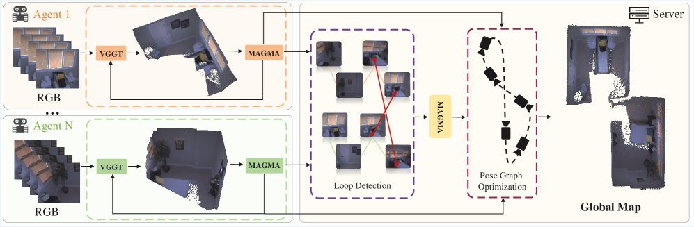
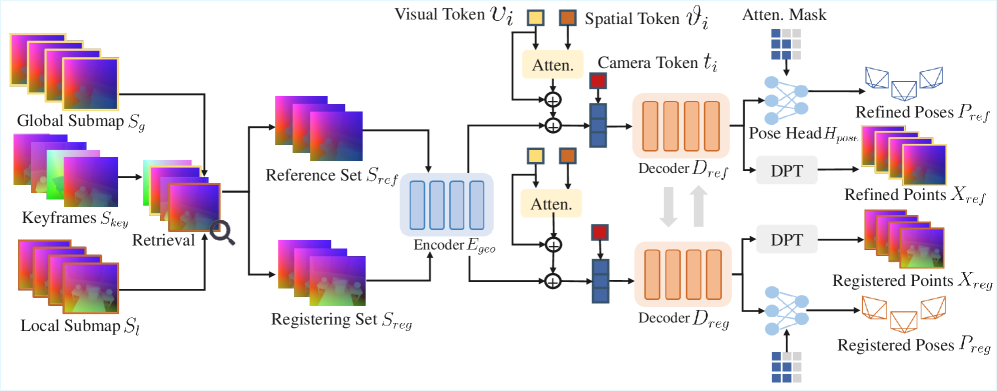
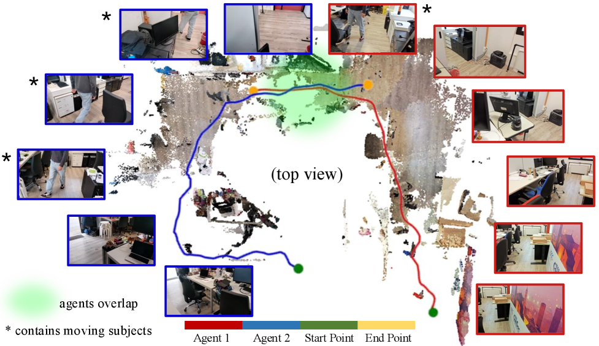

# MAGiSt3R：面向单目 RGB 视频的多智能体前馈式三维重建

## 结论先行

- MAGiSt3R 自称是**第一个多智能体（multi-agent）前馈式 RGB 三维重建系统**：多个智能体各自独立采集单目 RGB 视频，系统把它们协作融合成一张全局一致的稠密点图并同时估计各自相机轨迹，整体约 10 FPS（证据：Abstract、Introduction "the first multi-agent feed-forward 3D reconstruction framework"、Conclusion "at almost 10 FPS"）。
- 核心不是发明新的骨干，而是**把现成的前馈 3R 模型（选用 VGGT）当作局部点图/位姿的生成器**，再补上一个可学习的合并模块 MAGMA 与一个经典后端 PGO，专门解决 3R 模型"缺全局优化、长序列易漂移"这个老问题（证据：Introduction 对 3R 模型局限的论述 + 方法节 Eq.1 用 $\Phi_{\text{VGGT}}$ ）。
- 关键创新是 **MAGMA（Multi-Agent Global Map Aggregation）**：一个前馈的 submap 合并网络，把"待配准子图 registering set"对齐进"参考子图 reference set"的统一坐标系。它把几何 token 与外观 token（来自 ViT/DINOv2-SALAD）融合，用交叉注意力做跨坐标系匹配——**同一个 MAGMA 既做智能体内增量合并，又做智能体间的回环融合**（证据：Fig.3 与 3.2 节，Eq.3–8）。
- 抑制漂移靠**两道防线**：MAGMA 学习式合并本身比 RANSAC+ICP / VGGT-SLAM 的 SL(4) 优化更抗低重叠；其上再叠一层基于 $SE(3)$ 位姿图的 Levenberg-Marquardt 优化（PGO）。消融显示 **PGO 比骨干选择更关键**（去掉 PGO：Acc 5.37→6.18，RMSE 3.87→5.65；换骨干 SAIL-Recon 仅到 5.97/4.06）（证据：Tab.2）。
- 精度证据（ReplicaMultiagent 多智能体设定，越低越好）：MAGiSt3R 平均 Acc 5.37 / Comp 3.36 / ATE-RMSE 3.87，全面优于把 DUSt3R/MASt3R/SLAM3R/VGGT-SLAM 用 RANSAC+ICP 拼成的多智能体基线（次优 VGGT-SLAM∐ 为 11.36 / 8.44 / —，MASt3R∐ 10.12/8.16）（证据：Tab.1、Tab.3）。
- 速度定位是"**接近实时的前馈档**"而非极致吞吐：摘要称 "almost 10 FPS"，正文实测约 9 FPS；与并发工作 MA-MASt3R-SLAM 同档，但论文称在真实数据 AriaMultiagent 上轨迹明显更准；纯速度上 VGGT-SLAM 更快但精度差（证据：Abstract、运行时表及其正文）。
- 工程可用性目前**偏弱**：项目页写明 "Code (coming soon)"，截至核实**无代码仓库、无权重、无训练脚本、未声明许可证**，仅公开了部分重建结果。想复现需从零复刻 MAGMA（推断，基于项目页与 arXiv 状态）。

## 1. 这篇论文解决什么问题？

- 问题定义：多个智能体在同一室内环境中**各自独立**采集单目 RGB 视频流，如何在线、协作地把它们融合成一张**全局坐标系统一**的稠密三维点图，并同时估计每个智能体的相机轨迹。
- 输入 / 输出：输入为若干条独立的有序 RGB 序列（每个智能体一条，无深度、可无已知内参）；输出为逐帧局部点图与相机位姿，最终汇聚为全局点图 + 各智能体轨迹。
- 目标场景：多机器人协作建图、大范围 spatial AI、多设备 AR 协同——即"多人/多机边走边建同一张图"。
- 与现有方法的差异：
  - 传统多智能体 SLAM 建在 NeRF/3DGS 上（如 MNE、MAGiC-SLAM），**场景特定、需部署时逐场景优化、且大多需要 RGB-D 输入**，难以实时；
  - 单智能体前馈 3R 系统（DUSt3R/MASt3R/SLAM3R/VGGT-SLAM）快且只吃 RGB，但**缺全局优化、长序列漂移**，且原生不支持多智能体；
  - MAGiSt3R 主张把前馈 3R 的"快、只吃 RGB"优势搬进多智能体框架，同时用可学习合并 + PGO 补齐"全局一致性"的短板。

## 2. 方法概览

- 核心想法：**前馈生成 + 可学习合并 + 经典优化** 三段式。用 VGGT 逐 submap 前馈出局部点图与位姿；用可训练的 MAGMA 把 submap 增量对齐到统一坐标系（智能体内），并在检测到回环时融合不同智能体的地图（智能体间）；最后用 pose graph optimization 全局校正累积漂移。
- 一句话 pipeline：RGB 序列切成每 $m$ 帧一个 submap → VGGT 出点图/位姿/相机 token + ViT/SALAD 出视觉与全局描述子 → 检索 top-$N$ 参考帧 → MAGMA 编码几何+外观 token、双解码器交叉注意力 → DPT/pose 头出对齐后的点图与全局位姿 → 跨智能体回环检测触发同一 MAGMA 融合 → $SE(3)$ 位姿图 LM 优化回填所有位姿。

### 2.1 架构解析

（图源：arXiv:2607.15211，MAGiSt3R Fig.1 teaser。左 VGGT-SLAM + RICP，右 MAGiSt3R。）

（图源：arXiv:2607.15211，MAGiSt3R Fig.2 overview。）

- 整体结构（三大模块）：
  1. **Intra-agent Reconstruction（3.1）**：每个智能体各自把 RGB 流切成 submap，用 VGGT 前馈出深度/置信度/相机参数并反投影为点图，同时抽视觉 token 与描述子；用 MAGMA 增量把 submap 合并进该智能体的统一坐标系。
  2. **MAGMA 模型（3.2）**：本文的核心可学习组件。输入"参考集 reference set（当前全局图 + 关键帧）"与"待配准集 registering set（新子图）"，输出对齐进全局坐标系的点图与位姿。**同一模块复用于 intra 与 inter 两级**。
  3. **Inter-agent Reconstruction（3.3）+ 后端 PGO（3.4）**：把第一个智能体第一帧设为全局坐标系；当新智能体的子图与已有智能体关键帧的描述子相关度超阈值 $\tau_{loop}$，判定跨智能体回环，用 MAGMA 融合；最后构建 $SE(3)$ 位姿图做 LM 优化。
- 数据流关键点：submap 定义为 $\bm{S}\_i=\{\bm{t}\_i,\bm{X}\_i,\bm{P}\_i,\bm{\upsilon}\_i,\bm{\delta}\_i,\bm{\vartheta}\_i\}$ （相机 token、点图、位姿、视觉 token、全局描述子、空间 token）；每个 submap 取中间帧作关键帧存入 $\bm{I}\_{key}$，供后续检索与回环。
- 关键设计选择及理由：
  - **骨干选 VGGT 而非 SAIL-Recon**：消融显示 VGGT 更优（Tab.2）；
  - **合并做成"可学习网络"而非纯几何配准**：RANSAC+ICP / SL(4) 高度依赖两子图相似度，低重叠时退化；MAGMA 学几何对应，低重叠更鲁棒（3.2、Tab.1 论证）；
  - **几何 token + 外观 token 融合**：纯点图几何在重复结构/无纹理处有歧义，用视觉/空间 token 生成外观 token 消歧（Eq.4）。

（图源：arXiv:2607.15211，MAGiSt3R Fig.3 MAGMA overview。）

### 2.2 核心原理

- 为什么这样设计 work：
  - **前馈骨干负责"局部快而准"**，把逐帧稠密几何和粗位姿一次性回归出来，避免逐场景优化，是 10 FPS 的来源；
  - **MAGMA 负责"跨坐标系对齐"**，把配准问题从"手工鲁棒估计"转成"学习式几何+外观匹配"，从而在**低重叠**（真实多智能体的常态，论文自采序列重叠仅约 15%）下仍能对齐；
  - **PGO 负责"全局一致"**，把 MAGMA 给出的相对变换当作图的边，用经典位姿图优化把累积漂移摊平——这是前馈 3R 一直缺的全局约束。
- 关键机制/归纳偏置：
  - **几何 token 与视觉 token 空间对齐**： $E_{geo}$ 用 kernel/stride=16 的 2D 卷积，模仿 ViT patch embedding，使几何 token 与视觉 token 逐 patch 对齐，便于融合（3.2）；
  - **注意力掩码约束信息流向**：pose 头里 $\bm{t}\_{ref}$ 关注全部自身 token，而 $\bm{t}\_{reg}$ 只关注 $\bm{t}\_{ref}$ ——保证"新子图向已建全局图看齐"而非反向污染（Eq.8 附文）。
- 与前作在原理上的本质区别：VGGT-SLAM 用 SL(4) 流形优化做拼接、SLAM3R 用 L2W 分支、MAGiC-SLAM 用 RANSAC+ICP——都偏"给定几何再对齐"；MAGiSt3R 把合并本身做成**端到端可训练的前馈网络**，并首次系统性地把它拉到"多智能体、intra+inter 两级"的场景。

### 2.3 关键公式解析

> 用 LaTeX；逐符号解释。行内公式与中文之间留有 ASCII 空格。

- 公式 (1)（前馈骨干）：
$$ \bm{t}_i,\bm{D}_i,\bm{C}_i,\bm{P}_i=\Phi_{\text{VGGT}}(\bm{I}_i) $$
  - 符号： $\bm{I}\_i=\{I\_1^i,\dots,I\_m^i\}$ 是第 $i$ 个 submap 的 $m$ 帧连续 RGB； $\Phi\_{\text{VGGT}}$ 为冻结/复用的 VGGT 骨干； $\bm{t}\_i$ 相机 token， $\bm{D}\_i$ 深度图， $\bm{C}\_i$ 置信度图， $\bm{P}\_i$ 相机内外参。
  - 作用：把一段视频窗口一次前馈成局部几何与位姿；点图 $\bm{X}\_i$ 由 $\bm{D}\_i$ 按 $\bm{P}\_i$ 反投影得到，并按置信度阈值 $\tau\_{conf}$ 过滤低置信 3D 点。

- 公式 (4)（外观 token，消歧的核心）：
$$ \bm{\alpha}_{ref}=\bm{\upsilon}_{ref}+\mathrm{softmax}\!\left(\frac{\bm{\upsilon}_{ref}\,\bm{\vartheta}_{ref}^{T}}{\sqrt{d}}\right)\bm{\vartheta}_{ref} $$
  - 符号： $\bm{\upsilon}\_{ref}$ 为 ViT 视觉 token， $\bm{\vartheta}\_{ref}$ 为 SALAD 空间 token， $d$ 为特征维度， $\bm{\alpha}\_{ref}$ 为输出的外观 token（对 registering 集同法得 $\bm{\alpha}\_{reg}$ ）。
  - 作用：一个残差式注意力，用空间 token 增强视觉 token，得到能在**不同坐标系间建立对应**的外观特征，缓解纯几何 token 在重复/无纹理结构上的歧义。

- 公式 (5)（特征融合）：
$$ \bm{F}_{ref}=[\bm{t}_{ref};\,\bm{\alpha}_{ref}+\bm{\gamma}_{ref}] $$
  - 符号： $\bm{\gamma}\_{ref}$ 为几何 token（由 $E\_{geo}$ 编码点图得到）， $\bm{t}\_{ref}$ 为相机 token， $[\,;\,]$ 为拼接。
  - 作用：把相机、外观、几何三类信息合成 MAGMA 解码器的输入 token $\bm{F}\_{ref}$；registering 集同法得 $\bm{F}\_{reg}$。

- 公式 (9)（置信度感知配准损失，沿用 DUSt3R）：
$$ \mathcal{L}_{reg}=M\cdot\Big(\bm{C}_g\cdot\left\|\bm{X}_g-\hat{\bm{X}}_g\right\|-\beta\log\bm{C}_g\Big) $$
  - 符号： $M$ 为有效点掩码， $\bm{X}\_g/\hat{\bm{X}}\_g$ 为全局坐标系下预测/真值点图， $\bm{C}\_g$ 为预测置信度， $\beta$ 为置信度正则权重。
  - 作用：以置信度加权的点图回归损失， $-\beta\log\bm{C}_g$ 防止模型把置信度一味压低；点图按有效点平均欧氏距离归一化以适配尺度。

- 公式 (10)（相机损失）：
$$ \mathcal{L}_{pose}=\left\|\bm{P}_g-\hat{\bm{P}_g}\right\| $$
  - 符号： $\hat{\bm{P}}_g=[q,b,f]$，四元数 $q\in\mathbb{R}^4$、平移 $b\in\mathbb{R}^3$、视场角 $f\in\mathbb{R}^2$ （假设主点在图像中心）。
  - 作用：直接监督融合后全局坐标系下的相机参数。

- 公式 (11)（几何一致性，跨视重投影）：
$$ \mathcal{L}_{geo}=M\left\|\tilde{X}_j-\tilde{X}_k\right\|_2 $$
  - 符号：随机取两视 $j,k$，用真值深度 $\hat{D}\_j,\hat{D}\_k$、内参 $\hat{K}\_j,\hat{K}\_k$ 与预测位姿 $T\_j,T\_k$ 把像素重投影到全局系得 $\tilde{X}\_j,\tilde{X}\_k$， $M$ 为有效像素掩码。
  - 作用：强制被配准子图与全局场景几何一致（消融去掉它 Acc 5.37→5.88，见 Tab.1-F）。

- 公式 (12)（总损失）：
$$ \mathcal{L}=\lambda_{reg}\mathcal{L}_{reg}+\lambda_{pose}\mathcal{L}_{pose}+\lambda_{geo}\mathcal{L}_{geo} $$
  - 取 $\lambda_{reg}=1,\ \lambda_{pose}=1,\ \lambda_{geo}=0.8$。

- 公式 (13)（后端 PGO 目标）：
$$ \min\sum_{i,j\in\varepsilon}\left\|\log\!\big(e_{ij}^{-1}(n_i^{-1}n_j)\big)\right\|^2_{\Omega_{ij}} $$
  - 符号： $n\_i,n\_j\in SE(3)$ 为 submap 节点位姿， $e\_{ij}$ 为 MAGMA 估计的相对变换（图的边）， $\log$ 是从 $SE(3)$ 到 $\mathfrak{se}(3)$ 的对数映射， $\Omega\_{ij}$ 为反映边不确定度的信息矩阵。
  - 作用：用 Levenberg-Marquardt 最小化位姿图残差，全局摊平累积漂移；优化得校正量 $\bm{n'}\_i$ 后按 $\bm{T}\_i=\bm{n'}\_i\bm{T}\_i$ （Eq.14）回填每帧位姿。

### 2.4 训练与推理细节

- 训练目标 / 损失函数：仅端到端训练 MAGMA 合并模块（骨干 VGGT、DINOv2-SALAD 复用），损失为 Eq.12 的三项加权和。
- 训练数据与规模：混合 **ScanNet + ScanNet++（真实室内）+ Aria Synthetic Environment（合成多房间）**。由于这些数据集原生不含多智能体设定，作者**人工模拟多智能体**：从一个场景的首帧和末帧各起一条轨迹、每 2 帧采样一帧，构造两条"智能体"轨迹来学 intra/inter 合并。
- 超参要点：VGGT 每次处理 $m=10$ 帧、步长 $s=5$； $\tau\_{conf}=0.25$， $\tau\_{loop}=0.6$，top-$N=10$， $\beta=1$；训练 200 epoch、batch size 5、4×A100、学习率 1.5e-5（PyTorch）。
- 推理流程：逐 submap 前馈 → 描述子检索 top-$N$ 参考帧 → MAGMA 增量合并（intra）→ 跨智能体描述子相关度触发回环 → MAGMA 融合（inter）→ 构图做 PGO → 回填位姿。整体约 10 FPS（两智能体设定）。

## 3. 关键贡献

1. 提出**首个多智能体前馈式单目 RGB 三维重建框架** MAGiSt3R，把前馈 3R 模型的"快、只吃 RGB"优势带进多机协作建图，约 10 FPS。
2. 提出可学习合并模块 **MAGMA**：几何 token + 外观 token 融合 + 双解码器交叉注意力，**同一模块统一处理 intra-agent 增量合并与 inter-agent 回环融合**，在低重叠下比 RANSAC+ICP / SL(4) / L2W 更鲁棒。
3. 用 **$SE(3)$ 位姿图 + LM 优化的后端 PGO** 抑制前馈流水线的累积漂移；消融证明 PGO 比骨干选择更关键。
4. 在 ReplicaMultiagent 与 AriaMultiagent 上，reconstruction 与 tracking 均优于将 DUSt3R/MASt3R/SLAM3R/VGGT-SLAM 改造成多智能体的前馈基线，并与并发的 MA-MASt3R-SLAM 同速而更准（真实数据）。

## 4. 实验与证据

| 维度 | 内容 |
|---|---|
| 训练数据 | ScanNet、ScanNet++、Aria Synthetic Environment（人工切分模拟多智能体） |
| 评测数据 | ReplicaMultiagent（合成，2 智能体，含真值重建）、AriaMultiagent（真实，3 智能体，有真值位姿/深度，无真值重建） |
| Baseline | 单智能体：DUSt3R、MASt3R、SLAM3R、MASt3R-SLAM、VGGT-SLAM；多智能体：上述 + RANSAC+ICP(∐) 构造，及并发 MA-MASt3R-SLAM；RGB-D 神经 SLAM（MNE、MAGiC-SLAM）仅作参考 |
| 指标 | Accuracy、Completeness（重建，越低越好）、ATE-RMSE（跟踪），FPS |
| 主要结果 | ReplicaMultiagent 多智能体：MAGiSt3R 平均 Acc 5.37 / Comp 3.36 / RMSE 3.87，显著优于 VGGT-SLAM∐ (11.36/8.44)、MASt3R∐ (10.12/8.16) |
| 消融 | 合并策略 A/B/C vs MAGMA；骨干 VGGT vs SAIL-Recon；PGO 有无； $\mathcal{L}_{geo}$、空间 token 有无 |
| 失败案例 | 论文未列具体失败图；局限见第 5 节（昼夜/天气差异大、>3 智能体未验证） |

### 4.1 效果与性能解析

- 合并策略消融（Tab.1，多智能体，越低越好）：RICP (A) 8.89/6.47/7.66；SL(4) (B) 13.66/11.67/18.94；L2W (C) 9.71/7.16/9.19；MAGMA 单智能体训练 (D) 6.89/4.93/5.35；**MAGiSt3R 完整 (E) 5.37/3.36/3.87**。说明：即便只在单智能体设定下训练，MAGMA 也已胜过所有手工/半学习基线；多智能体训练进一步释放潜力。SL(4) 表现最差，印证"高度依赖两子图相似度"的推断——低重叠下退化明显。
- 骨干与 PGO 消融（Tab.2）：换骨干 SAIL-Recon (H) 5.97/3.88/4.06 略逊于 VGGT (E)；**去掉 PGO (I) 6.18/4.11/5.65**，RMSE 从 3.87 跳到 5.65，跌幅远大于换骨干——PGO 是抑制漂移的主力。但即使无 PGO，MAGMA 仍优于 Tab.1 的 A/B/C，说明合并模块本身贡献扎实。
- 单智能体重建（Tab.3，Agent 1 平均）：MAGiSt3R 4.65/2.98，优于 MASt3R 7.00/4.05、VGGT-SLAM 9.04/5.38；多智能体设定下差距进一步拉大（本方法 5.37/3.36 vs 次优 10+ 档）——**多智能体正是本方法的主场**。
- 性能与效率：约 10 FPS（两智能体，ReplicaMultiagent，Tab.8）。与 MA-MASt3R-SLAM 同速，但论文称在真实 AriaMultiagent 上轨迹明显更准；VGGT-SLAM 更快但精度低；RGB-D 神经 SLAM 跟踪最准却帧率极低且需深度输入。定位为"接近实时的前馈档，用少量精度换掉对深度和逐场景优化的依赖"。
- 可比性与协议：多智能体基线是作者用 RANSAC+ICP 把单智能体前馈方法"拼"出来的（标注 ∐），并非各方法原生多智能体实现；RGB-D 系统明确标为"参考而非公平基线"。协议自洽，但与外部数字横比时需注意这是作者自建的适配基线（推断）。

## 5. 局限与风险

- 论文明确承认：当前框架（及基线）**不适用于智能体处于差异极大的条件**（昼/夜、恶劣天气）；未验证 **>3 个智能体**的更大规模场景；计划补新基准。
- 我推断的风险：
  - **评测局限于室内**（Replica/Aria/ScanNet 系），室外、大尺度、动态场景泛化未知；自采序列虽含少量运动主体但规模小。
  - **多智能体基线为作者自建**（RICP 适配），"SOTA"结论对基线实现敏感；缺与更多原生多智能体系统的公平对比。
  - 精度依赖 VGGT 骨干与 DINOv2-SALAD 检索，骨干误差会传导； $\tau_{loop}=0.6$ 等阈值对回环召回/误检敏感。
- 工程落地风险：**代码/权重/训练脚本均未发布**（项目页 "Code coming soon"），复现需从零复刻 MAGMA 训练管线（含多智能体切分与三项损失）；4×A100、200 epoch 的训练成本不低。
- 许可证 / 数据风险：未声明代码许可证；训练用 ScanNet/ScanNet++/ASE 各有自身研究许可与使用条款，商用需单独核实。

## 方法谱系

> 仅链接仓库中真实存在的 slug。

- 基于（backbone / 直接依赖）：
  - [VGGT](../3d-reconstruction/2025-vggt.md)（前馈骨干 $\Phi_{\text{VGGT}}$，出局部点图/位姿）
  - [DUSt3R](../3d-reconstruction/2023-dust3r.md)（置信度感知点图回归损失范式，Eq.9 沿用）
- 谱系近邻（流式/在线前馈重建线，均在库）：
  - [MASt3R](../3d-reconstruction/2024-mast3r.md)、[Spann3R](../3d-reconstruction/2024-spann3r.md)、[CUT3R](../3d-reconstruction/2025-cut3r.md)、[Stream3R](../3d-reconstruction/2025-stream3r.md)、[WinT3R](../3d-reconstruction/2025-wint3r.md)、[TTT3R](../3d-reconstruction/2025-ttt3r.md)、[LingBot-Map](../3d-reconstruction/2026-lingbot-map.md)、[Pi3](../3d-reconstruction/2026-pi3.md)、[VGGT-Omega](../3d-reconstruction/2026-vggt-omega.md)

## 6. 与相似方法对比

| Method | 相同点 | 不同点 | 何时选它 |
|---|---|---|---|
| [VGGT](../3d-reconstruction/2025-vggt.md) | 前馈回归点图/位姿；MAGiSt3R 以其为骨干 | VGGT 是单序列多视骨干、无在线合并/回环/多智能体；MAGiSt3R 在其上加 MAGMA+PGO+多智能体 | 只需单序列一次性重建、不需在线/协作时选 VGGT |
| [WinT3R](../3d-reconstruction/2025-wint3r.md) | 流式在线、约 10–17 FPS、抑制漂移 | WinT3R 用滑窗+相机 token 池做**单智能体**流式；MAGiSt3R 面向**多智能体协作**、显式回环+PGO | 单相机流式高吞吐选 WinT3R；多机协作建图选 MAGiSt3R |
| [CUT3R](../3d-reconstruction/2025-cut3r.md) | 在线增量、持久状态抑漂移 | CUT3R 逐帧递归持久状态、单智能体、无显式 PGO；MAGiSt3R 学习式合并+经典 PGO | 需持久隐状态的连续单流选 CUT3R |
| [LingBot-Map](../3d-reconstruction/2026-lingbot-map.md) | 流式在线前馈、面向机器人建图 | 侧重极致吞吐/单体建图；MAGiSt3R 强调多智能体全局一致与回环 | 追求最高 FPS 的单体建图选 LingBot-Map |

> 横向定位见 [streaming-3d-reconstruction 对比](../../comparisons/3d-reconstruction/streaming-3d-reconstruction.md) 与 [visual-geometry-foundation-models 对比](../../comparisons/3d-reconstruction/visual-geometry-foundation-models.md)。MAGiSt3R 是这条线上**首个明确"多智能体协作"**的分支。

## 7. 复现判断

- Git 地址：无独立仓库；项目页 https://zorangong.github.io/magist3r_page/ 标注 "Code (coming soon)"。
- 是否开源：**否**（截至 2026-07 核实）。
- 是否开源训练：未知（代码/训练脚本均未发布）。
- 代码可用性：不可用；仅公开部分重建结果（项目页 Results / Google Drive）。
- 权重可用性：不可用。
- 数据可获得性：训练数据 ScanNet/ScanNet++/ASE 需各自研究许可；评测 ReplicaMultiagent、AriaMultiagent 来自 CP-SLAM / MAGiC-SLAM，可申请获取。
- 预计环境成本：从零复训需 4×A100 级、200 epoch；含多智能体切分数据构造与三项损失实现。
- 最小复现路径：待官方放码前，可先用官方 VGGT + DINOv2-SALAD 复刻"逐 submap 前馈 + RANSAC/ICP 合并 + g2o/GTSAM 位姿图"的**降级基线**，验证 pipeline，再补 MAGMA 学习式合并。
- 是否得复现：**暂缓**。方法思路清晰、结果诱人，但无代码/权重、评测限室内、基线为自建适配。建议等官方放码或作为"多智能体前馈重建"方向的设计参考先行跟踪。

## 8. 后续动作

- [x] 更新 `indices/papers.md`
- [x] 更新 `indices/directions.md`
- [x] 纳入 `comparisons/3d-reconstruction/streaming-3d-reconstruction.md`（新增"多智能体协作"维度）与 `development-survey.md`
- [ ] 官方放码后再评估创建 `reproductions/3d-reconstruction/magist3r/README.md`（见 open-source-tracking：`oss_last_checked` 待回填）
