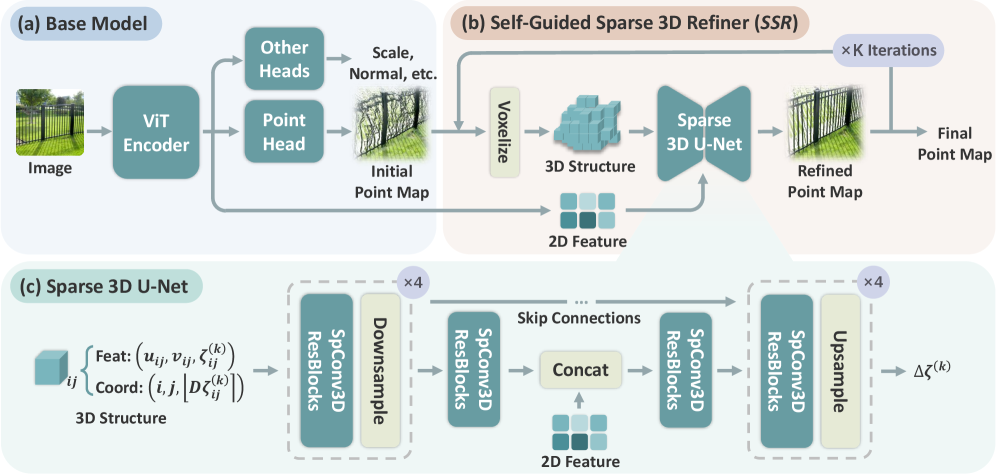
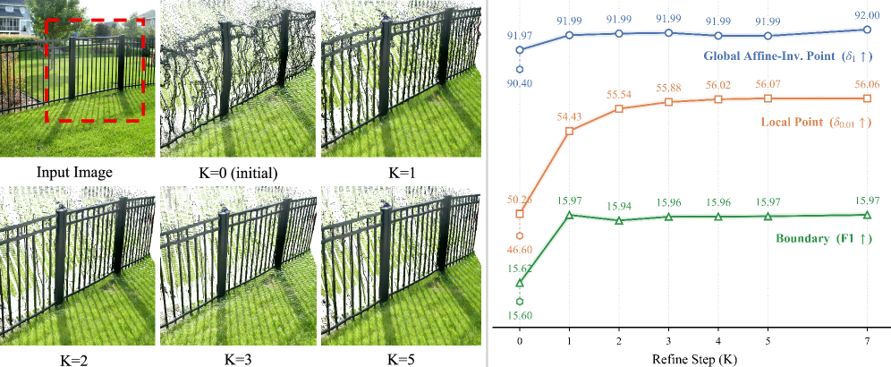
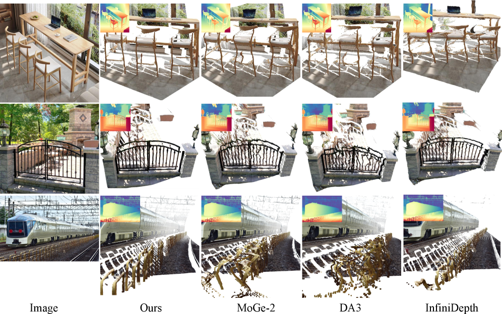

# MoGe-3：Fine-Detail Monocular Geometry Estimation with Self-Guided Sparse Volumetric Refinement

> 图片来源：论文 arXiv:2607.17967v2 / 项目页 https://qft-333.github.io/moge3page/ 。以下数值均来自论文与项目页，未经本地复现。

## 结论先行

- MoGe-3 的核心命题是一个**架构失配（architectural mismatch）诊断**：现有单目几何模型在 2D 图像参数化里解码 3D 几何，2D 卷积/上采样会在深度不连续处混合前后景特征，导致细结构（栏杆、树枝、小物体）被过度平滑。它把这套问题定性为「表示空间错了」，而不是「网络不够大」。
- 解法是 **Self-Guided Sparse 3D Refinement（SSR）**：以 MoGe-2 为 base 出 coarse point map，把点图 lift 成一层薄的 **sparse voxel shell**，用 sparse 3D U-Net 按真实 3D 空间局部性聚合特征、迭代预测深度残差。跨深度断层的点在体素空间天然不相邻，从根上避免了 2D 空间的特征串扰。
- 论文报告在 9 个 zero-shot benchmark 上、尤其是严格的细节指标（局部 point F1、boundary、strict δ 阈值）上明显领先 MoGe-2 与 Depth Pro / Depth Anything 3 / UniK3D 等 baseline，同时保持 metric-scale 输出；ViT-L 3-step 细化仅增加约 121ms（A100）。（推断：细节指标增益最大、全局指标增益较小，符合「只改细化不改全局尺度」的设计定位。）
- 谱系上它是 **MoGe 系列第 3 代**，直接 supersede MoGe-2，backbone 仍是 DINOv2；与 DUSt3R/VGGT 单目几何线同源，但关注点从「多视图对齐 / 大模型」转向「单目细节保真 + 3D 表示空间」这一被忽视的维度。
- 复现风险：**截至 2026-07-23，MoGe-3 代码与权重尚未发布**（GitHub 仅公告 coming soon），论文声明将开源 code/model/training/eval，但当前不可复现。建议标记 watch，待官方放出权重后再评估。

## 1. 这篇论文解决什么问题？

- 问题定义：单目 RGB → metric-scale 3D 几何（point map / 深度）的 **feed-forward** 估计，重点是**细粒度几何保真**——恢复薄结构、物体边界、小物体，而非仅刷全局深度精度。
- 输入 / 输出：输入单张 RGB 图像；输出 metric-scale point map（每像素 3D 坐标 $(X,Y,Z)$ ）及可导出的深度、法向、有效性 mask。
- 目标场景：需要精细几何的下游任务——3D 重建、机器人抓取/避障、AR、深度补全等，尤其是含大量细结构的真实场景。
- 与现有方法的差异：MoGe-1/2、Depth Pro、Depth Anything、UniDepth/UniK3D 等都在 **2D 参数化**里用 DPT 风格解码器出稠密图。论文指出这类解码器在深度断层处会把不同深度层的特征混在一起（2D 邻域 ≠ 3D 邻域），造成边界过度平滑。MoGe-3 不换 backbone、不堆规模，而是**新增一个在 3D 稀疏体素空间工作的细化模块**去修这个结构性缺陷。

## 2. 方法概览

- 核心想法：几何该在几何空间里被 refine。把 base 模型的 coarse point map 投影成一层 **sparse voxel shell**（只占据表面附近的体素），在这个 3D 表示上用 sparse 3D 卷积按空间局部性聚合特征，迭代出深度残差。
- 一句话 pipeline：`RGB → MoGe-2 base（coarse point map + DINOv2 特征）→ 自引导体素化成 sparse voxel shell → Sparse 3D U-Net（融合对齐的 2D 特征）预测 log-depth 残差 → 迭代 re-voxelize K 步 → metric point map`。

### 2.1 架构解析

*图：MoGe-3 整体流程——base 模型出 coarse 点图与特征，SSR 模块自引导体素化、稀疏 3D U-Net 细化并迭代更新。来源：arXiv:2607.17967v2, Fig.2。*

整体分两大件：

1. **Base Model（几何先验）**：直接沿用 MoGe-2（DINOv2 ViT backbone + 轻量 head），产出初始 point map 与 DINOv2 图像特征。这部分负责全局尺度与整体形状，是「粗解」。论文提供 ViT-L 与 ViT-G 两个 backbone 变体。
2. **Self-Guided Sparse 3D Refiner（SSR）**：核心创新，每次迭代做三步——
   - **自引导体素化（self-guided voxelization）**：把当前 point map 按其自身预测的深度投影到 3D 体素网格，只激活表面附近体素，得到一层「voxel shell」（稀疏，不是稠密体积，显存可控）。
   - **Sparse 3D U-Net**：带残差块、skip connection 的稀疏 3D U-Net，多尺度提特征，并把 base 的 2D DINOv2 特征**对齐注入**到对应体素（2D-3D 特征融合），补充语义。
   - **迭代更新（iterative update）**：预测深度残差并施加到几何上，再用更新后的几何重新体素化，循环 K 步渐进细化。

关键设计选择及理由：
- **只保留一层体素壳而非稠密体积**：单目只看得到表面，稠密体积浪费显存；sparse shell 让 3D 卷积的开销与像素数同阶，才让 3D 细化在 feed-forward 里可行。
- **残差式细化 + 零初始化**：SSR 学的是对 base 的**修正量**，训练初期残差≈0，不破坏 base 已有的良好全局解，稳定收敛。
- **保持图像坐标固定、只改深度**：采用因式分解表示（见 2.3）， $(u,v)$ 锁死、只预测 $\log Z$ 残差，把细化限制在深度维度，避免横向漂移。

### 2.2 核心原理

- 为什么这样设计 work：2D 解码器的感受野是**图像平面上的邻域**，而图像上相邻的两个像素在 3D 里可能相距很远（前景边缘 vs. 远处背景）。2D 卷积无差别地把它们的特征加权混合，就把锐利边界抹平了。搬到 3D 体素空间后，卷积的邻域是**真实 3D 邻域**——分属不同深度层的点不再相邻，特征自然不串扰，边界得以保留。这是「3D spatial locality」相对「2D image locality」的本质优势。
- 关键机制/归纳偏置：sparse conv 把「表面连续、跨断层不连续」这一几何先验**编码进了网络拓扑**，而不是靠数据/loss 去学。这是一种强而正确的归纳偏置。
- 与前作在原理上的本质区别：MoGe-1/2、Depth Anything 3、UniK3D 都在 2D 里做全部推理；MoGe-3 保留 2D base 出粗解，但把**细化搬到 3D**。它不是换更强 backbone，而是换**细化发生的表示空间**——这是被同行忽视的一个正交改进方向。

### 2.3 关键公式解析

> 公式转录自项目页/论文 Fig.2 与方法节；符号以论文为准。

- 公式 (1) 因式分解表示（factorized representation）：

$$ \boldsymbol{q}_{ij} = (u_{ij}, v_{ij}, \zeta_{ij}) = \left( \frac{X_{ij}}{Z_{ij}},\ \frac{Y_{ij}}{Z_{ij}},\ \log Z_{ij} \right) $$

  - 符号： $(X\_{ij}, Y\_{ij}, Z\_{ij})$ 是像素 $(i,j)$ 的 3D 坐标； $(u\_{ij}, v\_{ij})$ 是归一化图像平面射线方向（去掉深度后的横向位置）； $\zeta\_{ij} = \log Z\_{ij}$ 是对数深度。
  - 作用：把点图分解成「射线方向 + 对数深度」。射线方向 $(u,v)$ 由像素位置和相机内参决定，可视作固定；细化只需预测 $\zeta$ 的残差。对数化让近处/远处深度误差被相对尺度归一，符合深度的尺度特性。

- 公式 (2) 稀疏体素化（sparse voxelization）：

$$ \mathcal{V}^{(k)} = \{ \boldsymbol{c}_{ij}^{(k)} \}, \quad \boldsymbol{c}_{ij}^{(k)} = \left( i,\ j,\ \lfloor D \cdot \zeta_{ij}^{(k)} \rceil \right) $$

  - 符号： $\mathcal{V}^{(k)}$ 是第 $k$ 步迭代激活的体素集合； $\boldsymbol{c}\_{ij}^{(k)}$ 是像素 $(i,j)$ 落入的体素坐标，前两维沿用像素网格 $(i,j)$ ，第三维把对数深度 $\zeta\_{ij}^{(k)}$ 量化到深度 bin（ $\lfloor\cdot\rceil$ 为四舍五入取整， $D$ 为深度分辨率，论文取 $D=200$ ）。
  - 作用：把点图「立」进 3D 网格。因为只有表面像素被投影，激活体素数量与像素数同阶（稀疏壳），这是 sparse conv 能高效运行的前提。 $D$ 越大深度越精细但体素越占用， $D=200$ 是精度/占用的折中。

- 公式 (3) 最终点图恢复：

$$ \boldsymbol{p}_{ij}^{(K)} = e^{\zeta_{ij}^{(K)}} \cdot (u_{ij},\ v_{ij},\ 1) $$

  - 符号： $\zeta\_{ij}^{(K)}$ 是 $K$ 步细化后的对数深度； $e^{\zeta\_{ij}^{(K)}} = Z\_{ij}^{(K)}$ 还原线性深度；乘上射线方向 $(u,v,1)$ 得回 3D 点 $\boldsymbol{p}\_{ij}^{(K)} = (X,Y,Z)$ 。
  - 作用：从因式分解表示解回 metric point map。因 $(u,v)$ 固定，几何精度完全由细化后的深度决定。

- 公式 (4) 训练总损失：

$$ \mathcal{L} = \sum_{k=0}^{K} \mathcal{L}_{\mathrm{geo}}^{(k)} + \lambda_{m}\mathcal{L}_{\mathrm{mask}} + \lambda_{n}\mathcal{L}_{\mathrm{nml}} + \lambda_{s}\mathcal{L}_{\mathrm{scale}} $$

  - 符号： $\mathcal{L}\_{\mathrm{geo}}^{(k)}$ 是第 $k$ 步（含 base 的第 0 步与后续细化步）的几何监督（论文含 global/local/edge 分量）； $\mathcal{L}\_{\mathrm{mask}}$ 有效性 mask 损失； $\mathcal{L}\_{\mathrm{nml}}$ 法向一致性； $\mathcal{L}\_{\mathrm{scale}}$ metric 尺度损失； $\lambda\_m, \lambda\_n, \lambda\_s$ 为权重（论文各分量权重约为 global/local/edge = 1.0/1.0/1.0，mask/normal/scale = 0.1/0.1/0.1）。
  - 作用：对**每一步迭代**都加几何监督（deep supervision），逼每步都朝正解走，稳住迭代细化；edge 分量专门盯边界质量，是细节增益的直接来源；scale 损失保证 metric 输出。

### 2.4 训练与推理细节

- 训练目标 / 损失：见公式 (4)，逐迭代步的几何监督 + mask + 法向 + metric 尺度。
- 两阶段训练：
  - **Stage 1**：冻结/detach base 特征梯度，SSR 残差头**零初始化**，先单独训细化模块，避免早期破坏 base。
  - **Stage 2**：端到端联合微调 base + SSR。
- 训练配置要点：AdamW，梯度裁剪 $\|g\|_2 \le 1.0$ ；体素深度分辨率 $D=200$ ；训练用 $K=3$ 步迭代；训练数据为大规模合成+真实混合（Apollo、Objaverse、Hypersim、Structured3D 等，细节在 Appendix A.3）。
- 推理流程：RGB → base 出 coarse point map + DINOv2 特征 → 自引导体素化 → sparse 3D U-Net 出残差 → 迭代 $K$ 步 → 恢复 metric point map。
- 效率：ViT-L 3-step SSR 每帧约 121ms（A100）；base 部分推理开销与 MoGe-2 持平，细化是增量。训练用 $K=3$ 但推理可外推到 $K=7$ 而不退化（迭代模块的良好泛化）。

## 3. 关键贡献

1. **诊断出「2D 参数化 vs. 3D 几何」的架构失配**，把单目几何细节丢失归因于表示空间而非模型容量——一个清晰、可操作的问题重定义。
2. **Self-Guided Sparse 3D Refinement（SSR）**：首个把单目几何细化放进 sparse voxel shell + sparse 3D conv 的 feed-forward 模块，用 3D 空间局部性从根上避免跨深度断层的特征混合。
3. **因式分解 $(u,v,\log Z)$ 表示 + 迭代残差细化**：固定射线方向、只精修对数深度，配合逐步 deep supervision，实现稳定的渐进细化，且训练 $K=3$ 可推理外推 $K=7$。
4. **在 9 个 zero-shot benchmark 的细节指标上明显刷新 SOTA**，同时保持 metric-scale 与可控的额外开销（~121ms）。

## 4. 实验与证据

| 维度 | 内容 |
|---|---|
| 数据集 | Synth4K, Spring, NYUv2, KITTI, ETH3D, DIODE, Sintel, iBims-1, HAMMER（9 个 zero-shot benchmark） |
| Baseline | MoGe-2, Depth Pro, Depth Anything 3, UniDepth V2, UniK3D, Pixel-Perfect Depth, InfiniDepth |
| 指标 | Point F1、局部 δ（δ₀.₀₁）、Boundary F1、全局 δ₁、AbsRel、runtime |
| 主要结果 | 严格细节指标（局部/边界）领先明显：Point F1 82.7（MoGe-2 77.3，UniK3D 77.8）；ViT-G 下 F1(Local) 54.1 vs MoGe-2 47.1；strict δ 阈值增益最大 |
| 消融 | 体素分辨率 $D$ （取 200）、迭代步数 $K$ （训练 3、推理可 7）、2D 特征注入、两阶段训练 vs 端到端 |
| 失败案例 | 论文强调细节增益；全局尺度指标增益相对小（推断：细化不改全局解） |

### 4.1 效果与性能解析

*图：细化迭代对几何质量的影响，训练 K=3 可外推到更多步而不退化。来源：arXiv:2607.17967v2。*

*图：MoGe-3 相对前作在薄结构/边界上的细节恢复。来源：arXiv:2607.17967v2, teaser。*

- 主要结果解读：**增益集中在细节指标**（局部 point F1、boundary F1、strict δ₀.₀₁），全局深度指标（δ₁）增益相对温和。这与设计意图高度自洽——SSR 只精修深度、不重估全局尺度，所以它买的是「边界锐度和小结构」，不是「整体尺度更准」。论文自称在最严格的 δ₀.₀₁ 上增益最大，是最有说服力的证据点。
- 性能与效率：base 推理与 MoGe-2 持平，3-step SSR 增量约 121ms（ViT-L, A100）。sparse conv + voxel shell 让 3D 细化开销与像素数同阶，而非体素立方，是可用性的关键。
- 消融揭示的关键因素：体素深度分辨率 $D$ （精度/显存折中）、2D DINOv2 特征注入（补语义）、两阶段训练（稳收敛）、迭代步数外推能力。
- 与 SOTA / baseline 的可比性：均为 zero-shot 跨数据集评测，协议与 MoGe-2 一脉相承，可比性较好。（存疑：不同 baseline 的评测细节/对齐方式差异需查论文附录确认，本文数值来自项目页汇总表，未逐项核对原表。）

## 5. 局限与风险

- 论文明确承认（推断自定位）：SSR 是**细化**模块，依赖 base 的全局解质量——若 base 在某区域深度整体估错，SSR 未必能纠正大尺度错误，它擅长的是局部锐化。
- 我推断的风险：
  - 迭代细化 + 体素化引入额外延迟与实现复杂度（sparse conv 需专门算子库如 spconv/MinkowskiEngine，工程门槛高于纯 2D 模型）。
  - 体素深度分辨率 $D=200$ 是全局量化，极近/极远深度或超大深度范围场景可能受量化粒度限制。
  - 单目固有的尺度歧义仍在，metric 尺度靠训练数据先验，跨域时可能偏移。
- 工程落地风险：**代码/权重未发布**，无法即刻集成；sparse 3D conv 依赖对部署（尤其边缘设备/移动端）不友好。
- 许可证 / 数据风险：MoGe 仓库主体 MIT（DINOv2 部分 Apache-2.0），但 MoGe-3 具体权重许可未定；训练数据含多来源混合，商用需自查各数据集许可。

## 方法谱系

- 取代/改进：MoGe-2（仓库暂无该 slug，未建链接；MoGe-3 为其直接后继）
- 基于 / 同源单目几何线：[DUSt3R](2023-dust3r.md)、[VGGT](2025-vggt.md)、[Depth Anything 3](2025-depth-anything-3.md)
- backbone：DINOv2（特征提取器，同 MoGe 前作）

## 6. 与相似方法对比

- 视觉几何基础模型对比：[comparisons/3d-reconstruction/visual-geometry-foundation-models.md](../../comparisons/3d-reconstruction/visual-geometry-foundation-models.md)
- 场景表示范式：[comparisons/3d-reconstruction/scene-representation-paradigms.md](../../comparisons/3d-reconstruction/scene-representation-paradigms.md)

| Method | 相同点 | 不同点 | 何时选它 |
|---|---|---|---|
| MoGe-2 | 同系、单目 feed-forward metric point map、DINOv2 backbone | 全部在 2D 空间解码，无 3D 细化 | 需要成熟已开源权重、对细节要求一般时 |
| Depth Pro / Depth Anything 3 | 单目 zero-shot 深度/几何 | 2D 参数化解码，无 sparse 3D 细化 | 要即用开源、生态成熟、纯深度任务 |
| UniK3D / UniDepth V2 | metric 单目、zero-shot | 相机建模驱动，非 3D 体素细化 | 强调 metric 尺度与相机泛化 |
| DUSt3R / VGGT | 同属前馈几何基础模型线 | 面向多视图/大模型，非单目细节保真 | 多视图输入、需相机位姿联合估计 |

## 7. 复现判断

- Git 地址：https://github.com/microsoft/MoGe （MoGe 1/2/3 同仓）
- 是否开源：**否（截至 2026-07-23）**。README 仅公告 "MoGe-3 … new code and pretrained models are coming soon"，代码与权重未发布。
- 是否开源训练：unknown。论文声明「code/model/training/eval scripts will be made publicly available」，但尚未放出，无法核实训练是否真正开源。
- 代码可用性：暂无（MoGe-1/2 代码 MIT 可用，可作参考基座）。
- 权重可用性：预告 `moge-3-vitg` / `moge-3-vitl`，尚未上线。
- 数据可获得性：训练数据为多源合成+真实混合，未给完整可复现清单。
- 预计环境成本：推理级（单张 GPU 即可跑），但训练需大规模数据 + sparse conv 算子栈（spconv/MinkowskiEngine 类），成本高。
- 最小复现路径：等官方权重放出 → 用 9 benchmark 中 1-2 个（如 NYUv2/iBims-1）跑 zero-shot 推理，比对 Point F1 / boundary。当前不可行。
- 是否值得复现：**Watch**。想法干净且指标有说服力，但在权重发布前无法验证；建议持续跟踪仓库，权重上线后再评估复现/集成。

## 8. 后续动作

- [x] 更新 `indices/papers.md`（新增 2026-moge3 条目）
- [x] 更新 `indices/directions.md`（3d-reconstruction / monocular-geometry）
- [x] 纳入 `comparisons/3d-reconstruction/visual-geometry-foundation-models.md`（§3.7 单目几何分支）与 `development-survey.md`
- [ ] 官方放出权重后，补充实测数值并更新 `reproduction` 字段（见 open-source-tracking：`oss_last_checked` 待回填）
- [ ] 若 MoGe-2 分析已存在，交叉链接 supersedes 关系；如缺则考虑补 2025-moge2
