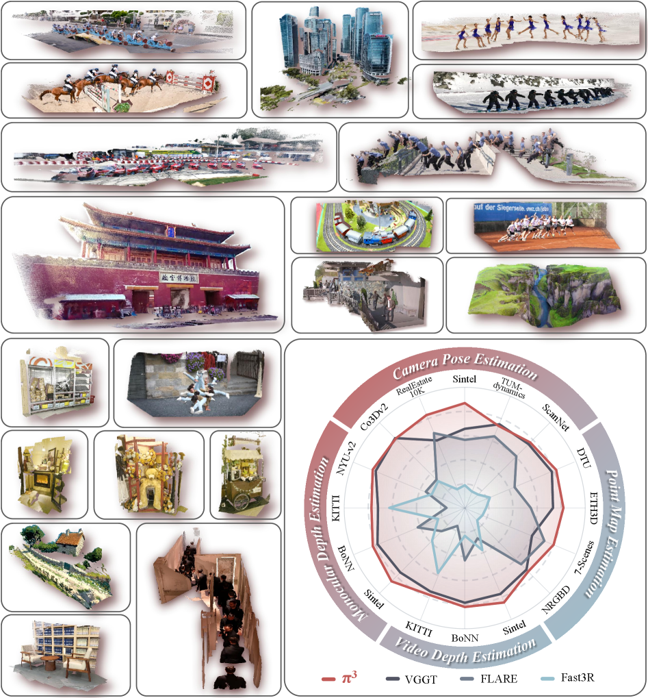
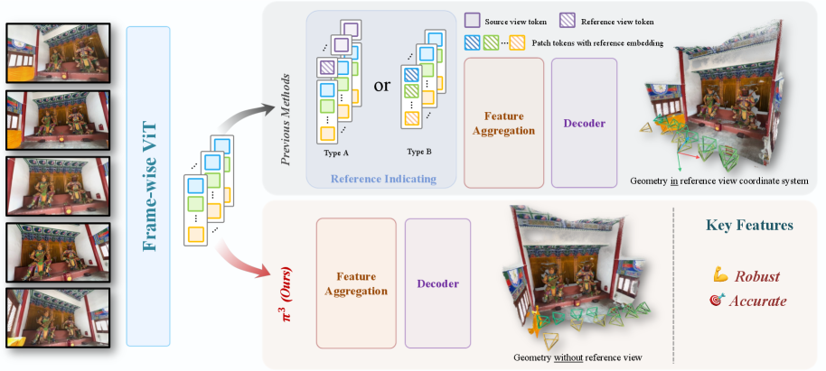
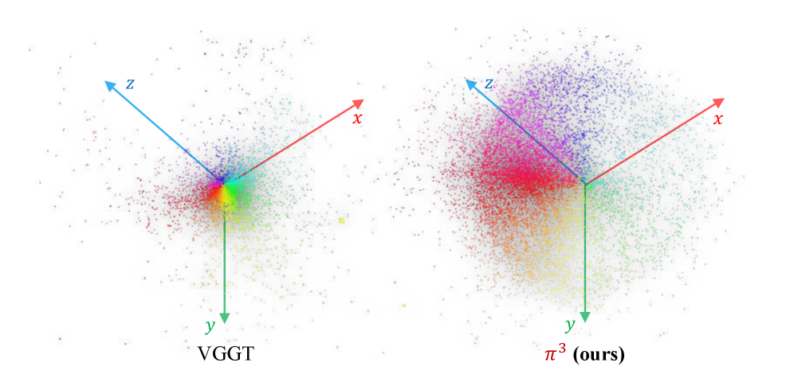
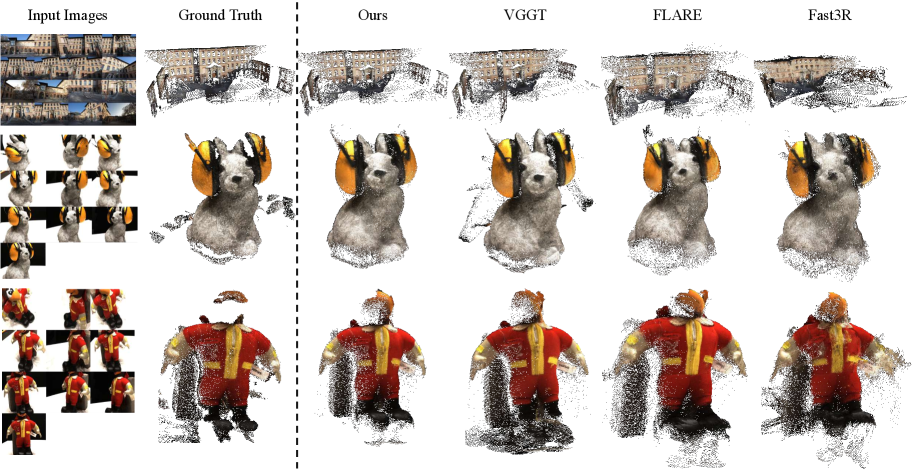

# Pi3：Permutation-Equivariant Visual Geometry Learning

> 注：用户给出的标题和 evaluation branch BibTeX 使用过 “Scalable Permutation-Equivariant Visual Geometry Learning”；OpenReview / arXiv v3 当前正式标题为 “π³: Permutation-Equivariant Visual Geometry Learning”。

## 结论先行

- **一句话定位**：π³ / Pi3 是一个 reference-free 的 feed-forward 视觉几何模型；它从单图、视频或无序多图集合直接预测 camera pose、per-view local point map 和 confidence map，核心卖点是对输入顺序和参考帧选择天然鲁棒。
- **核心方法**：Pi3 去掉固定参考帧、frame index positional embedding 和 reference token，用 DINOv2 backbone + view-wise / global 交替注意力（36 层）实现 permutation equivariance；三个独立解码头分别输出仿射不变（affine-invariant）的相对相机位姿、尺度不变（scale-invariant）的局部点图与 confidence，而不是把所有几何强行锚定到某个首帧坐标系。
- **实验结论**：论文报告 Pi3 在 camera pose、point map、video depth、monocular depth 上达到或接近 SOTA；例如 Sintel camera pose ATE 从 VGGT 的 0.167 降到 0.074，KITTI video depth AbsRel 从 VGGT 的 0.062 降到 0.038，KITTI 推理速度 57.4 FPS，高于 VGGT 的 43.2 FPS。关键鲁棒性证据是：打乱输入顺序时 Pi3 的指标方差接近 0，而 VGGT / Fast3R / FLARE 对参考帧选择敏感。
- **开源状态**：主 GitHub 公开，main 分支提供 inference / demo、Pi3X、HF 权重链接；evaluation 分支提供评测代码；training 分支提供三阶段训练脚本与配置。因此本仓库按 `training_open_source: true` 记录，但完整训练仍依赖大算力（第二阶段 64 A100）和一个 internal dynamic scene dataset。
- **工程判断**：Pi3 是研究“无序多视图、参考帧偏置、尺度/仿射不变几何”的重要 baseline；若目标是 metric scale、工程 API、NVS/3DGS 或多模态条件注入，当前应把 Pi3X、DA3 和 MapAnything 一起比较，而不是只看原始 Pi3 论文指标。

## 1. 这篇论文解决什么问题？

### 已确认的论文事实

- **问题定义**：从视觉输入中做 3D geometry reconstruction，覆盖 single image、video sequence、unordered image set；输入可以是静态或动态内容，不需要指定固定 reference view。
- **输入 / 输出**：输入为 $N$ 张 RGB 图像；输出为每张图对应的 camera pose $T_i$ 、pixel-aligned local point map $X_i$ 和 confidence map $C_i$ 。
- **核心矛盾**：传统 SfM/MVS 和很多 feed-forward 3D 方法会选一个参考视角作为全局坐标系；这个设计继承自经典几何，但对神经网络会引入参考帧偏置，导致第一帧或 reference view 选得差时结果不稳定。
- **目标场景**：AR、robotics、autonomous navigation、open-domain dense 3D reconstruction、video depth、camera pose estimation。

### 我的理解

Pi3 的重点不是“又做了一个更大的 3D transformer”，而是把坐标系选择这个长期默认设置拿掉。以前很多方法预测的是“所有点相对于第一个视角的坐标”；Pi3 改成“每张图都预测自己的局部 point map，再通过相对 pose 和全局尺度对齐”。这会让输入顺序变成一个真正不该影响几何质量的变量。

可以把它理解成：

- VGGT / DUSt3R 系常要回答：“谁是世界坐标系的原点？”
- Pi3 回答：“先不要指定原点；每个 view 输出与自己对应的几何，再用相对约束学习它们之间的关系。”

论文用一张 open-domain 的重建拼图作为 teaser（室内、室外、航拍、卡通，动态 + 静态），强调它不是针对某一类场景 overfit 的 pipeline，而是一个 any-view 几何 foundation model。

## 2. 方法概览

- **核心想法**：把“选参考帧 / 锚定全局坐标系”这个长期默认设置从 formulation 中彻底移除，让网络对输入图片集合的任意置换保持等变（permutation-equivariant），从而消除 reference-view bias。
- **一句话 pipeline**：DINOv2 patch embedding → 36 层 view-wise / global 交替注意力共享 backbone → 三个独立的轻量 5 层 transformer 解码头，分别回归仿射不变相对位姿、尺度不变局部点图与 confidence。

### 2.1 架构解析

**整体结构（模块分解）**：

| 模块 | 组成 | 职责 |
|---|---|---|
| Patch embedding | DINOv2 backbone（冻结） | 把每张图编码为 patch tokens，复用强视觉先验 |
| 共享 backbone | 36 层 view-wise + global 交替 self-attention | view-wise 建模单图局部几何，global 建模跨图关系；总层数少于 VGGT 的 48 层 |
| Pose 解码头 | 5 层轻量 transformer（仅 per-image self-attention）→ MLP → average pooling → MLP，来自 Reloc3r 风格 | 预测 9D 旋转（经 SVD 正交化为 3×3）+ 平移，输出相对位姿 |
| Point map 解码头 | 5 层轻量 transformer → MLP → pixel shuffle 上采样 | 输出 pixel-aligned 局部点图 |
| Confidence 解码头 | 5 层轻量 transformer → MLP → pixel shuffle | 输出每像素置信度 |

三个解码头**不共享权重**，每个头内部只做 per-image self-attention（不再跨图交换信息），这保证了输出与输入 view 的一一对应关系不被破坏。

**数据流**： $N$ 张 RGB → DINOv2 patch tokens → 交替注意力 backbone 得到融合了跨视图信息的 per-view tokens → 三个头并行解码，每张图 $i$ 得到 $(\hat{T}_i, \hat{X}_i, \hat{C}_i)$ 。

**关键设计选择及理由**：

| 设计 | 作用 | 与参考帧方法的差别 |
|---|---|---|
| 去掉 frame index positional embedding | 避免模型把第 1/2/3 帧学成特殊角色 | 不依赖输入顺序 |
| 去掉 reference token / camera token（对比图 3 的 Type A/B） | 不显式指定 reference view | 不把某个 view 当全局坐标原点 |
| DINOv2 patch embedding + 冻结 encoder | 复用强视觉特征，稳定训练 | 与 VGGT 系类似 |
| view-wise + global 交替 self-attention | 同时建模单图局部特征和跨图关系 | 可处理无序集合 |
| per-view decoder（仅内部 self-attention） | 每张图输出自己的 local geometry | 输出与输入 view 一一对应，保持等变性 |

### 2.2 核心原理

**为什么这样 work**：置换等变性不是一个附加的正则，而是被写进架构本身。只要架构中没有任何模块引用“绝对帧序号”或“指定的参考 token”，那么对输入集合做置换、backbone 的注意力计算是对称的（global attention 天然对 token 集合置换等变），输出就只会跟着同样置换，几何内容不变。图 3 把这一点讲得很直白：Type A（concat special token）和 Type B（加 learnable embedding）都在人为制造一个“特殊视角”，π³ 直接删掉它。

**关键机制 / 归纳偏置**：

- **仿射不变位姿（affine-invariant pose）**：不在某个固定 reference frame 下监督绝对位姿，而是监督所有 $N(N-1)$ 个 view 对之间的相对位姿。相对旋转天然与全局坐标无关；相对平移的尺度歧义由一个全局共享的尺度因子 $s^*$ 统一校正。
- **尺度不变局部点图（scale-invariant local point map）**：每张图在自己的局部相机坐标系下输出点图，训练时先解出一个最优全局尺度 $s^*$ 对齐预测与 GT，再算 loss，从而不强求 metric scale。
- **低维流形先验**：论文观察到真实相机轨迹通常落在低维流形上（环绕物体接近球面轨迹，车载接近曲线轨迹）。reference-free 的相对位姿输出更容易学到这种低维结构。图 4 用位姿分布可视化 + 特征值分析显示，Pi3 预测的位姿分布比 VGGT 更集中、更贴合低维结构。

**与前作在原理上的本质区别**：DUSt3R / VGGT 把几何锚定到参考帧（第一帧坐标系或 camera token），这在参考帧质量好时高效，但把“选谁当原点”变成一个会影响全局质量的隐藏变量。Pi3 把这个变量从公式里消掉：几何先在局部表达，再通过相对约束 + 单一全局尺度隐式对齐。代价是 Pi3 本体不直接输出 metric / 全局坐标，需要后处理拼接。

### 2.3 关键公式解析

**公式 (1) 置换等变性定义**：对置换算子 $P_\pi$ 和网络 $\phi$ ，

$$ \phi(P_\pi(S)) = P_\pi(\phi(S)) $$

- 符号： $S$ 为输入图像集合， $P_\pi$ 把集合按置换 $\pi$ 重排， $\phi$ 为整个 Pi3 网络。
- 作用：形式化“打乱输入顺序，输出只跟着同样打乱、几何内容不变”。这是全篇的设计目标，架构中所有“去参考帧”的选择都是为满足它。

**公式 (2) 最优尺度求解（ROE solver）**：

$$ s^\ast = \arg\min_{s} \sum_{i=1}^{N} \sum_{j=1}^{HW} \frac{1}{z_{i,j}} \lVert s \cdot \hat{x}_{i,j} - x_{i,j} \rVert_1 $$

- 符号： $\hat{x}_{i,j}$ 为第 $i$ 张图第 $j$ 个像素的预测 3D 点， $x_{i,j}$ 为对应 GT， $z_{i,j}$ 为 GT 深度（用作 depth-weighting 权重的分母，让远处点权重更小）， $N$ 为视图数， $HW$ 为每图像素数。
- 作用：由于单目/多视图重建有全局尺度歧义，先解出一个对所有视图共享的最优尺度 $s^\ast$ 再算误差，使监督对尺度不变。

**公式 (3) 尺度不变点图重建损失**：

$$ L_{\text{points}} = \frac{1}{3NHW} \sum_{i,j} \frac{1}{z_{i,j}} \lVert s^\ast \cdot \hat{x}_{i,j} - x_{i,j} \rVert_1 $$

- 符号：沿用公式 (2)，分母 $3NHW$ 对三个坐标分量 × 视图数 × 像素数归一化。
- 作用：depth-weighted L1，在解出的最优尺度下惩罚点图误差；这是主几何监督项。

**公式 (4) 相机位姿损失（仿射不变）**：先由绝对预测位姿构造相对位姿 $\hat{T}_{i \leftarrow j} = \hat{T}_i^{-1} \hat{T}_j$ ，再对所有有序对求和：

$$ L_{\text{cam}} = \frac{1}{N(N-1)} \sum_{i \neq j} \big[ L_{\text{rot}}(i,j) + \lambda_{\text{trans}} \cdot L_{\text{trans}}(i,j) \big] $$

其中旋转用测地距离、平移用带全局尺度的 Huber：

$$ L_{\text{rot}}(i,j) = \arccos\!\left( \frac{\operatorname{Tr}\!\big( R_{i \leftarrow j}^\top \hat{R}_{i \leftarrow j} \big) - 1}{2} \right), \qquad L_{\text{trans}}(i,j) = H_\delta\!\big( s^\ast \cdot \hat{t}_{i \leftarrow j} - t_{i \leftarrow j} \big) $$

- 符号： $\hat{R}_{i \leftarrow j}, \hat{t}_{i \leftarrow j}$ 为预测相对旋转/平移， $R, t$ 为 GT， $H_\delta$ 为 Huber 损失（对 outlier 更鲁棒）， $\lambda_{\text{trans}}$ 平衡旋转与平移（论文取 100.0）， $s^\ast$ 复用点图那套全局尺度校正平移量纲。
- 作用：监督**相对**位姿而非绝对位姿，实现仿射不变；对所有 $N(N-1)$ 对求和使监督不偏向任何单一参考帧。

**公式 (5) 置信度损失**：对每像素预测置信度 $\hat{C}_{i,j}$ 做二元交叉熵，GT 标签由该像素点图误差是否低于阈值 $\varepsilon$ 决定（低于为 1，否则为 0）。

- 作用：让模型学会标出自己不可靠的区域（如透明、无纹理、动态遮挡），下游可据此过滤点云。

**总损失**：

$$ L = L_{\text{points}} + \lambda_{\text{normal}} L_{\text{normal}} + \lambda_{\text{conf}} L_{\text{conf}} + \lambda_{\text{cam}} L_{\text{cam}} $$

其中 $L_{\text{normal}}$ 最小化预测与 GT 表面法向的夹角，论文取 $\lambda_{\text{normal}}=1.0$ 、 $\lambda_{\text{conf}}=0.05$ 、 $\lambda_{\text{cam}}=0.1$ 。

### 2.4 训练与推理细节

**训练目标 / 损失**：如上，point reconstruction（尺度不变）+ normal + confidence（BCE）+ camera pose（仿射不变）四项加权和。

**数据与规模**：训练聚合 15 个数据来源：GTA-SfM、CO3D、WildRGB-D、Habitat、ARKitScenes、TartanAir、ScanNet、ScanNet++、BlendedMVG、MatrixCity、MegaDepth、Hypersim、Taskonomy、Mid-Air 和一个 internal dynamic scene dataset。每个 batch 由 2 到 24 张图组成。

**两阶段训练（已确认论文附录）**：

| 阶段 | 分辨率 | GPU | epoch × iter | batch |
|---|---|---|---|---|
| Stage 1（低分辨率） | 224×224 | 16 A100 | 80 × 800 | 64 图/GPU |
| Stage 2（随机高分辨率） | 100k–255k 像素随机 | 64 A100 | 80 × 800 | 48 图/GPU |

- **初始化**：encoder 与交替注意力模块初始化自预训练 VGGT，encoder 冻结。因此最终模型不是完全从零训练。
- **超参**：学习率 $5\times10^{-5}$ ，OneCycleLR cosine annealing； $\lambda_{\text{trans}}=100.0$ 。

**推理流程**：单次 feed-forward，输入任意数量图片 → 一次 forward 得到每图 $(\hat{T}_i, \hat{X}_i, \hat{C}_i)$ → 用 confidence 过滤 → 用相对位姿 + 全局尺度把各视图局部点图拼成统一点云（可导出 `.ply`）。KITTI 上单 A800 达 57.4 FPS。

**我的判断**：

- 训练代码已经开源，但完整训练复刻仍不等于容易复现。原因是训练数据中有 internal dataset，且论文最终模型利用 VGGT 初始化和较大 GPU 资源。
- 如果只想验证方法机制，应该先做 inference/evaluation reproduction，而不是从零复刻主模型。

## 3. 关键贡献

1. **系统性挑战 reference-view bias**：论文指出固定参考帧不仅是工程细节，而是会造成输出不稳定的 inductive bias（图 3 明确区分 Type A/B 与 reference-free）。
2. **reference-free permutation-equivariant formulation**：用 affine-invariant camera pose（对 $N(N-1)$ 相对位姿监督）+ scale-invariant local point map（ROE 求全局尺度）取代全局参考坐标系。
3. **跨任务实证**：在 camera pose、dense point map、video depth、monocular depth 上都报告了强结果。
4. **鲁棒性证据明确**：通过改变输入顺序/首帧，论文显示 Pi3 的指标方差接近 0，而 VGGT、Fast3R、FLARE 对 reference selection 更敏感。
5. **后续工程更新 Pi3X**：GitHub main 分支在论文后发布 Pi3X，加入 convolutional head、camera/intrinsics/depth 条件注入、更可靠 confidence 和近似 metric scale。注意 Pi3X 是代码仓库更新，不是原始论文主实验的全部内容。

## 4. 实验与证据

| 维度 | 内容 |
|---|---|
| Camera pose datasets | RealEstate10K、Co3Dv2、Sintel、TUM-dynamics、ScanNet |
| Point map datasets | 7-Scenes、NRGBD、DTU、ETH3D |
| Depth datasets | Sintel、Bonn、KITTI、NYU-v2 |
| Baselines | DUSt3R、MASt3R、MonST3R、Fast3R、MVDUSt3R、CUT3R、Aether、FLARE、VGGT、MoGe、Depth Anything V2 |
| Pose metrics | RRA、RTA、AUC、ATE、RPE-t、RPE-r |
| Reconstruction metrics | Accuracy、Completeness、Normal Consistency、Chamfer Distance |
| Depth metrics | AbsRel、delta < 1.25 |
| Efficiency | FPS on KITTI with one A800 GPU |

### 4.1 效果与性能解析

**主要结果解读（不只搬数字）**：

| 结果 | 论文证据 | 解读 |
|---|---|---|
| Camera pose 在 Sintel 上明显强于 VGGT | Table 1：Sintel ATE Pi3 0.074，VGGT 0.167；RPE-t Pi3 0.040，VGGT 0.062 | reference-free pose 对动态/合成视频泛化更稳 |
| RealEstate10K zero-shot 更强 | Table 1：RealEstate10K AUC Pi3 85.90，VGGT 77.62 | 无参考帧设计不损害多图 pose accuracy，反而提升 zero-shot |
| Point map 在 DTU/ETH3D 强 | Table 3：DTU mean Acc Pi3 1.198，VGGT 1.338；ETH3D mean Acc Pi3 0.194，VGGT 0.280 | 对 object-level 和 scene-level reconstruction 都有收益 |
| Video depth 更准且更快 | Table 4：KITTI AbsRel Pi3 0.038，VGGT 0.062；FPS Pi3 57.4，VGGT 43.2 | Pi3 不只是鲁棒，也有推理效率优势 |
| Monocular depth 竞争力强 | Table 5/11：Pi3 在 NYU-v2 AbsRel 0.054，接近或略优于 MoGe v1/v2；KITTI 上不如 MoGe，但强于多数 multi-frame reconstruction 方法 | 不是专门单目深度模型，但 local pointmap 目标能带来不错 depth |
| 输入顺序鲁棒性显著 | Table 6：DTU Acc std Pi3 0.003，VGGT 0.033；ETH3D 多项 std 近 0 | 这是 Pi3 最核心的机制证据 |
| Ablation 支持两个关键设计 | Table 7：加入 scale-invariant pointmap 和 affine-invariant pose 后整体 pointmap 指标改善，且完整模型获得 permutation equivariance | 不是单纯调参收益，机制与鲁棒性相连 |

**性能与效率**：

- **速度**：KITTI video depth 单 A800 达 57.4 FPS，高于 VGGT 43.2 FPS。这与架构选择一致——Pi3 用 36 层交替注意力（VGGT 48 层），层数更少，解码头轻量（5 层、仅 per-image self-attention），因此单次 forward 更快。
- **参数量/结构**：backbone 层数少于 VGGT，encoder 冻结（DINOv2），三个解码头无权重共享但各自轻量。
- **可扩展性**：batch 支持 2–24 图，输入图数灵活；置换等变意味着无需为“加图/换序”重训。

**消融揭示的关键因素（Table 7）**：scale-invariant point map 与 affine-invariant pose 是两个真正的机制杠杆——去掉任一，pointmap 指标退化且失去置换等变性；这说明 Pi3 的收益来自 formulation，而非单纯调参或更多数据。

**与 SOTA / baseline 的可比性与协议一致性（谨慎解读）**：

- Pi3 论文中部分 baseline 见过相应训练分布，例如 Co3Dv2、ScanNet/ScanNet++，所以更应关注 RealEstate10K、Sintel、TUM-dynamics 等 zero-shot 或相对独立场景。
- 最终模型用了 VGGT 初始化；这不削弱方法贡献，但说明 Pi3 和 VGGT 不是完全割裂的生态，二者指标对比不是“干净的从零对照”。
- Pi3 本体输出 scale-invariant / affine-invariant geometry；论文指标通常经过 Sim(3)、scale 或 ICP 对齐后评估，不应直接解读为开箱即用的 metric SLAM。

## 5. 已确认的代码/仓库事实

- GitHub：<https://github.com/yyfz/Pi3>
- 分支：`main`、`evaluation`、`training` 均公开；我检查到远端 heads：`main` 为 `b56ef4b...`，`evaluation` 为 `97ce97b...`，`training` 为 `fc93bd3...`。
- main 分支包含 inference、example、Gradio demo、Pi3X 推荐路径和 Hugging Face 权重链接。
- evaluation 分支覆盖 monocular depth、video depth、relative camera pose、multi-view reconstruction 四类评测，并说明各数据集预处理来源。
- training 分支提供三阶段训练：low-res、high-res、confidence branch；使用 `accelerate launch` 和 `scripts/train_pi3.py`。
- 权重：README 链接到 `yyfz233/Pi3` 与 `yyfz233/Pi3X` 的 `model.safetensors`。
- 许可证：main README 写明 code 为 BSD 3-Clause、商业使用允许；model weights 为 CC BY-NC 4.0、严格非商用。evaluation 分支 README 又写 academic use BSD-2/commercial contact，因此商用前要按具体分支和权重再次核验。

## 6. 局限与风险

### 论文明确承认

- 不能处理透明物体，因为模型没有显式建模复杂光传输。
- 与 diffusion-based 方法相比，重建几何的细粒度细节不足。
- point cloud 生成依赖 MLP + pixel shuffle 的简单上采样，在高不确定区域可能出现 grid-like artifacts。

### 已确认的工程风险

- **权重非商用**：Pi3 / Pi3X weights 是 CC BY-NC 4.0，商业使用不能只看代码 BSD 许可证。
- **完整训练数据不可完全复刻**：15 个训练数据源包含 internal dynamic scene dataset；公开训练代码不能消除数据缺口。
- **训练成本高**：论文附录记录最终训练用到 16/64 A100 阶段；个人或小团队更适合推理和评测复现。
- **metric scale 不是 Pi3 原始主线**：原论文主打 scale/affine invariance，真实尺度需要外部约束或 Pi3X/其他 metric 模型。
- **评测依赖数据准备**：evaluation 分支依赖多个外部数据集及其许可证，不能直接把评测数据提交仓库。

### 我的推断风险

- **动态场景仍需下游处理**：论文展示能处理 static/dynamic 内容，但自动驾驶中的可动物体、遮挡、rolling shutter 仍可能造成点云重影或 pose 抖动。
- **Pi3X 与论文结果要分开记录**：Pi3X 改了输出头、confidence、condition injection 和 metric scale；后续复现实验要明确用的是 Pi3 还是 Pi3X。
- **和 DA3/MapAnything 的分工要实测**：Pi3 在 reference-free 鲁棒性上很强，但 DA3 的 depth-ray、benchmark/API 生态和 MapAnything 的 metric prompts 对工程可能更直接。

### Unknowns / to verify

- Pi3X 的权重、训练 recipe 和论文 Pi3 主结果之间的精确对应关系需要进一步查官方说明或复跑。
- training 分支是否足以复刻论文全部表格，还取决于数据清洗、internal dataset 替代方案和 VGGT 初始化权重版本。
- evaluation 分支许可证措辞与 main README 存在差异，商用或再发布前必须按分支逐项审查。

## 方法谱系

- 基于：[VGGT](../3d-reconstruction/2025-vggt.md)（encoder 与交替注意力初始化自 VGGT，encoder 冻结；架构风格延续 VGGT 的 view-wise / global attention）
- 基于：DINOv2（patch embedding backbone）
- 同代对照：[Depth Anything 3](../3d-reconstruction/2025-depth-anything-3.md)、[MapAnything](../3d-reconstruction/2025-mapanything.md)、[CUT3R](../3d-reconstruction/2025-cut3r.md)

## 7. 与相似方法对比

| Method | 相同点 | 不同点 | 何时选它 |
|---|---|---|---|
| VGGT | 都是 any-view visual geometry foundation model；Pi3 架构也借鉴 DINOv2/VGGT 风格 attention，且初始化自 VGGT | VGGT 仍有 reference/camera token 与多任务设置（48 层）；Pi3 去参考帧、36 层，输出 affine/scale-invariant per-view geometry | 做强 baseline 和生态对照必须保留 VGGT；研究 reference bias 时优先 Pi3 |
| Depth Anything 3 | 都能从任意视角恢复 pose/depth/point geometry | DA3 用 depth-ray representation 和更完整工程 API；Pi3 更强调 permutation-equivariant/reference-free formulation | 要工程化 API、3DGS/NVS、DA3-BENCH 优先 DA3；要分析无序输入鲁棒性优先 Pi3 |
| MapAnything | 都是 feed-forward 多视图几何方法 | MapAnything 更强调 metric reconstruction 和 camera/pose/depth prompts；Pi3 原始论文更偏 scale/affine invariant | 有标定、pose、LiDAR/stereo depth 等真实尺度先验时优先 MapAnything；无序视角鲁棒性研究选 Pi3 |
| LingBot-Map | 都输出 pose/depth/point cloud，可服务机器人/自动驾驶感知 | LingBot-Map 是 causal streaming；Pi3 是无序集合/视频的 feed-forward reconstruction，不是专门在线状态模型 | 长视频在线 VO/建图优先 LingBot-Map；离线无序多图/参考帧偏置研究选 Pi3 |
| DUSt3R / CUT3R / Fast3R / FLARE | 都属于 feed-forward 3D reconstruction 生态 | 这些方法多多少少继承 reference/global alignment 设计；Pi3 直接把 reference frame 从 formulation 中移除 | 复现论文表格时作为 baseline；新机制研究重点看 Pi3 vs VGGT/FLARE/Fast3R |

更详细横向对比见：[`../../comparisons/3d-reconstruction/visual-geometry-foundation-models.md`](../../comparisons/3d-reconstruction/visual-geometry-foundation-models.md)。

## 8. 复现判断

- Git 地址：<https://github.com/yyfz/Pi3>
- 是否开源：是。main/evaluation/training 分支公开。
- 是否开源训练：是。training 分支提供训练脚本、configs 和三阶段流程；但完整训练数据与算力不可完全复刻。
- 代码可用性：可跑 inference、Gradio demo、evaluation、training；main README 当前推荐 Pi3X。
- 权重可用性：Hugging Face 提供 Pi3 与 Pi3X 权重。
- 权重许可证：CC BY-NC 4.0，非商用。
- 数据可获得性：多数训练/评测数据是公开学术数据，但训练集含 internal dynamic scene dataset；evaluation 分支提供预处理参考脚本，数据需用户自行获取并遵守原始许可证。
- 预计环境成本：推理可从单 GPU 开始；完整训练需要多 GPU，论文记录第二阶段 64 A100。
- 最小复现路径：
  1. 用 `example_mm.py` 跑 Pi3X 官方示例或自定义视频，保存 `.ply` point cloud。
  2. 用 `example.py` 跑原始 Pi3，和 Pi3X 比较 grid artifacts、confidence 过滤和 pose 稳定性。
  3. 切到 `evaluation` 分支，先跑 KITTI/Sintel video depth 或 RealEstate10K relative pose 的小样本评测。
  4. 与 VGGT/DA3/MapAnything 在同一组无序多图上重复随机输入顺序，记录 pose/point cloud 方差。
  5. 若要训练，只用公开数据子集验证 training branch 是否能收敛，不把复现目标设为论文全量指标。
- 是否值得复现：值得做 inference + evaluation-level 复现；完整训练复现价值较低，除非目标是研究 reference-free formulation 的训练稳定性。

## 9. 后续动作

- [x] 创建 Pi3 单篇论文分析
- [x] 更新 `indices/papers.md`
- [x] 更新 `indices/directions.md`
- [x] 更新 `indices/methods.md`
- [x] 更新 `comparisons/3d-reconstruction/visual-geometry-foundation-models.md`
- [ ] 若后续做复现，创建 `reproductions/3d-reconstruction/pi3/README.md`

## Sources

- OpenReview: <https://openreview.net/forum?id=DTQIjngDta>
- Paper: <https://arxiv.org/abs/2507.13347>
- PDF: <https://arxiv.org/pdf/2507.13347>
- arXiv HTML v3: <https://arxiv.org/html/2507.13347v3>
- GitHub: <https://github.com/yyfz/Pi3>
- Project page: <https://yyfz.github.io/pi3/>
- Main README: <https://raw.githubusercontent.com/yyfz/Pi3/main/README.md>
- Training branch README: <https://raw.githubusercontent.com/yyfz/Pi3/training/README.md>
- Evaluation branch README: <https://raw.githubusercontent.com/yyfz/Pi3/evaluation/README.md>
- Hugging Face Pi3 weights: <https://huggingface.co/yyfz233/Pi3>
- Hugging Face Pi3X weights: <https://huggingface.co/yyfz233/Pi3X>
