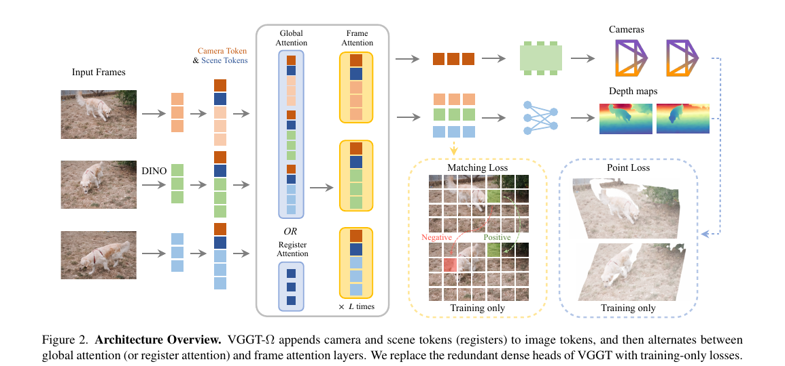
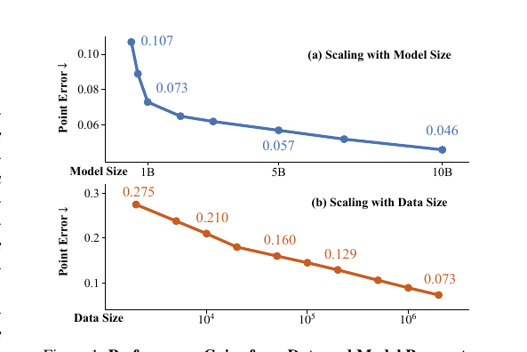
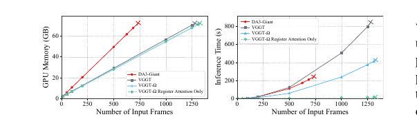

# VGGT-Ω：Scaling Feed-forward Reconstruction

## 结论先行

- **一句话定位**：VGGT-Ω 是 VGGT 的大规模升级版，主线不是多先验 prompt，而是把 feed-forward 视觉几何模型从静态场景扩展到更大模型、更大数据和动态视频，并把 reconstruction token 做成可复用的空间表征。
- **核心方法**：它保留 VGGT 的 alternating attention 思路，但引入 register attention、单 dense depth head + 多任务训练损失、DINOv3 初始化、大规模动态视频标注管线和 teacher-student 自监督训练；论文称训练显存只需原 VGGT 约 30%。
- **实验结论**：论文报告 VGGT-Ω 在 3 个静态和 3 个动态 benchmark 上整体超过 MonST3R、MegaSaM、VGGT、Pi3、DA3、MapAnything；例如 Sintel camera AUC@3 从 MegaSaM 的 22.5 提升到 Ours-10B 的 40.0，相对提升 77%，Sintel depth δ1.25 从 DA3 的 86.1 提升到 93.5。
- **代码状态**：GitHub 公开的是 inference/demo/model code，README 提供 gated HF checkpoint 入口和 Gradio demo；仓库没有训练脚本、评测脚本或数据处理 pipeline。因此按本仓库约定 `training_open_source` 记为 `\`。
- **工程判断**：VGGT-Ω 是当前 any-view / dynamic feed-forward reconstruction 的强 baseline，但不是自动驾驶 metric prompt 主方案。若目标是车载真尺度建图，仍应把 MapAnything/DA3Metric/Pi3X 的几何先验能力一起实测；VGGT-Ω 更适合做强 RGB-only backbone、长窗口 reconstruction baseline 和空间 token 表征候选。

## 1. 这篇论文解决什么问题？

### 已确认的论文事实

- **问题定义**：研究 feed-forward reconstruction 是否能像 2D/语言 foundation model 一样通过模型规模和数据规模继续提升，并覆盖静态与动态场景。
- **输入 / 输出**：输入为多张 RGB frames；公开模型输出 camera pose encoding、depth、depth confidence，以及 camera/register tokens。论文训练时还用 point map、matching 等多任务损失，但最终公开模型不直接输出多套 dense heads。
- **目标场景**：静态/动态多视图重建、视频重建、camera estimation、depth estimation、几何表征预训练、VLA/语言对齐中的空间 token。
- **与 VGGT 的差异**：VGGT-Ω 用 DINOv3 初始化、更省显存的 dense head、register attention 替代部分全局 attention，并用大规模 public + internal 数据和自监督视频训练扩展模型。

### 我的理解

VGGT-Ω 的重点不是"多了一个更复杂的 head"，而是把 VGGT 类模型推成一个可扩展的几何 backbone：

- **重建能力**：camera + depth 的单次前向仍是核心接口。
- **动态能力**：不显式输出 motion mask / 4D point map，而是通过动态数据和统计先验学会在动态视频里估 camera/depth。
- **表征能力**：registers 不再只是辅助 token，而是承载场景级信息，可喂给 VLA 或做语言对齐。

这使它与 MapAnything / HunyuanWorld-Mirror / Pi3X 这类"输入几何先验"的路线不同：VGGT-Ω 更像一个强大的 RGB/video geometry foundation backbone，后续可以通过 fine-tuning 或 adapter 接入 metric scale、任务 token 或下游控制模型。

## 2. 方法概览：核心想法 + 一句话 pipeline

- **核心想法**：把「reconstruction」本身当作一种 spatial pretraining 目标——不是先设计好一个几何 pipeline 再塞进网络，而是相信「足够大的模型 + 足够大且包含动态内容的数据」能让 camera/depth 回归这个单一前馈任务自己学出对动态、尺度和场景结构的鲁棒性,并把过程中产生的 register token 变成可迁移的空间表征。
- **一句话 pipeline**：N 帧 RGB → DINOv3 patch token + 每帧 1 个 camera token + 16 个 register token → L 层交替（frame attention / global attention，其中约 25% 替换为 register-only 跨帧 attention）→ camera head 单次出位姿，轻量 depth head（MLP + pixel shuffle）出 dense depth 与 confidence，register token 额外可接 VLA/语言 adapter。

### 2.1 架构解析：模块分解 + 数据流 + 关键设计

- **模块分解**：
  1. **Tokenizer（DINOv3）**：把每帧图像 patch 化为图像 token；相比 VGGT 用 DINOv2，VGGT-Ω 换成 DINOv3 初始化 backbone。
  2. **camera token + register token**：每帧追加 1 个 camera token（用于回归该帧位姿）和 16 个 register/scene token（用于聚合场景级、非逐像素的信息）。
  3. **交替注意力主干**：延续 VGGT 的 frame attention（帧内自注意力）/ global attention（跨帧联合注意力）交替堆叠范式,但把其中约 25% 的 global attention 层替换为 register attention。
  4. **register attention 层**：只让各帧的 register token 互相跨帧 attention，再通过随后的 frame attention 把聚合到的信息广播回该帧的 image token,从而避免每层都对全部 image token 做昂贵的跨帧全局 attention。
  5. **camera head**：对 camera token 单次前向直接回归相机参数,不做 VGGT 式的迭代式 refinement。
  6. **dense depth head**：只保留一个 depth head（不再像 VGGT 那样并行维护 point map head 等多个 dense head）；高分辨率阶段用轻量 MLP + pixel shuffle 上采样代替卷积块,低分辨率阶段仍保留卷积,以避免纯 MLP 在室外远景产生块状 artifacts。
- **数据流**：图像 → DINOv3 token（+ camera/register token）→ 交替注意力（frame / global / register）× L 层 → camera token 进 camera head 出位姿,image token 进 depth head 出 dense depth + confidence,register token 可选接入下游 adapter。
- **关键设计选择及理由**：
  - 用 register attention 部分替代 global attention,是因为消融显示替换 25% 时 point error 几乎无损（0.071 → 0.073）,却能显著降低训练显存和 FLOPs,这是在「一次训练能塞进多大模型/多少帧」这个工程约束下做出的取舍。
  - 单 dense depth head 而非 VGGT 的多套 dense head,是用训练时的多任务损失去塑造表征,但推理时只保留最省算力的输出接口——训练目标和推理接口被有意解耦。
  - camera head 去掉迭代 refinement,换取更简单、更快的单次前向,代价是相机精度的进一步提升更多依赖模型规模和数据,而不是架构内的迭代机制。

### 2.2 核心原理：为什么 work、关键机制与归纳偏置

- **为什么这样设计 work**：VGGT 已经证明「用一次前馈回归相机+深度+点图+跟踪」可以内化多视图几何约束,VGGT-Ω 的赌注是——这条路径的瓶颈不在架构本身,而在训练能塞进去的模型规模和数据规模,尤其是动态、真实视频数据的覆盖率。因此它把大部分设计精力用在「怎么用更少显存训练更大模型、怎么标注更多动态视频数据」,架构上则做减法（更简单的 head、更省算力的 attention）为规模让路。
- **register attention 的归纳偏置**：把「跨帧信息融合」拆成两条通道——少量 register token 负责长距离、场景级的跨帧聚合,image token 之间的跨帧交互则大部分退化为通过 register token 间接完成,而不再逐层做全量跨帧 attention。这是一种「信息瓶颈」式的归纳偏置：强迫模型把跨帧一致性压缩进少量 token,代价是牺牲一部分逐 patch 的直接跨帧交互,换来的是可扩展性（帧数、分辨率、模型规模都能往上堆）。
- **reconstruction as spatial pretraining**：论文的核心机制假设是——如果把 camera/depth 回归当成一个足够困难、足够多样（尤其是动态视频）的自监督式任务来训练,模型内部（尤其是 register token）自然会学出对场景几何和空间关系的通用表征,这个表征可以迁移到 VLA、语言对齐等与几何回归本身无关的下游任务。这与「专门设计一个表征学习目标」不同,是把「重建」本身当预训练目标。
- **与 VGGT 的本质区别**：VGGT 的设计重心是「架构能否内化多视图几何约束」（交替注意力 + 归一化学进网络）,证明前馈可以替代优化。VGGT-Ω 假设这一点已经成立,重心转移到「能否把这套前馈范式的模型和数据规模再放大一个量级,同时让它对动态场景鲁棒、并产出通用空间表征」,是同一范式下的 scaling 与工程效率问题,而不是新的几何建模问题。

### 2.3 关键公式解析

> 论文正文对 register attention 和多任务损失以文字与消融表描述为主,未给出逐项加权系数的完整 LaTeX 公式；以下为**形式化表述**（标注「论文未给严格公式」处），用于说明机制,不代表论文原文公式编号。

**(1) 多任务训练损失（形式化表述,论文未给出逐权重完整公式）**：

$$ \mathcal{L} = \mathcal{L}_{\text{camera}} + \mathcal{L}_{\text{depth}} + \mathcal{L}_{\text{pmap}} + \mathcal{L}_{\text{match}} $$

- 符号： $\mathcal{L}_{\text{camera}}$ 相机参数损失（监督 camera head 输出）， $\mathcal{L}_{\text{depth}}$ dense depth 损失， $\mathcal{L}_{\text{pmap}}$ 点图损失（由预测 depth 结合预测相机做 unprojection 后监督，而非独立 head 直出）， $\mathcal{L}_{\text{match}}$ 匹配/跟踪相关损失。
- 作用：四类监督共享同一 backbone,训练阶段用多任务信号塑造表征；消融显示去掉 point/matching 项后 point error 从 0.073 升到 0.078,说明多任务监督对表征质量有实质贡献,但推理时不需要保留对应的 dense head。

**(2) register attention（形式化表述,论文未给出严格数学定义）**：

$$ R^{(l+1)} = \text{Attn}\big(R^{(l)}_{1:N}\big), \qquad X_i^{(l+1)} = \text{Attn}\big([X_i^{(l)}; R_i^{(l+1)}]\big) $$

- 符号： $R_i^{(l)}$ 第 $l$ 层第 $i$ 帧的 register token 集合（共 16 个）， $R^{(l)}_{1:N}$ 表示把 $N$ 帧的 register token 拼在一起做跨帧 attention， $X_i^{(l)}$ 第 $i$ 帧的 image token。
- 作用：第一步只让各帧 register token 互相看到彼此（跨帧聚合场景级信息）；第二步再用一次帧内 attention,把刚更新过的 register token 和该帧 image token 放在一起做 self-attention,把聚合到的跨帧信息广播回 image token。相比每层都对全部 image token 做跨帧 global attention,复杂度从 $O(N^2 \cdot K^2)$ （ $K$ 为每帧 image token 数）降到近似 $O(N^2 \cdot r^2 + N \cdot (K+r)^2)$ （ $r=16$ 为 register 数），这正是训练显存降到约 30% 的架构来源之一。

**(3) 尺度与坐标系（沿用 VGGT 做法,论文未改变）**：VGGT-Ω 延续 VGGT「以第一帧为参考系、用点图平均欧氏距离归一化 GT 但不归一化网络输入」的做法,本笔记不重复展开,细节见 [VGGT 笔记 2.3](../3d-reconstruction/2025-vggt.md)。

### 2.4 训练与推理细节

已确认论文事实：

- 公共数据源覆盖 Aria、Co3D/uCo3D、DL3DV、Dynamic Replica、Habitat、Hypersim、MegaDepth、ScanNet/ScanNet++、TartanAirV2、Virtual KITTI、Waymo、WildRGBD 等。
- 论文还使用 internal artist-created assets、dynamic synthetic environments、real-world device captures 等内部数据。
- 公开 + 内部 supervised 数据合计约 3M sequences；另从约 40M internal Internet-style videos 中筛选，得到约 600K static + 200K dynamic 高质量标注序列。
- 自监督阶段使用 18M unlabeled videos，teacher/student 从 supervised VGGT-Ω checkpoint 初始化；student 匹配 teacher 的 camera、depth 和多层 token features，teacher 用 EMA 更新。
- 主训练配置：200M/500M/1B/10B 四种模型；AdamW 240K iterations，其中 160K supervised、50K self-supervised、30K supervised；训练使用 128 张 96GB H100、bf16、gradient checkpointing、FSDP。
- 动态标注管线：用 Grounding DINO 检测人、车等可动物体区域,并从 matching/tracking/verification 中排除,再结合多种 matcher/tracker、VGGT/COLMAP 初始化与几何过滤构造 pseudo label。

- **推理**：单次前馈输出 `pose_enc`、`depth`、`depth_conf`、`camera_and_register_tokens`；README runtime 显示 `VGGT-Omega-1B-512` 在单 A100、约 624×416 输入时,1/10/100/500 frames 峰值显存约 6.02/6.67/13.37/43.15 GB；论文 Fig. 7 显示 80GB A100 上可推理到约 1250 frames（DA3 约 750 frames 即 OOM）,依赖 flash attention v2。

我的判断：

- 这篇论文的"上限"主要来自数据工程和训练规模；公开代码不足以复现论文训练结果。
- 自监督协议不是从零训练可行方案，它仍依赖一个强 supervised checkpoint，论文也承认 self-supervised reconstruction 仍是开放问题。
- register attention 的显存/FLOPs 收益和「25% 替换比例几乎无损」的消融结果，是这篇论文里少数可以脱离 internal 数据独立验证的架构结论，值得优先在自有硬件上复现验证。

## 3. 关键贡献

1. **扩展律证据**：论文显示 model size 从 0.2B 到 10B、data size 从几千到百万级 sequence 时 point error 单调下降，说明 feed-forward reconstruction 也具备可扩展性。
2. **更可训练的 VGGT-style 架构**：register attention + 简化 dense head + 单 camera pass 让训练显存降到原 VGGT 约 30%，为大规模训练提供条件。
3. **动态视频标注管线**：结合 VLM 预筛、动态区域检测、多种 matcher/tracker、VGGT/COLMAP 初始化与几何过滤，在真实互联网视频上构造高质量 camera/depth pseudo labels。
4. **teacher-student 自监督视频训练**：用 unlabeled videos 增强泛化，尤其面向 out-of-distribution 场景。
5. **registers 作为空间表征**：冻结 VGGT-Ω scene tokens 接入 OpenVLA-OFT 提升 LIBERO success rate；text-aligned checkpoint 说明 registers 可与语言空间对齐。

## 4. 实验与证据

| 维度 | 内容 |
|---|---|
| Camera/depth benchmark | 静态：7 Scenes、NRGBD、ETH3D；动态：DyCheck、Sintel、TUM-Dynamic |
| Baselines | MonST3R、MapAnything、MegaSaM、VGGT、Pi3、Depth Anything 3 |
| 指标 | Camera AUC@3/AUC@30；Depth δ1.25/AbsRel；ablation 用 point error；速度/显存用 A100 |
| 表征应用 | LIBERO VLA benchmark；100 个 curated internet videos 做 language retrieval |
| 公开代码验证 | GitHub main commit `399d4d6` 公开 model/inference/demo；README 列出 1B-512 与 1B-256 text-alignment gated checkpoints |

### 4.1 效果与性能解析

| 结果 | 论文证据 | 解读 |
|---|---|---|
| Camera pose 静态/动态全面提升 | Table 1：Sintel AUC@3 Ours-10B 40.0，MegaSaM 22.5，DA3 16.2，VGGT 15.0；ETH3D AUC@30 Ours-10B 90.4，DA3 87.0，Pi3 79.6 | VGGT-Ω 兼顾 wide-baseline 静态场景和动态视频，避免 MegaSaM/MonST3R 只在某类场景强 |
| Depth 在动态场景提升大 | Table 2：Sintel δ1.25 Ours-10B 93.5，DA3 86.1，Pi3 82.5，VGGT 79.2；AbsRel Ours-10B 0.081，DA3 0.118 | 大规模动态数据对视频 depth 质量有明显作用 |
| 模型和数据 scaling 单调收益 | Fig. 1 / Sec. 4.3：训练序列 10x 增长时 point error 从 0.275 降到 0.073；模型从 0.2B 到 10B 也持续降低 point error | feed-forward reconstruction 可按 foundation model 思路继续 scale |
| register attention 基本无损 | Ablation：全 global attention point error 0.071；25% register attention 为 0.073 | 默认替换比例是合理效率/精度折中 |
| 多任务 loss 有效 | 去掉 point/matching loss 后 point error 0.073 -> 0.078；VGGT 原多 dense head 0.070 但训练成本高 | 多任务监督重要，但不一定要保留多输出 head |
| 自监督有小幅泛化收益 | 10% training steps 换成 self-supervised 后 point error 0.073 -> 0.070 | unlabeled video 有用，但不是单独解决训练的银弹 |
| 推理长视图能力强 | 论文 Fig. 7：VGGT/VGGT-Ω 在 80GB A100 上可到约 1250 frames；DA3 约 750 frames OOM；VGGT-Ω 速度更快 | 对长视频/多摄窗口比 DA3 更友好，但论文测试依赖 flash attention v2 |
| Registers 可用于 VLA/语言 | Table 3：OpenVLA-OFT 加冻结 scene tokens 后 LIBERO 平均 SR 98.5；语言检索 VLM embedding top-1 76.8%、top-3 97.0 | reconstruction tokens 可能是通用空间表征，而非只服务 depth/camera |

### 需要谨慎解读的点

- 论文主结果包含 10B 模型，但公开 README 当前只列 1B checkpoint；不能把 10B 论文性能直接当作公开可跑性能。
- 训练使用大量 internal 数据、internal video pipeline 和 128 H100；公开代码无法端到端复刻。
- 动态 benchmark 中模型预测的是 camera/depth，不是显式 4D motion；对动态物体的几何一致性仍需单独评估。
- 论文与 DA3 的效率对比依赖具体实现修正、输入分辨率、patch size、flash attention backend；本地复现要记录硬件和配置。

## 5. 局限与风险

### 论文明确承认或附录可见

- 强 motion blur 会显著降低表现。
- FOV 在短时间内剧烈变化、相机高度畸变时重建质量会下降。
- 训练早期使用过部分 noisy data，办公室多显示器等场景可能不稳定。
- 出于隐私和授权，部分训练数据中人脸/商标被 mask 或 blur，这些区域偶尔产生 artifacts 或深度不平滑。
- 自监督 reconstruction 仍未完全解决；成功方案仍依赖 supervised checkpoint。
- MLP-only dense decoder 虽快且省显存，但会产生可见 patch/block artifacts，尤其室外远距离结构。

### 已确认的代码/仓库事实

- GitHub：<https://github.com/facebookresearch/vggt-omega>
- 默认分支 main，检查到 HEAD 为 `399d4d62935deb71cedb1e1c35b7a90413a6bee4`。
- 公开文件包含 `vggt_omega/models/`、`utils/`、`demo_gradio.py`、`requirements.txt`、`requirements_demo.txt`、`pyproject.toml`。
- README 提供最小 Python inference 示例，输出 `pose_enc`、`depth`、`depth_conf`、`camera_and_register_tokens`。
- README 提供 Gradio demo，输入 images/video，输出 depth-unprojected point cloud 与 predicted cameras 的 GLB visualization。
- README 的 runtime table 记录 `VGGT-Omega-1B-512` 在单 A100、约 624x416 输入时：1/10/100/500 frames 峰值显存约 6.02/6.67/13.37/43.15 GB。
- Hugging Face `facebook/VGGT-Omega` 是 restricted/gated；未认证访问 model card 只返回受限提示。
- License 文件为 FAIR Noncommercial Research License，明确限制 noncommercial research use。
- 仓库未发现训练入口、训练配置、评测脚本、数据处理或 annotation pipeline，因此公开仓库主要是 inference/demo/model code。

### 已确认的工程风险

- **非商用许可**：代码和权重都在 FAIR Noncommercial Research License 下，商业评估必须走授权或替代训练。
- **权重 gated**：HF checkpoint 需申请访问；自动化下载/CI 复现实验会受限。
- **训练不可复刻**：训练脚本未公开，数据管线依赖 internal videos 和 internal datasets，10B 结果尤其无法只凭公开仓库复现。
- **公开 checkpoint 与论文上限不一致**：当前公开 README 只列 1B checkpoints；10B 论文结果需要等待官方释放或自行训练。
- **不是几何先验 prompt 框架**：论文认为 pretraining 阶段加入 temporal order、camera、depth、scale 等 auxiliary inputs 往往有害；这意味着自动驾驶真尺度 pipeline 不能简单把 VGGT-Ω 当 MapAnything 替代品。
- **无显式动态对象输出**：动态物体在视觉上能处理，但没有 object motion、scene flow、semantic mask 或 occupancy 输出。

### 我的推断风险

- 对车载多摄系统，VGGT-Ω 的强 RGB-only reconstruction 可能适合做初始化和空间特征，但 scale、外参一致性、动态交通参与者和闭环地图仍需要后端优化或几何先验模型。
- Registers 对 VLA/语言有吸引力，但公开 text-aligned checkpoint 是 256 分辨率，是否保留高精度几何和下游控制收益需要复跑。
- 论文数据过滤会丢弃低视差、重复纹理、强动态或极端相机运动片段；这些恰好可能是真实机器人/车载系统会遇到的困难样本。

### Unknowns / to verify

- 公开 1B checkpoint 在本地多摄/行车片段上的实际 pose/depth 指标，与论文 Ours-1B/10B 表格是否一致。
- 是否会释放 training/evaluation branch、10B 权重、annotation scripts 或更宽松许可证。
- text alignment checkpoint 对非英语/复杂操作描述、VLA 任务和长视频检索的泛化。
- 与 DA3-Streaming、MapAnything memory-efficient attention、Pi3X condition injection 在同一硬件和数据上的真实速度/显存差异。
- register attention 与多任务 loss 的公式化表述（2.3 节）为本笔记根据论文文字与消融表推导，未逐字节比对官方 LaTeX 源若官方后续公开更严格的公式，需要回来校对。

## 方法谱系

- 基于（backbone / 范式延续）：[VGGT](../3d-reconstruction/2025-vggt.md)（延续交替注意力 + 单次前馈回归相机/深度的范式，替换为 DINOv3 初始化、register attention、单 dense depth head，并把训练规模和动态数据覆盖率大幅扩大）。
- VGGT 本身基于：[DUSt3R](../3d-reconstruction/2023-dust3r.md)（前馈 pointmap 回归、去优化管线的范式起点）。

> 谱系链接为方向内相对路径，若目标文件 slug 与此处不一致以 `indices/methods.md` 为准。

## 6. 与相似方法对比

| Method | 相同点 | 不同点 | 何时选它 |
|---|---|---|---|
| VGGT | 同属 feed-forward visual geometry transformer，输出 camera/depth/3D geometry | VGGT-Ω 用 DINOv3、register attention、单 dense head、多任务 loss 和更大动态数据；训练更省显存，支持更强动态 benchmark | 需要旧基线或已有 VGGT 生态时保留 VGGT；新实验优先测 VGGT-Ω |
| Depth Anything 3 | 都是 any-view geometry foundation model，都可输出 camera/depth/point cloud | DA3 用 depth-ray representation、工程 API/benchmark/NVS 更完整；VGGT-Ω 更强调 scaling、dynamic video、register scene tokens 和长帧数效率 | 需要 3DGS/NVS/API/benchmark 先用 DA3；需要动态重建强 baseline 和空间 tokens 选 VGGT-Ω |
| Pi3 / Pi3X | 都是 VGGT 生态附近的 feed-forward 几何模型，支持无序/视频 views | Pi3 主打 reference-free/permutation-equivariant 和 local point maps；VGGT-Ω 仍使用 reference/camera token，主打规模、动态数据和 scene registers | 研究 reference bias/输入顺序鲁棒性选 Pi3；追求动态 benchmark 和大规模 RGB backbone 选 VGGT-Ω |
| MapAnything | 都可从多视图 RGB 恢复 camera/depth/geometry | MapAnything 是 metric promptable reconstruction，能吃 camera/pose/depth 先验；VGGT-Ω 是 RGB/video backbone，不是 prompt-first | 自动驾驶真尺度/几何先验主线优先 MapAnything；RGB-only 强初始化和对照加 VGGT-Ω |
| LingBot-Map | 都关注视频/动态或长序列 3D reconstruction | LingBot-Map 是 causal streaming online mapping；VGGT-Ω 是 batch feed-forward，多帧输入但非在线状态模型 | 在线 VO/建图选 LingBot-Map；离线多帧或窗口级强几何特征选 VGGT-Ω |
| MegaSaM / MonST3R | 都处理 dynamic reconstruction | MegaSaM/MonST3R 更偏 optimization/dynamic-specific；VGGT-Ω 是单次前向 foundation model | 高精度后端优化可保留 MegaSaM；实时/大规模前馈和 initialization 选 VGGT-Ω |
| HunyuanWorld-Mirror / OmniVGGT | 都属于几何重建基础模型生态 | Hunyuan/OmniVGGT 更强调 prior/adapter 或世界重建输出；VGGT-Ω 更强调 backbone scaling 和 register 表征 | 需要 any-prior/3DGS 世界重建选 Hunyuan；需要轻量 VGGT prior adapter 选 OmniVGGT；强 RGB backbone 对照选 VGGT-Ω |

更详细横向对比见：[`../../comparisons/3d-reconstruction/visual-geometry-foundation-models.md`](../../comparisons/3d-reconstruction/visual-geometry-foundation-models.md)。

## 7. 复现判断

- Git 地址：<https://github.com/facebookresearch/vggt-omega>
- 是否开源：是，公开 inference/demo/model code。
- 是否开源训练：`\`。公开仓库主要提供推理、demo 和模型结构，未提供训练脚本、评测代码或数据处理 pipeline。
- 代码可用性：可安装 package，加载本地 checkpoint，跑 Python inference 或 Gradio demo；HF checkpoint 需要审批。
- 权重可用性：gated HF 提供 `VGGT-Omega-1B-512` 和 `VGGT-Omega-1B-256-Text-Alignment`；未见 10B 权重公开。
- 权重/代码许可证：FAIR Noncommercial Research License，研究非商用。
- 数据可获得性：部分 public datasets 可自行获取；internal supervised data、40M video pool、annotation classifier、VLM filtering pipeline 不公开。
- 预计环境成本：1B 推理可从单 A100 级别开始；README 显示 500 frames 约 43.15GB peak memory。完整训练不可按公开资料估算为普通复现任务。
- 最小复现路径：
  1. 申请 HF 权重访问，锁定 `vggt_omega_1b_512.pt` 和 GitHub commit `399d4d6`。
  2. 用 README Python snippet 跑 3-10 张图片，检查 `pose_enc`、`depth`、`depth_conf` 和 GLB 导出。
  3. 用同一组静态/动态多视图输入对比 VGGT、DA3、Pi3/Pi3X、MapAnything 的 camera/depth qualitative 结果。
  4. 在小型 Sintel/TUM-Dynamic 或车载片段上测 AUC/ATE/AbsRel、显存、latency、最大窗口长度。
  5. 若研究表征，把 `camera_and_register_tokens` 接入一个轻量 retrieval/probe 或 VLA adapter，验证 scene tokens 是否带来收益。
- 是否值得复现：值得做 inference-level 和小 benchmark 复现；不建议把完整训练复现作为近期目标。

## 8. 后续动作

- [x] 创建 VGGT-Ω 单篇论文分析
- [x] 更新 `indices/papers.md`
- [x] 更新 `indices/directions.md`
- [x] 更新 `indices/methods.md`
- [x] 更新 `comparisons/3d-reconstruction/visual-geometry-foundation-models.md`
- [x] 重组为深度模板结构（架构解析/核心原理/公式解析/训练推理细节拆分 + 嵌入 arch/scaling/perf 三图）
- [ ] 若后续做复现，创建 `reproductions/3d-reconstruction/vggt-omega/README.md`
- [ ] 若官方公开更严格的 loss / register attention 公式，回来校对 2.3 节的形式化表述

## Sources

- Paper: <https://arxiv.org/abs/2605.15195>
- PDF: <https://arxiv.org/pdf/2605.15195>
- Project page: <https://vggt-omega.github.io/>
- GitHub: <https://github.com/facebookresearch/vggt-omega>
- Main README: <https://raw.githubusercontent.com/facebookresearch/vggt-omega/main/README.md>
- License: <https://raw.githubusercontent.com/facebookresearch/vggt-omega/main/LICENSE>
- Hugging Face gated model: <https://huggingface.co/facebook/VGGT-Omega>
