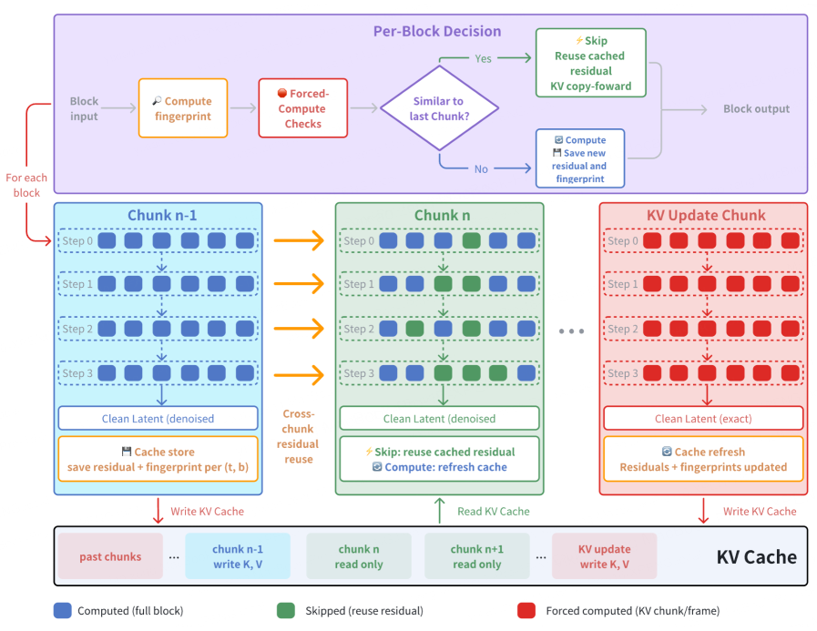
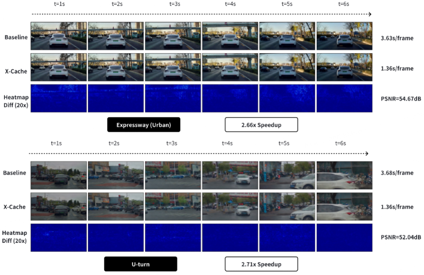
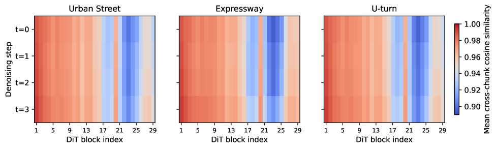
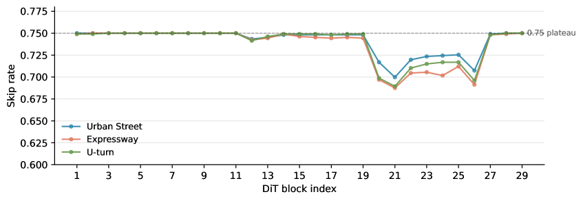

# X-Cache：面向 few-step 自回归世界模型的跨 chunk DiT 缓存

## 结论先行

- **定位**：X-Cache 是 XPeng 针对 X-World 类 few-step autoregressive video diffusion 的 training-free 推理加速方法。它不沿 denoising steps 缓存，而是沿连续生成的 chunk 缓存 DiT block residual，利用的是"物理世界连续"而非"去噪轨迹平滑"。
- **核心洞察**：4-step distilled AR 世界模型几乎没有 cross-step redundancy（每一步都要扛结构更新），但自动驾驶连续 chunk 的物理场景变化相对平滑，所以同一 $(t,b)$ 位置（denoising step $t$、DiT block $b$ ）在相邻 chunk 之间的 block 残差高度相似，可以复用。
- **关键机制**：双指标 gating（cosine similarity + max token deviation）配 action-aware 3D fingerprint，逐 $(t,b)$ 自适应阈值，只在两个指标都通过时才跳过该 block 的重算，直接复用缓存残差。
- **关键安全设计**：写入 rolling KV cache 的 chunk 必须强制 full compute，否则近似残差会污染 KV cache 并沿自回归链长期传播；ablation 显示去掉该保护 PSNR 从 53.4 dB 崩到 21.5 dB、LPIPS 从 2e-4 恶化到 1.77e-1。
- **实验结果**：在 X-World 内部 held-out split 上，X-Cache 达到约 71% block skip，单 PPU DiT per-chunk 时间从约 3.63-3.69s 降到约 1.36-1.39s，speedup 2.65-2.70x，同时 7-camera SSIM 约 0.999、LPIPS 低于 4e-4。
- **开源状态**：论文和项目页公开，但截至 2026-06-08 未发现 GitHub/代码/测试数据；虽然方法 training-free，当前仍不能复现。
- **工程价值**：这是 X-World 部署链路里的重要系统优化，适合归入 `efficient-training-inference` 与 `world-models` 交叉方向。

## 1. 这篇论文解决什么问题？

- **问题定义**：X-World 这类交互式世界模型需要 chunk-by-chunk 接收策略动作并生成未来视频，不能提前知道未来条件（闭环仿真里动作是策略实时给出的）；同时为了实时性已经蒸馏到每 chunk 仅 4-step denoising。目标是在不训练、不改权重的前提下，进一步减少 DiT block 计算量。
- **输入 / 输出**：输入是当前 chunk 的 noisy latent 加动作条件与 rolling KV cache 上下文；输出是去噪后的 clean latent（再经 VAE 解码成 7 相机视频）。X-Cache 作用于 DiT forward 内部，输出保持与 full compute 尽量一致。
- **目标场景**：生产级自动驾驶世界模型闭环仿真，7 相机、12 FPS、22s rollout。
- **为什么已有缓存不适用**：
  - TeaCache / DeepCache / Delta-DiT / BWCache 等主要利用 **denoising step 间**冗余；few-step 模型每一步都承担较大结构更新，cross-step 可复用性弱；
  - interactive simulation 的动作流在 chunk 边界可能不平滑，纯 step 外推不稳；
  - sequence-level parallelization（如 Block Cascading）需要未来条件，闭环策略实时输出动作时不可用。

## 2. 方法概览

- **核心想法**：把缓存轴从"denoising step"换成"generation chunk"。在一个 chunk 做 full compute 时，把每个 $(t,b)$ 位置的 block 残差和其输入指纹缓存下来；下一个 chunk 到同一 $(t,b)$ 时，若输入与缓存指纹足够相似，就跳过 block 计算、直接加上缓存残差。
- **一句话 pipeline**：对每个 block → 算 fingerprint → 过 forced-compute 安全检查 → 双指标判断"是否与上个 chunk 相似" → 相似则复用缓存残差并 KV copy-forward，否则 full compute 并刷新缓存。

### 2.1 架构解析

整体分两层，上层是 **Per-Block Decision**（逐 block 决策逻辑），下层是 **chunk 时间轴 + KV Cache**（数据流与状态管理）。

**逐 block 决策（上层）**，对每个 block 依次执行：

1. **Compute fingerprint**：对 block 输入 $x^{(n)}_{t,b-1}$ 做降维，得到低维指纹 $\phi(x)$。
2. **Forced-Compute Checks**：先过安全闸门（warmup / KV-update chunk / anchor block / step-0 / max staleness），命中任一就强制 full compute，跳过后面的相似度判断。
3. **Similar to last Chunk?**：双指标 gating 判断当前 block 输入与上一个 chunk 同 $(t,b)$ 位置缓存指纹是否相似。
4. **Yes → Skip**：复用缓存残差，KV copy-forward；**No → Compute**：full compute 并保存新残差和指纹。

**chunk 时间轴 + 状态（下层）**：图中三列分别是 Chunk n-1（全蓝，full compute + 写缓存）、Chunk n（蓝绿混合，部分 block 复用绿色残差）、KV Update Chunk（全红，强制精确计算）。每个 chunk 内是 $4 \times B$ 的 (Step, block) 网格：

- 蓝格 = full block（全算）；绿格 = skipped（复用残差）；红格 = forced compute（KV chunk / anchor / warmup）。
- 底部 **KV Cache** 是 FIFO rolling buffer：past chunks / 当前写 K,V 的 chunk / read-only 的后续 chunk / KV update chunk 写 K,V。关键点是**只有会写 KV 的 chunk 才需要精确**，read-only chunk 可以大胆跳。

**关键设计选择**：把决策放在 block 粒度而非整层跳过，是为了让不同 $(t,b)$ 位置各自决定复用率；把 KV 写入 chunk 单独标红强制全算，是整套方法能在自回归链上保质量的前提（见 2.2）。

### 2.2 核心原理

- **为什么 work**：few-step distilled DiT 的 denoising trajectory 已经被压得很短，相邻 step 差异大（cross-step 冗余低），所以传统"跨去噪步缓存"失效。但自动驾驶场景的物理演化在时间上连续——相邻 chunk 的道路结构、静态背景、车道线几乎不变，只有动态目标在小幅移动。因此把**同一 denoising step、同一 block 位置**放在相邻 chunk 间对比，残差 $r_{t,b}$ 相似度很高（论文 Figure 7 显示 post-warmup 后多数 $(t,b)$ 的 cross-chunk cosine 相似度接近 1）。这本质上是把"时间连续性"当成可复用的归纳偏置，而不是"去噪轨迹平滑性"。
- **关键机制 —— action-aware fingerprint**：纯靠视觉相似度会漏掉控制层面的突变（急刹、转向、变道），因为这些动作在当前 chunk 视觉上还没完全显现。X-Cache 把每 chunk 的 action vector（经 adaLN-Zero 条件通道）显式并入指纹，使相似度判断"看得见"控制意图变化，避免在关键决策帧错误复用旧残差。
- **关键机制 —— KV 是误差放大点**：AR world model 用 rolling KV cache 携带历史上下文。如果一个会写 KV 的 chunk 用了近似残差，误差会被写进 KV 并被后续所有 chunk 读取，形成正反馈发散。这是 AR + KV cache 系统特有的约束，也是本文相对纯 diffusion 缓存方法（无 KV）最本质的差别：**缓存可以省算力，但绝不能污染 KV**。
- **与前作本质区别**：TeaCache/DeepCache 沿 denoising step 复用、无 KV 约束；X-Cache 沿 generation chunk 复用、且必须保护 KV 写入路径。

### 2.3 关键公式解析

**公式 (1) —— block 残差定义**：

$$ r^{(n)}_{t,b} = f_b\left(x^{(n)}_{t,b-1};\, c^{(n)}_{t}\right) = x^{(n)}_{t,b} - x^{(n)}_{t,b-1} $$

- 符号： $n$ 是 generation chunk 索引， $t$ 是 denoising step， $b$ 是 DiT block 索引； $f_b$ 是第 $b$ 个残差 block； $c^{(n)}_{t}$ 是该位置的条件（含 action）； $x^{(n)}_{t,b-1}$ 是 block 输入， $x^{(n)}_{t,b}$ 是 block 输出。
- 作用：明确 X-Cache 缓存的对象是 **block 残差** $r_{t,b}$ （输出减输入），而不是整个激活。残差比绝对激活更平稳、更适合跨 chunk 复用。

**公式 (2) —— 缓存残差复用**：

$$ \tilde{x}^{(n+1)}_{t,b} = x^{(n+1)}_{t,b-1} + \hat{r}_{t,b} $$

- 符号： $\hat{r}_{t,b}$ 是上一个 full-compute chunk 在 $(t,b)$ 存下的残差； $x^{(n+1)}_{t,b-1}$ 是当前 chunk 该 block 的**实际输入**； $\tilde{x}^{(n+1)}_{t,b}$ 是近似输出。
- 作用：跳过时不重算 $f_b$，直接把缓存残差加到当前真实输入上。注意输入 $x^{(n+1)}_{t,b-1}$ 用的是当前 chunk 的真实值，只有"输入到输出的变换量"被近似复用。

**公式 (3) —— 双指标 gating**：

$$ s_{\cos} = \frac{\phi\left(x^{(n)}_{t,b-1}\right) \cdot \phi\left(x^{(n-1)}_{t,b-1}\right)}{\left\lVert \phi\left(x^{(n)}_{t,b-1}\right)\right\rVert\,\left\lVert \phi\left(x^{(n-1)}_{t,b-1}\right)\right\rVert},\qquad d_{\max} = \frac{\max\left\lvert \phi\left(x^{(n)}_{t,b-1}\right) - \phi\left(x^{(n-1)}_{t,b-1}\right)\right\rvert}{\text{mean}\left\lvert \phi\left(x^{(n-1)}_{t,b-1}\right)\right\rvert + \varepsilon} $$

$$ \text{skip}(t,b) = \left(s_{\cos} \ge \tau_{\cos}(t,b)\right) \,\wedge\, \left(d_{\max} < \tau_{\text{dev}}\right) $$

- 符号： $\phi(\cdot)$ 是指纹函数； $s_{\cos}$ 是当前 chunk 与上一 chunk 指纹的余弦相似度（跨 fingerprint 条目取最小，最保守）； $d_{\max}$ 是最大 token 偏差归一化值（跨 view group 取最大，捕捉局部突变）； $\tau_{\cos}(t,b)$ 是逐位置自适应阈值， $\tau_{\text{dev}}$ 是偏差阈值； $\varepsilon$ 防除零。
- 作用：cosine 捕全局方向一致性（平均化，易漏局部突变），max deviation 补局部异常检测。两者是"且"关系——必须同时满足才跳过，用双保险降低误跳风险。

**公式 (4) —— 自适应阈值（EMA）**：

$$ \bar{s}_{t,b} \leftarrow \alpha\, s_{\cos}^{(n)} + (1-\alpha)\,\bar{s}_{t,b},\qquad \tau_{\cos}(t,b) = \max\left(\tau_{\text{floor}},\; \bar{s}_{t,b} - m\right) $$

- 符号： $\bar{s}_{t,b}$ 是该位置历史相似度的 EMA， $\alpha$ 是 EMA 系数（论文取 0.30）， $m$ 是相对历史的容忍 margin（0.02）， $\tau_{\text{floor}}$ 是阈值下限（0.97，保底安全）。
- 作用：让每个 $(t,b)$ 用自己的历史相似度动态设阈值——本来就高度相似的位置阈值随之升高（更严格），从而在场景切换时快速收紧、避免过度复用； $\tau_{\text{floor}}$ 保证阈值不会被历史拉到过低而危险。

### 2.4 训练与推理细节

- **训练目标 / 损失**：无。X-Cache 是 training-free 推理时方法，不引入任何损失、不改 X-World 权重。
- **fingerprint 构造**：指纹 $\phi(x)$ 不在 flatten token 轴随机采样，而在 latent 的 3D $(F,H,W)$ 网格上均衡采样 $K=32$ 个 token（各轴分配与网格长宽比成比例），保证覆盖不同帧和空间位置；再拼两个辅助通道——global mean channel（捕整体 drift）和 action-condition channel（把 action vector 经 adaLN-Zero 条件映射进指纹空间）。
- **安全 / 保护机制**（对应架构图红格与 forced-compute checks）：
  - **Warmup chunks**：开头没缓存，全部 full compute（ $W=1$ ）。
  - **KV-update chunk protection**：写入 rolling KV 的 clean pass 强制 full compute（最关键，见 4）。
  - **Anchor blocks**：默认 front block（ $F_n=1$ ）永远全算，保证后续残差基础稳定；tail block 默认 $B_n=0$。
  - **Step-0 protection**：默认关闭，可选开启作为分布外场景安全边际。
  - **Maximum staleness**：限制同一 $(t,b)$ 连续跳过次数 $M$，超过强制刷新。
- **推理流程**：warmup → 每 chunk 内对每 $(t,b)$ 先 forced-compute check，再 fingerprint + 双指标 gating，决定 skip（复用残差 + KV copy-forward）或 compute（全算 + 刷新缓存 + 写 KV）→ 输出 clean latent → VAE 解码。

## 3. 关键贡献

1. **提出 cross-chunk block caching**：利用物理连续性而非 denoising trajectory 平滑性，适配 4-step AR diffusion，填补 few-step 场景下传统 step 缓存失效的空白。
2. **设计 action-aware 3D fingerprint**：把控制动作显式纳入相似度判断，避免交互式闭环场景下错误复用；3D 网格采样 + 双辅助通道兼顾覆盖率与突变敏感度。
3. **识别 KV update 是错误放大点**：给出 AR rolling KV cache 系统特有的安全约束，并用 ablation 量化其必要性（去掉即崩溃）。
4. **给出生产模型上的系统评估**：在 X-World 7 相机 22s rollout 上报告速度、skip、PSNR/SSIM/LPIPS 和完整 ablation。

## 4. 实验与证据

### 4.1 设置

| 维度 | 内容 |
|---|---|
| 硬件 | Alibaba T-Head Zhenwu 810E PPU，96GB HBM2e，BF16 DiT forward。 |
| 模型 | X-World，基于 WAN 2.2 的 7 相机 12 FPS causal video diffusion world model；每 chunk 4-step denoising，rolling KV cache FIFO。 |
| 数据 | 内部 X-World held-out split；urban street 7 clips、highway 3 clips、u-turn 3 clips。 |
| 评估协议 | 每 clip 生成 264 frames，约 22s；无 per-frame visual ground truth，和同 seed/conditioning/KV state 的 full-compute reference 对比。 |
| 指标 | block skip rate、单 PPU per-chunk DiT wall-clock、speedup、PSNR、SSIM、LPIPS。 |

### 4.2 主结果

| Scenario | n | 7-cam PSNR ↑ | 7-cam SSIM ↑ | 7-cam LPIPS ↓ | Skip | DiT time | Speedup |
|---|---:|---:|---:|---:|---:|---:|---:|
| Urban Street | 7 | 51.37 | 0.9990 | 3.3e-4 | 71.4% | 1.392s | 2.65x |
| Highway | 3 | 54.67 | 0.9991 | 1.9e-4 | 71.6% | 1.365s | 2.66x |
| U-turn | 3 | 52.04 | 0.9990 | 3.1e-4 | 71.3% | 1.364s | 2.70x |

论文说明 baseline full-compute DiT per chunk 分别是 urban 3.682s、highway 3.633s、u-turn 3.688s。

### 4.3 Ablation

| Configuration | PSNR ↑ | SSIM ↑ | LPIPS ↓ | Skip | DiT time | Speedup | 结论 |
|---|---:|---:|---:|---:|---:|---:|---|
| Baseline no cache | - | - | - | - | 3.637s | 1.00x | 参考 |
| Default | 53.384 | 0.9990 | 2.0e-4 | 71.3% | 1.406s | 2.59x | 默认高质量高加速 |
| + Step-0 protection | 53.389 | 0.9990 | 2.0e-4 | 53.5% | 1.975s | 1.84x | 当前数据质量不变但少跳很多 |
| - KV-update protection | 21.461 | 0.8067 | 1.77e-1 | 62.8% | 1.670s | 2.18x | 质量崩溃，KV 保护必需 |
| - Front anchor | 53.622 | 0.9991 | 2.0e-4 | 55.4% | 1.902s | 1.91x | 当前 clip 不敏感，但默认保留安全边际 |

### 4.4 效果与性能解析

- **主要结果解读**：三个场景 SSIM 都在 0.999、LPIPS 都低于 4e-4，说明与 full-compute reference 在感知上几乎无差别；同时 skip 稳定在约 71%、speedup 2.65-2.70x。关键在于**质量与加速没有明显 trade-off**——这来自双指标 gating 只跳"确实相似"的 block，把误差控制在感知不可见范围。注意 PSNR 51-55 dB 是相对 reference 的一致性，不是绝对画质。
- **性能与效率**：DiT per-chunk 从约 3.63-3.69s 压到约 1.36-1.39s；71% skip 未换来 71% 时间下降，因为 fingerprint 计算、gating、KV copy-forward、anchor/KV chunk 全算等有固定开销，且测的仅是 DiT forward，不含 VAE decode / I/O。方法零额外训练、零权重改动、显存不增（缓存的是低维指纹和 per-$(t,b)$ 残差）。

- **消融揭示的关键因素**：
  - **KV-update protection 是生死线**：去掉后 PSNR 从 53.4 崩到 21.5、LPIPS 从 2e-4 到 1.77e-1，验证了 2.2 的"KV 误差放大"机理——近似残差一旦写进 KV 就沿 AR 链发散。
  - **Step-0 protection 拖累加速**：开启后质量几乎不变（53.389 vs 53.384）但 skip 从 71.3% 掉到 53.5%、speedup 从 2.59x 降到 1.84x，所以默认关闭、仅作 OOD 安全边际。
  - **Front anchor 在当前 clip 不敏感**：去掉后质量略升、skip 反降，说明这些 clip 不吃紧，但默认保留作安全边际。
  - Figure 7/8 佐证：post-warmup 后多数 $(t,b)$ cross-chunk cosine 接近 1，对应高 skip rate——高相似度是高复用率的直接来源。
- **可比性**：所有指标都相对同 seed/conditioning/KV state 的 full-compute reference，协议自洽；但因数据、模型、硬件均内部，无法与外部方法在同一 benchmark 直接对比。

## 5. 局限与风险

### 论文确认的限制

- 只报告 22s 内部 held-out clips，覆盖 urban street、highway、u-turn。
- 未评估更长 horizon、夜间、恶劣天气、激烈驾驶、持续高速巡航等分布外场景。
- 默认参数来自单个 held-out clip，尚未系统绘制质量-速度 Pareto frontier。
- 没有公开代码、数据、模型或可复跑脚本。

### 我的推断

- **通用性风险**：cross-chunk similarity 来自驾驶场景连续性，未必适用于高动态视频、强 camera cut、突发事件密集场景。
- **安全风险**：缓存策略若跳过了关键行为变化对应 block，可能在闭环仿真中弱化危险事件；action-aware fingerprint 能缓解但不能证明完全安全。
- **评估风险**：PSNR/SSIM/LPIPS 是相对 full-compute reference 的 fidelity，而不是对真实世界的真实性或驾驶评测有效性。
- **硬件迁移风险**：结果在 PPU 上测 DiT time，不含 VAE decode、I/O、跨设备传输；GPU/端侧部署 speedup 需重测。

## 方法谱系

- 加速的对象（backbone）：X-World（基于 WAN 2.2 的 7 相机 causal video diffusion world model）。
- 对比但不取代的缓存思路：TeaCache / DeepCache / Delta-DiT / BWCache（沿 denoising step 缓存）、Block Cascading（sequence-level 并行）。X-Cache 与它们缓存轴不同，属并列而非取代关系。

## 6. 与相似方法对比

| Method | 缓存轴 | 适用场景 | X-Cache 差异 |
|---|---|---|---|
| TeaCache / DeepCache / Delta-DiT / BWCache | denoising step 间 | 多步离线 diffusion generation | X-Cache 认为 4-step 下该轴冗余不足，改用 cross-chunk |
| FlowCache / SCOPE | autoregressive video 但仍依赖 step trajectory / extrapolation | 多步 AR video 或较平滑 denoising 轨迹 | X-Cache 针对 few-step closed-loop，不需要未来条件和长 denoising trajectory |
| Block Cascading | sequence-level parallelism | 可提前知道未来条件的 block-causal video | X-Cache 不并行未来 chunk，适配策略实时给动作的闭环仿真 |
| X-World full compute | 无缓存 | 质量参考 | X-Cache 以 full compute 为 reference，换取 2.6-2.7x DiT speedup |

## 7. 复现判断

- Git 地址：未发现公开 GitHub。
- 是否开源：否。项目页只公开论文和 demo。
- 是否开源训练：否。方法 training-free，但实现代码也未公开。
- 代码可用性：无。
- 权重可用性：无公开 X-World 权重。
- 数据可获得性：内部 held-out X-World split 不可得。
- 预计环境成本：若自建 AR video world model，机制本身开销低（仅 fingerprint + gating + 缓存），主要成本在 backbone。
- 最小复现路径：当前不可复现。若后续开源，先在短 7-camera rollout 上复现 default/ablation，再测夜间、雨天、急转、紧急制动和更长 horizon。
- 是否值得复现：若我们有自研 AR video world model，值得实现类似机制做 inference ablation；否则只能跟踪。

## 8. 后续动作

- [x] 创建 X-Cache 单篇论文分析
- [x] 更新 `indices/papers.md`
- [x] 更新 `indices/directions.md`
- [x] 更新 `indices/methods.md`
- [x] 创建 XPeng X 系列横向对比
- [ ] 若后续发布代码，创建 `reproductions/efficient-training-inference/x-cache/README.md`

## Sources

- Paper: <https://arxiv.org/abs/2604.20289>
- PDF: <https://arxiv.org/pdf/2604.20289>
- Project page: <https://x-cache-1.github.io/en/>
