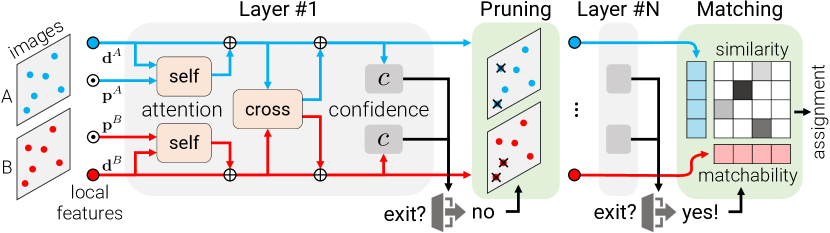
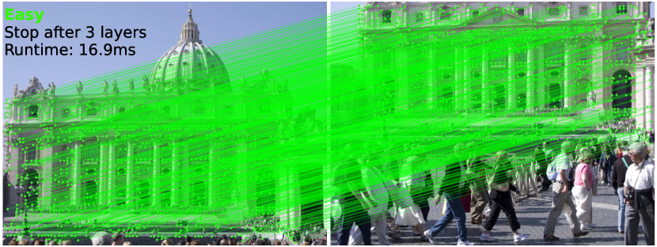
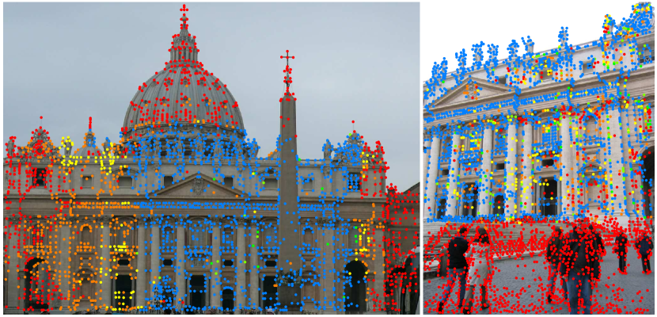
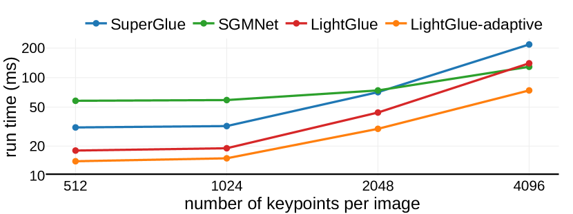

# LightGlue：光速级局部特征匹配

## 结论先行

- **一句话定位**：LightGlue 是 SuperGlue 的直接后继 / 即插即用替代——保留 attention-based 稀疏匹配范式，但更准、更快、更易训练；关键创新是让网络「看图像对难度行事」——简单对早停（自适应深度），无匹配点提前剪除（自适应宽度）。
- **核心方法**：L=9 层 Transformer（每层 1 self + 1 cross attention，d=256，4 heads）；**adaptive depth**（每层置信度分类器早停）、**adaptive width**（剪除可置信但不可匹配的点）、**rotary 相对位置编码**、**bidirectional cross-attention**（相似度只算一次省 2×）；correspondence head 把 similarity 与 matchability 解耦，替代 SuperGlue 的 Sinkhorn 最优传输。
- **论文证据**：MegaDepth-1500 RANSAC pose AUC@5/10/20 = 49.9/67.0/80.1，44.2 ms（adaptive 49.4/67.2/80.1，31.4 ms），SuperGlue 49.7/67.1/80.6 但 70.0 ms；full 版比 SuperGlue 快约 35%，adaptive 合计约 2.2×（论文原文「over 2× faster than SuperGlue and SGMNet」）；Aachen Day-Night 6.5 → 17.2（full）/26.1（adaptive）pairs/s。
- **代码状态**：cvg/LightGlue 主仓库仅含**推理/demo/模型代码**，训练与评测在独立的 **glue-factory** 库；按约定 `training_open_source: "\\"`；许可碎片化（SuperPoint 受限，主仓库代码与 LightGlue 权重 Apache-2.0）。
- **工程判断**：LightGlue 是稀疏匹配的最佳工程默认——速度大幅领先、易部署、易训练；但作为稀疏匹配器依赖前端检测器（SuperPoint/DISK/ALIKED），在极端困难对、低纹理/重复结构上绝对精度略逊于 dense matcher（RoMa/LoFTR）。

## 1. 这篇论文解决什么问题？

### 已确认的论文事实

- **问题定义**：SuperGlue 用注意力做稀疏匹配，精度强但存在两大痛点——推理慢（对每一对图都用固定的最大算力）、训练难（Sinkhorn 迭代 + 大量参数，收敛慢、数据饥渴）。LightGlue 想在不损精度的前提下大幅提速、降低训练成本，并按图像对难度自适应分配算力。
- **输入 / 输出**：两组局部特征（关键点坐标 + 描述子，来自 SuperPoint/DISK/ALIKED/SIFT 等前端）→ 部分赋值（partial assignment）匹配矩阵 + 每个点的可匹配性（matchability）。
- **目标场景**：相对位姿估计、homography 估计、视觉定位（Aachen/InLoc）、3D 重建（SfM 前端）。
- **与现有方法差异**：相对 SuperGlue，用 matchability/similarity 解耦的 correspondence head 替代 Sinkhorn，并加入早停与剪枝的自适应机制；相对 detector-free dense matcher（LoFTR/RoMa），走稀疏、高效、低显存路线。
- **一个反直觉的观察**：作者指出 SuperGlue 及多数后继在「简单对」上浪费了大量算力——人类瞬间就能看出两张相似图的对应，网络却仍跑满所有层。难度自适应正是从这一观察出发。

## 2. 方法概览

- **核心想法**：匹配的难度因图像对而异——视角/光照接近、纹理丰富的「简单对」应该用更少算力算完，困难对才动用全部深度。LightGlue 让网络在推理时动态决定「算多深、算多少点」。
- **一句话 pipeline**：两组局部特征 →（逐层 self-attention 聚合图内上下文 + cross-attention 交换图间信息，每层后用置信度分类器判断能否早停、并剪除已判定不可匹配的点）→ correspondence head 用 similarity × matchability 输出软部分赋值 → 互为最近邻且过阈值的对作为最终匹配。

### 2.1 架构解析

**整体结构（模块分解）**。LightGlue 由三部分组成：

1. **输入嵌入**：每个点的状态向量 $\mathbf{x}_i$ 初始化为描述子经线性投影的结果；关键点位置**不**加进初始状态，而是在每层注意力里通过 rotary 位置编码注入（见 2.2）。图 A 有 $N$ 个点，图 B 有 $M$ 个点。
2. **L=9 个相同的 Transformer 层**。每层依次做：
   - **self-attention**：图内点互相聚合上下文（ $A$ 内点看 $A$ 内点， $B$ 内点看 $B$ 内点），带 rotary 相对位置编码；
   - **cross-attention**：跨图交换信息（ $A$ 的点 attend 到 $B$ 的全部点，反之亦然），采用 **bidirectional（双向 key-only）** 形式——两个方向共享同一相似度矩阵，只计算一次；
   - 每层输出接 **confidence 分类器** $c_i$ ，用于自适应深度与宽度决策。
3. **correspondence head**（末端）：把最后一层的状态映射为成对相似度 $\mathbf{S}$ 与逐点 matchability $\sigma$ ，组合出软部分赋值矩阵 $\mathbf{P}$ ，取互为 argmax 且分数过阈值 $\tau=0.1$ 的对。

**数据流**。状态向量在 9 层里被反复更新：`d^A, d^B → [self→cross→confidence] × L → similarity + matchability → assignment`。位置信息在每层的 self-attention 内以旋转编码方式反复参与，而非一次性相加，这样相对几何关系在深层依然被显式利用。

**关键设计选择及理由**：
- **去掉 Sinkhorn**：SuperGlue 用可微最优传输（Sinkhorn 迭代）求赋值，迭代慢且梯度不稳。LightGlue 改为「相似度 softmax × matchability」的闭式解耦，前向更快、训练更稳（见 2.3 公式 8）。
- **bidirectional cross-attention**：常规做法要为 $A\to B$ 和 $B\to A$ 各算一次注意力得分矩阵，LightGlue 让两方向复用同一对称相似度，把 cross-attention 的相似度计算量减半。
- **每层出口 head 轻量**：confidence 分类器只是一个小 MLP + sigmoid，判断早停/剪枝的开销远小于省下的一层完整注意力。

### 2.2 核心原理

- **为什么难度自适应 work**：匹配任务的难度分布高度不均——大量图像对是「简单对」。对这些对，浅层就能收敛出可靠对应，继续算深层几乎不改变结果却线性增加延迟。LightGlue 用逐层置信度信号识别「已经算够了」的时刻并退出（公式 9–10、12），把省下的算力集中给困难对。图 2 直观展示：一个简单对 3 层即停、约 17 ms，而困难对跑满 9 层。

- **为什么剪枝 work**：随着上下文聚合，网络能较早判断某些点根本无匹配对象（落在非重叠区、被遮挡、重复纹理里的冗余点）。这些点继续参与后续注意力只是拖慢计算。自适应宽度把「已置信且不可匹配」的点剔出后续层，注意力的点数变少、复杂度随之下降（公式 13）。

- **关键机制 / 归纳偏置**：
  - **相对位置编码（rotary）**：只编码点对之间的相对位移，具备平移不变性，比 SuperGlue 的绝对位置 MLP 编码泛化更好、外推更稳。
  - **similarity 与 matchability 解耦**：一个点「和谁最像」（similarity）与「它到底有没有对应点」（matchability）是两个不同问题。解耦后，非重叠区的点可以被 matchability 直接压低，而不必扭曲相似度分布。
- **与前作（SuperGlue）在原理上的本质区别**：SuperGlue 是「固定深度 + 全局最优传输」的单一算力模型；LightGlue 是「动态深度/宽度 + 局部解耦赋值」的自适应模型。前者把匹配当成一次性 OT 求解，后者把它当成可提前终止的迭代式置信推断。

### 2.3 关键公式解析

> 采用论文 Sec.3 的表述。 $\mathbf{x}_i^A$ 表示图 $A$ 中第 $i$ 个点在某层的状态向量， $L$ 为总层数， $\ell$ 为当前层。

**公式 (6) 成对相似度**：

$$ \mathbf{S}_{ij} = \mathrm{Linear}(\mathbf{x}_i^A)^\top \, \mathrm{Linear}(\mathbf{x}_j^B), \quad \forall (i,j) \in A \times B $$

- 符号： $\mathbf{x}_i^A,\mathbf{x}_j^B$ 为两图点的状态向量；两个 $\mathrm{Linear}$ 是各自的可学习投影； $\mathbf{S}_{ij}$ 是点 $i$ 与点 $j$ 的相似度分数。
- 作用：给出跨图任意点对的匹配亲和度，是赋值矩阵的原始打分。

**公式 (7) 可匹配性（matchability）**：

$$ \sigma_i = \mathrm{Sigmoid}\big(\mathrm{Linear}(\mathbf{x}_i)\big) \in [0,1] $$

- 符号： $\sigma_i$ 是点 $i$ 「存在对应点」的概率，由状态向量经线性层 + sigmoid 得到。
- 作用：显式建模一个点是否可匹配，用来在赋值时压制非重叠区 / 遮挡点，并驱动剪枝。

**公式 (8) 软部分赋值矩阵**：

$$ \mathbf{P}_{ij} = \sigma_i^A \, \sigma_j^B \, \operatorname{Softmax}_{k \in A}(\mathbf{S}_{kj})_i \, \operatorname{Softmax}_{k \in B}(\mathbf{S}_{ik})_j $$

- 符号： $\mathbf{P}_{ij}$ 为点 $i,j$ 成为一对匹配的得分；两个 $\operatorname{Softmax}$ 分别沿 $A$ 维、 $B$ 维归一化相似度（互为最近邻的双向 softmax）；乘上两端 matchability $\sigma_i^A,\sigma_j^B$ 。
- 作用：这是替代 Sinkhorn 的核心——用「双向 softmax 相似度 × 两端可匹配性」闭式地得到部分赋值，无需迭代最优传输。最终匹配取 $\mathbf{P}$ 上互为最大且超过阈值 $\tau=0.1$ 的对。

**公式 (9) 置信度分类器**：

$$ c_i = \mathrm{Sigmoid}\big(\mathrm{MLP}(\mathbf{x}_i)\big) \in [0,1] $$

- 符号： $c_i$ 表示点 $i$ 在当前层的预测「已经可靠、不会再变」的置信度。
- 作用：为自适应深度（早停）与自适应宽度（剪枝）提供逐点信号。

**公式 (10) 早停判据**：

$$ \mathrm{exit} = \left( \frac{1}{N+M} \sum_{I \in \{A,B\}} \sum_{i \in I} \mathbb{1}\big[c_i^I > \lambda_\ell\big] \right) > \alpha $$

- 符号： $\mathbb{1}[\cdot]$ 为指示函数； $\lambda_\ell$ 是第 $\ell$ 层的置信阈值； $\alpha$ 是需要达到的置信点比例（论文取 $\alpha=0.95$ ）。
- 作用：当足够比例（95%）的点已被判为置信时，直接在第 $\ell$ 层退出，不再计算更深的层——这是自适应深度的触发条件。

**公式 (12) 阈值随层衰减**：

$$ \lambda_\ell = 0.8 + 0.1\, e^{-4\ell / L} $$

- 符号： $\ell$ 当前层， $L$ 总层数；阈值从浅层的约 0.9 单调衰减到深层的约 0.8。
- 作用：浅层要求更高置信才敢停（谨慎），深层放宽标准（既然算到这了就更容易接受退出），平衡加速与精度。

**公式 (13) 剪枝判据**：

$$ \mathrm{unmatchable}(i) = \big[\, c_i^\ell > \lambda_\ell \,\big] \ \wedge\ \big[\, \sigma_i^\ell < \beta \,\big] $$

- 符号： $\beta=0.01$ 为可匹配性下限阈值。
- 作用：一个点若「已置信」（ $c_i>\lambda_\ell$ ）且「几乎不可匹配」（ $\sigma_i<\beta$ ），就从后续层剔除——这是自适应宽度，直接减少后续注意力的参与点数。

**公式 (11) 训练损失**（跨 $L$ 层深监督）：

$$ \mathcal{L} = -\frac{1}{L} \sum_{\ell} \left[ \frac{1}{\lvert \mathcal{M} \rvert} \sum_{(i,j) \in \mathcal{M}} \log \mathbf{P}_{ij}^{\ell} + \frac{1}{2\lvert \bar{A} \rvert} \sum_{i \in \bar{A}} \log(1-\sigma_i^{A,\ell}) + \frac{1}{2\lvert \bar{B} \rvert} \sum_{j \in \bar{B}} \log(1-\sigma_j^{B,\ell}) \right] $$

- 符号： $\mathcal{M}$ 为真值匹配集合； $\bar{A},\bar{B}$ 为两图中无对应（不可匹配）的点集；对每一层 $\ell$ 都计算并平均。
- 作用：第一项监督正确对应的赋值概率（越大越好），后两项监督不可匹配点的 matchability 被压低。**逐层深监督**让每一层的中间预测都可用于早停，这是自适应深度能成立的训练前提。

### 2.4 训练与推理细节

- **训练目标 / 损失**：即公式 (11) 的逐层深监督负对数似然，同时约束赋值 $\mathbf{P}$ 与 matchability $\sigma$ 。
- **两阶段训练**：先训 matcher 主体（对应/赋值）至收敛；再单独训练置信度分类器 $c_i$ （公式 9），避免早停信号干扰主任务优化。
- **数据与规模**：先在**合成 homography** 上预训练（Oxford-Paris 1M distractors 提供背景/干扰），再在 **MegaDepth** 上用真实多视图微调。论文强调训练效率大幅优于 SuperGlue——**约 5M 图像对、仅约 2 GPU-days** 即达到与 SuperGlue 相当的精度（原文：5M 对 / 2 GPU-days 时最终层 loss −33%、match recall +4%），而 SuperGlue 需 7 天以上，收敛曲线见图 5。
- **超参要点**：L=9 层、d=256、4 heads；早停比例 $\alpha=0.95$ 、阈值 $\lambda_\ell=0.8+0.1e^{-4\ell/L}$ 、剪枝阈值 $\beta=0.01$ 、匹配过滤阈值 $\tau=0.1$ 。
- **推理流程**：
  1. 前端检测器给出关键点 + 描述子；
  2. 逐层跑 self + cross attention；每层后算 $c_i$ ，按公式 (10) 判断是否早停；
  3. 按公式 (13) 剪除已置信且不可匹配的点，缩小后续层规模；
  4. 到达退出层后，用 correspondence head（公式 6–8）输出 $\mathbf{P}$ ，取双向互选且过 $\tau$ 的对。
- **两种运行模式**：`full`（禁用早停/剪枝，跑满 9 层，精度上限）与 `adaptive`（开启自适应，速度优先，精度几乎不降）。

## 3. 关键贡献

1. **自适应深度 + 自适应宽度**：使算力随图像对难度动态分配，简单对早停、无用点剪枝，显著降低平均延迟。
2. **matchability/similarity 解耦的 correspondence head**：以闭式双向 softmax × 可匹配性替代 SuperGlue 的 Sinkhorn/OT，更快更稳。
3. **rotary 相对位置编码 + bidirectional cross-attention**：提升泛化并把 cross-attention 相似度计算减半。
4. **训练效率大幅提升**：约 5M 对、约 2 GPU-days 收敛（SuperGlue 需 7 天以上），且作为即插即用替代可直接接入现有 SfM/定位管线。

## 4. 实验与证据

| 维度 | 内容 |
|---|---|
| 数据集 | HPatches（homography）、MegaDepth-1500/1800（位姿）、Aachen Day-Night、InLoc、IMC2020/2021/2023 |
| Baseline | SuperGlue、SGMNet、SuperPoint NN+mutual、LoFTR（dense 对照） |
| 指标 | AUC@5/10/20（RANSAC / LO-RANSAC）、homography recall/precision/AUC、runtime、pairs/s |
| 主要结果 | MegaDepth-1500 49.9/67.0/80.1 @44.2ms（adaptive 49.4/67.2/80.1 @31.4ms）；SuperGlue 49.7/67.1/80.6 @70ms；LO-RANSAC 下 LightGlue 66.7/79.3/87.9，LoFTR 66.4/78.6/86.5 @181ms |
| 速度 | full 比 SuperGlue 快约 35%，adaptive 合计约 2.2×（原文「over 2× faster than SuperGlue and SGMNet」）；Aachen pairs/s 6.5 → 17.2（full）/26.1（adaptive） |
| 消融 | 去掉自适应深度/宽度速度回退；rotary 相对编码 vs 绝对编码泛化更优；bidirectional cross-attn 省算力不掉点（详见 4.1） |
| 失败案例 | InLoc 有时匹配强纹理重复物体；更难的 MegaDepth-1800 上比 LoFTR 约低 2% AUC@5° |

> 注：论文正文未评测 ScanNet（部分二手资料中的 ScanNet 数字无法确认 / to verify）。

### 4.1 效果与性能解析

- **主要结果解读（为什么强）**：LightGlue 在 MegaDepth-1500 上位姿 AUC 与 SuperGlue **基本持平**（49.9/67.0/80.1 vs 49.7/67.1/80.6，差异在噪声内），但把耗时从 70 ms 压到 44.2 ms（full）乃至 31.4 ms（adaptive）。也就是说，它不是靠更强的表达换精度，而是**在同等精度下把算力用得更聪明**。在更鲁棒的 LO-RANSAC 求解器下，LightGlue（66.7/79.3/87.9）甚至略微反超同期 dense 方法 LoFTR（66.4/78.6/86.5），而后者单对约 181 ms——稀疏路线的效率优势非常明显。
- **性能与效率**：图 7 显示，随关键点数增加，LightGlue 的耗时曲线始终低于 SuperGlue，full 版约快 35%；开启自适应后，相对 SuperGlue 合计约 2.2×（70 → 31.4 ms），论文原文表述为「over 2× faster」，且 easy pairs 上的额外加速更大（约 1.86×，具体数字待逐字核验）。这是「精度不变、延迟大降」的典型工程收益。显存方面稀疏匹配远轻于 dense matcher（RoMa/LoFTR），单卡甚至 CPU 可跑小规模（具体显存数论文未逐项列出 / to verify）。
- **端到端定位吞吐**：Aachen Day-Night 上匹配吞吐从 SuperGlue 的 6.5 pairs/s 提升到 17.2（full）/26.1（adaptive）pairs/s，约 2.6–4×，说明加速在真实定位管线中同样兑现。
- **消融揭示的关键因素**：自适应深度与宽度是加速主来源，关闭后退回 full 速度；rotary 相对位置编码相对绝对编码带来更稳的泛化；bidirectional cross-attention 在不掉精度的前提下省下一半 cross 相似度计算。图 5 的收敛曲线佐证了「易训练」这一贡献——LightGlue 收敛所需迭代远少于 SuperGlue。
- **可比性与协议一致性**：论文与 SuperGlue 对齐前端（同 SuperPoint 特征）、同评测协议（RANSAC/LO-RANSAC、相同阈值），横向对比公平；与 LoFTR 的对比因稀疏 vs dense 范式不同、求解器敏感，需结合 RANSAC 变体一起看，不宜只取单一数字。

## 5. 局限与风险

### 论文明确承认 / 已知失败模式

- 无专门 limitations 章节；定性上 InLoc 上偶尔匹配到重复纹理的强纹理物体，而非几何一致的结构。
- 更难的 MegaDepth-1800 split 上仍略逊 detector-free dense matcher（LoFTR 约 -2% AUC@5°）——稀疏路线的精度上限受检测器覆盖限制。

### 我推断的风险

- 依赖前端检测器，端到端精度受检测器质量影响；低纹理/重复结构上弱于 dense matcher。
- 自适应早停/剪枝在困难对上加速收益小，实际延迟随场景难度波动，最坏情况退回 full 耗时——延迟不是恒定的，批处理规划需按最坏情形留裕量。

### 工程 / 许可证风险

- **许可碎片化**：主仓库代码与 LightGlue 预训练权重为 Apache-2.0；但 SuperPoint 权重/推理文件受限制性许可，商用需谨慎；ALIKED BSD-3、DISK Apache-2.0。若要商用建议改配 DISK/ALIKED 前端。
- 训练代码不在主仓库，复现/再训练需切到 **glue-factory**（增加集成与版本对齐成本）。

## 方法谱系

- 取代/改进：[SuperGlue](https://arxiv.org/abs/1911.11763)（外部；本库无独立分析）——LightGlue 是其直接后继与即插即用替代。
- 同库对照（更强鲁棒性路线）：[LoMa](../image-matching/2026-loma.md)（复用 LightGlue matcher 代码并 scale up）。
- 稠密路线对照：[RoMa](../image-matching/2024-roma.md) / [RoMa v2](../image-matching/2025-romav2.md)、[GIM](../image-matching/2024-gim.md)。

## 6. 与相似方法对比

| Method | 相同点 | 不同点 | 何时选它 |
|---|---|---|---|
| SuperGlue | 同 attention 稀疏匹配范式 | LightGlue 更准/更快/更易训练，去掉 Sinkhorn，加自适应深度/宽度 | 几乎总选 LightGlue |
| SGMNet | 都做稀疏匹配 | LightGlue 精度更高且更快 | 选 LightGlue |
| RoMa / LoFTR（dense） | 都是两视图匹配 | LightGlue 稀疏、速度大幅领先、显存低；dense 精度上限更高、难对更强 | 要速度/低显存选 LightGlue，要难对精度选 RoMa |
| LoMa | 同属 sparse/local matcher 路线，复用 LightGlue 代码 | LoMa 重新审视并 scale up 数据/模型，声称更鲁棒 | 要更强鲁棒性看 LoMa，要成熟生态选 LightGlue |

## 7. 复现判断

- Git 地址：<https://github.com/cvg/LightGlue>（训练在 <https://github.com/cvg/glue-factory>）
- 是否开源：是。
- 是否开源训练：主仓库仅推理，训练在 glue-factory，记 `\`。
- 代码可用性：推理开箱即用，配套多种检测器（SuperPoint/DISK/ALIKED/SIFT）。
- 权重可用性：SuperPoint / DISK / ALIKED / SIFT。
- 数据可获得性：合成 homography + MegaDepth，需自行下载。
- 预计环境成本：推理极轻量，单卡甚至 CPU 可跑小规模；再训练约 2 GPU-days 量级。
- 最小复现路径：装 cvg/LightGlue → 跑 demo 匹配 → 用 glue-factory 复现 Mega-1500 评测。
- 是否值得复现：值得，作为稀疏匹配标准 baseline。

## 8. 后续动作

- [x] 创建单篇论文分析
- [x] 更新 `indices/papers.md`
- [x] 更新 `indices/directions.md`
- [x] 更新 `indices/methods.md`
- [x] 创建 image-matching 横向对比
- [ ] 若开始复现，创建 `reproductions/image-matching/lightglue/README.md`

## Sources

- Paper: <https://arxiv.org/abs/2306.13643>
- PDF: <https://arxiv.org/pdf/2306.13643>
- GitHub: <https://github.com/cvg/LightGlue>
- Training: <https://github.com/cvg/glue-factory>
- 图片来源：ar5iv HTML <https://ar5iv.labs.arxiv.org/html/2306.13643>（Fig.2/3/4/7）
