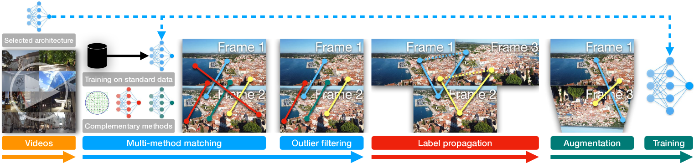
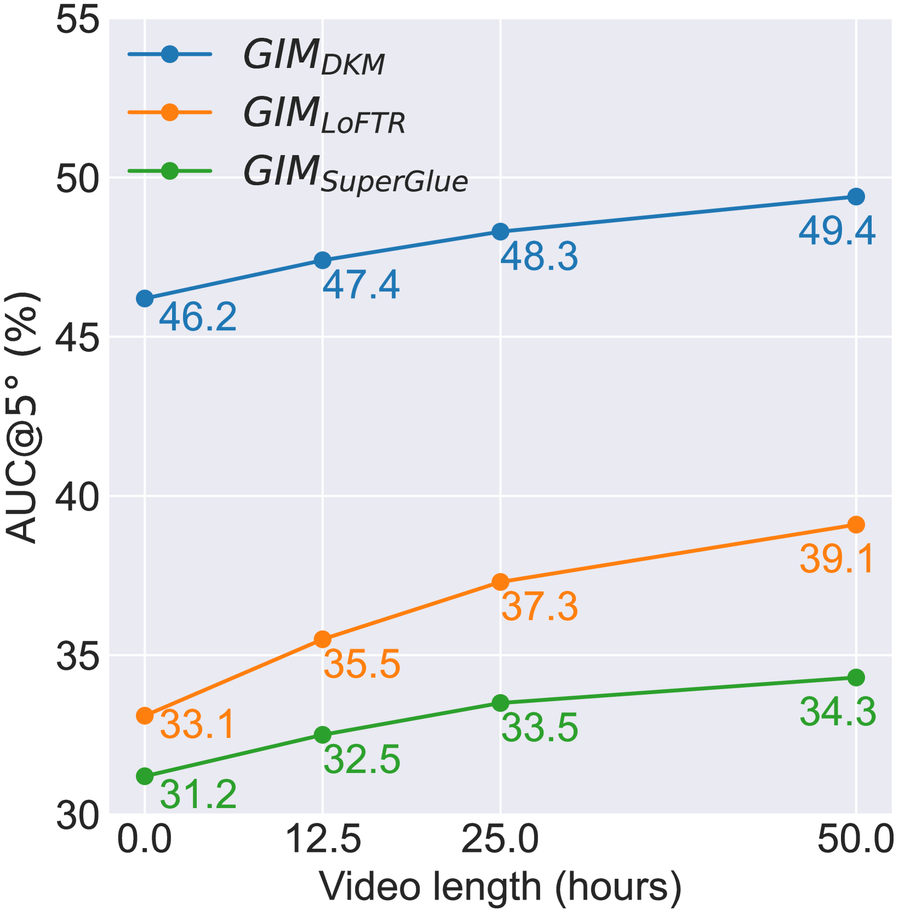
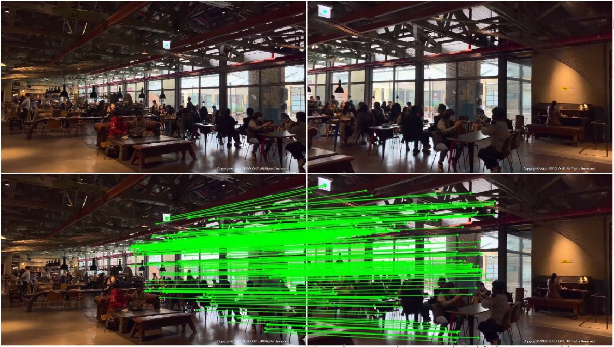
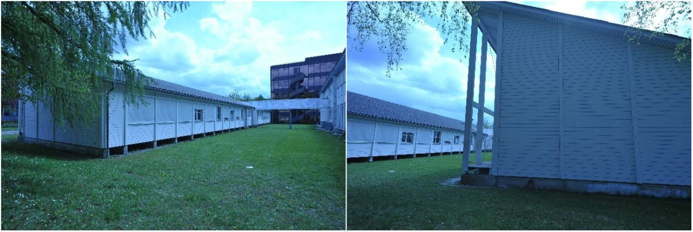

# GIM：从互联网视频学习可泛化的图像匹配器

## 结论先行

- **一句话定位**：GIM 不是一张新的匹配网络，而是一个**架构无关的自训练（self-training）框架**——用海量互联网视频自动生成像素对应标签，把「在单一域上训练的专用匹配器」变成「跨域、零样本可用的通用匹配器」。它**包裹/增强**现有 backbone（RoMa、DKM、LoFTR、LightGlue/SuperGlue），而不是替换它们。
- **核心洞察**：视频天然提供了「时序连续性」和「几何多样性」两样监督图像匹配最需要、又最难标注的东西。相邻帧基线小、匹配容易、标签可靠；把可靠的短基线对应沿时间轴**传递（propagate）**，就能凭空造出宽基线、大视角变化的训练对——而这正是匹配泛化的瓶颈所在。
- **方法四步**：(1) 用标准数据集（如 MegaDepth）训好给定架构作为 teacher；(2) 用多个**互补**匹配方法在相邻帧（间隔 20/40/80 帧）上生成稠密对应；(3) 鲁棒拟合（RANSAC/极几何）过滤外点；(4) 沿视频**传播**对应到更远的帧、并施加强透视增强，在「原域数据 + 视频数据等概率混合」上重训。整个流程可套用于任意匹配架构，损失沿用各 backbone 原本的损失。
- **论文证据**：用 **50 小时** YouTube 旅游视频（26 国 43 城、约 18 万训练图对），三个 SOTA 架构在零样本设置下相对提升 **8.4%–18.1%**；README 的 ZEB Mean AUC@5%：GIM_RoMa 53.3（vs RoMa 48.8）、GIM_DKM(100h) 51.2（vs 45.8）、GIM_LoFTR(50h) 39.1（vs 33.1）、GIM_LightGlue(100h) 38.3（vs 31.7）。性能随视频时长单调上升，呈现清晰的 scaling 趋势。
- **配套基准**：论文提出 **ZEB（Zero-shot Evaluation Benchmark）**——合并 8 个真实 + 4 个仿真数据集、约 4.6 万评测图对、覆盖 12 个跨域场景，用「12 域平均 AUC@5°」衡量泛化，填补了此前匹配领域缺乏统一零样本评测的空白。
- **代码状态**：GitHub 公开 demo/inference/evaluation/reconstruction；**训练代码开源但在独立分支**（train-gim-roma / -dkm / -loftr / -glue），按约定记 `training_open_source: true`；MIT 许可。
- **工程判断**：GIM 的价值是「用一个通用零样本匹配器替掉一堆专用域匹配器」。但训练门槛高（标签生成 16×A100 跑 4 天，重训 5×8×A100-80GB）、训练视频未公开需自行 yt-dlp 采集（版权/可复现性风险）、标签质量强依赖初始 teacher 与鲁棒过滤。

## 1. 这篇论文解决什么问题？

### 已确认的论文事实

- **问题定义**：现有匹配器（LoFTR/DKM/SuperGlue 等）几乎都在 MegaDepth、ScanNet 等**单一域**上监督训练，跨到未见域（无人机、内窥、卫星、仿真、极端光照）时性能骤降。根因是**训练数据的域覆盖太窄**，而稠密对应标签又极难在多样场景下大规模标注（需要精确深度或 SfM 重建）。
- **输入 / 输出**：推理时输入两张图像，输出像素级对应（稀疏或稠密取决于 backbone）；**训练阶段**的关键是从无标注视频中自动生成监督用的对应标签。
- **目标场景**：跨域、零样本图像匹配；下游包括相对相机位姿、单应估计、两视图/多视图 3D 重建，乃至极端跨域的 BEV 点云投影匹配。
- **与现有方法差异**：GIM 是**数据与训练框架**，不绑定任何特定网络结构，与「设计更强的匹配网络」这条主线正交、可叠加。

## 2. 方法概览

- **核心想法**：用互联网视频的**多样性**（各种场景/相机/天气）加上**时序连续性**（相邻帧易匹配）自动造对应标签，自训练出泛化匹配器；再用标签传播把「短基线可靠对应」放大成「宽基线困难对应」，逼近下游真正需要的大视角变化。
- **一句话 pipeline**：标准数据训 teacher → 多方法在相邻帧生成对应 → 鲁棒拟合过滤外点 → 沿视频传播到远帧 + 强透视增强 → 在「原域 + 视频」混合数据上重训 student。
- **可套用性**：论文正文验证 LoFTR / DKM / SuperGlue 三主架构（覆盖稀疏到稠密不同输出密度），仓库额外加 RoMa（gim_roma）与 LightGlue，共四个开源 checkpoint。

### 2.1 架构解析

GIM 本身没有「网络架构」，它的「架构」是一条**数据生产与自训练流水线**。整体分四个阶段，串成一条闭环：

1. **视频采集（Video Collection）**：从互联网批量下载视频。论文用了 50 小时 YouTube 旅游素材，覆盖 26 国 43 城，天然带来场景/相机/光照的多样性，这正是 MegaDepth 类单域数据缺的东西。

2. **初始训练（Initial Training）**：先用标准公开数据集（各 backbone 官方的室内/室外权重）把给定架构训到基本能用，作为后续生成标签的 **teacher**。这一步决定标签质量的下限。

3. **标签生成（Label Generation）**：在**相邻**视频帧之间生成稠密对应。这里的关键设计有两点：
   - **多方法互补融合**：不依赖单一 teacher，而是用多个互补匹配方法（如 RootSIFT、RootSIFT+SuperGlue、以及被增强的架构本身）各自出对应再融合，降低单一方法的系统性偏差。
   - **多帧间隔采样**：每 20 帧均匀采样，并分别在间隔 **20、40、80 帧**处取图对（ $\{X, X+20\}$、 $\{X, X+40\}$、 $\{X, X+80\}$ ），覆盖从小到中等的基线变化。

4. **过滤、传播与重训（Enhancement & Retraining）**：
   - **鲁棒拟合过滤**：用极几何 / 单应的鲁棒估计（RANSAC 类）剔除几何不一致的外点对应，只保留通过一致性检验的。
   - **标签传播**：把可靠的短基线对应沿时间轴**传递链接**，从而合成出宽基线、大视角变化的困难训练对（详见 2.2 与 2.3）。
   - **强数据增强**：对训练图对施加随机透视变换等强增强，专门弥补视频「同一台相机、内参单一」带来的相机模型同质化问题。
   - **重训**：在「原域数据 + 视频数据**等概率混合**」上重训 student，损失沿用该架构原本的匹配损失，只在有对应的像素上计算。

**数据流一句话**：视频帧 → teacher 多方法出对应 → 鲁棒过滤 → 传播成宽基线对 → 混合原域数据 + 强增强 → 重训得到 gim_* 泛化版权重。

**关键设计选择及理由**：
- **为什么不直接用远帧对训练**：远帧基线大、匹配困难，直接用 teacher 出的标签噪声大、召回低；GIM 走「近帧造可靠标签 → 传播成远帧标签」这条更稳的路。
- **为什么多方法融合**：单一 teacher 会把自己的失败模式当成标签固化下来（自我强化偏差）；互补方法能相互纠偏。
- **为什么混合原域数据**：纯视频数据几何多样但精度不如 SfM 标注，混入原域数据锚住几何精度，避免泛化换来的精度回退。

### 2.2 核心原理

**为什么这样设计 work？** 图像匹配泛化的核心矛盾是：*要泛化就要多样的训练域，要监督就要精确的对应标签，而这两者在传统数据（需 SfM/深度）上难以兼得*。GIM 用两个视频特性同时化解：

- **时序连续性 → 廉价可靠的标签来源**：相邻帧视差小、遮挡少、外观几乎不变，即便是普通 teacher 也能匹配得又准又密。这让「无标注视频」变成了「近似免费的对应标签」。
- **传播 → 把易标签放大成难样本**：只用相邻帧对训练学不到大视角不变性。GIM 借助「对应的可传递性」——若 A↔B 与 B↔C 都可靠，则 A↔C 也成立——沿视频链条把小基线对应逐跳拼成大基线对应。于是困难样本不是靠标注得来，而是靠**几何传递合成**得来。

**关键归纳偏置**：GIM 把「对应关系在视频时序上传递闭合」当作强先验注入训练数据。这本质上是一种**几何自洽性约束**：一条穿越多帧的对应链，只有几何一致才能一路存活，因此传播 + 鲁棒过滤天然筛掉了不一致的噪声。

**与前作的本质区别**：此前提升匹配的主线是「设计更强的网络」（Attention、粗到细、稠密回归）或「用更精细的 SfM 标注扩数据」。GIM 换了维度——**不动网络、不做人工标注**，而是把「数据的域覆盖」和「困难样本的合成」交给互联网视频 + 自训练。因此它与任何网络改进都正交、可叠加，这也是它「架构无关」的根本原因。

### 2.3 关键公式解析

> 说明：论文以文字与示意为主，正式记号较少；以下公式按论文语义形式化表述，符号排版为便于理解的规范化写法（原文未逐一给出严格 LaTeX 定义式）。传播阈值 1024、帧间隔 20/40/80 已与论文正文逐字核对一致。

**公式 (1)：对应关系的可传递性（传播的几何依据）**

$$ (i,j) \in \mathcal{C}^{AB} \ \wedge\ (j',k) \in \mathcal{C}^{BC} \ \wedge\ \lVert j - j' \rVert < 1 \ \Longrightarrow\ (i,k) \in \mathcal{C}^{AC} $$

- 符号： $\mathcal{C}^{AB}$ 是图像 $A$ 与 $B$ 之间已过滤的可靠对应集合， $(i,j)$ 表示 $A$ 的像素 $i$ 对应 $B$ 的像素 $j$ ； $\lVert j - j' \rVert < 1$ 表示 $B$ 上的两个落点相距不到 1 个像素（视为同一物理点）。
- 作用：这是**标签传播**的核心规则——只要 $A$ 的点经 $B$ 能链到 $C$ ，就在 $A$ 、 $C$ 间新增一条对应 $(i,k)$ 。由此从相邻帧的短基线对应，逐跳合成出宽基线、大视角的困难训练对。

**公式 (2)：传播的停止条件（保证监督密度）**

$$ \text{propagate}(A \to \cdots \to Z)\ \text{while}\ \lvert \mathcal{C}^{AZ} \rvert \ge 1024 $$

- 符号： $\lvert \mathcal{C}^{AZ} \rvert$ 是当前起止帧对之间存活的对应数量；阈值 1024（论文原文：propagate as far as possible as long as there are more than 1024 correspondences）。
- 作用：沿视频不断向更远帧传播，直到有效对应数掉到 1024 以下才停。既尽量拉大基线（增加难度），又保证每对训练图仍有足够密的监督信号，不至于监督过稀导致训练不稳。

**公式 (3)：训练损失（只在有对应处计算）**

$$ \mathcal{L}_{\text{GIM}} = \mathbb{E}_{(I_A, I_B)\sim \mathcal{D}}\ \Big[\ \mathcal{L}_{\text{arch}}\big(f_\theta(I_A, I_B);\ \mathcal{C}^{AB}\big)\ \Big],\quad \mathcal{D} = \tfrac{1}{2}\mathcal{D}_{\text{orig}} + \tfrac{1}{2}\mathcal{D}_{\text{video}} $$

- 符号： $f\_\theta$ 是被增强的 backbone； $\mathcal{L}\_{\text{arch}}$ 是该架构**原本的**匹配损失（LoFTR 用 focal/coarse-fine、DKM/RoMa 用回归损失等），不新设计损失； $\mathcal{C}^{AB}$ 是传播 + 过滤后的对应标签，损失**只在有对应的像素上**回传； $\mathcal{D}$ 是原域数据与视频数据的**等概率混合**分布。
- 作用：把「GIM 造出的视频监督」以最小侵入方式接进任意架构的既有训练目标——这正是「架构无关」在损失层面的体现。

**公式 (4)：评测指标 ZEB Mean AUC@5°**

$$ \text{score} = \frac{1}{12}\sum_{d=1}^{12} \text{AUC}_{5^\circ}(d),\qquad e = \max(e_{\text{rot}},\ e_{\text{trans}}) $$

- 符号：对 12 个跨域数据集分别算相对位姿误差的 AUC@5°（由本质矩阵 + RANSAC 估位姿），再取均值；位姿误差 $e$ 取旋转角误差 $e\_{\text{rot}}$ 与平移角误差 $e\_{\text{trans}}$ 的**较大者**。
- 作用：用单一标量刻画「跨 12 个未见域的平均零样本能力」，避免只在个别域刷分，是 ZEB 基准的核心口径。

### 2.4 训练与推理细节

- **训练目标 / 损失**：不引入新损失，沿用各 backbone 原本的匹配损失，仅在传播 + 过滤后有对应的像素上计算（见公式 3）。数据为「原域 + 视频」等概率混合。
- **数据规模**：50 小时 YouTube 旅游视频，覆盖 26 国 43 城，产出约 **18 万** 训练图对；相邻帧取间隔 20/40/80，传播直到对应数 < 1024 停止。
- **标签生成成本**：论文报告标签生成阶段约 **16×A100 GPU 跑 4 天**。
- **重训成本**：完整重训需 **5×8×A100-80GB**（README 口径），门槛较高。
- **推理流程**：推理与被增强的 backbone**完全一致**——GIM 只改变了权重（换成 gim_* 泛化版），不改变前向计算图与推理成本。因此上层用法（RoMa/DKM/LoFTR/LightGlue 的接口、稀疏/稠密输出）保持不变，单卡即可跑 demo 与 ZEB 子集评测。

## 3. 关键贡献

1. **首个从无标注互联网视频做图像匹配自训练的框架**：把「视频时序」变成廉价对应标签来源，绕开对 SfM/深度标注的依赖。
2. **标签传播 + 鲁棒过滤**：基于对应可传递性，把短基线可靠对应合成为宽基线困难样本，几何自洽性天然过滤噪声。
3. **架构无关的增强器**：同一套框架叠加到 LoFTR/DKM/SuperGlue/RoMa/LightGlue，均获零样本增益，产出即插即用的 gim_* 泛化权重。
4. **提出 ZEB 零样本评测基准**：合并 8 真实 + 4 仿真、12 域约 4.6 万图对，用「12 域平均 AUC@5°」统一衡量跨域泛化，补齐领域评测空白。

## 4. 实验与证据

| 维度 | 内容 |
|---|---|
| 数据集 | ZEB（12 域：GL3/BLE/ETI/ETO/KIT/WEA/SEA/NIG/MUL/SCE/ICL/GTA，约 4.6 万图对，按 10–50% 重叠 5 档采样）；另含相对位姿、homography |
| Baseline | 各 backbone 原版（RoMa/DKM/LoFTR/LightGlue/SuperGlue）、RootSIFT |
| 指标 | ZEB Mean AUC@5°、AUC、mAA |
| 主要结果 | GIM_RoMa 53.3（vs 48.8）、GIM_DKM(100h) 51.2（vs 45.8）、GIM_LoFTR(50h) 39.1（vs 33.1）、GIM_LightGlue(100h) 38.3（vs 31.7）、GIM_SuperGlue(50h) 34.3、RootSIFT 31.8 |
| 摘要口径 | 50h 视频，相对提升 8.4%–18.1% |
| 下游 | 3D 重建、homography、相对位姿、极端跨域 BEV 点云投影匹配 |

> 口径提示：README 表中 DKM/LightGlue 用 100h、LoFTR/SuperGlue 用 50h，摘要的 8.4%–18.1% 对应 50h；引用数字务必注明训练时长，避免跨口径混比。

### 4.1 效果与性能解析

**主要结果解读**：GIM 最有说服力的证据不是某个单点数字，而是**跨全部架构一致的零样本增益**——RoMa/DKM/LoFTR/LightGlue/SuperGlue 全线上涨（相对 8.4%–18.1%）。这说明增益来自「数据与训练框架」而非某个架构的偶然契合，佐证了「架构无关」的主张。数字上 GIM_RoMa 达 53.3，显著超过 RootSIFT 的 31.8 与各 backbone 原版，且稠密类（RoMa/DKM）整体高于稀疏/半稠密类（LoFTR/LightGlue），符合稠密匹配在跨域下召回更高的直觉。

**scaling 是核心卖点**：论文用零样本性能随视频时长单调上升的曲线，论证「加更多视频还能继续涨」——这把匹配泛化从「设计驱动」转向「数据驱动」，是本文最重要的 message。它同时提示了方法的天花板：增益依赖持续投入的视频与算力。

**性能与效率**：推理成本**不变**——GIM 只换权重不改网络，gim_* 与对应 backbone 的速度/显存/参数量完全相同，落地零额外推理开销。代价全在训练侧：标签生成约 16×A100×4 天，完整重训 5×8×A100-80GB，属重资产投入。

**消融揭示的关键因素**（依论文设计）：多方法互补融合（抑制单 teacher 偏差）、鲁棒拟合过滤（保几何一致）、标签传播（造宽基线难样本）、强透视增强（补相机同质化）——四者共同支撑增益，缺一会削弱泛化。

**可比性与协议一致性**：GIM 与各 backbone 在同一 ZEB 协议、同一 AUC@5°（取旋转/平移角误差较大者）下直接对比，backbone 用官方权重，控制变量清晰。需注意的是跨训练时长（50h vs 100h）比较时口径不同，README 已分别标注。

## 5. 局限与风险

### 论文明确承认

- 论文全文未设独立的 Limitations 章节（已核对 arXiv HTML 全文，无专门局限性讨论段落）。
- 视频存在**相机模型同质化**问题（同一台相机、内参单一），论文承认并用强透视增强缓解。

### 我推断的风险

- **标签质量上限受制于初始 teacher**：teacher 弱则近帧标签噪声大，经传播会被放大。
- **传播可能引入几何漂移**：多跳链接的累计误差需靠鲁棒过滤压制，极端场景下仍可能残留系统性偏差。
- **训练算力与视频量门槛高**：具体训练视频未公开，复现其数据分布需自行大规模采集。

### 工程 / 许可证风险

- 训练代码分散在多个独立分支（train-gim-{roma,dkm,loftr,glue}，非 main，易遗漏）。
- 数据需 yt-dlp 抓 YouTube，存在视频失效 / 版权 / 可复现性风险；预处理依赖外部语义分割模型权重。
- 资源门槛高（标签生成 16×A100，重训 5×8×A100-80GB）。

## 方法谱系

> GIM 是训练框架，不取代任何网络，而是**基于并增强**下列匹配 backbone。

- 基于并增强：RoMa / DKM / LoFTR / LightGlue / SuperGlue（产出对应的 gim_* 泛化权重）
- 正交关系：与「设计更强匹配网络」的主线正交，可叠加

## 6. 与相似方法对比

| Method | 相同点 | 不同点 | 何时选它 |
|---|---|---|---|
| RoMa / DKM / LoFTR / LightGlue | GIM 直接训练/增强这些 backbone | GIM 是训练框架，不是新架构；产出 gim_* 泛化版 | 需要单一通用零样本匹配器时选 GIM 版 |
| MegaDepth 单域训练匹配器 | 同 backbone、同损失 | GIM 用互联网视频多样性 + 传播提升跨域泛化 | 跨域/未知域优先 GIM，纯同域可用原版 |
| LoMa | 都靠 scale up 数据提升鲁棒性 | LoMa scale 自有数据混合 + 大模型；GIM scale 互联网视频 + 自训练传播 | 两条数据驱动提升路线，可对照 |

## 7. 复现判断

- Git 地址：<https://github.com/xuelunshen/gim>
- 是否开源：是。
- 是否开源训练：是（分支 train-gim-{roma,dkm,loftr,glue}）。
- 代码可用性：demo/inference/eval/reconstruction 开箱；训练需切分支。
- 权重可用性：gim_roma / gim_dkm / gim_loftr / gim_lightglue。
- 数据可获得性：需自行用 yt-dlp 采集视频 + 跑预处理流水线（标签生成 + 传播）。
- 预计环境成本：推理单卡可跑；标签生成 ~16×A100×4 天；完整重训 5×8×A100-80GB。
- 最小复现路径：装环境 → 下载 gim_roma/gim_dkm 权重 → 跑 demo 与 ZEB 子集评测。
- 是否值得复现：值得，作为「泛化/零样本」匹配的标准做法与权重来源；推理侧零门槛，训练侧慎入。

## 8. 后续动作

- [x] 创建单篇论文分析
- [x] 更新 `indices/papers.md`
- [x] 更新 `indices/directions.md`
- [x] 更新 `indices/methods.md`
- [x] 创建 image-matching 横向对比
- [ ] 若开始复现，创建 `reproductions/image-matching/gim/README.md`

## Sources

- Paper: <https://arxiv.org/abs/2402.11095>
- PDF: <https://arxiv.org/pdf/2402.11095>
- HTML: <https://arxiv.org/html/2402.11095>
- GitHub: <https://github.com/xuelunshen/gim>
