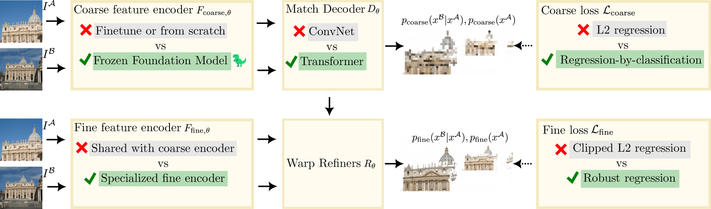
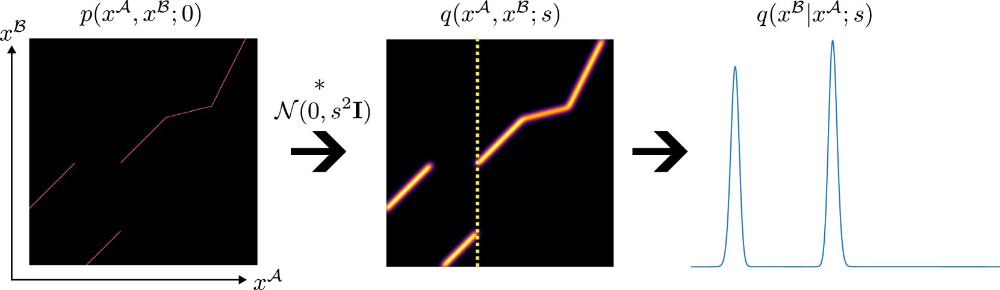
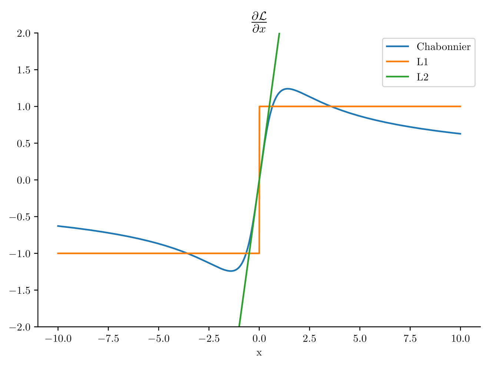

# RoMa：鲁棒的稠密特征匹配

## 结论先行

- **一句话定位**：RoMa 是稠密（dense）两视图匹配路线在 2024 年的强 SOTA baseline，核心思想是「用冻结的 DINOv2 提供鲁棒的 coarse 语义特征 + 专用 VGG19 ConvNet 提供可精定位的 fine 特征」，把粗匹配当成分类问题（regression-by-classification）、精匹配当成鲁棒回归，在最难的跨域基准上提升最大。
- **核心方法**：coarse-to-fine 稠密 warp 回归；冻结 DINOv2（ViT-L/14，stride 14，1024 维）coarse 特征 + VGG19（stride {1,2,4,8}）fine 特征解耦组合；Gaussian Process 做 match encoder，transformer match decoder 预测 $ K = 64 \times 64 $ 个 anchor 上的概率分布以显式表达多模态匹配；coarse 阶段用分类损失、fine 阶段用 generalized Charbonnier 鲁棒回归。
- **论文证据**：MegaDepth-1500 AUC@5/10/20 = 62.6/76.7/86.3；ScanNet-1500 = 31.8/53.4/70.9（论文称首次在此基准 AUC@20° 超 70）；IMC2022 mAA@10 = 88.0；WxBS mAA@10px = 80.1（headline，跨域基准提升最大）。
- **代码状态**：GitHub 公开推理 + 训练（`experiments/` + `torchrun`，`--only_test` 评测），权重自动下载；自有代码 MIT，DINOv2 为 Apache-2.0；按仓库约定 `training_open_source: true`。
- **工程判断**：RoMa 精度/鲁棒性明显高于稀疏匹配器（LightGlue/SuperGlue），但稠密 decoder + DINOv2 计算/显存更重；560×560、batch 8、RTX6000 上约 199 ms/对，比 DKM 仅多约 7%。适合做高精度匹配主路线或重建/定位前端，不适合极致低延迟稀疏场景。

## 1. 这篇论文解决什么问题？

### 已确认的论文事实

- **问题定义**：两视图特征匹配在大视角变化、外观/光照变化、跨域（不同天气/相机/场景）时鲁棒性不足。RoMa 想用一个稠密匹配模型同时拿到高精度和强泛化。
- **输入 / 输出**：输入两张图像 $ I^A, I^B $ ，输出稠密像素级 warp（对应场 $ W^{A\to B} $ ）和逐像素 certainty（可匹配置信度），下游采样对应点接 RANSAC/MAGSAC 求相对位姿或几何。
- **目标场景**：相对位姿估计 / two-view geometry、视觉定位、3D 重建前端。
- **与现有方法差异**：相对 LoFTR/ASpanFormer 等 semi-dense detector-free 方法，RoMa 是**全稠密**；相对 DKM（同作者前作）改用**冻结基础模型特征 + anchor 分类 decoder + 鲁棒损失**，而非纯回归。

### 关键动机洞察

论文的核心观察是：**匹配的两个子问题需要不同类型的特征**。coarse（全局）匹配需要对外观变化鲁棒、语义一致的特征——冻结的 DINOv2 自监督特征恰好满足；而 fine（精定位）匹配需要高频、局部可分辨的特征——DINOv2 因 stride 14 且缺少细节而不胜任，必须用专门的 ConvNet 补上。过去把两者塞进同一个编码器（如 DKM 用 ResNet）会互相妥协。RoMa 把这两条通路解耦，是全篇性能提升的主因之一。

## 2. 方法概览

- **核心想法**：coarse-to-fine 稠密匹配。冻结 **DINOv2** 提供鲁棒但粗糙的 coarse 特征，与专门训练的 **VGG19 fine 特征** 结合，构建可精确定位的特征金字塔；粗匹配用分类建模多模态分布，精匹配用鲁棒回归收敛到亚像素。
- **一句话 pipeline**：`双图 → DINOv2 coarse 特征 (stride 14) + VGG19 fine 特征 (stride 1/2/4/8) → GP match encoder 编码相似性 → transformer decoder 预测 64×64 anchor 概率（粗 warp + matchability）→ 逐级 refiner 上采样精修 → 稠密 warp + certainty → 平衡采样接 RANSAC 求位姿`。

### 2.1 架构解析

**整体结构（模块分解）**：

1. **双通路特征编码器**
   - *Coarse 编码器*：**冻结的 DINOv2**（**ViT-L/14**，patch/stride = 14，输出 1024 维 patch token），提供对光照、视角、纹理变化鲁棒的高层特征。训练全程不更新，直接借用自监督基础模型的泛化能力。
   - *Fine 编码器*：**专用 VGG19 ConvNet**（可训练），输出 stride $ \{1,2,4,8\} $ 的多尺度细特征。论文原话：「DINOv2 lacks fine features, which are needed for accurate correspondences」——fine 通路专门补高频定位信息。

2. **Global matcher $ G_\theta $** ：由 **match encoder $ E_\theta $** 和 **match decoder $ D_\theta $** 组成，作用在最粗尺度（stride 14）。
   - $ E_\theta $ 用 **Gaussian Process (GP)** 编码两图特征间的相似性（沿用 DKM）。GP 天然给出后验均值与不确定度，为多模态建模打基础。
   - $ D_\theta $ 是 **transformer match decoder**，输出维度为 $ B \times H \times W \times (K+1) $ ： $ K = 64 \times 64 $ 个 anchor 上的概率 + 1 个 matchability 分数。这是「anchor probabilities」的落点。

3. **Refinement / refiner 栈**：从最粗 warp 出发，结合 fine 特征逐级上采样（stride 8→4→2→1），每级回归 warp 的残差修正，最终得到全分辨率稠密 warp 与 certainty。

**数据流**：
$$
I^A, I^B \;\xrightarrow{\text{DINOv2 (froz.)}}\; F^{coarse} \;\xrightarrow{E_\theta(\text{GP})}\; \text{sim. enc.} \;\xrightarrow{D_\theta(\text{Transformer})}\; \{\pi_k, p^A\} \;\xrightarrow{\text{argmax+softargmax}}\; \hat W_{coarse}
$$
$$
\hat W_{coarse} \;\xrightarrow[\text{VGG19 fine}]{\text{refiners (stride }8\to1)}\; \hat W^{A\to B} + \text{certainty}
$$

**关键设计选择及理由**：
- *冻结 DINOv2* —— 用有监督对应可训练数据有限，冻结的自监督基础模型把泛化能力「白嫖」进来，是跨域鲁棒性的来源。
- *coarse 分类而非回归* —— 运动边界处匹配分布本质是多模态的（见 2.2），直接回归会被强行拉向均值造成模糊；离散 anchor 分类能表达多峰。
- *fine 鲁棒回归* —— 精修阶段分布已单峰，改用带鲁棒核的回归收敛到亚像素，同时对离群点不敏感。

### 2.2 核心原理

**为什么 work**：

1. **特征分工消除了 coarse/fine 的相互妥协**。语义鲁棒特征（DINOv2）负责「找对区域」，高频局部特征（VGG19）负责「定准像素」，两者各自最优而不再互相拖累。这是 RoMa 相对 DKM 单一 backbone 的本质区别。

2. **用分类显式建模多模态匹配分布**。如上图，在物体/深度边界（motion boundary）附近，一个 coarse 网格点可能对应目标图上多个候选位置——真实条件分布是多峰的。若像 DKM 那样直接回归一个均值，网络会在两峰之间「和稀泥」，产生系统性错位。RoMa 把粗匹配离散化到 $ 64 \times 64 $ 个 anchor 上做分类（regression-by-classification, RbC），概率分布可以自然表达多峰，再取峰值解码，从根上解决边界模糊。

3. **鲁棒回归损失对齐了「像素误差」与「梯度行为」**。

如上图，标准 L2 损失对大残差（离群/误匹配）梯度线性增大，训练被少数坏点主导；generalized Charbonnier 损失在小残差处近似 L2（保持定位精度），在大残差处梯度衰减到接近零（抑制离群点影响）。这让 fine 回归既准又稳。

**关键机制/归纳偏置**：
- Gaussian Process match encoder 提供带不确定度的相似性后验，是 anchor 概率的信息来源。
- anchor 网格是空间上均匀的强先验，把连续 warp 空间离散化换取多模态可表达性。
- 冻结 backbone = 强正则化，防止在有限有监督数据上过拟合。

**与前作在原理上的本质区别**：DKM 用单一 ResNet + 纯回归（高斯/拉普拉斯似然）做 warp，coarse 也是回归；RoMa 把 coarse 换成 DINOv2 + anchor 分类、fine 换成鲁棒回归，把「特征」与「匹配建模」两处同时升级。

### 2.3 关键公式解析

> 注：论文正文以概率建模形式给出，下列公式据论文表述整理；符号按论文习惯（ $ x^A $ 源图坐标， $ x^B $ 目标图坐标， $ \hat W $ 当前 warp 估计）。

**公式 (1)：粗匹配的 anchor 混合分布（regression-by-classification）**

$$
p_{coarse,\theta}\!\left(x^{B}\mid x^{A}\right) \;=\; \sum_{k=1}^{K} \pi_k\!\left(x^{A}\right)\, \mathcal{B}_{m_k}
$$

- 符号： $ x^A $ 是源图某网格点坐标； $ x^B $ 是其在目标图的对应坐标； $ K = 64 \times 64 $ 是 anchor 数量； $ \pi_k(x^A) $ 是 decoder $ D_\theta $ 预测的第 $ k $ 个 anchor 的概率（ $ \sum_k \pi_k = 1 $ ）； $ m_k $ 是第 $ k $ 个 anchor 的坐标； $ \mathcal{B}_{m_k} $ 是以 $ m_k $ 为中心的基分布（论文用小 bin/basis）。
- 作用：把「预测一个连续对应坐标」变成「在 $ K $ 个离散 anchor 上分类」，从而可以用一个概率分布表达**多模态**匹配，避免回归被迫取均值。

**公式 (2)：从分布解码到粗 warp（argmax + 局部 softargmax）**

$$
k^{*}\!\left(x^{A}\right) \;=\; \arg\max_{k} \; \pi_k\!\left(x^{A}\right), \qquad
\hat W_{coarse}\!\left(x^{A}\right) \;=\; \operatorname{softargmax}_{k \in \mathcal{N}(k^{*})} \; \pi_k\!\left(x^{A}\right)\, m_k
$$

- 符号： $ k^* $ 是概率最大的 anchor（选主峰，天然避开多模态歧义）； $ \mathcal{N}(k^*) $ 是 $ k^* $ 的邻域 anchor 集合； softargmax 在邻域内做概率加权得到亚 anchor 精度的连续坐标。
- 作用：先离散选峰、再局部连续精化，兼顾多模态鲁棒性与坐标连续性，输出粗 warp $ \hat W_{coarse} $ 供 refiner 精修。

**公式 (3)：精匹配的 generalized Charbonnier 鲁棒回归对数似然**

$$
\log p_{\theta}\!\left(x_i^{B}\mid x_i^{A},\, \hat W_{i+1}^{A\to B}\right) \;=\; -\left(\,\bigl\lVert\, \mu_\theta\!\left(x_i^{A},\, \hat W_{i+1}^{A\to B}\right) - x_i^{B} \,\bigr\rVert^{2} + s\,\right)^{1/4}
$$

- 符号： $ \mu_\theta(\cdot) $ 是 refiner 在第 $ i $ 级（ $ i \in \{0,1,2,3\} $ ）预测的对应坐标（以上一级更粗的 warp $ \hat W_{i+1}^{A\to B} $ 为条件）； $ x_i^B $ 是真值目标坐标； $ \lVert\cdot\rVert^2 $ 是残差平方； $ s $ 是防止梯度爆炸的平滑常数，论文取 $ s = 2^{i} c $ （ $ c = 0.03 $ ）；外层 $ 1/4 $ 指数对应 generalized Charbonnier 形状参数 $ \alpha = 0.5 $ 的设置。
- 作用：最大化该对数似然 = 最小化 $ (\lVert\cdot\rVert^2+s)^{1/4} $ 型鲁棒损失。小残差时梯度接近 L2（精定位），大残差时梯度衰减（抗离群）。这是 fine 阶段既准又稳的数学核心。

**公式 (4)：matchability / certainty 预测（二分类）**

$$
\mathcal{L}_{cert} \;=\; \operatorname{BCE}\!\left(\, p^{A}\!\left(x^{A}\right),\; y^{A} \,\right), \qquad y^{A} \in \{0, 1\}
$$

- 符号： $ p^A(x^A) $ 是 decoder 输出的第 $ (K{+}1) $ 维 matchability 分数； $ y^A $ 是真值可匹配指示（ $ x^A $ 是否有有效对应，由 MVS 深度 / RGB-D warp 一致性给出）； BCE 为二元交叉熵。
- 作用：学出逐像素 certainty，推理时据此做**平衡采样**（balanced sampling），只保留可靠对应喂给 RANSAC，剔除天空/遮挡/无纹理区。

粗阶段的总损失据论文为 anchor 分类损失（交叉熵对齐理论分布与预测 $ \pi_k $ ）加上公式 (4) 的 matchability BCE；fine 阶段为公式 (3) 的鲁棒回归；coarse 与 refiner 联合训练。

### 2.4 训练与推理细节

**训练目标 / 损失**：coarse 阶段 anchor 分类损失（对齐真值分布与 $ \pi_k $ ）+ matchability BCE；fine 阶段 generalized Charbonnier 鲁棒回归（ $ \alpha = 0.5 $ ）；两者**联合训练**（coarse matching 与 refinement 网络一起优化）。

**数据与规模**：
- outdoor 模型在 **MegaDepth** 上训练（真值 warp 来自 MVS 稠密深度）；indoor 用**单独的 ScanNet** 训练模型（真值来自 RGB-D）。除 ScanNet 评测外，其余结果均用 MegaDepth 模型。训练排除测试保留场景。

**超参要点**（据论文）：
- 分辨率：消融用 448×448，最终方法用 **560×560**。
- batch size = **8**。
- 学习率（沿用 DKM 的 batch=8 规范）：**decoder $ 10^{-4} $ ，encoder $ 5 \times 10^{-6} $** （fine 编码器等）。
- 冻结 DINOv2（ViT-L/14），训练 VGG19 fine 编码器 + GP encoder + transformer decoder + refiners。
- 具体迭代步数论文未在正文醒目给出（沿用 DKM 训练配置，待核验）。

**推理流程**：
1. 双图过 DINOv2（coarse，ViT-L/14）+ VGG19（fine）。
2. GP encoder 编码相似性 → transformer decoder 出 $ 64 \times 64 $ anchor 概率 + matchability。
3. argmax + 局部 softargmax 解码粗 warp。
4. refiner 逐级（stride 8→1）用 fine 特征精修到全分辨率稠密 warp + certainty。
5. **平衡采样约 10000 个匹配** → RANSAC/MAGSAC 求相对位姿或几何。

## 3. 关键贡献

1. 把冻结基础模型（DINOv2）coarse 特征与专用 VGG19 fine 特征**解耦组合**，兼顾跨域鲁棒性与亚像素定位精度。
2. Gaussian Process match encoder + transformer match decoder + **anchor probability**（ $ K = 64 \times 64 $ ），用分类显式建模多模态匹配分布，解决运动边界模糊。
3. **regression-by-classification（coarse）+ generalized Charbonnier robust regression（fine）** 的两阶段损失设计，使梯度行为与像素误差对齐。
4. 在 MegaDepth-1500 / ScanNet-1500 / IMC2022 / WxBS 上全面 SOTA，**在最难的跨域基准（WxBS）提升最大**。

## 4. 实验与证据

| 维度 | 内容 |
|---|---|
| 数据集 | MegaDepth-1500、ScanNet-1500、IMC2022、WxBS、Mega-8-Scenes |
| Baseline | DKM、LoFTR、ASpanFormer、PMatch、CasMTR、ASTR、PDC-Net+、LightGlue、SuperGlue、PATS |
| 指标 | AUC@5/10/20、mAA@10、mAA@10px、runtime |
| 主要结果 | MegaDepth-1500 62.6/76.7/86.3；ScanNet-1500 31.8/53.4/70.9；IMC2022 mAA@10 88.0；WxBS mAA@10px 80.1 |
| 消融 | Table 2 逐项验证：DINOv2 coarse 特征、专用 fine 特征、anchor decoder、RbC 分类损失、鲁棒回归损失各自的增益 |
| 速度 | 560×560、batch 8、RTX6000 约 199 ms/对，相对 DKM baseline +约 7% |
| 失败/局限 | 依赖有监督对应、稠密成本高（见第 5 节） |

### 4.1 效果与性能解析

**主要结果解读（为什么强）**：
- **ScanNet-1500 AUC@20 = 70.9**：论文强调这是首次在该室内基准把 AUC@20° 推过 70。室内低纹理、重复结构、弱视差，正是稠密 + 鲁棒特征的用武之地——稀疏检测器在这类场景检测点稀少且不稳，RoMa 稠密 warp 能在无纹理区靠语义特征给出可用对应。
- **WxBS mAA@10px = 80.1**：WxBS 是极端跨域（不同季节/传感器/光照）基准，提升幅度最大，直接印证「冻结 DINOv2 语义特征带来跨域鲁棒性」这一核心论点。这是全篇最有说服力的证据。
- **MegaDepth-1500 62.6/76.7/86.3**：室外标准基准也全面领先 DKM/LoFTR/ASpanFormer，说明升级不是以牺牲室外为代价换来的鲁棒性。

**性能与效率**：
- 推理 560×560、batch 8、RTX6000 约 **199 ms/对**，相对 DKM 仅多约 **7%**——即精度大涨而计算开销几乎不变（DINOv2 冻结、GP/decoder 结构与 DKM 同量级）。
- 但相对稀疏匹配器（LightGlue 几十 ms 量级），稠密 decoder + ViT backbone 的绝对延迟与显存明显更高。具体显存论文未醒目列出（待核验）。
- 参数量：backbone 以 DINOv2 **ViT-L/14** 为主（约 3 亿参数量级），冻结不训练；可训练参数集中在 VGG19 fine 编码器 + GP + decoder + refiners。

**消融揭示的关键因素**（Table 2）：论文系统性逐项加回四个贡献。据论文表述，**改用 DINOv2 coarse 特征**与**引入 anchor/RbC 分类**是增益的主要来源，**专用 fine 特征**主导亚像素精度，**鲁棒回归损失**进一步稳住 fine 阶段。这与 2.2 的原理分析一致——特征解耦 + 多模态建模是两大支柱。

**可比性与协议一致性**：评测遵循各基准标准协议（AUC 阈值、平衡采样 10000 匹配、MAGSAC/RANSAC 求解），与 DKM/LoFTR 等 baseline 同协议对比，可比性较好；indoor 用单独 ScanNet 模型符合社区惯例。

## 5. 局限与风险

### 论文明确承认

- 依赖**有监督对应**，限制可用训练数据量（用冻结基础模型特征部分缓解泛化）。
- 训练稠密匹配是对下游任务（位姿/几何）的**间接优化**，直接在下游目标上训练可能更优。

### 我推断的风险

- 稠密匹配计算/显存成本高于稀疏匹配器，实际部署成本明显高于 LightGlue；虽相对 DKM 仅 +7%，但绝对延迟（约 199 ms/对）对高帧率或大规模建图仍偏重。
- 高分辨率 / 大 batch 显存压力需评估（具体显存待核验）。
- $ 64 \times 64 $ anchor 网格是固定离散化，极端小位移或超高分辨率下 anchor 粒度是否够细需实测。

### 工程 / 许可证风险

- 自有代码 MIT（商用友好），依赖 **DINOv2（Apache-2.0）**；DINOv2 权重发布条款与 Meta 使用条款需按发布仓库确认（一般为 Apache-2.0，待核验）。
- 数据准备依赖外部仓库 DKM 的脚本，复现训练有额外配置成本。

## 方法谱系

- 取代/改进：DKM（同作者前作，同稠密 warp 回归框架；RoMa 换 DINOv2 coarse + anchor decoder + RbC/鲁棒损失全面超越；仓库暂无 DKM 独立分析）
- 基于：[DINOv2](../vision-foundation-models/2023-dinov2.md)（冻结自监督 ViT-L/14 提供 coarse 鲁棒特征）
- 被后继取代：[RoMa v2](../image-matching/2025-romav2.md)（DINOv3、Attention 替代 GP、两阶段训练、预测协方差、快约 1.7×）

## 6. 与相似方法对比

| Method | 相同点 | 不同点 | 何时选它 |
|---|---|---|---|
| DKM | 同作者，同稠密 warp 回归 + GP encoder 框架 | RoMa 改用冻结 DINOv2 coarse + 专用 VGG19 fine + anchor 分类 decoder + RbC/鲁棒 loss，全面超越 DKM | 需要 DKM 升级版选 RoMa |
| LoFTR / ASpanFormer | 都是 detector-free 匹配 | RoMa 全稠密（非 semi-dense）、鲁棒性更强，AUC 全面领先 | 需要最强鲁棒匹配选 RoMa |
| LightGlue / SuperGlue | 都做两视图匹配 | RoMa 精度/鲁棒性更高但更慢更重；稀疏方法更快更省显存 | 要精度上限选 RoMa，要速度/低显存选 LightGlue |
| RoMa v2 | 同系后继，同 coarse-to-fine 稠密路线 | v2 用 DINOv3、Attention 替代 GP、两阶段训练、预测协方差、快约 1.7× | 困难/跨域稠密匹配优先 v2 |

## 7. 复现判断

- Git 地址：<https://github.com/Parskatt/RoMa>
- 是否开源：是。
- 是否开源训练：是（`experiments/` + torchrun，`--only_test` 评测）。
- 代码可用性：可安装 `romatch`，跑 demo、benchmark、训练。
- 权重可用性：roma_outdoor / roma_indoor / tiny_roma_v1_outdoor 自动下载。
- 数据可获得性：沿用 DKM 数据准备（MegaDepth / ScanNet）。
- 预计环境成本：推理单卡可跑，约 199 ms/对（RTX6000，560×560）；训练需多卡（batch 8、560×560）。
- 最小复现路径：安装 `romatch` → 跑 demo → 跑 Mega1500/ScanNet1500 benchmark（`--only_test`）。
- 是否值得复现：值得，作为稠密匹配精度基准与 RoMa v2 对照。

## 8. 后续动作

- [x] 创建单篇论文分析
- [x] 更新 `indices/papers.md`
- [x] 更新 `indices/directions.md`
- [x] 更新 `indices/methods.md`
- [x] 创建 image-matching 横向对比
- [ ] 若开始复现，创建 `reproductions/image-matching/roma/README.md`

## Sources

- Paper: <https://arxiv.org/abs/2305.15404>
- PDF: <https://arxiv.org/pdf/2305.15404>
- HTML (figures): <https://arxiv.org/html/2305.15404>
- GitHub: <https://github.com/Parskatt/RoMa>
