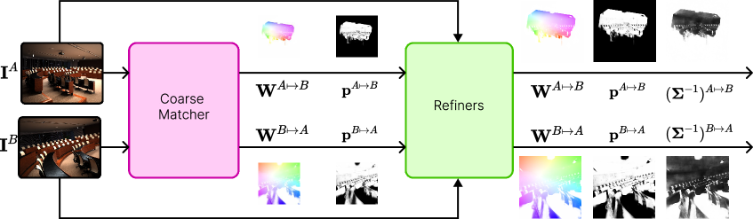
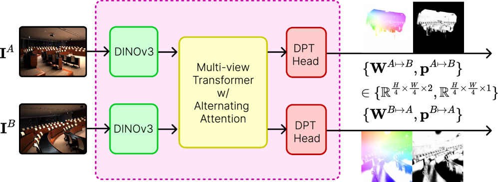
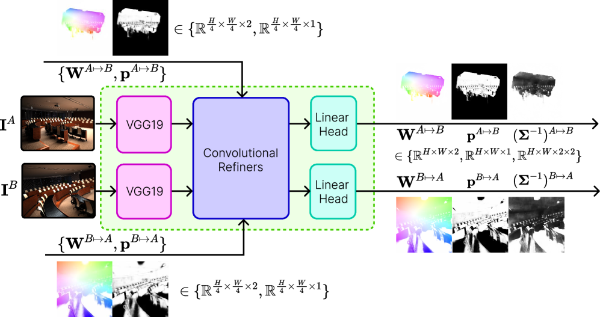
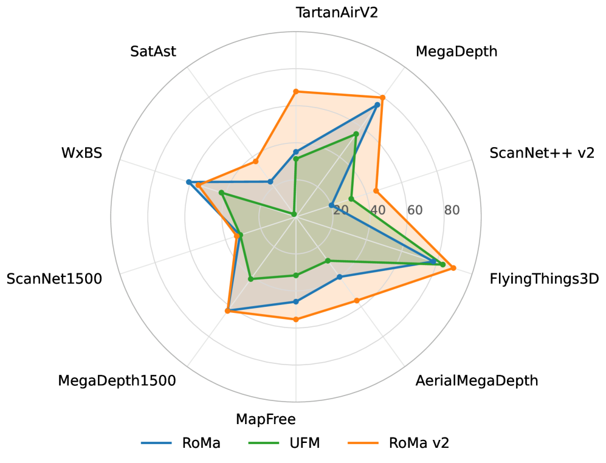

# RoMa v2：更难更好更快更稠密的特征匹配

## 结论先行

- **一句话定位**：RoMa v2 是 RoMa 的直系后继（同作者 Johan Edstedt 等），在「困难/跨域稠密匹配」上提升巨大（EPE 大幅下降）、速度快约 1.7×，在已饱和的 MegaDepth-1500 上几乎持平，并在极端模态（WxBS）上略有退步。
- **核心方法**：DINOv2→**DINOv3** backbone；用 **Attention 多视图 Transformer 取代高斯过程（GP）** 做 coarse matcher；**解耦的两阶段 matching-then-refinement** 训练（受 UFM 启发）；**预测每像素 2×2 精度矩阵（协方差）** 用于位姿加权求解；自定义 CUDA local-correlation kernel 降显存。
- **论文证据**：MegaDepth-1500 AUC@5/10/20 = 62.8/77.0/86.6（v1 62.6/76.7/86.3，几乎持平）；ScanNet-1500 = 33.6/56.2/73.8（v1 31.8/53.4/70.9，明显提升）；稠密匹配 EPE 大降（如 AerialMegaDepth 25.05→4.12，比 v1 低约 84%）；SatAst AUC@10px 23.5→37.0；**WxBS mAA@10px 60.8→55.4（退步）**；速度 30.9 vs 18.5 pairs/s（约 1.7×，H200）。
- **代码状态**：仓库公开（MIT，DINOv3 除外），提供 inference/demo/benchmark（Mega-1500/ScanNet-1500）脚本；README 未提及训练脚本，按约定 `training_open_source: "\\"`（疑似训练代码未公开 / to verify）。
- **工程判断**：RoMa v2 是当前「高精度 + 提速」的稠密匹配 SOTA；但依赖自定义 CUDA kernel（编译/可移植性风险）、DINOv3 自带非 MIT 许可、权重托管位置未显式说明，且对极端模态变化鲁棒性略降。

## 1. 这篇论文解决什么问题？

### 已确认的论文事实

- **问题定义**：RoMa v1 稠密匹配虽强，但存在三个痛点——训练慢（matcher 与 refiner 联合优化，收敛困难）、GP（高斯过程）decoder 计算重且难扩展、以及在跨域/宽基线/卫星-地面等困难场景仍有明显提升空间。RoMa v2 的目标是「同时更难（覆盖更极端场景）、更好（精度）、更快（吞吐）、更稠密（全像素）」。
- **输入 / 输出**：两张图像 → 双向稠密像素对应（warp） $\mathbf{W}^{A\mapsto B}, \mathbf{W}^{B\mapsto A}$ + 每像素置信度（certainty）+ 每像素 2×2 精度矩阵（协方差的逆）。
- **目标场景**：相对位姿估计、稠密光流式匹配、多模态匹配（IR↔RGB）、卫星-地面极端跨域（SatAst）、宽基线（TA-WB）。
- **与现有方法差异**：相对 v1，四处结构性改动——换 backbone（DINOv3）、换 decoder（Attention 取代 GP）、换训练范式（两阶段解耦）、加协方差头与自定义 CUDA kernel。

## 2. 方法概览

- **核心想法**：把 RoMa「coarse 全局匹配 + 多尺度 refine」的骨架保留，但用**可扩展的 Transformer 注意力**替换难以扩展的高斯过程，用**更强的冻结视觉基础模型（DINOv3）**提供语义特征，并把训练**拆成两个独立阶段**以稳定并加速收敛；额外让模型**显式预测匹配不确定性（协方差）**，供下游位姿求解做加权。
- **一句话 pipeline**：冻结 DINOv3 提特征 → 多视图 Transformer（交替 frame-wise / global attention）在 stride 4 输出 coarse warp 与置信度 → 三级 refiner（stride 4→2→1）用局部相关 + CNN 逐级细化到原分辨率，并输出每像素精度矩阵。

### 2.1 架构解析

整体分为**两大模块**：coarse matcher（粗匹配）与 refiners（精化），二者在训练时解耦、在推理时串联。

**(a) Backbone —— 冻结 DINOv3 ViT-L。** 与 v1 的 DINOv2（patch14）不同，v2 用 **DINOv3 ViT-L、patch16**，抽取第 11 与第 17 两层的特征（各 1024 维），拼成 2048 维再线性投影到 768 维。backbone 全程冻结，不参与训练。作者的 linear-probe 对照表明，仅把 DINOv2 换成 DINOv3，稠密匹配 EPE 就从 27.1 降到 19.0、robustness 从 77.0% 升到 86.4%——这是 v2 精度提升的重要来源之一。

**(b) Coarse matcher —— 多视图 Transformer 取代 GP。** 这是 v2 与 v1 最本质的结构差异。两张图的 DINOv3 特征拼成 token 序列，送入一个 **ViT-B 规格的多视图 Transformer**（dim=768、depth=12、num_heads=12、ffn_ratio=4）。注意力**交替**两种模式：

- **frame-wise attention**（帧内）：每张图内部做自注意力，使用 normalized Axial RoPE 注入 2D 位置；
- **global attention**（跨帧）：两帧 token 一起做注意力以建立跨图对应，此时**不加 RoPE**（跨帧没有共享坐标系）。

Transformer 输出经线性层升到 1024 维，再由 DPT（Dense Prediction Transformer）head 在 **stride 4** 输出粗 warp $\mathbf{W}$ 与置信度。粗匹配阶段的关键是一个 $M\times N$ 的 patch 相似度矩阵，作为分类式匹配的基础（见 2.3）。

**(c) Refiners —— 三级 CNN + 局部相关。** coarse warp 在 stride 4，需要三个 refiner 逐级放大到 stride {4, 2, 1}（即原分辨率）。每个 refiner 输入是四类特征的拼接：VGG19 特征、按当前 warp 采样的 warped features、位移编码（displacement encoding）、以及**局部相关（local correlation）**。局部相关的窗口大小随尺度递减： $[k_4, k_2, k_1] = [7, 3, 0]$ （最细一级不再做相关，纯回归）。每个 refiner 是 8 层「5×5 depthwise conv → BatchNorm → ReLU → 1×1 pointwise conv」结构，通道数按 2 的幂递减（256/128/64）。

**(d) 精度矩阵头。** refiner 除了回归残差 warp，还额外输出每像素 2×2 下三角 Cholesky 因子，构造精度矩阵 $\Sigma^{-1}$ （见 2.3），层级间累加。

**(e) 自定义 CUDA kernel。** 局部相关在高分辨率下显存开销大，v2 用自定义 CUDA kernel 实现，把 refinement 的显存压下来，使高分辨率推理可行（Table 8 显示带 kernel 时 4.8 GB，与 v1 的 4.7 GB 相当，但吞吐更高）。

### 2.2 核心原理

- **为什么 Attention 比 GP 更好**：RoMa v1 的 GP decoder 把 coarse 匹配建模为高斯过程回归，核矩阵运算随 token 数增长而变重，且难以随数据/算力扩展。换成标准 Transformer 注意力后，匹配变成可堆叠、可并行、可随规模扩展的运算，既提速（约 1.7×）又借力成熟的 Transformer 训练技巧。交替的 frame-wise/global attention 是一种归纳偏置：帧内注意力保持各图的空间结构（用 Axial RoPE 编码 2D 坐标），跨帧注意力专注建立对应（去掉 RoPE，因为两图不共享坐标系），职责清晰。
- **为什么冻结 DINOv3 work**：稠密匹配的瓶颈往往是「困难/跨域场景下能否给出语义一致的特征」。DINOv3 作为更强的自监督基础模型，提供了对光照、视角、模态变化更鲁棒的特征；冻结它既避免在有限匹配数据上过拟合、破坏预训练表征，又让训练只需优化轻量的匹配头，从而更快收敛。
- **为什么两阶段解耦训练 work**：v1 联合训练 matcher 与 refiner，二者梯度互相干扰、收敛慢。v2 受 UFM 启发，先训 matcher 收敛，再冻结 matcher 单独训 refiner。这让每个阶段目标单一、优化更稳，也便于分别调超参。
- **为什么预测协方差 work**：稠密匹配的每个像素置信度不同（纹理丰富处准、天空/重复纹理处不准）。显式预测各向异性的 2×2 精度矩阵，等价于告诉下游位姿求解器「哪个方向的匹配更可信」，从而做加权最小二乘/加权 RANSAC，理论上比各向同性置信度更贴合真实误差分布。Hypersim 协方差实验显示带 $\Sigma^{-1}$ + RANSAC 时 AUC@1° 提升约 20 分。
- **与前作本质区别**：v1 = DINOv2 + GP coarse + 多尺度 refine + 联合训练 + 各向同性 certainty；v2 = DINOv3 + Attention coarse + 多尺度 refine + 两阶段训练 + 各向异性协方差 + CUDA kernel。骨架同源，但匹配核心从「核方法」换成「注意力」，不确定性从「标量」升到「矩阵」。

### 2.3 关键公式解析

> 以下公式转写自 arXiv HTML，符号做了轻度规范化以适配 GitHub MathJax。

**公式 (1)：patch 相似度矩阵。** coarse 阶段先算两图 patch 特征间的相似度：

$$ \mathcal{S}_{mn} = \exp\left( \frac{1}{\tau} \cdot \mathrm{cossim}\!\left( z^A_m, z^B_n \right) \right) $$

- 符号： $z^A_m$ 、 $z^B_n$ 分别是图 A 第 $m$ 个、图 B 第 $n$ 个 patch 的匹配特征； $\mathrm{cossim}$ 为余弦相似度； $\tau = 1/10$ 为温度。
- 作用：构造 $M\times N$ 相似度矩阵 $\mathcal{S}$ ，作为分类式匹配（softmax 匹配）的打分基础；温度控制分布尖锐度。

**公式 (2)：coarse 匹配的 NLL 损失。** 把「A 的每个 patch 应匹配到 B 的哪个 patch」当作分类问题：

$$ \mathcal{L}_{\text{NLL}} = \sum_{m=1}^{M} -\log\left( \mathrm{Softmax}(\mathcal{S}_m)_{n^*} \right) $$

- 符号： $\mathcal{S}_m$ 是相似度矩阵第 $m$ 行（图 A 第 $m$ 个 patch 对 B 所有 patch 的打分）； $n^*$ 是由真值 warp 确定的、离目标最近的 B 侧 patch 索引。
- 作用：监督 coarse matcher 把 A 的每个 patch 的概率质量集中到正确的 B patch 上，是粗匹配的主损失。

**公式 (3)：coarse matcher 总损失。**

$$ \mathcal{L}_{\text{matcher}} = \mathcal{L}_{\text{NLL}} + \mathcal{L}_{\text{warp}}\!\left( r_{\theta_{\text{matcher}}},\, p_{\text{GT}} \right) + 10^{-2}\,\mathcal{L}_{\text{overlap}}\!\left( p_{\theta_{\text{matcher}}},\, p_{\text{GT}} \right) $$

- 符号： $\mathcal{L}_{\text{warp}}$ 为回归 warp 的 Charbonnier 损失（见公式 4）； $\mathcal{L}_{\text{overlap}}$ 监督可见/重叠区域的置信度； $10^{-2}$ 是 overlap 项权重； $p_{\text{GT}}$ 为真值。
- 作用：在分类式 NLL 之外，同时约束回归 warp 与置信度，让粗匹配既选对 patch 又给出连续位移与合理可见性。

**公式 (4)：Generalized Charbonnier warp 损失。**

$$ \mathcal{L}_{\text{warp}} = (ic)^{\alpha} \left( \frac{\lVert r \rVert^2}{(ic)^2} + 1 \right)^{\alpha/2} $$

- 符号： $r$ 为预测 warp 与真值的残差（像素）； $\alpha = 0.5$ 控制鲁棒性（介于 L1 与 L2 之间）； $c = 10^{-3}$ 为尺度常数； $i \in \{4, 2, 1\}$ 为当前 refiner 的 stride，使不同尺度下损失自适应缩放。
- 作用：对大残差（外点/遮挡）比 L2 更鲁棒、对小残差又保持平滑，是 refiner 回归的主损失。

**公式 (5)：精度矩阵的 Cholesky 参数化与 NLL。** refiner 每像素输出 $z_{11}, z_{21}, z_{22}$ ，构造下三角因子并保证正定：

$$ L = \begin{bmatrix} \mathrm{Softplus}(z_{11}) + 10^{-6} & 0 \\ z_{21} & \mathrm{Softplus}(z_{22}) + 10^{-6} \end{bmatrix}, \qquad \Sigma^{-1} = L L^{\top} $$

对应的高斯负对数似然（监督不确定性）：

$$ \mathcal{L}_{\text{precision}}(r) = \frac{1}{2} r^{\top} \Sigma^{-1} r - \frac{1}{2}\log\det\!\left(\Sigma^{-1}\right) + \log(2\pi) $$

- 符号： $L$ 为下三角 Cholesky 因子，Softplus + $10^{-6}$ 保证对角正、矩阵正定； $\Sigma^{-1}$ 为 2×2 精度矩阵（协方差之逆）； $r$ 为 warp 残差（训练时 detach，避免不确定性头反向影响 warp 回归）。
- 作用：让模型学到各向异性的每像素不确定性；第一项惩罚残差大处给高置信、第二项（ $-\tfrac12\log\det$ ）惩罚一味把不确定性调大来偷懒，二者平衡出校准的协方差。跨层级精度按 $\Sigma^{-1}_{\theta_i} = \sum_{j \ge i} \Delta\Sigma^{-1}_{\theta_j}$ 累加。

### 2.4 训练与推理细节

**损失。** matcher 阶段用公式 (3)；refiner 阶段对 stride $i \in \{1,2,4\}$ 求和：

$$ \mathcal{L}_{\text{refiners}} = \sum_{i \in \{1,2,4\}} \left[ \mathcal{L}_{\text{warp}}(r_{\theta_i}, p_{\text{GT}}) + 10^{-2}\mathcal{L}_{\text{overlap}}(p_{\theta_i}, p_{\text{GT}}) + 10^{-3}\mathcal{L}_{\text{precision}}(\Sigma^{-1}_{\theta_i}, \mathrm{detach}(r_{\theta_i})) \right] $$

**两阶段流水线。**

- 阶段 1（matcher）：训练 300k 步，batch size 128，约合 3800 万对图；
- 阶段 2（refiner）：**冻结 matcher**，训练 300k 步，batch size 64，约合 1900 万对图；
- 两阶段学习率均为 $4\times10^{-4}$ 。

**分辨率。** coarse matcher 用混合长宽比训练：{512×512, 592×448, 624×416, 688×384, 448×592, 416×624, 384×688}；refiner 只在 640×640 训练。

**EMA 修正亚像素偏置。** 训练中模型的亚像素预测会持续抖动（约 ±0.1 像素）导致系统性偏置。v2 用衰减 $\alpha = 0.999$ 的指数滑动平均权重来平滑，原文 Figure 6 展示了修正前/后的偏置对比（该对比图此处未单独嵌入，可参见 arXiv HTML）。

**数据。** 10 个数据集混合，覆盖室外/室内/航拍/图形渲染/物体中心：MegaDepth、AerialMD、BlendedMVS、Hypersim、TartanAir v2、Map-Free、ScanNet++ v2（权重各 1），FlyingThings3D（0.5），UnrealStereo4k、Virtual KITTI 2（各 0.01）。增广：水平翻转、灰度化(p=0.1)、乘性亮度[1/1.5, 1.5]、色相抖动[-15°, 15°]。

**推理流程。** ① 冻结 DINOv3 提两图特征 → ② 多视图 Transformer 输出 stride-4 coarse warp 与置信度 → ③ refiner(stride 4) → refiner(stride 2) → refiner(stride 1) 逐级细化 → ④ 输出双向 warp $\mathbf{W}^{A\mapsto B}, \mathbf{W}^{B\mapsto A}$ 、双向置信度、以及每像素精度矩阵 $\Sigma^{-1}$ ；下游位姿估计用置信度采样匹配、用 $\Sigma^{-1}$ 做加权求解。

## 3. 关键贡献

1. 用 Attention coarse matcher（多视图 Transformer + 交替 frame-wise/global attention）替代 RoMa 的 GP decoder，配合冻结 DINOv3，提精度并提速约 1.7×。
2. 两阶段解耦的 matching-then-refinement 训练流水线（受 UFM 启发），稳定并加速训练。
3. 预测各向异性协方差/精度矩阵（Cholesky 参数化）用于下游位姿加权，Hypersim 协方差实验显著提升精度。
4. 提出 SatAst（astronaut-to-satellite）极端跨域基准；在 6 个稠密匹配基准的 EPE 上大幅领先前作。

## 4. 实验与证据

| 维度 | 内容 |
|---|---|
| 数据集 | MegaDepth-1500、ScanNet-1500（位姿）；WxBS（多模态）；SatAst（新）；TA-WB / MegaDepth / ScanNet++v2 / FlyingThings3D / AerialMegaDepth / MapFree（稠密）；Hypersim（协方差） |
| Baseline | RoMa v1、DKM、LoFTR、MASt3R、UFM、Reloc3r、VGGT 等 |
| 指标 | AUC@5/10/20、EPE、PCK@1/3/5px、mAA@10px、AUC@10px、throughput、memory |
| 主要结果 | MegaDepth-1500 62.8/77.0/86.6；ScanNet-1500 33.6/56.2/73.8；AerialMegaDepth EPE 25.05→4.12（-84%）；SatAst 23.5→37.0；WxBS 60.8→55.4（退步） |
| 速度 | 30.9 vs 18.5 pairs/s @640×640（H200，约 1.7×），内存相近（4.8 vs 4.7 GB） |
| 消融 | DINOv2 vs v3、有无 Σ⁻¹、有无 CUDA kernel、运行时 |

> 位姿表中带 † 为作者自行复现的数字；所有数字均引自 arXiv HTML，未经独立复现。

### 4.1 效果与性能解析

- **主要结果解读（为什么强/弱）**：v2 的价值不在已饱和的 MegaDepth-1500（62.8 vs v1 62.6，统计上持平——这个基准早已触顶，难以再区分强模型），而在**困难/跨域**场景。ScanNet-1500 从 31.8/53.4/70.9 提升到 33.6/56.2/73.8，说明室内宽基线明显受益于 DINOv3 特征与更强匹配头。稠密匹配 EPE 的暴跌最能体现骨架升级：AerialMegaDepth 25.05→4.12（-84%）、SatAst AUC@10px 23.5→37.0，这些是 v1 原本很吃力的航拍/卫星极端视角。**唯一退步是 WxBS 多模态 mAA 60.8→55.4**——DINOv3 在 RGB 域更强，但对 IR↔RGB 这类模态鸿沟未必比 v1 的特征更泛化，作者也明确承认。
- **性能与效率**：吞吐 30.9 vs 18.5 pairs/s @640×640（H200，约 1.7×），显存 4.8 vs 4.7 GB 基本持平。提速主要来自 Attention 替代 GP（可并行、无核矩阵求逆），显存持平则依赖自定义 CUDA local-correlation kernel 抵消了 Transformer 与三级 refiner 的额外开销。backbone 为 ViT-L（冻结），匹配头为 ViT-B 规格，可训练参数集中在 Transformer 与三个 CNN refiner。
- **消融揭示的关键因素**：① DINOv2→DINOv3 单项就把 linear-probe EPE 27.1→19.0、robustness 77.0%→86.4%，是精度提升的最大单一来源；② 协方差（ $\Sigma^{-1}$ ）+ RANSAC 在 Hypersim 把 AUC@1° 拉高约 20 分，证明各向异性不确定性对位姿求解确实有用；③ CUDA kernel 是显存持平的前提，无它则高分辨率 refine 不可行。
- **可比性与协议**：位姿实验遵循 MegaDepth-1500/ScanNet-1500 标准协议，与 v1、DKM、LoFTR 等可直接对比；但 SatAst 为本文新建基准（390 对标注对应），外部基线有限，跨域优势的可比性需谨慎看待。速度对比在 H200、640×640、batch 8 下统一测量，属公平比较。

## 5. 局限与风险

### 论文明确承认

- 相比 v1，对**极端模态变化（IR↔RGB，WxBS）鲁棒性略下降**（mAA 60.8→55.4）。
- 存在**把置信度错放在天空像素**的偏置（Figure 13），归因于 AerialMegaDepth 深度泄漏到天空区域（Figure 14：场景深度渗入天空，使部分天空像素多视图一致）。

### 我推断的风险

- README 未提训练脚本，完整复现训练存在障碍（to verify）。
- 依赖自定义 CUDA kernel，跨平台/不同 GPU 架构编译与可移植性存在风险。

### 工程 / 许可证风险

- **DINOv3 自带非 MIT custom license**，商用/再分发需单独审查。
- 权重托管位置未在 README 显式说明（依赖实例化自动下载），离线/受限环境需确认下载源。
- SatAst 为本文新建基准，外部对比基线有限。

## 方法谱系

- 取代/改进：[RoMa v1](../image-matching/2024-roma.md)
- 基于（backbone）：[DINOv3](../vision-foundation-models/2025-dinov3.md)（冻结特征提取器）
- 训练范式参考：UFM（two-stage matching-then-refinement 灵感来源）

## 6. 与相似方法对比

| Method | 相同点 | 不同点 | 何时选它 |
|---|---|---|---|
| RoMa v1 | 同作者直系前作，稠密匹配 | v2 用 DINOv3、Attention 替 GP、两阶段训练、预测协方差、快 ~1.7× | 困难/跨域稠密匹配优先 v2；多模态极端场景 v1 可能更稳 |
| DKM | RoMa 系列源头 | v2 全面超越 DKM（MegaDepth-1500 62.8 vs 60.4） | 需要 SOTA 稠密匹配选 v2 |
| LoFTR | 都做 detector-free 匹配 | v2 全稠密且大幅领先 | 需要最强精度选 v2 |
| MASt3R / UFM / VGGT / Reloc3r | 都涉及稠密匹配/3D | v2 是匹配 SOTA 而非 3D 基础模型；两阶段训练受 UFM 启发；ScanNet-1500 略逊 Reloc3r | 纯匹配精度选 v2，3D 重建/定位 backbone 选 MASt3R/VGGT |

## 7. 复现判断

- Git 地址：<https://github.com/Parskatt/romav2>
- 是否开源：是（inference/demo/benchmark）。
- 是否开源训练：训练代码 README 未提供，记 `\`（to verify）。
- 代码可用性：可跑 demo、Mega-1500/ScanNet-1500 benchmark。
- 权重可用性：实例化自动下载（无显式 URL）。
- 数据可获得性：`scripts/eval_prep.sh` 下载 MegaDepth/ScanNet 评测数据。
- 预计环境成本：推理单卡可跑；需编译自定义 CUDA kernel。
- 最小复现路径：装环境 → `model = RoMaV2()` 自动下载权重 → 跑 demo → 跑 Mega-1500/ScanNet-1500 评测复现位姿数字。
- 是否值得复现：值得，作为当前稠密匹配 SOTA 与 RoMa v1 对照。

## 8. 后续动作

- [x] 创建单篇论文分析
- [x] 更新 `indices/papers.md`
- [x] 更新 `indices/directions.md`
- [x] 更新 `indices/methods.md`
- [x] 创建 image-matching 横向对比
- [ ] 若开始复现，创建 `reproductions/image-matching/romav2/README.md`

## Sources

- Paper: <https://arxiv.org/abs/2511.15706>
- PDF: <https://arxiv.org/pdf/2511.15706>
- HTML: <https://arxiv.org/html/2511.15706>
- GitHub: <https://github.com/Parskatt/romav2>
