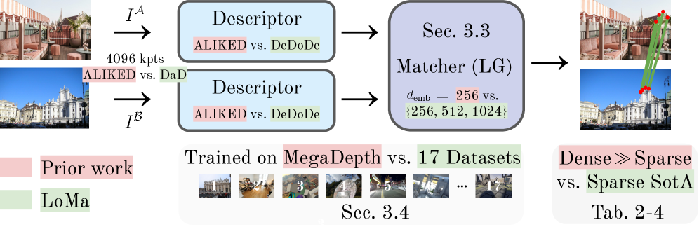
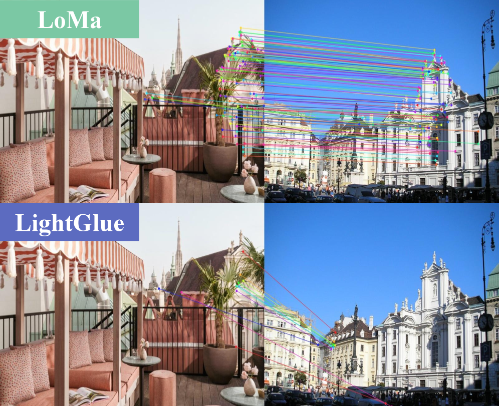
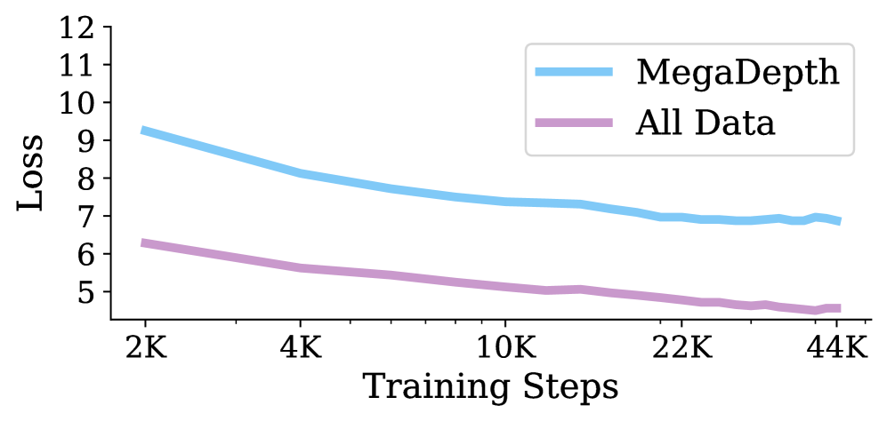
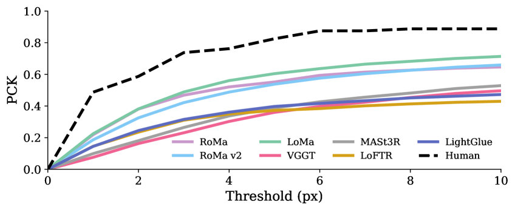
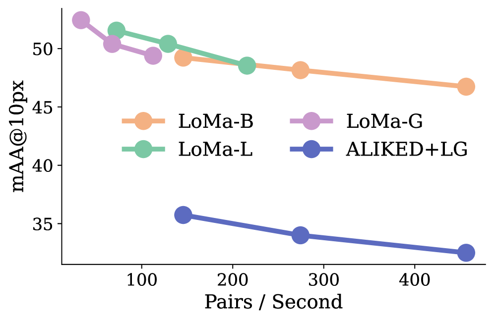

# LoMa：重新审视局部特征匹配

## 结论先行

- **一句话定位**：LoMa 来自 RoMa 作者团队（David Nordström / Johan Edstedt 等 9 人瑞典 CV 团队），是一条 LightGlue 式的**稀疏 / 局部匹配**路线。论点是局部特征匹配的进展落后于其他数据驱动方法，于是通过 **scale up**（更大更多样数据、更大模型、更多算力、现代训练 recipe）大幅提升鲁棒性与精度。
- **核心方法**：不引入新架构噱头，工作方式类似 LightGlue（sparse keypoint matcher）；pipeline 由 **DeDoDe（关键点检测）+ DaD（描述子）+ LightGlue（匹配器）** 三个已有组件组合并统一 scale。matcher 复用 LightGlue 代码。提供多规格权重（B / B128 / L / G / R）。
- **论文证据（相对 SOTA 的 ALIKED+LightGlue，摘要数值，已核实）**：HardMatch +18.6 mAA；WxBS +29.5 mAA；InLoc +21.4 @(1m,10°)；RUBIK +24.2 AUC；IMC 2022 +12.4 mAA。
- **代码状态**：GitHub 已发布推理代码（`model.match()` API）与多规格权重；**训练代码尚未发布**（README checklist 未勾），按约定 `training_open_source: false`；**HardMatch 数据集已于 2026-06-27 独立公开**。
- **工程判断**：可直接用提供权重做推理（集成 HLoc / vismatch，作为 SfM / 定位的 drop-in matcher）；但训练不可复现、许可为 MIT + 继承 LightGlue 的 Apache-2.0 混合。

> 注意：标题、9 位作者、arXiv 2604.04931（提交 2026-04-06，CC BY 4.0）、代码 / 权重状态、五个基准提升数值均已通过 arXiv abstract 页 + 官方 GitHub 交叉确认。ECCV 2026 venue 来自官方 GitHub（称 2026-06-18 接收），arXiv 版本仍标 cs.CV preprint。完整训练数据集清单、消融、org 归属仍需读全文确认（to verify）。



## 1. 这篇论文解决什么问题？

### 已确认的论文事实

- **问题定义**：局部特征匹配作为 SfM / 3D 视觉的基础组件，其进展相比现代数据驱动方法（如 dense matching、foundation model）滞后，鲁棒性 / 精度有明显提升空间。
- **输入 / 输出**：两张图像 → 稀疏关键点检测 + 描述 + 匹配 → 图像坐标系下的对应点对（可直接喂给 RANSAC 估基础矩阵 / 位姿）。
- **目标场景**：SfM / 3D 重建 / 视觉定位 pipeline 的匹配前端，定位为现有 detector+matcher 组合的 drop-in replacement。

### 我的理解 / 待验证

- LoMa 把「RoMa 式的数据 / 模型 scaling 经验」迁移到稀疏匹配路线；核心叙事是「架构不变、规模制胜」。具体训练数据明细需读全文确认。

## 2. 方法：原理与架构

### 2.1 核心思想

LoMa 的立论是：稀疏局部匹配的瓶颈不在架构，而在**数据规模、模型容量、算力与训练 recipe**的滞后。因此它不发明新算子，而是把三个成熟组件拼成端到端 pipeline，并在大规模多样数据混合上统一 scale：

- **检测（Detection）**：DeDoDe 式关键点检测器，负责在两张图上各自采样可重复、可区分的关键点。
- **描述（Description）**：DaD 式描述子，为每个关键点产出高维特征向量。
- **匹配（Matching）**：LightGlue 式图神经网络匹配器，在两组关键点特征间做上下文推理并输出软分配。

这条链路与 RoMa（dense、coarse-to-fine warp）形成对照：LoMa 走稀疏路线，牺牲部分稠密上限换取效率与工程易用性。

### 2.2 匹配器：LightGlue 式软分配

匹配器部分直接复用 LightGlue（代码继承其 Apache-2.0 许可），因此其数学形式与 LightGlue 一致。设图 $A$ 有 $M$ 个关键点、图 $B$ 有 $N$ 个关键点，经若干层 self / cross attention 后得到状态向量 $\mathbf{x}_i^A, \mathbf{x}_j^B$ 。

**相似度得分**由线性投影后的内积给出：

$$S_{ij} = \text{Linear}(\mathbf{x}_i^A)^\top \, \text{Linear}(\mathbf{x}_j^B), \quad i \in A,\ j \in B$$

**可匹配度（matchability）**衡量某关键点在另一图中存在对应的概率：

$$\sigma_i = \text{Sigmoid}\big(\text{Linear}(\mathbf{x}_i)\big) \in [0, 1]$$

**软部分分配矩阵**由双向 softmax 与可匹配度相乘构成，天然处理无对应点（遮挡 / 出画）：

$$P_{ij} = \sigma_i^A \, \sigma_j^B \, \big[\text{Softmax}_k(S_{kj})\big]_i \, \big[\text{Softmax}_k(S_{ik})\big]_j$$

推理时对 $P$ 取行列互为最大且超过阈值 $\tau$ 的元素作为最终匹配。以上三式描述的是被复用的 LightGlue 匹配器；LoMa 未改这套形式，贡献在于喂给它更强的检测 / 描述子特征与更大规模训练（具体温度 / 阈值默认值以官方代码为准，to verify）。

### 2.3 训练与规模化

- **数据规模**：核心卖点是「大而多样的数据混合」。pipeline 图标注在约 17 个数据集上训练；具体清单未在摘要 / README 列出（to verify，需全文附录）。
- **模型容量**：提供 B / B128 / L / G 四档递增容量，B 对标 LightGlue 体量，G 为最大最准；另有旋转不变的 R 档面向 aerial 图像。
- **训练 recipe**：现代化训练（更长 schedule、更大 batch、更强增广），细节需读全文。
- **训练可复现性**：训练代码列为 checklist 待发布项，当前**不可复现训练**。

### 2.4 推理接口

```python
from loma import LoMa
model = LoMa.from_pretrained("LoMa-L")
matches = model.match(img_path_A, img_path_B)   # 返回两图坐标系下的匹配关键点
# 下游：cv2.findFundamentalMat(kptsA, kptsB, cv2.RANSAC)
```

`model.match()` 为单函数 API，已集成到 HLoc 与 vismatch，可作为定位 / SfM pipeline 的 drop-in matcher。

## 3. 关键贡献

1. 重新审视局部特征匹配，论证其进展滞后，并证明「规模化（数据 / 模型 / 算力 / recipe）」而非新架构即可大幅补齐鲁棒性与精度。
2. 组合 DeDoDe + DaD + LightGlue 并统一 scale，提供 B / B128 / L / G / R 五档权重（含旋转不变 LoMa-R，面向 aerial）。
3. 提出 **HardMatch** 困难匹配基准（1000 对互联网困难图像对，人工标注 GT 对应），并已公开。
4. 在 5 个基准上相对强 baseline（ALIKED+LightGlue）显著提升，并在 WxBS 上超越 dense 的 RoMa / RoMa v2。

## 4. 实验与证据

### 4.1 主要结果与基准

| 维度 | 内容 |
|---|---|
| 数据集 | HardMatch（新，1000 困难对）、WxBS、InLoc、RUBIK、IMC 2022；训练集名称未列（to verify） |
| Baseline | ALIKED+LightGlue（主对比 SOTA）；WxBS 上另超越 dense 的 RoMa / RoMa v2 |
| 指标 | mAA、AUC、localization recall @(1m,10°) |
| 主要结果（相对 ALIKED+LightGlue，已核实） | HardMatch **+18.6 mAA**；WxBS **+29.5 mAA**；InLoc **+21.4** @(1m,10°)；RUBIK **+24.2 AUC**；IMC 2022 **+12.4 mAA** |
| vs RoMa | WxBS 上超越 RoMa / RoMa v2（GitHub 示例 mAA_10px≈0.6876；完整对比表逐条数值 to verify） |
| 消融 | 摘要未提供（to verify，需全文） |
| 失败案例 | 摘要未陈述（to verify） |

**HardMatch 困难对与难度分布**：基准由 1000 对互联网困难图像对构成，覆盖大视角 / 光照 / 季节变化等多种难度分组。



**数据规模对验证损失的影响**：从仅用 MegaDepth 扩展到全量数据混合，验证损失显著下降，直接支撑「scale up 数据」这一核心论点。



**HardMatch 精度—像素误差曲线**：在不同像素误差阈值下 LoMa 的精度曲线整体高于 baseline。



**速度—精度 Pareto 前沿**：B / B128 / L / G 四档在推理速度与精度间形成 Pareto 前沿，覆盖从轻量到高精度的不同部署点。



## 5. 局限与风险

### 论文明确承认

- 摘要 / metadata 未陈述明确 limitations（to verify，需全文）。

### 我推断的风险

- 训练数据规模大、算力 scale 是核心卖点 → 自行复现训练成本高。
- 稀疏路线在极端无纹理 / 大视角场景下的召回上限可能不及 dense 的 RoMa v2。

### 工程 / 许可证风险

- **训练代码未开源** → 无法从头复现训练，只能用提供权重做推理。
- 许可为 MIT + 继承 LightGlue 的 Apache-2.0 混合，商用合规需分别核对 matcher 与其余组件。

## 6. 与相似方法对比

| Method | 相同点 | 不同点 | 何时选它 |
|---|---|---|---|
| LightGlue | 同 sparse keypoint matcher 路线，复用其匹配器代码 | LoMa scale up 数据 / 模型并换用更强检测 / 描述子，声称更鲁棒更准；LoMa-B 对标 LightGlue 体量 | 要更强鲁棒匹配看 LoMa，要成熟生态 / 极轻推理选 LightGlue |
| RoMa / RoMa v2 | 同作者研究线 | RoMa 系列是 dense 路线，LoMa 是 sparse；LoMa 在 WxBS 上超越 RoMa / RoMa v2 | 稀疏高效选 LoMa，稠密精度上限选 RoMa v2 |
| GIM | 都靠数据规模提升泛化 | GIM 用互联网视频自训练（架构无关）；LoMa scale 自有数据混合 + 大模型 | 两条提升路线可对照 |

## 7. 复现判断

- Git 地址：<https://github.com/davnords/LoMa>
- 是否开源：是（推理）。
- 是否开源训练：否（训练代码尚未发布）。
- 代码可用性：`model.match()` 推理 API，集成 HLoc / vismatch。
- 权重可用性：LoMa-B / B128 / L / G / R。
- 数据可获得性：HardMatch 已公开（独立仓库）；训练集清单未列。
- 预计环境成本：推理可用提供权重；训练不可复现。
- 最小复现路径：装环境 → 下载 LoMa-B/L 权重 → 跑 `model.match()` sanity check → 接 HLoc 做定位。
- 是否值得复现：推理值得（drop-in matcher）；训练复现当前不可行。

## 8. 后续动作

- [x] 创建单篇论文分析
- [x] 更新 `indices/papers.md`
- [x] 更新 `indices/directions.md`
- [x] 更新 `indices/methods.md`
- [x] 创建 image-matching 横向对比
- [ ] 读取全文 PDF 补全训练数据清单 / 消融 / limitations（to verify 项）
- [x] 建立方法谱系链接前，核对前作 slug（LightGlue / DeDoDe / DaD / RoMa 实际目录路径）
- [ ] 若开始复现，创建 `reproductions/image-matching/loma/README.md`

## Sources

- Paper: <https://arxiv.org/abs/2604.04931>
- PDF: <https://arxiv.org/pdf/2604.04931>
- GitHub: <https://github.com/davnords/LoMa>
