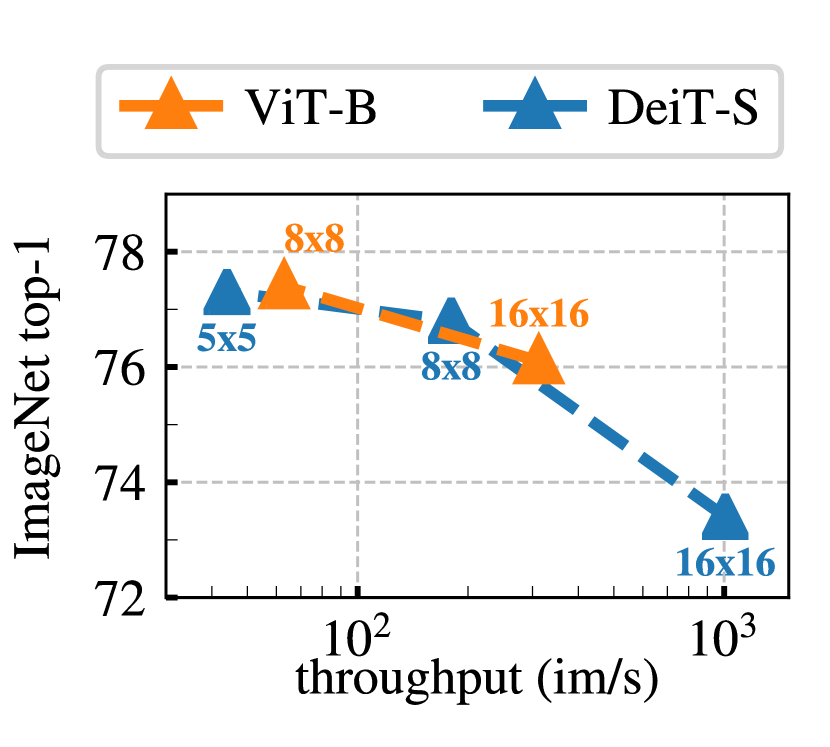

# DINO v1：Emerging Properties in Self-Supervised Vision Transformers

## 结论先行

- **一句话定位**：DINO v1 是“让 ViT 在没有标签时也学出语义对象结构”的发现型工作；它证明 self-supervised ViT 的 patch/attention 会自然对准物体，是后续 dense vision foundation model 的起点。
- **核心方法**：student 学 teacher；teacher 不是人工标注，也不是固定大模型，而是 student 参数的 EMA 移动平均（momentum encoder）；用不同裁剪视角（multi-crop）做 local-to-global 一致性学习。名字 DINO = self-**di**stillation with **no** labels。
- **不塌缩的关键**：仅靠 centering（对 teacher 输出减去动量均值 $c$ ）+ sharpening（teacher 低温 $\tau_t$ ）两个操作协同，就避免了表征塌缩，无需负样本、对比队列或 Sinkhorn 在线聚类。
- **关键发现**：无监督 ViT 最后一层 `[CLS]` 的 self-attention 直接对应物体前景 mask，且这一性质在监督 ViT 上不明显；patch/attention 可直接做无监督分割与视频物体分割。
- **实验信号**：ViT-B/8 linear eval 达 ImageNet top-1 **80.1%**，ViT-S/8 k-NN 达 **78.3%**（论文摘要所指的"small ViT 78.3%"即此配置）；attention 在 DAVIS-2017 视频分割上 $(\mathcal{J}\&\mathcal{F})_m \approx 71.4$ 、不做任何微调。
- **开源状态**：GitHub 仓库公开，Apache-2.0，含 `main_dino.py` 训练、k-NN/linear/video segmentation 评测脚本与预训练权重；训练开源记为“是”。
- **对后续版本的意义**：v1 不是最大最强的 backbone，而是定义了 DINO 家族的“teacher-student 自蒸馏 + EMA + multi-crop + ViT 小 patch + centering/sharpening”范式，直接被 DINOv2/v3 继承并放大。

## 1. 这篇论文解决什么问题？

当时自监督视觉主要由 CNN + contrastive（MoCo/SimCLR）或 clustering（SwAV）方法主导。论文提出一个核心问题：**如果把自监督学习放到 Vision Transformer 上，会不会出现 CNN 或监督 ViT 都不明显的新性质？**

- **问题定义**：无标签地预训练 ViT，并研究其表征相较监督 ViT / 自监督 CNN 是否有质变。
- **输入 / 输出**：输入为无标签图像；输出为可用于分类、检索、分割可视化的 ViT 表征（`[CLS]` 全局向量 + patch 局部向量 + attention map）。
- **训练目标**：不使用人工 label，让同一张图像的不同增强视图在网络自定义的“类别分布”空间里对齐。
- **目标场景**：低标注成本的视觉表征预训练；冻结特征后做 k-NN、linear probing、检索、无监督分割/视频分割。
- **与现有方法的差异**：不引入负样本、memory bank、对比损失，也不做在线聚类；只用一个 EMA teacher 提供 soft target。相较监督 ViT，DINO 的 patch/attention 更容易保留对象边界和局部语义，而非被分类标签压平。

## 2. 方法概览

- **核心想法**：把知识蒸馏“反过来用”——通常蒸馏是小 student 学一个更强的固定 teacher；DINO 让 teacher 由 student 的历史 EMA 构成，两者同架构、边训边共进，用不同视角的输出分布做交叉熵对齐。
- **一句话 pipeline**：同图生成 2 个 global crop + 若干 local crop → student 处理全部 crop、teacher 只处理 global crop → teacher 输出经 centering + sharpening 得 soft target → student 用交叉熵去匹配（stop-gradient 到 teacher）→ teacher 参数用 student 的 EMA 更新。

### 2.1 架构解析

- **整体结构（模块分解）**：两条同构分支 $g_{\theta_s}$ （student）与 $g_{\theta_t}$ （teacher），每条 = ViT/ResNet backbone + projection head。两分支唯一区别是参数：student 由梯度更新，teacher 由 EMA 更新。
- **各模块职责与数据流**：
  - **Backbone**：ViT（patch 16 或 8）或 ResNet，输出 `[CLS]` 表征。评测时只保留 backbone，丢弃 head。
  - **Projection head**：3 层 MLP（隐藏维 2048，GELU）→ 256 维 bottleneck → $\ell_2$ 归一化 → weight-normalized 全连接输出 $K=65536$ 维。head 输出的是一个“原型/伪类别”分布的 logits，不是真实类别。**无 BatchNorm**，使系统对 ViT 完全 BN-free。
  - **Softmax + 温度**：两侧各自 softmax，student 用 $\tau_s=0.1$ ，teacher 用低温 $\tau_t$ （0.04→0.07 warmup），温度差制造 sharpening。
  - **Centering**：teacher softmax 前减去动量维护的均值向量 $c$ ，抑制某一维长期独占。
  - **Stop-gradient（sg）**：梯度只回传 student；teacher 不反传。
  - **EMA**：每步用 student 参数动量更新 teacher。
- **关键设计选择及理由**：
  - **同架构 teacher/student**（非固定大 teacher）：teacher 是 student 的时间平均，类似 Polyak averaging / mean teacher，天然比 student 稍强、提供更稳定的移动目标（见 2.2）。
  - **超大输出维 $K=65536$**：更多“软原型”让分布更细粒度，配合 centering 更难塌缩。
  - **小 patch（/8）**：显著提升 k-NN 与 attention 质量，但吞吐大幅下降（见 4.1）——这是精度/算力的核心权衡。

### 2.2 核心原理

- **为什么这样设计 work**：DINO 本质是“预测网络自己的（平滑后的）输出”。若无约束会塌缩到常数解；DINO 用两个方向相反的力平衡：
  - **centering** 阻止“某一维恒定胜出”（否则输出坍到单一原型），但单独使用会把输出推向均匀分布（熵最大、无信息）；
  - **sharpening**（teacher 低温）把 teacher 分布拉尖锐，防止坍到均匀，但单独使用又会推向单一维度塌缩。
  - 两者相互抵消对方的塌缩方向，联合作用把训练稳定在“既非均匀、也非单点”的有信息区域。论文用熵/KL 曲线（下图）证明了这一互补性。
- **关键机制 / 归纳偏置**：
  - **momentum teacher 是隐式的 model ensembling**：EMA 相当于对 student 轨迹上多个模型做平均，teacher 在训练全程 top-1 稳定高于 student，起“持续更好的目标”作用，形成良性引导循环。
  - **local-to-global 一致性**：student 看 96² 的局部小图也要预测出 teacher 看 224² 全局图的分布，逼模型把“局部纹理”归因到“整体物体/语义”，这正是 attention 涌现物体结构的直接原因。
- **与前作的本质区别**：BYOL 也用 EMA teacher 但回归的是特征向量（predictor + MSE）；DINO 回归的是**类别分布**（softmax + 交叉熵），且用 centering/sharpening 而非 predictor + BN 来防塌缩。SwAV 用 Sinkhorn 在线聚类分配 code，DINO 去掉了聚类步骤，直接把 teacher softmax 当 soft label，更简单。

### 2.3 关键公式解析

**公式 (1)：student 输出分布（softmax with temperature）**

$$ P_s(x)^{(i)} = \frac{\exp\!\big(g_{\theta_s}(x)^{(i)} / \tau_s\big)}{\sum_{k=1}^{K} \exp\!\big(g_{\theta_s}(x)^{(k)} / \tau_s\big)} $$

- 符号： $g_{\theta_s}(x)$ 是 student head 输出的 $K$ 维 logits； $\tau_s>0$ 是 student 温度（0.1）； $K=65536$ 是原型维数；上标 $(i)$ 取第 $i$ 维。
- 作用：把 logits 变成 $K$ 类概率分布。teacher 分布 $P_t$ 形式相同但用 $\tau_t$ （更低），温度更低 → 分布更尖锐（sharpening）。

**公式 (2)：DINO 交叉熵损失（over multi-crop 视图对）**

设 global crop 集合 $\{x_1^g, x_2^g\}$ ，全部视图集合 $V$ （global + local），损失为

$$ \min_{\theta_s} \sum_{x \in \{x_1^g,\, x_2^g\}} \; \sum_{\substack{x' \in V \\ x' \neq x}} H\big(P_t(x),\, P_s(x')\big), \qquad H(a,b) = -\,a \log b $$

- 符号： $H(a,b)$ 是交叉熵； $P_t(x)$ 是 teacher 在 global 视图 $x$ 上的目标分布（stop-gradient）； $P_s(x')$ 是 student 在其他任意视图 $x'$ 上的分布。
- 作用：teacher 只吃 global 视图产生目标，student 要用**所有**视图去匹配它，实现 local-to-global 对齐。实现上（2 global crop）即 $\tfrac{1}{2}H(P_t(x_1^g),P_s(x_2^g)) + \tfrac{1}{2}H(P_t(x_2^g),P_s(x_1^g))$ 再加上 local crop 对 global teacher 的项。

**公式 (3)：teacher 的 EMA / momentum 更新**

$$ \theta_t \leftarrow \lambda\, \theta_t + (1-\lambda)\, \theta_s $$

- 符号： $\theta_t$ / $\theta_s$ 为 teacher / student 参数； $\lambda$ 为动量系数，按 cosine schedule 从 0.996 升到 1.0。
- 作用：teacher 是 student 参数的指数移动平均，提供平滑、缓变、且略强于 student 的目标；训练后期 $\lambda\to1$ 让 teacher 几乎冻结、更稳。

**公式 (4)：centering 的均值更新**

$$ c \leftarrow m\, c + (1-m)\,\frac{1}{B}\sum_{i=1}^{B} g_{\theta_t}(x_i) $$

teacher softmax 前做 $g_{\theta_t}(x) \leftarrow g_{\theta_t}(x) - c$ 。

- 符号： $c$ 是 $K$ 维中心向量； $m$ 是 centering 动量（默认 0.9）； $B$ 是 batch size； $g_{\theta_t}(x_i)$ 是 teacher 对第 $i$ 个样本的 logits。
- 作用： $c$ 追踪 teacher 输出的 batch 均值并从 logits 中减去，抑制某一维长期独占（防单点塌缩）。centering 只依赖一阶统计量，计算极廉价，仅需一个 EMA 向量。

### 2.4 训练与推理细节

- **训练目标 / 损失函数**：上述多视图交叉熵（公式 2）；teacher 侧 stop-gradient，只优化 student；teacher 用 EMA、centering 更新，均不参与反传。
- **训练数据与规模、超参要点**：
  - 数据：ImageNet-1k（无标签），标准 ImageNet 自监督设置。
  - Multi-crop：2 个 global crop（224²，RandomResizedCrop scale (0.3, 1.0)）+ 6 个 local crop（96²，scale (0.05, 0.3)）。
  - Head： 3 层 MLP（hidden 2048）→ 256 维 $\ell_2$ bottleneck → weight-norm FC，输出 $K=65536$ 。
  - 温度：student $\tau_s=0.1$ ；teacher $\tau_t$ 从 0.04 warmup 到 0.07（前 30 epoch 线性）。
  - EMA： $\lambda$ 0.996→1.0 cosine。
  - 优化器：AdamW，batch 1024，lr 线性 warmup 后 cosine decay，weight decay cosine 调度；ViT-S/16 100 epoch 官方约 8×V100 1.75 天。
  - BN-free：ViT 版本全程不使用 BatchNorm。
- **推理流程与关键步骤**：预训练后**丢弃 projection head**，只用 backbone 的 `[CLS]`（分类/检索/k-NN）或 patch token + attention（分割/定位）。k-NN 评测直接用冻结特征做最近邻，无需训练；linear eval 冻结 backbone 只训一个线性层；无监督分割直接阈值化最后一层 `[CLS]` 的 self-attention。

## 3. 关键贡献

1. **证明自监督 ViT 会涌现对象语义**：无监督 ViT 最后一层 `[CLS]` attention 自动聚焦物体前景，可直接阈值化成分割 mask；该性质在监督 ViT 上明显更弱。
2. **提出极简 no-label self-distillation recipe**：不依赖负样本、memory bank、对比损失或 Sinkhorn 聚类，仅用 EMA teacher + centering + sharpening 即稳定不塌缩。
3. **揭示 k-NN 特征质量**：冻结特征 + 最近邻分类即达强性能，说明表征本身已高度语义化，是自监督质量的直接信号。
4. **确定 DINO 家族基本配方**：teacher-student、EMA momentum、multi-crop（local-to-global）、centering/sharpening、ViT 小 patch，被 DINOv2/v3 继承放大。

## 4. 实验与证据

| 维度 | 内容 |
|---|---|
| 数据集 | ImageNet-1k 预训练/评测；Copydays/Oxford/Paris 检索；DAVIS-2017 视频分割；PASCAL VOC 分割可视化 |
| Baseline | MoCo v2、BYOL、SwAV、SimCLR，及 supervised ViT / ResNet |
| 指标 | ImageNet k-NN / linear top-1，检索 mAP，视频分割 $\mathcal{J}\&\mathcal{F}$ |
| 主要结果 | ViT-B/8 linear **80.1**；ViT-B/8 k-NN 77.4；ViT-S/8 k-NN 78.3 / linear 79.7；ViT-S/16 k-NN 74.5 / linear 77.0；ResNet-50 k-NN 67.5 / linear 75.3 |
| 消融 | momentum teacher、multi-crop、小 patch、centering+sharpening 组合对稳定性与性能均关键 |
| 失败案例 | 非面向大规模通用 backbone 的完整系统；数据/模型规模与 dense benchmark 覆盖有限 |

DINO 在 ImageNet 上的冻结特征评测（论文 Table）：

| 模型 | k-NN top-1 | Linear top-1 |
|---|---|---|
| ResNet-50 | 67.5 | 75.3 |
| ViT-S/16 | 74.5 | 77.0 |
| ViT-S/8 | 78.3 | 79.7 |
| ViT-B/16 | 76.1 | 78.2 |
| ViT-B/8 | 77.4 | **80.1** |

下游零微调应用：DAVIS-2017 视频物体分割 ViT-B/8 $(\mathcal{J}\&\mathcal{F})_m \approx 71.4$ （ $\mathcal{J}_m \approx 67.9$ ， $\mathcal{F}_m \approx 74.9$ ）；Copydays（strong）复制检测 ViT-B/8 mAP ≈ 85.5。

### 4.1 效果与性能解析

- **主要结果解读（不只搬数字）**：DINO 最强的信号不是 linear eval 的 80.1，而是 **k-NN 与 linear 的差距被大幅缩小**（ViT-B/8：77.4 vs 80.1）。这说明表征在原始特征空间就已线性可分/语义聚类良好，无需额外线性层去“救”。相比之下 contrastive 方法 k-NN 通常明显低于 linear。attention 能直接做分割则是“语义已定位到像素级”的定性证据。
- **性能与效率（速度、显存、参数量、可扩展性）**：patch size 是核心权衡——/8 相比 /16 大幅提升 k-NN 与 attention 质量，但序列长度约 4×、吞吐骤降、显存陡增（下图给出 k-NN vs throughput 的帕累托关系）。ViT-S/16 ≈ 21M 参数、ViT-B/16 ≈ 85M。训练成本相对现代自监督（DINOv2 1B+ 图）低，但 multi-crop（8 视图）本身使单步计算量显著高于单视图方法。

- **消融揭示的关键因素**：（1）去掉 momentum teacher（改用同参数或前一 batch）训练不稳定甚至塌缩；（2）去掉 sharpening 或 centering 任一都会塌缩，二者必须同时在场；（3）multi-crop 贡献显著，local crop 数量增加持续提升；（4）小 patch 提升明显但代价是速度。
- **与 SOTA / baseline 的可比性**：论文在同一冻结评测协议（k-NN、linear）下与 MoCo/BYOL/SwAV 直接对比，backbone、epoch、augmentation 设置尽量对齐，可比性较好；跨架构（ResNet vs ViT）对比时需注意参数量与 FLOPs 不完全一致。

无监督 `[CLS]` self-attention 直接显现物体前景（不同 head 关注不同部件）：

## 5. 局限与风险

- **论文明确承认 / 可见限制**：主要在 ImageNet-1k 规模验证；非面向任意域的通用视觉基础模型；dense 任务多为“涌现性质”定性展示，而非完整工程产品。
- **我推断的风险**：旧代码依赖 PyTorch 1.7.1 / CUDA 11.0 等历史环境，复现需处理环境漂移；相较 DINOv2/v3，直接作为生产 backbone 的收益有限。small patch 的高分辨率训练显存/吞吐压力大。
- **工程落地风险**：训练成本相对现代模型低，但 multi-crop + 8 GPU 起步仍非轻量；评测脚本较研究原型化。
- **许可证 / 数据风险**：代码 Apache-2.0；ImageNet 等数据需自行满足许可与合规。

## 方法谱系

- 基于：Vision Transformer（ViT）backbone；思想上承 mean teacher / BYOL 的 EMA teacher 与 SwAV 的 multi-crop。
- 被后续取代/放大：[DINOv2](../vision-foundation-models/2023-dinov2.md)（curated data + iBOT + KoLeo，做成通用 frozen backbone）、[DINOv3](../vision-foundation-models/2025-dinov3.md)（解决大规模长训 dense feature 退化，扩到 7B）。

## 6. 与相似方法对比

| Method | 相同点 | 不同点 | 何时选它 |
|---|---|---|---|
| BYOL | 都用 EMA teacher、无负样本 | BYOL 回归特征向量（predictor+MSE），DINO 回归类别分布（softmax+CE）并用 centering/sharpening 防塌缩 | 想理解 EMA teacher 的特征回归变体时对照 |
| SwAV | 都用 multi-crop、原型味道 | SwAV 用 Sinkhorn 在线聚类分配 code，DINO 直接把 teacher softmax 当 soft label，更简 | 想比较 clustering vs distillation 时对照 |
| MoCo v2 | 都是自监督表征 | MoCo 用负样本+memory bank+对比损失，DINO 完全无负样本 | 需要经典 contrastive 基线时对照 |
| DINOv2 | 同属 DINO 家族 | DINOv2 = curated data + 大模型 + DINO/iBOT/KoLeo | 需要通用 frozen backbone 时选 DINOv2 |
| DINOv3 | 都重视 ViT dense features | DINOv3 解决长训 dense 退化，扩到 7B/卫星/ConvNeXt | 需要更强 dense 特征与高分辨率任务时选 DINOv3 |

## 7. 复现判断

- Git 地址：<https://github.com/facebookresearch/dino>
- 是否开源：是，Apache-2.0。
- 是否开源训练：是。仓库含 `main_dino.py`、multi-node `run_with_submitit.py`、训练命令、预训练权重与日志。
- 代码可用性：研究代码完整；环境较旧（PyTorch 1.7.1 / CUDA 11.0）。
- 权重可用性：提供 ViT-S/ViT-B/ResNet/XCiT 等 backbone / full checkpoint / ONNX / logs。
- 数据可获得性：主要依赖 ImageNet；需自行准备。
- 预计环境成本：README 示例 ViT-S 单机 8 GPU 100 epoch 约 1.75 天；加强设置 16 GPU 约 2.6 天。
- 最小复现路径：先用官方权重跑 `eval_knn.py` 和 `eval_linear.py` 对齐数字；再用小 epoch 或 ImageNet 子集验证训练 loss 不塌缩（观察熵曲线）。
- 是否值得复现：值得作为自监督 ViT 入门与 DINO 家族机制验证；若目标是生产 backbone，优先 DINOv2/v3。

## 8. 后续动作

- [x] 更新 `indices/papers.md`
- [x] 更新 `indices/directions.md`
- [x] 更新 `indices/methods.md`
- [x] 创建/更新 `comparisons/vision-foundation-models/dino-family.md`
- [ ] 若要复现实验，创建 `reproductions/vision-foundation-models/dino/README.md`

## Sources

- Paper: <https://arxiv.org/abs/2104.14294>
- PDF: <https://arxiv.org/pdf/2104.14294>
- ar5iv 全文（图与公式）: <https://ar5iv.labs.arxiv.org/html/2104.14294>
- Hugging Face paper metadata: <https://huggingface.co/papers/2104.14294>
- GitHub: <https://github.com/facebookresearch/dino>
