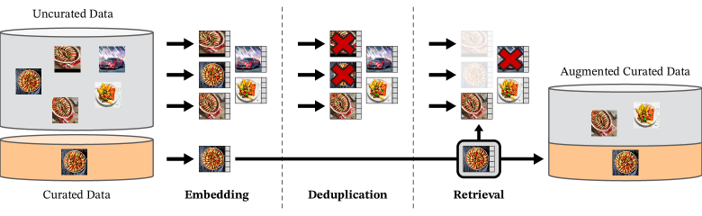
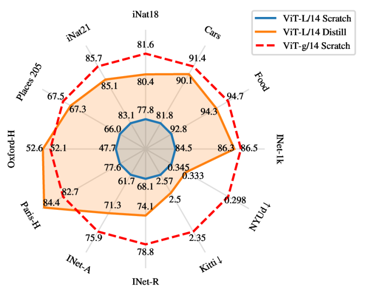
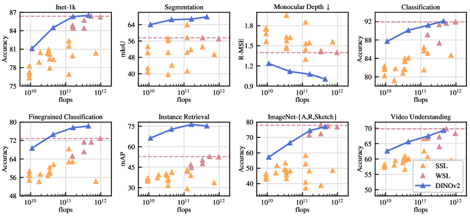

# DINOv2：Learning Robust Visual Features without Supervision

## 结论先行

- **一句话定位**：DINOv2 把 DINO v1 的“有趣发现”升级成“可直接拿来做下游任务的通用视觉 backbone”——frozen features 不微调即可在分类、分割、深度、检索上打过当时的弱监督特征。
- **核心问题**：怎样不用人工标签，训练出 across-domain、image-level + pixel-level 都强的视觉特征？论文给出的答案不是只堆模型，而是三件事协同：**更干净的大数据（LVD-142M）+ 更稳定的训练 recipe（DINO+iBOT+KoLeo+SK centering）+ 大 teacher 蒸馏小模型**。
- **关键方法**：从 uncurated pool 用检索 pipeline 造出 LVD-142M；训练 ViT-g/14 大 teacher；组合 DINO global loss、iBOT patch-level masked objective、KoLeo regularizer、Sinkhorn-Knopp centering，配 FSDP/高效 attention 工程优化；再蒸馏到 ViT-S/B/L。
- **本质洞察**：自监督视觉表征的瓶颈不在算法而在**数据质量与训练稳定性**。「多且干净、覆盖均衡」的数据比「更多的原始数据」更重要——这是全篇最可迁移的经验。
- **开源状态**：GitHub 公开，Apache-2.0，含训练/评测代码、configs、预训练 backbones/heads；训练代码开源，但 LVD-142M 完整训练集本身不是可直接下载复刻的数据包。
- **与 v1/v3 的关系**：v1 证明自监督 ViT 有语义涌现；v2 证明扩数据/模型可变成通用 backbone；v3 进一步用 Gram anchoring 解决大规模训练时 dense feature 退化并扩到更强 dense tasks。

## 1. 这篇论文解决什么问题？

- **问题定义**：把自监督视觉表征从「研究现象」推进到「可复用的基础模型」。要成为 foundation backbone，特征必须跨数据分布稳定、跨任务泛化、可冻结直接用、且能覆盖多个部署尺寸。
- **输入 / 输出**：输入是无标签图像；输出是一个预训练 ViT，其 `[CLS]` token 给 image-level 特征、patch tokens 给 dense 特征，两者都可 frozen 后接线性头/kNN 用于下游。
- **目标场景**：ImageNet 级分类、ADE20K 分割、NYUv2/KITTI 深度、instance retrieval、OOD/domain generalization，以及作为其他系统（检测、3D、多模态）的视觉主干。
- **与现有方法的差异**：
  - **vs DINO v1**：v1 只在 ImageNet 上验证语义涌现；v2 把规模、patch objective、数据 curation 和蒸馏生态补齐，目标是「通用可部署」。
  - **vs CLIP / 弱监督**：CLIP 靠图文对弱监督拿 zero-shot 语义；DINOv2 纯视觉自监督，不依赖文本标注，dense/patch 特征往往更强。
  - **vs MAE / 单一 MIM**：DINOv2 不是单一重建目标，而是判别式自蒸馏（DINO/iBOT）为主，特征直接线性可分而非需要微调才能用。

DINOv2 要同时回答三个可规模化问题：**如何让视觉自监督像 NLP 预训练一样可扩展？如何让一个 backbone 同时适合全局和像素级任务？如何把很大的 teacher 压缩成社区可用的小模型？**

## 2. 方法概览

- **核心想法**：判别式自蒸馏（无标签下让 student 匹配 teacher 的软分配）+ 数据 curation + 蒸馏，三者叠加把「涌现语义」变成「稳定通用特征」。
- **一句话 pipeline**：`uncurated 图池 → embedding + 去重 + 检索造 LVD-142M → 用 DINO+iBOT+KoLeo+SK 训练 ViT-g/14 teacher（EMA 更新）→ 蒸馏到 ViT-S/B/L`。

### 2.1 架构解析

DINOv2 的「架构」实际上分两层：**数据侧的 curation pipeline** 和 **模型侧的 self-distillation 训练结构**。

**（A）数据 curation pipeline（上图）**——三段流水：

1. **Embedding**：用一个在 ImageNet-22k 上自监督预训练的 ViT-H/16 给所有图像（curated seed ~14M + uncurated web crawl ~1.2B）抽特征向量。
2. **Deduplication**：用 copy-detection pipeline（Pizzi et al.）去掉近重复图，并剔除与下游 test set 重叠的图，避免评测泄漏。
3. **Retrieval**：对 uncurated 数据做 k-means 聚类；以 curated 图为 query，用 cosine 相似度检索最近邻（NN=4）或从对应簇采样 M 张。这样既扩了量，又保持概念覆盖均衡，最终得到 **LVD-142M**。整套流程约在 20 节点（8×V100-32GB）集群上 <2 天跑完。

**（B）模型侧训练结构**——teacher–student 双分支：

- **Backbone**：ViT-g/14（patch size 14），最大 teacher 约 1.1B 参数。
- **两条分支**：student 和 teacher 结构相同；**teacher 不反传梯度，由 student 权重的 EMA（指数滑动平均）更新**（momentum 0.994）。
- **两组 heads**：一个 DINO head 吃 `[CLS]` token 出 image-level 分配，一个 iBOT head 吃 patch tokens 出 patch-level 分配（prototypes 128k）。
- **数据流**：一张图裁出多个 global crops + local crops（multi-crop）；student 看所有 crop（含被 mask 的 patch），teacher 只看 global crops；两分支各自过 head 出概率分布，用交叉熵对齐。

**关键设计选择及理由**：
- **判别式软分配而非重建**：让特征天然线性可分，frozen 直接可用，省去下游微调。
- **image-level + patch-level 两个目标并存**：`[CLS]` 学全局语义支撑分类/检索，patch tokens 学局部语义支撑分割/深度——这是 v2 能同时强于 image 与 dense 任务的结构性原因。
- **EMA teacher**：提供一个比 student 更平滑、更稳定的目标，避免自蒸馏塌缩。

### 2.2 核心原理

**为什么这样设计 work？**

- **自蒸馏 + EMA teacher = 无标签下的稳定监督信号**。没有标签时，teacher 的软分配充当「伪标签」。EMA 让 teacher 演化慢于 student，相当于一个持续变强但不抖动的目标，student 追它既不塌缩也能持续进步。
- **multi-crop 强制 local-to-global 一致**：student 用一个局部小 crop 去匹配 teacher 从 global crop 得到的分配，等于逼模型「从局部推断整体语义」，这正是语义特征涌现的来源。
- **数据 curation 决定上限**：论文最重要的实证是——**raw uncurated 数据训出来的特征反而更差**。重复、长尾、分布偏差会让自监督目标被高频冗余样本主导。检索式 curation 让概念分布更均衡，特征才稳。

**关键机制 / 归纳偏置**：
- **判别式（对比/聚类式）而非生成式**：偏好「可区分类别」的表征，天然利好线性分类与 kNN。
- **patch-level MIM（iBOT）注入局部结构偏置**：让相邻/同物 patch 的表示相互一致，支撑 dense 任务。
- **KoLeo 注入「特征均匀铺开」偏置**：见 2.3，防止 batch 内特征挤成一团，利好检索与最近邻。

**与前作在原理上的本质区别**：
- **vs DINO v1**：v1 = 单纯 image-level 自蒸馏；v2 = 加 iBOT patch 目标 + KoLeo + SK centering + 大规模 curated 数据 + 蒸馏。v1 是「证明现象」，v2 是「把现象工程化成通用能力」。
- **vs MAE**：MAE 重建像素，特征偏底层、需微调才好用；DINOv2 判别式软分配，frozen 直接线性可分。
- **vs CLIP**：CLIP 的语义来自文本弱监督；DINOv2 的语义来自「局部 vs 全局」自一致，无需任何文本，因此 dense/patch 一致性更好。

### 2.3 关键公式解析

> DINOv2 的目标沿用 DINO/iBOT，论文正文以引用形式给出，未逐一重列严格推导；下列公式为标准形式化表述，符号与论文一致。

**公式 (1) DINO image-level 自蒸馏损失：**

$$ \mathcal{L}_{\text{DINO}} = -\sum_{k} p_t^{(k)} \log p_s^{(k)} $$

- 符号： $p\_s$ 是 student 对某个 crop 的 `[CLS]` token 经 head + softmax 得到的分布， $p\_t$ 是 teacher 对 global crop 的对应分布， $k$ 遍历 prototype 维度（128k）。
- 作用：让 student 从任意（含 local）crop 预测出 teacher 从 global crop 得到的软分配，学到 local-to-global 一致的全局语义。

**公式 (2) iBOT patch-level masked 损失：**

$$ \mathcal{L}_{\text{iBOT}} = -\sum_{i \in \mathcal{M}} p_{t,i}^{(k)} \log p_{s,i}^{(k)} $$

- 符号： $i$ 遍历被 mask 的 patch 位置集合 $\mathcal{M}$ ； $p\_{s,i}$ 是 student 在被遮 patch $i$ 上的预测分布， $p\_{t,i}$ 是 teacher 在**未遮**的同位置 patch 上的分布。
- 作用：给定可见上下文预测被遮 patch 的语义分配（判别式 MIM），把局部结构信息写进 patch tokens，是 dense 任务变强的直接来源。

**公式 (3) KoLeo（Kozachenko-Leonenko）正则：**

$$ \mathcal{L}_{\text{koleo}} = -\frac{1}{n}\sum_{i=1}^{n}\log\left(d_{n,i}\right), \qquad d_{n,i} = \min_{j \neq i}\ \lVert x_i - x_j \rVert $$

- 符号： $n$ 是 batch 内样本数， $x\_i$ 是 L2 归一化后的特征， $d\_{n,i}$ 是样本 $i$ 到 batch 内最近邻的距离。
- 作用：最大化「最近邻距离的对数」等价于鼓励特征在单位球面上**均匀铺开**，避免表示塌缩挤团，显著提升 instance retrieval 和最近邻类任务。这是 v2 相对 v1 的一个新增稳定项。

**公式 (4) Sinkhorn-Knopp centering（teacher 输出均衡）：**

teacher 分配 $Q$ 通过对相似度矩阵做行/列交替归一化（3 次迭代）逼近双随机矩阵：

$$ Q \leftarrow \operatorname{diag}(u)\, \exp\!\left(\tfrac{C}{\varepsilon}\right)\operatorname{diag}(v), \quad \text{s.t. } Q\mathbf{1}=\tfrac{1}{n}\mathbf{1},\ Q^{\top}\mathbf{1}=\tfrac{1}{K}\mathbf{1} $$

- 符号： $C$ 是 teacher logits， $\varepsilon$ 是温度， $u,v$ 是 Sinkhorn 迭代得到的缩放向量， $K$ 是 prototype 数。
- 作用：替代 DINO v1 的简单 centering + softmax，强制 teacher 的软分配在 batch 内跨 prototype **均衡**，防止所有样本塌到少数 prototype。规模化训练时比简单 centering 更稳。

### 2.4 训练与推理细节

**训练目标 / 损失**：总损失为 DINO + iBOT + KoLeo 加权和；teacher 由 student EMA 更新（momentum 0.994），teacher 侧用 SK centering 而非反传。

**训练数据与规模**：LVD-142M（142M curated images，从约 1.2B uncurated web 图检索得到）。

**超参要点（ViT-g/14 主训）**：
- batch size 3072；patch size 14；prototypes 128k；stochastic depth 40%。
- 优化器 AdamW，model / optimizer moments 用 float32；FSDP 混合精度（float16 广播 + float32 存储）。
- 分辨率两段式：主训 224×224，末段约 1 万步升到 518×518 做高分辨率适配（提升 dense 任务）。
- 工程优化：FSDP 分布式 + 高效 attention（FlashAttention/xFormers 类），使大 teacher 训练可行。

**蒸馏细节**：小模型（ViT-S/B/L）**不从头训**，而是从 ViT-g/14 teacher 蒸馏——沿用同一训练 loop，但 teacher 固定、以 student EMA 作为最终模型、去掉 masking 与 stochastic depth、iBOT loss 只作用在 global crops。论文报告蒸馏模型在所有测试 benchmark 上都优于同尺寸从头训练（见下图）。

**推理流程**：加载 backbone → forward 一张图 → 取 `[CLS]`（image-level）或 patch tokens（dense）→ frozen 特征直接接 kNN / linear head / 分割深度线性头。无需微调即可评测，是「foundation backbone」用法的核心卖点。

## 3. 关键贡献

1. **建立无监督通用视觉 backbone 的实证路径**：大规模 curated data + SSL 可以逼近/超过当时最好的弱监督视觉特征，且 frozen 直接可用。
2. **组合并工程化自监督训练 recipe**：DINO + iBOT + KoLeo + Sinkhorn-Knopp + FSDP/高效 attention，让 ViT-g 级自监督训练稳定可行。
3. **检索式数据 curation 方法论**：embedding→dedup→retrieval 的自动 pipeline，证明「干净均衡」比「原始更多」更重要。
4. **模型蒸馏生态**：从 ViT-g teacher 蒸馏出 ViT-S/B/L/g 多尺寸模型，兼顾算力预算，且蒸馏优于从头训练。
5. **跨任务 frozen feature 评测**：不止 ImageNet，覆盖分类、分割、深度、检索、视频理解、OOD generalization 的系统评估。

## 4. 实验与证据

| 维度 | 内容 |
|---|---|
| 数据集 | LVD-142M curated dataset；ImageNet/ImageNet-22k 对照；ADE20K、NYUv2、Oxford-M 等下游 |
| Baseline | OpenCLIP、supervised/weakly-supervised features、iBOT、MAE 等 |
| 指标 | ImageNet linear/top-1、ADE20K mIoU、NYUv2 RMSE、retrieval mAP 等 |
| 主要结果 | DINOv2 frozen features 在多数 image/pixel benchmarks 上超过当时最佳 all-purpose features；ViT-g teacher 与蒸馏模型均强 |
| 消融 | curated LVD-142M 优于 uncurated/raw 或 ImageNet-22k；KoLeo、iBOT、distillation、高分辨率适配各有贡献 |
| 失败案例 | 精确复刻 LVD-142M 不现实；训练大 teacher 需大规模 A100 集群 |

### 4.1 效果与性能解析

**主要结果解读**（上图，横轴 FLOPs、纵轴各任务指标）：
- 蓝线（DINOv2）在 **8 个任务中几乎条条领跑其他 SSL（橙）**，并在 segmentation、depth、instance retrieval 这类 dense 任务上明显甩开弱监督（WSL，粉红），验证「patch/dense 特征更强」的判断。
- 在 ImageNet 分类上 DINOv2 追平甚至超过弱监督基线——这是纯视觉自监督第一次在通用分类上不落下风，说明瓶颈确实主要在数据质量而非监督信号来源。
- 蒸馏雷达图（2.4）显示 **ViT-L Distill（橙）几乎处处包住 ViT-L Scratch（蓝）**、逼近 ViT-g teacher（红虚线），说明蒸馏比同尺寸从头训练更划算。

**性能与效率**：
- 参数量：ViT-g/14 约 1.1B（teacher，embedding dim 1536、24 heads）；蒸馏出 ViT-S(~21M)/B(~86M)/L(~300M) 供不同算力选用。
- 训练成本（README）：fast setup 4×A100-80GB 节点（32 GPU）约 1 天；long setup 12 节点（96 GPU）约 3.3 天。数据 curation 另需约 20 节点 <2 天。
- 高分辨率适配（末段 518×518 约 1 万步）以较小额外成本换取 dense 任务提升，是性价比高的工程细节。

**消融揭示的关键因素**：
- **数据 curation 是第一因素**：LVD-142M > uncurated raw / ImageNet-22k，直接决定特征质量上限。
- **KoLeo** 明显提升检索与最近邻类任务（特征均匀性）。
- **iBOT patch 目标** 是 dense 任务（分割/深度）强的关键。
- **蒸馏** 让小模型超过同尺寸从头训练。

**可比性与协议一致性**：核心评测用 **frozen features + 线性/kNN 探针**，避免下游微调掩盖表征差异，协议对各方法一致，横向可比性较好；但与弱监督（CLIP）比 zero-shot 时任务定义不同，需注意不是同一评测口径。

## 5. 局限与风险

- **论文明确承认**：核心数据集 LVD-142M 的构建方法公开，但完整训练数据不是可直接下载复刻的数据包；大 teacher 训练资源很高。
- **我推断的风险**：若目标域与 LVD-142M 差异很大（医学、遥感、工业缺陷），frozen 直接用可能不如领域自监督/少量微调；纯视觉特征缺文本 zero-shot 能力。
- **工程落地风险**：官方训练示例依赖多节点 A100 与 Linux/xFormers 等环境，完整训练非普通实验室可轻松复现；大规模 SSL 训练稳定性对超参敏感。
- **许可证 / 数据风险**：代码 Apache-2.0；扩展分支/register variants 可能有额外模型许可；下游商用前需逐项确认，且需留意训练数据来源合规。

## 方法谱系

- 基于：[DINO v1](../vision-foundation-models/2021-dino.md)（teacher–student 自蒸馏框架）
- 被取代/演进：[DINOv3](../vision-foundation-models/2025-dinov3.md)（Gram anchoring 解决 dense 退化、扩到 ViT-7B/LVD-1689M）
- 组件来源：iBOT（patch-level MIM 目标，作为配方组件之一并入）

## 6. 与相似方法对比

| Method | 相同点 | 不同点 | 何时选它 |
|---|---|---|---|
| DINO v1 | 同为 teacher-student 自蒸馏 | v2 加大规模 curated 数据、iBOT patch 目标、KoLeo、SK centering、蒸馏生态 | 做机制教学选 v1；做通用 backbone 选 v2 |
| iBOT | 都用 masked patch-level 自监督 | DINOv2 把 iBOT 当配方组件之一，而非单一方法 | 研究 patch-level MIM 对 dense features 的作用时对照 |
| MAE | 都做自监督预训练 | MAE 重建像素、需微调；DINOv2 判别式、frozen 直接线性可分 | 需要生成式/重建式特征或轻监督微调选 MAE；要 frozen 通用特征选 DINOv2 |
| OpenCLIP | 都可做通用视觉特征 | CLIP 图文弱监督、强 zero-shot；DINOv2 纯视觉、dense/patch 更强 | 需文本 zero-shot 用 CLIP；需 dense frozen features 用 DINOv2 |
| DINOv3 | 同为 DINO family scaled backbone | v3 用 ViT-7B/LVD-1689M + Gram anchoring 解决 dense degradation | 需要更高 dense 上限/高分辨率/遥感分支时选 v3 |

## 7. 复现判断

- Git 地址：<https://github.com/facebookresearch/dinov2>
- 是否开源：是，Apache-2.0。
- 是否开源训练：是。仓库含 `dinov2/train`、`dinov2/run/train/train.py`、训练 configs、评测代码与训练命令。
- 代码可用性：训练/评测/加载较完整，现代 PyTorch 2.0 栈。
- 权重可用性：提供 ViT-S/B/L/g 及 register variants、分类/深度/分割 heads 等。
- 数据可获得性：ImageNet/ImageNet-22k 复现路径可行；LVD-142M 完整数据不可直接复刻。
- 预计环境成本：fast setup 4×A100-80GB 节点（32 GPU）约 1 天；long setup 12 节点（96 GPU）约 3.3 天。
- 最小复现路径：先 `torch.hub`/Transformers 加载官方权重抽特征；再跑 k-NN/linear 或 ADE20K/NYUv2 线性头；训练复现建议从 ImageNet-1k/22k short config 起步。
- 是否值得复现：非常值得作为视觉 foundation backbone baseline；完整大规模训练不建议从零复现，除非目标是研究 SSL scaling recipe。

## 8. 后续动作

- [x] 更新 `indices/papers.md`
- [x] 更新 `indices/directions.md`
- [x] 更新 `indices/methods.md`
- [x] 创建/更新 `comparisons/vision-foundation-models/dino-family.md`
- [ ] 若要复现实验，创建 `reproductions/vision-foundation-models/dinov2/README.md`

## Sources

- Paper: <https://arxiv.org/abs/2304.07193>
- PDF: <https://arxiv.org/pdf/2304.07193>
- HTML: <https://arxiv.org/html/2304.07193>
- Hugging Face paper metadata: <https://huggingface.co/papers/2304.07193>
- GitHub: <https://github.com/facebookresearch/dinov2>
