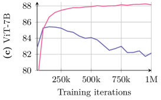
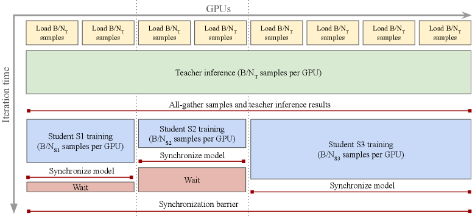
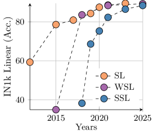
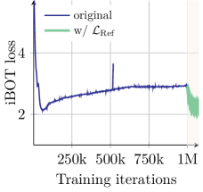

# DINOv3

## 结论先行

- **一句话定位**：DINOv3 是 DINO 家族从"通用 frozen backbone"走向"更大规模、更强 dense features、更高分辨率和多部署形态"的版本，核心贡献是识别并修复了长训练下的 dense feature 退化。
- **核心问题**：DINOv2 继续扩大模型和训练步数时，`[CLS]`/全局分类表征会继续变强，但 patch-level dense features 反而退化（分割、深度、tracking、correspondence 掉点）；DINOv3 用 **Gram anchoring** 稳住 patch 之间的相似关系。
- **核心方法**：在 DINOv2-style 的 DINO + iBOT + KoLeo recipe 上扩展数据与模型，训练 ViT-7B/16（约 6.7B 参数）；训练到 1M 迭代后检测到 dense 退化，引入一个早期 dense 表现更好的 **Gram teacher**，用 Gram loss 约束 student 的 patch Gram matrix；再做高分辨率适配、多尺寸蒸馏和文本对齐（dino.txt）。
- **规模变化**：web 图像 curated set LVD-1689M（从 17B Instagram 池筛出 1.689B），卫星分支 SAT-493M；主模型约 6.7B 参数，远大于 DINOv2 ViT-g 的约 1.1B。
- **关键机制**：Gram anchoring 不复制 teacher 的 patch 向量，只对齐 patch-patch 相似度矩阵（Gram matrix），因此能在保持 global feature 上升的同时把 dense feature 拉回来——这是它区别于普通 feature 蒸馏的本质。
- **开源状态**：GitHub 公开，自定义 DINOv3 License；提供训练/评测/蒸馏代码与 configs，权重通过 Meta/Hugging Face 发布；训练代码开源，但旗舰模型预训练用私有 Instagram 数据，完整数据复刻不可行。
- **对本仓库价值**：研究 dense foundation features、3D correspondence、segmentation/depth、遥感/自动驾驶视觉 backbone，DINOv3 应作为高优先级 baseline。

## 1. 这篇论文解决什么问题？

- **问题定义**：如何在继续 scaling 自监督视觉模型（更大模型 + 更久训练 + 更多数据）时，**不牺牲 dense feature 的局部一致性**。
- **输入 / 输出**：输入普通 RGB 图像（无标签）；输出一个 frozen ViT backbone，同时给出强 `[CLS]` 全局表征和强 patch-level dense 表征，供下游 linear probe / 轻量 head 使用。
- **目标场景**：既要 ImageNet 分类/检索这类全局任务强，又要分割、深度、tracking、3D 对应、遥感等稠密任务强，且尽量 frozen（不微调 backbone）。
- **与现有方法的差异**：DINOv2 已证明自监督特征可以很通用，但 DINOv3 揭示了一个此前被忽视的矛盾——随着训练拉长，**全局表征继续上升，dense 表征却下降**。论文用图直观展示了这一分化：ViT-7B 上 IN1k linear 持续爬升到 ~88%，而 VOC 分割探针在约 200k 迭代后见顶并一路下滑。

## 2. 方法概览

- **核心想法**：patch 之间"谁和谁相似"的关系结构（Gram matrix）在训练早期是好的，晚期被破坏；那就用早期的关系结构当锚点，只约束相似结构而不硬固定每个 patch 向量。
- **一句话 pipeline**：大规模数据 curation → ViT-7B 自监督预训练（DINO+iBOT+KoLeo）→ 检测到 dense 退化后加 Gram anchoring refinement → 高分辨率适配 → 蒸馏出多尺寸模型族 → 文本对齐。

### 2.1 架构解析

**整体结构（模块分解）**

DINOv3 的 backbone 是一个放大到 ViT-7B/16 的标准 ViT，但在若干现代设计上做了工程化选择：

| 模块 | 配置 / 职责 |
|---|---|
| Patch embedding | patch size 16（注意 DINOv2 是 14），输入切成 16×16 patch token |
| Transformer blocks | 40 层，embedding dim 4096，约 6.7B 参数（32 heads、head dim 128、FFN hidden 8192） |
| 位置编码 | **axial RoPE**（可 2D 分解的旋转位置编码），替代可学习绝对位置嵌入，天然支持任意分辨率外推 |
| Register tokens | 引入 register tokens（继承 DINOv2-with-registers 的做法），吸收 attention 中的高范数伪影，净化 dense feature map |
| 输出 | `[CLS]` 全局 token + N 个 patch token；下游 dense 任务用 patch token，全局任务用 `[CLS]` |

**各模块职责与数据流**

一张图 → patch embedding 切 token → 加 register tokens 与 axial RoPE → 40 层 self-attention → 输出 `[CLS]` 与 patch tokens。训练时对同一张图取 2 个 global crop + 8 个 local crop（multi-crop），分别送入 teacher/student 走 DINO 与 iBOT 目标。

**关键设计选择及理由**

- **patch 16 而非 14**：16 更适配高分辨率推理与硬件对齐，且配合 RoPE 更容易做分辨率外推（论文展示了 512→4096 的 dense feature 平滑性）。
- **axial RoPE**：让同一个 backbone 在训练分辨率（256/512/768）与推理超高分辨率（4096×4096）之间迁移，是"高分辨率适配"能低成本实现的前提。
- **register tokens**：DINOv2 后期发现 dense feature map 有高范数 artifact；register 把这些"垃圾信息"引到专用 token 上，让 patch token 更干净——这对 dense 任务尤其重要。

### 2.2 核心原理

**为什么这样设计 work**

dense feature 退化的根源不是"每个 patch 表征变差"，而是"patch 之间的相对结构被破坏"——晚期训练让特征越来越服务于 image-level 判别目标，局部区域的相似关系被打乱。Gram matrix $XX^\top$ 恰好只编码 patch 之间的相似结构（与单个向量的绝对方向无关），所以约束 Gram matrix = 约束结构而不锁死内容。

**关键机制 / 归纳偏置**

- **结构保持而非内容复制**：普通 feature 蒸馏要求 student patch 向量逼近 teacher 向量，会把 global 表征也往回拉；Gram loss 只要求相似矩阵一致，给了 student 自由度继续优化 global 目标。
- **早期 teacher 作锚**：Gram teacher 取自 dense 表现最好的那个早期 checkpoint（约 200k 附近），它的相似结构质量高，是可靠锚点。
- **高分辨率 Gram teacher**：teacher 在更高分辨率提特征再下采样回来，得到更平滑、更细的 dense 结构信号，进一步提升 student 的局部一致性。

**与前作在原理上的本质区别**

- 对 DINO v1：v1 是 self-distillation 机制的发现（emerging properties），v3 是把它工程化到 foundation 规模，并新增 dense 退化的诊断与修复。
- 对 DINOv2：v2 靠 data curation + 规模拿到通用特征，但没处理"scaling 到 7B 时 dense 退化"这个二阶问题；v3 的 Gram anchoring 是专门针对这个问题的新损失，是二者最本质的差异。

### 2.3 关键公式解析

**公式 (1)：预训练目标**

$$ \mathcal{L}_{\text{Pre}} = \mathcal{L}_{\text{DINO}} + \mathcal{L}_{\text{iBOT}} + 0.1 \cdot \mathcal{L}_{\text{DKoLeo}} $$

- 符号： $\mathcal{L}\_{\text{DINO}}$ 是 image-level 判别目标（teacher/student 对 global crop 的软分配做交叉熵，配合 Sinkhorn-Knopp/centering 防坍缩）； $\mathcal{L}\_{\text{iBOT}}$ 是 patch-level 的 masked latent 重建目标（预测被 mask patch 的 teacher 软分配）； $\mathcal{L}\_{\text{DKoLeo}}$ 是 KoLeo 正则的分布式变体，鼓励一个 batch 内特征在空间上均匀分散，权重 $0.1$ 。
- 作用：这是 DINOv2 recipe 的延续，负责把通用表征学出来；但它单独作用时无法阻止 dense 退化，因此后面要加 Gram 项。

**公式 (2)：Gram anchoring 损失**

$$ \mathcal{L}_{\text{Gram}} = \left\lVert X_S X_S^\top - X_G X_G^\top \right\rVert_F^2 $$

- 符号： $X\_S \in \mathbb{R}^{P \times d}$ 是 student 输出的 $P$ 个 patch 特征（每行 L2 归一化）； $X\_G$ 是 Gram teacher 的对应 patch 特征（同样 L2 归一化）； $X X^\top \in \mathbb{R}^{P \times P}$ 就是 patch-patch 相似度（Gram）矩阵； $\lVert \cdot \rVert\_F$ 是 Frobenius 范数。
- 作用：把 student 的 patch 相似结构逼近 Gram teacher 的相似结构。因为两边都做了 L2 归一化，Gram 矩阵每个元素就是两个 patch 的余弦相似度，损失只惩罚"相似关系"的偏差，不惩罚单个向量的绝对方向——这正是它能修复 dense 而不损伤 global 的关键。

**公式 (3)：Refinement 阶段目标**

$$ \mathcal{L}_{\text{Ref}} = w_D \cdot \mathcal{L}_{\text{DINO}} + \mathcal{L}_{\text{iBOT}} + w_{DK} \cdot \mathcal{L}_{\text{DKoLeo}} + w_{\text{Gram}} \cdot \mathcal{L}_{\text{Gram}} $$

- 符号：在原预训练目标上加权引入 Gram 项； $w_D, w_{DK}, w_{\text{Gram}}$ 是各项权重（论文按经验设定）。
- 作用：refinement 从 1M 迭代之后启动，只跑 200k–400k 迭代就能把 dense feature 拉回并超过退化前的峰值，同时保住 global 表征——这是一个低成本的"事后修复"而非从头改变训练。

> 说明：上述损失以论文给出的形式化表述为准（公式 (1)(2) 已对照 arXiv 2508.10104 正文 Eq.1/Eq.2 核实）； $\mathcal{L}\_{\text{DINO}}$ 与 $\mathcal{L}\_{\text{iBOT}}$ 的完整 softmax/centering 细节沿用 DINOv2，论文正文以文字与该组合式描述为主。

### 2.4 训练与推理细节

**训练目标 / 损失函数**：见 2.3。核心是"预训练 recipe（DINO+iBOT+KoLeo）+ 后段 Gram anchoring refinement"两阶段。

**训练数据与规模**

- **LVD-1689M**：从约 17B Instagram 图像池，用层级 k-means（200M→8M→800k→100k→25k 簇）做 curation，筛出 1.689B 训练图像；训练时约 10% 的 batch 混入 ImageNet-1k。
- **SAT-493M**：独立训练的卫星图像分支（493M 图像），用于遥感。

**超参要点**

- ViT-7B 预训练：1M 迭代 @ 256×256，2 global + 8 local crop；batch size 4096，跨 256 GPU。
- **恒定学习率**（无 schedule），LR 与 temperature 用 linear warmup——这是大规模稳定训练的关键选择。
- Gram refinement：1M 之后再跑 200k–400k 迭代，Gram teacher 每 10k 迭代更新一次。
- 高分辨率适配：额外约 10k 迭代，混合分辨率 {512, 768}。
- 蒸馏：每个 student 训 1M 迭代 + 250k cosine cooldown。

**推理流程与关键步骤**

frozen backbone 直接抽特征：全局任务用 `[CLS]`，dense 任务用 patch tokens（可上采样/PCA 可视化）。高分辨率推理靠 axial RoPE 外推，无需重训。下游一般只训一个 linear 或轻量 head。

## 3. 关键贡献

1. **识别并解决 dense feature degradation**：首次系统指出大规模长训练中 global 与 dense 表现会分离，并用 Gram anchoring（约束 patch 相似矩阵）修复。
2. **更大规模自监督视觉训练**：将 DINOv2-style recipe 扩展到 LVD-1689M 与 ViT-7B/16，并用恒定 LR、分布式 KoLeo 等稳住训练。
3. **强 dense foundation features**：重点验证分割、深度、tracking、3D correspondence、object discovery 等 patch-level 任务，frozen 即强。
4. **多形态模型族 + 高分辨率**：ViT-S/S+/B/L/H+、ConvNeXt、web/satellite、text-aligned（dino.txt）等生态；axial RoPE 支持到 4096×4096 dense 推理。
5. **公开训练/评测代码**：repo 含 `dinov3/train`、`dinov3/eval`、多 student 蒸馏 configs；但旗舰训练数据私有。

## 4. 实验与证据

| 维度 | 内容 |
|---|---|
| 数据集 | LVD-1689M web 图像；SAT-493M 卫星图像；ADE20K、Cityscapes、VOC、NYUv2、KITTI、COCO、DAVIS、NAVI、ObjectNet 等 |
| Baseline | DINOv2 with registers、SigLIP 2、PE/PEspatial、SAM/PEspatial、AM-RADIO、Franca、Web-DINO 等 |
| 指标 | ImageNet linear top-1、ADE/Cityscapes/VOC mIoU、NYUv2/KITTI RMSE、detection AP、tracking/correspondence 指标 |
| 主要结果 | 论文报告 DINOv3 frozen dense features 在多类 dense benchmarks 上显著超过前代和强公开 backbones；蒸馏 ViT-L 报告 IN1k linear 约 88%、ADE20k 约 63 mIoU、COCO 约 66 mAP（linear head）、NYUv2 约 0.28 RMSE（数值待 PDF 表格二次核验） |
| 消融 | 未加 Gram anchoring 时长训 dense 表现下降；Gram teacher 迭代选择与高分辨率 Gram 影响显著 |
| 失败案例 | exact flagship training 依赖私有数据与超大算力；自定义 license 和权重申请流程需审查 |

### 4.1 效果与性能解析

**主要结果解读（不只搬数字）**

- DINOv3 的价值不在某个 benchmark 涨几个点，而在于**同一个 frozen backbone 在 global 与 dense 两端同时强**。蒸馏出的 ViT-L 报告可达 IN1k linear 约 88%、COCO 检测约 66 mAP（且用的是 linear probing head，而非重型检测器；具体数值待 PDF 表格核验），这说明 dense 表征本身信息量足。
- Gram refinement 的效果在训练曲线上直接可见：iBOT loss 在 refinement 段明显下探并稳定，对应 dense 探针分数回升——这是"修复"而非"权衡"的证据。

**性能与效率（速度 / 显存 / 参数量）**

- teacher ViT-7B 约 6.7B 参数（40 层、dim 4096、patch 16），比 DINOv2 ViT-g 的约 1.1B 大一个量级；预训练用 256 GPU、batch 4096、1M 迭代，成本极高。
- 部署靠蒸馏：ViT-S 21M / S+ 29M / B 86M / L 0.3B / H+ 0.8B，覆盖从边缘到服务器。多 student 并行蒸馏把 7B teacher 的推理成本摊到多组 student 上（见 2.4 图），是工程上让蒸馏可负担的关键。
- 高分辨率推理靠 RoPE 外推，不需为每个分辨率重训，显存随分辨率平方增长但无额外训练开销。

**消融揭示的关键因素**

- 是否加 Gram anchoring：不加则长训 dense 掉点，加了才修复——这是全篇的核心消融。
- Gram teacher 的选择迭代：取太早或太晚都不理想，需取 dense 峰值附近的 checkpoint。
- Gram teacher 分辨率：高分辨率 teacher 下采样能给更平滑信号，进一步提升 dense。

**与 SOTA / baseline 的可比性与协议一致性**

论文在 frozen backbone + linear/轻量 head 的统一协议下对比 DINOv2-reg、SigLIP 2、PEspatial、AM-RADIO 等，协议基本一致，可比性较好。需注意：DINOv3 的旗舰优势部分来自私有超大数据与算力，公开可复刻的是蒸馏权重而非旗舰的从零训练。

## 5. 局限与风险

- **论文/仓库明确可见限制**：ViT-7B/16 exact setup 使用私有 Instagram 数据；README 给训练命令/config，但 `<DATASET>` 需用户自行替换。
- **我推断的风险**：DINOv3 作为 frozen backbone 很强，但未必自动解决所有下游任务；小数据/强领域偏差任务仍可能需要 adapter、linear probe 或微调。
- **工程落地风险**：7B teacher 训练需 256 GPU 级 H100/SLURM 环境；权重下载与许可不是简单 Apache 模式，部分 weights 需申请。
- **许可证 / 数据风险**：DINOv3 License 是自定义协议；商用、再分发、模型衍生使用需逐条审查。

## 方法谱系

- 取代/改进：[DINOv2](../vision-foundation-models/2023-dinov2.md)（扩大规模并新增 Gram anchoring 解决 dense 退化）
- 基于：[DINO](../vision-foundation-models/2021-dino.md)（self-distillation 机制）、[DINOv2](../vision-foundation-models/2023-dinov2.md)（DINO+iBOT+KoLeo recipe 与 data curation）

## 6. 与相似方法对比

| Method | 相同点 | 不同点 | 何时选它 |
|---|---|---|---|
| DINO v1 | self-distillation + ViT | v1 是机制发现，v3 是大规模 dense foundation model | 学原理从 v1 开始；做高上限 dense backbone 选 v3 |
| DINOv2 | 同样 DINO+iBOT/KoLeo 风格，自监督通用 backbone | v3 扩到更大数据/模型，用 Gram anchoring 解决 dense 退化，patch16 + RoPE + 高分辨率 | 常规 frozen backbone 可先用 v2；dense/high-res/遥感优先 v3 |
| CLIP/SigLIP | 都可做通用视觉编码器 | CLIP/SigLIP 强图文语义和 zero-shot；DINOv3 强局部 dense feature | 文字检索/开放词表选 CLIP/SigLIP；分割/深度/对应/跟踪选 DINOv3 |
| SAM/PEspatial | 都提供 dense/空间特征 | SAM 是分割 prompt 模型，DINOv3 是通用自监督 backbone | 需要交互式 mask 选 SAM；需要可迁移 patch representation 选 DINOv3 |

## 7. 复现判断

- Git 地址：<https://github.com/facebookresearch/dinov3>
- 是否开源：是，仓库公开；许可证为自定义 DINOv3 License，需审查使用限制。
- 是否开源训练：是。仓库包含 `dinov3/train/train.py`、`dinov3/configs/train/*`、multi-distillation、eval configs；但 exact 旗舰模型训练数据为私有，完整数据不可复刻。
- 代码可用性：训练、推理、线性评测、分割/深度/文本对齐等代码持续更新。
- 权重可用性：Meta 下载页、Hugging Face collection、Transformers/timm 支持；部分权重需申请链接。
- 数据可获得性：ImageNet/公开下游可复现；LVD-1689M / SAT-493M 完整预训练数据不可直接复刻。
- 预计环境成本：fast setup 约 4 个 H100-80GB 节点（32 GPU）约 14 小时；exact ViT-7B/16 setup 是 32 节点（256 GPU）级别。
- 最小复现路径：先用 Hugging Face / torch.hub 加载 `facebook/dinov3-*` 小模型抽 patch features；跑 ADE20K/NYUv2 线性 probe 或 PCA 可视化；训练只建议从 ImageNet-1k fast config 或小规模蒸馏开始。
- 是否值得复现：值得做 inference/linear-probe 层复现和作为 dense backbone baseline；不建议从零复刻 7B pretraining。

## 8. 后续动作

- [x] 更新 `indices/papers.md`
- [x] 更新 `indices/directions.md`
- [x] 更新 `indices/methods.md`
- [x] 创建/更新 `comparisons/vision-foundation-models/dino-family.md`
- [ ] 若要复现实验，创建 `reproductions/vision-foundation-models/dinov3/README.md`

## Sources

- Paper: <https://arxiv.org/abs/2508.10104>
- PDF: <https://arxiv.org/pdf/2508.10104>
- HTML (figures): <https://arxiv.org/html/2508.10104>
- Hugging Face paper metadata: <https://huggingface.co/papers/2508.10104>
- GitHub: <https://github.com/facebookresearch/dinov3>
- Project page: <https://ai.meta.com/dinov3/>
