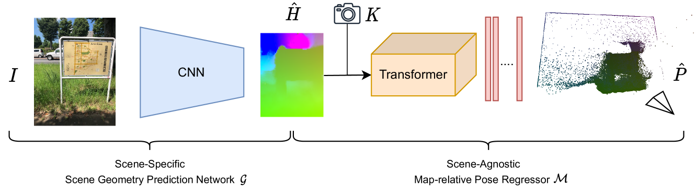
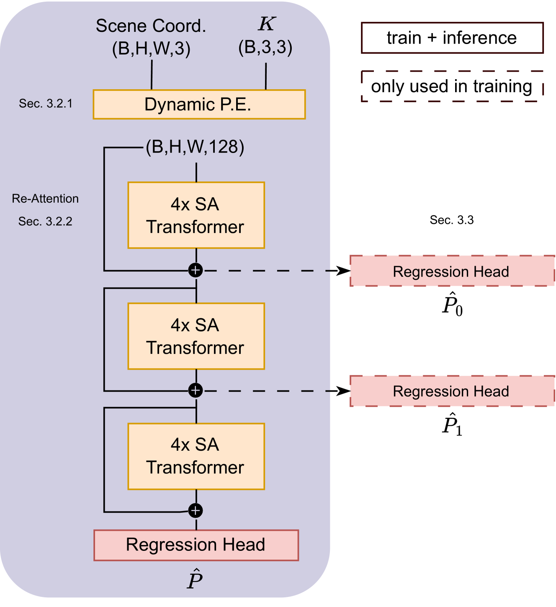

# MARePo：带场景坐标图条件的 Map-Relative Pose Regression

## 结论先行

- **一句话定位**：MARePo 把 APR（绝对位姿回归）和 SCR（场景坐标回归）缝在一起——query 时是单帧前馈回归位姿，但网络吃的不是原始 RGB，而是场景专属的 scene coordinate map $\hat{H}$ ，因此回归出来的是相对于目标地图坐标系的 metric 6DoF 位姿。
- **核心机制**：把「场景几何」和「位姿回归器」解耦。每个新场景训练一个 ACE 式的 scene coordinate CNN $\mathcal{G}_S$ （几分钟），而 transformer 位姿回归器 $\mathcal{M}$ 在 Map-Free 上**训练一次、跨场景通用**——它学的是「从场景坐标图到位姿」这个几何映射，而不是死记某个场景。
- **论文证据**：7-Scenes 上 MARePo 中位误差 3.9cm/1.68° ，scene-specific 微调版 MARePo$\_S$ 达 3.2cm/1.54° ；作为 SCR baseline 的 ACE 为 2.8cm/0.93° 。Wayspots 10cm/5° 精度：MARePo 47.2%、MARePo$\_S$ 47.9%、ACE 52.2% 。推理约 55.6 fps ，比传统 APR 精度高约 50%。
- **代码状态**：GitHub 开源训练/测试/预处理脚本与预训练模型，但许可证是 Niantic 非商用 license；商业化需单独授权。
- **工程判断**：能接受为每个新场景准备 ACE head 的话，MARePo 是目前最强的 pose-regression baseline；若目标是「新场景零训练」，应优先比较 Reloc3r、Reloc-VGGT、FastForward 这类 posed-database-only / RPR 方法。

## 1. 这篇论文解决什么问题？

### 已确认的论文事实

- **问题定义**：视觉重定位有两条主线。APR（PoseNet 系）直接从 RGB 回归位姿，前馈、快、无需 solver，但精度低、需每场景大量训练数据、对新视角泛化差——本质是把整个场景坐标系隐式塞进网络权重。SCR（DSAC*/ACE）预测每像素 3D 场景坐标，再走 RANSAC+PnP 求位姿，精度高但依赖鲁棒估计器。MARePo 想同时保留 APR 的前馈简洁性和 SCR 的几何精度。
- **输入 / 输出**：输入 query 图像经场景专属坐标回归器 $\mathcal{G}_S$ 得到 dense scene coordinate map $\hat{H}$ ，加相机内参 $K$ ；map-relative 回归器 $\mathcal{M}$ 输出相对于场景坐标系的 6DoF metric 位姿 $\hat{P}$ 。
- **目标场景**：室内/室外视觉重定位，重点在 7-Scenes 与 Niantic Wayspots，补充 12-Scenes。
- **训练设定**： $\mathcal{M}$ 在 Map-Free 数据上训练一次；新场景需训练 ACE 式坐标 head $\mathcal{G}\_S$ ，可选对 $\mathcal{M}$ 做 1–15 分钟 scene-specific 微调（即 MARePo$\_S$ ）。

### 我的理解

MARePo 的关键不是「又一个 APR 网络」，而是把 pose regression 里最难学的东西——**场景坐标系**——外包给一张显式的 scene coordinate map。传统 APR 之所以泛化差，就是因为它必须在权重里同时编码「怎么看图」和「这个场景长什么样」；MARePo 把后者拆出来交给 $\mathcal{G}_S$ ，于是通用回归器 $\mathcal{M}$ 只需学一个纯几何问题：给定一张带噪声的 3D 坐标图和内参，相机在哪。这个几何问题是 scene-agnostic 的，因此 $\mathcal{M}$ 能一次训练、到处用。

这也让 MARePo 与 Reloc3r/Reloc-VGGT 的对比必须格外小心：MARePo 在新场景**不是零准备**，它需要一个 ACE head 或等价 SCR map；Reloc3r/Reloc-VGGT 只需 posed database views。MARePo 的优势是 metric 坐标系稳定、几何先验强，代价是新场景准备成本与非商用许可。

## 2. 方法概览

**核心想法**：位姿回归的坐标系问题外包给显式场景坐标图，把「场景专属几何」（每场景一个小 CNN）与「通用位姿回归」（跨场景一个 transformer）彻底解耦。

**一句话 pipeline**：query 图 → 场景专属 CNN $\mathcal{G}_S$ 输出稠密场景坐标图 $\hat{H}$ → 与内参 $K$ 一起送入通用 transformer $\mathcal{M}$ → 前馈回归出 map-relative 的 6DoF metric 位姿 $\hat{P}$ 。

### 2.1 架构解析

整个系统分两段（对应上图左右两半）：

- **Scene-Specific Scene Geometry Prediction Network $\mathcal{G}_S$ （场景专属，CNN）**：一个 ACE 式的场景坐标回归器。输入 RGB 图像 $I$ ，输出每像素对应的 3D 场景坐标图 $\hat{H}$ （在 8× 下采样、短边 480px 的分辨率上）。这一段的权重**只对当前场景有效**，每换一个新场景就重新训练一个（约 5 分钟）。它扮演的角色是「把 RGB 翻译成场景坐标系里的稠密 3D 锚点」。
- **Scene-Agnostic Map-Relative Pose Regressor $\mathcal{M}$ （跨场景通用，Transformer）**：吃 $\hat{H}$ 和内参 $K$ ，前馈输出位姿 $\hat{P}$ 。这一段**训练一次、所有场景共享**。内部结构见下图。

$\mathcal{M}$ 的数据流（对应上图自上而下）：

1. **Dynamic Positional Encoding（Sec 3.2.1）**：把形状 (B,H,W,3) 的场景坐标与 (B,3,3) 的内参 $K$ 融合成 (B,H,W,128) 的 token 表征。这里同时注入 camera-aware 的 2D 位置编码和场景坐标的 3D 位置编码（细节见 2.3）。
2. **12 层 linear-attention transformer，分 3 组、每组 4 层（4× SA Transformer）**： $d_{model}=256$ ， $h=8$ 头。用线性注意力控制稠密 token 的算力开销。
3. **Re-Attention 残差（Sec 3.2.2）**：每组 4 层之后，把该组的输入以残差方式加回输出（图中的 ⊕）。这是防止深层 transformer 在稠密几何 token 上信息坍缩的关键设计。
4. **Regression Head（Sec 3.3）**：3 层 1×1 卷积 + 全局平均池化 + 一个 3 层 MLP，输出 10 维位姿表征——平移用 4 维齐次坐标，旋转用 6 维表征（两条未归一化的轴，经 Gram-Schmidt 正交化成旋转矩阵）。
5. **训练期辅助 head（图中虚线，only used in training）**：在第 1、2 组之后各挂一个 regression head 输出中间位姿 $\hat{P}\_0$、 $\hat{P}\_1$ ，只用于训练时的辅助监督；推理只取最后的 $\hat{P}$ 。

**关键设计选择及理由**：

- 用 scene coordinate map 而非 RGB 作为 $\mathcal{M}$ 的输入——这是让 $\mathcal{M}$ scene-agnostic 的前提，也是 map-relative 的字面含义。
- linear attention + Re-Attention——稠密坐标图 token 数量大，标准注意力算力吃不消，且深层易退化，两者配合兼顾效率与稳定。
- 6D 旋转 + 齐次平移——避免四元数的双重覆盖与归一化病态，是位姿回归的成熟做法。

### 2.2 核心原理

**为什么这样设计 work**：传统 APR 形式化为 $\hat{P}=\mathcal{F}(I)$ ，网络 $\mathcal{F}$ 必须同时承担「视觉理解」和「记住这个场景的坐标系」两件事，后者高度 scene-specific，导致换场景就要重训、且数据少时严重过拟合。MARePo 把它改写为 $\hat{P}=\mathcal{M}(\mathcal{G}\_S(I),K)$ ：场景记忆全部压进 $\mathcal{G}\_S$ 的权重（一个廉价的小 CNN），而 $\mathcal{M}$ 面对的输入已经是「站在场景坐标系里的 3D 点云」，它要解的只是一个纯几何配准问题（点云 + 内参 → 相机外参）。几何问题与具体场景无关，所以 $\mathcal{M}$ 一次训练即可通用泛化。

**关键机制/归纳偏置**：

- **显式几何先验**：输入本身就是 metric 3D 坐标，回归器不必从 RGB 纹理里「猜」尺度和坐标系，metric 稳定性天然强于纯 RGB APR。
- **camera-aware 编码**：把内参显式编进位置编码，使同一 $\mathcal{M}$ 能处理不同相机/焦距，是跨场景通用的必要条件。
- **对坐标噪声的鲁棒性**：论文消融显示，即使较高比例的场景坐标带 ±10cm 级噪声，位姿精度也仅轻微退化——说明 $\mathcal{M}$ 学到的是全局几何配准而非逐点信任，起到了类似 solver 中鲁棒估计的作用（但纯前馈、无迭代）。

**与前作在原理上的本质区别**：

- vs. PoseNet/MS-Transformer 等 APR：它们把场景隐式塞进权重（ $\hat{P}=\mathcal{F}(I)$ ）；MARePo 把场景显式外化成坐标图，回归器不背场景。
- vs. ACE/DSAC* 等 SCR：它们拿到场景坐标后走 RANSAC+PnP（迭代、有 solver）；MARePo 拿到坐标后直接前馈回归位姿，没有显式 solver，用学习到的鲁棒回归替代 RANSAC。

### 2.3 关键公式解析

**公式 (1)：位姿回归的两种形式化**

$$ \hat{P}=\mathcal{F}(I) \qquad\text{vs.}\qquad \hat{P}=\mathcal{M}(\hat{H},K)=\mathcal{M}(\mathcal{G}_S(I),K) $$

- 符号： $I$ 为 query 图像； $\hat{P}$ 为预测的 6DoF 位姿； $\mathcal{F}$ 是传统 APR 的端到端网络； $\mathcal{G}_S$ 是场景专属坐标 CNN，输出场景坐标图 $\hat{H}$ ； $K\in\mathbb{R}^{3\times3}$ 为相机内参； $\mathcal{M}$ 是跨场景通用的位姿回归器。
- 作用：左式是传统 APR（场景记在 $\mathcal{F}$ 权重里）；右式是 MARePo 的核心重写——把场景几何显式解耦到 $\mathcal{G}_S$ ，使 $\mathcal{M}$ 与场景无关。这一步是全文的立论基础。

**公式 (2)：Camera-aware 2D 位置编码的射线坐标**

$$ X_{\text{ray}}(u)=\lambda\,\frac{u-c_x-\varepsilon}{f_x}, \qquad Y_{\text{ray}}(v)=\lambda\,\frac{v-c_y-\varepsilon}{f_y} $$

- 符号： $(u,v)$ 为像素坐标； $f\_{x},f\_{y}$ 为焦距、 $c\_{x},c\_{y}$ 为主点（均来自 $K$ ）； $\varepsilon=0.5$ 为下采样引入的偏移修正； $\lambda=400$ 为缩放常数。
- 作用：把像素通过内参反投影成归一化相机射线方向，作为 2D 位置编码的输入。因为编码里显式含 $f,c$ ，同一个 $\mathcal{M}$ 才能处理不同内参的相机——这是 scene/camera-agnostic 的关键。射线坐标再经正弦编码（频率 $\omega_k=\frac{1}{10000^{2k/d}}$ ）升维。

**公式 (3)：3D 位置编码与融合**

$$ \mathcal{PE}_{3D}(p)=\operatorname{Conv}_{3(2m+1)}^{d}\big[\,p,\ \ldots,\ \sin(2^{m-1}\pi p),\ \cos(2^{m-1}\pi p),\ \ldots\,\big], \qquad \mathcal{PE}_f=\mathcal{PE}_{3D}+\mathcal{PE}_{2D} $$

- 符号： $p\in\mathbb{R}^3$ 为一个场景坐标点； $m=5$ 为频率级数（故通道数含 $3(2m+1)$ 项）； $\operatorname{Conv}^{d}$ 是把编码投到 $d$ 维的卷积； $\mathcal{PE}_{2D}$ 为公式 (2) 得到的 camera-aware 2D 编码。
- 作用：把每个 3D 场景坐标用多频正弦编码映到高频空间（NeRF 式 positional encoding，缓解 MLP/attention 对低频的偏好），再与 2D 射线编码**逐元素相加**融合成 (B,H,W,128) 的 token。融合后既带「这个点在场景 3D 空间的位置」，又带「它从哪个像素/射线来」。

**公式 (4)：位姿回归损失与深监督**

$$ \mathcal{L}_{\hat{P}}=\lVert \hat{R}-R\rVert_1+\lVert \hat{\mathbf{t}}-\mathbf{t}\rVert_1, \qquad \mathcal{L}=\mathcal{L}_{\hat{P}_0}+\mathcal{L}_{\hat{P}_1}+\mathcal{L}_{\hat{P}} $$

- 符号： $\hat{R},R$ 为预测/真值旋转（矩阵形式）， $\hat{\mathbf{t}},\mathbf{t}$ 为预测/真值平移； $\lVert\cdot\rVert\_1$ 为 L1 范数； $\mathcal{L}\_{\hat{P}\_0},\mathcal{L}\_{\hat{P}\_1}$ 是第 1、2 组 transformer 后辅助 head 的同型损失。
- 作用：主损失直接在位姿空间用 L1 监督旋转和平移（L1 比 L2 对离群更稳）。总损失把两个中间位姿的辅助损失加进来，做深监督——缓解 12 层 transformer 的梯度传播、稳定训练；这两个辅助 head 推理时丢弃。

### 2.4 训练与推理细节

- **训练目标 / 损失**：见公式 (4)，L1 位姿损失 + 两个中间层辅助损失的深监督。
- **训练数据与规模**：通用回归器 $\mathcal{M}$ 在 Map-Free Dataset 上训练，取约 450 个场景（约 500K 帧），并为其训练约 900 个场景专属坐标回归器来生成大量 $(\hat{H},K)\to P$ 训练对。数据增强：平移 jitter ±1m 、旋转 ±180° 、图像平面旋转 15° 、rescale 0.67–1.5×，以覆盖多样视角与坐标图噪声。
- **超参要点**： $d_{model}=256$ ， $h=8$ 头，12 层（3×4）；batch size 64；AdamW，学习率区间约 $3\times10^{-4}$ 到 $2\times10^{-3}$ ，1-cycle 调度；约 150 epochs、8× V100、约 10 天。
- **推理流程**：① $\mathcal{G}_S$ 对 query 图输出 8× 下采样、短边 480px 的稠密场景坐标图 $\hat{H}$ ；② Dynamic PE 融合 camera-aware 2D 与 3D 编码；③ 12 层 transformer 前馈；④ regression head 输出 10D → 6DoF metric 位姿；⑤ 无 RANSAC/PnP、无迭代，吞吐约 55.6 fps（Wayspots）。
- **可选微调（MARePo$_S$ ）**：在新场景 mapping 帧上对 $\mathcal{M}$ 微调约 2 epochs（约 1–10 分钟，7-Scenes 最多约 15 分钟），损失同上。精度更高，但更偏 scene-specific APR。

## 3. 关键贡献

1. **提出 map-relative pose regression**：把 APR 从 $\hat{P}=\mathcal{F}(I)$ 重写为 $\hat{P}=\mathcal{M}(\mathcal{G}_S(I),K)$ ，让位姿回归相对于显式场景坐标图，而非把场景隐式塞进权重。
2. **解耦场景几何与位姿回归**： $\mathcal{G}_S$ 每场景训练（廉价）， $\mathcal{M}$ 跨场景一次训练学通用「坐标图→位姿」几何映射。
3. **Dynamic PE + Re-Attention 的架构设计**：camera-aware 2D + 3D 位置编码使回归器 camera/scene-agnostic；Re-Attention 残差稳定 12 层稠密 token transformer。消融证明二者都不可或缺。
4. **在室内/室外验证并大幅超越 APR**：7-Scenes、Wayspots 上比 PoseNet/MS-Transformer/DFNet 等 APR 精度约提升 50%，同时前馈 55.6 fps，逼近几何法。

## 4. 实验与证据

| 维度 | 内容 |
|---|---|
| 数据集 | Map-Free training set（约 450 场景/500K 帧）、7-Scenes、Niantic Wayspots、12-Scenes（补充） |
| Baseline | DSAC*、ACE（SCR）；PoseNet、MapNet、Direct-PN、MS-Transformer、DFNet、LENS（APR/APR-like） |
| 指标 | 中位平移/旋转误差；10cm/5°、0.5m/5° 阈值精度；mapping time；throughput（fps） |
| 主要结果 | 7-Scenes：MARePo 3.9cm/1.68°、MARePo$\_S$ 3.2cm/1.54°、ACE 2.8cm/0.93°、PoseNet 44cm/10.4°。Wayspots 10cm/5° 精度：MARePo 47.2%、MARePo$\_S$ 47.9%、ACE 52.2%。推理约 55.6 fps |
| 训练成本 | $\mathcal{M}$：约 8×V100、约 10 天；每新场景 $\mathcal{G}\_S$ 约 5 分钟；MARePo$\_S$ 微调约 1–15 分钟 |
| 消融 | Re-Attention、Dynamic PE、model dimension、训练策略、辅助损失、坐标 backbone、坐标噪声鲁棒性 |
| 失败案例 | 强依赖场景坐标图质量；新场景需训练坐标 head；非 zero-shot / 非 posed-database-only 方法 |

### 4.1 效果与性能解析

- **主要结果解读（非搬数字）**：在 APR 阵营里 MARePo 是碾压性的——7-Scenes 上把中位误差从 PoseNet 的 44cm/10.4° 压到 3.9cm/1.68°，约一个数量级，这直接印证了「显式场景坐标图提供的 metric 几何先验」远胜「隐式权重记忆」。但要客观：对 SCR 阵营的 ACE（2.8cm/0.93°，Wayspots 52.2%），MARePo 仍略逊。MARePo 的价值不在于精度压倒 SCR，而在于**用纯前馈回归拿到接近 SCR 的精度**——它抹掉了 APR 与几何法之间的大半差距，同时保留 APR 的简洁与速度。
- **性能与效率**：推理约 55.6 fps（Wayspots），无 RANSAC/PnP、无迭代，单 GPU 可跑；新场景准备成本极低（ $\mathcal{G}\_S$ 约 5 分钟，MARePo$\_S$ 微调 1–15 分钟），对照传统 APR 动辄数小时/数天的每场景训练是巨大改善。代价在训练侧： $\mathcal{M}$ 需 8×V100 约 10 天、Map-Free 增广数据可能占用 TB 级存储。
- **消融揭示的关键因素**：两个组件是命门——完整架构在 Wayspots 10cm/5° 约 39.6% ；去掉 Re-Attention 明显下滑，去掉 Dynamic PE 进一步跌到约 18.6% ，说明二者对稠密几何 token 的稳定编码/信息流至关重要（各消融行的具体绝对数值以论文 Table 3 为准，此处仅取量级，标为待核验）。坐标噪声消融显示：即便高比例场景坐标带 ±10cm 级噪声，位姿精度仅轻微退化——证明 $\mathcal{M}$ 学到了全局几何配准的鲁棒性，功能上替代了 solver 的 outlier rejection。
- **可比性与协议一致性**：与 ACE 比较时协议基本一致（同数据集、同阈值），但要注意 MARePo 的「mapping time」只算 $\mathcal{G}_S$/微调，其通用回归器 $\mathcal{M}$ 的 10 天训练是一次性摊销、不计入每场景成本；而与 Reloc3r/Reloc-VGGT 这类 posed-database-only 方法比较时**并不同类**——MARePo 需要每场景坐标 head，不是零准备，横向对比时不应混为一档。

## 5. 局限与风险

### 论文明确承认

- 每个新场景需要训练 scene coordinate head $\mathcal{G}_S$ ——不是无地图 / 无场景训练方法。
- 精度上仍略逊于成熟 SCR（ACE）；MARePo 的卖点是前馈回归而非绝对精度第一。

### 我推断的风险

- 无显式 RANSAC/PnP，虽然消融显示对坐标噪声鲁棒，但错误的场景坐标图会直接污染位姿，缺少 solver 的显式几何一致性校验兜底。
- 对动态/长期变化场景， $\mathcal{G}_S$ 需要更新，否则 map-relative 位姿会随地图过期而失效。

### 工程落地风险

- Map-Free 增广训练集可能需 TB 级存储；从头训 $\mathcal{M}$ 推荐 ≥8×V100 或同等硬件，复现门槛高于 Reloc3r 纯推理。
- 训练/评估依赖 ACE/DSAC* 生态与多个数据集脚本，环境复杂度较高。

### 许可证 / 数据风险

- Niantic 非商用 marepo License，专利待定；商业或公司内产品化需联系 Niantic 单独授权。
- 数据集（7-Scenes/12-Scenes/Wayspots/Map-Free）各自许可证需自行核查。

## 方法谱系

- 基于（SCR 几何模块）：ACE / DSAC*（scene coordinate regression，作为 $\mathcal{G}_S$ ）
- 对照/超越（APR 前作）：PoseNet、MS-Transformer、DFNet
- 同方向可比：[Reloc3r](../visual-localization/2025-reloc3r.md)、[Reloc-VGGT](../visual-localization/2026-reloc-vggt.md)

## 6. 与相似方法对比

| Method | 相同点 | 不同点 | 何时选它 |
|---|---|---|---|
| ACE | 都依赖 scene coordinate regression | ACE 用场景坐标 + RANSAC/PnP；MARePo 用场景坐标 + 前馈回归器，无 solver | 追求成熟 SCR 精度选 ACE；研究 geometry-conditioned direct pose regression 选 MARePo |
| Reloc3r | 都能 query-time 前馈输出位姿 | Reloc3r 无每场景训练，靠 posed database + retrieval；MARePo 要场景坐标图 | 无场景训练/快速 baseline 选 Reloc3r；已有目标场景 map 选 MARePo |
| Reloc-VGGT | 都直接回归 query 位姿 | Reloc-VGGT early-fuse source 位姿/图像；MARePo condition on 场景坐标图 | 关注 RPR early fusion 选 Reloc-VGGT；关注 map-conditioned APR 选 MARePo |
| FastForward | 都利用 mapping poses / 场景几何 | FastForward 预测 2D-3D 对应再 PnP、不训练 per-scene 网络；MARePo 训练坐标 head 并直接回归 | 要 map-light / no per-scene training 选 FastForward；已有 ACE map 选 MARePo |
| PoseNet / MS-Transformer / DFNet | 都属 APR / APR-like | MARePo 显式条件化场景坐标图，精度约高 50% | 历史 APR baseline 可保留；新工作应对比 MARePo |

## 7. 复现判断

- Git 地址：<https://github.com/nianticlabs/marepo>
- 是否开源：是，非商用。
- 是否开源训练：是。
- 代码可用性：提供训练、测试、数据预处理和预训练模型链接（`train_marepo.py`、`test_marepo.py`、`preprocess_marepo.py`、`train_ace.py`、`scripts/*.sh` 等）。
- 权重可用性：pre-trained ACE heads、MARePo paper models、`ace_encoder_pretrained.pt`。
- 数据可获得性：Map-Free archive、7-Scenes/12-Scenes/Wayspots setup scripts；需核查数据许可证。
- 预计环境成本：推理/评测可单 GPU；训练 $\mathcal{M}$ 约 8×V100 / 10 天量级；每场景 ACE head 约分钟级。
- 2026-06-04 read-only check：`git ls-remote` HEAD 为 `22ef5df8e137e68e0104369de3526fdbad5b445b`。
- 最小复现路径：
  1. 创建 `public_marepo` conda env。
  2. 下载 7-Scenes 或 Wayspots。
  3. 下载 pre-trained ACE heads 和 MARePo paper models 到 `logs/`。
  4. 跑 `scripts/test_7scenes.sh` 或 `scripts/test_wayspots.sh`。
  5. 研究新场景则先训 ACE head，再生成 MARePo preprocess data，最后测试/微调 MARePo$_S$。
- 是否值得复现：值得作为 map-conditioned APR/SCR hybrid baseline；但不要和 zero-shot/RPR 方法混为一类。

## 8. 后续动作

- [x] 创建 MARePo 单篇论文分析
- [x] 更新 `indices/papers.md`
- [x] 更新 `indices/directions.md`
- [x] 更新 `indices/methods.md`
- [x] 创建 visual localization 横向对比
- [ ] 若开始复现，创建 `reproductions/visual-localization/marepo/README.md`

## Sources

- Paper: <https://arxiv.org/abs/2404.09884>
- PDF: <https://arxiv.org/pdf/2404.09884>
- HTML (v1, 含公式与图): <https://arxiv.org/html/2404.09884v1>
- Project page: <https://nianticlabs.github.io/marepo/>
- GitHub: <https://github.com/nianticlabs/marepo>
- ACE project/repo: <https://nianticlabs.github.io/ace/>, <https://github.com/nianticlabs/ace>
