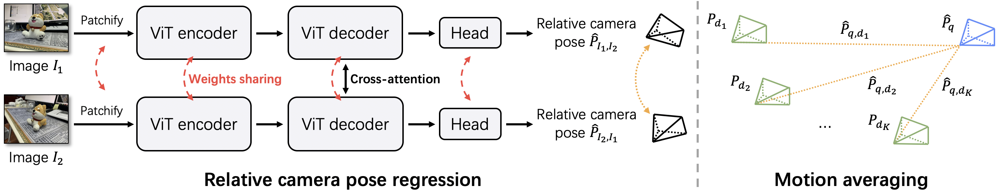
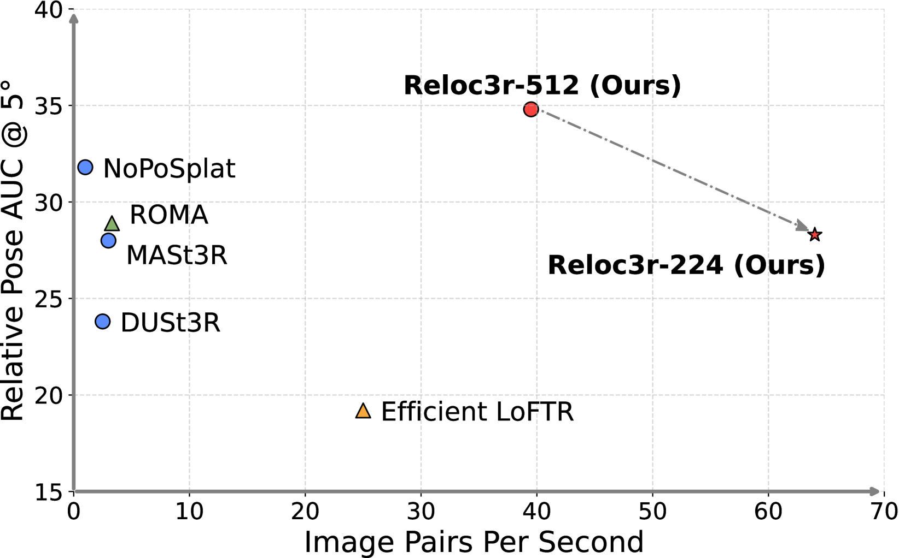
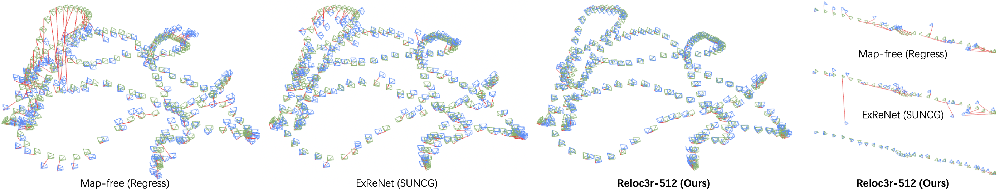
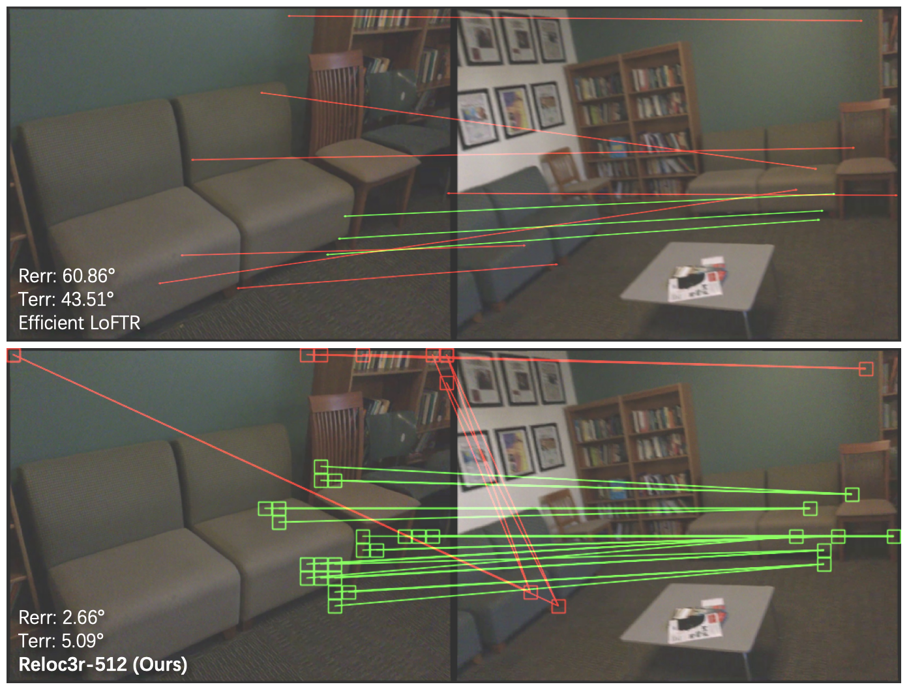

# Reloc3r：大规模训练的相对姿态回归视觉重定位

## 结论先行

- **一句话定位**：Reloc3r 是当前最实用的 scene-agnostic 相对姿态回归（RPR）baseline 之一：训练一次即可跨场景使用，在新场景里只需要 posed database images 加一次 retrieval，就能用「逐对相对姿态回归 + motion averaging」输出 query 的绝对位姿。
- **核心方法**：用 DUSt3R-style 对称 ViT encoder-decoder 回归双向相对姿态，**只学方向不学 metric scale**；query 与 top-K retrieved database images 配对后，通过 rotation averaging（取中位数）与 camera-center triangulation（SVD 最小二乘）把多条相对结果融合成一个带 metric 尺度的绝对位姿。
- **为什么 work**：网络回避了「跨域直接回归 metric 平移」这个最难泛化的量，只学几何上稳定的相对旋转和平移方向；真正的 metric 尺度由 database poses 之间已知的几何关系在推理时几何解算得到，而不是靠网络记忆。
- **论文证据**：Reloc3r-512 在 ScanNet1500 上 AUC@5/10/20 = 34.79/58.37/75.56，单对推理约 25 ms（Reloc3r-224 约 15 ms）；CO3Dv2 多视图 RRA@15/RTA@15/mAA@30 = 95.8/93.7/82.9；7-Scenes 平均 0.04 m / 1.02°；Cambridge Average(4) 约 0.55 m / 0.56°。约 0.43B 参数，单张 RTX 4090 上论文报告约 24 FPS。
- **代码状态**：GitHub 已公开推理、评测、训练代码、dataset preprocessing scripts、Reloc3r-224/512 checkpoint 链接与 wild image/video demo；`training_open_source: true`。License 为 CC BY-NC-SA 4.0（非商用）。
- **工程判断**：非常适合作为 Reloc-VGGT、FastForward 的可跑对照 baseline；但它的 late fusion / motion averaging 在近共线相机、source views 过少、retrieval outliers 或尺度退化场景中仍有风险，且不输出显式 correspondences，难以接 PnP/RANSAC 做几何 outlier rejection。

## 1. 这篇论文解决什么问题？

- **问题定义**：传统结构化 visual localization 需要显式 3D map 加 2D-3D matching；APR（Absolute Pose Regression）scene-specific 且数据饥渴、换场景要重训；RPR（Relative Pose Regression）原则上可跨场景，但精度长期落后于几何方法，被认为「不能兼顾泛化与精度」。Reloc3r 想用大规模、多域的 posed image-pair 训练，把 RPR 的泛化和精度同时往上推。
- **输入 / 输出**：相对姿态模块输入两张图像，输出**双向**相对姿态 $\hat{P}\_{I\_1,I\_2}$ 与 $\hat{P}\_{I\_2,I\_1}$ （各为 $3\times 4$ 的 $[R\lvert t]$ ，平移只保留方向）；视觉定位时 query 与 top-K retrieved database images 逐对配对，最终输出 query 在世界坐标系下的 6DoF 绝对位姿。
- **目标场景**：pair-wise 相对姿态、multi-view 相对姿态、indoor/outdoor 视觉定位（map-free / 依赖 posed database）。
- **与现有方法的差异**：不像 APR 需要每场景训练，不像 ACE 需要 scene coordinate head，不像 MASt3R/DUSt3R 走 matching + solver 路线。Reloc3r 是「一个跨场景的相对姿态网络 + 一个极简几何后端」。

### 我的理解（推断）

Reloc3r 的价值在于把「pose regression 不能泛化」这一刻板印象往前推了一步：与其给每个场景训 APR，不如训一个跨场景相对姿态模型，再借 database poses 把相对姿态几何地转成绝对姿态。但它仍不是传统几何定位的替代品——不输出显式 correspondences、不建 3D map，尺度来自多 source 视图的 motion averaging 而非网络可靠估计。因此在强几何约束、大场景精定位里，仍应与 ACE / MASt3R / FastForward / feature-matching 同表比较。

## 2. 方法概览

- **核心想法**：把「相对姿态回归」和「绝对姿态解算」彻底解耦。网络只做前者且只学方向；后者用一个无需训练、无迭代优化的闭式几何后端完成。
- **一句话 pipeline**：query 与 top-K posed database images 分别过对称 ViT 得到多个双向相对姿态 → 每个 database pose 把相对旋转/平移方向转到世界系 → rotation averaging（中位数）定 query 朝向、camera-center triangulation（SVD）定 query 位置与 metric 尺度。

### 2.1 架构解析

**整体结构（模块分解）**。相对姿态网络是一个孪生对称的 encoder-decoder-head 三段式：

1. **对称 encoder**：两张输入图各自 patchify 成 token，送入**两个共享权重**的 ViT encoder（ $m=24$ 个 block）。encoder 权重用 DUSt3R 的 ViT-Large 初始化。
2. **交叉注意力 decoder**：两个 decoder branch（ $n=12$ 个 block）共享权重，每个 branch 用一张图的特征做 query、另一张做 key/value，双向做 cross-attention，让两图特征互相「看到」对方。
3. **姿态回归头**：一个轻量卷积头（ $h=2$ 层）把 decoder 输出的 token 聚合成 $3\times 4$ 的相对姿态，旋转用 continuous 9D→SO(3) 表示（避免四元数/欧拉角的不连续性），平移只输出单位方向向量。

**数据流**： $I\_1,I\_2 \to$ 各自 encoder 特征 $F\_1,F\_2 \to$ 两个 decoder 得到融合特征 $G\_1,G\_2 \to$ head 输出 $\hat{P}\_{I\_1,I\_2}$ 与 $\hat{P}\_{I\_2,I\_1}$ 。整个网络约 0.43B 参数。

**关键设计选择及理由**：

- **对称/共享权重**：encoder 和 decoder 在两支之间共享权重，且同时预测两个方向的相对姿态。这消除了「哪张图是参考帧」的输入顺序偏置，让训练更简洁、数据利用更充分（一对图天然构成两个训练样本）。
- **只回归方向、不回归 metric scale**：head 的平移输出是单位方向。论文消融显示，强行让网络学 metric 相对平移会**损害泛化**——因为 metric 尺度高度依赖具体场景/相机，跨域回归它等于要网络记忆尺度先验。
- **DUSt3R 初始化**：encoder 冻结或以 DUSt3R 预训练权重起步，decoder 与 head 可训练。这把一个已经学到强跨视图几何先验的 backbone 直接迁移过来，是精度和泛化的重要来源。

### 2.2 核心原理

- **为什么这样设计 work**：视觉定位里真正难跨域泛化的是「绝对/metric 平移」。Reloc3r 的洞察是——**把最难的量剥离给几何后端**。网络只负责回归两个几何上相对稳定、跨域一致的量：相对旋转、相对平移方向。这两者不含绝对尺度，因此一个在 8M 多域图对上训练的网络能学到通用先验。metric 尺度则来自推理时 database poses 之间**已知**的真实空间关系，由 triangulation 闭式解出，不需要网络承担。
- **关键机制 / 归纳偏置**：(a) cross-attention 提供的跨视图对应先验（继承自 DUSt3R）；(b) 对称结构强加的 order-invariance；(c) 双向预测提供的自洽约束（ $P\_{I\_1,I\_2}$ 与 $P\_{I\_2,I\_1}$ 应互逆）；(d) 「方向 vs 尺度」的显式分工——网络管方向，几何管尺度。
- **与前作的本质区别**：相比 Map-free/ExReNet 等早期 RPR，Reloc3r 的差异是训练规模（约 8M 对、多域）+ DUSt3R 先验 + 对称结构；相比 DUSt3R/MASt3R，它不回归 dense pointmap、不做显式 matching + PnP，而是**直接**回归相对姿态，因此推理更快（论文报告单对约 25 ms，比 ROMA 的约 300 ms 快约一个数量级）。

### 2.3 关键公式解析

**公式 (1) 编码与解码（双向交叉注意力）**

$$ F_i = \mathrm{Encoder}(\mathrm{Patchify}(I_i)),\quad i=1,2 $$

$$ G_1 = \mathrm{Decoder}(F_1, F_2),\qquad G_2 = \mathrm{Decoder}(F_2, F_1) $$

- 符号： $I\_i\in\mathbb{R}^{H\times W\times 3}$ 是输入图； $F\_i\in\mathbb{R}^{T\times d}$ 是 $T$ 个 patch token、维度 $d$ 的编码特征； $G\_i$ 是经交叉注意力融合后的特征。Decoder 第一参数为 query 来源，第二参数为 key/value 来源。
- 作用： $G\_1$ 携带「从 $I\_1$ 视角看 $I\_2$ 」的几何信息，反之亦然，为双向姿态回归提供互补上下文。

**公式 (2) 双向姿态输出**

$$ \hat{P}_{I_1,I_2} = \mathrm{Head}(G_1),\qquad \hat{P}_{I_2,I_1} = \mathrm{Head}(G_2) $$

- 符号： $\hat{P}_{I_1,I_2}=[\hat{R}\lvert \hat{t}]\in\mathbb{R}^{3\times 4}$ ，其中 $\hat{R}\in SO(3)$ 由 9D 表示投影而来， $\hat{t}$ 是单位平移方向（无 metric 尺度）。
- 作用：一次前向同时给出两个方向的相对姿态，供后端与自洽约束使用。

**公式 (3) 训练损失（角度/测地度量）**

$$ \mathcal{L} = \ell_R + \ell_t $$

$$ \ell_R = \arccos\!\left(\frac{\mathrm{tr}(\hat{R}^{-1}R)-1}{2}\right),\qquad \ell_t = \arccos\!\left(\frac{\hat{t}\cdot t}{\lVert\hat{t}\rVert\,\lVert t\rVert}\right) $$

- 符号： $R,t$ 为真值相对旋转与平移方向， $\hat{R},\hat{t}$ 为预测值。 $\ell\_R$ 是两旋转之间的测地角（geodesic angle，弧度）， $\ell\_t$ 是预测平移方向与真值方向的夹角。
- 作用：两项都以**角度**度量误差，天然与「只学方向、不学尺度」的设计一致—— $\ell_t$ 只惩罚方向偏差，完全不约束平移长度，从损失层面就把 metric 尺度排除在网络学习目标之外。

**公式 (4) 绝对姿态解算（motion averaging）**

对第 $i$ 个 database image（世界系旋转 $R_{d_i}$ ），由预测的相对旋转把 query 旋转转到世界系：

$$ \hat{R}_q^{(i)} = \hat{R}_{q,d_i}\, R_{d_i} $$

query 的最终旋转取所有候选的稳健中位数（四元数域）：

$$ \hat{R}_q = \mathrm{median}\big(\{\hat{R}_q^{(i)}\}_{i=1}^{K}\big) $$

query 相机中心 $c\_q$ 由 camera-center triangulation 求解——每个 database 相机中心 $c\_{d\_i}$ 加上世界系下的相对平移方向 $d\_i$ 定义一条射线，最小化 query 中心到各射线的垂距平方和：

$$ \hat{c}_q = \arg\min_{c}\ \sum_{i=1}^{K}\ \big\lVert (I - d_i d_i^{\top})\,(c - c_{d_i}) \big\rVert^2 $$

- 符号： $d\_i$ 是第 $i$ 对预测平移方向旋到世界系后的单位向量； $(I - d\_i d\_i^{\top})$ 是到该方向正交补的投影矩阵； $c\_{d\_i}$ 是已知 database 相机中心。该最小二乘有闭式解，论文用 **SVD** 求。
- 作用：这一步是 Reloc3r 能输出 **metric** 绝对位姿的关键——网络给方向，database poses 提供带真实尺度的相机中心 $c_{d_i}$ ，多条方向射线在世界系中的交汇点自然带回了 metric 尺度。（论文对 triangulation 的精确代数式未逐符号展开，上式为对「minimize sum of squared distances from camera center to each translation direction, solved by SVD」的形式化表述。）

### 2.4 训练与推理细节

- **训练目标 / 损失**：公式 (3)，旋转测地角 + 平移方向角，等权相加。
- **训练数据与规模**：约 **8M** posed image pairs，跨 7 个公开数据集，覆盖 object-centric / indoor / outdoor 三类域——CO3Dv2、ScanNet++、ARKitScenes、BlendedMVS、MegaDepth、DL3DV、RealEstate10K。repo 提供各集的 preprocessing scripts 与 pair-list 归档。
- **超参要点（论文报告）**：encoder 以 DUSt3R ViT-Large 权重起步；输入宽度默认 512 px（另有 224 px 版），训练时长宽比从 {4:3, 32:21, 16:9, 2:1, 16:5} 随机采样并配随机 color jitter；学习率约 $1\text{e-}5$ 衰减到约 $1\text{e-}7$ ；论文所述在 AMD MI250x 级 GPU 上训练。（batch/step 等细节以官方脚本为准；README 说明官方 `train.sh` 与论文训练不严格等价但足够接近。）
- **推理流程**：(1) NetVLAD 等 retrieval 取 query 的 top-K（论文默认约 top-10）database images；(2) 每个 (query, database) 对过网络得双向相对姿态；(3) 公式 (4) 做 rotation median + camera-center triangulation；(4) 输出 query 6DoF 绝对位姿。Reloc3r-224 与 Reloc3r-512 **仅输入分辨率不同**，权重结构一致，前者约 15 ms/对、后者约 25 ms/对（ScanNet1500）。

## 3. 关键贡献

1. **大规模跨域 RPR 训练**：约 8M posed image pairs 覆盖 object-centric / indoor / outdoor 三域，把 RPR 的泛化和精度同时推高。
2. **对称相对姿态架构**：encoder/decoder/head 两支共享权重、双向预测，消除输入顺序偏置，训练更简洁。
3. **方向 / 尺度解耦**：网络只学相对旋转与平移方向，metric 尺度交由几何后端；消融证明这比直接回归 metric pose 泛化更好。
4. **极简 motion averaging 后端**：无迭代优化、无 bundle adjustment，用 rotation median + SVD triangulation 闭式融合 top-K 相对结果为 metric 绝对位姿。
5. **强泛化实证 + 高速度**：ScanNet1500、RealEstate10K、ACID、CO3Dv2、7-Scenes、Cambridge 多基准验证，且推理显著快于 matching-based 方法。

## 4. 实验与证据

| 维度 | 内容 |
|---|---|
| 数据集 | ScanNet1500、RealEstate10K、ACID、CO3Dv2、7-Scenes、Cambridge Landmarks、MegaDepth1500 |
| Baseline | Map-free、ExReNet、Efficient LoFTR、ROMA、DUSt3R、MASt3R、NoPoSplat、APR/RPR methods |
| 指标 | AUC@5/10/20、RRA@15、RTA@15、mAA@30、median translation/rotation error、FPS |
| 主要结果 | ScanNet1500 AUC@5/10/20：Reloc3r-512 = 34.79/58.37/75.56（Reloc3r-224 = 28.34/52.60/71.56）；CO3Dv2 multi-view：RRA@15 95.8%、RTA@15 93.7%、mAA@30 82.9%；7-Scenes 平均 0.04 m/1.02°；Cambridge Average(4) 约 0.55 m/0.56° |
| 速度 | ScanNet1500 单对：Reloc3r-224 约 15 ms、Reloc3r-512 约 25 ms；RTX 4090 上论文报告 Reloc3r-512 约 24 FPS（fp32），开 `--amp=1`（fp16）可到约 40 FPS |
| 参数量 | 约 0.43B（encoder 24 blocks / decoder 12 blocks / head 2 conv layers） |
| 消融 | 对称结构优于非对称；不直接学 metric scale 更好；DUSt3R initialization 对性能重要；训练数据规模与多样性提升精度；rotation 用 median 比 mean 更抗噪 |
| 失败案例 | 论文明确指出完全共线（collinear）相机会让 triangulation 的 metric scale 不可解；大场景精定位仍可能落后强 feature-matching / solver 方法 |

### 4.1 效果与性能解析

- **主要结果解读（不只搬数字）**：ScanNet1500 上 34.79/58.37/75.56 的 AUC 说明 Reloc3r 在室内宽基线相对姿态上达到与强 matching 方法（ROMA/MASt3R）同档，但**推理快约一个数量级**——这是「direct regression 省掉 dense matching + solver」带来的直接收益。CO3Dv2 多视图 RRA@15 95.8% 表明相对**旋转**估计非常稳（物体中心、旋转主导），而 mAA@30 82.9% 相对低一些，暴露了平移/尺度侧才是难点，正好印证「尺度靠后端」的设计张力。7-Scenes 0.04 m/1.02° 是室内定位的强结果，说明「retrieval + RPR + triangulation」这条无场景训练路线在小空间足够精。
- **性能与效率**：约 0.43B 参数，单对 15–25 ms，RTX 4090 上约 24 FPS（fp16 约 40 FPS）。相比每场景训练的 APR/ACE，Reloc3r 省去训练时间；相比 matching+PnP，省去 solver 迭代。代价是精度上限受限于 direct regression 与后端几何。
- **消融揭示的关键因素**：三件事最重要——(1) DUSt3R 初始化（几何先验来源）；(2) 不学 metric scale（泛化关键）；(3) 训练数据的规模与多域覆盖。此外 rotation averaging 用 median 而非 mean，是抵抗单对 outlier 的低成本技巧。
- **可比性与协议一致性**：Reloc3r 依赖 posed database + retrieval，属于「map-free / 需 posed 参考」设定，与需要显式 3D map 的结构化方法不完全同设定；与 Reloc-VGGT / FastForward 对比时应统一 retrieval top-K 与 database 来源，否则不可比。

## 5. 局限与风险

- **论文明确承认**：完全共线的相机配置会让 camera-center triangulation 的 metric scale 不可解（射线退化）；大规模场景精定位仍可能落后强 feature-matching / solver 方法。
- **代码/许可层面**：License 为 CC BY-NC-SA 4.0，**商业使用受限**；完整训练需自行下载多个大规模数据集并遵守各自许可证；README 说明官方 `train.sh` 与论文训练不严格等价，完整数字复刻需谨慎。wild video demo 用首/尾帧作 database、要求 overlap、不支持 linear motion，说明极简 demo 不代表完整系统鲁棒性。
- **我推断的风险**：motion averaging 是强假设模块——source views 过少、近共线、translation baseline 不足或 retrieval outliers 都会侵蚀 metric scale。网络不输出 2D-3D correspondences，难接 PnP/RANSAC 做几何 outlier rejection，可解释性弱于 FastForward/ACE/MASt3R。
- **工程落地风险**：对自动驾驶/机器人，Reloc3r 更适合做 quick global pose proposal 或 no-map baseline，不能替代带地图约束的定位后端；query intrinsics 假设、retrieval 质量、source pose 噪声都需实测。

## 方法谱系

- 基于：[DUSt3R / CroCo 系 ViT encoder-decoder](https://arxiv.org/abs/2312.14132)（backbone 初始化与交叉注意力设计来源）
- 相关后继：[Reloc-VGGT](../visual-localization/2026-reloc-vggt.md)（把 Reloc3r 的 late motion averaging 改为 VGGT 内 early fusion）

## 6. 与相似方法对比

| Method | 相同点 | 不同点 | 何时选它 |
|---|---|---|---|
| [Reloc-VGGT](../visual-localization/2026-reloc-vggt.md) | 都是 scene-agnostic RPR / feed-forward relocalization | Reloc3r late fusion（逐对回归+averaging）；Reloc-VGGT early fusion（VGGT + source pose token 网络内融合） | 当前可跑复现选 Reloc3r；研究高上限 early fusion 关注 Reloc-VGGT |
| FastForward | 都用 posed mapping/database images，不做每场景训练 | FastForward 预测 query 3D coordinates 再 PnP；Reloc3r 直接相对姿态回归 + averaging | 需要可解释 correspondences / scale transfer 选 FastForward；需要可跑 RPR baseline 选 Reloc3r |
| [MARePo](../visual-localization/2024-marepo.md) | 都是 feed-forward pose output | MARePo 依赖 scene-specific coordinate map；Reloc3r 无需 per-scene training | 有 map/ACE head 选 MARePo；无场景训练选 Reloc3r |
| Map-free / ExReNet | 同属 RPR / relative localization 族 | Reloc3r 大规模训练、DUSt3R init、更强泛化 | 历史 baseline 保留 Map-free/ExReNet；新 baseline 用 Reloc3r |
| MASt3R / DUSt3R | 都来自 3D foundation model 生态 | MASt3R/DUSt3R 偏 matching/reconstruction/solver；Reloc3r 是 direct pose regression | 做强非 PR baseline 选 MASt3R；做 RPR 选 Reloc3r |

## 7. 复现判断

- Git 地址：<https://github.com/ffrivera0/reloc3r>
- 是否开源：是。
- 是否开源训练：是。
- 代码可用性：可安装环境，跑 wild examples、relative pose eval、visual localization eval、train scripts。公开文件含 `train.py`、`eval_relpose.py`、`eval_visloc.py`、`wild_relpose.py`、`wild_visloc.py`、`visualization.py`、`scripts/train.sh`、`scripts/train_small.sh` 及 7Scenes/Cambridge/ScanNet1500/MegaDepth1500 eval scripts；`datasets_preprocess/` 提供 CO3D/ScanNet++/ARKitScenes/BlendedMVS/MegaDepth/DL3DV 预处理。
- 权重可用性：Reloc3r-224 / Reloc3r-512 Hugging Face checkpoints。
- 数据可获得性：需从各官方来源下载；repo 提供 preprocessing scripts 与 pair lists。
- 预计环境成本：推理可在单 RTX 4090 级别；完整训练 Reloc3r-512 README 给出 8 GPU（H800 级）脚本，`train_small.sh` 可在 RTX 3090 上做小规模训练。
- 最小复现路径：
  1. 安装 conda env，递归拉取 submodules。
  2. 下载 checkpoint 或让 eval 自动下载。
  3. 跑 `wild_relpose.py` 和 `wild_visloc.py` 做 sanity check。
  4. 下载 7-Scenes 或 Cambridge，跑 `scripts/eval_7scenes.sh` / `scripts/eval_cambridge.sh`。
  5. 若做训练复现，先跑 `scripts/train_small.sh`，再评估 ScanNet1500 subset。
- 是否值得复现：值得。它是 Reloc-VGGT 当前最直接、最可运行的 baseline。
- 2026-06-04 read-only check：`git ls-remote` HEAD 为 `761fac648e9c21fd7dcda01ab2ccd4fc20058102`。

## 8. 后续动作

- [x] 创建 Reloc3r 单篇论文分析
- [x] 更新 `indices/papers.md`
- [x] 更新 `indices/directions.md`
- [x] 更新 `indices/methods.md`
- [x] 创建 visual localization 横向对比
- [ ] 若开始复现，创建 `reproductions/visual-localization/reloc3r/README.md`

## Sources

- Paper: <https://arxiv.org/abs/2412.08376>
- PDF: <https://arxiv.org/pdf/2412.08376>
- HTML: <https://arxiv.org/html/2412.08376>
- GitHub: <https://github.com/ffrivera0/reloc3r>
- Reloc3r-224 checkpoint: <https://huggingface.co/siyan824/reloc3r-224>
- Reloc3r-512 checkpoint: <https://huggingface.co/siyan824/reloc3r-512>
