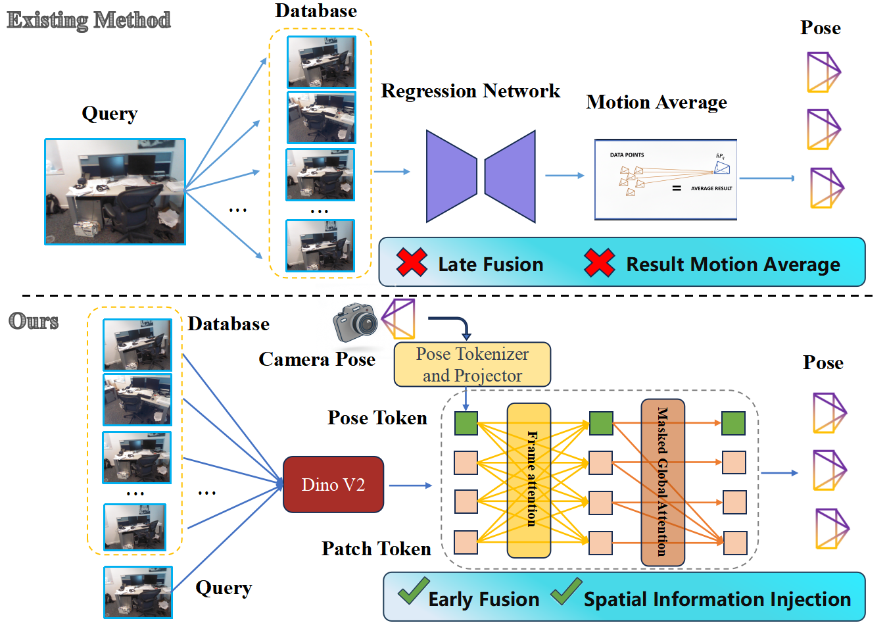
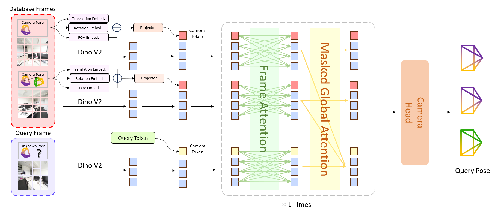
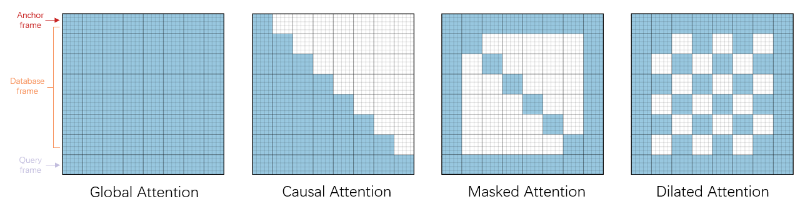
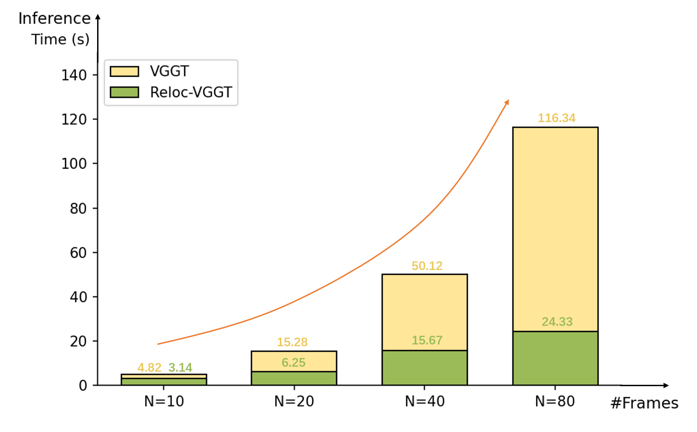

# Reloc-VGGT：用 VGGT 做早期多视图融合的视觉重定位

## 结论先行

- **一句话定位**：Reloc-VGGT 是 Reloc3r 的直接后继式方案，把 query image 与 K 张 posed source/database images 一起送入 VGGT backbone，用 relative pose tokenizer/projector 把 source 的已知位姿注入 Transformer，在网络内部做早期多视图几何融合，从而不用新场景训练就能直接回归 query 的绝对位姿。
- **核心差异**：Reloc3r 是「逐对 query-source 回归相对姿态，再在网络外做 rotation averaging + camera-center triangulation」的 late fusion；Reloc-VGGT 是「image tokens 与 source pose tokens 在 Transformer 内交互后直接估 query pose」的 early fusion。融合时机从网络外提前到了网络内，这是这篇工作的主线。
- **配套设计**：为把多帧输入的 global attention 成本压下来，论文提出 task-specific sparse mask attention，把注意力复杂度从 $O(N^2)$ 降到 $O(5N-5)$ （近似线性），代价是相对完整版有轻微精度损失。
- **论文证据**：ScanNet1500 pair-wise AUC@5/10/20 从 Reloc3r-512 的 34.79/58.37/75.56 提升到 36.35/58.62/75.90；7-Scenes 平均误差从 Reloc3r 的 0.041m/1.035° 到 0.031m/0.896°；Cambridge Average(4) 从 0.38m/0.52° 到约 0.37m/0.38°。提升幅度不大但方向一致。
- **工程状态**：GitHub 仓库截至 2026-06-04 只有一个内容为标题的 `README.md`，没有 license、模型、训练、推理、评测代码或权重。因此 `open_source` 记为 `false`，复现状态记为 `blocked-code-unavailable`。当前可复现实验应优先用 Reloc3r、MARePo/ACE、FastForward 或 MASt3R/feature-matching 管线做对照，Reloc-VGGT 作为高上限研究路线跟踪。

## 1. 这篇论文解决什么问题？

### 已确认的论文事实

- **问题定义**：视觉重定位需要从 query image 估计 6DoF camera pose。传统结构化定位依赖显式 3D map 与 2D-3D matching，构图和存储成本高；APR（absolute pose regression）需要每个场景单独训练，数据饥渴且不泛化；RPR（relative pose regression）能跨场景，但常用 pair-wise 回归 + 网络外融合，精度长期受限。
- **输入 / 输出**：输入 query image $I_q$ 、K 张检索到的 source/database images $\{I_{d_k}\}$ 以及这些 source images 的已知 6DoF poses $\{R,T\}_{d_k}$ ；输出 query 在 world coordinate system 下的绝对 pose $\{R,T\}_q$ 。
- **目标场景**：7-Scenes、Cambridge Landmarks 等 indoor/outdoor 视觉重定位，以及 ScanNet1500 / CO3Dv2 上的相对/多视图 pose evaluation。
- **训练设定**：论文称训练数据选择 follows Reloc3r，并在约 800 万（~8M）posed image pairs 上训练；图像裁剪并 resize 到 518 px width（VGGT 的输入约定）；采用两阶段训练——先冻结 VGGT ViT encoder/decoder 训练 pose tokenizer/projector，再 end-to-end 微调 decoder 与 attention blocks。

### 我的理解

Reloc-VGGT 的问题意识很明确：Reloc3r 已经证明「只做相对姿态回归 + motion averaging」能泛化，但它的多视图信息只在网络外部合并——每个 source 只与 query 单独配对，source 与 source 之间、以及多帧的联合几何约束，网络自己看不到，只能靠后处理的平均和三角化补回来。Reloc-VGGT 想让 source images、query image、source poses 在 VGGT 内部就交换信息，让网络在 attention 里同时看到所有 source 的外观与位姿，从而更早、更充分地利用 source-source 与 source-query 的几何关系。

这条路线和 MARePo/ACE 不同：Reloc-VGGT 不依赖 scene-specific coordinate head，也不需要每个新场景训练；它需要的是 posed database images 与 retrieval。它和 FastForward 更接近，但 FastForward 输出 image-to-scene correspondences 再 PnP，Reloc-VGGT 直接回归 query pose，几何可解释性更弱但推理更直接。

## 2. 方法概览

- **核心想法**：把 Reloc3r 的「网络外 late fusion」替换成「VGGT 内 early fusion」，靠一套 relative pose tokenizer/projector 把 source 的已知位姿变成可与 image token 对齐的 pose token 注入 Transformer；再用 query-centric 的 sparse mask attention 控制多帧推理成本。
- **一句话 pipeline**：`retrieval 得到 K 张 posed source images → 把 source poses 编码成 pose tokens、与 query/source image tokens 拼接 → VGGT-style Transformer 在 sparse mask attention 下做跨视图 early fusion → pose head 直接回归 query 的 {R,T}`。

### 2.1 架构解析

**整体结构（模块分解）**：

1. **VGGT backbone（多帧 ViT + alternating attention）**：Reloc-VGGT 采用 VGGT 作为几何 grounded 的 relative pose regression backbone。VGGT 把每帧图像切成 patch tokens 并配 register/camera tokens，通过 frame-wise 与 global attention 交替，让多帧 token 在网络内联合推理几何。Reloc-VGGT 继承这套多帧联合表达，作为 early fusion 的载体。
2. **Relative Pose Tokenizer and Projection（RPTP）**：对每个 source frame 的已知 pose，用 learnable Fourier embeddings 把 relative translation $\mathbf{t}$ 、rotation quaternion $\mathbf{q}$ 、FoV 参数 $\mathbf{f}$ 编码成高频特征，再经 MLP projector 投影成与 patch/register token 同维的 pose token $\mathbf{f}_{cam}$ 。这一步是把「几何位姿」翻译成「Transformer 能吃的 token」的关键接口。
3. **Sparse Mask Attention（SMA）**：面向 relocalization 定制的 attention mask，让 query pose token 与 anchor frame 保持稠密连接，对中间 source frames 走稀疏/扩张式连接，从而把 attention 成本从二次降到近似线性。
4. **Query pose head**：从融合后的 query 相关 token 直接回归 $\{R,T\}_q$ （quaternion + translation + FoV）。

**各模块数据流**：query 与 K 张 source images 经 VGGT 切成 image tokens；source poses 经 RPTP 变成 pose tokens；两类 token 一起进入带 SMA 的 Transformer 做 early fusion；最后 pose head 读出 query 的绝对位姿。注意 query 在推理时位姿未知，因此只有 source 帧带 pose token，query 帧不注入位姿——这避免了「假设 query pose 已知」的信息泄漏。

**关键设计选择及理由**：
- 用 VGGT 而非 DUSt3R/CroCo 双分支：VGGT 天生支持 >2 帧的联合 attention，正好承载多 source 的 early fusion，而 DUSt3R 类结构是成对设计，需要网络外聚合。
- 把 source pose 做成 token 而非几何变换硬编码：token 化让位姿信息以可学习方式与外观特征交互，网络能自适应地权衡「相信外观匹配」还是「相信已知位姿」。
- SMA 的 query-centric 设计：relocalization 的目标只有 query 一帧的位姿，没必要让所有 source 帧两两稠密 attention，query 附近的连接才是收益最高的部分。

### 2.2 核心原理

- **为什么 early fusion work**：Reloc3r 的 late fusion 在网络外做 rotation averaging + camera-center triangulation，本质是「先各自估相对位姿、再几何平均」，每个 pair 的估计相互独立，source 之间的互约束（比如两张 source 之间已知的相对几何）网络看不见。Reloc-VGGT 把所有 source 的外观 token 与位姿 token 一起送进 attention，网络在估 query pose 时能同时参考「多个 source 相对 query 的外观匹配」和「source 之间已知的空间布局」，相当于把多视图几何约束前置到特征层，减少了后处理平均带来的信息损失与尺度脆弱性。
- **关键机制/归纳偏置**：pose token 通过 Fourier embedding 引入高频位姿编码，让网络对平移/旋转的小变化更敏感（低频 MLP 难以拟合位姿这种需要高精度的量）；VGGT 的多帧 alternating attention 提供了「跨帧几何一致性」的归纳偏置；SMA 则把「query 才是唯一要预测的帧」这一任务先验编码进 attention 拓扑。
- **与前作在原理上的本质区别**：Reloc3r 的 metric scale 完全来自网络外 camera-center triangulation（网络本身不学 metric relative scale）；Reloc-VGGT 把多帧 + 已知 source pose 一起交给网络，理论上网络在特征层就能利用 source 的 metric 位姿约束 query 的 metric 位姿，融合与尺度恢复不再是彼此割裂的两步。

### 2.3 关键公式解析

**公式 (1)：多视图相对位姿回归的形式化目标**

$$ \{R,T\}_q = f_\theta\big(I_q,\ \{(I_{d_k},\ \{R,T\}_{d_k})\}_{k=1}^{K}\big) $$

- 符号： $I_q$ 是 query image； $I_{d_k}$ 是第 $k$ 张 source image； $\{R,T\}_{d_k}$ 是该 source 的已知 6DoF pose； $f_\theta$ 是以 VGGT 为骨干的网络； $\{R,T\}_q$ 是待估的 query 绝对位姿。
- 作用：这条式子明确了 Reloc-VGGT 与 Reloc3r 的接口差异——输入不是一对图像，而是 query 加上 K 个「图像 + 已知位姿」的 source，网络一次性吃进所有 source 并直接输出 query pose，而非逐对回归后再融合。

**公式 (2)：位姿的 Fourier 编码（pose tokenizer）**

$$ \gamma(\mathbf{t}) = \big[\sin(2^{l}\pi\mathbf{t}),\ \cos(2^{l}\pi\mathbf{t})\big]_{l=0}^{L_t-1},\quad \gamma(\mathbf{q}) = \big[\sin(2^{l}\pi\mathbf{q}),\ \cos(2^{l}\pi\mathbf{q})\big]_{l=0}^{L_d-1},\quad \gamma(\mathbf{f}) = \big[\sin(2^{l}\pi\mathbf{f}),\ \cos(2^{l}\pi\mathbf{f})\big]_{l=0}^{L_f-1} $$

- 符号： $\mathbf{t}\in\mathbb{R}^3$ 平移、 $\mathbf{q}\in\mathbb{R}^4$ 旋转四元数、 $\mathbf{f}\in\mathbb{R}^2$ 视场角参数； $l$ 是频率级别； $L_t=10,\ L_d=4,\ L_f=4$ 分别是三者的频带数。
- 作用：把连续的低维位姿量映射到高频正余弦空间，使网络更容易区分位姿的细微差异（NeRF/位置编码的同款动机）。平移用更多频带（ $L_t=10$ ），因为平移需要更高的空间分辨率。

**公式 (3)：pose token 的投影对齐**

$$ \mathbf{f}_{cam} = \mathrm{MLP}_{cam}\big(\gamma(\mathbf{x}),\ \gamma(\mathbf{q}),\ \gamma(\mathbf{f})\big) $$

- 符号： $\gamma(\cdot)$ 是上式的 Fourier 编码（ $\mathbf{x}$ 即平移 $\mathbf{t}$ ）； $\mathrm{MLP}_{cam}$ 是投影 MLP； $\mathbf{f}_{cam}$ 是最终注入 Transformer 的 pose token。
- 作用：把三路编码拼接后投影到与 image token 同维，使已知 source pose 能以 token 形态与 patch/register token 在 attention 中直接交互，这是 early fusion 的落地接口。

**公式 (4)：训练损失（位姿 + 旋转测地损失）**

$$ \mathcal{L}_{pose} = \sum_{i=0}^{K}\big(\lVert\hat{\mathbf{q}}_i-\mathbf{q}_i\rVert + \lVert\hat{\mathbf{t}}_i-\mathbf{t}_i\rVert + \lVert\hat{\mathbf{f}}_i-\mathbf{f}_i\rVert\big),\qquad \mathcal{L}_R = \arccos\!\Big(\frac{\operatorname{tr}(\hat{R}^{-1}R)-1}{2}\Big) $$

- 符号： $\hat{\mathbf{q}}_i,\hat{\mathbf{t}}_i,\hat{\mathbf{f}}_i$ 是第 $i$ 帧预测的四元数/平移/视场角， $\mathbf{q}_i,\mathbf{t}_i,\mathbf{f}_i$ 为真值； $\hat{R},R$ 是预测/真值旋转矩阵； $\operatorname{tr}(\cdot)$ 取迹。 $\mathcal{L}_R$ 是标准的旋转测地角误差。
- 作用： $\mathcal{L}_{pose}$ 对位姿各分量做直接回归监督； $\mathcal{L}_R$ 补上一个旋转空间的角度度量，避免四元数 L2 距离与真实旋转误差不一致的问题。二者共同约束 pose head 输出。

> 说明：上述公式为论文正文给出的形式；SMA 的复杂度关系 $O(N^2)\to O(5N-5)$ 是论文对注意力开销的形式化描述，非可微损失项。

### 2.4 训练与推理细节

- **训练目标 / 损失**：位姿回归损失 $\mathcal{L}_{pose}$ （quaternion + translation + FoV 的 L1/L2 项）加旋转测地损失 $\mathcal{L}_R$，对 K 帧求和。
- **两阶段训练**：先冻结 VGGT ViT encoder/decoder，单独训练 relative pose tokenizer/projector（让 pose token 学会与冻结的视觉特征对齐）；再解冻做 end-to-end 微调 decoder 与 attention blocks。这种「先对齐接口、后联合优化」的策略保护了 VGGT 预训练得到的几何先验，避免早期梯度破坏 backbone。
- **数据与预处理**：训练数据选择 follows Reloc3r（posed image pairs/多域数据），论文称在约 800 万（~8M）posed image pairs 上训练；图像裁剪并 resize 到 518 px width，符合 VGGT 的输入规格。
- **推理流程**：① retrieval 得到 query 的 top-K posed source images；② 对 source poses 做 RPTP 得到 pose tokens；③ 与 query/source image tokens 一起过带 SMA 的 VGGT Transformer；④ pose head 直接读出 query 绝对位姿。序列/长轨迹场景下 SMA 是让多 source 推理可行的关键。

## 3. 关键贡献

1. **把 Reloc3r 的 late fusion 改成 VGGT 内部 early fusion**：source pose token、source image token、query image token 一起参与跨视图空间推理，多视图几何约束前置到特征层。
2. **提出 Relative Pose Tokenizer and Projection（RPTP）**：用 Fourier embedding + MLP projector 让已知 source poses 以 token 形式对齐 2D patch/register tokens，成为 early fusion 的接口。
3. **提出 Sparse Mask Attention（SMA）**：面向 relocalization 的 query-centric attention pattern，把复杂度从 $O(N^2)$ 降到 $O(5N-5)$，让多 source frames / 长序列推理可行。
4. **跨 indoor/outdoor benchmark 验证**：在 ScanNet1500、CO3Dv2、7-Scenes、Cambridge 上报告优于 Reloc3r 的结果。

## 4. 实验与证据

| 维度 | 内容 |
|---|---|
| 数据集 | ScanNet1500、CO3Dv2、7-Scenes、Cambridge Landmarks |
| Baseline | Reloc3r、Map-free、ExReNet、RelocNet、APR/RPR 方法，以及 Efficient LoFTR / ROMA / DUSt3R / MASt3R / NoPoSplat 等非 PR 方法 |
| 指标 | Pair-wise AUC@5/10/20；multi-view RRA@15 / RTA@15 / mAA@30；median translation / rotation error；inference time |
| 主要结果 | ScanNet1500 pair-wise AUC@5/10/20：Reloc3r-512 34.79/58.37/75.56 → Reloc-VGGT 36.35/58.62/75.90（inference 25ms→45ms）；CO3Dv2 multi-view RRA@15/RTA@15/mAA@30 ≈ 96.1/94.5/83.4；7-Scenes 平均 0.041m/1.035° → 0.031m/0.896°；Cambridge Average(4) 0.38m/0.52° → ≈0.37m/0.38° |
| 消融 | Table 5：RPTP、SMA 组件；Table 6：Global / Causal / Sparse / Dilated mask 策略。SMA 单独使用时推理时间比 baseline 降约 35%，仅带来轻微精度下降 |
| 失败案例 | 论文正文主要强调效率/精度，未充分展开失败案例；应重点验证弱重叠、重复纹理、强动态、source pose 噪声与 retrieval 错误 |

### 4.1 效果与性能解析

- **主要结果解读**：Reloc-VGGT 在四个 benchmark 上都小幅但一致地优于 Reloc3r。ScanNet1500 pair-wise 上 AUC@5 提升约 1.6 个点（34.79→36.35），而 AUC@10/20 几乎持平（58.37→58.62、75.56→75.90）——这说明 early fusion 的收益主要在「高精度档」（严格阈值下更准），在宽松阈值下两者都已接近饱和。这个 pattern 符合直觉：early fusion 减少的是后处理平均引入的小误差，对粗定位帮助有限，对细定位帮助更明显。7-Scenes 的平移/旋转误差从 0.041m/1.035° 降到 0.031m/0.896°（平移降约 24%，旋转降约 13%），是相对更实在的提升。
- **性能与效率**：代价写在推理时间上——ScanNet1500 pair-wise 推理从 Reloc3r 的 25ms 升到 45ms（约 1.8×）。VGGT backbone 比 Reloc3r 的 DUSt3R 双分支更重，多帧联合 attention 也更贵，这正是引入 SMA 的动机。Figure 5 显示随 top-k source 数增加，global attention 的运行时间二次增长，而 SMA 近似线性，长序列 relocalization 才变得可行。

  

  

- **消融揭示的关键因素**：Table 5 拆开 RPTP 与 SMA 两个核心组件，验证 pose token 注入与稀疏注意力各自的贡献。Table 6 比较 Global / Causal / Sparse / Dilated 四种 mask：SMA 单独使用时推理时间较 baseline 降约 35%，仅带来轻微精度下降——即完整版 7-Scenes 平均 0.031m/0.896°，SMA 版约 0.039m/1.033°。这个 trade-off 是全文关键结论：稀疏化换来的速度收益远大于精度损失，在长序列上尤其划算。
- **可比性与协议一致性**：论文与 Reloc3r 对齐了数据集与指标（同一批 benchmark、同类 AUC/median-error 协议），横向可比性较好。但提升幅度普遍偏小（多为个位数百分点或厘米级），需注意 retrieval top-K 设置、source 选择是否严格一致——early fusion 的收益对 source set 质量敏感，若两法的 retrieval 协议不完全对齐，小幅差距的可靠性会打折扣。由于代码未开源，这些数字目前无法本地复核。

## 5. 局限与风险

### 论文明确承认

- Sparse mask attention 版本相对完整版存在小幅精度损失（如 7-Scenes 0.039m/1.033° vs. 0.031m/0.896°）。
- 论文写有「code and models will be publicly released upon acceptance」，即当前公开仓库还不能复现。

### 已确认的代码/仓库事实

- GitHub：<https://github.com/dtc111111/Reloc-VGGT>。2026-06-04 read-only check：`git ls-remote` HEAD 为 `9410312ba398784a661b2f5ff564a2110550cb52`。
- 仓库 top-level 只有 `README.md`，内容为 `# Reloc-VGGT`。未发现 license、requirements、模型代码、训练脚本、评测脚本、权重链接、数据处理脚本。
- 因此本笔记把 `open_source` 记为 `false`，`reproduction` 记为 `blocked-code-unavailable`。

### 我推断的风险

- Reloc-VGGT 继承 VGGT backbone，推理成本明显高于 Reloc3r（ScanNet1500 pair-wise 25ms→45ms），显存与部署成本也预计更高。
- Early fusion 更强，但也更依赖 source set 的质量：论文结果建立在 retrieved source images 及其准确 poses 之上，若 retrieval 出错、overlap 低或 source poses 有噪声，收益可能被抵消甚至反转，这部分需要实测。
- 对大规模 outdoor localization，直接 pose regression 仍可能落后强 feature-matching / SfM / PnP 管线；应把 FastForward、MASt3R、LightGlue 等作为同表对照。
- 许可证/权重风险：论文 arXiv 页面标注 CC BY-NC-SA 4.0（禁商用），但训练数据、训练细节、checkpoint、代码/权重许可均未随仓库公开，商用与复现前景不明。

## 方法谱系

- 取代/改进：[Reloc3r](../visual-localization/2025-reloc3r.md)（把其 late fusion + motion averaging 改为 VGGT 内 early fusion）
- 基于：VGGT（几何 grounded 多帧 Transformer backbone，arXiv 2503.11651）

## 6. 与相似方法对比

| Method | 相同点 | 不同点 | 何时选它 |
|---|---|---|---|
| Reloc3r | 都是 scene-agnostic RPR / feed-forward localization；都用 posed database images | Reloc3r 是 pair-wise relative pose + motion averaging（late fusion）；Reloc-VGGT 是 VGGT 内 early fusion + pose token | 当前复现与工程 baseline 选 Reloc3r；研究高上限 early fusion 关注 Reloc-VGGT |
| MARePo | 都是 query-time feed-forward pose regression | MARePo 需要 scene-specific coordinate map / ACE head；Reloc-VGGT 不需要每场景训练，但需要 posed source views | 有 target scene map、追求 metric pose 稳定性选 MARePo；无场景训练泛化选 Reloc-VGGT/Reloc3r |
| FastForward | 都用 posed mapping/database images，避免每场景训练 | FastForward 用 3D-anchored mapping features 预测 2D-3D correspondences 再 PnP；Reloc-VGGT 直接回归 pose | 需要更强几何可解释性和 scale transfer 时看 FastForward；想研究 direct pose regression early fusion 看 Reloc-VGGT |
| ACE | 都用于 visual relocalization | ACE 每场景训练 scene coordinate head 并用 RANSAC/PnP；Reloc-VGGT 是 scene-agnostic direct regression | 需要成熟可复现强 SCR baseline 选 ACE；研究 map-free/RPR 选 Reloc-VGGT/Reloc3r |
| MASt3R / DUSt3R | 都是 3D foundation model 生态相关 | MASt3R/DUSt3R 更偏 matching/reconstruction + solver；Reloc-VGGT 是专门重定位 pose regression | 做非 PR 强对照、需要 matching/PnP/SfM 时选 MASt3R |

## 7. 复现判断

- Git 地址：<https://github.com/dtc111111/Reloc-VGGT>
- 是否开源：否。当前只有占位 README，不能算可用开源代码。
- 是否开源训练：否。
- 代码可用性：不可用。
- 权重可用性：未公开。
- 数据可获得性：训练 follows Reloc3r，但 Reloc-VGGT 未发布自己的数据清单/脚本。
- 预计环境成本：未知；根据 VGGT backbone 与论文 inference time（45ms/pair），预计高于 Reloc3r。
- 最小复现路径：等待官方 release；release 后先锁定 commit/weights/license，复跑 ScanNet1500 pair-wise、7-Scenes 和 Cambridge 小表，再与 Reloc3r 相同 retrieval top-K 设置对齐。
- 是否值得复现：值得跟踪，但当前不值得安排工程复现。

## 8. 后续动作

- [x] 创建 Reloc-VGGT 单篇论文分析
- [x] 更新 `indices/papers.md`
- [x] 更新 `indices/directions.md`
- [x] 更新 `indices/methods.md`
- [x] 创建 visual localization 横向对比
- [ ] 等官方代码/权重 release 后创建 `reproductions/visual-localization/reloc-vggt/README.md`

## Sources

- Paper: <https://arxiv.org/abs/2512.21883>
- PDF: <https://arxiv.org/pdf/2512.21883>
- HTML: <https://arxiv.org/html/2512.21883>
- GitHub placeholder: <https://github.com/dtc111111/Reloc-VGGT>
- Related Reloc3r paper: <https://arxiv.org/abs/2412.08376>
- Related VGGT paper/repo: <https://arxiv.org/abs/2503.11651>, <https://github.com/facebookresearch/vggt>
