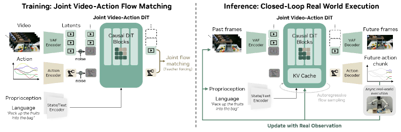

# DreamZero：World Action Models are Zero-shot Policies

## 结论先行

- **一句话定位**：DreamZero 把一个 pretrained video diffusion backbone（Wan2.1-I2V-14B）改造成机器人策略，提出 **World Action Model (WAM)** 范式——同一个模型联合去噪未来视频和未来动作，视频预测充当"视觉计划"，动作预测充当"从视觉计划反推控制"的 inverse dynamics。
- **最关键结果**：在 AgiBot G1 与 DROID-Franka 真机上，DreamZero 在未见环境/未见物体/未见任务上明显超过 VLA baselines。AgiBot seen task 平均 task progress 62.2%（最强 VLA 27.4%），unseen task 39.5%（最强 pretrained VLA 16.3%）；DROID unseen task 49% task progress / 22.5% success rate（GR00T N1.6 31%/12.5%，pi_0.5 33%/7.5%）。
- **核心机制不是"视频生成 + 动作头"这么浅**：真正吃紧的是 (1) joint video-action flow matching（式 3），(2) chunk-wise autoregressive + teacher forcing 训练，(3) 闭环时把真实观测写回 KV cache 抑制误差累积，(4) DreamZero-Flash 用**解耦噪声日程**（视频偏高噪、动作 uniform，式 5）换来单步/少步推理。
- **工程价值真实存在**：`dreamzero0/dreamzero` 已开源 Apache-2.0 代码、推理服务、DROID/AgiBot 权重入口、DROID 预处理数据与转换脚本。系统层通过 CFG parallelism + DiT caching + torch.compile/CUDA Graphs + NVFP4 量化 + Flash，把 GB200 单动作 chunk 延迟从 5.7s 压到约 150ms（38x），双 GB200 上做到 7Hz 闭环。
- **最大风险**：失败分析（Figure 16）显示机器人会**忠实执行错误的视频计划**——动作解码器没有独立语义纠错能力，上限被视频模型的语言跟随和物理预测质量牢牢绑定。长时记忆（>6s）未显式评估，高精度装配和边缘部署仍是弱项。
- **复现优先级**：先跑 DROID inference / sim sanity check，再考虑 DROID LoRA/full fine-tune；不要从 AgiBot 主结果开始，因为 500h AgiBot 数据尚未公开。

## 1. 这篇论文解决什么问题？

### 已确认的论文事实

- 论文认为 VLA 的强项是**语义泛化**，但对未见物理动作、未见环境和新技能泛化不足。根因是 VLA 从静态图文/VLM 继承语义先验，却缺乏足够强的时空动态先验（物体如何运动、接触后如何变化、场景如何演化）。
- DreamZero 把策略学习改成**联合建模**两个未来：
  - 未来视觉状态 $o_{l:l+H}$ ：世界接下来会怎样变化；
  - 未来动作 $a_{l:l+H}$ ：执行这些视觉变化所需的控制。
- 作者称这类模型为 **World Action Model (WAM)**，并强调 video 只是当前采用的世界建模目标，未来也可能换成触觉、力反馈或 latent state。
- 实验覆盖：AgiBot G1 移动双臂平台、Franka/DROID、YAM robot 与 human egocentric video 的跨 embodiment transfer；评估分 seen tasks、unseen tasks、post-training tasks、few-shot new embodiment adaptation。

### 初学者解释

普通 VLA 更像"看到图像和语言，直接吐动作"。DreamZero 更像先在脑内生成一段"如果任务做对，画面应该怎样变化"的短视频，再把这段视觉未来转成动作。好处是：视频模型在大规模视频上已经学到大量物体运动、接触、遮挡和场景演化的规律；机器人数据只需要把这些视觉变化对齐到具体关节动作，而不必从零学物理。

## 2. 方法概览

**核心想法**：不要让策略从图文语义直接跳到动作，而是让它先预测"视觉未来"，再用同一模型把视觉未来解码成动作，从而把 video diffusion 学到的世界物理先验注入控制。

**一句话 pipeline**：`(视觉上下文 + 语言 + 本体状态) → 冻结 VAE/text 编码 → autoregressive DiT 联合去噪 [video latent, action] → VAE 解码未来帧 + action decoder 输出动作 chunk → 执行后把真实观测写回 KV cache → 下一 chunk`。

### 2.1 架构解析

**模块分解（自底向上）**：

- **三路输入编码**：
  - visual context $o_{0:l}$ 经**冻结 VAE** 编码成 video latent；
  - language instruction $c$ 经**冻结 text encoder**；
  - proprioceptive state $q_l$ 经可训练 **state encoder**。
- **可训练新增参数**：主要是 state encoder、action encoder（把相对关节位置归一化后编码）和 action decoder，加上少量 action/state register token。video backbone（Wan2.1-I2V-14B DiT）基本沿用，多相机机器人数据通过把多个 camera view **拼接到单帧**处理，而不是改动 backbone 结构。
- **主干**：autoregressive DiT，把 video latent token、action token、state register 拼进同一序列联合去噪。
- **双输出头**：VAE 解码得到 future video frames；action decoder 得到 action chunks。

**数据流与 chunk 结构**（论文给出的具体配置）：

- 每个 chunk 固定 $K=2$ 个 latent frame，最多 $M=4$ 个 chunk，最长上下文约 6.6 秒。
- action horizon：AgiBot $H=48$ 、DROID $H=24$ 。
- 视频采样 5 FPS，动作采样 AgiBot 30Hz / DROID 15Hz，每 chunk 时间跨度 1.6 秒。

**关键设计选择**：

1. **复用 pretrained video backbone 而非从零训世界模型**——这是把视频先验带进策略的最省成本路径。
2. **chunk-wise autoregressive 而非单次生成整段**——保持原生帧率、可用 KV cache、支持异步执行（推理与机器人执行并行）。
3. **多视角拼帧**——避免为多相机重设计 backbone，代价是单帧分辨率被摊薄。

### 2.2 核心原理

**为什么 work**：视频未来是一个信息量远大于动作标签的监督信号。预测"下一秒画面"逼迫模型显式建模接触、遮挡、物体位移等物理动态，这正是纯 action regression 缺失的归纳偏置。动作头随后只需学一个相对简单的 **inverse dynamics**：给定"当前观测 + 预测的视觉未来"，反推需要什么动作。论文把联合分布显式分解为"视频预测 × 逆动力学"（式 1），从数学上说明了为什么视频预测能作为动作预测的强条件。

**关键机制/归纳偏置**：

- **KV cache 写回真实观测**：纯自回归视频生成的致命问题是误差累积（生成帧越走越偏）。DreamZero 在每个 action chunk 执行后，用**真实相机观测**替换缓存里的生成帧，相当于每步都做一次 grounding，把长 rollout 的漂移压回。
- **teacher forcing**：训练时当前 noisy chunk 可以看到 clean 的前序 chunk，使模型学会"在给定干净历史条件下预测未来"，与推理时"历史来自真实观测"的分布一致。
- **多样非重复数据友好**：因为视频监督比动作监督稠密，WAM 能从"多样但每个任务只有少量 demo"的数据中学习，而 VLA 往往需要大量同任务重复 demo。消融显示 500h diverse data（50%）远超 500h repetitive data（33%）。

**与前作本质区别**：不同于"先生成视频、再另用一个 IDM 反推动作"的两阶段路线（video prediction 与 action 分离，alignment 弱），DreamZero 是**单一端到端模型联合去噪** video 和 action，两者共享 DiT 表征，追求更深的 video-action alignment。也不同于 V-JEPA 那类 latent predictive world model——DreamZero 直接在 pixel/video diffusion 空间预测，再联合出动作。

### 2.3 关键公式解析

**式 (1) 联合分布分解**：

$$ \pi_\theta(o_{l:l+H}, a_{l:l+H} \mid o_{0:l}, c, q_l) = \pi_\theta(o_{l:l+H} \mid o_{0:l}, c, q_l)\,\cdot\,\pi_\theta(a_{l:l+H} \mid o_{0:l+H}, q_l) $$

- 符号： $o_{0:l}$ 是历史观测， $o_{l:l+H}$ 是未来 $H$ 步视觉状态， $a_{l:l+H}$ 是未来动作， $c$ 是语言指令， $q_l$ 是本体状态。
- 作用：把策略拆成"以语言为条件的**视频预测**"和"以视觉未来为条件的**逆动力学**"。这解释了 WAM 的核心信念——动作是视觉计划的函数，视频未来 $o_{l:l+H}$ 是动作预测的关键条件（注意动作项条件里包含了未来观测 $o_{0:l+H}$ ）。

**式 (2) flow matching 噪声插值**：

$$ z^k_{t_k} = t_k\, z^k_1 + (1 - t_k)\, z^k_0, \qquad a^k_{t_k} = t_k\, a^k_1 + (1 - t_k)\, a^k_0 $$

- 符号： $z^k$ 是第 $k$ 个 chunk 的 video latent， $a^k$ 是动作； $z^k_1 / a^k_1$ 是干净目标， $z^k_0 / a^k_0$ 是噪声（高斯先验）； $t_k \in [0,1]$ 是该 chunk 的噪声水平（ $t_k=1$ 干净、 $t_k=0$ 纯噪）。
- 作用：video 和 action 走**同一套 rectified-flow 线性插值**，为联合去噪提供统一目标。注意 DreamZero 里 video 和 action 共用同一 $t_k$ （coupled），这正是 Flash 要打破的地方。

**式 (3) 联合 flow matching 损失**：

$$ \mathcal{L}(\theta) = \mathbb{E}\left[ \frac{1}{K} \sum_{k} w(t_k)\, \bigl\lVert u_\theta\bigl([z^k_{t_k}, a^k_{t_k}];\, C_k, c, q_k, t_k\bigr) - v^k \bigr\rVert^2 \right] $$

- 符号： $u_\theta$ 是网络预测的**联合速度场**（同时输出 video 与 action 的 velocity）， $[z^k_{t_k}, a^k_{t_k}]$ 是拼接的 noisy video-action， $C_k$ 是干净前序 chunk 上下文（teacher forcing）， $v^k$ 是真实速度目标（rectified flow 下为 $z_1 - z_0$ ）， $w(t_k)$ 是按噪声水平的加权函数。
- 作用：这是训练主损失。一个网络、一份 velocity 目标，同时监督视频和动作，是"联合去噪"落到实处的地方。

**式 (5) DreamZero-Flash 解耦噪声日程**：

$$ t^{\text{video}}_k = 1 - \eta,\quad \eta \sim \mathrm{Beta}(\alpha, \beta)\ (\alpha > \beta), \qquad t^{\text{action}}_k \sim \mathcal{U}(0, 1) $$

- 符号： $\mathrm{Beta}(\alpha,\beta)$ 且 $\alpha>\beta$ 使 $\eta$ 偏大，于是 $t^{\text{video}}_k$ 偏小（视频偏**高噪**）；动作噪声保持均匀分布。
- 作用：训练时让模型学会"在**很嘈杂的视觉条件**下也能预测干净动作"。这样推理阶段视频可以只跑极少步（甚至单步）而动作质量不塌，匹配 few-step/single-step inference。这是 Flash 能约 2x 提速且 1-step 仍保 74%（vs 普通 1-step 52%）的原理——不是简单地少采样，而是训练分布就为少步而设计。

> 公式编号与精确形式（尤其 $w(t_k)$ 权重与 Beta 参数 $\alpha>\beta$ 的具体取值）以 arXiv HTML 提取为准，未逐字比对 PDF 排版；式 (1)(3) 已与 HTML 原文核对一致，式 (2)(5) 为标准 rectified-flow 形式，语义正确但排版编号可能有细微出入。

### 2.4 训练与推理细节

**训练目标 / 损失**：flow matching（式 3）+ teacher forcing。当前 noisy chunk 在 clean previous chunk 上下文中去噪，联合预测 video/action velocity。

**训练数据与规模**：

- AgiBot：~500h / 7.2K episodes 内部数据，长 episode、多 subtask、宽技能分布；DROID：公开 DROID。
- 超参（两者一致，来自 HTML 提取，未逐项比对 PDF 表格）：100K steps，batch size 128，backbone Wan2.1-I2V-14B-480P，video 5 FPS，chunk 时间跨度 1.6s。冻结 text encoder、image encoder、VAE，只训 state/action 相关新增参数与 DiT 适配。
- attention 策略（Figure 14）：训练用 **causal mask**，action token 能看历史视觉观测；推理时 conditional frame 的 KV cache 可复用。

**推理流程**：

1. jointly denoise 当前 chunk 的 video 和 action；
2. action decoder 输出动作 chunk 并执行；
3. 执行后把**真实相机观测**写回 KV cache 替换生成帧；
4. 异步进入下一 chunk（推理与执行并行）；
5. 动作平滑：2x 上采样 → Savitzky-Golay 滤波 → 2x 下采样。

**实时化系统栈（累积加速，Table 1，GB200）**：baseline 5.7s/action（1x）→ CFG parallelism（1.8x）→ DiT caching（5.4x，靠 velocity 余弦相似度把有效步数 16→4）→ torch.compile + CUDA Graphs（10.9x）→ kernel & scheduler 优化（14.8x）→ NVFP4 量化（16.6x，仅 GB200，QKV/Softmax 走 FP8、激活 NVFP4、累加 FP16）→ **DreamZero-Flash 合计 38x** → 约 150ms/chunk，双 GB200 达 7Hz 闭环。

## 3. 关键贡献

1. **把 video diffusion backbone 变成 joint video-action policy**：单一端到端模型联合去噪，追求比"视频生成 + 独立 IDM"更深的 video/action alignment。
2. **chunk-wise autoregressive WAM 适配闭环控制**：AR 结构保原生帧率、用 KV cache、每个 chunk 后注入真实观测抑制长 rollout 误差累积。
3. **证明多样非重复数据对 WAM 更友好**：500h diverse data 在 PnP Easy 上 50% vs 500h repetitive data 33% task progress。
4. **系统级 real-time 化**：CFG parallelism + DiT caching + torch.compile/CUDA Graphs + kernel/scheduler + NVFP4 + Flash，把 GB200 延迟 5.7s → ~150ms（38x）。
5. **跨 embodiment 视频-only transfer**：只用 10-20 分钟 YAM/human 视频（无动作标签）即可提升 AgiBot 未见任务 task progress，相对提升约 42%。

## 4. 实验与证据

| 维度 | 内容 |
|---|---|
| 数据集 | AgiBot G1 internal ~500h / 7.2K episodes；DROID；YAM 20min video-only；human egocentric 12min；YAM 30min play data |
| Baseline | GR00T N1.6、pi_0.5、from-scratch VLA、from-pretrained VLA、5B/14B WAM、AR/BD WAM |
| 指标 | task progress、success rate、inference latency、denoising steps、speedup |
| 主要结果 | AgiBot seen task DreamZero 62.2%（最强 VLA 27.4%）；AgiBot unseen task 39.5%，best pretrained VLA 16.3%；DROID unseen task DreamZero 49% task progress / 22.5% success rate，GR00T N1.6 31%/12.5%，pi_0.5 33%/7.5% |
| 跨 embodiment | 9 个 AgiBot unseen tasks 上 DreamZero 38.3%；+Human2Robot 54.3%；+Robot2Robot（YAM）55.4% |
| Flash | Table bussing：4-step DreamZero 83%（±6.1）；1-step DreamZero 52%（±10.2）；1-step DreamZero-Flash 74%（±10.1），约 2x faster |
| 消融 | diverse data 50% vs repetitive data 33%；14B WAM 50% vs 5B WAM 21%；VLA 5B/14B diverse data 均 0%；AR/BD task progress 相近但 AR 更平滑且 3-4x faster |
| 失败案例 | generated video 失败时执行也跟随错误视频计划；作者认为改善语言跟随和视觉规划会直接改善动作执行 |

### 4.1 效果与性能解析

**主要结果解读（不只搬数字）**：

- **seen vs unseen 的差距结构最能说明问题**。AgiBot seen task DreamZero 62.2% vs 最强 VLA 27.4%——2.3x；unseen task 39.5% vs 16.3%——2.4x。差距在 unseen 上不缩反稳，说明视频先验带来的是**泛化能力**而非单纯拟合训练分布。对比之下，VLA baseline 在 diverse data 上 task progress 直接掉到 **0%**，这是最刺眼的数据点：没有稠密视觉监督，纯 action regression 在"多样但少重复"的数据上几乎学不到可用策略。
- **DROID 上是可外部核查的分支**。unseen task 49%/22.5% 超过 GR00T N1.6（31%/12.5%）和 pi_0.5（33%/7.5%），且 DROID checkpoint 与数据已公开，是复现价值最高的入口。
- **跨 embodiment 提升是真信号**。9 个 AgiBot unseen task 上 base 38.3% → +Human2Robot 54.3% → +Robot2Robot（YAM）55.4%，且视频侧数据**无动作标签**，证明视频监督能跨本体迁移物理知识。

**性能与效率**：

- 参数量：Wan2.1-I2V-14B backbone，14B 级；论文做了 5B（Wan2.2）vs 14B 对比，14B WAM 50% 远超 5B WAM 21%，说明该范式吃 backbone 规模。
- 延迟/帧率：GB200 单 chunk ~150ms（38x 加速后），双 GB200 7Hz。相比部分 VLA 在消费级 GPU 上 >20Hz，DreamZero 仍偏重，边缘部署是短板。
- 推理步数：DiT caching 把有效去噪步 16→4；Flash 进一步支持 1-step。

**消融揭示的关键因素**：

- **数据多样性 > 数据量**：diverse 50% vs repetitive 33%（同为 500h）。
- **backbone 规模关键**：14B 50% vs 5B 21%。
- **AR vs BD（block diffusion）**：task progress 相近，但 AR 输出更平滑且快 3-4x——这是选 AR 做闭环的工程依据。
- **Flash 的价值在少步区间**：多步时 Flash 与普通模型接近，1-step 时 Flash 74% vs 普通 52%，证明解耦噪声日程是为 few-step 推理量身定制。

**可比性与协议一致性**：AgiBot 主结果依赖内部 500h 数据 + 真机 rollout，外部**无法完全复刻**；DROID 分支协议清晰、数据公开，是唯一可较严格外部对照的部分。task progress 是连续进度指标而非二值 success，跨论文对比时需注意指标定义差异。

## 5. 局限与风险

### 论文明确承认 / 展示

- WAM scaling laws 仍缺系统证据，模型/数据/compute 关系待研究。
- human video transfer 只验证了小规模 in-lab egocentric data，不等于已证明能从大规模野外人类视频稳定学机器人技能。
- 双 GB200 上 7Hz，相比部分 VLA 消费级 GPU >20Hz 仍偏重。
- 当前主要是短时 System 1 policy，无显式长时记忆训练/评估，~6.6s 视觉上下文不足以覆盖长 horizon。
- 高精度任务（插钥匙、精密装配）可能需要更密集精细 demo。

### 我推断的风险

- **视频计划错误直接转成动作错误**：Figure 16 表明 action decoder 无独立语义纠错能力，更像忠实执行视觉未来的控制器（例如先拿面包而不是先开烤箱）。上限被视频模型的语言跟随与物理预测质量绑定。
- **真实机器人指标外部复核有限**：AgiBot/YAM 内部数据与真机环境不可完全复现，公开复现主要落在 DROID/sim。
- **许可组合复杂**：代码 Apache-2.0 不代表权重、DROID 数据、Wan base 与下游使用都可商用；DROID checkpoint 明确 CC-BY-NC-4.0（非商用），AgiBot checkpoint 为 Apache-2.0。
- **工程门槛高**：Python 3.11、CUDA 12.9+、flash-attn、DeepSpeed、Wan weights、DROID 数据、TensorRT/GB200 路径都抬高复现成本。
- **README 与脚本命名漂移**：仓库快速迭代，复现脚本应按当前文件树和 docs 校验（README 示例 `droid_training.sh` 在当前快照不存在）。

## 方法谱系

- 基于（backbone）：Wan2.1-I2V-14B-480P video diffusion（外部模型，本库暂无单篇分析）。
- 同方向对比：[X-Foresight](../world-models/2026-x-foresight.md)、[X-World](../world-models/2026-x-world.md)、[小米自动驾驶世界模型](../world-models/2026-xiaomi-auto-world-model.md)（均为世界模型方向，但面向自动驾驶而非 manipulation policy）。

## 6. 与相似方法对比

| Method | 相同点 | 不同点 | 何时选它 |
|---|---|---|---|
| GR00T N1.x | 都是通用机器人策略 / VLA 方向 | GR00T 更偏 VLA/action model；DreamZero 把 pretrained video diffusion 的世界动态作为核心先验 | 要 NVIDIA 机器人 foundation baseline 看 GR00T；研究 video prior→action 看 DreamZero |
| pi_0 / pi_0.5 | 都是强 VLA/机器人策略 baseline | pi_0 系列偏 action expert / VLA scaling；DreamZero 主张 WAM 对多样非重复数据更友好 | 做公开 VLA baseline 和 DROID 对照时必须纳入 |
| V-JEPA 2 | 都利用世界模型思想做机器人 | V-JEPA 2 是 latent predictive model；DreamZero 是 pixel/video diffusion + action joint denoising | 追求高效 latent planning 看 V-JEPA；追求视频未来与动作强对齐看 DreamZero |
| Genie / video world model | 都从视频学动态 | Genie 更偏可交互/环境模拟；DreamZero 直接输出机器人动作 | 做仿真世界模型看 Genie；做真实机器人闭环策略看 DreamZero |
| X-Foresight / X-World | 都是 world model + action/control | XPeng 系列面向自动驾驶多相机未来预测/仿真；DreamZero 面向机器人 manipulation policy | 自动驾驶闭环看 X 系列；机械臂/移动双臂 manipulation 看 DreamZero |

## 7. 复现判断

- Git 地址：<https://github.com/dreamzero0/dreamzero>（本次核验 commit `ab790c198fbce33503358efbbd4187ce9a89adf3`，`LICENSE` 为 Apache-2.0，copyright NVIDIA）
- 是否开源：是。
- 是否开源训练：是。提供 DROID、新 embodiment、AgiBot/YAM 训练脚本与数据转换文档；但 AgiBot 500h 内部数据未公开，不能完整复刻主 AgiBot 训练。
- 代码可用性：高，但环境重（Python 3.11、PyTorch 2.8+、CUDA 12.9+、diffusers、deepspeed、transformers、ray、tensorrt、nvidia-modelopt）。
- 权重可用性：DreamZero-DROID（CC-BY-NC-4.0，非商用）与 DreamZero-AgiBot（Apache-2.0）均公开非 gated；base 为 `Wan-AI/Wan2.1-I2V-14B-480P`。
- 数据可获得性：`GEAR-Dreams/DreamZero-DROID-Data` 公开（源自 DROID 1.0.1，含 parquet + 三路 camera video）；raw DROID 转换需原始 1.0.1 + idle-frame filter JSON；AgiBot internal data 未释出。
- 预计环境成本：README 写分布式推理最低 2 GPU，测过 GB200/H100；训练默认脚本多为 8 GPU 级别。
- 最小复现路径：
  1. HF 下载 DreamZero-DROID checkpoint；
  2. 跑 WebSocket inference server + `test_client_AR.py`（或 `socket_test_optimized_AR.py`）；
  3. 若有 API host，跑 `eval_utils/run_sim_eval.py`；
  4. 下载 `DreamZero-DROID-Data`，用 `scripts/train/droid_training_wan22.sh` 或 `droid_training_lora.sh` 做小步数 sanity check；
  5. 后续再评估 full fine-tune 与 RoboArena/DROID real。
- 是否值得复现：值得。它是少数同时开源代码、权重、训练脚本和预处理 DROID 数据的 video-diffusion robot policy；但完整论文级真机结果无法完全外部复刻。

## 8. 后续动作

- [x] 创建 DreamZero 单篇论文分析
- [x] 更新 `indices/papers.md`
- [x] 更新 `indices/directions.md`
- [x] 更新 `indices/methods.md`
- [x] 创建 robot WAM / VLA policy 横向对比
- [ ] 后续创建 `reproductions/world-models/dreamzero/README.md`，先跑 DROID inference / sim sanity check
- [ ] 单独做 license audit：DreamZero code、DreamZero-DROID weights、DreamZero-AgiBot weights、DROID data、Wan base weights 的组合使用边界

## Sources

- Paper: <https://arxiv.org/abs/2602.15922>
- PDF: <https://arxiv.org/pdf/2602.15922>
- HTML (含公式/图): <https://arxiv.org/html/2602.15922>
- Project page: <https://dreamzero0.github.io/>
- GitHub: <https://github.com/dreamzero0/dreamzero>
- DreamZero-DROID checkpoint: <https://huggingface.co/GEAR-Dreams/DreamZero-DROID>
- DreamZero-AgiBot checkpoint: <https://huggingface.co/GEAR-Dreams/DreamZero-AgiBot>
- DreamZero-DROID-Data: <https://huggingface.co/datasets/GEAR-Dreams/DreamZero-DROID-Data>
