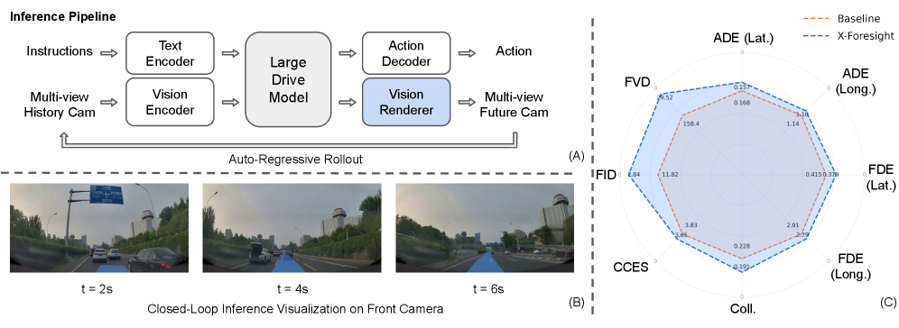
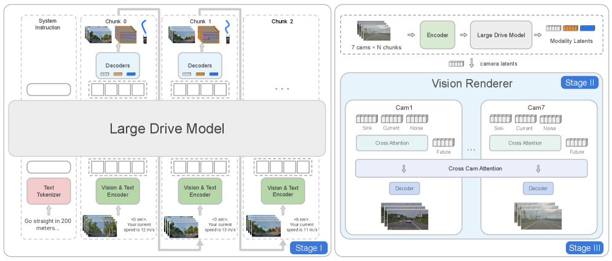
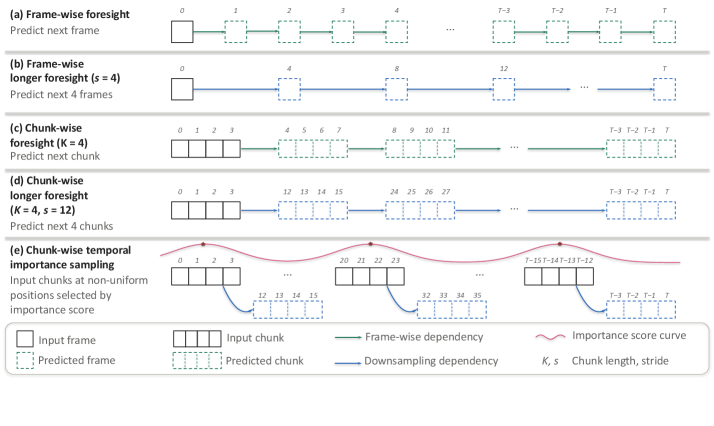

# X-Foresight：预测式世界模型驱动的视觉-动作因果规划网络

## 结论先行

- **定位**：X-Foresight 不是单纯视频生成模型，而是把 predictive world modeling 直接接入 VLA/Large Drive Model，让模型在统一 token 空间里**同时预测未来视觉 token 与未来动作**，用"预见未来"提升规划安全性。它来自小鹏（XPeng）PWM Team。
- **核心方法**：long-horizon chunk-wise autoregressive strategy。每个 chunk 内保留 dense frames 学瞬时动态，chunk 间拉开 stride 学长期因果，避免 naive next-frame prediction 只学平滑外推（视频 token 低熵冗余是根因）。
- **系统结构**：两大模块。**Large Drive Model (LDM)** 在统一 token 空间联合预测 action / camera / BEV token；**Vision Renderer** 用从 X-World 初始化的 diffusion renderer 把 LDM 预测的 camera token 渲染成 7 相机未来图像，再回灌 vision encoder 闭环。
- **关键训练技巧**：CLEF（curriculum learning with extended foresight，stride 从 1s 渐增到 3s）+ TIS（temporal importance sampling，按加速度峰值把监督集中到 safety-critical chunk）+ BSA（semi-causal block-sparse attention，训练提速 1.59x）。
- **实验结果**：生产规模 1024 GPU 下，相对 baseline collision rate 从 0.228% 降到 0.191%（相对下降 16.2%），Total CCES 从 3.8296 到 3.6535（改善 4.6%）；Vision Renderer 6s horizon 达 FID 2.84 / FVD 29.52。
- **开源状态**：论文文本 CC BY 4.0，项目页公开；截至 2026-07-02 未发现 GitHub、代码、训练代码、权重、数据或代码 license。当前复现 **blocked**。

## 1. 这篇论文解决什么问题？

### 已确认的论文事实

- **问题定义**：现有 VLA / 端到端自动驾驶模型偏 **reactive**，只根据历史观测行动，缺少对未来状态的内部模拟能力，难以提前处理碰撞、复杂交互、远期导航意图和交通灯变化等长时因果。论文主张让模型通过"从历史观测预测未来视频"来 internalize 物理动态与长期因果。
- **挑战 1：低熵视频 token**。不同于语义上彼此区分的文本 token，相邻视频帧高度相似、冗余度高（low-entropy），直接 next-frame prediction 容易退化成 trivial extrapolation（平滑外推），学不到物理世界知识。
- **挑战 2：时间尺度矛盾（temporal dilemma）**。瞬时动态需要 dense frame prediction；长期因果在长且可变的 horizon 上展开，密集预测所有未来帧成本太高，无法有效覆盖。
- **输入**：horizon 文本指令 + 7 相机历史观测 token + ego 状态/动作 token + query token。
- **输出**：未来动作/轨迹、未来 camera latent token、BEV 表征，以及由 Vision Renderer 生成的多相机未来图像。

### 初学者解释

X-Foresight 想解决"开车不能只看现在"的问题。普通 VLA 像看到红灯就刹，但如果它知道"车到停止线前红灯会变绿"就该继续走。X-Foresight 让模型在内部先"脑补"未来一段的视觉和动作，再据此做规划——相当于给驾驶模型装了一个会预演的世界模型。

## 2. 方法概览

- **核心想法**：把世界模型（预测未来视觉）与动作规划（预测未来动作）**联合训练在一个自回归 Transformer 里**，让"预测未来"成为规划的内在能力，而不是外挂一个视频生成器。
- **一句话 pipeline**：多模态 prompt（系统指令 + 历史 chunk）→ LDM chunk-wise 自回归预测未来 (action, camera, BEV) token → Vision Renderer 把 camera token 渲染成 7 相机图像 → 图像回灌 encoder 闭环。

### 2.1 架构解析

**整体结构（两大模块）**：

- **Large Drive Model (LDM)**：一个在统一 token 空间做 chunk-wise 自回归的 Transformer，联合执行 world prediction（未来图像 + BEV）与 action planning（未来动作）。这是"世界理解"的所在。
- **Vision Renderer**：一个 diffusion renderer，把 LDM 抽象、模糊的 camera token 解码成 photorealistic 的 7 相机未来图像。这是"像素细节"的所在。设计上刻意把抽象规划与高保真渲染解耦。

**LDM 的多模态 prompt 数据流**。论文把问题 formulate 成一个多模态 prompting 任务（见 2.3 公式 1）：一个全局 system prompt，后接一串 temporal chunk。每个 chunk $i$ 含四类 token：

- **text token $l_i$**：指定该步的 prediction horizon / 时间窗口；
- **observation token $O_i$**：用 ViT encoder 从 chunk 内多帧提取的多相机视频 token；
- **action/state token $A_i$**：ego 车辆状态，可从历史轨迹导出；
- **query token $Q_i$**：触发未来变量预测的占位 token。

为压缩 token 预算，**视频 token 在原位（in place）预测**，而非额外引入 visual query token。system prompt 提供任务指令与 ego 的 long-horizon 导航目标（高层上下文）。

**Vision Renderer 的数据流**。从 X-World（一个 DiT 视频生成器 + 3D causal VAE）初始化，但去掉 X-World 原有的 action / dynamic-agent / static-element / text conditioning 分支，新增 **camera-token cross-attention**。最终 renderer 只看 (i) multi-view history latents 和 (ii) LDM 预测的 camera token，输出多相机未来图像并回灌 vision encoder，闭合 AR inference loop。

**关键设计选择及理由**：

1. **抽象/像素解耦**：LDM 用 L2 回归 camera token，收敛到条件未来的低熵 summary——足以做 action grounding 与场景结构，但直接解码会模糊；因此把高保真交给 diffusion renderer。
2. **chunk-wise 而非 frame-wise**：一次预测一个 chunk（K 个连续帧并行），既保留 chunk 内密集帧的瞬时动态，又能通过 chunk 间 stride 拉长因果跨度。
3. **in-place 视频 token 预测**：省掉 visual query token，降低长序列 token 预算。

### 2.2 核心原理

- **为什么 work**：视频 token 低熵 + 时间尺度矛盾是 naive 预测失败的两个根因。X-Foresight 用 chunk-wise 结构一次性化解：**intra-chunk dense frames** 覆盖瞬时动态（不丢短时细节），**inter-chunk sparse transitions + 逐渐增大的 stride** 覆盖长期因果（用可控成本换长 horizon）。这让"预测未来"从平滑外推变成真正学习物理演化与因果。
- **关键机制/归纳偏置**：
  - **chunk-wise AR**：把"密集 vs 长程"从矛盾变成两个正交轴（chunk 内密度 + chunk 间跨度）。
  - **temporal importance sampling**：未来帧对世界知识学习的贡献不均——急刹、变道、路口等 safety-critical 时刻信息量最大。TIS 用加速度峰值打分，把有限的监督预算集中到这些片段（见公式 2、3）。
  - **semi-causal block-sparse attention**：chunk 内保持双向注意力（同一时刻多相机/多 token 可互看），chunk 间对 query token 施加因果掩码，防跨 chunk 未来泄漏；同时把稀疏 pattern 分给不同 attention-head 组，得到互补覆盖。
- **与前作的本质区别**：Sora / Genie / X-World 等视频世界模型只学"合成未来帧"；JEPA 类只学 latent 语义预测、绕开像素。X-Foresight 把预测式世界模型**嵌入 VLA**，让同一个模型既预测未来视觉又输出实时动作控制，并最终接 diffusion renderer 出多相机图像——是"世界模型 × 规划"的联合体，而非二者之一。

### 2.3 关键公式解析

**公式 (1)：多模态 prompt 序列**

$$ [\texttt{SYSTEM PROMPT}] \;\vert\; [l_0, O_0, A_0, Q_0] \;\vert\; [l_1, O_1, A_1, Q_1] \;\vert\; \ldots \;\vert\; [l_i, O_i, A_i, Q_i] $$

- 符号： $l_i$ 文本 token（horizon/时间窗）， $O_i$ 多相机 observation token， $A_i$ action/state token， $Q_i$ 触发预测的 query token；竖线分隔各 temporal chunk。
- 作用：定义 LDM 的输入布局——全局系统指令后跟随时间 chunk 序列，把"视觉+动作+意图"统一到一个自回归 token 流里。

**公式 (2)：TIS 的 chunk 重要性打分**

$$ w_k = \sum_{W \in \{W_1^k, W_2^k, W_3^k\}} \max_{t \in W}\left( \lambda_x \lvert a_x(t) \rvert + \lambda_y \lvert a_y(t) \rvert \right) $$

- 符号： $w_k$ 为候选步 $k$ 的重要性分； $a_x(t), a_y(t)$ 为 ego 轨迹的纵/横向加速度； $\lambda_x, \lambda_y \geq 0$ 为权重； $W_1^k, W_2^k, W_3^k$ 是围绕 $k$ 的三个不同尺度时间窗，各取窗内加权加速度幅值的最大值后再跨窗求和。
- 作用：用"加速度峰值"作为 safety-relevant 动态的代理——急加速/急转/急刹处得分高，即信息量大、对世界知识学习贡献大的 safety-critical 时刻。

**公式 (3)：温度缩放采样分布**

$$ p_k = \frac{w_k^{1/\tau}}{\sum_j w_j^{1/\tau}} $$

- 符号： $p_k$ 为候选步 $k$ 被选中的概率； $\tau > 0$ 控制分布 sharpness（ $\tau$ 越小越集中于高分步）。
- 作用：把重要性分转成采样概率，实现"importance-weighted focus"；论文额外约束相邻选中步的最大时间间隔，防止序列过稀、保证近期时间上下文仍被 well-conditioned（random + importance 的 hybrid 采样）。

**公式 (4)：LDM 联合训练损失**

$$ L_{\mathrm{total}} = L_{\mathrm{act}} + \alpha L_{\mathrm{cam}} + \beta L_{\mathrm{bev}} $$

其中三项分别为动作 L1、camera token L2、BEV L2：

$$ L_{\mathrm{act}} = \frac{1}{H}\sum_{i=1}^{H} \lVert \hat{\mathbf{a}}_i - \mathbf{a}_i \rVert_1, \quad L_{\mathrm{cam}} = \frac{1}{HV}\sum_{i=1}^{H}\sum_{v=1}^{V} \lVert \hat{\mathbf{o}}_i^{v} - g(\mathbf{I}_i^{v}) \rVert_2, \quad L_{\mathrm{bev}} = \frac{1}{H}\sum_{i=1}^{H} \lVert \hat{\mathbf{b}}_i - \mathbf{b}_i \rVert_2 $$

- 符号： $H$ 为 horizon 步数， $V$ 为相机数； $\hat{\mathbf{a}}_i$ 预测动作、 $\mathbf{a}_i$ 真值； $\hat{\mathbf{o}}_i^{v}$ 预测的 camera token、 $g(\mathbf{I}_i^{v})$ 为真实图像经 encoder 的 token（回归目标）； $\hat{\mathbf{b}}_i, \mathbf{b}_i$ 预测/真值 BEV； $\alpha, \beta$ 为权重。
- 作用：把"未来动作 + 未来视觉 + 未来 BEV"三个预测目标联合优化，是"世界预测与动作规划联合训练"的具体落地。注意 camera token 用 L2 回归多种可能未来，因而收敛到低熵均值（模糊），这正是需要独立 Vision Renderer 的原因。

**Vision Renderer 的 flow-matching 损失**（补充）： $\mathbf{y}_t = (1-t)\mathbf{y}_0 + t\,\mathbf{y}_1$ ，训练 velocity 网络 $\mathcal{L}_{\mathrm{velocity}}(\theta) = \mathbb{E}\left[ \lVert v_\theta(\mathbf{y}_t, t, \mathbf{c}) - (\mathbf{y}_1 - \mathbf{y}_0) \rVert_2^2 \right]$ ，其中 $\mathbf{y}_0 \sim p_{\mathrm{data}}$ 、 $\mathbf{y}_1 \sim \mathcal{N}(0, I)$ 、 $t \sim \mathcal{U}(0,1)$ 、 $\mathbf{c}$ 为 camera-token 条件。

### 2.4 训练与推理细节

**三阶段训练 pipeline**：

- **Stage I — LDM Pretraining**：训练 LDM 联合预测未来 (image token, BEV, action)，损失即公式 (4)。此阶段 renderer 用 ground-truth 未来轨迹条件、camera-token cross-attention 分支尚未启用。
- **Stage II — Renderer Pretraining**：并行地把 renderer 从 X-World 初始化，适配为在 **ground-truth ego action** 条件下合成 photorealistic 多相机帧（此时还不看 LDM 预测的 camera token）。优化器 **Muon**，恒定学习率 $8 \times 10^{-5}$ ，per-device batch size 1，128 GPU。
- **Stage III — Renderer Alignment**：把 renderer 拼到 LDM 上，**冻结 LDM**，只让 renderer 收梯度（采用 one-cycle cosine 学习率调度）；conditioning 从 ground-truth action 换成 **LDM 预测的 camera token**，并移除 stage II 的 action-conditioning 与 X-World 遗留的 dynamic-agent / static-element / text conditioning，使 renderer 只暴露于 (i) multi-view history latents 与 (ii) LDM 预测 camera token。

**长 horizon 扩展的三件套**：

- **CLEF**（Curriculum Learning with Extended Foresight）：short-to-long 课程，把 inter-chunk stride 从 **1s 渐增到 3s**，监督从"近帧外推"逐步转向"长跨度动态"，稳定长序列训练。
- **TIS**（Temporal Importance Sampling）：公式 (2)(3)，把监督集中到 safety-critical 未来（random + importance hybrid，含最大间隔约束）。
- **BSA**（Semi-Causal Block-Sparse Attention）：为长序列训练定制的稀疏掩码 + kernel，作为 FlashAttention-2 的 drop-in 替换（用稀疏结构降低注意力计算量，实测 per-step 24.50s→15.40s）。

**数据规模与超参**：约 280,000 小时驾驶数据、34M clips（最长 30s）、13.8T multi-view token；7 相机 360°；原始 12 Hz 下采样到 4 Hz 训练；约 200 个细粒度 auto-tag 聚合为 8 类场景。horizon 实验 $H \in \{1, 6, 21\}$ 。

**推理流程**：LDM chunk-wise 自回归 rollout → 每步产出 (action, camera token) → Vision Renderer 把 camera token 渲染成 7 相机图像 → 图像回灌 vision encoder → 进入下一步 AR，形成闭环。论文报告 t=2/4/6s 的闭环预测帧质量（Fig.1B）。

## 3. 关键贡献

1. **把 predictive world model 直接接入 VLA**（而非外挂视频生成器）：同一个 LDM 联合学习未来视觉、BEV 与实时动作控制，让"预见未来"成为规划的内在能力。
2. **long-horizon chunk-wise AR 解决视频低熵与长因果矛盾**：intra-chunk dense + inter-chunk sparse/长 stride，避免逐帧预测退化，同时控制训练成本。
3. **CLEF + TIS 提升长 horizon 的安全相关学习**：课程式扩展 stride + 加速度重要性采样，显著改善 collision / compliance / safety。
4. **X-World 初始化的 diffusion renderer 做高保真前端**：LDM 保持抽象世界理解（L2 低熵 summary），renderer 补像素细节；三阶段对齐让 renderer 消费 LDM 预测 token。
5. **BSA 长序列加速**：定制 semi-causal block-sparse attention，训练提速 1.59x，使生产规模长 horizon 训练可行。

## 4. 实验与证据

| 维度 | 内容 |
|---|---|
| 数据集 | XPeng 内部 280k 小时 / 34M clips / 13.8T token，7 相机，4 Hz |
| Baseline | 生产级 VLA（H=1 等价 reactive 模型；1024 GPU 同配训练） |
| 指标 | ADE/FDE（横/纵，米）、Coll.（碰撞失败率 %）、CCES 聚合（Compl./Comfort/Eff./Safety/Total，越低越好）、FID/FVD、per-step 时间 |
| 主要结果 | 生产规模下 Coll. 0.228%→0.191%（-16.2%），Total CCES 3.8296→3.6535（-4.6%） |
| 消融 | H∈{1,6,21}；CL/CLEF/TIS 逐项；BSA vs FA2；Renderer vs Camera Latent Decoder |
| 失败案例 | baseline 在空间远处事件（多出口环岛远出口）与时间远处事件（到达前红转绿）上失败，X-Foresight 均跟上 GT |

### 4.1 长 horizon 训练效果（H 消融，128 GPU）

| Method | ADE Lat ↓ | ADE Long ↓ | FDE Lat ↓ | FDE Long ↓ | Coll. ↓ | Compl. ↓ | Comfort ↓ | Eff. ↓ | Safety ↓ | Total ↓ |
|---|---:|---:|---:|---:|---:|---:|---:|---:|---:|---:|
| H=1 | 0.1923 | 1.2409 | 0.4881 | 3.1935 | 0.263 | 1.0000 | 1.0000 | 1.0000 | 1.0000 | 4.0000 |
| H=6 | 0.1864 | 1.2196 | 0.4691 | 3.1178 | 0.262 | 0.9756 | 0.9880 | 0.9833 | 0.9927 | 3.9396 |
| H=21 | 0.1810 | 1.2110 | 0.4571 | 3.0988 | 0.245 | 0.9533 | 1.0416 | 1.0094 | 0.9481 | 3.9524 |

### 4.2 CL / CLEF / TIS ablation（均从 H=6 checkpoint 初始化，128 GPU）

| Method | ADE Lat ↓ | ADE Long ↓ | FDE Lat ↓ | FDE Long ↓ | Coll. ↓ | Compl. ↓ | Comfort ↓ | Eff. ↓ | Safety ↓ | Total ↓ |
|---|---:|---:|---:|---:|---:|---:|---:|---:|---:|---:|
| Cont. H=6 | 0.1741 | 1.1807 | 0.4344 | 3.0087 | 0.270 | 0.9302 | 1.0515 | 0.9980 | 0.9726 | 3.9523 |
| +H=21, CL | 0.1718 | 1.1671 | 0.4277 | 2.9856 | 0.238 | 0.9326 | 1.0106 | 1.0003 | 0.9310 | 3.8745 |
| +H=21, CLEF | 0.1692 | 1.1571 | 0.4181 | 2.9421 | 0.230 | 0.9320 | 1.0076 | 0.9951 | 0.9387 | 3.8734 |
| +H=21, TIS | 0.1696 | 1.1578 | 0.4195 | 2.9413 | 0.216 | 0.9187 | 1.0043 | 0.9953 | 0.9264 | 3.8447 |

### 4.3 生产规模比较（1024 GPU；X-Foresight = H=21 + CLEF + TIS）

| Method | ADE Lat ↓ | ADE Long ↓ | FDE Lat ↓ | FDE Long ↓ | Coll. ↓ | Compl. ↓ | Comfort ↓ | Eff. ↓ | Safety ↓ | Total ↓ |
|---|---:|---:|---:|---:|---:|---:|---:|---:|---:|---:|
| Baseline | 0.1675 | 1.1387 | 0.4153 | 2.9117 | 0.228 | 0.9483 | 0.9505 | 0.9867 | 0.9441 | 3.8296 |
| X-Foresight | 0.1567 | 1.0982 | 0.3789 | 2.7924 | 0.191 | 0.8708 | 0.9413 | 0.9831 | 0.8583 | 3.6535 |

### 4.4 训练加速与渲染质量

| Attention implementation | Per-step time ↓ | Speedup |
|---|---:|---:|
| FlashAttention-2（causal mask） | 24.50s | 1.00x |
| BSA w/ tailored mask | 15.40s | 1.59x |

| Method | FID 1s ↓ | FID 6s ↓ | FVD 1s ↓ | FVD 6s ↓ |
|---|---:|---:|---:|---:|
| Camera Latent Decoder | 10.97 | 11.82 | 135.56 | 158.39 |
| Vision Renderer | 1.51 | 2.84 | 11.28 | 29.52 |

### 4.5 效果与性能解析

- **长 horizon 主要买到"安全"**：H 从 1 到 21，Safety 1.0000→0.9481、Coll. 0.263→0.245，说明"预见更远"直接改善避碰与合规；但 naive H=21 的 Comfort（1.0000→1.0416）、Efficiency（→1.0094）反而略退，因为一味拉长 horizon 会牺牲近期平顺性——这正是需要课程与采样调度的动机，也解释了 H=21 的 Total（3.9524）反而不如 H=6（3.9396）。
- **CLEF/TIS 把长 horizon 的"副作用"消掉**：从 Cont. H=6 到 +CL 再到 +CLEF，Coll. 0.270→0.238→0.230，Total 3.9523→3.8745→3.8734，课程式扩 stride 稳住了训练；**TIS 是最大杠杆**——把 Coll. 进一步压到 0.216（较 CLEF 相对 -6.1%），Total 降到全表最低 3.8447，且没有牺牲 Comfort，验证"把监督集中到 safety-critical 时刻"确实有效。
- **生产规模验证可扩展性**：1024 GPU 下相对 baseline，横/纵 ADE -6.4%/-3.6%，横/纵 FDE -8.8%/-4.1%，Coll. -16.2%，Safety -9.1%，Compliance -8.2%，Total CCES -4.6%。改进在更远的 FDE 上更明显，符合"预见未来主要帮长程"的机制预期。
- **抽象/像素解耦被数据证实**：Camera Latent Decoder（直接解 LDM token）FID 1s=10.97、6s=11.82，而 Vision Renderer FID 1s=1.51、6s=2.84——差近一个量级，印证 LDM 的 L2 camera token 是低熵模糊 summary，必须靠 diffusion renderer 补细节。6s FVD 仅 29.52（相对 1s 的 11.28 温和上升），说明 AR rollout 的漂移被 rollout-drift-mitigation 控制得较好。
- **效率**：BSA 把 per-step 从 24.50s 降到 15.40s（1.59x），是生产规模长序列训练可行的关键工程点。
- **可比性局限**：CCES 是内部 curated、比例化（H=1 归一到 1.0000）的 fail-rate 聚合，baseline 细节未完全公开，无法直接对齐任何公开 benchmark；所有对比都在同架构/同数据/同硬件的受控设定下做，属于内部相对改进而非绝对 SOTA 声明。

## 5. 局限与风险

### 论文/项目页确认

- 代码、权重、训练数据、评测脚本均未公开；论文文本为 CC BY 4.0，但不覆盖代码/模型/数据/资产。
- 结果基于 XPeng 内部数据与生产规模训练，外部无法复跑。
- baseline 细节未完全公开，CCES 指标体系是内部聚合。
- Vision Renderer 从 X-World 初始化，依赖 X-World 的未公开权重。

### 我的推断

- **指标解释风险**：CCES 为内部比例化 fail-rate 聚合，无法与公开 benchmark 对齐；跨机构横向比较需谨慎。
- **世界知识真实性风险**：future video/camera token prediction 提升了规划指标，但是否学到可迁移物理因果，仍需跨城市/天气/传感器/极端场景验证——L2 目标下 camera token 收敛到均值，可能主要学到统计外推而非严格因果。
- **闭环反馈风险**：renderer 生成图像再回灌 encoder，若 renderer 有系统性偏差，LDM 可能在长 rollout 中强化自身幻觉（6s FVD 上升虽温和，但更长 horizon 未测）。
- **工程门槛极高**：280k 小时、13.8T token、1024 GPU、Muon 优化器、X-World renderer 依赖、定制 BSA kernel，使外部完整复现基本不可行。

## 方法谱系

- 基于：[X-World](../world-models/2026-x-world.md)（Vision Renderer 的 DiT backbone 与 3D causal VAE 从 X-World 初始化）。
- 对照（未取代）：JEPA（latent 预测但绕开像素）、Sora / Genie（视频世界模型）、OpenVLA / RT-2 / PaLM-E（VLA）。

## 6. 与相似方法对比

| Method | 相同点 | 不同点 | 何时选它 |
|---|---|---|---|
| X-World | 都是 XPeng 世界模型，生成多相机未来视频 | X-World 是外部交互式世界仿真器；X-Foresight 把预测世界模型嵌入 VLA/LDM 用于规划+动作预测，并复用 X-World 做 renderer | 做可控仿真看 X-World；做 VLA 未来预测+规划改进看 X-Foresight |
| X-Cache | 都服务 X 系列 AR 世界模型 | X-Cache 是推理加速，不改规划/预测训练目标 | 部署加速看 X-Cache |
| JEPA / latent predictive models | 都强调抽象 latent 预测而非直接像素建模 | X-Foresight 最终接 diffusion renderer 出多相机图像并联合动作控制 | 研究抽象世界表示对照 JEPA；研究闭环图像反馈看 X-Foresight |
| OpenVLA / RT-2 / PaLM-E | 都是 VLA/embodied action 模型 | X-Foresight 补 predictive future modeling 与长 horizon causality | 做 VLA driving 时作为 "reactive→predictive" 升级路线 |
| Sora / Genie / video world models | 都从视频学世界动态 | X-Foresight 更自动驾驶/VLA 专用，输出动作和相机 token | 通用视频世界模型横向比较时纳入 |

## 7. 复现判断

- Git 地址：未发现公开 GitHub。
- 是否开源：否（论文文本 CC BY 4.0，代码/权重/数据未开源）。
- 是否开源训练：否。
- 代码可用性：无。
- 权重可用性：无（且依赖未公开的 X-World 权重）。
- 数据可获得性：内部 XPeng 数据不可得。
- 预计环境成本：生产规模 1024 GPU 级，外部不可行。
- 最小复现路径：当前不可复现。若后续开源，优先复跑小规模 H=1/H=6/H=21 与 CL/CLEF/TIS ablation，再验证 Vision Renderer 1s/6s FID/FVD。
- 是否值得复现：研究价值高但完整复现成本极高；更现实的是借鉴 **chunk-wise predictive supervision** 与 **temporal importance sampling** 两个可迁移思想。

## 8. 后续动作

- [x] 创建 X-Foresight 单篇论文分析
- [x] 深度重写（架构/原理/公式/训练推理/实验解析 + 3 张插图）
- [x] 更新 `indices/papers.md`
- [x] 更新 `indices/directions.md`
- [x] 更新 `indices/methods.md`
- [x] 创建 XPeng X 系列横向对比
- [ ] 若后续发布代码/权重，创建 `reproductions/world-models/x-foresight/README.md`

## Sources

- Paper: <https://arxiv.org/abs/2605.24892>
- HTML (v3): <https://arxiv.org/html/2605.24892v3>
- PDF: <https://arxiv.org/pdf/2605.24892>
- Project page: <https://x-foresight-1.github.io/en/>
