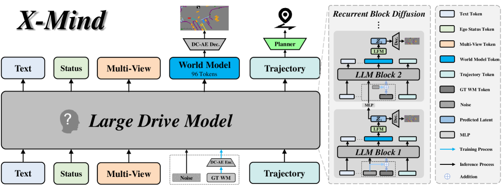
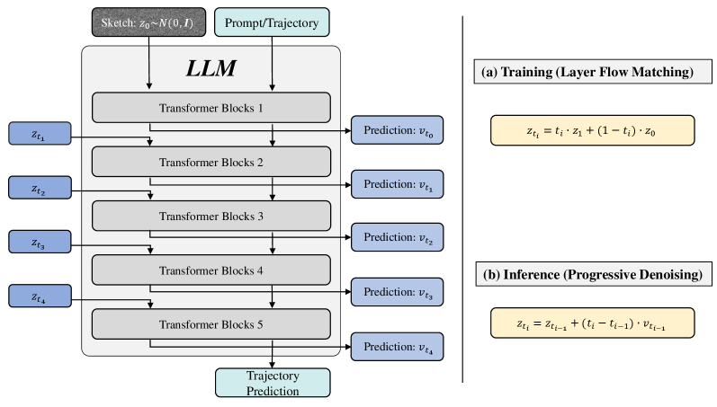
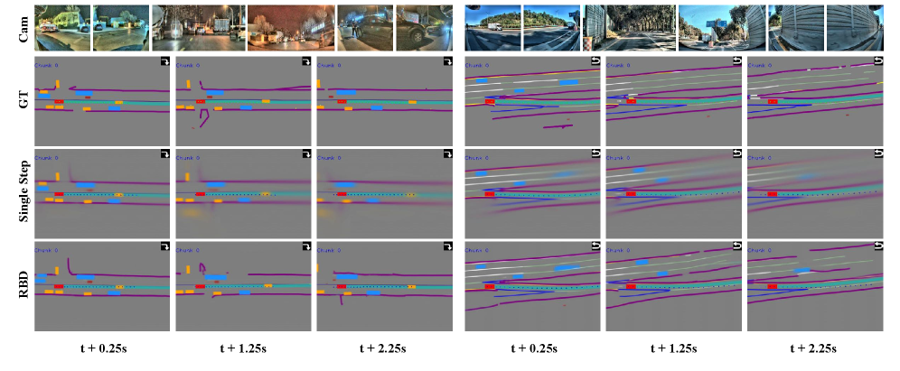

# X-Mind：把预测式世界模型内化为驾驶大模型的视觉思维链

## 结论先行

- **定位**：X-Mind 来自小鹏（XPeng）PWM Team，与 X-World / X-Foresight 同团队（共同作者 Xianming Liu）。它不把预测式世界模型（PWM）当外挂模块，而是**内化为 VLA 的 Visual Chain-of-Thought（视觉思维链）**：强制模型在输出动作前先"脑补"未来场景演化，再据此规划，使驾驶策略 grounded 于环境动态与未来后果。
- **核心矛盾是效率**，X-Mind 从两条线解决：(1) 用 **abstract sketch** 作为"mental canvas"——BEV 布局 + 抽象驾驶先验（导航意图、红绿灯、限速）——代替稠密未来帧，再经 **Deep Compression Autoencoder (DC-AE)** 把 12 帧未来压成 **仅 96 token**；(2) 用 **Recurrent Block Diffusion (RBD)**，把 diffusion 的多步去噪展开到大模型的各层里，折叠进**一次前向**，避免迭代采样。
- **代表性数值（均为 XPeng 内部数据、6s ADE，越低越好）**：Base 0.2399/1.2979（横/纵，米）→ Base+Sketch(RBD) **0.1765/1.1849**，且额外 token 从 Image 的 3584 / 3DGS 的 3072 降到 **96**，推理延迟仅 baseline 的 **1.1×**（Image/3DGS 分别是 22×/19×）。
- **RBD 的关键证据**：把去噪全放在最后一层（single-step）会导致 modality collapse，FID 高达 **67.30**；RBD 把 FID 压到 **9.59**，而相对 single-step 的额外延迟"minimal"（约 0.1×）。
- **消融揭示本质**：预测 12 帧未来（ADE 0.1765）优于重建当前帧（0.1866）与预测未来 1 帧（0.1840），证明增益来自**预测性 rollout 而非高保真重建**。
- **开源状态**：论文文本为 arXiv 非独占许可，项目页 https://x-mind.github.io ；截至 2026-07-02 未发现 GitHub、代码、训练代码、权重、数据或代码 license。复现 **blocked**。
- **证据强度提示**：全部实验在 XPeng 内部数据、内部 baseline 上做，未用任何公开 benchmark（nuScenes/NAVSIM），也未报 collision rate / PDMS / 闭环指标；数值属于**内部相对改进**，无法跨机构横向对齐。

## 1. 这篇论文解决什么问题？

### 已确认的论文事实

- **问题定义**：现有自动驾驶 VLA 主流是 direct perception-to-action mapping——直接从当前视觉回归控制量，缺少显式"预测未来时空演化"的认知能力。仅用稀疏 GT 轨迹监督易导致 **shortcut learning**（学捷径而非因果）。
- **两条现有 PWM 路线的缺陷**（论文的 motivation）：
  - **级联式（cascade PWM）**：先跑一个世界模型再规划，车端延迟高得不可接受；
  - **末端浅接（shallow terminal task）**：把世界模型当辅助 head 挂在网络末端，与主任务产生 **gradient conflict**，且引入 long-context 计算瓶颈，无法真正把"前瞻推理"注入 LLM backbone 的深层。
- **输入**：text token、ego status token、7 相机 multi-view token、trajectory token（沿用 X-Foresight/X-World 的数据协议，前视鱼眼 + 前窄 + 左前/右前/左后/右后 + 后视，360° 覆盖）。
- **输出**：世界模型 token（未来 sketch 的 96 token）+ 规划轨迹（经 inverse dynamics planner 从预测未来导出 ego trajectory）。
- **目标场景**：resource-constrained 车端平台上的实时端到端驾驶（low-latency）。

### 初学者解释

普通 VLA 像"看到什么马上打方向"，不会先想"如果我这么开，两秒后会怎样"。X-Mind 给驾驶大模型加了一个"想象步骤"：在真正给出动作前，模型先在脑内画一张**简笔的鸟瞰草图**（哪里是车道、别的车往哪走、红灯还是绿灯、导航要往哪拐、当前速度合不合规），推演未来两三秒的演化，再根据这张"脑补的未来"来规划。难点是"想象"很贵，所以 X-Mind 把这张草图压到只有 96 个 token，并把"逐步想清楚"的过程摊进模型本来就要跑的那一趟前向计算里，几乎不加延迟。

## 2. 方法概览

- **核心想法**：把 PWM **内化为 Visual CoT**——用 "world rollout prior to action" 的约束，强制模型先预测未来 sketch，再规划动作；预测得到的 dense、physics-grounded 未来为深层特征提供监督，抑制 shortcut learning。
- **一句话 pipeline**：多模态输入（text / status / multi-view / trajectory）→ Large Drive Model 内部生成未来 **abstract sketch（96 token，DC-AE 编码）**→ RBD 在 LLM 各层渐进去噪出未来 latent → DC-AE 解码可视化 + inverse dynamics planner 从未来导出 ego 轨迹。

### 2.1 架构解析

**整体结构（对照上图）**：

- **Large Drive Model (LDM)**：主干大模型，统一消费五类 token——Text、Ego Status、Multi-View、Trajectory，以及训练时注入的 World Model / GT WM token。它既是"世界理解"也是"动作规划"的载体，PWM 就长在它内部。
- **Visual Thinking Representation（abstract sketch）**：LDM 要预测的对象不是稠密像素未来，而是一张聚合了物理要素 + 驾驶先验的 BEV 草图（详见 2.2）。
- **DC-AE（Deep Compression Autoencoder）**：把 sketch 序列编码/解码到极紧凑的 latent。训练时 `DC-AE Enc.` 把 GT sketch 编成目标 latent $\mathbf{z}\_1$ ；推理时 `DC-AE Dec.` 把预测 latent 解回可视化 sketch。一个 12 帧未来 rollout 被压到 **96 token**。DC-AE 本身来自外部工作（Chen et al., 2024），X-Mind 复用而非重新设计。
- **Recurrent Block Diffusion (RBD)**：把 diffusion 的去噪步骤 unroll 到 LLM 的连续 Block 上（图右侧堆叠的 LLM Block 1/2/…），每个 Block 负责一个去噪 timestep，"iterative refinement" 被折叠进 backbone 的一次前向。
- **Inverse Dynamics Planner**：给定预测出的未来场景，用逆动力学规划器反解出满足运动学约束的 ego 轨迹（图顶部 Planner 分支）。

**数据流（训练 vs 推理，见图中蓝/黑箭头）**：训练时 GT WM 经 DC-AE Enc. 与 noise 一起作为监督；推理时噪声经各 LLM Block 渐进去噪成 predicted latent，DC-AE Dec. 解码，Planner 出轨迹。

**关键设计选择及理由**：

1. **sketch 而非稠密帧**：驾驶决策需要的是"谁在哪、往哪走、能不能走"，不是像素细节；抽象 sketch 用极低 token 预算保留决策相关信息，直接化解 long-context 瓶颈。
2. **PWM 内化而非末端外挂**：把未来预测作为 backbone 深层的 dense 监督（Visual CoT），而非末端 head，避免 gradient conflict，让"前瞻"真正进入表征。
3. **去噪折叠进 backbone**：RBD 让 diffusion 不再需要额外的多次前向采样，契合车端实时性。

### 2.2 核心原理

- **为什么 sketch + PWM 内化 work**：稀疏 GT 轨迹监督信息量低、易 shortcut；而"预测未来 sketch"给深层特征提供**稠密、物理接地**的监督，等价于逼模型建立环境动态的内部表征——这是消融里"预测未来 > 重建当前"的根因。
- **为什么 abstract sketch 够用**：sketch 把 physical elements（ego、动态体、车道/边界等 road topology）与 abstract driving priors（红绿灯状态、导航意图/路由走廊、限速合规）栅格化到同一张 BEV 画布上。决策所需的语义都在，像素冗余被丢弃，因此 96 token 足以承载 12 帧未来。
- **为什么 RBD work**：普通做法把整个 diffusion 放到网络最后一步执行 → 去噪步数被压缩到单步 → **modality collapse**（FID 67.30）。RBD 把 timestep 分摊到多个 LLM Block，每层完成一小步 flow-matching 去噪，等价于在一次前向里做了 5 步渐进 refine，既拿到多步去噪的生成质量（FID 9.59），又不付多次前向的代价。
- **与前作的本质区别**：X-Foresight 把未来预测做成"chunk-wise 自回归预测未来视觉 token + 动作"，再接 diffusion renderer 出多相机像素，偏"高保真视频前瞻"；X-Mind 走**极简抽象**路线——用 BEV sketch + 96 token + 单次前向去噪，把 PWM 作为 Visual CoT 直接内化，目标是**车端低延迟**而非像素保真。X-World 是外部可控仿真器，与两者定位不同。

### 2.3 关键公式解析

> 论文给出的是 flow-matching / RBD 与联合损失的形式化，下面逐符号解释。

**公式 (1)：flow-matching 的线性插值路径**

$$ \mathbf{z}_t = (1-t)\cdot\boldsymbol{\epsilon} + t\cdot\mathbf{z}_1, \quad t \in [0,1] $$

- 符号： $\boldsymbol{\epsilon} \sim \mathcal{N}(0,\mathbf{I})$ 为高斯噪声（ $t=0$ 端）； $\mathbf{z}\_1 = \text{Enc}\_{\text{DC-AE}}(\mathbf{B}\_{\text{gt}})$ 为 GT sketch $\mathbf{B}\_{\text{gt}}$ 经 DC-AE 编码得到的目标 latent（ $t=1$ 端）； $\mathbf{z}\_t$ 为中间插值态。
- 作用：定义 flow matching 的直线概率路径，训练目标是学从噪声流向目标 latent 的 velocity 场。

**公式 (2)：分层 timestep 调度**

$$ \{t_k\}_{k=0}^{5} = \{0,\ 0.1,\ 0.2,\ 0.4,\ 0.7,\ 1.0\} $$

- 符号：6 个 timestep 节点，对应 5 个去噪区间，分别绑定到 LLM 的 5 个 Block（ $\{l\_k\}\_{k=1}^{5}$ ）。
- 作用：把 diffusion 的时间轴离散化并**分摊到网络深度**——第 $k$ 个 Block 负责 $t\_{k-1}\to t\_k$ 的一步去噪，这是"把迭代折叠进一次前向"的具体调度（前密后疏，早期细分、后期大步）。

**公式 (3)：噪声注入（在指定层注入被插值的 latent）**

$$ \mathbf{h}^{(l_{\text{inject}})}_{\text{bev}} = \text{EncProj}\big((1-t_k)\cdot\boldsymbol{\epsilon} + t_k\cdot\mathbf{z}_1\big) + \text{PE}_{2\text{D}} $$

- 符号： $l\_{\text{inject}}$ 为注入层； $\text{EncProj}(\cdot)$ 把插值 latent 投影到 BEV hidden 空间； $\text{PE}\_{2\text{D}}$ 为二维位置编码； $\mathbf{h}^{(l\_{\text{inject}})}\_{\text{bev}}$ 为注入后的 BEV 隐状态。
- 作用：把"当前 timestep 的带噪 latent"作为 BEV 分支的输入隐状态喂进 backbone，让后续 Block 在此基础上去噪。

**公式 (4)：多层 velocity 预测**

$$ \mathbf{v}_k = \text{TransEnc}\big(\text{Proj}(\mathbf{h}^{(l_k)}_{\text{bev}})\big) $$

- 符号： $\mathbf{h}^{(l\_k)}\_{\text{bev}}$ 为第 $l\_k$ 个 Block 输出的 BEV 隐状态； $\text{Proj}$ 为投影， $\text{TransEnc}$ 为 Transformer encoder head； $\mathbf{v}\_k$ 为该层预测的 flow velocity。
- 作用：每个 Block 输出一个 velocity，用于把 latent 沿 flow 推进一步——这是 RBD 的"层即去噪步"。

**公式 (5)：推理时的 Euler 积分（progressive denoising）**

$$ \mathbf{z}_{k+1} = \mathbf{z}_k + (t_{k+1}-t_k)\cdot\mathbf{v}_k, \quad k=0,1,\ldots,4 $$

- 符号： $\mathbf{z}\_0 \sim \mathcal{N}(0,\mathbf{I})$ 起始噪声；逐层用该层 velocity $\mathbf{v}\_k$ 做一步 Euler 更新，5 步后得到 $\mathbf{z}\_5$ 即预测 latent。
- 作用：把多步 diffusion 采样等价成"沿网络深度逐 Block 前进"，一次前向即完成，不需外循环。

**公式 (6)：总损失**

$$ \mathcal{L}_{\text{total}} = \lambda_{\text{WM}}\mathcal{L}_{\text{WM}} + \lambda_{\text{plan}}\mathcal{L}_{\text{plan}} $$

- 符号： $\mathcal{L}\_{\text{WM}}$ 世界模型 rollout 损失， $\mathcal{L}\_{\text{plan}}$ 规划损失， $\lambda\_{\text{WM}}, \lambda\_{\text{plan}}$ 为权重。
- 作用：端到端联合优化"预测未来"与"规划动作"，把 Visual CoT 与控制目标绑在一起。

**公式 (7)：世界模型损失（flow + 图像重建）**

$$ \mathcal{L}_{\text{flow}} = \frac{1}{K}\sum_{k=1}^{K}\lVert \mathbf{v}_k - \mathbf{v}^{*}\rVert_2^2, \qquad \mathcal{L}_{\text{img}} = \lVert \hat{\mathbf{B}}^{(r)} - \mathbf{B}_{\text{gt}}\rVert_2^2 + \lambda_{\text{lpips}}\,\text{LPIPS}(\hat{\mathbf{B}}^{(r)}, \mathbf{B}_{\text{gt}}) $$

$$ \mathcal{L}_{\text{WM}} = \lambda_{\text{flow}}\mathcal{L}_{\text{flow}} + \lambda_{\text{img}}\mathcal{L}_{\text{img}} $$

- 符号： $\mathbf{v}^{*}$ 为 flow 的 GT velocity（即 $\mathbf{z}\_1-\boldsymbol{\epsilon}$ 方向）， $K$ 为去噪步数； $\hat{\mathbf{B}}^{(r)}$ 为解码重建的 sketch， $\mathbf{B}\_{\text{gt}}$ 为 GT sketch， $\lambda\_{\text{lpips}}$ 为感知损失权重。
- 作用： $\mathcal{L}\_{\text{flow}}$ 监督各层 velocity 学准去噪方向； $\mathcal{L}\_{\text{img}}$ （L2 + LPIPS）保证解码出的 sketch 在像素与感知上接近 GT，稳住生成质量。

**公式 (8)：运动学规划损失（Kinematic Planning Loss）**

论文以 L1 监督**纵向加速度**与**yaw rate（ $\omega\_{\text{yaw}}$ ）**等运动学量，从预测的未来经 inverse dynamics planner 反解 ego 轨迹，保证 kinematic compliance（原文未给该式完整闭式，此处按其文字描述形式化）。

- 符号： $\omega\_{\text{yaw}}$ 为偏航角速度，配合纵向加速度构成运动学控制量。
- 作用：让规划输出满足车辆运动学约束，而非在轨迹空间自由回归，降低不可执行轨迹的风险。

### 2.4 训练与推理细节

- **训练目标**：公式 (6) 的联合损失。WM 分支用 flow-matching（公式 7 的 $\mathcal{L}\_{\text{flow}}$ ）+ sketch 重建（L2 + LPIPS）；规划分支用运动学 L1。训练时 GT sketch 经 DC-AE 编成 $\mathbf{z}\_1$ 作为 flow 目标端。
- **数据与规模**：XPeng 内部数据 ~280,000 小时连续驾驶、切成 34M clips、共 13.8T token；分布约 **86.8% urban / 13.2% highway**；**实验只用了 1/8 的数据**。7 相机 360°，数据协议同 X-Foresight，硬件配置同 X-World。**未使用任何公开 benchmark**。
- **推理流程**：多模态 token 输入 LDM → 从噪声 $\mathbf{z}\_0$ 出发，沿 5 个 LLM Block 做公式 (5) 的 progressive denoising 得未来 latent → DC-AE 解码可视化 sketch（96 token 对应 12 帧未来）→ inverse dynamics planner 从预测未来导出 ego 轨迹。整个"想象未来 + 规划"折叠进 backbone 的一次前向，实测总延迟仅 baseline 的 1.1×。

## 3. 关键贡献

1. **Predictive Reasoning via Visual CoT**：把物理推理 formulate 成"未来世界预测"，将 PWM **内化为 VLA 的视觉思维链**，强制 world rollout 先于 action，给深层特征提供稠密物理监督（对抗 shortcut learning）。
2. **紧凑视觉思维表征（abstract sketch + DC-AE）**：用 BEV + 抽象驾驶先验的 mental canvas 代替稠密未来帧，DC-AE 把 12 帧未来压到 96 token，直接化解 long-context 瓶颈（对比 Image 3584 / 3DGS 3072）。
3. **Recurrent Block Diffusion（RBD）+ Layer Flow Matching**：把 diffusion 去噪 unroll 到 LLM 各层，一次前向完成多步渐进去噪，FID 从 single-step 的 67.30 降到 9.59，延迟几乎不变。
4. **车端可部署**：整体做成 low-latency（1.1× baseline），把大规模认知推理落到 resource-constrained 车载平台，并保持有竞争力的端到端规划精度。

## 4. 实验与证据

> 说明：全部实验在 XPeng 内部数据 + 内部 baseline 上进行，未用公开 benchmark，也未报 collision rate / PDMS / 闭环仿真指标。以下数字均为论文原文。

| 维度 | 内容 |
|---|---|
| 数据集 | XPeng 内部 ~280k 小时 / 34M clips / 13.8T token（实验用 1/8），7 相机，86.8% 城区 / 13.2% 高速 |
| Baseline | 标准 VLA（direct perception→action）；Base+Image（3584 token）；Base+3DGS（3072 token）；Single-step 去噪 |
| 指标 | Extra Tokens、ADE Lat./Lon.@6s（米，越低越好）、Inference（相对 baseline 倍数）、FID（未来预测质量） |
| 主要结果 | Base+Sketch(RBD) 6s ADE 0.1765/1.1849，额外 96 token，延迟 1.1×；FID 9.59 |
| 消融 | 场景表征（Image/3DGS/Sketch）；diffusion 架构（Single-step vs RBD）；重建 vs 未来生成（当前/未来1帧/未来12帧）；结构化 sketch GT 分项（红绿灯/导航/限速） |
| 失败/局限 | 无公开 benchmark、无 collision/闭环指标；DC-AE 依赖外部工作 |

### 4.1 场景表征对比（Table 1）

| Method | Extra Tokens | ADE Lat. / ADE Lon. @6s ↓ | Inference ↓ |
|---|---:|---:|---:|
| Base | 0 | 0.2399 / 1.2979 | 1.0× |
| Base + Image | 3584 | 0.2003 / 1.2456 | 22.0× |
| Base + 3DGS | 3072 | 0.1964 / 1.2247 | 19.0× |
| **Base + Sketch (Ours)** | **96** | **0.1765 / 1.1849** | **1.1×** |

### 4.2 Diffusion 架构对比（Table 2）

| Method | Inference ↓ | FID ↓ | ADE Lat. / ADE Lon. ↓ |
|---|---:|---:|---:|
| Base | 1.0× | – | 0.2399 / 1.2979 |
| Base + Sketch (Single Step) | 1.1× | 67.30 | 0.1783 / 1.1938 |
| **Base + Sketch (RBD)** | 1.1× | **9.59** | **0.1765 / 1.1849** |

### 4.3 重建 vs 未来生成（Table 3）

| Sketch Target | FID ↓ | ADE Lat. / ADE Lon. ↓ |
|---|---:|---:|
| Current frame（重建当前） | 8.97 | 0.1866 / 1.2132 |
| Future 1 frame | 9.05 | 0.1840 / 1.2124 |
| **Future 12 frames** | 9.59 | **0.1765 / 1.1849** |

### 4.4 效果与性能解析

- **抽象 sketch 是"精度—成本"的最优点**：Image（3584 token）与 3DGS（3072 token）都能改善规划，但 token 与延迟爆炸（22×/19×），因为它们是 reconstruction-focused、携带大量决策无关的像素/几何冗余。Sketch 只用 96 token、1.1× 延迟就拿到全表最好的 ADE（0.1765/1.1849），验证"决策要的是抽象语义而非稠密像素"这一核心假设。相对 Base，横/纵 ADE 分别 **-26.4% / -8.7%**。
- **RBD 是生成质量的关键，且几乎免费**：Single-step 把 diffusion 压成一步导致 modality collapse（FID 67.30，生成塌成模糊均值），RBD 用"层即去噪步"把 FID 打到 9.59（相对 single-step **约 -86%**），而延迟同为 1.1×（相对 single-step 仅 +0.1× 级别）。定性图（Fig.4）里 RBD 的未来 sketch 明显比 single-step 更贴 GT、结构更清晰。注意：更好的 FID 也带来更低的 ADE（0.1783→0.1765），说明**更准的未来想象直接转化为更好的规划**。
- **增益来自"预测"而非"重建"**：Table 3 里，重建当前帧 FID 最低（8.97，因为任务最简单）但 ADE 最差（0.1866）；随着监督从"当前帧→未来 1 帧→未来 12 帧"推进，FID 略升（8.97→9.59，任务变难）但 ADE 单调变好（0.1866→0.1840→0.1765）。这条**反向趋势**是全文最有说服力的证据：规划增益来自预测性 rollout（逼模型建模动态与因果），而非把画面重建得多逼真。
- **效率结论**：把"想象未来"折叠进 backbone 一次前向，使整体延迟只比纯 reactive baseline 高 10%，这是论文声称"可部署到车端"的核心依据。
- **可比性局限**：所有对比都在内部数据/内部 baseline 的受控设定下做，FID/ADE 无法对齐任何公开 benchmark；且未报安全相关的 collision / 闭环指标，"competitive end-to-end performance" 更多是相对自家 baseline 的相对改进。

## 5. 局限与风险

### 论文/项目页确认

- 代码、权重、训练数据、评测脚本均未公开；论文文本为 arXiv 非独占许可，不覆盖代码/模型/数据。
- 全部实验基于 XPeng 内部数据（且只用 1/8），未使用任何公开 benchmark，外部无法复跑或对齐。
- DC-AE 直接复用外部工作（Chen et al., 2024），论文未给其架构细节。
- 运动学规划损失（公式 8）在原文以文字描述为主，未见完整闭式。

### 我的推断

- **指标可信度风险**：无 collision rate、无 PDMS、无闭环仿真，仅 ADE + FID。ADE 是开环位移误差，对"是否安全避险"不敏感；"competitive"缺乏公开可比锚点，跨机构横向比较需极谨慎。
- **sketch 表征的信息上限**：抽象 sketch 丢弃像素细节，遇到 sketch 语义未覆盖的长尾（异形障碍、罕见交通元素）可能"想象"不到，规划随之失效——这类失败在开环 ADE 上不易暴露。
- **RBD 的层-步绑定风险**：把 5 个去噪步硬绑到 5 个 LLM Block，去噪能力与网络深度耦合；换 backbone、改层数或调 timestep 调度（{0,0.1,0.2,0.4,0.7,1.0}）的稳健性未知。
- **闭环幻觉风险**：与 X-Foresight 同源，预测未来再据此规划，若 sketch 预测系统性偏差，规划可能被自身幻觉误导；论文未做长 horizon 闭环 rollout 漂移分析。
- **工程门槛高**：280k 小时数据、13.8T token、7 相机、X-World/X-Foresight 同款数据与硬件协议，外部完整复现基本不可行。

## 方法谱系

- 基于：[X-World](../world-models/2026-x-world.md)（沿用其 7 相机数据 schema 与硬件配置；同 PWM Team）。
- 基于：[X-Foresight](../world-models/2026-x-foresight.md)（沿用其数据处理协议；同为"把 PWM 接入 VLA"的思路，X-Mind 走更极简的抽象 sketch + 单次前向去噪路线）。
- 对照（未取代）：3DGS 类重建表征（作为 baseline 被对比）、DC-AE（外部工作，作为编码器复用）。

## 6. 与相似方法对比

> 同方向横向对比详见 [XPeng X 系列世界模型对比](../../comparisons/world-models/xpeng-x-series-world-models.md)。

| Method | 相同点 | 不同点 | 何时选它 |
|---|---|---|---|
| [X-Foresight](../world-models/2026-x-foresight.md) | 都把 PWM 接入 VLA，用未来预测改进规划；同 PWM Team | X-Foresight 用 chunk-wise AR 预测未来视觉 token + 动作，再接 diffusion renderer 出多相机像素（高保真、生产规模）；X-Mind 用 BEV abstract sketch + 96 token + RBD 单次前向（极简、车端低延迟） | 要高保真未来视频/生产规模看 X-Foresight；要车端实时、极低 token 预算看 X-Mind |
| [X-World](../world-models/2026-x-world.md) | 同团队、同数据/硬件协议 | X-World 是外部可控多相机生成仿真器（closed-loop simulation/数据工厂）；X-Mind 是 VLA 内部的 Visual CoT | 要可控闭环仿真/造数据看 X-World；要驾驶策略本身的前瞻推理看 X-Mind |
| Base + 3DGS / Image（论文 baseline） | 都想给 VLA 补空间/未来信息 | 重建式表征 token 爆炸（3072/3584）、延迟 19×/22×；X-Mind 抽象 sketch 仅 96 token、1.1× | 需要显式几何重建时用 3DGS；追求决策效率用 sketch |
| JEPA / latent predictive models | 都强调抽象 latent 预测而非稠密像素 | X-Mind 的 latent 是可解码 BEV sketch，且用 RBD 生成、逆动力学出轨迹 | 研究通用抽象世界表示对照 JEPA；研究车端可部署 Visual CoT 看 X-Mind |

## 7. 复现判断

- Git 地址：未发现公开 GitHub（仅项目页 https://x-mind.github.io ）。
- 是否开源：否（论文文本 arXiv 非独占许可，代码/权重/数据未开源）。
- 是否开源训练：否。
- 代码可用性：无。
- 权重可用性：无。
- 数据可获得性：XPeng 内部数据不可得；未用任何公开 benchmark，无法用公开数据近似复跑。
- 预计环境成本：数据与硬件协议同 X-World/X-Foresight（生产规模），外部不可行。
- 最小复现路径：当前不可复现。若后续开源，优先在公开驾驶数据上复刻 (i) abstract sketch + DC-AE 的 96-token 表征、(ii) RBD/Layer Flow Matching 的"层即去噪步"、(iii) Table 3 的"重建 vs 未来生成"趋势验证。
- 是否值得复现：完整复现成本极高；更现实的是借鉴两个可迁移思想——**用抽象 BEV sketch 作为低 token 的 Visual CoT 监督**，以及 **把 diffusion 去噪折叠进 backbone 层的 RBD** 以实现单次前向生成。

## 8. 后续动作

- [x] 创建 X-Mind 单篇论文分析（深度模板 + 3 张插图）
- [ ] 更新 `indices/papers.md`
- [ ] 更新 `indices/directions.md`
- [ ] 更新 `indices/methods.md`
- [ ] 更新 `comparisons/world-models/xpeng-x-series-world-models.md`，把 X-Mind 纳入 X 系列横向对比
- [ ] 若后续发布代码/权重，创建 `reproductions/world-models/x-mind/README.md`

## Sources

- Paper (abs): <https://arxiv.org/abs/2606.28758>
- HTML (v1): <https://arxiv.org/html/2606.28758v1>
- PDF: <https://arxiv.org/pdf/2606.28758>
- Project page: <https://x-mind.github.io>
- 关联前作：X-World <https://arxiv.org/abs/2603.19979> ；X-Foresight <https://arxiv.org/abs/2605.24892>
