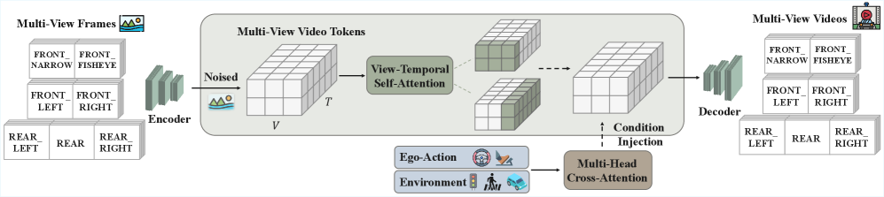
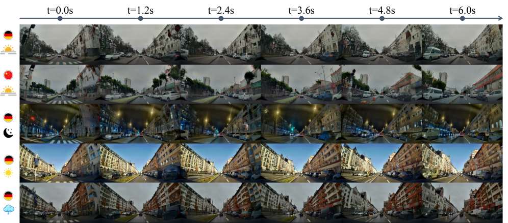
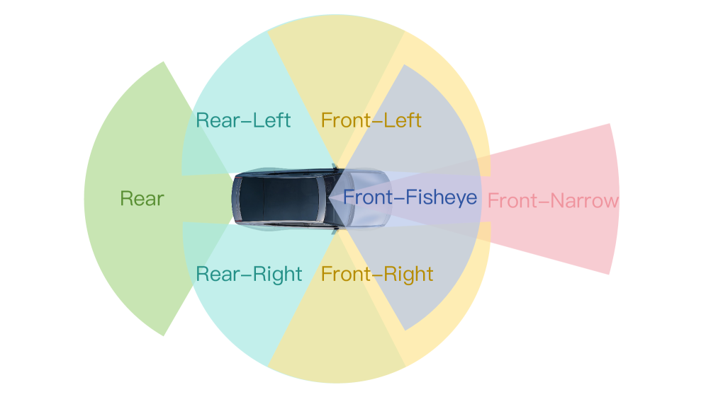
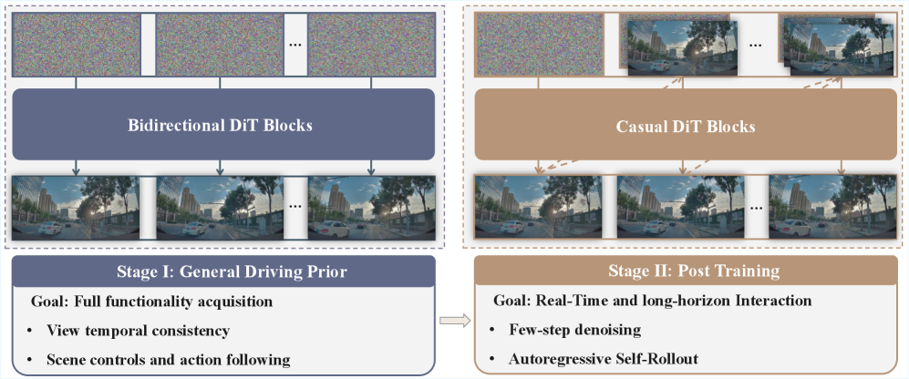
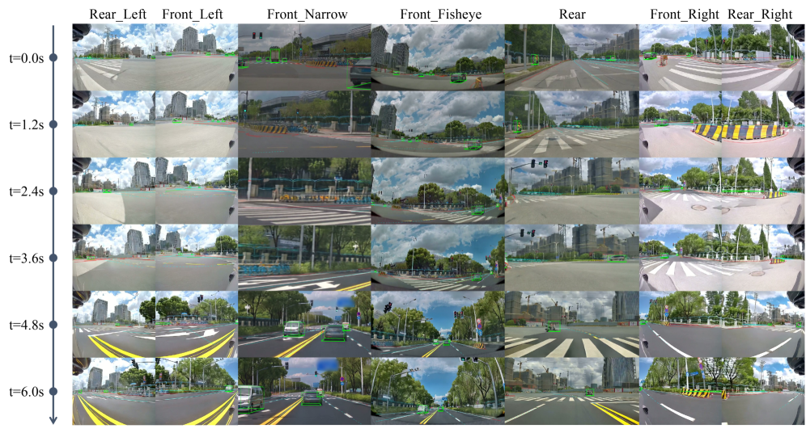

# X-World：可控自车中心多相机自动驾驶世界模型

## 结论先行

- **定位**：X-World 是 XPeng 的 action-conditioned 多相机视频生成世界模型，用 7 路环视历史和未来自车动作生成未来多相机视频，目标是给端到端/VLA 自动驾驶提供可复现、可编辑、可闭环交互的仿真器。
- **核心方法**：基于 WAN 2.2 5B DiT latent video generation，两阶段训练——Stage-I 用 rectified flow 训练 bidirectional I2V/V2V/C2V controllable generator（~50 步离线去噪），Stage-II 把它改造成 chunk-wise causal 生成器，用 self-forcing + DMD distillation 压到 4-step denoising，配合 rolling KV cache 变成可流式 rollout 的 streaming autoregressive simulator。
- **控制接口**：除 ego action（velocity/curvature/roll/pitch）外，还支持 dynamic agents、static road elements、camera intrinsics/extrinsics 和 text prompt；不同条件走不同注入路径（adaLN-Zero / cross-attention / additive embedding），论文强调这样能减少异构条件互相干扰。
- **证据形态**：论文主要给 qualitative demos 和系统能力论证，强调 24 秒多相机长 rollout 不发生 "catastrophic drift"、跨视角一致性、动作跟随、动态/静态元素可控；没有给公开 benchmark 数值表或可复跑的评测协议。
- **开源状态**：论文和项目页公开；截至 2026-07-02 未发现 GitHub、推理代码、训练代码、权重、数据或 license。当前只能做 paper-level 分析，复现 blocked。
- **与本仓库关系**：X-World 是 XPeng X 系列的核心生成式世界模型，[X-Cache](../efficient-training-inference/2026-x-cache.md) 在其上做推理加速，[X-Foresight](../world-models/2026-x-foresight.md) 初始化并改造其 Vision Renderer。

## 1. 这篇论文解决什么问题？

### 已确认的论文事实

- **问题定义**：端到端/VLA 自动驾驶缺少可规模化、可复现、可覆盖长尾场景的闭环评测和在线 RL 训练环境；真实道路测试成本高、覆盖偏置强、难以公平复现。
- **输入**：
  - 同步 7 相机历史视频（`front_narrow`、`front_fisheye`、`front_left`、`front_right`、`rear_left`、`rear_right`、`rear`）；
  - 未来 ego action sequence（velocity、curvature、roll、pitch）；
  - 可选 dynamic traffic agent 控制（语义类别 + 空间坐标）；
  - 可选 static road element 控制（语义类别 + 位置）；
  - camera intrinsics/extrinsics；
  - text prompt，用于天气、时间、风格等 appearance control。
- **输出**：未来 7 相机视频流，要求 action-following、cross-view consistency、temporal coherence 和 long-horizon stability。
- **目标场景**：closed-loop evaluation、online reinforcement learning、hard-case specialization、rare event synthesis、overseas/appearance style transfer。

### 初学者解释

传统仿真器常先建 3D 场景和物理规则，再渲染相机画面。X-World 走相反路线：直接在视频空间学习"如果车接下来这么开，7 个相机会看到什么"。这更贴近端到端模型的输入，但风险是它可能画得像而不一定物理正确，所以论文特别强调动作控制、跨相机一致性和长时间不漂移。

## 2. 方法概览：核心想法 + 一句话 pipeline

**核心想法**：不去重建显式 3D 场景再渲染，而是把"多相机未来"直接当成一个以动作和场景条件为输入的可控视频生成问题，靠 view-temporal attention 和解耦的条件注入保证几何一致性和可控性，再通过蒸馏把离线高质量生成器改造成低延迟流式仿真器。

**一句话 pipeline**：`7 路历史多相机帧 + 未来 ego action + 可选动态体/静态元素/相机参数/文本 → 3D causal VAE 编码 → DiT（view-temporal self-attention + 多路条件注入）联合去噪 → VAE 解码 → chunk-wise causal rollout（4-step + rolling KV cache）→ 未来 7 相机视频流`。

### 2.1 架构解析

**模块分解（自底向上）**：

| 模块 | 论文确认内容 | 作用 |
|---|---|---|
| 3D causal VAE | 继承 WAN 2.2 5B 路线；16× spatial compression、4× temporal compression、latent channel 48 | 降低视频生成的计算和显存 |
| DiT denoiser | 从 WAN 2.2 5B 预训练权重初始化，新增模块随机初始化 | 主干去噪网络 |
| View-temporal self-attention | 在多相机（cross-view）与多时间（temporal）维度上交替执行 | 强化跨视角几何一致性和时间连贯性 |
| Action injection | velocity、curvature、roll、pitch 经 symlog 归一化 + Fourier features + MLP，通过 adaLN-Zero 注入每个 diffusion block | 让模型跟随连续自车运动 |
| Dynamic agent injection | 语义类别经 umT5 编码，空间坐标归一化 + Fourier features，经 cross-attention 注入 | 控制交通参与者的位置和行为 |
| Static element injection | 语义类别经 umT5 编码，位置归一化 + Fourier features，经 cross-attention 注入，推理时可用 CFG 增强遵从度 | 控制道路结构、交通设施等静态场景元素 |
| Camera conditioning | intrinsics/extrinsics 归一化后拼接、MLP 投影，additive 注入 | 支持不同相机配置和视角 |
| Text branch | 沿用 WAN 2.2 5B 的文本条件分支 | 控制天气、时间、地域等全局外观 |
| Decoupled cross-attention | dynamic agents、static elements、text 各自独立的 cross-attention 分支 | 减少异构条件互相干扰，提高 controllability |
| Rolling KV cache | streaming AR rollout 中缓存过去 chunk 的 K/V，超容量 FIFO 淘汰 | 长视频生成时保持 bounded memory，模型只关注最近的滑动窗口上下文 |

**数据流**：7 路历史帧经 VAE 编码为多相机 latent，与 action/agent/element/camera/text 条件一起送入 DiT；DiT 内部交替做 view 维度和 temporal 维度的 self-attention 保证跨相机几何一致，同时通过各自独立的 adaLN-Zero / cross-attention / additive 通道注入条件；输出 latent 经 VAE 解码回像素空间的未来多相机视频。

**关键设计选择**：

1. **从预训练视频生成模型（WAN 2.2 5B）继承而非从零训练**：降低多相机、多条件、长视频生成的训练成本。
2. **条件解耦而非合并成单一 embedding**：dynamic agent、static element、text 各用独立 cross-attention 分支，避免语义混叠导致的可控性下降。
3. **view-temporal attention 交替而非联合全注意力**：在保证跨相机一致性的同时控制计算开销，为 7 相机同步生成提供可行的注意力结构。

### 2.2 核心原理

**为什么 work**：多相机自动驾驶视频具有强结构先验——相邻相机在重叠视场内几何一致，相邻帧在动力学约束下运动连续。View-temporal self-attention 把这两类先验显式编码进注意力结构（而不是指望网络隐式学到），这是 X-World 能在 7 路独立相机流上保持跨视角一致性的关键归纳偏置。

**关键机制**：

- **两阶段训练解耦"质量"与"实时性"**：Stage-I 追求高质量、强可控的 bidirectional 生成器（不计较推理速度，~50 步离线去噪）；Stage-II 专门解决闭环使用中的延迟和长 rollout 误差累积问题（4-step + self-forcing + DMD），把两个互相冲突的目标拆开分别优化。
- **self-forcing 训练**：模型在自己的 autoregressive rollout 上训练，而不是只在 teacher-forced 干净历史上训练，这直接对齐了训练分布和推理分布，缓解"训练时看真实历史、推理时看自己生成的历史"导致的 exposure bias。
- **DMD（Distribution Matching Distillation）**：让 Stage-II 学生模型的输出分布向 Stage-I teacher 的分布靠近（最小化反向 KL），使 4-step 快速生成尽量保留 ~50-step teacher 的质量。
- **rolling KV cache + FIFO 淘汰**：把无限长 rollout 转化为固定窗口的滑动上下文问题，用 bounded memory 换取任意长度的流式生成能力。

**与前作本质区别**：多数驾驶视频生成工作要么只做单相机/前视生成，要么在多相机场景下依赖显式 3D 表示（如 BEV 或点云）做一致性约束。X-World 坚持纯视频空间生成，转而用 view-temporal attention 结构和解耦条件注入来隐式保证一致性和可控性，并且是本文分析范围内少数明确把"高质量 bidirectional generator"和"低延迟 causal streaming simulator"拆成两阶段、用蒸馏桥接的驾驶世界模型。

### 2.3 关键公式解析

> 以下公式基于 arXiv HTML 版本提取，用于说明方法核心机制；论文原文未必逐一编号，具体系数/权重项以原文为准。

**Rectified Flow 插值路径（Stage-I 训练目标的一部分）**：

$$ \mathbf{y}_t = (1-t)\,\mathbf{y}_0 + t\,\mathbf{y}_1 $$

- 符号： $\mathbf{y}_0$ 是高斯噪声起点， $\mathbf{y}_1$ 是干净数据（多相机视频 latent）， $t \in [0,1]$ 是插值系数， $\mathbf{y}_t$ 是插值得到的 noisy latent。
- 作用：定义噪声到数据的直线路径，为下面的速度场回归提供监督目标。

**Rectified Flow 损失（Stage-I 主损失）**：

$$ \mathcal{L}_{\text{RF}}(\theta) = \mathbb{E}_{\mathbf{y}_0, \mathbf{y}_1, t, \mathbf{c}}\Big[\big\lVert v_\theta(\mathbf{y}_t, t, \mathbf{c}) - (\mathbf{y}_1 - \mathbf{y}_0) \big\rVert_2^2\Big] $$

- 符号： $v_\theta$ 是网络预测的速度场， $\mathbf{c}$ 是全部条件（历史帧、action、agent/element、camera、text）的集合， $(\mathbf{y}_1 - \mathbf{y}_0)$ 是 rectified flow 下的恒定目标速度。
- 作用：训练 Stage-I bidirectional generator 学会在给定条件下，把噪声沿直线路径推向干净的多相机视频 latent；这是后续 causal 蒸馏的 teacher 目标来源。

**多相机 action-conditioned 生成的形式化描述**：

$$ \hat{\mathbf{X}}_{t+1:t+H}^{1:V} \sim p\left(\mathbf{X}_{t+1:t+H}^{1:V} \;\middle|\; \mathbf{X}_{t-L:t}^{1:V},\ \mathbf{A}_{t:t+H},\ \mathbf{C}\right) $$

- 符号： $V$ 是相机数（7）， $L$ 是历史帧长度（ $L=1$ 对应 I2V， $L>1$ 对应 V2V， $L=0$ 对应 C2V）， $H$ 是未来预测 horizon， $\mathbf{A}_{t:t+H}$ 是未来 ego action 序列， $\mathbf{C}$ 是可选场景控制（dynamic agents、static elements、camera params、text）。
- 作用：这是 X-World 要建模的条件分布本身——给定历史多相机观测和未来动作/场景控制，预测未来多相机视频。它统一描述了 I2V/V2V/C2V 三种推理模式，只是通过改变 $L$ 切换。

**Stage-II causal streaming rollout（形式化表述，论文未给出对应的严格闭式公式）**：

把整段视频切成长度固定的 chunk，第 $k$ 个 chunk 只能看到第 $1,\dots,k-1$ chunk 的（真实或已生成）历史，chunk 内部仍为 bidirectional attention；每个新 chunk 从纯高斯噪声出发，用固定 4 步去噪（而非 Stage-I 的 ~50 步）生成，训练时用 self-forcing（在自身 rollout 上训练）+ DMD（向 Stage-I teacher 分布蒸馏）联合约束：

$$ \text{chunk}_k \;\leftarrow\; \text{Denoise}_{4\text{-step}}\big(\text{noise};\ \text{KV-cache}(\text{chunk}_{1:k-1}),\ \mathbf{A}_k,\ \mathbf{C}_k\big) $$

- 符号： $\text{KV-cache}(\cdot)$ 表示 rolling KV cache 里缓存的历史 chunk 的 K/V，超出固定容量时按 FIFO 淘汰最旧的部分。
- 作用：把"生成一整段长视频"转化为"逐 chunk 流式生成 + bounded memory 注意力"，这是 X-World 能做 24 秒以上长 rollout 而不需要无限增长显存的关键设计。

### 2.4 训练与推理细节

**Stage-I：bidirectional I2V/V2V/C2V 训练**

- 从 WAN 2.2 5B TI2V 权重初始化，在 81 帧同步多相机短片上训练 fully controllable bidirectional world model。
- 训练目标：rectified flow 损失（式见 2.3）。
- 特点：质量高、可控性强，但推理需要 ~50 步离线去噪，不满足闭环实时性。
- 通过控制历史帧长度 $L$ 统一 I2V（ $L=1$ ）/ V2V（ $L>1$ ）/ C2V（ $L=0$ ）三种模式；论文明确指出 C2V 不是真正的 world model（不建模当前状态转移），但适合数据合成和 style transfer。

**Stage-II：causal few-step 训练**

- 把 Stage-I 的 bidirectional 模型改造成 chunk-wise causal 生成器：chunk 内双向建模，chunk 间禁止看未来。
- 每个新 chunk 从 Gaussian noise 起始，只做 4-step denoising。
- 训练方法：self-forcing（在模型自身的 autoregressive rollout 上训练）+ DMD loss（Distribution Matching Distillation，最小化对 Stage-I teacher 的反向 KL），缓解长 rollout 的 exposure bias 和误差累积。
- Rolling KV cache：固定容量，FIFO 淘汰旧 chunk 的 K/V，模型始终只关注最近的滑动窗口上下文，从而支撑任意长度的流式生成。

**推理**：

- 闭环使用时按 chunk 逐步生成：每个 chunk 用 4-step denoising，结合 rolling KV cache 的历史上下文和当前 chunk 的 action/scene 条件生成下一段多相机视频。
- 支持对新动作的低延迟响应，适配 online RL 和 closed-loop policy evaluation 场景下"策略给动作、仿真器给下一步观测"的交互节奏。
- 论文展示 24 秒多相机长 rollout 无明显 drift，作为长时间稳定性的定性证据。

## 3. 关键贡献

1. **把自动驾驶世界模型做成可交互 AR 视频仿真器**：不是一次性生成整段视频，而是 streaming chunk-by-chunk，对新动作做低延迟响应。
2. **多源控制接口完整且解耦**：ego action、动态交通体、静态道路结构、相机参数、文本外观控制分别编码，并通过不同的注入机制（adaLN-Zero / cross-attention / additive）分开处理，减少条件间干扰。
3. **两阶段训练把"生成质量"和"实时可用性"解耦优化**：Stage-I 追求高质量 bidirectional 生成，Stage-II 通过 self-forcing + DMD 蒸馏和 rolling KV cache 解决实时闭环使用中的延迟和长 rollout 误差累积。
4. **明确服务 VLA 闭环评测和在线 RL**：论文把 X-World 放在 XPeng VLA 2.0 的评估、hard-case specialization、数据合成场景中讨论，定位是评测/训练基础设施而非单纯的生成 demo。

## 4. 实验与证据

| 维度 | 内容 |
|---|---|
| 数据 | 内部大规模真实驾驶序列；每样本 10 秒；7 相机，12 FPS（120 帧）；含 dynamic object trajectories、static scene elements、VLM 生成的文本描述。 |
| 传感器 | front_narrow、front_fisheye、front_left、front_right、rear_left、rear_right、rear。 |
| 数据标注 | 环境、静态、动态、ego 行为四大类标签体系，约 100 个三级标签；视频 caption schema 覆盖天气、时间、光照、道路状态、交通设施、交通密度。 |
| 主要结果 | 论文展示动作可控、dynamic/static element controllability、24s multi-camera rollout、跨相机一致性、appearance editing。 |
| 应用证据 | 论文给出 closed-loop evaluation 例子：绕过停放车辆、遮挡后骑行者突然出现等 counterfactual testing。 |
| 指标 | 正文提到 collision rates、progress-to-goal、ride comfort 可在 X-World 中评估，但未提供标准化公开数值表。 |
| Baseline | 没有给可复跑的公开 benchmark baseline 表；X-Cache 和 X-Foresight 后续都以 X-World 为基础系统。 |

### 4.1 效果与性能解析

**我的判断**：X-World 更像工业系统报告而不是可复现实验论文。它把世界模型要满足的工程接口（多相机、多条件、长 rollout、实时性）讲得很完整，两阶段训练的动机也自洽——用蒸馏把"质量"和"速度"这对矛盾拆开分别优化，这是驾驶视频世界模型工程化的一个合理路径。但可公开验证的材料主要是 demos 与文字描述：没有 FVD/FID 之类标准视频生成指标，没有 action-following 误差的量化数字，也没有闭环 collision rate/progress-to-goal 的实际数值。对研究跟踪有价值；作为可比较的 baseline 使用目前不可行。

## 5. 局限与风险

### 论文/项目页确认

- 未公开 GitHub、推理代码、训练代码、权重、训练数据或评测脚本。
- 训练数据来自 XPeng 内部驾驶数据和内部 perception/VLM pipeline，外部无法复刻。
- 论文没有给公开数据集上的定量表格，也没有给可复跑的 closed-loop metric protocol。
- 项目页没有 license 说明。

### 我的推断

- **物理可信度风险**：视频空间世界模型容易生成视觉上合理但几何/动力学不严格的未来，尤其在碰撞、遮挡、交通规则边界上；论文没有给出量化的物理一致性评测来反驳这一点。
- **安全评测闭环风险**：若被评估策略利用生成器漏洞（比如生成器对某些危险动作的响应比真实世界更"宽容"），闭环分数可能高估真实道路能力。
- **长尾泛化风险**：报告未给夜间、恶劣天气、罕见事故、多主体复杂博弈等分布外量化结果，24 秒长 rollout 的"无 drift"也只是定性展示而非统计意义上的稳定性证明。
- **蒸馏质量的量化缺失**：Stage-II 的 4-step 学生模型相对 Stage-I 的 ~50-step teacher 到底损失多少质量（画质、动作跟随精度、跨相机一致性），论文没有给消融数字，这是评估其"实时性换质量"权衡是否合理的关键缺口。
- **工程成本高**：多相机 DiT + VAE + rolling KV cache + 多条件注入，推理成本和部署复杂度都高，X-Cache 的出现也说明 X-World 原始推理是瓶颈。

## 方法谱系

- 基于（backbone）：WAN 2.2 5B latent video diffusion（外部模型，本库暂无单篇分析）。
- 同方向对比：[X-Foresight](../world-models/2026-x-foresight.md)（用 X-World 初始化 Vision Renderer）、[小米自动驾驶世界模型](../world-models/2026-xiaomi-auto-world-model.md)（同为自动驾驶世界模型，路线为重建-生成联合）、[DreamZero](../world-models/2026-dreamzero.md)（同为视频扩散驱动的动作条件生成模型，但面向机器人 manipulation 而非驾驶）。
- 推理加速：[X-Cache](../efficient-training-inference/2026-x-cache.md)（training-free cross-chunk DiT residual cache，直接服务 X-World 的 few-step AR DiT 推理）。

## 6. 与相似方法对比

| Method | 相同点 | 不同点 | 何时选它 |
|---|---|---|---|
| [小米自动驾驶世界模型 / JointWM](../world-models/2026-xiaomi-auto-world-model.md) | 都是自动驾驶世界模型，面向闭环仿真和数据合成 | JointWM 是 WorldRec + WorldGen，显式引入 4D Gaussian 重建先验；X-World 是纯视频空间的 action-conditioned 多相机生成器，不做显式 3D 重建 | 研究重建-生成耦合看 JointWM；研究可交互可控视频仿真看 X-World |
| [X-Cache](../efficient-training-inference/2026-x-cache.md) | 直接服务 X-World 推理 | X-Cache 不改变生成目标，是 training-free cross-chunk DiT residual cache，专注加速而非能力扩展 | 已有 X-World 类 few-step AR DiT 并需提速时看 X-Cache |
| [X-Foresight](../world-models/2026-x-foresight.md) | 使用 X-World 初始化/改造 Vision Renderer | X-Foresight 重点是把预测式世界模型整合进 VLA/LDM，用 long-horizon chunk-wise AR 预测未来视觉/动作提升规划安全 | 研究 VLA 预测式世界知识和 planning gains 时看 X-Foresight |
| [DreamZero](../world-models/2026-dreamzero.md) | 都用 video diffusion backbone 做 action-conditioned 未来生成，都强调 chunk-wise autoregressive + KV cache 支撑闭环流式推理 | DreamZero 面向机器人 manipulation，联合去噪 video 和 action 并直接输出控制指令；X-World 面向自动驾驶多相机仿真，输出的是"世界的未来"而非机器人动作 | 机械臂/移动双臂策略学习看 DreamZero；驾驶闭环仿真/数据合成看 X-World |
| MagicDrive / Vista / Epona / Genesis | 都做驾驶视频/世界生成 | X-World 更强调 closed-loop streaming、action following 和 7 相机可控仿真，两阶段蒸馏出 4-step 实时生成器 | 做 driving video generation baseline 时纳入同表 |

## 7. 复现判断

- Git 地址：未发现公开 GitHub。
- 是否开源：否。仅论文和项目页公开。
- 是否开源训练：否。
- 代码可用性：无。
- 权重可用性：无。
- 数据可获得性：内部数据不可得；只可借鉴数据 schema（四大类标签体系、caption schema）。
- 预计环境成本：即使开源，按 WAN 2.2 5B、7 相机 AR DiT 和工业数据规模判断，完整训练成本极高（Stage-I 高质量 bidirectional 训练 + Stage-II self-forcing/DMD 蒸馏均需要大规模多相机视频数据和显著算力）。
- 最小复现路径：当前不可复现。若后续公开，优先验证 4-step AR rollout 质量相对 ~50-step teacher 的损失、7 相机同步一致性、动作跟随精度、rolling KV cache 稳定性，以及 24 秒以上长 rollout 的量化 drift 指标。
- 是否值得复现：短期不适合；值得作为 XPeng 世界模型主线入口持续跟踪。

## 8. 后续动作

- [x] 创建 X-World 单篇论文分析
- [x] 深度重写（架构/训练两阶段/公式形式化/相似方法对比）
- [x] 更新 `indices/papers.md`
- [x] 更新 `indices/directions.md`
- [x] 更新 `indices/methods.md`
- [x] 创建 XPeng X 系列横向对比
- [ ] 若后续发布代码/权重，创建 `reproductions/world-models/x-world/README.md`

## Sources

- Paper: <https://arxiv.org/abs/2603.19979>
- PDF: <https://arxiv.org/pdf/2603.19979>
- HTML (含公式/图): <https://arxiv.org/html/2603.19979>
- Project page: <https://x-world-1.github.io>
