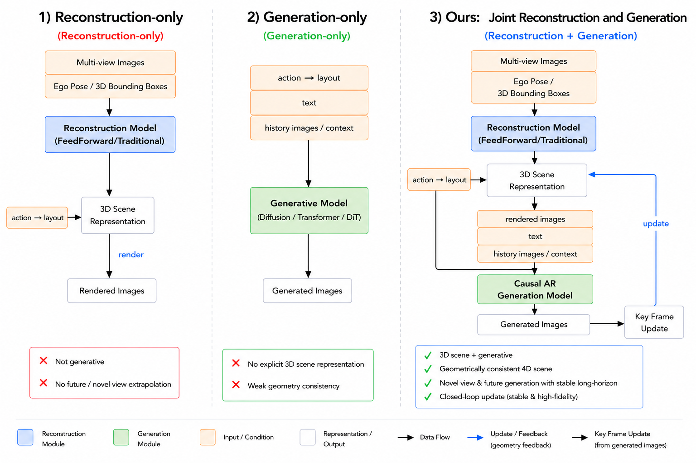
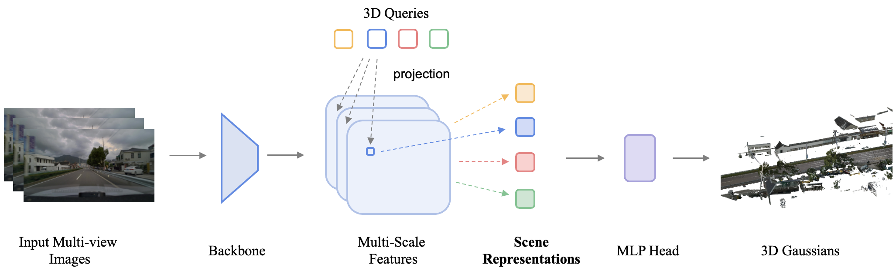

# Xiaomi Auto World Model：重建与生成联合的自动驾驶世界模型

## 结论先行

- **一句话定位**：这是一份小米汽车世界模型技术报告，提出 `WorldRec + WorldGen + Joint World Model`：先用稀疏 3D scene queries 做前馈式 3DGS 重建（WorldRec），再用因果 DiT 做长时序多视角驾驶视频生成（WorldGen），最后把重建出的 4D Gaussian 场景 rasterize 成 prior image，作为生成模型的几何锚点（JointWM）。核心命题是「重建给确定性记忆、生成给想象力」，两者互补构成一个可闭环仿真的驾驶世界模型。
- **WorldRec 的关键设计**：抛弃逐像素 DPT Gaussian head，改在世界坐标里初始化 $N$ 个稀疏 3D query，把 query 投影到多相机多尺度特征图采样、做 visibility-aware 跨视角/跨时间聚合，再用一个 MLP 解码出 Gaussian 属性。primitive 从一开始就绑定 3D 位置而非单帧像素，天然抑制 ghosting 与高斯爆炸。
- **WorldGen 的关键设计**：先用全时序**双向** DiT 预训练学分布，再施加因果 mask 转成**在线自回归**生成器，并分三步（Teacher Forcing → ODE distillation 50→4 步、约 12x 加速 → DMD 用自生成历史替代 GT 历史）逐步解决在线性、速度和长时序漂移三个问题。
- **实验结论**：WorldRec 在 Waymo / nuScenes 的 NVS PSNR/SSIM 超过 MVSplat、NoPoSplat、DepthSplat、STORM、DGGT（Waymo 28.48 / 0.861）；WorldGen 在 nuScenes 上 FVD 64.97、FID 7.04，可生成 81 帧，单视角 0.19s/frame，是表内 AR 模型里最快且最长的。
- **工程亮点**：10 秒视频片段约 10 秒完成重建，而逐场景优化约 4 小时（≈1000x）；4-step 采样来自 ODE distillation，H20 上单视角 0.19s/frame、三视角 0.46s/frame，支持 10/30fps、最长约 1 分钟可控生成。
- **开源状态**：论文和项目页公开，但截至 2026-07-03 未见 GitHub、训练/推理代码、权重或数据下载入口；当前只能做 paper-level 分析，不能做 inference-level 复现。
- **与本仓库主线关系**：WorldRec 与 HunyuanWorld-Mirror / DA3 / VGGT-Ω 等 3DGS/NVS 重建主线相关但更面向 driving 多相机时序；WorldGen 属 driving video generation；JointWM 是本仓库 `world-models` 方向的第一篇核心条目，代表「reconstruction-generation hybrid」这一子方向。

## 1. 这篇报告解决什么问题？

- **问题定义**：自动驾驶世界模型需要两类能力——世界**表征**（可显式表示、可微渲染已观测场景，几何一致）与世界**生成**（预测未来、补全未观测区域、合成长尾场景）。现有工作往往二选一：per-scene 3DGS 优化质量高但慢、无法外推未见区域；video generation 逼真但缺显式几何、多次采样结构方差大、长时序会漂。
- **输入 / 输出**：
  - WorldRec 输入多相机、多时刻图像（+ 相机内外参），输出紧凑的 3D Gaussian 场景表示，可做任意视角 NVS。
  - WorldGen 输入多视角首帧、layout map、ego trajectory、相机内外参、free-form text，输出多视角驾驶视频；JointWM 阶段额外注入 WorldRec 渲染出的 prior image。
  - JointWM 输出可闭环仿真、可数据合成、可端到端训练的联合世界模型。
- **目标场景**：自动驾驶闭环仿真、长尾场景合成（动物闯入、极端天气）、可控长时序 rollout、感知/规划训练数据生成。
- **与现有方法的差异**：不是「又一个 3DGS」或「又一个视频生成模型」，而是把两者**耦合**——重建提供几何一致的共享空间记忆抑制生成漂移，生成补足重建看不到的未来与长尾。这比纯 NVS 或纯 video generation 更贴近闭环仿真的真实需求。

## 2. 方法概览

- **核心想法**：用稀疏 3D query 做前馈重建拿到确定性 4D 场景记忆，用双向预训练→因果微调的 DiT 做在线视频生成，再把重建场景 rasterize 成 partial reference 反向约束生成，形成「重建约束生成、生成补全重建」的闭环。
- **一句话 pipeline**：多相机图像 → WorldRec（backbone 特征 + 3D query 投影采样聚合 → MLP 解码 3D Gaussians）→ 场景 rasterize 到目标 ego pose 得 prior image → WorldGen（Causal DiT 以首帧/layout/轨迹/文本/prior image 为条件自回归生成多视角视频）→ 新观测回灌 WorldRec 增量更新场景。

### 2.1 架构解析

WorldRec、WorldGen、JointWM 三个模块可以分开看，也可以串成一条数据流。

**WorldRec（前馈稀疏查询 3DGS 重建）**

数据流：`多相机多时刻图像 → shared visual backbone → 多尺度特征 {F_{c,l}^t}`；同时在世界坐标初始化 $N$ 个稀疏 3D query（各带参考坐标 $\boldsymbol{p}=[X,Y,Z]^\top$ ）；每个 query 投影到各相机各尺度 feature map 双线性采样 → visibility-aware 跨视角/跨时间聚合 → 一个 MLP head 解码 Gaussian 属性（位置偏移、RGB、opacity、scale、rotation）→ 得到 3D Gaussian 场景 → rasterize 到目标视角做像素+感知监督。

| 模块 | 论文描述 | 作用 |
|---|---|---|
| Multi-scale feature extraction | 多相机多时刻图像经 shared-weight visual backbone 得多尺度特征 $\{F_{c,l}^t\}$ | 同时保留纹理细节与大尺度语义结构 |
| 3D query initialization | 世界坐标初始化 $N$ 个稀疏 query，各带参考坐标 $\boldsymbol{p}=[X,Y,Z]^\top$ | 让每个 primitive 从起点就绑定 3D 空间位置 |
| Projection sampling | query 投影到各相机各尺度 feature map，双线性插值采样 | 从多视角观测收集同一空间点信息 |
| Cross-view / cross-temporal aggregation | visibility-aware 加权聚合多相机、多时间特征 | 抑制遮挡/反光/低质视角，强化跨帧一致性 |
| Gaussian attribute decoding | MLP 解码位置偏移、RGB、opacity、scale、rotation 四元数 | 输出最终 3D Gaussian primitives |
| Rendering supervision | Gaussian rasterization 渲染目标视角，pixel loss + perceptual loss 监督 | 用多视角渲染误差逼迫几何/外观一致 |

**WorldGen（双向预训练→因果生成的驾驶视频 DiT）**

backbone 是 Diffusion Transformer。每个 transformer block 内含 self-attention（对 chunk latent tokens + KV cache）与 cross-attention（对 text tokens），堆叠 $N$ 层。条件编码：多视角首帧与 layout condition 各过 VAE、文本过 umT5 编码器，再喂给 Causal DiT，输出经 VAE 解码为多视角视频。训练两阶段：Stage 1 双向 DiT 预训练；Stage 2 因果微调（2-1 Multi-step AR DiT teacher forcing、2-2 ODE 蒸馏成 few-step、2-3 Causal DiT + DMD）。

**Joint World Model（重建约束生成 + 生成补全重建）**

JointWM 对两模块做接口改造：WorldRec 侧新增 **incremental scene reconstruction**——把新观测 token 与 cached scene tokens 通过 cross-attention 融合（Scene Encoder），持续扩展/更新一个全局一致 4D Gaussian 表示；WorldGen 侧新增 **rendered-prior conditioning**——把 scene tokens 从目标 ego pose rasterize 成可能带空洞的 partial reference image，作为额外条件送入 Causal DiT。两者由 `update / retrieve from target ego pose` 闭环连接：生成的新帧回灌 WorldRec 更新场景，更新后的场景又渲染出下一步的 prior。

### 2.2 核心原理

**为什么稀疏 3D query 比逐像素 Gaussian head 好？** 逐帧 DPT head 把每个像素预测成一个（或几个）Gaussian，拼多帧多相机时同一物理点被重复表达，产生 ghosting、layered surface duplication，一个 clip 累积到数亿 primitives，渲染极慢。WorldRec 把「Gaussian 从哪来」的归纳偏置从「像素」换成「3D 空间点」：query 先占住 3D 位置，再去多视角采证据。这带来三个好处——(1) 同一 3D 点的多相机/多时刻观测被显式聚合到同一 query，跨视角一致性由构造保证；(2) primitive 数量与 query 数解耦于像素数，天然稀疏、渲染快；(3) visibility-aware 加权让遮挡/反光视角自动降权，不会把坏观测烙进几何。

**为什么先双向后因果？** 双向 attention 能看到完整时序上下文，更容易学好「驾驶场景长什么样」这个分布（生成先验）；但闭环仿真要求在线、不能看未来。所以先双向学「画得好」，再用因果 mask 微调学「在线生成」，是把「表达能力」和「部署约束」解耦的务实做法。

**为什么要 DMD（自生成历史替代 GT 历史）？** Teacher Forcing 训练时历史帧是 GT，但推理时历史帧是模型自己生成的、带误差——这就是 exposure bias，误差会随自回归滚动累积成漂移。DMD 在训练时就用模型自生成的历史做条件，让模型提前适应自己的误差分布，缓解长时序漂移。

**与前作的本质区别**：相比 STORM/DGGT 这类逐帧 Gaussian 前馈重建，WorldRec 的 primitive 绑 3D query 而非单帧像素，跨视角融合是构造性的而非后处理；相比 DA3/VGGT-Ω/Pi3 这类通用 visual geometry backbone（输出 pose/depth/point），WorldRec 直接输出可渲染的 3DGS 场景表示，目标是 driving NVS/仿真而非通用几何。JointWM 的独特点在于把确定性重建记忆与生成想象力做成一个闭环，而不是二选一。

### 2.3 关键公式解析

> 论文以形式化记号给出如下核心式（符号沿用报告，转写自 arXiv HTML v5）。

WorldRec 的 query → Gaussian 前向：

$$ \boldsymbol{u}_{c,l} = \pi_c(\boldsymbol{p}), \qquad \boldsymbol{f}_{c,l} = \mathrm{BilinearInterp}\!\left(\mathbf{F}_{c,l}^{t},\, \boldsymbol{u}_{c,l}\right) $$

- 符号： $\boldsymbol{p}=[X,Y,Z]^\top$ 是 query 的世界坐标； $\pi_c$ 是第 $c$ 台相机的投影函数； $\boldsymbol{u}_{c,l}$ 是投到该相机第 $l$ 尺度特征图上的像素坐标； $\mathbf{F}_{c,l}^{t}$ 是 $t$ 时刻该相机该尺度的特征图； $\boldsymbol{f}_{c,l}$ 是采样得到的特征。
- 作用：把一个 3D 点「看进」所有相机的多尺度特征，为聚合准备多视角证据。

visibility-aware 跨视角/跨时间聚合：

$$ \boldsymbol{q}_i = \sum_{c,l} w_{c,l}\, \boldsymbol{f}_i^{\,c,l} $$

- 符号： $\boldsymbol{q}_i$ 是第 $i$ 个 query 聚合后的特征； $w_{c,l}$ 是由可见性与特征质量决定的权重（遮挡/低质视角权重小）。
- 作用：把同一 3D 点的多源观测融成一个稳健表征，是「跨视角一致性由构造保证」的核心一步。

Gaussian 属性解码：

$$ (\Delta\boldsymbol{p}_i,\, \boldsymbol{c}_i,\, \alpha_i,\, \boldsymbol{s}_i,\, \boldsymbol{r}_i) = \mathrm{MLP}(\boldsymbol{q}_i), \qquad \hat{\boldsymbol{p}}_i = \boldsymbol{p}_i + \Delta\boldsymbol{p}_i $$

- 符号： $\Delta\boldsymbol{p}_i$ 位置偏移， $\boldsymbol{c}_i$ RGB， $\alpha_i$ opacity， $\boldsymbol{s}_i$ scale， $\boldsymbol{r}_i$ rotation 四元数； $\hat{\boldsymbol{p}}_i$ 是修正后的 Gaussian 中心。
- 作用：query 只给「粗位置」，MLP 在其邻域微调出完整 Gaussian，属性可微、可 rasterize。

WorldGen 双向阶段用 rectified flow（linear interpolation + 匹配速度场）：

$$ x_t = (1-t)\,z + t\,x_0, \qquad \mathcal{L}_{rf} = \mathbb{E}_{t,x_0,z}\big[\lVert v_\theta(x_t,t,c) - (x_0 - z)\rVert_2^2\big] $$

- 符号： $x_0$ 干净样本， $z\sim\mathcal{N}(0,I)$ 噪声， $t\sim U(0,1)$ ， $x_t$ 插值点； $v_\theta(\cdot)$ 网络预测的速度场，回归目标是真实速度 $x_0 - z$ ； $c$ 是条件。
- 作用：flow-matching 目标，让 DiT 学会从噪声沿直线流回数据，是「画得好」的分布学习基础。

因果微调三步的目标（Teacher Forcing / ODE 蒸馏 / DMD）：

$$ \mathcal{L}_{TF} = \mathbb{E}_{t,\epsilon}\big[\lVert \epsilon_\theta(x_t^{(i)}, t, c, x_{GT}^{(<i)}) - \epsilon\rVert_2^2\big] $$

$$ \mathcal{L}_{ODE} = \mathbb{E}_{x_T}\big[\lVert f_\phi(x_T, K{=}4) - \mathrm{sg}[\hat{x}_0^{\,teacher}]\rVert_2^2\big] $$

$$ \mathcal{L}_{DMD} = \mathbb{E}_{t,\epsilon}\big[\lVert \epsilon_\phi(x_t^{(i)}, t, c, \hat{x}^{(<i)}) - \epsilon\rVert_2^2\big] + \lambda\, D_{KL}\!\left(p_\phi \,\Vert\, p_{data}\right) $$

- 符号： $x_t^{(i)}$ 是第 $i$ 帧的 noisy latent， $x_{GT}^{(<i)}$ 为 GT 历史帧（TF），因果 mask $M_{ij}=0\ (j\le i),\ -\infty\ (j>i)$ 保证只看过去； $f_\phi(\cdot,K{=}4)$ 是学生 4 步求解器，回归教师 50 步 ODE 结果 $\hat{x}_0^{\,teacher}$ （ $\mathrm{sg}$ 为 stop-gradient）；DMD 中 $\hat{x}^{(<i)}=G_\phi(\epsilon,c)$ 是模型**自生成**的历史帧， $D_{KL}(p_\phi\Vert p_{data})$ 拉近生成分布与数据分布。
- 作用：分别解决在线因果性、采样速度（50→4 步、约 12x）、以及自回归 exposure bias 导致的长时序漂移。

### 2.4 训练与推理细节

- **WorldRec 训练**：损失为 $\mathcal{L} = \mathcal{L}_{\text{pixel}} + \lambda\,\mathcal{L}_{\text{perceptual}}$ ，用多视角 rasterization 渲染误差监督；shared-weight backbone 跨相机复用。评测在 Waymo（train/eval）与 nuScenes（zero-shot 与 fine-tune 两档）。
- **WorldGen 训练**：Stage 1 全时序双向 DiT + rectified flow 预训练学分布；Stage 2 因果微调依次 (2-1) Teacher Forcing 施加因果 mask，(2-2) ODE distillation 把约 50 步蒸成 4 步（约 12x 采样加速），(2-3) DMD 用自生成历史替代 GT 历史缓解漂移。条件：MV 首帧 + layout（各过 VAE）+ 文本（umT5）+ 轨迹/内外参。
- **JointWM 训练**：为 rendered-prior conditioning 专门构造训练数据——从 reconstructed scenes 在 held-out target poses 上渲染 partial reference images，再 fine-tune WorldGen 学会「有 prior 就贴着 prior、prior 有洞就补」。
- **推理流程**：给定首帧/layout/轨迹/文本，WorldRec 增量维护场景 → 从下一目标 ego pose 渲染 prior → Causal DiT 以 4 步采样生成下一 chunk 多视角帧 → 新帧回灌 WorldRec 更新场景，循环 rollout。H20 GPU 上单视角 0.19s/frame、三视角 0.46s/frame；支持 10/30fps、最长约 1 分钟；10 秒 clip 约 10 秒完成重建（vs per-scene 优化约 4 小时）。

## 3. 关键贡献

1. **稀疏查询前馈 3DGS 重建（WorldRec）**：用世界坐标 3D query + 投影采样 + visibility-aware 聚合替代逐像素 Gaussian head，抑制 ghosting 与高斯爆炸，把 driving clip 重建从小时级压到约 10 秒。
2. **双向预训练→因果微调的驾驶视频生成（WorldGen）**：Teacher Forcing + ODE distillation（50→4，约 12x）+ DMD 三步，把一个高质量双向 DiT 转成快、在线、抗漂移的自回归生成器，生成 81 帧、0.19s/frame。
3. **重建-生成联合世界模型（JointWM）**：incremental scene fusion + rendered-prior conditioning 把确定性 4D 记忆与生成想象力闭环耦合，用几何先验抑制 drift/hallucination/多次采样方差，服务闭环仿真与数据合成。

## 4. 实验与证据

| 维度 | 内容 |
|---|---|
| 数据集 | Waymo、nuScenes（zero-shot + fine-tune）、private driving data |
| Baseline | 重建：MVSplat / NoPoSplat / DepthSplat / STORM / DGGT；生成：MagicDrive(-V2) / Vista / DiVE / Delphi / UniScene / Genesis / Epona |
| 指标 | 重建 PSNR/SSIM + reconstruction time；生成 FID/FVD/Frames/Infer. time；JointWM 三项一致性（定性为主） |
| 主要结果 | WorldRec Waymo 28.48/0.861 全面领先；WorldGen nuScenes FVD 64.97、FID 7.04、81 帧、0.19s/frame |
| 消融 | 论文以三项定性证据（长时序一致性、跨视角一致性、多次采样稳定性）展示 JointWM 几何先验收益 |
| 失败案例 | 未系统报告；长尾/极端天气以可视化展示 |

### 4.1 WorldRec 定量结果

| Method | Waymo PSNR ↑ | Waymo SSIM ↑ | nuScenes zero-shot PSNR ↑ | nuScenes zero-shot SSIM ↑ | nuScenes fine-tune PSNR ↑ | nuScenes fine-tune SSIM ↑ |
|---|---:|---:|---:|---:|---:|---:|
| MVSplat | 20.56 | 0.697 | 17.84 | 0.563 | - | - |
| NoPoSplat | 24.31 | 0.751 | 19.75 | 0.545 | - | - |
| DepthSplat | 23.26 | 0.696 | 19.52 | 0.601 | - | - |
| STORM | 26.38 | 0.794 | 17.77 | 0.669 | 24.54 | 0.784 |
| DGGT | 27.41 | 0.846 | 25.31 | 0.794 | 26.63 | 0.813 |
| **WorldRec** | **28.48** | **0.861** | **26.54** | **0.821** | **27.50** | **0.826** |

### 4.2 WorldGen 定量结果

| Model | Bi / AR | FID ↓ | FVD ↓ | Frames | Infer. Time |
|---|---|---:|---:|---:|---:|
| MagicDrive | Bi | 16.20 | - | 1 | - |
| MagicDrive-V2 | Bi | 20.91 | 94.84 | 16 | - |
| Vista | Bi | 6.9 | 89.4 | 16 | - |
| DiVE | Bi | 7.14 | 68.4 | 8 | - |
| Delphi | Bi | 15.08 | 113.5 | 8 | - |
| UniScene | Bi | 6.12 | 70.52 | 8 | - |
| Genesis | Bi | 6.45 | 67.87 | 16 | - |
| Epona | AR | 7.5 | 82.8 | 16 | 1.06s/frame |
| **WorldGen** | **AR** | **7.04** | **64.97** | **81** | **0.19s/frame** |

### 4.3 效果与性能解析

- **重建结果解读**：WorldRec 在 Waymo 上 PSNR 比最强 baseline DGGT 高 1.07dB、SSIM 高 0.015；更关键的是 nuScenes **zero-shot**（不 fine-tune 直接迁移）PSNR 26.54 就超过多数 baseline 的 fine-tune 结果，说明稀疏 query + 多视角聚合学到的几何表征跨数据集泛化较好，而不是靠过拟合单一分布。fine-tune 再涨到 27.50，收益递减也印证 zero-shot 已经很强。
- **生成结果解读**：WorldGen 是表内唯一同时做到「AR + 81 帧 + 0.19s/frame + FVD 最低（64.97）」的模型。对比同为 AR 的 Epona（16 帧、1.06s/frame、FVD 82.8），WorldGen 在帧数 5x、速度 5.6x 的同时 FVD 更低——这主要归功于双向预训练打底 + ODE 蒸馏提速。注意 UniScene FID 6.12 比 WorldGen 7.04 略低，但它只有 8 帧、且 FVD（70.52）更差，说明 WorldGen 的优势在**长时序时序质量**而非单帧图像保真。
- **性能与效率**：重建约 1000x 加速（4 小时→10 秒）来自前馈化 + 稀疏 primitive；生成约 12x 采样加速来自 50→4 步 ODE distillation。H20 上单/三视角 0.19/0.46s/frame，接近实时，是闭环仿真可用的关键。论文未报告参数量与显存占用。
- **消融/一致性证据**：JointWM 的三项核心收益（long-horizon temporal consistency、multi-view spatial consistency、multi-run stability）主要以定性 figure 展示，论证「有 WorldRec 几何先验时 drift/hallucination/多次采样结构方差明显下降」。**这是全文最弱的证据环节**——缺可复跑数值协议。
- **可比性说明**：重建表把 zero-shot 与 fine-tune 分列，协议相对清晰；生成表混了 Bi 与 AR、帧数/分辨率不完全统一，FID/FVD 跨行直接比需谨慎（帧数差异影响 FVD）。

## 5. 局限与风险

### 论文 / 项目页已确认的限制

- 当前公开材料没有 GitHub、推理代码、训练代码、权重或数据下载入口（arXiv 论文文本以 CC BY-SA 4.0 发布，但不覆盖代码/权重/数据）。
- WorldRec 定量表只有 PSNR/SSIM，未报告 3D 几何指标（Chamfer、F-score、depth/pose error、occupancy IoU）或下游感知指标。
- JointWM 三项核心收益主要靠 qualitative figures，缺可复跑的 temporal/cross-view consistency 与 multi-run stability 数值协议。
- 未报告参数量、显存、训练算力规模；训练数据含 private data，rendered-prior fine-tuning 数据也未公开。

### 我推断的风险

- **复现风险极高**：无代码/权重无法做 inference sanity check；即使后续开源，三模块系统很可能依赖大规模内部驾驶数据与算力。
- **指标覆盖不足**：PSNR/SSIM 证明渲染质量，但闭环还需几何尺度、动态主体一致性、occupancy/BEV/感知闭环收益；FID/FVD 对安全关键长尾事件不充分。
- **生成评测风险**：动物闯入、极端天气、长时序控制目前主要靠可视化，缺可控性/安全性的定量评估。
- **工程集成复杂**：incremental scene fusion + rendered-prior conditioning + causal DiT + 3DGS rasterization 串联，部署成本远高于单个前馈几何模型；prior image 有洞时生成如何 fallback 未详述。
- **商业/许可未知**：代码、权重、样例视频与模型输出的许可证未列，不能假定可商用（论文文本 CC BY-SA 4.0 仅覆盖论文本身）。

## 方法谱系

> 本篇为系统级技术报告，未取代单一前作；与下列方法在 backbone/任务层面相关。

- 基于 / 相关重建线：STORM、DGGT、MVSplat、NoPoSplat、DepthSplat（driving feed-forward 3DGS baseline）。
- 相关生成线：MagicDrive / MagicDrive-V2、Vista、Epona、Genesis、UniScene（driving video/world generation baseline）。
- 相关通用几何 backbone：DA3、VGGT-Ω、Pi3、HunyuanWorld-Mirror（本仓库 3d-recon 主线，可点参见对应条目）。

## 6. 与相似方法对比

| Method | 相同点 | 不同点 | 何时选它 |
|---|---|---|---|
| HunyuanWorld-Mirror | 都面向 world reconstruction / 3DGS / NVS，服务仿真与资产生成 | JointWM 更强调 driving 多相机时序 + 重建/生成联合；Hunyuan 更偏 any-prior 公开系统 | 要多先验、公开工程与 3DGS/NVS 生态看 Hunyuan；研究重建-生成耦合看 JointWM |
| Depth Anything 3 | 都可服务前馈几何与 3DGS/NVS | DA3 是通用 any-view depth/ray/pose/point backbone，公开权重/API；WorldRec 是 driving-specific sparse-query 3DGS，当前不开源 | 要可跑 baseline 选 DA3；研究 driving sparse-query 架构看 WorldRec |
| VGGT-Ω | 都关注前馈重建与长序列/动态视频 | VGGT-Ω 输出 camera/depth/register tokens，强调 RGB geometry scaling；WorldRec 直接出 3DGS 场景表示 | 强 RGB geometry baseline 看 VGGT-Ω；渲染/仿真表示看 WorldRec |
| LingBot-Map | 都与长视频/在线空间理解相关 | LingBot-Map 是 causal streaming pose/depth/point；JointWM 是重建+生成联合世界模型 | 做在线 VO/建图看 LingBot-Map；做闭环仿真+视频预测看 JointWM |
| MagicDrive / Epona / Genesis | 都是 driving video/world generation | WorldGen 是 AR，双向预训练 + 因果微调 + 4-step distillation + WorldRec 几何先验 | 做 driving video generation benchmark 时作同类生成 baseline |
| STORM / DGGT | 都是 driving 前馈 3DGS 重建 baseline | STORM/DGGT 更直接的前馈 4D 重建；WorldRec 用稀疏 3D query 减少高斯爆炸与 ghosting | 做 world-model reconstruction 对比时 STORM/DGGT/WorldRec 应同表 |

## 7. 复现判断

- Paper：<https://arxiv.org/abs/2605.18137>
- PDF：<https://arxiv.org/pdf/2605.18137>
- Project：<https://JointWM.github.io>
- GitHub：未发现公开 GitHub。
- 是否开源：否。当前只看到论文和项目页。
- 是否开源训练：否。未发现训练代码、配置、数据处理 pipeline。
- 权重可用性：未发现公开权重。
- 数据可获得性：Waymo / nuScenes 可按原数据集协议获取；private data、训练集、WorldGen rendered-prior fine-tuning data 未公开。
- 许可证：arXiv 论文文本为 CC BY-SA 4.0；代码/权重/数据许可证论文与项目页均未给出。
- 预计环境成本：若开源，三模块系统预计需多卡（论文用 H20）+ 大规模驾驶数据，成本高。
- 最小复现路径：当前不可复现。若后续开源，建议先验证：
  1. WorldRec 在 Waymo mini split 上的 PSNR/SSIM 与 10s/clip reconstruction time；
  2. WorldGen 在 nuScenes 上 81 frames、0.19s/frame、FID/FVD；
  3. JointWM 对同一 prompt/trajectory 的 multi-run variance、cross-view consistency 与长时序 drift。
- 是否值得复现 / 跟进：值得作为 `world-models` 与「reconstruction-generation hybrid」方向重点跟踪；短期不适合作工程 baseline，因缺代码与权重。

## 8. 后续动作

- [x] 创建 Xiaomi Auto World Model 单篇论文分析
- [x] 更新 `README.md`
- [x] 更新 `indices/papers.md`
- [x] 更新 `indices/directions.md`
- [x] 更新 `indices/methods.md`
- [ ] 若后续释放代码/权重，创建 `reproductions/world-models/xiaomi-auto-world-model/README.md`
- [ ] 后续可创建 driving world models 横向对比：WorldRec / STORM / DGGT / HunyuanWorld-Mirror / WorldGen / Epona / Genesis / MagicDrive-V2

## Sources

- Paper: <https://arxiv.org/abs/2605.18137>
- PDF: <https://arxiv.org/pdf/2605.18137>
- HTML (v5): <https://arxiv.org/html/2605.18137>
- Project page: <https://JointWM.github.io>
