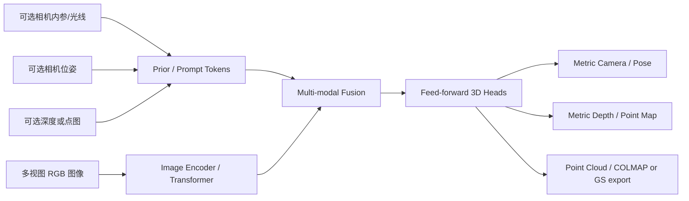
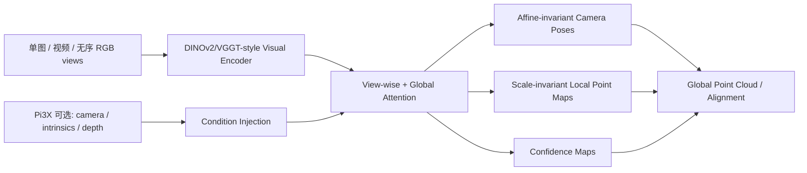
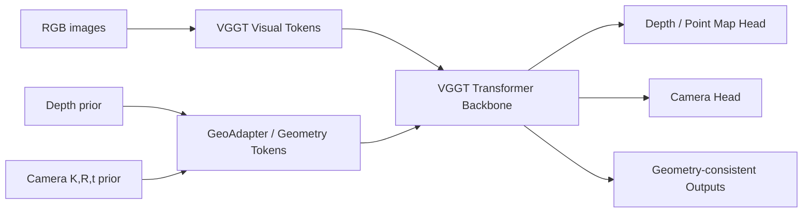
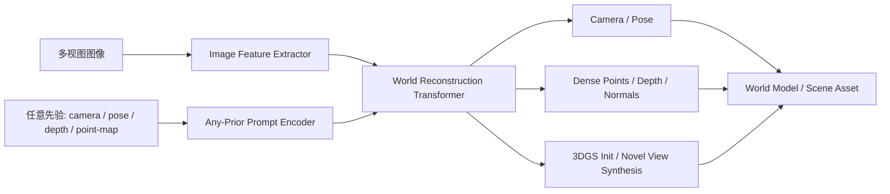
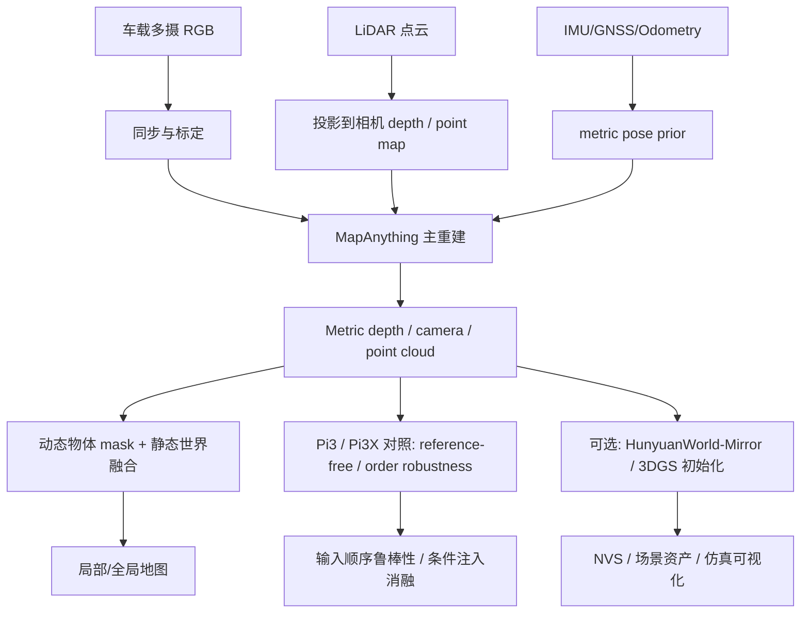

# 前馈式三维重建方法对比报告：MapAnything / Pi3 / HunyuanWorld-Mirror / OmniVGGT

> 更新时间：2026-05-11
> 关注目标：**多模态输入、自动驾驶行车场景友好、真实尺度、模型/方法上限高、训练开源可复现**。  
> 结论先行：若以“开源训练 + 真尺度 + 行车数据可扩展 + 长序列/大规模推理”为核心，**MapAnything 当前最接近主干候选**；若以“多先验提示 + 多任务输出 + 3DGS/NVS 生态”为核心，**HunyuanWorld-Mirror 是强候选但许可证与训练复杂度需重点评估**；**Pi3 / Pi3X 已公开 training/evaluation 分支和权重，是必须加入的 reference-free / unordered baseline**，但原始 Pi3 不是 metric 主线，权重非商用；**OmniVGGT 更像 VGGT 的几何先验适配器/机器人场景增强版**，适合做轻量 adapter 对照。

---

## 0. 核心推荐

### 推荐排序（按你的目标加权）

| 排名 | 方法 | 推荐定位 | 主要原因 | 主要风险 |
|---:|---|---|---|---|
| 1 | **MapAnything** | 自动驾驶/机器人视觉三维重建的主 backbone | 真尺度目标明确；支持图像、相机、pose、深度等混合先验；训练、评测、预训练权重与多种许可证权重较完整；长序列能力最清晰 | 不原生吃 raw LiDAR/Radar/Event；3DGS/NVS 不是核心输出；动态交通参与者需要额外处理 |
| 2 | **HunyuanWorld-Mirror** | 多先验世界重建 + 3DGS/NVS/下游资产生成候选 | Any-prior prompting 思路强；可利用相机/pose/depth/point-map 类先验；输出形态丰富；仓库包含训练/评测路径 | 训练栈重；许可证不是标准 Apache/MIT；行车场景需要验证动态物体、长序列稳定性和部署成本 |
| 3 | **Pi3 / Pi3X** | reference-free / unordered 多视图几何强 baseline；Pi3X 可测条件注入 | 去固定参考帧，permutation-equivariant；输出 pose、local point map、confidence；main/evaluation/training 分支公开；Pi3X 支持 camera/intrinsics/depth 条件注入和近似 metric scale | 原始 Pi3 偏 scale/affine-invariant，不是天然 metric；权重 CC BY-NC 4.0 非商用；完整训练含 internal dataset，复刻成本高 |
| 4 | **OmniVGGT** | VGGT 兼容的几何先验输入增强模块/基线 | 在 VGGT 范式上加入 depth / camera priors 等“omni geometry tokens”；训练成本相对低；适合 robot/indoor/小中规模多视角 | 多模态含义偏“几何先验”，不是 raw LiDAR/Radar 多传感器；生态和训练开源成熟度弱于前三者；长序列能力不突出 |

### 如果你的目标是“自动驾驶行车场景友好”

建议路线：

1. **以 MapAnything 做主模型/训练基座**：用车载标定、ego pose、IMU/GNSS/SLAM、LiDAR 投影深度作为 metric anchor，把尺度问题从“模型猜测”变成“先验约束”。
2. **把 HunyuanWorld-Mirror 作为 3DGS/NVS 或多先验融合的辅助分支**：当你需要可视化、重渲染、Gaussian Splatting 初始化或世界资产生成时引入。
3. **把 Pi3 / Pi3X 纳入核心 baseline**：用来测无序多图、reference-view bias、输入顺序鲁棒性；Pi3X 额外测 camera/intrinsics/depth 条件注入和近似 metric scale。
4. **OmniVGGT 做轻量 adapter baseline**：尤其用于验证“加 depth/camera priors 是否比纯 RGB VGGT 更稳”。
5. 若必须直接支持 **raw LiDAR/Radar/Event**，这些方法都不是完整答案；更合理做法是先把传感器转换成 depth / point map / occupancy / BEV prior，再喂给 MapAnything/Hunyuan/Pi3X 类框架。

---

## 1. 一页总表

| 维度 | MapAnything | Pi3 / Pi3X | HunyuanWorld-Mirror | OmniVGGT |
|---|---|---|---|---|
| 论文/报告 | arXiv:2509.13414 | arXiv:2507.13347 / ICLR 2026 poster | Tech report / arXiv:2510.10726 | arXiv:2511.10560 |
| 代码 | `facebookresearch/map-anything` | `yyfz/Pi3` | `Tencent-Hunyuan/HunyuanWorld-Mirror` | `Livioni/OmniVGGT-official` |
| 基本范式 | Transformer 式前馈多视图 metric 3D 重建 | reference-free permutation-equivariant 视觉几何；Pi3X 是工程增强版 | Any-prior prompting 的世界重建，多任务输出，可接 3DGS/NVS | VGGT + geometry-prior adapter / omni geometry tokens |
| 支持输入模态 | RGB 图像；可选 camera rays / intrinsics；pose；depth / depth-map；按 view 混合 | Pi3 输入单图/视频/无序 RGB views；Pi3X 可选 camera pose、intrinsics、depth 条件 | RGB 多视图；camera / pose / depth / point-map 等任意先验提示；point-map 可由 LiDAR/SLAM 等转换而来 | RGB；depth；camera intrinsics/extrinsics 等几何先验；“omni”偏几何输入 |
| 是否直接 raw LiDAR/Radar/Event | 否；需投影/转换成 depth 或 point-map | 否；Pi3X 可吃 depth 条件，raw sensor 需先转几何先验 | 否或弱；更准确是支持 point-map/depth prior，raw sensor 需转换 | 否；公开描述主要是 depth/camera 几何先验 |
| 先验输入灵活性 | 很强；支持 partial/mixed constraints，论文强调任意约束组合 | 中等到强；原始 Pi3 偏 image-only，Pi3X 支持条件注入 | 很强；Any-Prior Prompting 是核心卖点 | 中等；围绕 VGGT 增加 depth/camera prior |
| 真实尺度 | 强；目标是 **metric 3D reconstruction**，支持 metric-scale prompt / scale-aware 输出 | 原始 Pi3 弱/中：scale-invariant；Pi3X 支持近似 metric scale，仍建议外部锚定 | 强；若先验为 metric camera/depth/pointmap，可输出真实尺度；image-only 仍建议用外部尺度锚定 | 中等；若输入 metric depth/camera/pose，可保持尺度；RGB-only 不宜强假设绝对尺度 |
| 推理长度 | 强；README 明确 memory-efficient attention 可上 2000 views 级别 | 中等；可处理视频/无序多图，但非专门 long-sequence memory 架构 | 中高；适合多视图/世界重建，但公开 README 未像 MapAnything 那样给出明确 2000-view 长度承诺 | 中等；更接近 VGGT 小/中等视图数范式，长序列能力未作为核心卖点 |
| 推理效率 | 强；提供标准与 memory-efficient profiling；1/10/100/1000 views 配置 | 中高；论文报告 KITTI video depth FPS 高于 VGGT；Pi3X 条件注入需单独 profile | 中等；多任务和 3DGS/NVS 分支更重，部署需 profile | 中等偏强；继承 VGGT 单前向优势，但额外 priors/adapters 与视图数会增加成本 |
| 是否开源训练 | 是；有 train.md、dataset recipes、configs | 是；training branch 提供三阶段训练脚本/config，evaluation branch 也公开 | 是；README 有 training/finetuning/eval 说明，但工程依赖和数据准备较重 | 部分/不稳定；仓库有训练相关文件，但 README To-Do 仍显示 release training code，需以当前 commit 验证完整性 |
| 训练难度 | 高；多数据集、多节点、多任务，但复现路径最完整 | 高；官方训练流程公开，但论文级训练用大规模 GPU 和一个 internal dynamic scene dataset | 很高；多阶段、多任务、3DGS/渲染链路与大规模数据 | 中；基于 VGGT 初始化，训练成本相对低 |
| 训练上限 | 很高；数据、先验、长度、scale 设计都适合继续堆数据和任务 | 高；reference-free formulation 上限清晰，Pi3X 加条件注入后更接近工程可用 | 很高；多输出、多先验、生成/重建融合 ceiling 高，但工程复杂度也最高 | 中高；适合 adapter 化增强，但 ceiling 受 VGGT 框架和数据规模影响 |
| 生态 | 最成熟之一；HuggingFace 权重、Apache 权重、COLMAP/GS 导出、benchmark/profiling | main/evaluation/training 分支、HF Pi3/Pi3X 权重、Gradio/demo；权重非商用 | 腾讯生态；Gradio、HF、training/eval、3DGS/NVS，但许可证需审查 | 小而新；MIT，生态相对薄 |
| 自动驾驶适配 | 推荐主方案；可用相机标定、ego pose、LiDAR depth 作为约束 | 推荐核心 baseline；测无序/参考帧鲁棒性和 Pi3X 条件注入，不建议单独当 metric 主干 | 推荐辅助方案；尤其用于先验融合和可视化/渲染，但需动态物体与许可评估 | 可作 baseline；不建议主力 |

---

## 2. 方法细节

### 2.1 MapAnything

**定位**：通用前馈式 **metric 3D reconstruction**。输入可以是任意数量图片，并带有可选几何约束；输出相机、深度、点云/点图等三维结果。

**支持模态与先验**

- RGB / multi-view images。
- Camera intrinsics 或 camera rays。
- Relative / absolute camera poses。
- Depth maps / metric depth prompts。
- 可以按 view 混合：某些帧有深度、某些帧只有图像、某些帧有 pose。
- 不直接建模 raw LiDAR/Radar/Event，但 LiDAR 投影到相机后天然可作为 depth prompt。

**尺度能力**

MapAnything 的核心卖点之一就是 metric scale。它比典型 DUSt3R/VGGT 类“相对尺度或隐式尺度”更适合自动驾驶，因为行车场景通常有：

- 已知 camera calibration；
- ego-motion / odometry / GNSS/IMU；
- LiDAR / stereo depth；
- HD map / lane geometry 先验。

这些先验可显著降低单目/多目 image-only 的尺度歧义。

**技术框架概括**

**训练与生态**

- GitHub 提供模型权重、inference、evaluation、profiling、training 文档。
- 训练文档显示支持多数据集 recipe，例如 CO3D、Aria、TartanAir、Mapillary、Parallel Domain 等，且可按数据源定义 input/output prompts。
- 仓库包含 COLMAP 和 Gaussian Splatting 导出脚本，虽然 GS 不是主模型输出，但生态衔接较友好。
- 许可证方面，Meta 发布了 Apache 2.0 权重选项，对工业评估更友好。

**自动驾驶优劣**

优点：

- 真尺度和几何先验最贴近行车数据。
- 长序列/大视角数 profiling 明确；更适合连续视频或多摄阵列拼接。
- 可用 LiDAR projected depth、ego pose、相机内参作为 constraints。

缺点：

- 动态交通参与者会破坏静态世界假设，需 mask / motion segmentation / dynamic object filtering。
- 不原生输出 occupancy、semantics、BEV 或动态流。
- raw LiDAR/Radar 需要预处理。

---

### 2.2 Pi3 / Pi3X

**定位**：Pi3 是 reference-free 的前馈式视觉几何模型，重点不是多先验 prompt，而是去掉固定参考帧、让多图输入和输出满足 permutation equivariance。它从单图、视频或无序多图集合直接预测 camera pose、per-view local point map 和 confidence map。Pi3X 是仓库后续工程增强版，补上 camera/intrinsics/depth 条件注入、更可靠 confidence 和近似 metric scale。

**支持模态与先验**

- 原始 Pi3：单图、视频帧、无序 RGB image set。
- 输出 camera poses、local point maps、confidence，并可导出 global point cloud。
- Pi3X：支持 camera pose、intrinsics、depth 等条件输入，适合和车载标定 / LiDAR projected depth 做小场景验证。
- 不直接建模 raw LiDAR/Radar/Event；自动驾驶中应先转换为 depth / pose / camera prior，再作为 Pi3X 条件或外部尺度锚定。

**尺度能力**

- 原始 Pi3 明确更偏 **scale-invariant / affine-invariant geometry**，论文评测常依赖 Sim(3)、scale 或 ICP 对齐。
- Pi3X 提供近似 metric scale 能力，但仍不应替代车载 calibration、ego pose、LiDAR depth 这类硬尺度锚点。
- 因此，Pi3 的主价值是 reference-free 鲁棒性和输入顺序鲁棒性；若以自动驾驶真尺度地图为目标，它更适合做 baseline / ablation，而不是单独做主 backbone。

**技术框架概括**

**训练与生态**

- 主 GitHub 公开 `main`、`evaluation`、`training` 分支；main 分支提供 inference/demo、Pi3X 和 Hugging Face 权重链接。
- `training` 分支提供三阶段训练：low-res、high-res、confidence branch，并使用 `accelerate launch` 与 `scripts/train_pi3.py`。
- 论文训练聚合 15 个数据来源，但包含一个 internal dynamic scene dataset；公开训练代码不等于完整可复刻论文训练集。
- 代码许可证以 main 分支 BSD 3-Clause 为主；Pi3 / Pi3X 权重为 CC BY-NC 4.0，商业用途不能直接使用公开权重。

**自动驾驶优劣**

优点：

- 去 reference view bias，适合评测车载多摄/多帧输入顺序变化下的 pose、point cloud 稳定性。
- training/evaluation 都公开，复现路径比“只有推理代码”的方法更完整。
- Pi3X 可把 camera/intrinsics/depth 条件纳入实验，能和 MapAnything / Hunyuan 的几何先验路线做交叉验证。

缺点：

- 原始 Pi3 不是 metric reconstruction 主线，不能只凭 image-only 输出替代车载尺度闭环。
- 权重非商用，完整训练含 internal dataset，工业复刻需替代数据并重新训练或确认授权。
- 非专门 streaming / long-video 状态模型，长序列自动驾驶建图仍需 windowing、global alignment 或与 streaming 方法结合。

---

### 2.3 OmniVGGT

**定位**：在 VGGT 范式上加入几何先验输入，使模型可以在 RGB 之外利用 depth/camera parameters 等辅助信息。它的“Omni”更应理解为 **omni geometry conditioning**，而不是完整 raw multi-sensor fusion。

**支持模态与先验**

- RGB images。
- Depth / depth prior。
- Camera intrinsics/extrinsics / pose prior。
- 论文摘要与仓库描述强调“arbitrary combinations of images, depth maps, and camera parameters”。
- 暂未看到官方材料明确支持 raw LiDAR/Radar/Event 作为一等输入；若用于自动驾驶，应转成 depth/point-map/camera prior。

**尺度能力**

- 如果输入 depth/camera/pose 为 metric，输出可被 metric anchor 约束。
- RGB-only 时仍建议视为“相对/学习尺度”，不要直接拿作自动驾驶真尺度主结果。

**技术框架概括**

**训练与生态**

- 基于 VGGT 初始化，新增几何适配层，理论训练成本低于从头训练大型世界模型。
- 仓库包含 demo、training/eval 相关文件，但 README 中 To-Do 与文件树存在不一致：To-Do 仍列出 release pretrained model / inference code / training code。落地前应以具体 commit 验证 checkpoint、训练脚本、数据处理是否完整。
- 生态最薄，适合作为 research baseline，而不是大工程主干。

**自动驾驶优劣**

优点：

- 与 VGGT 生态兼容，容易快速建立 RGB + depth/camera prior baseline。
- 适合检查“加入 metric depth/camera prior 后是否提升 pose/depth 稳定性”。

缺点：

- 长序列、大场景、复杂动态交通不是主要卖点。
- 对 raw 多传感器支持不足。
- 开源训练完整性和权重可用性需要逐 commit 复核。

---

### 2.4 HunyuanWorld-Mirror

**定位**：Any-Prior Prompting 的通用世界重建系统。它不只是估计 depth/pose，也面向 3DGS、新视角合成、世界资产等多输出应用。

**支持模态与先验**

- Multi-view RGB images。
- Camera/intrinsics/pose priors。
- Depth / point-map priors。
- 先验可以来自 LiDAR、SLAM、其它重建系统或前一阶段模型，但通常需要转换为模型接受的几何表达。

**尺度能力**

- 若 camera/depth/point-map prior 是 metric，则模型输出可以自然带真实尺度。
- 若 image-only，则仍建议引入外部尺度锚点；自动驾驶不应依赖单纯 learned scale。

**技术框架概括**

**训练与生态**

- 仓库包含 setup、inference、evaluation、fine-tuning/training 说明。
- 训练目标覆盖 camera、point-map/depth/normal、3DGS/NVS 等，工程复杂度高。
- 依赖包含 PyTorch、CUDA 扩展、gsplat、diff-gaussian-rasterization 等，部署门槛高于 MapAnything/OmniVGGT。
- 许可证为 Tencent Hunyuan Non-Commercial License Agreement，不是宽松开源许可证；工业/商业使用必须重点审查。

**自动驾驶优劣**

优点：

- Any-prior prompting 很适合自动驾驶已有传感器先验：标定、pose、LiDAR depth、SLAM sparse map。
- 若目标包含重渲染、仿真资产、场景重建可视化，HunyuanWorld-Mirror 的输出形态更接近需求。

缺点：

- 动态场景仍需额外设计，例如动态物体 mask、时序一致性、可动体分层建模。
- 训练/推理工程重，难以作为第一阶段快速 baseline。
- 许可证可能限制商业闭环。

---

## 3. 按关键需求横向分析

### 3.1 支持的模态

| 输入类型 | MapAnything | Pi3 / Pi3X | HunyuanWorld-Mirror | OmniVGGT | 自动驾驶建议 |
|---|---:|---:|---:|---:|---|
| 多相机 RGB | ✅ | ✅ | ✅ | ✅ | 四者都可用 |
| 相机内参/外参 | ✅ | △/Pi3X | ✅ | ✅ | 必须使用，尤其车载环视相机 |
| Ego pose / odometry | ✅ | △/Pi3X 或外部对齐 | ✅ | ✅ | 强烈建议作为 metric anchor |
| Depth map | ✅ | △/Pi3X | ✅ | ✅ | LiDAR 投影深度最直接 |
| Point map / sparse map | ✅/间接 | △/需转 depth 或外部对齐 | ✅ | △ | Hunyuan 更自然；MapAnything 可用点/深度 prompt 表达 |
| Raw LiDAR | ❌ | ❌ | △/需转 point-map | ❌ | 先投影成 depth 或构造成 point map |
| Raw Radar | ❌ | ❌ | ❌ | ❌/需自定义 | 这些方法都不是 radar-first |
| Event camera | ❌ | ❌ | ❌ | ❌ | 需自定义 encoder 或转帧/光流先验 |
| IMU/GNSS | ❌/转 pose | ❌/转 pose | ❌/转 pose | ❌/转 pose | 转成 pose/scale constraints |

结论：这些方法的“多模态”实质都更偏 **visual + geometric priors**，不是自动驾驶常说的 raw multi-sensor fusion。对车载系统，最稳路径是将 LiDAR/IMU/GNSS/SLAM 转换为 camera/depth/point-map/pose prior。

### 3.2 是否有尺度 / 真尺度可靠性

| 方法 | 真尺度来源 | 可信度 | 建议 |
|---|---|---:|---|
| MapAnything | 训练目标和 prompt 直接围绕 metric reconstruction；可输入 metric depth/pose | 高 | 自动驾驶主推；不要仅 image-only，尽量输入标定/pose/LiDAR depth |
| Pi3 / Pi3X | 原始 Pi3 scale-invariant；Pi3X 可用 camera/intrinsics/depth 条件提供近似 metric scale | 中 | 作为 reference-free baseline；真尺度实验必须用外部尺度或 Pi3X 条件 |
| OmniVGGT | depth/camera prior 约束；继承 VGGT 输出尺度 | 中 | 做 baseline 可以；真尺度评估必须看有无 metric prior |
| HunyuanWorld-Mirror | any-prior 中的 camera/depth/point-map 可为 metric | 高 | 如果 prior 完整，尺度可靠；image-only 仍需外部锚定 |

### 3.3 推理效率与长度

| 方法 | 推理效率 | 长度/视图数 | 备注 |
|---|---|---|---|
| MapAnything | 最明确；有 standard / memory-efficient attention profiling | 官方给出从 1 到 1000 views 的 profiling，并说明 memory-efficient 可处理 2000 views 级别 | 最适合长序列与多摄阵列扩展 |
| Pi3 / Pi3X | 论文报告 video depth FPS 高于 VGGT；实际要按 Pi3/Pi3X 分开测 | 可处理视频/无序多图，但不是专门长序列 memory 架构 | 适合中短窗口、多摄无序输入鲁棒性测试 |
| OmniVGGT | 单前向范式，新增 adapter 负担较小 | 未看到清晰长序列承诺；应按 VGGT 类 O(N²) 注意力谨慎评估 | 适合小中等视图数 baseline |
| HunyuanWorld-Mirror | 多任务输出更重 | 支持多视图世界重建，但未像 MapAnything 明确给出 2000-view 长度指标 | 若用于行车长视频，建议 sliding window + global alignment |

### 3.4 训练难度与训练上限

| 方法 | 训练难度 | 训练上限 | 原因 |
|---|---:|---:|---|
| MapAnything | 高 | 很高 | 数据 recipe、prompts、metric scale、长序列扩展都完整；最适合继续堆 driving 数据 |
| Pi3 / Pi3X | 高 | 高 | training branch 已公开，机制上适合继续研究 reference-free / condition-injection；但论文训练含 internal dataset 且算力需求大 |
| OmniVGGT | 中 | 中高 | adapter 化降低训练难度；但 ceiling 受 VGGT backbone 与几何输入设计限制 |
| HunyuanWorld-Mirror | 很高 | 很高 | Any-prior + 3DGS/NVS + 多任务 ceiling 高，但数据、渲染、CUDA 和许可成本也高 |

### 3.5 生态与工程可落地性

| 方法 | 生态成熟度 | 落地性评价 |
|---|---:|---|
| MapAnything | 高 | 最适合作为第一个复现实验主干；训练/评测/权重/导出链路齐全 |
| Pi3 / Pi3X | 中高 | 适合快速做 reference-free、输入顺序鲁棒性、Pi3X 条件注入消融；权重非商用需记录 |
| OmniVGGT | 中低 | 适合快速消融，不建议承担完整系统主线 |
| HunyuanWorld-Mirror | 中高 | 功能强但重；适合第二阶段做世界资产/GS/NVS，不适合没资源时先上 |

---

## 4. 自动驾驶场景适配方案

### 4.1 推荐系统流程

### 4.2 训练数据建议

优先加入：

- Waymo Open Dataset、nuScenes、KITTI / KITTI-360、Argoverse、DDAD、Lyft L5 等含 calibration / pose / LiDAR depth 的数据。
- Mapillary / driving-like street-view 数据增强域泛化。
- 合成数据：CARLA、Parallel Domain、TartanAir、Virtual KITTI，用来补长尾天气/光照/稀有结构。

训练 prompt 设计：

| Prompt 类型 | 数据来源 | 作用 |
|---|---|---|
| `image-only` | 所有 RGB | 训练无先验鲁棒性 |
| `camera-K` | 车载标定 | 消除相机内参不确定性 |
| `pose-prior` | VO/SLAM/GNSS/IMU | 锁定尺度和全局一致性 |
| `depth-prior` | LiDAR/stereo/projected depth | 强真尺度锚定 |
| `sparse-point-prior` | SLAM map / LiDAR subsample | 适配稀疏先验 |
| `mixed-missing-prior` | 随机 dropout prior | 提升真实系统鲁棒性 |
| `order-shuffle` | 同一多视图集合随机重排 | 专门评估 Pi3/Pi3X 的 reference-free 和 permutation-equivariant 收益 |

### 4.3 自动驾驶评测指标

不要只看论文常见 3D reconstruction 指标，应增加：

- **Metric depth**：AbsRel、RMSE、δ<1.25，按距离分桶（0-20m/20-50m/50m+）。
- **Scale drift**：每 50m / 100m / 500m 的 scale error。
- **Pose error**：ATE/RPE，相机间外参 consistency。
- **Map consistency**：多帧融合 Chamfer / F-score / occupancy IoU。
- **动态鲁棒性**：车辆/行人区域 mask 前后误差差异。
- **输入顺序鲁棒性**：同一多摄/多帧输入随机重排后的 pose、point cloud、confidence 方差；这是 Pi3/Pi3X 的关键评测。
- **推理吞吐**：每帧/每窗口 latency、显存、最大窗口长度。
- **闭环用途指标**：给 occupancy/BEV/HD-map/仿真渲染下游任务带来的收益。

---

## 5. 除四者外的候选方法

| 方法 | 为什么相关 | 为什么不是首选 |
|---|---|---|
| VGGT | 强通用 RGB 前馈视觉几何基线，OmniVGGT 直接基于其思想 | 多模态/metric prior 支持不如 MapAnything；训练开源完整性和真尺度 anchor 需确认 |
| Depth Anything 3 | 任意视角 depth-ray 几何、pose/depth/point cloud/3DGS 统一，官方 API/benchmark 更完整 | 训练代码未开源；大模型权重许可证混合；本报告重点是开源训练和多先验/metric prompt |
| DUSt3R / MASt3R | 经典 pairwise/multi-view feed-forward 3D prior，生态成熟 | 尺度通常需外部对齐；多模态和长序列不如 MapAnything/Hunyuan |
| Fast3R / Spann3R / CUT3R | 面向多图/序列的快速 3D 重建 | 自动驾驶真尺度、多传感器和训练开源完整性需逐项验证 |
| Metric3D / Depth Anything 系列 | 单目/视频 metric depth 很强，可作为 depth prior 生成器 | 不是完整多视图世界重建；需要和 SLAM/pose/融合模块结合 |
| Occ/BEV 系列自动驾驶模型 | 更贴近规划/感知闭环 | 它们不是通用前馈三维重建方法，输出语义/占据多于 dense geometry |

---

## 6. 风险清单

1. **多模态定义风险**：论文里的 multimodal 往往指 RGB + geometry priors，不等于 raw LiDAR/Radar/Event fusion。
2. **尺度风险**：只靠 image-only 预测“看起来有尺度”不等于自动驾驶可用真尺度；必须用 calibration/pose/depth anchor。
3. **Pi3/Pi3X 解读风险**：原始 Pi3 的论文贡献是 reference-free / scale-invariant formulation；Pi3X 的 condition injection 和近似 metric scale 是后续工程增强，复现时要分开记录。
4. **动态场景风险**：这些方法主要重建静态或准静态世界；车、人、雨雾、反光玻璃会导致点云/GS 污染。
5. **许可证风险**：MapAnything 有 Apache 权重选项；Pi3/Pi3X 权重为 CC BY-NC 4.0；OmniVGGT 是 MIT；HunyuanWorld-Mirror 使用 Tencent Hunyuan Non-Commercial License，商业或闭源用途需法律审查。
6. **训练资源风险**：MapAnything、Pi3、HunyuanWorld-Mirror 都属于大规模训练任务，不是单卡微调级别；Pi3 还存在 internal dynamic scene dataset 缺口；OmniVGGT 成本低但 ceiling 也更受限。
7. **论文时间风险**：OmniVGGT / MapAnything / HunyuanWorld-Mirror 都是 2025 新方法，Pi3 是 2026 ICLR 论文且仓库分支也在演进；建议锁 commit 复现实验。

---

## 7. 最终建议

### 如果只能选一个主方向

选 **MapAnything**。

理由：

- 最贴合“前馈 + metric scale + 多几何先验 + 开源训练 + 长序列”的组合要求。
- 对自动驾驶最关键的输入（标定、pose、LiDAR depth）都能自然转成它支持的 prompt。
- 工程生态和开源训练最稳，适合先复现、再加入 driving-specific 数据与动态物体处理。

### 如果你要做一个更有上限的研究系统

采用二阶段组合：

1. **MapAnything**：主干估计 metric camera / depth / point cloud。
2. **HunyuanWorld-Mirror**：利用 MapAnything 输出和车载先验作为 any-prior，做 world reconstruction / 3DGS / NVS。
3. **Pi3 / Pi3X**：作为 reference-free baseline，用输入顺序随机化、Pi3 vs Pi3X 条件注入消融来证明“去参考帧”和“加几何先验”的收益。
4. **OmniVGGT**：作为 VGGT-family adapter baseline，用于证明几何 prior adapter 的边际收益。

### 最小实验计划

| 阶段 | 目标 | 方法 | 验证 |
|---|---|---|---|
| P0 | 快速跑通 | MapAnything 官方 checkpoint + driving subset | depth/pose/scale 误差、显存、速度 |
| P1 | 真尺度增强 | 加入 camera K、ego pose、LiDAR projected depth | scale drift 是否下降 |
| P2 | Pi3/Pi3X baseline | 同一多摄/多帧集合随机打乱输入顺序，比较 Pi3 与 Pi3X | pose/point cloud/confidence 方差、grid artifacts、metric scale 误差 |
| P3 | 长序列 | 100/500/1000 frame sliding/global fusion | 全局一致性、漂移 |
| P4 | NVS/可视化 | HunyuanWorld-Mirror 或 GS export | 渲染质量、资产可用性 |
| P5 | 微调 | 加 driving datasets + dynamic masks | 行车场景泛化 |

---

## 8. 资料来源

- MapAnything GitHub：<https://github.com/facebookresearch/map-anything>
- MapAnything 论文 PDF：<https://arxiv.org/pdf/2509.13414>
- MapAnything arXiv 页面：<https://arxiv.org/abs/2509.13414>
- MapAnything project page：<https://map-anything.github.io/>
- Pi3 GitHub：<https://github.com/yyfz/Pi3>
- Pi3 OpenReview：<https://openreview.net/forum?id=DTQIjngDta>
- Pi3 arXiv 页面：<https://arxiv.org/abs/2507.13347>
- Pi3 project page：<https://yyfz.github.io/pi3/>
- Pi3 training branch README：<https://raw.githubusercontent.com/yyfz/Pi3/training/README.md>
- Pi3 evaluation branch README：<https://raw.githubusercontent.com/yyfz/Pi3/evaluation/README.md>
- Pi3 / Pi3X Hugging Face 权重：<https://huggingface.co/yyfz233/Pi3>；<https://huggingface.co/yyfz233/Pi3X>
- OmniVGGT GitHub：<https://github.com/Livioni/OmniVGGT-official>
- OmniVGGT 论文 PDF：<https://arxiv.org/pdf/2511.10560>
- OmniVGGT arXiv 页面：<https://arxiv.org/abs/2511.10560>
- HunyuanWorld-Mirror GitHub：<https://github.com/Tencent-Hunyuan/HunyuanWorld-Mirror>
- HunyuanWorld-Mirror tech report：<https://3d-models.hunyuan.tencent.com/world/worldMirror1_0/HYWorld_Mirror_Tech_Report.pdf>
- WorldMirror arXiv 页面：<https://arxiv.org/abs/2510.10726>
- HunyuanWorld-Mirror License：<https://github.com/Tencent-Hunyuan/HunyuanWorld-Mirror/blob/main/License.txt>

---

## 9. 关于图像生成说明

本报告中的流程图使用 Mermaid 生成，而不是栅格图。原因是这些图属于技术流程/架构图，Mermaid 更可编辑、可版本管理、可复现；若后续需要汇报 PPT 或论文式视觉图，可再把 Mermaid 导出为 SVG/PNG，或使用 `$imagegen` 生成一张概念性 infographic。
